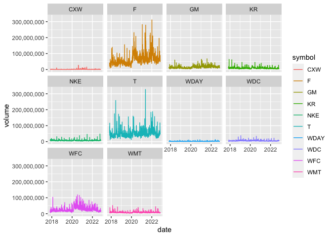

```r
library(ggplot2)
library(readr)
library(knitr)
library(tidyverse)
```

```
## ── Attaching packages ─────────────────────────────────────── tidyverse 1.3.1 ──
```

```
## ✔ tibble  3.1.8     ✔ dplyr   1.0.8
## ✔ tidyr   1.2.0     ✔ stringr 1.4.0
## ✔ purrr   0.3.4     ✔ forcats 0.5.1
```

```
## ── Conflicts ────────────────────────────────────────── tidyverse_conflicts() ──
## ✖ dplyr::filter() masks stats::filter()
## ✖ dplyr::lag()    masks stats::lag()
```

```r
library(dplyr)
library(forcats)
library(downloader)
library(corrplot)
```

```
## corrplot 0.92 loaded
```

```r
library(tidyquant)
```

```
## Loading required package: lubridate
```

```
## 
## Attaching package: 'lubridate'
```

```
## The following objects are masked from 'package:base':
## 
##     date, intersect, setdiff, union
```

```
## Loading required package: PerformanceAnalytics
```

```
## Loading required package: xts
```

```
## Loading required package: zoo
```

```
## 
## Attaching package: 'zoo'
```

```
## The following objects are masked from 'package:base':
## 
##     as.Date, as.Date.numeric
```

```
## 
## Attaching package: 'xts'
```

```
## The following objects are masked from 'package:dplyr':
## 
##     first, last
```

```
## 
## Attaching package: 'PerformanceAnalytics'
```

```
## The following object is masked from 'package:graphics':
## 
##     legend
```

```
## Loading required package: quantmod
```

```
## Loading required package: TTR
```

```
## Registered S3 method overwritten by 'quantmod':
##   method            from
##   as.zoo.data.frame zoo
```

```r
library(timetk)
library(dygraphs)
library(scales)
```

```
## 
## Attaching package: 'scales'
```

```
## The following object is masked from 'package:purrr':
## 
##     discard
```

```
## The following object is masked from 'package:readr':
## 
##     col_factor
```


```r
tickers_today <- tq_get(c("CXW", "F", "GM", "JCP", "KR", "WDC", "NKE","T", "WDAY", "WFC", "WMT"), get = "stock.prices", from = today()-years(5), to = today())
```

```
## Warning: x = 'JCP', get = 'stock.prices': Error in getSymbols.yahoo(Symbols = "JCP", env = <environment>, verbose = FALSE, : Unable to import "JCP".
## JCP download failed after two attempts. Error message:
## HTTP error 404.
##  Removing JCP.
```

```r
head(tickers_today)
```

```
## # A tibble: 6 × 8
##   symbol date        open  high   low close  volume adjusted
##   <chr>  <date>     <dbl> <dbl> <dbl> <dbl>   <dbl>    <dbl>
## 1 CXW    2017-11-02  24.6  25.1  24.5  24.6  842600     19.5
## 2 CXW    2017-11-03  24.5  24.7  24.4  24.5  502900     19.4
## 3 CXW    2017-11-06  24.7  25.2  24.5  24.9  588400     19.7
## 4 CXW    2017-11-07  24.9  25.3  24.7  25.0  581300     19.8
## 5 CXW    2017-11-08  24.9  26.1  24.8  26.0 1017500     20.6
## 6 CXW    2017-11-09  26    26.5  25.7  25.8 1092800     20.4
```
Graph setup

```r
setup <- tickers_today %>%
  select(symbol, date, adjusted) %>%
  pivot_wider(names_from = symbol, values_from = adjusted) %>%
  tk_xts(date_var = date)
```

```
## Warning: Non-numeric columns being dropped: date
```

```r
dygraph(setup, main = "Ticker Chart") %>%
  dyRebase(percent = TRUE) %>%
  dyShading(from = today()-years(5), to = today()) %>%
  dyRangeSelector()
```

```{=html}
<div id="htmlwidget-a3ef45f059d34493aa84" style="width:672px;height:480px;" class="dygraphs html-widget"></div>
<script type="application/json" data-for="htmlwidget-a3ef45f059d34493aa84">{"x":{"attrs":{"title":"Ticker Chart","labels":["day","CXW","F","GM","KR","WDC","NKE","T","WDAY","WFC","WMT"],"legend":"auto","retainDateWindow":false,"axes":{"x":{"pixelsPerLabel":60}},"showRangeSelector":true,"rangeSelectorHeight":40,"rangeSelectorPlotFillColor":" #A7B1C4","rangeSelectorPlotStrokeColor":"#808FAB","interactionModel":"Dygraph.Interaction.defaultModel"},"scale":"daily","annotations":[],"shadings":[{"from":"2017-11-02T00:00:00.000Z","to":"2022-11-02T00:00:00.000Z","color":"#EFEFEF","axis":"x"}],"events":[],"format":"date","data":[["2017-11-02T00:00:00.000Z","2017-11-03T00:00:00.000Z","2017-11-06T00:00:00.000Z","2017-11-07T00:00:00.000Z","2017-11-08T00:00:00.000Z","2017-11-09T00:00:00.000Z","2017-11-10T00:00:00.000Z","2017-11-13T00:00:00.000Z","2017-11-14T00:00:00.000Z","2017-11-15T00:00:00.000Z","2017-11-16T00:00:00.000Z","2017-11-17T00:00:00.000Z","2017-11-20T00:00:00.000Z","2017-11-21T00:00:00.000Z","2017-11-22T00:00:00.000Z","2017-11-24T00:00:00.000Z","2017-11-27T00:00:00.000Z","2017-11-28T00:00:00.000Z","2017-11-29T00:00:00.000Z","2017-11-30T00:00:00.000Z","2017-12-01T00:00:00.000Z","2017-12-04T00:00:00.000Z","2017-12-05T00:00:00.000Z","2017-12-06T00:00:00.000Z","2017-12-07T00:00:00.000Z","2017-12-08T00:00:00.000Z","2017-12-11T00:00:00.000Z","2017-12-12T00:00:00.000Z","2017-12-13T00:00:00.000Z","2017-12-14T00:00:00.000Z","2017-12-15T00:00:00.000Z","2017-12-18T00:00:00.000Z","2017-12-19T00:00:00.000Z","2017-12-20T00:00:00.000Z","2017-12-21T00:00:00.000Z","2017-12-22T00:00:00.000Z","2017-12-26T00:00:00.000Z","2017-12-27T00:00:00.000Z","2017-12-28T00:00:00.000Z","2017-12-29T00:00:00.000Z","2018-01-02T00:00:00.000Z","2018-01-03T00:00:00.000Z","2018-01-04T00:00:00.000Z","2018-01-05T00:00:00.000Z","2018-01-08T00:00:00.000Z","2018-01-09T00:00:00.000Z","2018-01-10T00:00:00.000Z","2018-01-11T00:00:00.000Z","2018-01-12T00:00:00.000Z","2018-01-16T00:00:00.000Z","2018-01-17T00:00:00.000Z","2018-01-18T00:00:00.000Z","2018-01-19T00:00:00.000Z","2018-01-22T00:00:00.000Z","2018-01-23T00:00:00.000Z","2018-01-24T00:00:00.000Z","2018-01-25T00:00:00.000Z","2018-01-26T00:00:00.000Z","2018-01-29T00:00:00.000Z","2018-01-30T00:00:00.000Z","2018-01-31T00:00:00.000Z","2018-02-01T00:00:00.000Z","2018-02-02T00:00:00.000Z","2018-02-05T00:00:00.000Z","2018-02-06T00:00:00.000Z","2018-02-07T00:00:00.000Z","2018-02-08T00:00:00.000Z","2018-02-09T00:00:00.000Z","2018-02-12T00:00:00.000Z","2018-02-13T00:00:00.000Z","2018-02-14T00:00:00.000Z","2018-02-15T00:00:00.000Z","2018-02-16T00:00:00.000Z","2018-02-20T00:00:00.000Z","2018-02-21T00:00:00.000Z","2018-02-22T00:00:00.000Z","2018-02-23T00:00:00.000Z","2018-02-26T00:00:00.000Z","2018-02-27T00:00:00.000Z","2018-02-28T00:00:00.000Z","2018-03-01T00:00:00.000Z","2018-03-02T00:00:00.000Z","2018-03-05T00:00:00.000Z","2018-03-06T00:00:00.000Z","2018-03-07T00:00:00.000Z","2018-03-08T00:00:00.000Z","2018-03-09T00:00:00.000Z","2018-03-12T00:00:00.000Z","2018-03-13T00:00:00.000Z","2018-03-14T00:00:00.000Z","2018-03-15T00:00:00.000Z","2018-03-16T00:00:00.000Z","2018-03-19T00:00:00.000Z","2018-03-20T00:00:00.000Z","2018-03-21T00:00:00.000Z","2018-03-22T00:00:00.000Z","2018-03-23T00:00:00.000Z","2018-03-26T00:00:00.000Z","2018-03-27T00:00:00.000Z","2018-03-28T00:00:00.000Z","2018-03-29T00:00:00.000Z","2018-04-02T00:00:00.000Z","2018-04-03T00:00:00.000Z","2018-04-04T00:00:00.000Z","2018-04-05T00:00:00.000Z","2018-04-06T00:00:00.000Z","2018-04-09T00:00:00.000Z","2018-04-10T00:00:00.000Z","2018-04-11T00:00:00.000Z","2018-04-12T00:00:00.000Z","2018-04-13T00:00:00.000Z","2018-04-16T00:00:00.000Z","2018-04-17T00:00:00.000Z","2018-04-18T00:00:00.000Z","2018-04-19T00:00:00.000Z","2018-04-20T00:00:00.000Z","2018-04-23T00:00:00.000Z","2018-04-24T00:00:00.000Z","2018-04-25T00:00:00.000Z","2018-04-26T00:00:00.000Z","2018-04-27T00:00:00.000Z","2018-04-30T00:00:00.000Z","2018-05-01T00:00:00.000Z","2018-05-02T00:00:00.000Z","2018-05-03T00:00:00.000Z","2018-05-04T00:00:00.000Z","2018-05-07T00:00:00.000Z","2018-05-08T00:00:00.000Z","2018-05-09T00:00:00.000Z","2018-05-10T00:00:00.000Z","2018-05-11T00:00:00.000Z","2018-05-14T00:00:00.000Z","2018-05-15T00:00:00.000Z","2018-05-16T00:00:00.000Z","2018-05-17T00:00:00.000Z","2018-05-18T00:00:00.000Z","2018-05-21T00:00:00.000Z","2018-05-22T00:00:00.000Z","2018-05-23T00:00:00.000Z","2018-05-24T00:00:00.000Z","2018-05-25T00:00:00.000Z","2018-05-29T00:00:00.000Z","2018-05-30T00:00:00.000Z","2018-05-31T00:00:00.000Z","2018-06-01T00:00:00.000Z","2018-06-04T00:00:00.000Z","2018-06-05T00:00:00.000Z","2018-06-06T00:00:00.000Z","2018-06-07T00:00:00.000Z","2018-06-08T00:00:00.000Z","2018-06-11T00:00:00.000Z","2018-06-12T00:00:00.000Z","2018-06-13T00:00:00.000Z","2018-06-14T00:00:00.000Z","2018-06-15T00:00:00.000Z","2018-06-18T00:00:00.000Z","2018-06-19T00:00:00.000Z","2018-06-20T00:00:00.000Z","2018-06-21T00:00:00.000Z","2018-06-22T00:00:00.000Z","2018-06-25T00:00:00.000Z","2018-06-26T00:00:00.000Z","2018-06-27T00:00:00.000Z","2018-06-28T00:00:00.000Z","2018-06-29T00:00:00.000Z","2018-07-02T00:00:00.000Z","2018-07-03T00:00:00.000Z","2018-07-05T00:00:00.000Z","2018-07-06T00:00:00.000Z","2018-07-09T00:00:00.000Z","2018-07-10T00:00:00.000Z","2018-07-11T00:00:00.000Z","2018-07-12T00:00:00.000Z","2018-07-13T00:00:00.000Z","2018-07-16T00:00:00.000Z","2018-07-17T00:00:00.000Z","2018-07-18T00:00:00.000Z","2018-07-19T00:00:00.000Z","2018-07-20T00:00:00.000Z","2018-07-23T00:00:00.000Z","2018-07-24T00:00:00.000Z","2018-07-25T00:00:00.000Z","2018-07-26T00:00:00.000Z","2018-07-27T00:00:00.000Z","2018-07-30T00:00:00.000Z","2018-07-31T00:00:00.000Z","2018-08-01T00:00:00.000Z","2018-08-02T00:00:00.000Z","2018-08-03T00:00:00.000Z","2018-08-06T00:00:00.000Z","2018-08-07T00:00:00.000Z","2018-08-08T00:00:00.000Z","2018-08-09T00:00:00.000Z","2018-08-10T00:00:00.000Z","2018-08-13T00:00:00.000Z","2018-08-14T00:00:00.000Z","2018-08-15T00:00:00.000Z","2018-08-16T00:00:00.000Z","2018-08-17T00:00:00.000Z","2018-08-20T00:00:00.000Z","2018-08-21T00:00:00.000Z","2018-08-22T00:00:00.000Z","2018-08-23T00:00:00.000Z","2018-08-24T00:00:00.000Z","2018-08-27T00:00:00.000Z","2018-08-28T00:00:00.000Z","2018-08-29T00:00:00.000Z","2018-08-30T00:00:00.000Z","2018-08-31T00:00:00.000Z","2018-09-04T00:00:00.000Z","2018-09-05T00:00:00.000Z","2018-09-06T00:00:00.000Z","2018-09-07T00:00:00.000Z","2018-09-10T00:00:00.000Z","2018-09-11T00:00:00.000Z","2018-09-12T00:00:00.000Z","2018-09-13T00:00:00.000Z","2018-09-14T00:00:00.000Z","2018-09-17T00:00:00.000Z","2018-09-18T00:00:00.000Z","2018-09-19T00:00:00.000Z","2018-09-20T00:00:00.000Z","2018-09-21T00:00:00.000Z","2018-09-24T00:00:00.000Z","2018-09-25T00:00:00.000Z","2018-09-26T00:00:00.000Z","2018-09-27T00:00:00.000Z","2018-09-28T00:00:00.000Z","2018-10-01T00:00:00.000Z","2018-10-02T00:00:00.000Z","2018-10-03T00:00:00.000Z","2018-10-04T00:00:00.000Z","2018-10-05T00:00:00.000Z","2018-10-08T00:00:00.000Z","2018-10-09T00:00:00.000Z","2018-10-10T00:00:00.000Z","2018-10-11T00:00:00.000Z","2018-10-12T00:00:00.000Z","2018-10-15T00:00:00.000Z","2018-10-16T00:00:00.000Z","2018-10-17T00:00:00.000Z","2018-10-18T00:00:00.000Z","2018-10-19T00:00:00.000Z","2018-10-22T00:00:00.000Z","2018-10-23T00:00:00.000Z","2018-10-24T00:00:00.000Z","2018-10-25T00:00:00.000Z","2018-10-26T00:00:00.000Z","2018-10-29T00:00:00.000Z","2018-10-30T00:00:00.000Z","2018-10-31T00:00:00.000Z","2018-11-01T00:00:00.000Z","2018-11-02T00:00:00.000Z","2018-11-05T00:00:00.000Z","2018-11-06T00:00:00.000Z","2018-11-07T00:00:00.000Z","2018-11-08T00:00:00.000Z","2018-11-09T00:00:00.000Z","2018-11-12T00:00:00.000Z","2018-11-13T00:00:00.000Z","2018-11-14T00:00:00.000Z","2018-11-15T00:00:00.000Z","2018-11-16T00:00:00.000Z","2018-11-19T00:00:00.000Z","2018-11-20T00:00:00.000Z","2018-11-21T00:00:00.000Z","2018-11-23T00:00:00.000Z","2018-11-26T00:00:00.000Z","2018-11-27T00:00:00.000Z","2018-11-28T00:00:00.000Z","2018-11-29T00:00:00.000Z","2018-11-30T00:00:00.000Z","2018-12-03T00:00:00.000Z","2018-12-04T00:00:00.000Z","2018-12-06T00:00:00.000Z","2018-12-07T00:00:00.000Z","2018-12-10T00:00:00.000Z","2018-12-11T00:00:00.000Z","2018-12-12T00:00:00.000Z","2018-12-13T00:00:00.000Z","2018-12-14T00:00:00.000Z","2018-12-17T00:00:00.000Z","2018-12-18T00:00:00.000Z","2018-12-19T00:00:00.000Z","2018-12-20T00:00:00.000Z","2018-12-21T00:00:00.000Z","2018-12-24T00:00:00.000Z","2018-12-26T00:00:00.000Z","2018-12-27T00:00:00.000Z","2018-12-28T00:00:00.000Z","2018-12-31T00:00:00.000Z","2019-01-02T00:00:00.000Z","2019-01-03T00:00:00.000Z","2019-01-04T00:00:00.000Z","2019-01-07T00:00:00.000Z","2019-01-08T00:00:00.000Z","2019-01-09T00:00:00.000Z","2019-01-10T00:00:00.000Z","2019-01-11T00:00:00.000Z","2019-01-14T00:00:00.000Z","2019-01-15T00:00:00.000Z","2019-01-16T00:00:00.000Z","2019-01-17T00:00:00.000Z","2019-01-18T00:00:00.000Z","2019-01-22T00:00:00.000Z","2019-01-23T00:00:00.000Z","2019-01-24T00:00:00.000Z","2019-01-25T00:00:00.000Z","2019-01-28T00:00:00.000Z","2019-01-29T00:00:00.000Z","2019-01-30T00:00:00.000Z","2019-01-31T00:00:00.000Z","2019-02-01T00:00:00.000Z","2019-02-04T00:00:00.000Z","2019-02-05T00:00:00.000Z","2019-02-06T00:00:00.000Z","2019-02-07T00:00:00.000Z","2019-02-08T00:00:00.000Z","2019-02-11T00:00:00.000Z","2019-02-12T00:00:00.000Z","2019-02-13T00:00:00.000Z","2019-02-14T00:00:00.000Z","2019-02-15T00:00:00.000Z","2019-02-19T00:00:00.000Z","2019-02-20T00:00:00.000Z","2019-02-21T00:00:00.000Z","2019-02-22T00:00:00.000Z","2019-02-25T00:00:00.000Z","2019-02-26T00:00:00.000Z","2019-02-27T00:00:00.000Z","2019-02-28T00:00:00.000Z","2019-03-01T00:00:00.000Z","2019-03-04T00:00:00.000Z","2019-03-05T00:00:00.000Z","2019-03-06T00:00:00.000Z","2019-03-07T00:00:00.000Z","2019-03-08T00:00:00.000Z","2019-03-11T00:00:00.000Z","2019-03-12T00:00:00.000Z","2019-03-13T00:00:00.000Z","2019-03-14T00:00:00.000Z","2019-03-15T00:00:00.000Z","2019-03-18T00:00:00.000Z","2019-03-19T00:00:00.000Z","2019-03-20T00:00:00.000Z","2019-03-21T00:00:00.000Z","2019-03-22T00:00:00.000Z","2019-03-25T00:00:00.000Z","2019-03-26T00:00:00.000Z","2019-03-27T00:00:00.000Z","2019-03-28T00:00:00.000Z","2019-03-29T00:00:00.000Z","2019-04-01T00:00:00.000Z","2019-04-02T00:00:00.000Z","2019-04-03T00:00:00.000Z","2019-04-04T00:00:00.000Z","2019-04-05T00:00:00.000Z","2019-04-08T00:00:00.000Z","2019-04-09T00:00:00.000Z","2019-04-10T00:00:00.000Z","2019-04-11T00:00:00.000Z","2019-04-12T00:00:00.000Z","2019-04-15T00:00:00.000Z","2019-04-16T00:00:00.000Z","2019-04-17T00:00:00.000Z","2019-04-18T00:00:00.000Z","2019-04-22T00:00:00.000Z","2019-04-23T00:00:00.000Z","2019-04-24T00:00:00.000Z","2019-04-25T00:00:00.000Z","2019-04-26T00:00:00.000Z","2019-04-29T00:00:00.000Z","2019-04-30T00:00:00.000Z","2019-05-01T00:00:00.000Z","2019-05-02T00:00:00.000Z","2019-05-03T00:00:00.000Z","2019-05-06T00:00:00.000Z","2019-05-07T00:00:00.000Z","2019-05-08T00:00:00.000Z","2019-05-09T00:00:00.000Z","2019-05-10T00:00:00.000Z","2019-05-13T00:00:00.000Z","2019-05-14T00:00:00.000Z","2019-05-15T00:00:00.000Z","2019-05-16T00:00:00.000Z","2019-05-17T00:00:00.000Z","2019-05-20T00:00:00.000Z","2019-05-21T00:00:00.000Z","2019-05-22T00:00:00.000Z","2019-05-23T00:00:00.000Z","2019-05-24T00:00:00.000Z","2019-05-28T00:00:00.000Z","2019-05-29T00:00:00.000Z","2019-05-30T00:00:00.000Z","2019-05-31T00:00:00.000Z","2019-06-03T00:00:00.000Z","2019-06-04T00:00:00.000Z","2019-06-05T00:00:00.000Z","2019-06-06T00:00:00.000Z","2019-06-07T00:00:00.000Z","2019-06-10T00:00:00.000Z","2019-06-11T00:00:00.000Z","2019-06-12T00:00:00.000Z","2019-06-13T00:00:00.000Z","2019-06-14T00:00:00.000Z","2019-06-17T00:00:00.000Z","2019-06-18T00:00:00.000Z","2019-06-19T00:00:00.000Z","2019-06-20T00:00:00.000Z","2019-06-21T00:00:00.000Z","2019-06-24T00:00:00.000Z","2019-06-25T00:00:00.000Z","2019-06-26T00:00:00.000Z","2019-06-27T00:00:00.000Z","2019-06-28T00:00:00.000Z","2019-07-01T00:00:00.000Z","2019-07-02T00:00:00.000Z","2019-07-03T00:00:00.000Z","2019-07-05T00:00:00.000Z","2019-07-08T00:00:00.000Z","2019-07-09T00:00:00.000Z","2019-07-10T00:00:00.000Z","2019-07-11T00:00:00.000Z","2019-07-12T00:00:00.000Z","2019-07-15T00:00:00.000Z","2019-07-16T00:00:00.000Z","2019-07-17T00:00:00.000Z","2019-07-18T00:00:00.000Z","2019-07-19T00:00:00.000Z","2019-07-22T00:00:00.000Z","2019-07-23T00:00:00.000Z","2019-07-24T00:00:00.000Z","2019-07-25T00:00:00.000Z","2019-07-26T00:00:00.000Z","2019-07-29T00:00:00.000Z","2019-07-30T00:00:00.000Z","2019-07-31T00:00:00.000Z","2019-08-01T00:00:00.000Z","2019-08-02T00:00:00.000Z","2019-08-05T00:00:00.000Z","2019-08-06T00:00:00.000Z","2019-08-07T00:00:00.000Z","2019-08-08T00:00:00.000Z","2019-08-09T00:00:00.000Z","2019-08-12T00:00:00.000Z","2019-08-13T00:00:00.000Z","2019-08-14T00:00:00.000Z","2019-08-15T00:00:00.000Z","2019-08-16T00:00:00.000Z","2019-08-19T00:00:00.000Z","2019-08-20T00:00:00.000Z","2019-08-21T00:00:00.000Z","2019-08-22T00:00:00.000Z","2019-08-23T00:00:00.000Z","2019-08-26T00:00:00.000Z","2019-08-27T00:00:00.000Z","2019-08-28T00:00:00.000Z","2019-08-29T00:00:00.000Z","2019-08-30T00:00:00.000Z","2019-09-03T00:00:00.000Z","2019-09-04T00:00:00.000Z","2019-09-05T00:00:00.000Z","2019-09-06T00:00:00.000Z","2019-09-09T00:00:00.000Z","2019-09-10T00:00:00.000Z","2019-09-11T00:00:00.000Z","2019-09-12T00:00:00.000Z","2019-09-13T00:00:00.000Z","2019-09-16T00:00:00.000Z","2019-09-17T00:00:00.000Z","2019-09-18T00:00:00.000Z","2019-09-19T00:00:00.000Z","2019-09-20T00:00:00.000Z","2019-09-23T00:00:00.000Z","2019-09-24T00:00:00.000Z","2019-09-25T00:00:00.000Z","2019-09-26T00:00:00.000Z","2019-09-27T00:00:00.000Z","2019-09-30T00:00:00.000Z","2019-10-01T00:00:00.000Z","2019-10-02T00:00:00.000Z","2019-10-03T00:00:00.000Z","2019-10-04T00:00:00.000Z","2019-10-07T00:00:00.000Z","2019-10-08T00:00:00.000Z","2019-10-09T00:00:00.000Z","2019-10-10T00:00:00.000Z","2019-10-11T00:00:00.000Z","2019-10-14T00:00:00.000Z","2019-10-15T00:00:00.000Z","2019-10-16T00:00:00.000Z","2019-10-17T00:00:00.000Z","2019-10-18T00:00:00.000Z","2019-10-21T00:00:00.000Z","2019-10-22T00:00:00.000Z","2019-10-23T00:00:00.000Z","2019-10-24T00:00:00.000Z","2019-10-25T00:00:00.000Z","2019-10-28T00:00:00.000Z","2019-10-29T00:00:00.000Z","2019-10-30T00:00:00.000Z","2019-10-31T00:00:00.000Z","2019-11-01T00:00:00.000Z","2019-11-04T00:00:00.000Z","2019-11-05T00:00:00.000Z","2019-11-06T00:00:00.000Z","2019-11-07T00:00:00.000Z","2019-11-08T00:00:00.000Z","2019-11-11T00:00:00.000Z","2019-11-12T00:00:00.000Z","2019-11-13T00:00:00.000Z","2019-11-14T00:00:00.000Z","2019-11-15T00:00:00.000Z","2019-11-18T00:00:00.000Z","2019-11-19T00:00:00.000Z","2019-11-20T00:00:00.000Z","2019-11-21T00:00:00.000Z","2019-11-22T00:00:00.000Z","2019-11-25T00:00:00.000Z","2019-11-26T00:00:00.000Z","2019-11-27T00:00:00.000Z","2019-11-29T00:00:00.000Z","2019-12-02T00:00:00.000Z","2019-12-03T00:00:00.000Z","2019-12-04T00:00:00.000Z","2019-12-05T00:00:00.000Z","2019-12-06T00:00:00.000Z","2019-12-09T00:00:00.000Z","2019-12-10T00:00:00.000Z","2019-12-11T00:00:00.000Z","2019-12-12T00:00:00.000Z","2019-12-13T00:00:00.000Z","2019-12-16T00:00:00.000Z","2019-12-17T00:00:00.000Z","2019-12-18T00:00:00.000Z","2019-12-19T00:00:00.000Z","2019-12-20T00:00:00.000Z","2019-12-23T00:00:00.000Z","2019-12-24T00:00:00.000Z","2019-12-26T00:00:00.000Z","2019-12-27T00:00:00.000Z","2019-12-30T00:00:00.000Z","2019-12-31T00:00:00.000Z","2020-01-02T00:00:00.000Z","2020-01-03T00:00:00.000Z","2020-01-06T00:00:00.000Z","2020-01-07T00:00:00.000Z","2020-01-08T00:00:00.000Z","2020-01-09T00:00:00.000Z","2020-01-10T00:00:00.000Z","2020-01-13T00:00:00.000Z","2020-01-14T00:00:00.000Z","2020-01-15T00:00:00.000Z","2020-01-16T00:00:00.000Z","2020-01-17T00:00:00.000Z","2020-01-21T00:00:00.000Z","2020-01-22T00:00:00.000Z","2020-01-23T00:00:00.000Z","2020-01-24T00:00:00.000Z","2020-01-27T00:00:00.000Z","2020-01-28T00:00:00.000Z","2020-01-29T00:00:00.000Z","2020-01-30T00:00:00.000Z","2020-01-31T00:00:00.000Z","2020-02-03T00:00:00.000Z","2020-02-04T00:00:00.000Z","2020-02-05T00:00:00.000Z","2020-02-06T00:00:00.000Z","2020-02-07T00:00:00.000Z","2020-02-10T00:00:00.000Z","2020-02-11T00:00:00.000Z","2020-02-12T00:00:00.000Z","2020-02-13T00:00:00.000Z","2020-02-14T00:00:00.000Z","2020-02-18T00:00:00.000Z","2020-02-19T00:00:00.000Z","2020-02-20T00:00:00.000Z","2020-02-21T00:00:00.000Z","2020-02-24T00:00:00.000Z","2020-02-25T00:00:00.000Z","2020-02-26T00:00:00.000Z","2020-02-27T00:00:00.000Z","2020-02-28T00:00:00.000Z","2020-03-02T00:00:00.000Z","2020-03-03T00:00:00.000Z","2020-03-04T00:00:00.000Z","2020-03-05T00:00:00.000Z","2020-03-06T00:00:00.000Z","2020-03-09T00:00:00.000Z","2020-03-10T00:00:00.000Z","2020-03-11T00:00:00.000Z","2020-03-12T00:00:00.000Z","2020-03-13T00:00:00.000Z","2020-03-16T00:00:00.000Z","2020-03-17T00:00:00.000Z","2020-03-18T00:00:00.000Z","2020-03-19T00:00:00.000Z","2020-03-20T00:00:00.000Z","2020-03-23T00:00:00.000Z","2020-03-24T00:00:00.000Z","2020-03-25T00:00:00.000Z","2020-03-26T00:00:00.000Z","2020-03-27T00:00:00.000Z","2020-03-30T00:00:00.000Z","2020-03-31T00:00:00.000Z","2020-04-01T00:00:00.000Z","2020-04-02T00:00:00.000Z","2020-04-03T00:00:00.000Z","2020-04-06T00:00:00.000Z","2020-04-07T00:00:00.000Z","2020-04-08T00:00:00.000Z","2020-04-09T00:00:00.000Z","2020-04-13T00:00:00.000Z","2020-04-14T00:00:00.000Z","2020-04-15T00:00:00.000Z","2020-04-16T00:00:00.000Z","2020-04-17T00:00:00.000Z","2020-04-20T00:00:00.000Z","2020-04-21T00:00:00.000Z","2020-04-22T00:00:00.000Z","2020-04-23T00:00:00.000Z","2020-04-24T00:00:00.000Z","2020-04-27T00:00:00.000Z","2020-04-28T00:00:00.000Z","2020-04-29T00:00:00.000Z","2020-04-30T00:00:00.000Z","2020-05-01T00:00:00.000Z","2020-05-04T00:00:00.000Z","2020-05-05T00:00:00.000Z","2020-05-06T00:00:00.000Z","2020-05-07T00:00:00.000Z","2020-05-08T00:00:00.000Z","2020-05-11T00:00:00.000Z","2020-05-12T00:00:00.000Z","2020-05-13T00:00:00.000Z","2020-05-14T00:00:00.000Z","2020-05-15T00:00:00.000Z","2020-05-18T00:00:00.000Z","2020-05-19T00:00:00.000Z","2020-05-20T00:00:00.000Z","2020-05-21T00:00:00.000Z","2020-05-22T00:00:00.000Z","2020-05-26T00:00:00.000Z","2020-05-27T00:00:00.000Z","2020-05-28T00:00:00.000Z","2020-05-29T00:00:00.000Z","2020-06-01T00:00:00.000Z","2020-06-02T00:00:00.000Z","2020-06-03T00:00:00.000Z","2020-06-04T00:00:00.000Z","2020-06-05T00:00:00.000Z","2020-06-08T00:00:00.000Z","2020-06-09T00:00:00.000Z","2020-06-10T00:00:00.000Z","2020-06-11T00:00:00.000Z","2020-06-12T00:00:00.000Z","2020-06-15T00:00:00.000Z","2020-06-16T00:00:00.000Z","2020-06-17T00:00:00.000Z","2020-06-18T00:00:00.000Z","2020-06-19T00:00:00.000Z","2020-06-22T00:00:00.000Z","2020-06-23T00:00:00.000Z","2020-06-24T00:00:00.000Z","2020-06-25T00:00:00.000Z","2020-06-26T00:00:00.000Z","2020-06-29T00:00:00.000Z","2020-06-30T00:00:00.000Z","2020-07-01T00:00:00.000Z","2020-07-02T00:00:00.000Z","2020-07-06T00:00:00.000Z","2020-07-07T00:00:00.000Z","2020-07-08T00:00:00.000Z","2020-07-09T00:00:00.000Z","2020-07-10T00:00:00.000Z","2020-07-13T00:00:00.000Z","2020-07-14T00:00:00.000Z","2020-07-15T00:00:00.000Z","2020-07-16T00:00:00.000Z","2020-07-17T00:00:00.000Z","2020-07-20T00:00:00.000Z","2020-07-21T00:00:00.000Z","2020-07-22T00:00:00.000Z","2020-07-23T00:00:00.000Z","2020-07-24T00:00:00.000Z","2020-07-27T00:00:00.000Z","2020-07-28T00:00:00.000Z","2020-07-29T00:00:00.000Z","2020-07-30T00:00:00.000Z","2020-07-31T00:00:00.000Z","2020-08-03T00:00:00.000Z","2020-08-04T00:00:00.000Z","2020-08-05T00:00:00.000Z","2020-08-06T00:00:00.000Z","2020-08-07T00:00:00.000Z","2020-08-10T00:00:00.000Z","2020-08-11T00:00:00.000Z","2020-08-12T00:00:00.000Z","2020-08-13T00:00:00.000Z","2020-08-14T00:00:00.000Z","2020-08-17T00:00:00.000Z","2020-08-18T00:00:00.000Z","2020-08-19T00:00:00.000Z","2020-08-20T00:00:00.000Z","2020-08-21T00:00:00.000Z","2020-08-24T00:00:00.000Z","2020-08-25T00:00:00.000Z","2020-08-26T00:00:00.000Z","2020-08-27T00:00:00.000Z","2020-08-28T00:00:00.000Z","2020-08-31T00:00:00.000Z","2020-09-01T00:00:00.000Z","2020-09-02T00:00:00.000Z","2020-09-03T00:00:00.000Z","2020-09-04T00:00:00.000Z","2020-09-08T00:00:00.000Z","2020-09-09T00:00:00.000Z","2020-09-10T00:00:00.000Z","2020-09-11T00:00:00.000Z","2020-09-14T00:00:00.000Z","2020-09-15T00:00:00.000Z","2020-09-16T00:00:00.000Z","2020-09-17T00:00:00.000Z","2020-09-18T00:00:00.000Z","2020-09-21T00:00:00.000Z","2020-09-22T00:00:00.000Z","2020-09-23T00:00:00.000Z","2020-09-24T00:00:00.000Z","2020-09-25T00:00:00.000Z","2020-09-28T00:00:00.000Z","2020-09-29T00:00:00.000Z","2020-09-30T00:00:00.000Z","2020-10-01T00:00:00.000Z","2020-10-02T00:00:00.000Z","2020-10-05T00:00:00.000Z","2020-10-06T00:00:00.000Z","2020-10-07T00:00:00.000Z","2020-10-08T00:00:00.000Z","2020-10-09T00:00:00.000Z","2020-10-12T00:00:00.000Z","2020-10-13T00:00:00.000Z","2020-10-14T00:00:00.000Z","2020-10-15T00:00:00.000Z","2020-10-16T00:00:00.000Z","2020-10-19T00:00:00.000Z","2020-10-20T00:00:00.000Z","2020-10-21T00:00:00.000Z","2020-10-22T00:00:00.000Z","2020-10-23T00:00:00.000Z","2020-10-26T00:00:00.000Z","2020-10-27T00:00:00.000Z","2020-10-28T00:00:00.000Z","2020-10-29T00:00:00.000Z","2020-10-30T00:00:00.000Z","2020-11-02T00:00:00.000Z","2020-11-03T00:00:00.000Z","2020-11-04T00:00:00.000Z","2020-11-05T00:00:00.000Z","2020-11-06T00:00:00.000Z","2020-11-09T00:00:00.000Z","2020-11-10T00:00:00.000Z","2020-11-11T00:00:00.000Z","2020-11-12T00:00:00.000Z","2020-11-13T00:00:00.000Z","2020-11-16T00:00:00.000Z","2020-11-17T00:00:00.000Z","2020-11-18T00:00:00.000Z","2020-11-19T00:00:00.000Z","2020-11-20T00:00:00.000Z","2020-11-23T00:00:00.000Z","2020-11-24T00:00:00.000Z","2020-11-25T00:00:00.000Z","2020-11-27T00:00:00.000Z","2020-11-30T00:00:00.000Z","2020-12-01T00:00:00.000Z","2020-12-02T00:00:00.000Z","2020-12-03T00:00:00.000Z","2020-12-04T00:00:00.000Z","2020-12-07T00:00:00.000Z","2020-12-08T00:00:00.000Z","2020-12-09T00:00:00.000Z","2020-12-10T00:00:00.000Z","2020-12-11T00:00:00.000Z","2020-12-14T00:00:00.000Z","2020-12-15T00:00:00.000Z","2020-12-16T00:00:00.000Z","2020-12-17T00:00:00.000Z","2020-12-18T00:00:00.000Z","2020-12-21T00:00:00.000Z","2020-12-22T00:00:00.000Z","2020-12-23T00:00:00.000Z","2020-12-24T00:00:00.000Z","2020-12-28T00:00:00.000Z","2020-12-29T00:00:00.000Z","2020-12-30T00:00:00.000Z","2020-12-31T00:00:00.000Z","2021-01-04T00:00:00.000Z","2021-01-05T00:00:00.000Z","2021-01-06T00:00:00.000Z","2021-01-07T00:00:00.000Z","2021-01-08T00:00:00.000Z","2021-01-11T00:00:00.000Z","2021-01-12T00:00:00.000Z","2021-01-13T00:00:00.000Z","2021-01-14T00:00:00.000Z","2021-01-15T00:00:00.000Z","2021-01-19T00:00:00.000Z","2021-01-20T00:00:00.000Z","2021-01-21T00:00:00.000Z","2021-01-22T00:00:00.000Z","2021-01-25T00:00:00.000Z","2021-01-26T00:00:00.000Z","2021-01-27T00:00:00.000Z","2021-01-28T00:00:00.000Z","2021-01-29T00:00:00.000Z","2021-02-01T00:00:00.000Z","2021-02-02T00:00:00.000Z","2021-02-03T00:00:00.000Z","2021-02-04T00:00:00.000Z","2021-02-05T00:00:00.000Z","2021-02-08T00:00:00.000Z","2021-02-09T00:00:00.000Z","2021-02-10T00:00:00.000Z","2021-02-11T00:00:00.000Z","2021-02-12T00:00:00.000Z","2021-02-16T00:00:00.000Z","2021-02-17T00:00:00.000Z","2021-02-18T00:00:00.000Z","2021-02-19T00:00:00.000Z","2021-02-22T00:00:00.000Z","2021-02-23T00:00:00.000Z","2021-02-24T00:00:00.000Z","2021-02-25T00:00:00.000Z","2021-02-26T00:00:00.000Z","2021-03-01T00:00:00.000Z","2021-03-02T00:00:00.000Z","2021-03-03T00:00:00.000Z","2021-03-04T00:00:00.000Z","2021-03-05T00:00:00.000Z","2021-03-08T00:00:00.000Z","2021-03-09T00:00:00.000Z","2021-03-10T00:00:00.000Z","2021-03-11T00:00:00.000Z","2021-03-12T00:00:00.000Z","2021-03-15T00:00:00.000Z","2021-03-16T00:00:00.000Z","2021-03-17T00:00:00.000Z","2021-03-18T00:00:00.000Z","2021-03-19T00:00:00.000Z","2021-03-22T00:00:00.000Z","2021-03-23T00:00:00.000Z","2021-03-24T00:00:00.000Z","2021-03-25T00:00:00.000Z","2021-03-26T00:00:00.000Z","2021-03-29T00:00:00.000Z","2021-03-30T00:00:00.000Z","2021-03-31T00:00:00.000Z","2021-04-01T00:00:00.000Z","2021-04-05T00:00:00.000Z","2021-04-06T00:00:00.000Z","2021-04-07T00:00:00.000Z","2021-04-08T00:00:00.000Z","2021-04-09T00:00:00.000Z","2021-04-12T00:00:00.000Z","2021-04-13T00:00:00.000Z","2021-04-14T00:00:00.000Z","2021-04-15T00:00:00.000Z","2021-04-16T00:00:00.000Z","2021-04-19T00:00:00.000Z","2021-04-20T00:00:00.000Z","2021-04-21T00:00:00.000Z","2021-04-22T00:00:00.000Z","2021-04-23T00:00:00.000Z","2021-04-26T00:00:00.000Z","2021-04-27T00:00:00.000Z","2021-04-28T00:00:00.000Z","2021-04-29T00:00:00.000Z","2021-04-30T00:00:00.000Z","2021-05-03T00:00:00.000Z","2021-05-04T00:00:00.000Z","2021-05-05T00:00:00.000Z","2021-05-06T00:00:00.000Z","2021-05-07T00:00:00.000Z","2021-05-10T00:00:00.000Z","2021-05-11T00:00:00.000Z","2021-05-12T00:00:00.000Z","2021-05-13T00:00:00.000Z","2021-05-14T00:00:00.000Z","2021-05-17T00:00:00.000Z","2021-05-18T00:00:00.000Z","2021-05-19T00:00:00.000Z","2021-05-20T00:00:00.000Z","2021-05-21T00:00:00.000Z","2021-05-24T00:00:00.000Z","2021-05-25T00:00:00.000Z","2021-05-26T00:00:00.000Z","2021-05-27T00:00:00.000Z","2021-05-28T00:00:00.000Z","2021-06-01T00:00:00.000Z","2021-06-02T00:00:00.000Z","2021-06-03T00:00:00.000Z","2021-06-04T00:00:00.000Z","2021-06-07T00:00:00.000Z","2021-06-08T00:00:00.000Z","2021-06-09T00:00:00.000Z","2021-06-10T00:00:00.000Z","2021-06-11T00:00:00.000Z","2021-06-14T00:00:00.000Z","2021-06-15T00:00:00.000Z","2021-06-16T00:00:00.000Z","2021-06-17T00:00:00.000Z","2021-06-18T00:00:00.000Z","2021-06-21T00:00:00.000Z","2021-06-22T00:00:00.000Z","2021-06-23T00:00:00.000Z","2021-06-24T00:00:00.000Z","2021-06-25T00:00:00.000Z","2021-06-28T00:00:00.000Z","2021-06-29T00:00:00.000Z","2021-06-30T00:00:00.000Z","2021-07-01T00:00:00.000Z","2021-07-02T00:00:00.000Z","2021-07-06T00:00:00.000Z","2021-07-07T00:00:00.000Z","2021-07-08T00:00:00.000Z","2021-07-09T00:00:00.000Z","2021-07-12T00:00:00.000Z","2021-07-13T00:00:00.000Z","2021-07-14T00:00:00.000Z","2021-07-15T00:00:00.000Z","2021-07-16T00:00:00.000Z","2021-07-19T00:00:00.000Z","2021-07-20T00:00:00.000Z","2021-07-21T00:00:00.000Z","2021-07-22T00:00:00.000Z","2021-07-23T00:00:00.000Z","2021-07-26T00:00:00.000Z","2021-07-27T00:00:00.000Z","2021-07-28T00:00:00.000Z","2021-07-29T00:00:00.000Z","2021-07-30T00:00:00.000Z","2021-08-02T00:00:00.000Z","2021-08-03T00:00:00.000Z","2021-08-04T00:00:00.000Z","2021-08-05T00:00:00.000Z","2021-08-06T00:00:00.000Z","2021-08-09T00:00:00.000Z","2021-08-10T00:00:00.000Z","2021-08-11T00:00:00.000Z","2021-08-12T00:00:00.000Z","2021-08-13T00:00:00.000Z","2021-08-16T00:00:00.000Z","2021-08-17T00:00:00.000Z","2021-08-18T00:00:00.000Z","2021-08-19T00:00:00.000Z","2021-08-20T00:00:00.000Z","2021-08-23T00:00:00.000Z","2021-08-24T00:00:00.000Z","2021-08-25T00:00:00.000Z","2021-08-26T00:00:00.000Z","2021-08-27T00:00:00.000Z","2021-08-30T00:00:00.000Z","2021-08-31T00:00:00.000Z","2021-09-01T00:00:00.000Z","2021-09-02T00:00:00.000Z","2021-09-03T00:00:00.000Z","2021-09-07T00:00:00.000Z","2021-09-08T00:00:00.000Z","2021-09-09T00:00:00.000Z","2021-09-10T00:00:00.000Z","2021-09-13T00:00:00.000Z","2021-09-14T00:00:00.000Z","2021-09-15T00:00:00.000Z","2021-09-16T00:00:00.000Z","2021-09-17T00:00:00.000Z","2021-09-20T00:00:00.000Z","2021-09-21T00:00:00.000Z","2021-09-22T00:00:00.000Z","2021-09-23T00:00:00.000Z","2021-09-24T00:00:00.000Z","2021-09-27T00:00:00.000Z","2021-09-28T00:00:00.000Z","2021-09-29T00:00:00.000Z","2021-09-30T00:00:00.000Z","2021-10-01T00:00:00.000Z","2021-10-04T00:00:00.000Z","2021-10-05T00:00:00.000Z","2021-10-06T00:00:00.000Z","2021-10-07T00:00:00.000Z","2021-10-08T00:00:00.000Z","2021-10-11T00:00:00.000Z","2021-10-12T00:00:00.000Z","2021-10-13T00:00:00.000Z","2021-10-14T00:00:00.000Z","2021-10-15T00:00:00.000Z","2021-10-18T00:00:00.000Z","2021-10-19T00:00:00.000Z","2021-10-20T00:00:00.000Z","2021-10-21T00:00:00.000Z","2021-10-22T00:00:00.000Z","2021-10-25T00:00:00.000Z","2021-10-26T00:00:00.000Z","2021-10-27T00:00:00.000Z","2021-10-28T00:00:00.000Z","2021-10-29T00:00:00.000Z","2021-11-01T00:00:00.000Z","2021-11-02T00:00:00.000Z","2021-11-03T00:00:00.000Z","2021-11-04T00:00:00.000Z","2021-11-05T00:00:00.000Z","2021-11-08T00:00:00.000Z","2021-11-09T00:00:00.000Z","2021-11-10T00:00:00.000Z","2021-11-11T00:00:00.000Z","2021-11-12T00:00:00.000Z","2021-11-15T00:00:00.000Z","2021-11-16T00:00:00.000Z","2021-11-17T00:00:00.000Z","2021-11-18T00:00:00.000Z","2021-11-19T00:00:00.000Z","2021-11-22T00:00:00.000Z","2021-11-23T00:00:00.000Z","2021-11-24T00:00:00.000Z","2021-11-26T00:00:00.000Z","2021-11-29T00:00:00.000Z","2021-11-30T00:00:00.000Z","2021-12-01T00:00:00.000Z","2021-12-02T00:00:00.000Z","2021-12-03T00:00:00.000Z","2021-12-06T00:00:00.000Z","2021-12-07T00:00:00.000Z","2021-12-08T00:00:00.000Z","2021-12-09T00:00:00.000Z","2021-12-10T00:00:00.000Z","2021-12-13T00:00:00.000Z","2021-12-14T00:00:00.000Z","2021-12-15T00:00:00.000Z","2021-12-16T00:00:00.000Z","2021-12-17T00:00:00.000Z","2021-12-20T00:00:00.000Z","2021-12-21T00:00:00.000Z","2021-12-22T00:00:00.000Z","2021-12-23T00:00:00.000Z","2021-12-27T00:00:00.000Z","2021-12-28T00:00:00.000Z","2021-12-29T00:00:00.000Z","2021-12-30T00:00:00.000Z","2021-12-31T00:00:00.000Z","2022-01-03T00:00:00.000Z","2022-01-04T00:00:00.000Z","2022-01-05T00:00:00.000Z","2022-01-06T00:00:00.000Z","2022-01-07T00:00:00.000Z","2022-01-10T00:00:00.000Z","2022-01-11T00:00:00.000Z","2022-01-12T00:00:00.000Z","2022-01-13T00:00:00.000Z","2022-01-14T00:00:00.000Z","2022-01-18T00:00:00.000Z","2022-01-19T00:00:00.000Z","2022-01-20T00:00:00.000Z","2022-01-21T00:00:00.000Z","2022-01-24T00:00:00.000Z","2022-01-25T00:00:00.000Z","2022-01-26T00:00:00.000Z","2022-01-27T00:00:00.000Z","2022-01-28T00:00:00.000Z","2022-01-31T00:00:00.000Z","2022-02-01T00:00:00.000Z","2022-02-02T00:00:00.000Z","2022-02-03T00:00:00.000Z","2022-02-04T00:00:00.000Z","2022-02-07T00:00:00.000Z","2022-02-08T00:00:00.000Z","2022-02-09T00:00:00.000Z","2022-02-10T00:00:00.000Z","2022-02-11T00:00:00.000Z","2022-02-14T00:00:00.000Z","2022-02-15T00:00:00.000Z","2022-02-16T00:00:00.000Z","2022-02-17T00:00:00.000Z","2022-02-18T00:00:00.000Z","2022-02-22T00:00:00.000Z","2022-02-23T00:00:00.000Z","2022-02-24T00:00:00.000Z","2022-02-25T00:00:00.000Z","2022-02-28T00:00:00.000Z","2022-03-01T00:00:00.000Z","2022-03-02T00:00:00.000Z","2022-03-03T00:00:00.000Z","2022-03-04T00:00:00.000Z","2022-03-07T00:00:00.000Z","2022-03-08T00:00:00.000Z","2022-03-09T00:00:00.000Z","2022-03-10T00:00:00.000Z","2022-03-11T00:00:00.000Z","2022-03-14T00:00:00.000Z","2022-03-15T00:00:00.000Z","2022-03-16T00:00:00.000Z","2022-03-17T00:00:00.000Z","2022-03-18T00:00:00.000Z","2022-03-21T00:00:00.000Z","2022-03-22T00:00:00.000Z","2022-03-23T00:00:00.000Z","2022-03-24T00:00:00.000Z","2022-03-25T00:00:00.000Z","2022-03-28T00:00:00.000Z","2022-03-29T00:00:00.000Z","2022-03-30T00:00:00.000Z","2022-03-31T00:00:00.000Z","2022-04-01T00:00:00.000Z","2022-04-04T00:00:00.000Z","2022-04-05T00:00:00.000Z","2022-04-06T00:00:00.000Z","2022-04-07T00:00:00.000Z","2022-04-08T00:00:00.000Z","2022-04-11T00:00:00.000Z","2022-04-12T00:00:00.000Z","2022-04-13T00:00:00.000Z","2022-04-14T00:00:00.000Z","2022-04-18T00:00:00.000Z","2022-04-19T00:00:00.000Z","2022-04-20T00:00:00.000Z","2022-04-21T00:00:00.000Z","2022-04-22T00:00:00.000Z","2022-04-25T00:00:00.000Z","2022-04-26T00:00:00.000Z","2022-04-27T00:00:00.000Z","2022-04-28T00:00:00.000Z","2022-04-29T00:00:00.000Z","2022-05-02T00:00:00.000Z","2022-05-03T00:00:00.000Z","2022-05-04T00:00:00.000Z","2022-05-05T00:00:00.000Z","2022-05-06T00:00:00.000Z","2022-05-09T00:00:00.000Z","2022-05-10T00:00:00.000Z","2022-05-11T00:00:00.000Z","2022-05-12T00:00:00.000Z","2022-05-13T00:00:00.000Z","2022-05-16T00:00:00.000Z","2022-05-17T00:00:00.000Z","2022-05-18T00:00:00.000Z","2022-05-19T00:00:00.000Z","2022-05-20T00:00:00.000Z","2022-05-23T00:00:00.000Z","2022-05-24T00:00:00.000Z","2022-05-25T00:00:00.000Z","2022-05-26T00:00:00.000Z","2022-05-27T00:00:00.000Z","2022-05-31T00:00:00.000Z","2022-06-01T00:00:00.000Z","2022-06-02T00:00:00.000Z","2022-06-03T00:00:00.000Z","2022-06-06T00:00:00.000Z","2022-06-07T00:00:00.000Z","2022-06-08T00:00:00.000Z","2022-06-09T00:00:00.000Z","2022-06-10T00:00:00.000Z","2022-06-13T00:00:00.000Z","2022-06-14T00:00:00.000Z","2022-06-15T00:00:00.000Z","2022-06-16T00:00:00.000Z","2022-06-17T00:00:00.000Z","2022-06-21T00:00:00.000Z","2022-06-22T00:00:00.000Z","2022-06-23T00:00:00.000Z","2022-06-24T00:00:00.000Z","2022-06-27T00:00:00.000Z","2022-06-28T00:00:00.000Z","2022-06-29T00:00:00.000Z","2022-06-30T00:00:00.000Z","2022-07-01T00:00:00.000Z","2022-07-05T00:00:00.000Z","2022-07-06T00:00:00.000Z","2022-07-07T00:00:00.000Z","2022-07-08T00:00:00.000Z","2022-07-11T00:00:00.000Z","2022-07-12T00:00:00.000Z","2022-07-13T00:00:00.000Z","2022-07-14T00:00:00.000Z","2022-07-15T00:00:00.000Z","2022-07-18T00:00:00.000Z","2022-07-19T00:00:00.000Z","2022-07-20T00:00:00.000Z","2022-07-21T00:00:00.000Z","2022-07-22T00:00:00.000Z","2022-07-25T00:00:00.000Z","2022-07-26T00:00:00.000Z","2022-07-27T00:00:00.000Z","2022-07-28T00:00:00.000Z","2022-07-29T00:00:00.000Z","2022-08-01T00:00:00.000Z","2022-08-02T00:00:00.000Z","2022-08-03T00:00:00.000Z","2022-08-04T00:00:00.000Z","2022-08-05T00:00:00.000Z","2022-08-08T00:00:00.000Z","2022-08-09T00:00:00.000Z","2022-08-10T00:00:00.000Z","2022-08-11T00:00:00.000Z","2022-08-12T00:00:00.000Z","2022-08-15T00:00:00.000Z","2022-08-16T00:00:00.000Z","2022-08-17T00:00:00.000Z","2022-08-18T00:00:00.000Z","2022-08-19T00:00:00.000Z","2022-08-22T00:00:00.000Z","2022-08-23T00:00:00.000Z","2022-08-24T00:00:00.000Z","2022-08-25T00:00:00.000Z","2022-08-26T00:00:00.000Z","2022-08-29T00:00:00.000Z","2022-08-30T00:00:00.000Z","2022-08-31T00:00:00.000Z","2022-09-01T00:00:00.000Z","2022-09-02T00:00:00.000Z","2022-09-06T00:00:00.000Z","2022-09-07T00:00:00.000Z","2022-09-08T00:00:00.000Z","2022-09-09T00:00:00.000Z","2022-09-12T00:00:00.000Z","2022-09-13T00:00:00.000Z","2022-09-14T00:00:00.000Z","2022-09-15T00:00:00.000Z","2022-09-16T00:00:00.000Z","2022-09-19T00:00:00.000Z","2022-09-20T00:00:00.000Z","2022-09-21T00:00:00.000Z","2022-09-22T00:00:00.000Z","2022-09-23T00:00:00.000Z","2022-09-26T00:00:00.000Z","2022-09-27T00:00:00.000Z","2022-09-28T00:00:00.000Z","2022-09-29T00:00:00.000Z","2022-09-30T00:00:00.000Z","2022-10-03T00:00:00.000Z","2022-10-04T00:00:00.000Z","2022-10-05T00:00:00.000Z","2022-10-06T00:00:00.000Z","2022-10-07T00:00:00.000Z","2022-10-10T00:00:00.000Z","2022-10-11T00:00:00.000Z","2022-10-12T00:00:00.000Z","2022-10-13T00:00:00.000Z","2022-10-14T00:00:00.000Z","2022-10-17T00:00:00.000Z","2022-10-18T00:00:00.000Z","2022-10-19T00:00:00.000Z","2022-10-20T00:00:00.000Z","2022-10-21T00:00:00.000Z","2022-10-24T00:00:00.000Z","2022-10-25T00:00:00.000Z","2022-10-26T00:00:00.000Z","2022-10-27T00:00:00.000Z","2022-10-28T00:00:00.000Z","2022-10-31T00:00:00.000Z","2022-11-01T00:00:00.000Z"],[19.498705,19.427422,19.688778,19.791735,20.599564,20.449085,19.49078,19.300707,18.152327,18.350319,18.540401,18.382,18.382,18.255281,18.374079,18.215683,18.302803,18.564157,18.49288,18.619598,18.382,18.33448,17.80385,17.732569,17.867208,17.859289,17.487055,17.281139,17.24946,17.241541,17.487055,17.843449,17.582094,17.384096,17.534575,17.708811,17.740488,17.708811,17.708811,18.160816,18.201172,18.451389,18.233458,18.346457,19.008318,18.112389,17.515097,18.249603,18.015528,18.193104,17.934813,17.741096,18.03167,18.104315,17.950956,18.217314,18.386814,19.39575,18.61282,18.40296,18.733891,18.459461,18.007456,17.256807,16.724091,16.441593,16.078375,16.255949,16.320517,17.159954,17.482811,17.329451,17.200308,17.168024,17.458595,17.490883,17.846029,17.644239,16.780596,16.780596,17.20838,17.200308,17.184166,17.52317,17.563528,17.119596,17.369812,17.700741,17.555458,17.272955,17.216454,17.345594,16.77252,16.764448,16.92588,16.514235,15.7313,15.553728,15.666728,16.191378,16.100643,15.671733,16.348091,16.925474,17.024448,17.098684,17.181168,17.007954,16.867737,16.570797,16.455322,16.735764,16.884232,16.859489,16.777002,16.711016,16.628532,16.562548,16.752258,16.900728,17.07394,16.628532,16.859489,16.900728,17.379128,17.717308,17.832785,17.214163,16.966713,17.148178,17.214163,17.065695,16.917225,17.304895,16.950218,17.032698,17.370878,17.255407,17.395622,17.329639,17.395622,17.667818,17.882273,17.750299,17.874023,17.849279,17.775042,17.601831,17.651323,17.684315,17.700809,17.667818,17.230658,17.478107,17.692562,17.370878,17.511097,18.129721,18.583376,19.317476,19.647406,19.127764,18.962795,19.556673,20.069111,19.800291,19.993505,20.228724,19.993505,19.968306,20.144718,20.598352,20.68236,20.86717,20.774765,20.379936,20.413538,20.673956,20.640354,20.715961,20.631952,20.816769,21.085588,21.262001,21.488823,21.539223,21.530823,21.640032,21.337605,21.656834,21.673632,21.497221,21.186396,21.312405,21.077188,20.791567,20.472345,20.909174,21.228401,21.262001,21.446817,21.312405,20.976381,20.984779,21.320805,21.598026,21.564426,21.808043,21.749237,21.36281,21.572828,21.63163,20.993181,20.741163,20.615154,20.858772,21.11919,21.194799,21.438417,21.413214,21.295605,21.665232,21.077188,20.640354,20.489143,20.203522,20.295929,20.809099,20.620939,20.663702,20.552517,20.141975,20.005129,20.484091,20.655151,20.364351,20.013685,19.13274,19.175505,19.628807,19.774206,19.67157,19.979473,20.013685,20.347246,20.390009,20.697916,20.304482,20.184742,20.193295,19.209717,19.278139,19.397881,19.979473,18.636677,18.80773,18.970236,18.687992,19.423536,19.278139,18.867599,18.602465,18.320219,18.303112,18.174822,18.149162,18.439959,18.747862,18.277454,18.747862,18.824837,18.77352,19.06432,18.337326,18.961685,18.918922,18.722202,18.576805,18.362982,18.397196,17.969553,17.037291,17.182692,16.053713,16.438591,15.74581,15.138556,15.514881,15.087237,15.50633,15.620218,15.225987,15.339877,15.690301,15.918079,16.426195,16.653973,16.899271,17.07448,16.557606,16.794144,17.16209,17.056961,17.07448,16.724058,16.732821,16.811665,16.794144,16.855469,17.197132,17.144569,17.407387,17.083244,17.494995,17.573839,17.459951,17.643925,17.766575,17.775335,17.530035,17.600122,17.521275,17.819138,17.933025,18.695204,18.958021,19.308447,19.247122,18.922977,18.800329,18.555033,18.213366,18.458662,18.292212,17.451191,17.179611,17.065722,17.311022,17.07448,16.846708,16.820425,16.759098,16.759098,16.706535,16.618929,17.07448,16.811665,16.802904,17.109528,16.978117,17.293499,17.427906,17.669834,17.61607,17.78632,17.974485,18.216415,18.198494,17.875923,18.225376,18.162653,18.234337,18.458347,18.126814,18.395624,18.51211,18.234337,18.368742,18.422504,18.225376,18.422504,18.314981,18.646515,18.933245,18.583792,19.085571,19.166214,18.55691,18.288099,19.345421,19.605272,19.435026,19.354383,19.55151,19.829281,19.784479,19.856161,20.062252,20.01745,19.981607,20.00849,19.721756,19.452946,19.488787,19.623192,19.2827,19.390223,19.372303,19.820322,20.411707,20.716358,21.083735,21.262939,21.504868,21.325661,21.460068,21.567591,21.415264,21.325661,20.044331,19.883045,19.372303,18.521069,18.673393,19.002926,18.49032,18.49032,18.4354,18.545244,18.4354,17.977718,17.70311,16.650444,16.641291,16.412449,15.991382,16.119534,15.561162,15.222476,14.883794,15.414704,15.021098,14.462727,14.810565,14.838024,15.167557,15.533702,15.158401,15.195018,15.378088,15.963922,16.229378,16.494833,16.192762,16.156147,16.265989,15.725927,15.753387,16.174454,16.06461,15.890693,15.854076,15.817465,15.268246,15.762541,15.240785,15.57947,15.63439,15.515394,15.771695,15.908998,15.918152,15.835771,16.110378,16.384987,16.751131,16.531446,16.302605,16.384987,16.073767,16.018843,15.863231,15.890693,15.60693,15.826617,16.558908,16.320913,16.220222,16.220224,15.253392,14.906085,15.093819,15.412966,15.262779,14.849764,14.652643,14.173923,14.586936,14.708963,14.46491,14.371043,14.596323,14.389815,14.568163,14.971791,15.20646,14.915472,14.859151,14.643257,14.52123,14.52123,14.324109,14.746511,15.150138,14.896698,14.624483,14.953018,15.159525,14.962404,14.924858,14.66203,14.774671,14.502456,14.511843,14.417975,14.371043,14.164536,14.145761,14.164536,14.361656,14.455523,14.220855,14.004961,14.033121,14.173923,13.94864,14.126988,14.427362,14.324109,14.164536,14.399202,14.943631,15.056273,15.694567,15.994944,16.032488,16.370409,16.257769,16.276543,16.576918,16.445505,16.285931,16.314089,16.210836,15.526958,15.49806,15.430635,15.392107,14.987559,15.026088,15.295786,15.642542,15.825552,15.989298,15.604014,15.594381,15.54622,15.729231,15.632909,15.623277,15.950768,15.81592,15.81592,15.363211,15.459531,15.77739,16.201204,16.220469,15.979666,16.162676,16.326422,16.750233,16.278261,16.230101,16.326422,16.143412,16.576855,16.759867,16.220469,15.26689,15.536588,15.180201,14.265151,15.488428,15.13204,15.931506,15.738863,15.565485,14.255519,14.159197,12.743278,10.431572,11.65485,10.171505,11.38515,8.803746,9.603211,9.535786,8.408829,9.757324,9.892175,10.739799,10.999866,11.52,11.17,10.08,9.78,8.98,9.6,9.48,10.34,11.26,12.02,12.48,11.96,11.39,11.64,11.42,11.1,11.1,10.93,11.16,11.84,12.5,13.21,13.12,12.16,11.72,11.81,11.54,11,12.33,11.65,11,10.33,10.05,10.24,11.62,11.06,11.43,11.58,11.48,12.23,13.07,12.56,12.03,12.55,12.2,12.97,12.93,13.79,13.96,14.16,13.22,11.96,12.38,12.5,12.52,10.43,10.19,9.84,10.1,9.73,9.35,9.45,9.02,9.53,9.36,9.4,9.53,9.26,9.17,9.25,8.8,9.25,9.12,9.11,9.42,9.24,9.14,8.83,9.16,9.16,9.17,8.91,8.84,8.91,9.04,8.79,8.91,8.92,9.21,9.14,8.74,8.74,8.98,9.16,9.9,9.68,9.87,10.05,9.59,9.37,9.31,9.25,9.66,9.54,9.21,9.43,9.35,9.31,9.41,9.48,9.53,9.49,9.5,9.4,9.06,9.03,9.13,9.15,9.13,8.93,8.57,8.22,8.21,8,8,8.04,8.25,8.16,8,8.18,8.31,8.03,7.98,7.91,7.99,7.92,7.89,7.72,7.82,7.94,7.76,7.64,7.66,6.85,6.73,6.62,6.41,6,5.92,6.32,6.41,7.19,7.51,6.46,6.18,6,6.22,6.38,6.58,6.23,6.6,6.72,6.81,6.71,6.82,6.8,7.09,7.79,7.84,7.68,7.09,7.46,7.64,7.71,7.86,7.59,7.85,7.71,7.55,7.53,7.86,7.76,7.55,7.55,7.4,7.2,6.45,6.73,6.98,7.03,6.83,6.78,6.55,6.7,6.73,6.93,6.85,6.69,6.52,6.86,6.87,7.1,7.34,7.28,6.71,6.77,6.77,6.65,6.26,7.29,6.94,7.11,7.23,7.29,6.92,7.24,7.19,7.63,7.96,7.85,7.62,7.73,7.62,7.6,6.95,7.19,7.59,7.51,7.73,8.23,7.18,7.59,7.42,7.67,7.79,7.74,8.15,8.31,8.54,8.33,8.52,9.09,9.09,9.31,9.25,9.22,9.01,8.48,8.51,8.63,8.92,9.11,9.06,9.05,8.84,8.97,9.08,7.51,7.26,7.53,7.59,7.61,7.94,8.14,8.61,8.42,8.32,8.73,8.47,8.18,8.15,8.18,8,7.96,7.77,8.42,8.34,8.29,7.91,8.14,8.07,7.92,7.72,7.8,7.83,8.13,8.22,8.11,8.06,7.97,7.86,7.55,7.45,7.63,7.83,8.59,8.63,9.07,9.03,9.3,9.43,11.12,10.79,11.41,11.38,11.29,11.97,11.98,11.7,11.63,11.4,11.24,11.65,11.15,11,10.69,10.47,10.59,10.49,10.48,10.6,10.42,10.42,10.62,10.13,10.19,9.97,9.69,9.55,10.01,10.24,9.83,9.73,10.16,10.17,10.13,10.2,10.28,10.16,10.04,10.27,10.29,10.51,10.69,10.55,10.8,10.84,10.72,10.55,10.43,10.01,9.37,9.39,9.45,9.6,9.54,9.38,9.64,9.62,9.72,9.74,9.77,9.5,9.42,9.18,9.07,8.9,8.98,8.74,8.79,8.81,8.56,8.73,8.62,8.57,8.62,8.52,8.72,8.69,8.95,8.9,8.88,8.82,8.94,8.87,8.97,9.4,9.51,9.48,9.49,9.49,9.41,9.23,9.15,9.23,9.16,9,9,8.47,8.36,8.56,8.61,8.82,8.92,9.3,9.11,9.57,9.64,9.79,10.6,10.87,11.39,11.45,11.63,11.58,11.32,11.59,11.84,11.88,11.88,11.3,11.07,10.77,10.41,10.33,10.25,10.43,10.37,10.03,9.8,9.64,9.32,9.69,9.81,9.53,9.85,9.77,10.24,10.29,10.29,10.26,10.28,10.19,9.99,9.97,10.13,10.17,10.05,9.98,10.37,10.24,10.69,10.72,10.8,10.95,10.71,10.51,10.11,9.99,10.17,10.57,10.59,10.2,9.97,10.11,10.29,10.28,9.94,9.73,9.87,9.6,10.06,9.69,9.72,9.74,9.78,9.84,9.84,9.87,9.24,9.06,9,9.16,9.11,8.74,8.71,8.81,8.73,8.59,8.4,8.93,8.91,8.85,8.85,9.43,9.4,9.38,9.47,9.75,9.7,9.75,9.78,10.1,9.98,10.2,10.13,11.17,11.49,11.65,11.35,11.41,11.21,11.17,11.09,11.47,11.7,13.45,13.14,13.79,13.81,13.41,13.04,12.93,12.49,12.76,13,12.43,12.92,13.22,13.73,11.99,12.15,11.62,10.79,10.36,10.41,10.67,11.33,11.82,11.57,12.1,12.16,12.42,12.91,13.26,13.03,13,12.87,12.61,12.68,12.43,12.81,13.06,12.82,12.38,12.25,11.65,11.51,11.54,10.75,10.86,11.1,11,11.09,11.67,11.63,11.4,11.28,11.11,11.14,11.14,10.76,10.77,11.05,11.21,11.11,10.92,10.73,10.99,10.98,11.29,11.56,11.07,11,10.98,11.12,11.21,11.02,10.77,10.63,10.9,10.38,9.82,9.58,9.62,9.5,9.6,9.87,10.07,10.3,10.11,10.08,9.98,9.79,9.75,9.79,9.63,9.78,9.77,10.06,9.66,9.53,9.6,9.54,9.36,9.59,9.38,9.67,9.87,9.56,9.66,9.58,9.74,9.7,9.44,9.53,9.48,9.19,8.93,8.89,9.11,8.82,8.84,9.39,9.8,9.74,9.64,9.43,9.54,9.62,9.17,9.57,9.4,9.52,9.5,9.63,9.53,9.55,9.67,9.88,10.06,10.32,10.36,10.47,10.21],[10.402409,10.352158,10.327029,10.184646,10.100891,10.084139,10.059013,10.184646,10.067389,10.050637,10.084139,10.059013,10.159519,10.151144,10.109265,10.134395,10.142767,10.226523,10.519668,10.486167,10.53642,10.578296,10.410785,10.368908,10.49454,10.561544,10.53642,10.553169,10.578296,10.435912,10.53642,10.603423,10.62855,10.653676,10.578296,10.53642,10.553169,10.469415,10.53642,10.461039,10.603423,10.687179,10.871438,11.0557,11.013824,10.955194,10.913317,11.0222,11.080828,10.971947,10.201399,10.109265,10.050637,10.067389,10.017134,10.092516,9.69049,9.757494,9.542949,9.491458,9.414223,9.371313,9.191095,8.787752,9.234005,9.234005,8.950805,9.036624,9.182513,9.088115,9.216841,9.234005,9.105277,9.12244,9.096695,9.12244,9.182513,9.345568,9.105277,9.105277,8.830661,8.92506,9.079535,9.12244,9.12244,9.105277,9.208259,9.276913,9.251168,9.457131,9.50004,9.568695,9.448549,9.431386,9.525786,9.225423,9.062369,9.294078,9.294078,9.319822,9.508622,9.319822,9.568695,9.723167,9.740331,9.59444,9.654513,9.826148,9.808985,9.706002,9.680259,9.766075,9.766075,9.723167,9.531835,9.410077,9.601411,9.531835,9.662289,9.94059,9.99277,9.775349,9.792743,9.749258,9.740561,9.879711,9.862317,9.80144,9.618804,9.749258,9.731862,9.723167,9.757956,9.914499,9.966681,9.853621,10.010166,10.018863,9.949286,10.10583,10.010166,9.949286,10.044953,10.044953,10.184104,10.210196,10.288467,10.410225,10.462407,10.523286,10.462407,10.531981,10.453709,10.34065,10.331951,10.427618,10.34065,10.323255,10.184104,10.131922,10.00147,10.018863,9.931893,9.810135,9.6275,9.653591,9.557925,9.610106,9.618804,9.740561,9.784046,9.6275,9.610106,9.549228,9.436168,9.444865,9.453563,9.410077,9.313067,9.233693,9.321886,9.277791,8.72218,8.757459,8.880926,8.854468,8.730999,8.748638,8.854468,8.845648,8.889745,8.863286,8.739817,8.589892,8.342955,8.378231,8.334137,8.387052,8.422329,8.572255,8.695724,8.545795,8.492881,8.536977,8.81037,8.828011,8.792734,8.554616,8.360594,8.351775,8.369413,8.316498,8.17539,8.272403,8.210669,8.237124,8.263582,8.334137,8.422329,8.448787,8.625169,8.651627,8.686903,8.457606,8.281221,8.17539,8.140113,8.157753,8.219486,8.113657,8.051922,8.06956,8.043103,8.166572,7.893176,7.778526,7.769708,7.61978,7.769708,7.760889,7.725612,7.505133,7.496312,7.550178,7.711777,7.343693,8.07088,8.061902,8.331232,8.492829,8.573628,8.340211,8.421009,8.555672,8.564651,8.618517,8.492829,8.421009,8.519762,8.564651,8.564651,8.358166,8.124746,8.304299,8.133723,8.178612,8.196568,8.438964,8.331232,8.44794,8.412029,8.44794,8.618517,8.241458,8.097814,7.91826,7.648933,7.666888,7.756662,7.630977,7.648933,7.630977,7.604045,7.469379,7.415515,7.226985,6.849925,7.047432,7.047432,7.011522,6.867879,7.09232,6.984589,7.253917,7.442448,7.514268,7.828485,7.783596,7.91826,8.07088,7.936215,7.442448,7.505291,7.702798,7.630977,7.487335,7.720754,7.954171,7.774619,7.864396,7.955735,8.037941,7.96487,7.946602,7.992271,7.96487,7.590376,7.663447,7.608643,7.727386,7.681715,7.690848,7.800457,8.065344,8.165818,7.955735,7.955735,8.001406,8.111014,8.019674,8.01054,8.028809,8.047076,8.01054,7.836992,7.745652,7.690848,7.864395,7.82786,7.791322,7.681715,7.699983,7.82786,7.946602,7.773056,7.937467,7.800457,7.773056,8.001406,7.87353,8.01054,8.019674,8.202354,8.229756,8.339364,8.439838,8.448973,8.494642,8.412438,8.522044,8.576849,8.631653,8.522044,8.549446,8.677323,8.722994,8.677323,8.816531,8.881495,8.723727,9.661062,9.577537,9.698185,9.558977,9.596098,9.661062,9.62394,9.633221,9.596098,9.466171,9.633221,9.354804,9.503294,9.614661,9.651782,9.549696,9.540414,9.503294,9.252718,9.141352,9.12279,9.076386,9.011423,9.039265,8.835093,8.918617,9.206316,9.076386,9.048546,9.057827,9.113509,9.206316,9.141352,9.336244,9.261998,9.326962,9.373364,9.317682,9.317682,9.271278,9.234156,9.132071,9.197035,9.466171,9.494014,9.419768,9.391928,9.466171,9.466171,9.466171,9.410487,9.382646,9.456891,9.735307,9.670342,9.753868,9.586818,9.521853,9.466171,9.437914,9.5792,9.729905,9.004637,9.014054,9.042314,8.995217,8.976379,8.76916,8.740902,8.693807,8.929283,8.976379,9.004637,8.901026,8.750321,8.722065,8.477169,8.345302,8.43949,8.505424,8.43949,8.514845,8.514845,8.26053,8.307623,8.251111,8.477169,8.590197,8.637293,8.57136,8.665548,8.797417,8.797417,8.985798,8.87277,8.87277,8.86335,8.901026,8.759739,8.740902,8.712645,8.57136,8.637293,8.627873,8.580779,8.665548,8.609035,8.552521,8.627873,8.382977,8.109823,8.204015,8.232272,8.175758,8.04389,8.06273,8.119245,8.269948,8.307623,8.543101,8.543101,8.580779,8.750321,8.645011,8.683306,8.817337,8.233345,8.348229,8.242917,8.27164,8.175901,8.22377,8.510982,8.616291,8.635437,8.539701,8.510982,8.654585,8.69288,8.654585,8.434391,8.415243,8.568422,8.568422,8.520554,8.357801,8.338654,8.510982,8.616291,8.625864,8.712028,8.673733,8.625864,8.510982,8.568422,8.549274,8.635437,8.625864,8.683306,8.7216,8.922648,8.836484,8.989662,8.989662,9.133267,9.008811,9.075825,9.037531,9.066253,9.047104,8.960941,8.855631,8.903499,9.018385,8.817337,8.769468,8.855631,8.855631,8.865206,8.855631,8.846058,8.893927,8.798189,8.779043,8.769468,8.817337,8.769468,8.750321,8.616291,8.510982,8.587569,8.626514,8.607042,8.587568,8.743352,8.938083,8.09101,8.03259,7.896279,7.847598,7.886544,8.022854,8.03259,7.886544,7.847598,7.789178,7.818388,7.682077,7.370511,7.03947,7.019997,6.786322,6.776586,7.01026,6.786322,6.893423,6.562382,6.318971,5.744519,6.095032,5.744519,5.209013,5.481635,4.877974,4.877974,4.381413,4.352203,4.215892,3.904326,4.819554,5.247959,5.111649,5.05323,4.897446,4.702717,4.284048,4.245103,4.128264,4.410622,4.585879,4.897446,5.228486,5.02402,5.150594,4.897446,4.809817,4.985074,4.848763,4.644298,4.644298,4.761135,4.741663,5.033757,5.238223,5.121385,4.955865,4.790345,4.731926,4.839027,4.741663,4.741663,5.101912,4.985074,4.848763,4.595615,4.761135,4.770872,5.170067,5.160331,5.345324,5.481635,5.501108,5.6861,5.871093,5.695837,5.559526,5.71531,5.744519,6.026877,6.396863,7.146571,7.331564,7.049207,6.630538,5.968458,6.289761,6.328707,6.37739,6.163187,6.163187,6.065823,6.114505,5.987931,5.793201,5.871093,5.754255,5.851621,5.919775,5.822411,5.890566,6.026877,5.958721,5.929513,5.6861,5.939249,5.900303,6.192397,6.562382,6.679221,6.620801,6.48449,6.503963,6.659748,6.796058,6.698693,6.747375,6.825267,6.737639,6.562382,6.435809,6.5137,6.679221,6.776586,6.747375,6.679221,6.90316,7.03947,6.922632,6.844741,6.854477,6.796058,6.70843,6.688956,6.659748,6.48449,6.796058,6.757112,6.640275,6.727903,6.757112,6.640275,6.650011,6.766849,6.640275,6.718166,6.844741,6.786322,6.727903,6.815531,6.932369,6.854477,6.835004,7.088153,7.03947,6.688956,6.601328,6.465018,6.48449,6.338444,6.5137,6.426072,6.48449,6.57212,6.70843,6.835004,6.796058,7.03947,7.156307,7.058943,7.467875,7.555503,7.370511,7.419192,7.467875,7.389983,7.53603,7.643131,7.993645,7.944962,7.818388,7.711287,7.497084,7.691814,7.526293,7.506821,7.672341,7.438665,7.779442,7.584713,7.983908,8.159163,8.110482,7.993645,8.314947,8.568096,8.519414,8.587568,8.587568,8.509677,8.626514,9.200967,8.840717,8.850453,8.840717,8.9965,8.957555,8.967291,9.093866,8.977027,9.006238,9.200967,8.879663,8.782298,8.675198,8.908873,8.801771,8.840717,8.714143,8.69467,8.55836,8.75309,8.626514,8.655725,8.587568,8.626514,8.55836,8.295476,8.422048,8.607042,8.821244,8.762826,9.05492,9.52227,9.52227,9.901992,9.570953,9.755947,10.57381,11.226152,11.216417,10.992476,10.895113,10.505655,10.437498,10.252505,10.5446,10.57381,10.904849,11.07037,11.20668,11.255363,11.615613,11.450092,11.148262,11.148262,11.23589,11.17747,11.128789,11.274836,11.391673,11.313782,11.946653,11.450092,11.391673,11.664294,12.219274,11.849288,11.615613,11.946653,12.316638,12.238747,12.569786,12.472423,13.017665,12.852143,12.160855,12.355585,12.160855,12.491895,12.511369,11.888234,11.820079,11.995334,11.975863,11.829814,12.131645,11.927179,11.849288,12.36532,12.579522,12.39453,12.180327,12.180327,12.053754,11.878497,11.917441,11.917441,11.907705,11.790868,11.148262,11.420883,11.625348,11.897969,11.946653,12.160855,12.102436,10.963269,11.23589,11.323519,11.109315,11.304046,11.43062,11.508511,11.40141,11.274836,11.031424,11.245626,11.527984,11.829814,11.820079,11.790868,12.160855,12.978719,12.715835,12.472423,13.533698,14.487872,14.147095,14.419717,14.517081,15.568621,15.549149,15.46152,15.218106,15.07206,14.71181,14.877331,14.478135,14.604711,14.624184,14.380771,14.13736,14.390507,14.517081,15.013642,14.857857,14.789701,14.565763,14.614447,14.468399,14.517081,14.536554,14.117886,13.855,13.689482,14.098413,14.224987,14.039993,13.874475,13.6408,13.25134,12.930036,13.543434,13.816055,13.543434,13.455806,13.660271,13.426597,13.494751,14.010784,13.582379,13.543434,13.650535,12.968981,13.348704,13.436333,13.38765,13.455806,13.562907,13.533698,13.231867,13.105292,12.647677,12.657414,12.336112,12.238747,12.39453,12.735307,12.822935,12.560049,12.959246,12.706098,12.686624,12.764516,12.667151,12.550314,12.608733,12.686624,12.423739,12.345848,12.647677,12.521105,12.871618,13.046873,13.192921,12.482159,12.433476,12.881353,13.348704,13.41686,13.786846,13.932893,13.923156,13.786846,13.786846,13.971839,13.91342,13.7479,14.497609,14.721547,14.692338,15.227844,15.10127,15.04285,15.286263,15.149953,15.013642,15.617304,16.113861,15.850979,15.578357,15.519937,15.10127,16.415697,16.629894,17.476969,17.535389,18.13905,18.908232,18.781656,19.618994,19.589783,18.849812,19.034803,18.986122,19.336637,19.26848,19.434,19.140434,18.974081,20.040701,19.766706,19.815634,19.326359,19.248074,18.778372,19.160006,19.443787,18.729445,18.807726,19.531855,19.385073,19.150221,20.989895,19.991774,19.619923,19.756922,19.91349,19.345932,19.003439,19.189363,19.707993,19.815634,20.353836,20.314695,20.118982,20.030914,20.32448,21.30303,23.788548,23.152491,23.935328,23.915756,23.338413,23.827686,23.945114,24.483316,24.64967,23.857044,21.968445,21.185604,20.207052,19.952631,19.551424,19.482927,19.13065,19.219172,19.966694,20.320784,20.291273,19.563423,17.665112,17.596262,17.429054,18.04871,17.783144,17.261845,17.173323,17.783144,17.714294,17.25201,17.743801,17.006115,16.6717,16.868412,17.537249,17.271681,16.425802,17.802816,17.311024,16.573339,15.707788,15.766803,16.101221,16.061876,15.77664,15.481564,15.796309,16.307772,16.307772,16.583176,16.209414,16.809399,16.40613,16.553667,16.199577,16.396294,17.458563,16.986444,16.632355,16.376623,16.386459,15.56025,15.137311,14.714371,14.802894,15.029117,15.107803,15.255341,15.225832,15.412713,15.884832,15.786473,15.442221,14.88158,15.039999,14.564739,14.703358,14.475628,14.020171,14.129085,14.416222,14.832073,14.386517,14.069677,13.237972,13.21817,12.703304,12.317155,13.366689,12.921132,13.396392,12.653798,12.723107,12.376563,12.703304,12.297354,12.58449,12.99044,13.495404,13.544911,13.416195,13.752837,13.366689,13.327084,13.604318,13.396392,13.148861,12.624095,11.693377,12.079526,12.148835,11.138906,11.119104,11.346833,11.366635,11.445847,11.891402,11.921105,11.693377,11.406241,11.020092,11.208216,11.0894,10.950784,11.534957,11.505253,11.178512,11.445847,11.396339,11.277525,11.762686,11.841896,12.465674,12.604292,12.871626,12.693403,12.713206,12.416168,13.05975,13.861751,14.544937,15.188519,15.010296,15.535062,15.218222,15.148913,15.624173,15.039999,15.5,15.83,16.18,16.32,16.43,16.030001,16.15,15.88,15.08,15.32,15.52,15.93,15.41,15.57,15.45,15.24,15.19,15.16,15.03,15.43,15.47,15.42,15.54,14.74,14.66,14.89,14.72,14.93,13.09,13.05,12.77,12.31,11.99,11.91,12.18,11.47,11.2,11.47,12.36,12.51,12.36,12.2,11.36,11.56,11.54,11.77,11.67,11.83,12.03,12.13,11.77,12.19,12.48,12.83,12.82,13,13.26,13.37,13.4],[38.363468,38.129322,37.949219,37.552975,37.922199,37.922199,38.417511,39.237,38.72369,38.597614,39.264015,39.516171,40.416725,40.49778,39.885395,40.038498,39.777332,40.452744,39.453136,38.804737,38.534569,38.768719,38.543575,37.958229,38.18541,38.18541,37.867344,37.74012,37.62199,37.085835,37.213047,38.303547,38.612514,38.639782,38.31263,38.18541,37.985481,37.540203,37.603817,37.249401,37.985481,38.912403,40.11195,39.993809,40.184647,40.030155,39.075977,40.157379,40.048332,40.157379,40.011978,39.857498,39.212288,39.339512,39.421299,40.130116,39.221371,39.521252,39.094147,38.803356,38.539822,38.557991,37.258488,35.931725,38.040005,38.521641,37.031303,37.67651,38.167229,37.62199,37.994572,38.030922,37.340275,37.04948,36.858646,37.176701,37.176701,37.74921,36.504227,35.75906,34.341423,34.014271,34.295986,34.468639,34.295986,34.736618,34.736618,34.727436,34.892677,34.598915,34.745796,34.828415,33.974682,33.864532,34.497944,33.368816,32.285591,33.038349,32.010201,32.560997,33.359631,32.827202,33.910423,34.91103,34.883495,34.589741,34.727436,35.865738,35.801483,35.645428,35.553623,35.957539,36.003441,35.737225,34.672359,34.525478,34.598915,34.819233,34.98447,35.112995,34.562202,33.726833,33.433071,33.231121,33.185223,33.699287,33.359631,33.350452,33.295376,34.112389,33.864532,33.625854,33.910423,34.91103,35.15889,34.690716,34.966118,35.14053,34.745796,35.241505,35.15889,34.314342,34.727436,39.198032,39.657032,40.189453,39.849804,40.32716,40.753117,40.975353,41.530952,40.910538,41.160549,40.345676,40.660519,40.697559,39.132618,38.845566,38.076988,38.197357,37.604725,37.975124,37.382492,37.521385,36.484268,36.57687,36.086094,36.549091,36.262032,36.808369,37.123211,36.39167,36.363892,36.447235,36.632435,37.06765,36.919487,36.400932,36.484268,36.363892,36.558353,34.863773,34.030388,34.752655,34.882294,35.104538,34.391514,33.909996,34.937851,34.817482,34.798962,34.873039,34.734135,33.882221,33.484051,33.521084,33.280319,33.60442,33.687763,34.048904,34.178539,33.456261,33.0303,33.289585,34.900814,34.558197,34.373001,33.669247,33.382179,32.965488,32.678425,32.182308,31.74235,31.704906,31.611296,31.882761,32.060612,32.416321,32.781391,32.856277,33.446011,33.773632,33.062218,32.528648,31.405357,31.573854,31.517685,31.517685,32.013809,31.171339,31.826597,32.060612,31.938929,32.060612,30.562893,30.51609,30.244629,29.757868,30.066774,30.272709,29.888918,29.093252,29.205582,29.33663,30.066774,28.606493,29.954443,30.562893,31.012205,31.396004,34.251034,34.138702,33.726826,33.932766,34.129345,34.522495,34.232311,33.417927,33.408562,33.633221,32.97797,33.277515,33.464729,33.3992,32.846916,33.277515,33.633221,35.243275,34.344639,34.588024,34.410168,35.524097,35.992142,34.185505,33.769302,32.813927,32.558525,32.813927,33.750385,33.211212,33.201748,32.785553,33.012569,33.040943,32.416637,31.196405,30.61939,31.707199,32.123402,32.085567,31.640985,31.820709,30.505884,31.527479,32.501774,32.927437,33.277428,32.851761,35.169262,35.623306,35.519253,35.632759,36.190857,36.521923,36.086807,35.632759,36.096264,36.550304,36.380035,36.3895,36.975971,36.909756,36.682732,36.824619,37.17461,37.751617,36.559769,36.607059,36.540844,36.919212,36.890835,36.786785,36.975971,37.392174,37.789463,37.477303,37.827297,37.969185,37.940804,37.836758,37.344875,37.392174,37.127316,37.155685,36.578686,36.339855,36.292095,36.893932,36.893932,37.065887,36.330299,36.368515,36.282539,36.559578,35.346336,35.680691,34.811363,35.107517,35.222145,34.973763,35.403656,35.441868,36.072369,36.120136,36.674206,37.056332,37.199635,37.314266,37.123207,37.495777,37.572205,37.935215,37.801472,37.887451,38.202705,38.498848,37.7346,38.049858,37.944767,37.362034,37.906559,38.221802,37.209187,37.018124,36.54047,37.065887,36.387619,36.807949,36.502254,35.900414,36.19656,34.926006,35.384548,35.699799,35.709354,35.346336,35.31768,35.470524,33.961143,33.559914,33.550358,33.292423,33.235111,33.263767,31.849913,32.193829,34.133095,34.238178,33.977482,34.267147,34.769226,34.952682,34.440945,34.778885,34.43129,34.894749,35.435459,35.512695,35.686497,35.647869,35.686497,36.381687,36.816185,36.99963,37.202396,37.414822,37.018948,36.84515,37.173435,36.912735,36.76791,36.787212,37.105846,37.858967,38.003803,38.071388,37.810692,37.772068,38.119663,38.486576,39.307278,39.471428,39.345909,39.365219,39.27832,39.036934,38.950031,38.766582,38.409328,37.665855,37.733448,38.032768,38.7183,38.245186,37.521027,37.665855,35.908569,35.213379,35.725121,36.072712,35.686497,35.840984,35.976158,34.817509,35.000961,34.653362,35.18441,35.638218,35.812016,35.638218,36.922394,37.770844,37.819607,38.5998,38.5998,38.482769,38.102425,37.897625,36.288486,37.341743,37.234467,36.844372,36.444527,36.317745,35.859386,36.190964,36.678581,36.493286,36.5518,35.215733,33.821144,34.113716,34.045448,33.889408,33.040958,33.294514,33.801643,34.689106,34.620838,35.362015,35.742359,35.293747,35.274242,35.040188,35.410778,35.703346,34.932911,35.830128,35.732601,37.263721,36.971153,36.239727,37.029667,37.439262,37.283226,37.468517,37.536789,37.71233,37.761093,37.634312,36.268982,35.888641,35.976414,35.713097,35.479046,34.406284,33.81139,34.455048,34.923161,35.020679,35.244987,35.108456,34.991428,34.650093,34.913406,34.804981,35.031689,34.873981,34.607841,34.735981,35.583679,35.140118,35.59354,35.79068,36.776375,36.727089,36.717236,36.244099,36.05682,35.958248,36.037106,35.918816,36.076527,36.845375,35.800533,35.3274,34.64727,34.154419,34.578274,34.154419,34.479702,34.64727,34.64727,35.041546,35.090832,34.489559,34.410702,34.381134,33.819283,32.932156,33.158863,33.119438,32.853302,32.912441,33.23772,33.878426,34.528984,33.838997,33.14901,33.760139,34.50927,34.982407,34.785267,34.262848,33.91785,34.420555,34.785267,34.154419,32.616734,31.295898,31.542322,30.270771,30.063774,30.970617,30.08349,31.079044,30.031435,28.624647,24.633759,27.058224,25.940775,22.987518,24.653711,20.952164,20.273712,16.76173,17.669657,18.098679,17.55991,21.061914,21.441048,22.50861,21.331297,21.271435,20.732666,19.216127,18.148565,17.998907,19.505466,21.25148,23.077311,24.005194,22.957586,22.927652,21.610661,20.82246,22.428793,22.32902,21.191616,21.25148,21.47098,21.900002,22.398861,22.129477,23.725832,22.239225,20.852392,20.702734,21.211573,21.840136,22.388884,23.87549,22.748062,22.50861,21.411116,22.25918,22.578449,24.753485,24.633759,25.421959,25.74123,25.92082,27.337585,27.726698,26.619226,25.821047,26.878633,27.347563,29.00378,29.093576,30.540274,30.610113,29.791983,28.684509,26.439636,27.896309,27.706743,27.716721,27.098131,27.028292,26.52943,26.309933,26.190205,25.222416,25.172527,24.404282,25.242369,25.242369,24.903143,25.182505,25.671389,25.072756,24.88319,23.366652,24.33444,24.803371,25.581594,26.818769,26.788839,26.38975,25.950752,26.090433,26.240089,26.699043,26.190205,25.641459,26.270023,25.831024,25.142597,24.833302,25.581594,25.74123,26.270023,26.559362,26.659134,27.916264,28.455034,27.96615,27.487244,27.796537,29.941641,29.772028,29.153439,28.764328,28.494942,30.240955,29.62237,29.412848,29.62237,29.951618,29.562504,29.722141,30.889475,29.412848,29.931664,32.306244,31.877222,30.101276,30.390614,31.108974,31.508064,31.717587,31.84729,31.428246,29.931664,29.372938,29.273167,29.04369,28.933941,29.372938,28.674532,29.522596,30.310797,30.390614,30.889475,30.330751,31.547974,32.136627,32.086742,32.136627,31.797403,31.597858,32.515762,33.373806,33.274029,35.518906,35.688519,37.324783,36.746105,35.738403,34.810524,34.012344,34.810524,34.451344,34.471298,35.269474,35.159729,37.055397,37.384647,38.87125,40.986423,40.467609,39.230431,41.096172,42.034031,41.884373,42.622688,42.722458,42.941959,44.668018,46.354168,45.356445,44.957359,43.740135,44.578224,44.478451,43.989567,44.298862,44.209068,43.700226,44.328793,42.772346,41.824509,41.525192,41.565102,41.325645,41.934258,40.91658,41.116127,40.806835,42.353302,41.485287,41.565102,41.475307,41.744694,41.545147,40.417721,41.565102,42.882095,43.221321,42.961914,44.907471,47.711071,48.618996,51.412617,49.856174,54.71508,55.732758,54.954533,55.273804,53.268383,51.921459,49.227608,50.923737,50.564556,51.392662,52.599911,54.126423,54.006699,54.28606,56.750435,55.932301,54.75499,53.378132,53.477901,53.338223,52.76952,52.041183,52.450249,51.861595,50.993576,52.779499,50.484737,51.213078,52.420319,53.986744,52.550022,51.711937,53.627563,54.854759,54.525513,56.700546,56.201687,59.125008,57.808018,56.989883,59.913212,59.134987,59.683735,57.967651,56.032074,55.682873,56.471069,56.391254,55.812572,58.376717,57.329109,57.668335,60.900959,61.798904,60.691437,59.953121,60.022961,59.524101,58.356766,58.346786,58.476494,58.576263,57.748154,55.64296,57.359043,56.530933,57.398952,58.0774,58.835674,58.416626,56.441139,57.089661,57.019817,55.21394,57.448841,58.586243,58.855629,57.279224,55.60305,53.637539,54.475624,55.872437,55.912346,55.762688,55.403507,55.383553,56.590797,56.471069,56.630703,57.947701,59.63385,59.1749,59.514126,59.514126,63.315441,63.225647,63.085968,63.774395,62.627014,61.200272,61.349934,60.651527,60.671482,61.619316,59.943146,58.626148,59.164921,59.105057,59.983051,59.903236,60.16264,58.506424,58.695992,59.035213,58.975353,58.825695,57.329109,56.461094,55.932301,58.626148,58.835674,58.596218,57.867882,56.820274,55.333668,54.056583,56.022099,56.920044,55.513256,54.81485,55.64296,54.874714,55.363602,57.149521,56.710526,56.900089,57.748154,52.599911,54.31599,54.924599,53.827106,54.136398,54.146378,54.495579,53.52779,52.829384,50.355034,50.72419,48.968201,48.688839,48.070251,49.457085,49.586788,48.509247,49.686558,49.057995,48.898357,48.998131,48.838497,48.708794,48.60902,48.858452,48.3097,49.37727,50.704235,50.62442,51.701958,51.402641,51.213078,49.257538,49.257538,50.664326,51.801727,52.111023,53.118725,52.72961,52.809429,52.589931,53.008976,53.857037,54.216217,53.807152,56.311432,58.436581,57.957676,58.825695,57.638405,57.558586,57.867882,56.76041,56.720501,57.538631,58.276947,57.638405,57.628426,57.239315,54.136398,54.116447,54.306015,55.363602,55.463371,55.872437,58.506424,58.386696,59.464233,58.486469,59.134987,61.67918,63.255581,62.826561,62.467381,64.462822,62.188019,61.659225,63.914074,62.906376,62.048336,60.032936,59.723644,57.738174,57.927746,60.881001,59.573986,59.70369,61.389839,60.641548,59.484188,63.066013,58.995308,58.266972,58.476494,58.256992,55.034351,53.916904,54.665195,55.952255,56.780365,57.299179,56.979908,57.099636,57.997585,58.496449,61.030659,65.590248,62.597084,62.726788,62.128155,60.930889,61.32,60.89098,61.629295,60.960819,58.656082,56.111893,54.525513,53.15863,52.520092,51.781776,52.230751,51.332802,50.125561,52.609886,53.946835,53.378132,52.989021,51.173168,50.594486,49.347332,50.604465,50.22533,48.718773,48.289749,49.556854,50.315125,48.708794,48.489292,46.663464,46.274353,46.244419,47.32196,46.613579,44.418587,46.214485,44.797722,42.303417,39.739273,40.108429,42.183689,41.754669,41.415443,40.736996,42.034031,43.750111,43.560547,44.717903,43.510662,44.458496,43.680271,44.248974,43.550571,44.11927,46.154621,45.116993,43.640366,42.862141,43.081638,41.325645,39.410023,38.631802,39.260365,40.238132,39.948792,40.128384,40.038589,40.537449,41.984146,41.624966,40.617264,39.749249,39.729294,37.95335,38.571938,38.661732,37.823643,38.362415,39.849018,41.076218,39.858997,39.489841,38.172844,38.611847,37.185104,35.479,38.122959,37.015488,38.01321,35.748383,36.03772,35.319363,35.917995,35.129795,35.898041,37.334759,38.48214,38.591892,38.182823,38.781456,37.52433,37.743828,38.282597,37.604145,36.566517,34.930248,32.206467,33.124374,34.102142,31.348429,31.807379,32.565647,32.755219,32.914852,34.740685,34.551117,33.912575,33.373806,31.687654,32.116673,32.296265,31.198771,32.585602,32.236401,30.799683,31.458178,31.647743,31.518042,32.795124,32.545692,34.32164,34.680817,35.049976,34.591022,34.441368,33.264053,34.601002,35.658588,36.177402,36.686241,36.047699,37.225014,36.147472,35.977859,37.474442,36.536583,37.863556,38.372391,39.390068,39.310253,38.901184,38.312531,38.631802,39.60957,38.462185,38.472164,39.160591,40.297993,39.140636,39.419998,39.130001,38.209999,38.560001,38.470001,38.709999,40.110001,40.5,41.290001,42.049999,40.529999,40.619999,40.66,39.970001,41.389999,39.060001,37.68,37.380001,35.48,35.040001,34.709999,35.25,33.259998,32.09,32.869999,35.799999,34.84,34.630001,33.619999,32.290001,32.09,32.200001,32.759998,32.889999,33.57,34.25,33.630001,33.439999,35,35.720001,37.009998,37.860001,38.16,38.849998,39.25,39.349998],[19.108801,19.397507,19.244133,19.226082,19.71328,19.803493,19.920782,19.974918,19.979452,19.607449,20.215357,21.240643,21.050106,20.669031,20.995667,20.850492,21.031961,21.37674,22.120756,23.463612,23.291216,24.389086,23.790251,23.962643,24.071524,24.207621,24.116888,23.890057,24.216694,23.499905,23.998938,24.497969,24.452602,24.788313,24.997,25.632135,25.223835,25.142178,25.08773,24.906265,25.677494,25.269199,24.479818,24.788313,25.37808,25.196615,25.396227,25.477888,25.532324,25.632135,26.013212,26.367071,26.965908,26.884249,26.593904,26.748146,27.45587,28.018414,28.435785,27.973045,27.546606,27.410501,26.621124,25.831745,26.376144,26.221899,25.015146,25.096809,24.679436,25.514177,25.883291,26.238729,26.147594,25.053932,24.981022,24.807858,24.990135,25.382027,24.853428,24.716724,25.02659,24.926336,25.509623,25.527849,23.905588,20.943596,21.946114,21.864092,21.882318,21.362833,21.535988,21.590673,21.107641,21.335489,21.371944,21.317259,21.21701,21.754723,21.390171,21.52688,21.818521,21.21701,21.499538,21.946114,21.700039,21.663588,21.453966,21.381056,21.399282,21.50865,21.627125,22.028139,22.082825,22.401808,22.037254,21.982573,22.593195,23.130913,23.358759,23.358759,23.258509,22.957752,22.565853,22.374468,21.754723,22.000793,21.854973,21.955227,22.201303,22.201303,22.392689,22.653765,22.672089,22.846134,23.175909,22.800333,22.690407,22.626284,22.507195,22.498035,22.543839,22.443075,22.882774,22.287352,22.369791,22.672089,22.818653,22.607965,22.882774,23.230869,23.395767,23.533167,23.8263,23.963701,23.707212,23.8263,23.80798,23.982025,26.31794,27.19734,26.867567,26.565269,26.574429,26.043123,26.061449,25.850752,26.290457,26.198854,26.675198,26.336262,26.354582,25.62175,25.603428,25.69503,25.640064,26.03396,25.777475,25.759153,25.777475,25.914879,25.612581,25.905722,26.235495,26.290457,27.224823,26.565269,26.281298,27.243145,27.417194,27.398869,27.481314,28.040102,27.316427,27.609562,27.380554,28.024799,27.665861,28.098429,28.853119,28.899139,28.862322,29.212053,29.736662,28.715067,28.70586,28.632235,28.236479,28.56781,28.991171,29.359312,29.414537,29.966751,29.791876,29.22126,28.889933,29.202854,26.303738,25.585859,26.543026,26.95719,26.57984,26.855947,27.564623,27.251699,26.929575,27.049221,26.690283,26.791525,26.460197,26.763912,27.040016,26.487806,26.754707,27.012405,25.696301,25.521433,24.610285,24.775948,25.309755,25.033646,25.11648,25.180899,25.364973,25.751524,26.16568,25.723915,25.769928,25.383381,25.981611,27.69347,27.389755,26.994003,27.767101,28.172054,28.374533,28.825508,28.853119,28.889933,28.871527,28.880726,28.002478,27.762112,27.956253,28.252077,27.355341,27.299871,27.447786,27.336849,27.771358,27.965496,28.067184,27.420048,27.512501,26.477083,27.327602,26.967054,26.615759,27.031775,27.503256,27.512501,27.318357,26.735939,26.393875,26.098047,25.589581,25.330729,24.591146,25.635805,25.312241,25.497137,25.423178,25.238279,25.28451,25.571096,25.811457,26.310677,25.931643,26.329166,26.282946,26.162762,26.458595,26.532555,26.745182,27.207418,27.10573,27.031775,26.541798,25.996357,26.0888,25.959379,26.125782,26.190495,25.950136,25.996357,26.162762,26.153513,26.051825,25.728256,25.469398,26.421614,26.772917,26.902973,27.404619,27.451063,26.70789,26.549961,26.494228,26.800785,26.865812,27.68331,27.246691,26.029741,26.605703,26.865812,26.419909,23.790922,22.731899,22.917694,22.741186,22.973429,22.99201,22.629713,22.806217,22.601845,22.285988,22.592548,22.61113,22.434628,22.731899,22.546099,22.704029,22.852661,22.741186,22.072329,22.109488,21.998011,22.202385,22.165222,22.239544,23.205669,23.911688,23.846661,23.660868,23.753765,23.725899,23.948853,23.688736,23.428623,23.753765,23.93956,23.224249,23.753765,23.948853,23.763056,23.948853,23.911688,23.88382,23.93956,23.484367,23.558681,23.995296,23.58655,23.586546,23.549185,23.035418,22.624405,22.484285,22.699133,22.418898,21.979864,22.157347,22.063931,21.5128,21.27927,21.307293,21.447411,22.073273,21.830402,22.138662,22.353508,22.783205,23.035418,23.007395,22.998056,22.66177,22.755184,22.362852,22.082619,21.606209,20.774845,20.625383,20.41054,20.018209,19.980844,20.279762,20.177011,20.02755,20.130301,20.317129,20.363832,20.279762,20.223713,20.326469,20.447903,20.625383,20.51329,20.214371,20.233055,20.26108,19.485758,19.448393,19.840725,19.747313,20.064915,20.018209,20.018209,19.765997,20.10228,20.774845,20.475925,20.812208,22.325485,21.811718,21.783695,21.550167,21.531483,20.797777,20.910654,21.315134,21.625549,21.550293,21.954775,22.265192,21.907743,22.500351,21.747837,22.114687,22.265192,22.274599,22.585011,23.196434,23.356344,23.234062,23.694981,24.287588,24.052427,24.071239,24.673254,24.438091,24.12768,23.723196,24.287588,24.155899,24.193523,24.278185,24.240557,24.249966,24.212334,24.249966,24.071239,23.563288,23.13059,23.318718,23.365749,23.008303,23.074148,22.4251,22.810766,22.669668,22.867208,23.055338,22.980083,22.519165,22.679077,23.37516,23.497442,23.450413,23.77964,23.82667,23.168217,23.271687,23.177622,23.506845,23.506845,26.178297,25.397556,25.265863,25.416374,25.030704,25.397556,25.453991,25.463459,25.312057,25.558083,25.425611,25.160656,25.264748,25.595934,25.54862,25.586468,25.766256,25.870342,26.248842,25.917656,26.154215,25.359371,26.012274,26.343464,26.371851,26.513788,26.684116,26.580027,26.788202,27.157236,26.807125,27.21401,27.441109,27.337021,27.535734,27.337021,27.21401,27.497885,27.431646,27.119387,27.157236,27.251862,27.053146,26.892288,26.911213,26.83551,26.892288,27.289711,26.769276,26.570562,26.636801,26.882824,26.844975,26.911213,26.674652,26.807125,26.807125,25.97443,26.069052,25.416143,25.529696,25.917656,26.570562,26.542177,26.457012,26.62734,26.911213,27.147778,27.242926,26.862309,28.270603,28.108839,28.337212,28.841537,28.803476,28.232542,27.357115,26.98601,26.767151,28.242056,27.918528,29.460043,31.84844,30.48772,29.735992,31.020586,29.107971,27.709188,29.222155,29.593264,31.401207,32.267124,32.524036,30.230803,29.57423,28.689287,26.586357,27.595001,27.718702,28.213511,28.660744,29.022329,30.069036,30.725611,31.049137,30.316441,29.517139,29.555202,29.812119,30.535297,30.478203,30.402081,30.383051,30.383051,30.61142,30.744638,31.287027,31.363146,31.667648,30.792217,29.992914,30.078554,30.411594,30.953983,31.220419,31.19187,31.096712,31.724737,32.095837,31.924561,32.447906,31.338915,31.080784,30.84177,30.363756,30.880014,30.707928,30.946938,29.9909,31.816935,30.650564,31.185947,31.061665,31.549238,31.243309,31.654409,31.052099,31.558798,31.472757,31.138145,31.262436,30.84177,30.669691,31.099905,31.367598,30.411558,30.822655,30.660128,30.688807,31.377157,31.338915,31.243309,32.629562,32.361874,32.094185,32.027264,32.247147,32.199345,30.994738,31.319788,31.969894,31.816935,32.73473,32.285389,32.247147,32.361874,32.648689,33.260548,33.614277,33.585606,33.184063,33.231865,33.68121,33.566483,32.897251,33.260548,33.556919,33.834171,33.547359,33.489994,33.690773,33.489994,32.753853,33.088463,33.242229,34.011055,34.59729,34.827938,34.808716,34.520401,34.510799,34.654949,34.674179,34.952869,34.751057,33.924561,34.289757,34.020668,35.173912,34.703003,34.087944,33.271061,33.809242,33.386387,33.030804,31.560411,31.445093,30.772366,31.243273,31.915997,32.156258,32.425346,31.983269,32.127426,32.223534,32.386906,32.454178,32.588726,32.694439,32.742493,33.184563,32.627167,32.704052,32.953915,33.107681,33.280674,33.444042,32.52145,32.655998,32.742493,32.559898,32.031322,32.031322,31.368206,31.483528,31.867947,31.079901,30.90691,31.003014,30.954962,30.810804,31.464308,30.83964,31.445093,31.877558,29.80172,30.676262,30.83964,30.955612,31.061918,31.216555,30.829973,30.965277,31.661123,31.351862,31.922068,31.593479,31.235884,31.342197,31.893072,31.90274,31.206894,29.844185,29.554249,29.911839,30.250095,30.163116,30.163116,30.288759,30.250095,30.143789,29.931168,29.960163,29.834522,29.76687,29.853853,30.33708,30.472385,30.33708,30.404732,30.491711,30.69467,31.052261,30.829973,31.129574,30.752659,30.569029,30.69467,30.462721,30.916956,32.028381,32.569599,32.492283,31.960724,32.096031,32.434292,33.410412,35.82655,37.450207,34.193241,33.342758,32.569599,31.989716,32.820873,32.327984,32.038044,32.163685,32.463284,32.482613,32.453468,32.987881,32.7061,33.395977,32.880993,33.055897,32.638077,32.093948,31.821884,31.491518,31.297188,31.957916,31.637274,32.307713,33.123909,33.463985,33.755493,33.483429,34.241325,33.949818,34.455086,34.853458,34.804886,34.280186,33.706905,34.39679,35.164394,35.601639,34.697998,35.455894,36.174923,36.874523,37.000839,34.970066,34.931202,35.689091,35.844559,36.097195,36.174923,36.709335,36.893951,36.515007,36.184639,36.136059,36.058327,36.369259,36.689911,36.835648,36.369259,36.291523,35.504478,35.727959,35.611362,36.009743,35.504478,36.320675,34.872902,35.436462,36.621887,36.660751,37.758732,37.331192,35.591927,35.943455,36.324272,36.5098,36.324272,35.543106,35.504047,35.72863,35.7384,35.601688,35.533337,35.435696,36.109451,36.402386,37.056614,37.583904,37.701077,38.052608,37.974487,37.378845,37.876842,37.798725,37.496025,36.978497,36.666031,38.25766,37.837784,38.648247,38.892357,38.267426,38.228371,38.286953,38.433422,37.935425,37.408138,37.232376,37.466728,36.529331,36.75391,36.988262,37.369087,37.408138,37.17379,37.4179,37.925667,38.433422,40.103168,39.614941,39.165764,38.794712,38.950943,38.853302,39.08765,39.08765,39.761406,39.741882,40.044582,41.616676,40.933159,40.884335,40.767159,41.284683,41.772907,41.987736,41.840546,42.007359,42.635357,44.588047,45.39267,45.068859,46.059925,45.863678,44.892235,44.941299,44.323105,44.637112,45.333801,45.166985,44.882423,46.422989,45.775364,45.127739,45.422112,45.265114,41.86998,42.076046,41.006477,40.329414,40.103725,40.172417,39.652359,39.691605,39.348164,39.42667,39.230415,39.436474,39.750481,40.564919,39.671978,38.406162,38.886982,39.13229,38.808475,38.759418,38.729977,38.837917,39.083229,38.729977,38.386543,37.866478,38.47485,38.337475,38.58279,38.563168,39.475731,39.57386,39.210793,38.739792,38.94585,39.269669,39.691605,39.93692,42.144737,42.605919,41.526543,40.918167,41.143856,41.673733,41.477486,41.842358,42.069172,41.112606,40.087009,40.826622,40.323685,42.266403,42.463631,41.950832,42.542522,41.763466,40.954823,39.653103,44.031612,42.82851,44.485241,44.445793,42.217098,43.075043,43.982304,44.998039,44.948734,45.579868,45.274162,44.169674,44.879696,43.262413,42.917259,42.611549,43.134212,43.804794,44.090778,44.514824,44.63316,44.564129,45.530556,46.161697,46.467403,47.453548,48.419975,47.049229,46.487122,48.794716,48.439701,47.917042,47.907185,46.615326,46.270168,47.059093,44.455658,43.76535,44.771225,42.867954,42.98629,43.518814,43.489227,44.485241,44.149948,44.051331,44.869839,44.524689,44.544407,45.629173,45.262634,45.975903,44.153111,44.806938,45.16357,44.618717,44.113483,44.024326,46.025433,46.362251,47.897751,48.908215,54.584618,58.388699,57.279179,55.188911,54.822376,56.556007,55.367226,54.901627,55.664421,54.475647,55.139381,55.297882,55.159195,56.040867,55.921993,56.219185,56.466846,56.466846,55.862553,55.842739,56.833385,56.942356,56.902729,57.110767,58.180664,59.319912,61.093166,60.082706,58.200481,57.794312,57.774498,57.279179,57.249458,57.160297,57.635811,56.466846,56.159744,55.198822,55.060131,54.970974,53.45528,53.217525,54.277519,55.248352,53.346306,53.346306,54.327049,54.673775,53.821823,53.921268,53.09584,52.906891,50.947742,47.636089,47.735538,48.391903,49.94331,51.226196,50.878128,51.85273,52.668209,52.678158,51.067081,52.588654,52.250526,51.862675,51.743332,50.937798,50.152149,50.808514,50.052704,50.11237,50.59967,49.545509,45.945457,48.133335,47.079174,47.467026,48.18306,48.431683,48.16317,47.844933,47.069233,47.874767,46.96978,47.138847,48.471462,47.755428,47.636089,47.337742,47.685814,47.238293,47.486916,47.268127,47.039394,46.939945,46.025013,45.985237,45.458153,45.766449,45.686886,45.786339,46.184132,46.482483,46.522259,46.711216,46.442703,46.98967,46.830551,46.611763,46.532207,46.93,47.209999,47.52,49.080002,48.549999,49.619999,49.5,50.119999,49.599998,49.66,49.32,48.380001,48.299999,47.509998,47.939999,48.610001,48.43,48.52,49.82,48.360001,51.939999,50.540001,49.369999,48.939999,47.880001,47.279999,47.450001,46.919998,45.27,45.5,44.860001,45,44.290001,45.450001,44.68,43.75,43.75,44.700001,44.599998,43.720001,43,44.259998,45.68,46.040001,46.57,43.16,42.110001,43.16,42.939999,42.169998,43.630001,43.990002,44.77,45.439999,45.68,46.77,47.290001,47.169998],[80.77066,79.321167,80.086929,78.482468,79.421455,79.886383,81.062401,80.624817,83.487335,82.375137,83.150032,83.232079,82.849182,84.189293,84.699799,84.581291,78.901833,79.211769,73.842255,71.891357,72.347168,70.296005,71.617859,70.979736,71.426422,74.270721,74.024582,74.544212,76.239845,75.337334,74.407478,76.230743,76.795937,75.455856,73.687279,73.550537,72.930618,73.805779,73.970901,72.952705,74.649696,75.833008,75.374359,75.851364,74.70475,73.952553,74.218575,75.447746,76.245819,76.942947,78.117088,79.254547,78.520699,79.10778,80.116791,79.777405,80.713051,82.189896,80.217705,79.878326,81.62117,80.401176,78.199646,74.713928,77.282356,76.787018,73.466385,73.925034,75.530312,76.108208,76.438438,77.54837,77.887764,79.309578,78.584908,78.456482,81.767952,81.841324,79.979202,79.841621,80.052574,80.951546,82.510948,86.042557,87.390968,89.17971,91.317017,94.353264,94.399132,94.665138,93.775383,97.64637,94.628464,95.096275,94.33493,92.49115,84.703278,86.473679,84.556526,83.744896,85.100677,82.997833,84.123039,85.322029,83.495872,80.95031,81.678932,83.671104,82.665802,83.468201,82.942497,83.486649,84.270615,84.574966,82.555145,82.601242,80.24015,79.714439,79.244072,81.07946,74.595673,72.66806,73.590355,70.805016,70.998703,71.275391,72.419044,71.690437,72.354477,72.898643,72.677299,74.817032,76.532509,80.258598,79.797447,78.164978,79.806671,81.042564,81.623611,80.664421,79.640648,79.769791,79.806671,77.021332,79.19796,78.25721,79.225639,78.137314,76.18203,76.200478,76.550949,75.739326,76.421837,76.135918,74.33744,74.033081,74.254433,73.986946,74.604897,73.48893,72.059341,72.409813,71.293839,71.414513,71.860107,72.444939,71.35881,71.906509,72.342827,73.967361,74.338676,72.58419,73.196869,73.818825,72.806976,73.32682,73.131874,71.906509,71.145317,70.903946,69.725006,70.207726,71.563049,66.03035,65.009216,65.120598,64.266571,63.607468,63.087612,63.403244,62.892681,62.242863,61.370255,60.144894,59.615761,60.330555,59.36512,60.395531,59.996361,59.430092,60.23772,59.430092,58.808128,59.235157,59.847839,60.033497,58.845264,58.743149,58.70602,55.921108,55.707592,53.646755,53.553917,52.959812,51.038216,52.514225,53.006222,52.876259,53.08049,53.934532,54.203743,55.744724,56.366692,55.624043,55.401253,54.71431,54.564507,54.807934,54.321079,54.040211,54.639408,53.000973,52.570301,52.10218,50.950592,50.697811,50.679077,50.941227,51.025494,52.486038,52.205158,52.270706,52.935444,51.830666,52.111546,49.003197,50.566734,41.372784,38.901081,38.732559,40.324181,44.078537,44.696465,45.276932,45.782509,45.436092,44.527939,42.814602,40.68932,41.840904,42.177952,43.750847,43.629135,42.234135,42.767792,43.910015,44.321953,44.864983,45.57653,45.080322,42.617992,42.496277,43.413803,40.296101,40.820396,39.350483,39.004074,38.947899,38.358067,37.412453,36.307678,35.811466,36.251507,34.247936,34.350922,33.61129,32.824844,34.575619,35.012207,34.869843,35.088135,36.312469,33.835327,35.268459,36.521271,36.170109,37.764591,37.783577,37.992371,36.122658,35.761997,35.904358,34.61359,37.204624,35.648102,35.705048,38.096771,40.963051,41.760296,40.384098,41.598949,42.699902,44.607582,45.414314,44.996716,45.556683,43.525616,44.332348,43.592052,44.854351,45.262463,45.537704,45.224503,45.556683,45.993267,44.787914,46.970837,48.745651,48.3755,46.069199,47.739605,49.030376,49.932018,48.157215,45.670574,44.598095,45.063148,47.132179,46.648148,46.496288,45.158066,45.651588,45.831921,45.442791,44.768929,49.144268,45.926826,45.452282,44.683514,43.070049,43.904961,46.121807,47.321392,48.348244,49.912502,49.327106,49.941296,49.509441,48.08913,48.645737,48.78009,49.739761,49.768555,52.100555,52.254108,53.156193,52.023781,52.254108,51.764671,50.814594,48.866459,48.434616,49.058395,48.751301,47.753242,48.751301,47.56131,45.30608,44.816647,44.547939,44.010529,41.256271,42.830128,43.655449,43.271576,42.830128,40.258213,41.69772,40.488533,39.816761,39.327332,37.983791,38.060562,37.868629,35.718967,35.58461,37.561531,36.371544,36.457912,35.450253,36.448318,36.860977,34.778488,35.834126,34.864861,34.807278,36.573074,37.273632,38.04137,38.42524,39.375309,39.44249,42.321503,43.243645,46.155678,48.194099,46.912807,46.534237,47.097237,48.407646,49.970436,52.455368,52.668919,53.678417,53.037773,49.980145,49.980145,51.329384,50.9217,53.688133,54.338482,55.678017,55.299454,54.843235,54.154053,54.930592,52.309769,53.882263,52.795105,51.203194,52.008858,51.280849,53.581356,52.668919,52.581554,53.969624,52.833935,52.474785,53.571644,55.571239,54.54232,54.697632,55.250919,53.028069,53.037773,51.115833,51.872959,53.464874,55.590656,55.78479,57.590252,60.133423,60.414921,60.909962,60.444042,62.414513,62.80278,62.705708,61.142929,62.03595,61.696217,60.812901,58.900661,59.201576,57.83292,59.259811,59.98782,58.716232,57.891159,56.871948,55.153851,56.583622,57.357262,56.789272,54.370415,55.359501,56.152733,57.141819,58.052559,59.560677,58.228836,58.385521,56.926376,57.386642,57.641262,56.456314,58.287594,59.962185,61.431129,61.489887,60.872929,50.580547,52.715412,53.82201,53.01899,52.607685,52.137627,50.942886,50.913509,51.452122,49.963593,49.336845,49.297672,48.484856,46.536064,47.49577,46.849438,47.4566,48.729679,47.70142,49.366222,49.28788,47.49577,46.722126,46.457718,46.408752,48.063763,47.064884,48.220451,50.012558,52.617481,53.175674,55.330124,56.054802,56.04501,57.55312,59.844669,61.401752,60.941479,61.499676,60.843552,61.088375,62.155804,64.771545,63.774597,62.550629,66.785164,67.752487,67.73275,67.061546,68.236153,68.315117,65.807961,67.782104,67.377403,67.900551,67.782104,70.012878,68.621109,65.798096,67.525467,65.896797,66.094215,64.653091,66.37059,67.545204,67.229347,67.811714,66.163307,67.140503,68.02887,69.440376,68.680336,68.354607,67.426758,68.660591,68.167061,66.11396,62.738174,58.760281,58.849117,54.456654,54.841614,59.263687,56.193901,58.375324,56.963814,54.022346,46.787125,49.30415,44.556343,38.604313,41.27927,32.839821,33.609737,28.812576,30.934776,30.648525,33.925598,39.946728,41.091728,43.717335,41.703712,42.947418,41.081856,38.169998,38.400002,38.209999,43.310001,42.860001,45.34,45.049999,43.759998,44.77,42.650002,41.080002,42.32,39.549999,37.830002,39.93,39.389999,40.689999,43.09,44.700001,47.73,46.080002,40.48,39.669998,40.34,40.630001,41.849998,44.200001,42.389999,40.98,39.25,40.34,39.209999,42.380001,41.740002,42.98,42.689999,42.419998,45.07,46.009998,43.619999,44.369999,43.080002,44,45.439999,45.98,48.459999,48.529999,47.830002,46.849998,42.349998,42.950001,42.93,44.470001,43.709999,42.82,44.389999,45.110001,43.509998,42.25,42.57,40.869999,41.990002,44.150002,42.450001,42.439999,42.950001,41.720001,42.799999,42.32,42.310001,41.849998,42.049999,44.07,43.799999,43.41,43.580002,44.169998,43.959999,46.16,42.849998,43.73,42.849998,42.419998,42.759998,43.099998,43.900002,44.759998,44.470001,37.299999,36.990002,37.360001,36.98,36.77,35.740002,35.740002,35.599998,34.709999,34.450001,34.099998,33.709999,34.540001,34.310001,34.299999,35.240002,37.84,38.419998,37.34,38.860001,37.709999,38.16,36.450001,36.549999,36.25,37.369999,38.939999,37.779999,38.779999,38.279999,37.209999,36.09,36.470001,38.919998,37.529999,38.470001,38.619999,39.32,36.549999,36.330002,35.959999,36.57,36.259998,37.549999,38.700001,38.119999,38.32,37.849998,37.73,38,37.939999,40.919998,41.41,42.060001,42.939999,41.720001,40.490002,40.32,38.810001,38.110001,37.73,37.029999,37.48,37.509998,39.150002,39.810001,41.48,41.27,40.599998,39.310001,41.470001,43.580002,42.720001,42.490002,42.610001,42.419998,44.48,45.84,45.259998,45.849998,44.880001,47.27,47.720001,48.48,51.75,51.139999,52.419998,51.099998,51.610001,51.09,51.139999,53.580002,53.02,53.459999,53.189999,52.209999,49.720001,49.93,49.919998,50.060001,48.290001,49.529999,55.389999,52.23,53.060001,53.41,54.740002,51.82,51.560001,49.900002,49.470001,50.369999,51.209999,51.990002,51.82,53.509998,50.709999,51.279999,52.060001,53.189999,52.650002,56.43,57.59,57.91,57.700001,59.259998,59.740002,62.119999,61.689999,60.389999,63.959999,65.57,66.660004,67.300003,68.709999,68.879997,67.860001,67.150002,70.529999,67.790001,68.529999,72.209999,69.540001,69.669998,63.490002,68.07,68.860001,69.330002,66.580002,68.690002,68.470001,68.599998,69.769997,71.300003,69.169998,70.580002,70.330002,65.459999,63.66,64.050003,67.279999,65.349998,65.459999,66.75,71.370003,72.040001,72.82,72.220001,72.940002,72.93,71.43,69.800003,68.690002,68.730003,68.889999,68.309998,67.980003,69.459999,66.260002,68.07,71.410004,72.449997,70.599998,71.129997,70.629997,70.120003,67.279999,68.580002,69.610001,71.650002,68.620003,68.150002,64.379997,66.370003,71.870003,76.419998,73.209999,71.260002,72.949997,72.339996,73.910004,73.050003,74.760002,75.860001,75.230003,75.550003,76.599998,76.779999,77.169998,76.129997,75.699997,74.860001,73.559998,74.779999,74.709999,74.919998,73.269997,70.769997,69.470001,69.199997,68.459999,69.239998,69.790001,70.75,69.989998,70.650002,71.169998,70.860001,70.209999,69.150002,69.330002,67.82,70.169998,70.889999,70.080002,70.010002,66.910004,64.199997,62.990002,64.639999,64.449997,63.049999,63.75,64.269997,62.360001,63.52,64.459999,64.93,64.690002,66.139999,64.940002,67.07,68.760002,67.610001,65.5,66.720001,62.380001,63.150002,61.849998,61.139999,61.009998,59.57,60.040001,62.279999,60.759998,65.5,62.57,63.240002,62.07,63.200001,61.040001,61.639999,61.41,60.400002,58.080002,58.740002,57.970001,58.509998,57.540001,58.259998,58.279999,57.919998,56.619999,55.470001,56.580002,57.490002,57.939999,59.060001,58.32,56.700001,56.439999,57.09,56.950001,56.959999,56.43,57.389999,56.59,56.169998,54.200001,54.209999,56.549999,55.41,55.400002,55.650002,56.41,56.799999,57.049999,56.830002,56.32,55.48,57.279999,52.290001,54.18,55.029999,55.77,55.040001,56.18,55.779999,56.25,55.259998,58.82,60.560001,58.93,58.48,56.490002,55.700001,56.02,56.93,60.529999,59.869999,57.759998,58.990002,57.84,57.720001,56.950001,57.52,57.060001,59.169998,59,57.330002,57.869999,55.73,55.630001,56.349998,56.709999,56.849998,55.900002,59.02,59.790001,61.200001,62.09,62.84,66.129997,65.370003,65.209999,65.93,67.620003,67.059998,64.739998,65.830002,65.540001,66.019997,66.540001,66.510002,66.639999,64.120003,61.939999,59.919998,57.810001,57.02,55.09,54.580002,53.84,49.900002,51.740002,52.57,53.439999,52.290001,51.810001,51.849998,52.369999,54.48,54.09,53.73,52.860001,55.869999,56.389999,56.450001,55.529999,53.419998,51.98,51.830002,52.950001,50.939999,49.490002,51.84,52.02,50.27,46.610001,45.77,47.77,46.59,45.299999,44.470001,45.939999,48.25,48.860001,49.299999,48.950001,49.73,48.68,50.5,50.810001,50.700001,51.889999,50.619999,49.650002,48.389999,49.34,48.119999,47.860001,47.759998,47.200001,47.02,47.5,47.860001,46.34,47.279999,48.950001,49.5,50.240002,49.459999,51.009998,49.580002,50.049999,52.610001,53.07,53.919998,61.720001,62.860001,61.189999,59.450001,56.529999,57.360001,55.75,55.549999,58.450001,57.889999,61.189999,59.099998,58.009998,56.810001,57.34,56.599998,59.099998,60.68,62.25,60.689999,60.279999,61.93,60.080002,59.720001,60.32,57.82,56.580002,54.029999,50.360001,49.240002,49.950001,46.349998,46.349998,46.5,45.52,45.919998,47.07,47.580002,46.740002,45.400002,44.830002,43.419998,43.790001,43.77,44.860001,45.240002,44.82,46.029999,46.310001,46.009998,47.41,46.900002,48.560001,49.59,50.43,47.220001,46.84,46.950001,48.43,48.720001,49.099998,49.119999,48.470001,49.389999,49.91,47.09,47.580002,46.310001,47.68,49.060001,50.669998,49.610001,49.240002,48.200001,48.720001,47.669998,46.060001,45.849998,46.209999,47.91,45.490002,44.759998,43.360001,42.259998,41.990002,41.650002,40.970001,41.450001,42.41,43.799999,43.27,39.32,38.330002,37.77,37.220001,36.619999,35.540001,34.779999,33.82,33.84,32.400002,32.720001,33.150002,32.18,32.549999,34.049999,36.459999,37.169998,37.060001,35.740002,34.66,34.82,34.279999,35.099998,33.720001,33.889999,33.610001,33.360001,33.470001,34.860001,34.919998,35.290001,35.279999,34.34,35.5,34.369999,35.700001],[52.448429,53.009842,53.323837,52.476978,53.057411,53.409481,53.371418,53.20015,53.266758,53.885239,54.456161,56.321163,56.378258,56.511471,56.206985,56.44487,56.739841,56.692265,57.43446,57.491547,57.166958,57.376987,57.682491,57.014206,57.854336,58.522617,59.104984,59.353199,61.386688,61.606277,61.854492,61.873581,61.329403,60.708862,61.8354,60.422455,60.766144,60.097862,60.097862,59.715977,60.613396,60.603848,60.565662,61.0812,61.62537,61.186207,61.310326,61.377148,61.739937,60.546555,60.918892,61.205303,64.164856,63.382004,64.098022,64.91906,64.642212,64.957245,64.518089,64.279396,65.129097,64.584892,64.174393,61.472622,62.265007,62.656433,59.658695,62.52277,62.990559,62.885555,64.880867,65.195908,65.205467,64.432144,64.012093,64.088455,65.071831,66.494308,64.947693,63.992992,63.31517,63.094936,62.290565,62.4725,61.447887,62.348019,63.48753,63.985489,63.363049,63.391777,63.573742,63.114101,62.922565,63.966343,63.535419,61.687286,61.888374,63.104507,63.363049,62.664021,63.621605,61.400013,63.870567,65.517609,66.637978,64.684532,64.330193,64.157852,63.995049,64.895157,64.39724,64.215294,64.646202,63.391777,62.941719,63.286453,64.042946,64.12912,63.841835,65.1633,66.60923,65.488869,65.211166,65.364403,64.062096,65.211166,66.398567,65.555908,65.067535,65.038811,65.527184,65.9198,66.551781,68.313736,67.930695,68.294571,68.352036,68.285004,68.313736,69.118111,69.185135,67.911545,69.165993,68.754227,69.868118,70.895592,71.106865,71.77903,71.788643,71.923058,71.625366,71.337296,71.164467,71.731018,72.825699,72.604843,71.30851,71.750198,71.001213,70.511482,69.474419,69.676071,68.51416,68.850243,76.513069,75.235947,73.248215,73.507492,73.440285,74.208481,74.486938,74.285294,74.294899,74.304489,74.659782,74.390923,73.545906,73.891586,73.901176,73.545906,72.528015,74.093239,75.043884,73.833969,72.940933,73.85318,74.45813,75.52404,75.610451,76.349846,77.329285,77.300491,78.030289,77.521362,76.964401,76.954811,76.407471,76.868362,76.580292,78.913719,79.653114,79.355453,79.6147,79.172997,79.365051,79.297813,79.499474,78.164711,79.127335,76.624527,76.932579,77.394638,77.29837,79.031082,79.541252,79.897423,80.349869,80.36911,80.147713,82.072945,81.273979,82.178864,82.352119,81.119957,81.620522,80.571266,81.379875,81.553139,81.302856,79.676033,79.416122,77.182861,77.125084,77.23098,77.413887,72.138718,71.724792,73.072464,72.186844,74.583763,73.621155,72.774033,71.436012,72.100227,70.608162,69.424141,70.3675,69.376007,69.491516,71.724792,72.234978,73.919556,73.717438,74.63192,73.707787,75.055458,74.872559,73.50563,72.292725,72.389,72.389,71.551529,71.94619,69.809174,68.461525,69.664787,68.81768,69.992073,69.395248,71.869194,71.561142,72.526619,75.249283,73.173492,72.932129,70.80806,70.006721,71.030128,71.754242,70.412231,70.026024,67.486847,68.693687,66.588951,65.198669,69.871574,65.748978,70.489479,71.126686,70.80806,71.580452,71.503227,70.238449,72.072853,73.105911,74.081047,73.945877,73.781738,73.414879,73.463127,75.191345,74.99826,76.398193,77.672607,77.962265,77.720894,77.662964,77.827095,77.547119,77.450562,78.473969,79.053261,78.69603,79.159454,79.999397,79.854607,79.545654,79.51667,80.7911,81.785553,82.451729,81.756592,82.432419,81.650383,81.911064,81.051773,81.833824,82.229675,82.837929,83.195122,82.770332,84.367477,82.896172,82.702583,82.402512,82.528351,82.083092,83.070404,82.692894,83.176865,84.086769,84.01902,85.006325,84.880493,83.912529,85.190247,79.556702,79.692223,80.708565,80.427864,81.347427,81.511986,82.499306,81.666855,81.763664,82.547707,82.663864,82.015335,81.579765,82.160522,82.276665,83.476952,84.048042,84.986961,85.887161,86.34211,84.561073,84.628838,85.558075,84.754669,85.480629,85.432236,85.016014,83.147842,82.538017,82.954247,80.892487,79.895493,80.118118,80.321411,81.260307,79.885811,80.989288,81.318405,81.579765,81.860458,80.195557,80.960251,80.534355,79.992294,79.527664,78.598419,76.343094,76.720581,74.876343,75.672272,79.224876,80.292587,80.03051,80.962334,80.1567,80.81675,80.205231,81.156479,80.991463,79.700485,81.826233,81.098236,82.738625,83.233681,82.02034,80.195526,80.127571,81.205025,81.486481,82.903664,82.466866,83.670471,84.272278,85.883568,85.456482,84.874077,85.699142,86.504784,86.854218,86.000046,84.932312,84.874077,84.010201,83.447235,84.155792,84.155792,84.718788,84.971153,85.048798,84.641129,83.505478,80.680847,78.758965,76.652634,78.914261,78.894852,80.564377,79.57431,79.253975,80.874985,78.652184,77.176788,77.924194,78.749245,78.166862,80.311989,80.865265,78.079506,79.836388,79.622833,81.030304,82.874535,82.232246,82.397682,84.0326,86.047043,86.309814,86.290337,84.499718,84.421852,85.317184,84.97657,84.927925,85.239319,85.716179,85.346359,84.35376,85.336639,84.840317,88.372894,89.696396,89.832642,91.399445,89.803459,89.03466,89.745056,90.572243,90.669556,89.287659,90.03701,90.504128,91.360512,92.333672,92.246094,92.333672,92.99543,93.520935,93.637703,93.03434,89.842377,89.044395,88.479942,88.411842,86.883957,87.769547,87.146721,86.786644,87.448395,87.467857,87.078613,87.973907,87.399742,87.633308,87.098068,88.840027,88.820557,90.54306,91.652466,91.097755,90.552788,89.686676,90.834999,90.406807,90.825294,91.613533,91.218376,91.286682,90.213409,91.44278,93.462486,94.643089,94.282074,94.652855,94.818718,95.345604,95.394379,96.409103,97.228706,98.12635,98.692253,97.531166,97.60923,97.706802,98.262939,99.102043,98.350754,98.848343,99.716736,99.44355,99.355728,99.306946,99.08255,99.014236,98.448318,99.677711,100.41925,100.292404,100.85833,101.990135,102.038902,101.951103,100.516823,99.550873,97.804367,97.970238,97.414078,95.804184,93.960114,96.857941,98.916664,98.097084,97.833633,97.023804,97.589714,97.589714,100.497299,100.85833,101.0242,99.521614,99.970428,100.038719,97.81411,93.579575,90.642708,89.76458,86.398422,87.450211,90.67894,88.966736,91.764984,88.624283,86.452217,82.293976,86.393532,82.186356,72.597946,73.948151,65.347939,68.332077,66.570969,68.821289,65.993698,61.444084,70.768311,77.3041,82.479881,81.432999,83.53656,80.953568,77.519341,78.409706,77.157326,82.802757,82.342911,83.458282,84.91613,82.636429,85.581444,83.203903,84.436707,87.968758,86.002151,83.360443,86.853363,85.464027,86.462006,87.440407,86.882721,86.168488,85.297699,83.693123,83.898575,85.317261,86.530495,86.647903,88.506889,88.966736,86.35437,84.162735,84.68129,85.111809,89.074364,89.53421,90.943108,92.224838,91.725853,94.533875,97.713699,96.334137,96.692169,97.633781,98.810783,102.116264,99.340446,100.74308,102.292809,100.664597,100.164375,93.347458,94.583336,95.966331,97.143364,97.310112,96.564644,93.945786,97.604355,99.968193,98.163429,99.458168,91.876183,94.034073,96.17231,95.53476,96.545029,98.035927,95.211067,96.947174,95.132607,96.113449,94.612755,94.907013,96.652924,95.397453,94.436218,93.818268,96.476372,97.015846,96.417519,96.545029,95.348404,94.426399,95.113007,94.965866,95.740746,96.446945,95.46611,99.006966,98.526352,99.909348,103.391373,103.106918,103.205002,104.480095,104.391838,103.636574,104.921486,106.314293,105.941589,107.648262,109.688431,109.374565,109.394165,108.717377,110.383598,109.990395,112.890297,114.817032,110.93409,110.49173,110.806313,112.949295,112.841164,115.996651,117.254929,117.245094,116.576645,114.384514,112.713364,111.445267,114.885857,124.951996,122.632057,122.120888,122.209358,124.204895,123.408646,124.489983,124.489983,125.738419,125.482834,127.851936,127.507858,128.756302,127.2621,127.006508,125.492661,126.809914,125.826881,125.266563,126.308571,127.232582,127.812592,127.783112,126.190598,125.817055,120.007401,120.774155,118.041336,120.312119,122.474785,125.178093,127.498016,126.711601,126.760757,125.541817,125.492661,124.489983,126.102135,127.901054,129.965408,129.395279,129.670502,130.722336,131.852814,132.413116,133.238861,131.970779,132.413116,133.140579,133.278214,134.634781,135.132217,136.668777,137.033234,136.708191,135.516342,135.348892,134.23584,137.299194,136.264954,138.392517,135.22084,141.859741,140.313293,139.633636,139.476059,140.29361,139.446487,139.456345,139.348007,137.99855,139.111572,140.214798,142.775803,144.154816,144.844299,142.874298,140.89444,139.180527,138.609253,137.181,140.658051,139.485916,137.259811,135.486801,133.073547,129.054749,132.699249,131.586166,133.674408,137.496216,136.550598,138.520584,142.933426,141.258896,139.663177,140.323166,141.386932,139.988235,139.584412,141.830215,142.913696,139.88974,134.619995,134.088074,133.615295,133.506912,133.028259,135.860931,135.239151,132.515015,130.323853,131.616837,132.811111,134.183044,135.801727,139.354935,138.624573,143.056213,142.769943,142.937759,141.309204,135.703033,136.472885,135.33783,131.429321,126.968048,131.26152,131.755035,131.222015,131.162796,130.807495,133.363815,135.377319,134.765366,131.942535,133.689545,134.864075,131.804352,130.541,131.932678,132.564362,130.846985,125.457932,128.211655,127.501038,128.49791,129.889572,130.392944,129.011139,131.528,130.896317,131.300995,129.840256,130.491638,131.755035,136.01886,134.627182,135.33783,131.656326,131.873459,134.163284,134.637085,133.798111,131.231903,131.537872,130.935791,132.317612,132.574249,135.110825,134.78511,134.958191,133.029648,132.69339,132.69339,132.268127,132.475815,131.882416,130.389008,129.538498,130.487961,129.914307,128.856094,128.964874,127.50116,126.996788,128.648392,131.021973,131.635162,132.129654,152.651291,150.683212,154.233688,152.78978,156.261124,157.981979,158.347885,158.397369,158.862183,159.228104,160.039078,159.8116,159.762146,159.910522,158.090775,156.132553,157.981979,159.30722,161.878616,164.529099,163.273087,162.758835,163.639038,165.152191,165.666458,166.892807,169.34552,170.018036,171.936707,170.898239,169.879593,170.374069,169.385086,168.762009,169.800461,170.463104,168.781799,166.952164,163.767593,165.943375,167.852158,168.109253,167.970825,165.082947,166.009201,166.454971,163.195816,163.017487,162.135849,161.759399,161.115509,159.203598,161.808929,162.056595,158.02475,157.271866,156.429825,156.122742,154.953796,152.804138,153.56694,155.964233,158.084183,148.187836,146.652328,143.938049,144.651276,143.868683,145.681534,145.760788,148.059052,147.405228,150.426636,151.050735,148.871368,151.912582,154.834915,155.667038,156.528885,157.935577,156.340683,156.964767,160.659805,161.947617,162.680695,162.254715,160.828217,162.918442,165.721909,164.770905,166.256851,170.883072,173.795517,175.8461,170.239151,172.190704,166.682816,165.404922,167.50502,167.267288,170.219345,170.130203,169.743866,173.240768,172.606781,170.536346,170.41748,166.445053,168.277725,167.653625,165.137436,168.406494,168.947372,167.627457,169.989395,168.957275,166.823624,167.776321,165.573181,164.144119,162.655502,161.484467,160.134796,155.78804,165.364777,164.183807,164.412064,166.307571,165.156387,167.498444,166.218246,165.404465,163.419662,165.126587,161.018036,159.8172,155.778122,149.297714,149.158768,151.054276,148.454147,147.054855,145.834213,144.008163,141.64624,141.864563,144.891418,144.375366,142.896683,143.541733,144.802109,146.945694,147.094559,147.580841,144.20665,144.286041,144.037964,142.44017,145.149445,143.720383,139.115616,140.514908,144.474609,145.377701,141.715729,141.864563,137.140717,135.791061,136.128464,137.746094,135.513168,131.216034,134.649765,132.952759,130.481003,123.776924,120.564133,126.273544,125.358452,121.976563,116.943527,118.763779,124.522926,126.731094,130.540695,129.496292,132.380829,132.291306,131.376205,132.987579,134.091675,138.39859,137.801788,133.843002,132.808548,133.624161,131.595047,127.676033,128.690613,127.467148,124.314049,124.373726,126.810661,132.748871,130.928619,136.319733,135.146011,134.73822,128.382263,127.258278,119.877808,120.593971,126.373024,124.035538,125.408188,122.205345,125.388283,117.997879,113.879944,110.617416,108.906586,107.344948,107.325058,112.407829,112.000008,115.282425,108.787224,105.872841,107.424522,108.051163,106.718307,107.623451,112.338203,115.371948,118.216705,118.047615,122.752411,120.603584,119.885651,121.321518,122.049431,118.260315,114.401405,110.123688,110.402885,113.115097,106.813194,107.032562,108.368729,104.619492,107.690674,112.586617,110.183517,102.485626,102.954277,101.90728,100.890205,104.021217,103.931473,107.820297,107.620872,104.808952,103.462822,104.808952,102.92437,104.400124,103.642303,108.877266,110.791771,111.300308,108.807472,108.96701,104.898689,107.551079,111.908562,114.590851,113.972633,111.449875,113.95269,114.152115,113.543861,113.673492,109.794632,112.815956,113.773201,115.737564,115.986847,117.721863,116.704781,115.677734,112.835899,110.023972,110.362999,111.090912,112.895729,107.969872,107.571014,107.551079,106.145111,106.184998,105.739998,105.150002,108.480003,108.730003,110.970001,112.379997,105.720001,107,105.5,104.120003,107.209999,102.419998,99.790001,98.550003,97.019997,96.059998,96.290001,98.699997,95.330002,83.120003,85.400002,88.639999,91.099998,90.169998,87.160004,86.690002,87.989998,88.510002,89.559998,87.550003,89.970001,89.68,88.57,86.830002,88.5,88.010002,91.720001,92.389999,90.540001,93.830002,92.68,93.769997],[16.586403,16.651405,16.431389,16.536398,16.721411,17.001436,17.111441,17.086447,16.861423,16.906433,17.261457,17.256458,17.321459,17.166449,17.436474,17.406471,17.341467,17.711496,18.241541,18.191534,18.251541,18.636572,18.276541,18.056522,18.086529,18.36655,18.451559,19.051605,19.021606,18.871595,19.121611,19.231619,19.026609,19.27663,19.441643,19.471642,19.531651,19.446644,19.591654,19.441643,19.271629,18.826591,19.0016,19.071611,19.126612,19.076746,18.634048,18.562811,18.776525,18.684933,18.751081,18.903736,18.934271,19.270107,18.924093,18.837587,19.056393,19.244665,18.959711,19.051308,19.056393,19.926523,19.371881,18.639135,18.740906,18.791792,18.099754,18.344006,18.506834,18.623873,18.527191,18.827414,18.898649,18.710377,18.476303,18.55772,18.684933,19.061481,18.761263,18.471214,18.318562,18.49666,18.674757,18.761263,18.781614,18.883385,18.852852,19.010599,19.02586,18.842676,18.847765,18.827414,18.613693,18.49157,18.318562,17.997986,17.657063,17.65197,17.758829,18.094671,18.140465,17.860598,17.997986,18.257498,18.389803,18.130287,18.235022,18.566849,18.276501,18.229837,18.219465,18.478706,18.333534,18.25576,18.053553,17.975779,18.089846,18.146877,18.25057,17.161762,17.130653,16.954372,16.871414,16.62254,16.560326,16.664019,16.612169,16.435886,16.28034,16.529215,16.741793,16.689947,16.638094,16.746975,16.55514,16.617355,16.897333,16.814381,16.762529,16.99585,16.855858,16.762529,16.886967,16.757345,16.835121,16.80401,16.944,17.306934,17.529884,17.540257,17.721722,17.809866,16.705498,16.861044,17.187689,16.689947,16.79364,16.591431,16.384039,16.430702,16.441069,16.394409,16.409964,16.689947,16.648466,16.700312,16.959557,16.902521,16.944,17.013855,17.199076,16.865681,17.056194,16.759838,16.881557,16.807465,16.781004,16.548155,16.458193,16.405272,16.765129,16.008371,16.061291,16.447611,16.934475,16.918598,16.881557,16.855095,17.07736,16.992687,17.146152,17.124989,17.193783,17.072069,17.045607,17.061485,17.183205,17.511305,17.479551,17.521891,17.675358,17.294333,17.193783,17.273165,17.373716,17.28904,17.056194,16.913307,16.902727,16.860386,16.945057,17.029732,16.997984,17.140863,17.28904,17.685942,17.823536,17.7812,17.791784,17.844704,17.659479,17.696524,17.876455,17.945251,17.86587,17.648895,17.685942,17.770615,17.722982,17.950542,17.950542,18.056385,17.987589,18.051092,18.079153,17.728365,17.134722,17.40456,17.463924,17.480114,17.577253,17.539478,17.739157,17.631224,17.82011,16.384571,16.179495,15.699183,15.996006,16.443939,16.557266,16.454733,16.470919,16.530283,16.708378,16.783932,16.751554,16.562664,16.611237,16.368378,16.465525,16.255051,16.346792,16.379175,15.877275,16.066164,15.844896,16.163303,16.427746,16.589651,16.497904,16.859486,17.113132,16.584255,16.476316,16.265844,16.141714,16.028387,16.276638,16.141714,16.309015,16.114737,16.055368,16.093147,15.461726,15.278235,14.765546,15.154108,15.191891,15.359187,15.402358,15.942039,15.963627,16.373779,16.670601,16.881071,16.602654,16.768129,17.027378,16.889482,16.878452,16.856388,16.900511,17.077019,16.86742,17.038408,16.878452,16.911543,16.917061,16.933607,16.200001,16.580595,16.547503,16.33238,16.343412,16.304802,16.244127,16.299286,16.387543,16.442696,16.459244,16.431665,16.806744,16.894997,17.016348,17.005312,17.181816,17.170792,17.220428,17.132181,17.165274,16.9998,16.53647,16.51992,16.442696,16.503372,16.525436,16.668848,16.894997,16.701941,16.701941,16.917061,16.988764,16.922575,16.828806,17.132181,17.137693,16.972218,17.314201,17.319714,17.104597,17.297653,17.623085,17.446579,17.57896,17.639633,17.843719,17.865782,17.885635,17.958866,18.139133,18.139133,18.037729,18.167295,17.998299,18.043369,18.071531,18.082796,17.344841,17.091341,17.282871,17.39554,17.440607,17.344841,17.249071,17.294142,17.232176,17.198376,17.06881,17.113878,17.249071,17.164574,17.513842,17.60397,17.812403,17.913801,18.133499,18.257429,18.184198,18.105331,18.178566,17.987036,17.975767,17.947601,17.226547,17.513842,17.733534,17.846199,18.082796,18.302494,17.987036,18.088432,18.127867,18.189831,18.223627,18.195463,18.27433,18.257429,18.330666,18.279966,18.353195,18.336294,18.325033,18.578527,18.87709,18.832024,19.06299,19.141855,19.322117,19.293951,19.273979,19.400402,19.228003,19.337189,19.371668,19.296963,19.113071,19.015381,18.842985,18.463711,18.440723,19.10158,19.429136,19.624514,19.733702,19.641756,19.567053,19.607279,19.636007,19.245245,19.515333,19.5728,19.848631,19.848631,19.814154,20.032524,19.590034,19.733702,20.095737,20.331345,20.101486,20.20492,20.33709,20.009537,20.072748,19.95207,20.089991,20.199175,20.262383,20.331345,20.526728,20.624418,20.831295,21.141607,21.595587,22.262192,22.055313,21.785227,21.440428,21.354231,21.124372,21.348484,21.785227,21.60708,21.480658,21.480658,21.480658,21.50939,21.744995,21.4979,21.308264,21.371473,21.555363,21.641562,21.538124,21.681635,21.898163,21.991789,21.92742,22.17906,22.114679,22.126387,22.512617,22.372171,22.337059,22.085424,21.547039,21.599709,22.524326,22.272688,22.354618,22.524326,22.793516,22.758404,22.92226,22.969076,23.068562,23.045151,23.039301,22.92226,22.916407,22.793516,23.115376,23.191456,22.237576,21.757711,22.003496,22.091278,21.804527,21.886457,22.038609,21.874752,21.83964,21.974234,22.296097,22.348764,22.354618,22.260983,22.272688,22.337059,22.442396,22.389732,22.582842,22.530176,22.670624,22.781809,22.910555,22.863739,22.79937,22.916407,22.963224,22.846182,22.869595,22.740845,22.857887,22.881294,22.969076,23.039301,23.109869,22.972874,22.692938,22.686983,22.555944,22.651241,22.859709,22.943096,23.252815,23.008612,22.931183,22.78228,22.978834,22.067539,22.293879,22.407043,22.013933,22.412996,22.520206,22.895445,22.901402,22.835884,22.734627,22.6572,22.818012,22.78228,22.788239,22.895445,22.9967,22.960962,22.663157,22.246227,22.097321,21.28133,20.977564,22.144968,21.620829,22.740587,22.144968,22.05563,20.661888,21.352802,20.560635,18.660622,20.530849,18.946518,20.096054,19.565958,18.55341,16.94525,15.944615,16.730825,16.91547,18.225824,17.773157,18.005445,17.362185,16.707005,17.12989,16.355593,17.534908,17.916103,18.219963,18.732,18.402834,18.975822,18.341873,18.384544,19.036781,18.884392,18.207769,17.963942,17.982231,18.110237,18.616179,18.683229,19.158693,18.573509,18.226055,18.043182,18.128525,17.549435,17.610395,18.159006,17.909082,17.610395,17.122742,17.421429,17.256847,17.95175,17.653065,18.037092,18.146809,18.213861,18.78686,19.414711,18.933153,18.811241,18.85391,18.890484,19.20746,19.384233,19.975512,20.255917,19.884077,19.591488,18.390638,18.591793,18.591793,18.762472,18.445499,18.500364,18.475979,18.354063,18.439404,17.933462,18.116333,17.726213,18.232151,18.427212,18.226055,18.335777,18.585703,18.482075,18.567413,18.423023,18.790985,18.560226,18.684959,18.716146,18.953138,18.865822,18.616358,18.865822,18.80969,18.647541,18.441734,18.267105,18.516571,18.435497,18.441734,18.447968,18.472916,18.716146,18.616358,18.610121,18.72238,18.834641,18.834641,18.822166,18.653778,18.716146,18.616358,18.578939,18.541523,18.504099,18.516571,18.728617,18.647541,18.703671,18.647541,18.734856,18.591412,18.379366,18.522806,18.454205,18.348183,18.404314,18.316999,18.030111,18.086243,18.173559,18.161083,18.235924,18.1299,18.042585,17.855488,17.780649,17.381504,17.48753,17.48753,17.699574,17.649681,17.780649,17.768175,17.886671,17.880438,17.90538,17.961512,18.280008,18.094717,17.973318,17.730522,17.5644,17.538841,17.46217,17.174648,17.097973,17.072418,18.069159,17.775249,17.494114,17.200207,16.931852,17.097973,17.264101,17.468559,17.545229,17.276873,17.577179,17.532455,18.08194,18.433355,18.356682,18.171392,18.471689,18.510027,18.548365,18.2864,18.069159,18.094717,18.2864,18.676151,18.522802,18.548365,18.369463,18.446133,18.5867,18.676151,18.87422,18.938118,19.685673,20.100983,19.608999,19.813459,19.519548,19.538719,19.353424,18.925337,18.784771,18.535583,18.145832,18.369463,18.331125,18.241674,18.235285,18.203339,18.375851,18.810328,18.695318,19.059511,19.110628,18.978836,18.880735,18.802259,18.710699,19.155413,19.076931,18.933058,18.939596,18.854578,18.919975,19.037693,19.456249,19.057314,18.834959,18.72378,18.736858,18.664919,18.6453,18.893816,18.919975,18.815336,18.717239,18.671461,18.76302,18.834959,18.946136,19.338531,19.116175,18.965755,19.17503,19.083475,19.214273,18.72378,18.239824,18.370625,18.455641,18.782637,18.913435,19.371229,19.613205,19.384312,19.613205,19.318911,19.495487,19.573965,19.613205,19.717844,19.626289,19.46279,19.613205,19.619749,19.613205,19.672066,19.822485,19.985983,20.097162,19.796326,19.927122,20.084082,20.260662,20.227961,20.06641,20.093168,20.039656,19.818928,19.885817,19.899193,20.032969,20.059723,19.992834,20.13999,20.976088,21.002844,20.675093,20.581448,20.708538,20.962713,21.009531,21.069731,21.417549,21.42424,21.678413,21.511192,21.825567,21.578081,21.384106,21.544638,21.564703,20.982779,19.765415,19.370777,19.825615,20.073099,19.899193,19.745352,19.765415,19.872437,19.685152,19.611574,19.805548,19.551374,19.578129,19.45104,19.384153,19.404222,19.517931,19.611574,19.457729,19.584816,19.437662,19.223623,19.163425,19.350706,19.250376,19.163425,19.257067,19.323954,19.250376,19.170115,19.250376,19.471107,19.551374,19.41091,19.350706,19.308558,19.493555,19.514112,19.370224,19.363373,19.479855,19.418186,19.041334,19.123554,19.116707,19.192074,19.288,19.308558,19.322258,19.192074,19.383926,19.219482,19.260593,19.315409,19.082445,19.14411,19.157814,19.082445,19.246889,19.294853,19.198927,19.315409,19.322258,19.315409,19.068739,18.863184,18.890594,18.856333,18.808371,18.794668,18.513739,18.589109,18.657627,18.787815,18.630222,18.938555,18.883741,18.787815,18.911146,18.787815,18.623371,18.856333,18.726149,18.890594,18.911146,18.863184,18.643925,18.47263,18.506889,18.630222,18.589109,18.774111,18.66448,18.774111,18.506889,18.609667,18.671335,18.739851,18.712444,19.04174,18.816811,18.296661,17.874916,17.783537,18.008469,18.064701,17.804626,17.987383,18.212313,18.106876,17.917091,18.022526,17.832743,17.614841,17.959265,17.755424,17.832743,17.734335,17.69919,17.432083,17.642958,17.488317,17.368822,17.537521,17.516434,17.530493,17.432083,17.333679,17.333679,17.143894,16.96114,17.361794,17.403969,17.200123,17.024399,16.79244,16.047359,15.625616,16.201998,16.490189,16.363667,16.223085,16.286346,16.12468,16.054388,15.773226,15.667789,15.583442,16.665916,16.71512,17.003313,17.200123,17.418028,17.481291,17.418028,17.446144,17.31962,17.418028,17.291502,17.874916,18.022526,18.423183,18.352892,18.979885,19.102617,19.015984,19.095396,19.348078,19.622416,19.716269,19.694611,19.506905,19.210907,19.015984,19.117054,17.507122,17.413271,18.200188,18.409552,17.629852,17.716484,17.730925,17.384394,17.2761,17.283319,17.687607,17.507122,17.420488,17.362736,17.572098,17.283319,17.15337,17.232784,17.146151,16.972885,16.770741,17.261662,17.102835,16.98732,17.196686,17.261662,17.232784,17.016201,16.604692,16.792397,16.741861,16.741861,16.52528,16.669668,16.741861,16.741861,16.763519,16.720203,16.756302,16.756302,16.842936,17.211124,17.232784,17.319416,17.427708,17.059515,17.312199,17.456587,17.247221,17.348295,17.13171,17.427708,18.76339,18.69648,18.83029,18.946646,18.869074,18.898165,18.839987,19.596298,18.927254,18.917557,18.713932,18.490917,18.83029,18.287294,18.5394,18.743023,19.344196,19.344196,19.421766,18.956341,18.772112,18.839987,19.121178,19.237535,19.664173,19.945368,19.615692,19.596298,19.780531,20.110207,20.517452,20.6532,20.672594,20.643505,20.643505,20.57563,20.546541,20.265347,20.304134,20.498058,20.410791,20.245955,20.061724,19.159964,18.859379,18.849682,18.384256,18.791502,19.353889,19.702961,19.984154,20.352613,20.148993,19.984154,20.313829,20.323524,20.662895,20.527147,20.449577,20.507755,20.437012,20.299456,20.240503,20.093121,19.975214,20.211025,20.171724,20.437012,20.122597,18.589821,18.078896,18.206627,17.98064,18.069069,18.255754,18.452265,18.403135,18.039595,18.049419,17.951164,18.029768,17.685875,17.78413,17.695702,17.725178,17.951164,18.069069,18.245928,18.098547,18.108372,18.108372,17.813606,17.744827,17.695702,17.774305,17.577795,17.469715,17.509016,17.233904,17.194601,16.890013,16.496992,16.575596,16.477341,16.732803,17.076694,16.536293,16.477341,16.467516,16.447865,16.467516,16.271006,15.966415,15.95659,15.730604,15.396538,15.45549,15.553745,15.258981,15.072296,15.622523,15.809208,15.652,15.32,14.94,14.9,14.81,14.63,15.12,14.99,15.31,15.6,15.54,16.74,17.1,17.51,17.690001,18.139999,18.030001,18.48,18.23,18.35],[110.599998,109.760002,108.419998,108.529999,110.879997,106.150002,107.309998,106.169998,107.470001,106.610001,109.339996,111.68,113.800003,115.290001,115.150002,116.139999,114.940002,114.760002,106.540001,103,100.519997,96.580002,99.199997,102.349998,104.199997,104.849998,104.809998,102.489998,101.470001,103.349998,103.470001,103.650002,102.93,102,102.889999,102.32,102.93,103.059998,102.199997,101.739998,103.400002,105.169998,109.25,109.32,109.940002,109.699997,114.139999,114.239998,112.900002,110.089996,112.260002,113.279999,114.110001,115.300003,117.209999,115.870003,115.32,118.809998,116.519997,120.260002,119.889999,119.029999,117.489998,114.75,116.07,117.769997,110.970001,112.959999,115.629997,116.629997,120.709999,124.309998,124.010002,126.019997,125.669998,124.360001,127.330002,127.800003,128.210007,126.669998,123.949997,131.279999,132.919998,135.949997,137.580002,136.940002,137.619995,139.070007,137.339996,138.789993,136.419998,135.330002,131.600006,133.080002,133.429993,131.220001,127.639999,131.740005,126.440002,123.769997,127.110001,125.239998,125.010002,126.040001,126,122.580002,123.290001,126.5,126.629997,128.229996,124.709999,126.830002,132.570007,132.600006,131.970001,130.529999,129.830002,125.559998,122.580002,125.93,124.239998,124.839996,125.620003,126.370003,128.699997,130.050003,133.130005,134.789993,136.5,138.009995,135.740005,133.960007,133.429993,133.970001,132.919998,134.479996,131.699997,130.350006,129.520004,130.5,130.789993,130.410004,131.779999,130.960007,126.290001,128.149994,128.710007,128.309998,123.370003,123.900002,123.239998,126.589996,126.440002,128.199997,128.089996,131.130005,129.559998,128.179993,125.760002,124.010002,120.720001,121.82,117.720001,119.910004,121.120003,124.260002,123.739998,126.389999,128.75,129.100006,129.139999,131.619995,137.309998,134.759995,132.880005,133.199997,133.190002,132.979996,132.330002,133.919998,130.910004,133.669998,134.410004,130.550003,123.900002,124.019997,126.379997,130.779999,129.160004,131.550003,132.75,135.009995,136.529999,137.169998,137.089996,137.399994,139.199997,140.050003,142.649994,143.289993,145.009995,146.139999,145.679993,151,151.679993,152.259995,153.779999,153.809998,154.539993,156.690002,142.210007,144.520004,144.929993,143.660004,146.149994,148.210007,150.539993,151.070007,144.729996,143.679993,140.660004,141.660004,138.630005,141.5,143.789993,144.509995,145.970001,145.979996,145.869995,142.899994,145.660004,139.759995,139.970001,132.419998,131.669998,124.300003,124.75,128.309998,127,134.190002,137.25,130.429993,127.699997,129.720001,128.779999,122.110001,125.839996,120.650002,122.75,128.020004,133.020004,137.889999,132.839996,130.320007,134.979996,144.240005,145.990005,139.929993,133.100006,135.059998,132.389999,136.179993,134.229996,124.07,126.809998,133.100006,135.259995,140.229996,138.75,145.830002,145.300003,164,167.800003,165.020004,168.130005,160.429993,159.679993,162.940002,165.520004,164.649994,162.029999,153.759995,155.710007,155.690002,152.059998,144.929993,142.410004,153.809998,158.490005,159.559998,159.679993,159.740005,154.020004,163.350006,163.5,166.949997,166.179993,167.960007,167.460007,163.330002,164.470001,165.339996,166.580002,172.080002,170.770004,171.660004,171.199997,175.580002,172.5,166.690002,172.619995,181.529999,186.059998,186.779999,189.289993,188.479996,186.610001,189.410004,190.300003,189.520004,187.75,188.539993,190.789993,192.740005,188.649994,189.470001,194.699997,196.229996,195.119995,197.449997,197.929993,189.139999,179.220001,181.960007,182.429993,181.75,181.610001,185.5,187.339996,186.160004,187.039993,186.690002,187.509995,191.529999,192.710007,197.580002,191.080002,190.699997,192.639999,189.679993,190.199997,192.850006,192.75,193.779999,193.5,185.470001,186.289993,187.110001,190.800003,195.100006,195.869995,195.75,192.910004,195.789993,191.020004,187.830002,189.369995,195.199997,195.369995,198.820007,204.410004,204.509995,205.630005,201.179993,198.649994,203.119995,202.979996,198.539993,196.919998,200.350006,203.529999,194.080002,201.279999,204.990005,212,210.380005,202.809998,206.830002,210.410004,205.320007,210.720001,212.869995,203.229996,207.910004,204.119995,191.880005,195.789993,199.600006,204.110001,211.470001,213.690002,205.770004,209.449997,208.460007,208,209.029999,213.240005,215.759995,220.110001,216.330002,209.070007,204.520004,204.580002,206.259995,205.580002,213.470001,213.960007,216.800003,216.009995,215.270004,218.740005,219.229996,224.300003,222.169998,218,213.5,218.009995,217.880005,214.240005,214.339996,211.970001,214.589996,215.009995,215.889999,212.5,205.970001,199.979996,203.860001,195.830002,187.839996,187.330002,187.149994,192.789993,191.520004,189.740005,192.149994,185.770004,185.990005,192.389999,187.639999,186.149994,190.919998,193.369995,192.130005,193.860001,188.350006,185.309998,187.649994,177.279999,174.979996,173.669998,175.899994,172.300003,171.039993,173.889999,172.559998,170.380005,167.589996,173,175.070007,175.509995,172.740005,174.970001,174.449997,167.509995,169.979996,174.440002,168.649994,169.960007,168.740005,165.809998,172.089996,173.880005,177.839996,169.490005,173.289993,174.320007,180.440002,180.240005,180.960007,160.460007,157.830002,154.539993,154.089996,153.020004,152.289993,158.589996,160.75,159.399994,158.110001,164.100006,162.160004,165.330002,165.190002,161.380005,161.550003,160.440002,162.419998,163.970001,163.710007,166.380005,164.800003,165.979996,164,166.889999,172.559998,171.509995,172.839996,176.449997,177.990005,179.679993,179.119995,171.929993,173.5,165.389999,160.970001,166.220001,163.630005,163.220001,165,159.740005,159.460007,160.449997,159.610001,161.479996,161.570007,167.160004,165.610001,166.190002,165.360001,165.850006,163.839996,164.449997,167.460007,168.440002,169.490005,172.949997,178.710007,179.479996,180.110001,181.919998,179.979996,179.179993,182.779999,181.059998,182.309998,182.410004,184.380005,186.070007,183.960007,186.679993,183.610001,188.149994,184.630005,188.570007,194.699997,188.470001,187.5,192.080002,194.860001,193.070007,194.399994,194.669998,196.990005,199.380005,197.580002,190.559998,183.860001,177.110001,175.470001,175.360001,171.199997,173.25,172.889999,166.559998,170.889999,165.309998,158.679993,142.970001,150.309998,142.029999,131.289993,137.759995,120.190002,124.019997,113.870003,126.739998,125,127.150002,132.389999,135.729996,145.279999,136.210007,137.300003,130.220001,126.279999,122.370003,116.080002,130.309998,131.800003,142.110001,145.410004,141.179993,149.449997,146.070007,142.580002,149.300003,150.899994,140.149994,145.820007,143.600006,144.960007,148.100006,145.070007,154.770004,153.899994,146.660004,148.470001,152.179993,152.279999,160.660004,165.550003,166.580002,159.729996,153.759995,155.229996,154.300003,150.559998,157.419998,159.539993,163.830002,168.149994,168.339996,170.380005,182.559998,183.429993,177.960007,178.830002,181.710007,175.300003,178.669998,181.229996,179.759995,183.050003,173.5,173.550003,178,181.139999,182.559998,187.809998,183.559998,184.940002,185.339996,180.070007,186.259995,187.479996,186.179993,187.360001,191.470001,188.449997,190.789993,191.600006,198.300003,197.559998,195.880005,184.770004,185.679993,183.229996,181.710007,182.830002,193.990005,188.5,188.570007,185.369995,182.779999,183.759995,180.380005,183.910004,180.580002,180.919998,181.589996,181.490005,183.990005,183.690002,177.470001,181.050003,177.550003,178.25,183.759995,181.580002,185.240005,191.559998,191.199997,194.320007,192.649994,191.600006,194.029999,213.619995,216.630005,243.880005,239.710007,241.75,233.479996,223,215.800003,208.580002,210.75,207.309998,206.199997,208.410004,207.630005,205.619995,203.190002,200.449997,203.550003,211.800003,207.389999,208.690002,215.779999,220.339996,220.779999,215.130005,220.520004,218.979996,222.039993,217.009995,227.210007,224.039993,225.729996,228.190002,232.899994,230.539993,226.669998,229.449997,227.639999,224.429993,224.309998,220.850006,224.139999,210.330002,214.169998,209.699997,217.630005,210.119995,205.479996,209.179993,215.240005,225.229996,225,223.399994,213.899994,218.619995,219.809998,222,224.970001,226.779999,223.610001,230.800003,209.399994,207.100006,213.139999,214.880005,223.860001,224.789993,225.699997,225.429993,224.169998,222.179993,227.279999,228.169998,219.479996,218.289993,219.240005,220.369995,220.25,230.589996,239.809998,241.389999,242.320007,257.709991,248.759995,248.759995,241.919998,237.720001,236.929993,239.610001,228.080002,225.360001,220,226.210007,227.649994,228.830002,225.619995,229.070007,227.330002,222.559998,221.039993,226.789993,229.389999,235.529999,234.990005,235.600006,223.449997,228.559998,227.529999,236.690002,257.76001,258.630005,264.190002,263.950012,272.790009,275.369995,274.089996,275.98999,281.359985,274.869995,271.049988,272.790009,276.339996,269.950012,261.730011,262.779999,251.190002,245.179993,252.800003,247.960007,236.699997,230.350006,237.020004,231.070007,245.919998,242.710007,257.269989,252.729996,254.880005,257.119995,260.720001,249.139999,251.229996,257.269989,257.390015,246.070007,246.149994,249.660004,243.119995,243.229996,248.429993,254.970001,255,254.899994,251.929993,257.040009,257.609985,259.51001,265.929993,259.850006,260.290009,256.350006,254.509995,249.919998,251.619995,252.949997,254.800003,259.23999,261.329987,260.890015,254.669998,247,243.75,237.160004,235.940002,234.929993,236.710007,232.289993,236.899994,224.5,222.580002,228.770004,229.449997,225.089996,226,233.429993,231.419998,234,236.570007,237.070007,229.350006,228.720001,226.410004,226.830002,221.240005,223.309998,225.649994,224.720001,225.460007,229.070007,230.089996,232.279999,231.809998,230.199997,235.039993,236.490005,236.929993,238.970001,238.690002,241.710007,243,242.910004,246.389999,238.740005,235.509995,238.300003,238.550003,238.649994,237.089996,239.940002,236.389999,232.990005,232.029999,228.699997,227.529999,226.149994,230.830002,237.360001,237.919998,240.399994,238.610001,230.660004,234.389999,235.25,234.399994,233.649994,235.360001,232.229996,236,235.720001,234.190002,230.699997,231.369995,235.330002,236.679993,232.580002,231.360001,231.580002,231.899994,235.949997,242.619995,245.809998,246.110001,246.759995,269.279999,271.369995,273.160004,273.369995,271.320007,277.73999,274.369995,272.200012,270,267.529999,267.75,269.779999,269.850006,271.070007,268.51001,267.190002,270.179993,270.709991,270.070007,268.429993,263.779999,252.369995,249.509995,249.889999,254.550003,249.679993,252.050003,256.329987,257.859985,255.899994,253.669998,257.190002,266.600006,271.109985,270.98999,272.670013,277.269989,277.26001,281.01001,280.790009,282.149994,282.76001,283.130005,286.73999,289.980011,288.070007,291.279999,288.959991,290.480011,289.920013,292.730011,293.480011,291.01001,295.23999,296.450012,295.600006,299.839996,300.899994,299.089996,286.600006,274.75,274.279999,277.880005,277.549988,281.589996,274.230011,260.859985,266.660004,266.98999,269.089996,280.23999,282.299988,279.350006,279.679993,280.920013,273.350006,279.220001,272.230011,273.880005,269.700012,278.859985,277.880005,278.049988,279.350006,275.799988,275.75,276.5,273.179993,263.720001,253.059998,248.259995,250.630005,250.240005,252.309998,255.720001,257.959991,249.410004,254.309998,245.860001,249.460007,251.770004,245.690002,247.630005,236.110001,225.039993,226.179993,238.179993,253.009995,252.740005,242.850006,233.020004,236.789993,236.449997,238.509995,243.449997,239.639999,232.770004,232.979996,235.460007,228.309998,216.710007,214.470001,218.089996,213.009995,222.360001,225.229996,229.050003,240.330002,248.389999,245.369995,240.210007,224.410004,219.899994,233.529999,228.449997,224.910004,220.910004,221.419998,227.470001,235.300003,243.600006,242.839996,244.149994,236.779999,241.229996,238.089996,244.229996,246.259995,241.559998,239.460007,237.929993,243,239.720001,230.139999,233.25,228.770004,227.210007,225.970001,228.660004,224.669998,219.5,224.619995,220.139999,212.449997,206.130005,209.130005,201.899994,206.720001,215.460007,206.699997,208.410004,201.300003,207.759995,195.820007,189.460007,176.210007,183.669998,173.139999,171.919998,182.289993,176.059998,173.339996,162.949997,164.520004,165.990005,165.789993,158.770004,164.509995,168.149994,158.789993,156.300003,156.559998,169.440002,162.130005,158.860001,159.25,160.039993,153.830002,149.279999,142.229996,139.380005,142.809998,136.860001,139.380005,138.600006,136.589996,142.190002,152.050003,148.050003,144.25,146.309998,139.580002,142.350006,146.369995,145.940002,147.600006,148.009995,145.539993,137.779999,140.050003,137.919998,140.710007,138.740005,141.839996,147.300003,149.779999,148,145.440002,140.910004,150.100006,152.809998,155.100006,155.580002,155.059998,160.360001,162.539993,161.710007,166.800003,166.429993,171.330002,166.080002,176.229996,179.550003,177.789993,175.889999,173.130005,168.179993,160.850006,157.660004,160.380005,162.360001,166.460007,160.889999,164.270004,164.559998,161.089996,158.539993,159.899994,165.770004,167.580002,169.960007,169.75,160.110001,160.130005,154.330002,152.289993,155,152.649994,150.979996,150.490005,151.240005,146.970001,149.179993,156.850006,156.259995,152.220001,154.25,159,159.449997,159.5,152.880005,147.830002,142.699997,143.929993,142.710007,139.589996,148.940002,152.610001,146.5,145.419998,149.479996,147.949997,156.179993,154.729996,155.240005,157.649994,155.820007,151.600006],[49.204426,49.091164,48.943066,47.958622,47.270393,47.043888,46.878357,46.799957,47.078732,46.826084,47.566597,47.174564,47.08744,47.496902,47.096157,47.122288,47.000328,48.41164,49.378654,49.195705,48.960491,49.997196,51.007771,51.0252,51.713428,51.669865,51.286552,52.558475,51.748276,51.591461,52.157738,53.072472,52.58461,52.392944,53.673584,53.621311,53.255413,53.098614,53.403522,52.854675,53.220573,53.630035,54.300838,54.666737,54.048195,54.239857,54.989071,54.893242,54.4925,54.448944,55.65118,55.712166,55.947372,56.391682,56.182594,57.045063,57.193165,57.437096,57.341274,56.870834,57.306423,57.411598,56.149601,50.970203,50.198982,50.426853,48.551399,49.191154,49.515411,50.829979,52.18837,52.600269,52.538918,52.538918,52.346111,51.539848,51.855347,52.55645,51.890392,51.189293,50.225277,50.312908,50.470673,50.014942,49.603046,49.708214,51.031555,50.847515,50.444382,49.629341,49.80463,48.989586,48.621506,48.113216,48.016811,46.03619,44.677799,45.825855,44.78297,45.115993,45.931026,45.00206,45.641819,46.369217,46.675945,45.773277,45.790798,46.115067,45.510361,46.185177,44.598923,44.520046,44.318485,44.160744,45.168579,46.062481,46.1063,46.018661,46.544491,45.957306,45.887196,45.536648,46.062481,45.73822,45.508648,46.27684,46.497578,46.965549,47.468857,48.254704,48.07811,48.104591,48.343002,48.599072,47.875019,47.415874,48.157585,48.793327,49.605663,48.272362,48.475464,46.753643,47.883854,47.671947,48.290024,48.413643,48.122261,49.075878,49.120022,49.164173,49.014065,48.899277,48.705032,48.334175,48.546085,48.63438,48.63438,48.104591,48.007473,47.627792,47.645451,47.177471,47.045025,47.354073,48.952259,49.729279,49.05822,48.775669,49.349586,50.126625,49.994171,49.50853,49.473213,48.881626,50.320877,49.941193,49.95002,49.738113,49.808743,51.212681,51.521721,51.41576,51.486412,51.768955,51.645336,50.585758,50.903641,51.468746,51.945557,51.998535,51.936714,52.26342,51.978798,51.63192,51.24057,51.649712,51.57856,52.174484,52.352375,52.503574,52.441311,52.62809,52.138901,52.201157,52.565834,52.539143,52.441311,51.996582,52.014385,52.299004,52.432423,51.525188,51.053783,51.107155,51.036003,49.755207,48.919132,48.678982,48.305424,48.474411,49.114796,49.408321,48.910233,48.260941,48.234264,47.282566,46.98016,46.748901,46.473171,46.36644,46.828953,47.593868,47.309246,47.736172,47.61166,46.633278,45.752728,46.34866,47.353725,47.789547,48.438831,47.229198,47.042416,45.93951,45.859463,44.640926,46.126301,45.583736,46.455383,46.864532,47.344826,47.638332,47.682816,47.72728,47.629433,47.656132,47.6651,47.557499,46.938824,47.288509,46.759499,47.360241,47.467834,47.808548,47.109184,47.010551,46.472572,47.41404,47.691994,48.732094,48.454128,48.669319,48.633461,46.427742,45.809063,45.064857,43.755768,42.82328,42.805336,42.168724,41.729374,41.792141,41.711437,40.949299,41.281067,40.456154,39.093262,40.877563,40.823772,41.047928,41.316921,42.088032,41.756275,42.993629,42.715679,42.626007,42.859131,42.814308,42.921898,43.415047,42.742573,43.881302,44.141319,44.840702,44.706203,44.939323,44.813797,44.948292,44.670341,44.697231,44.91243,44.251949,44.251949,44.387672,44.577671,44.532429,43.500996,43.111954,43.111954,44.378616,44.351486,43.899094,44.532429,44.6772,45.066238,44.840054,44.351486,44.930531,44.867191,45.147675,45.138622,45.265285,45.337662,45.138622,45.075287,44.948627,45.057186,45.021004,44.921474,45.16576,45.554813,45.835285,46.803387,46.513859,45.600056,45.111485,43.709095,43.500996,44.342422,44.125282,44.414814,43.718136,44.161476,43.618618,44.206715,44.487186,44.134335,44.224819,43.55529,43.238621,43.193382,42.062424,42.315762,43.111954,43.021477,43.048626,42.759098,42.840523,42.958138,42.985291,43.392433,43.672901,43.799572,43.636715,43.700047,44.016712,43.817665,42.677662,42.523853,42.697422,43.07196,42.322887,42.469048,41.875263,41.930073,41.747375,41.518993,42.322887,42.112774,41.619476,42.176723,41.646889,41.546394,41.153591,40.532406,40.669426,41.729099,41.893532,41.948349,41.683426,42.268066,42.258934,41.025696,41.372829,41.646889,41.354565,42.112774,41.701698,41.893532,42.83445,42.268066,42.149319,41.838718,42.286343,43.227257,43.565258,43.145042,43.537857,43.63834,43.419094,43.693153,43.07196,43.062828,43.263802,42.670017,41.381969,41.299751,41.856995,42.048828,42.459915,43.117641,44.259521,43.93066,45.036007,44.104225,44.350864,44.222984,42.989746,43.336876,42.149319,42.870987,41.847862,42.864029,42.771652,41.967953,42.457561,40.619213,40.074181,41.007206,41.80167,41.275101,41.570721,42.143475,41.034927,41.552246,41.339775,42.004902,42.670036,43.021076,42.577656,42.956409,43.991062,43.556881,44.720863,44.628475,45.127327,44.94257,45.191994,45.247421,45.044186,45.201229,45.182751,44.924088,45.228947,44.94257,45.506077,45.145798,46.845577,46.596153,45.32132,44.776283,44.785519,45.459896,45.09037,44.175823,44.480679,44.94257,45.459896,45.515324,46.291309,45.810932,45.829411,46.161976,46.614635,46.762444,47.04882,47.205864,47.640053,47.713947,48.194324,48.064995,47.695469,48.20356,48.702408,49.238209,49.700108,50.362278,50.45554,50.408916,50.567463,49.700108,49.886635,50.175755,50.362278,50.390259,49.933262,49.95192,50.623417,50.558132,50.185081,50.679375,50.791294,50.007881,49.037941,49.653481,49.644154,50.707355,50.287666,50.073162,49.588188,50.698032,50.166424,50.567463,50.679375,50.054508,50.017208,49.737411,50.185081,50.194405,50.502174,50.287666,49.989227,50.175755,50.12912,49.82135,49.522911,49.112545,49.261768,49.17783,48.963326,48.599598,45.978893,45.064907,45.932262,45.866982,45.643139,45.288742,44.971645,44.365437,43.927101,44.178909,44.085651,44.682537,43.777882,43.945747,44.076317,45.055584,45.22525,45.093296,45.027309,45.23468,45.046162,45.357216,45.451469,44.292099,44.386353,44.622002,44.96133,43.726536,42.529457,41.605732,40.031609,38.504623,39.83366,38.202991,39.023037,36.666576,34.960495,30.615179,33.065907,30.473789,25.638327,29.116467,24.978514,27.928804,26.505508,26.665747,24.978514,23.800283,27.259573,27.306704,29.125891,28.541489,28.202156,27.052202,25.044497,25.657175,24.724016,26.986225,27.118185,28.541489,31.293837,29.625462,28.447229,26.807131,25.346125,26.750576,26.090763,25.298992,25.261295,25.006792,25.374403,26.778854,27.212446,28.277565,27.382113,26.005934,25.779716,24.808849,24.139616,24.264643,24.456989,23.83186,23.120174,21.667948,23.139408,22.466192,24.437754,23.033619,23.581804,23.524101,23.245197,25.255232,26.880568,26.178497,25.457191,26.053471,26.35161,27.726894,29.063711,30.458227,32.045094,31.381502,28.573225,25.764954,26.899797,27.130619,27.428753,26.399698,26.495871,26.543959,26.303524,26.188118,25.120588,26.322758,24.370432,24.716658,24.620485,24.129997,24.370432,24.51469,23.524101,23.610659,23.120174,24.495459,24.437754,23.322142,24.380049,24.485838,23.995356,23.629894,25.197525,25.255232,25.341785,25.255232,24.51469,24.553164,24.793598,23.706831,23.331757,23.360605,23.293285,23.466398,23.408453,24.20998,23.852676,24.451406,24.325867,24.161697,24.432093,23.630564,23.215319,23.244287,22.935266,22.829037,23.649881,23.765762,23.215319,23.74645,23.843023,23.321545,23.224972,23.727135,23.678848,23.939589,23.147717,23.022181,23.128407,23.437426,23.9589,24.026501,24.82803,24.248611,24.267923,23.215319,22.838697,22.046825,22.520016,22.829037,23.002865,22.462074,22.703497,22.751785,23.167032,23.611256,23.350515,23.9589,24.432093,24.432093,24.799055,23.891304,22.452417,22.162712,22.075798,21.766775,22.027514,21.921286,22.452417,22.481392,21.921286,21.071476,20.45343,20.414799,20.714169,21.148729,21.332211,21.129414,21.662987,21.255529,23.496529,23.467428,23.467428,23.098776,23.351011,24.156218,24.292036,24.31144,25.378582,24.718891,25.514399,27.755396,27.735996,27.609879,26.533035,27.221825,28.007629,28.288969,28.667318,28.463591,28.075541,28.182255,28.60911,28.211357,27.7845,28.841942,28.764328,28.589708,28.14345,28.667318,28.094942,29.443422,28.948658,29.035969,28.890448,28.861343,29.278502,28.81284,29.618044,31.71352,32.431419,32.198586,32.247101,32.926186,32.790367,33.71199,31.082943,31.655319,31.490393,31.044134,30.947123,31.27697,30.442654,29.268799,29.889681,28.987461,29.094175,29.831476,30.753098,31.784691,31.687368,32.504856,32.368603,32.310219,31.843081,32.631371,33.857609,35.609364,35.969448,36.816132,36.26141,36.144623,37.263798,36.55336,35.200619,36.095963,36.144623,36.679878,36.164082,36.426849,37.633614,37.108089,38.51923,37.837986,38.898773,38.636009,38.295391,38.772255,39.716259,38.567886,37.925579,37.215145,37.098358,38.246731,38.694401,37.409782,38.33432,38.022896,38.567886,38.421906,38.781986,38.918236,38.957165,39.414574,39.677334,38.723598,40.864643,41.107941,42.665058,42.703983,41.399895,42.081135,41.555611,42.684525,42.957016,43.881554,43.871826,45.000736,43.842628,44.261105,44.514141,44.708778,45.479275,45.391499,45.450016,44.591736,44.51371,45.254955,45.801136,46.717941,45.703602,45.030628,44.60149,44.747787,45.098907,44.952606,45.254955,45.606068,45.567062,46.093731,45.654839,45.313477,45.801136,45.947437,45.45977,44.786797,43.977283,44.552723,44.035805,44.33815,44.445438,41.734043,40.719707,42.211948,42.46553,42.875164,44.06506,45.235451,44.660011,43.684685,44.172348,44.289383,43.957775,42.416767,42.328991,41.275639,42.826401,43.07024,42.163181,43.84074,43.889507,43.187267,41.987625,43.733452,44.669762,43.918766,43.48962,43.899254,44.026051,44.386921,45.352482,44.806309,44.660011,45.674347,45.011124,46.029873,47.77351,47.65596,48.615936,49.624882,50.104877,49.340809,48.400429,47.714729,46.989849,46.284561,46.451088,46.637207,47.37188,48.282883,48.047783,48.792259,47.42086,44.766232,42.562206,43.659321,43.267494,43.404633,42.924644,43.453609,43.424225,44.825001,45.109077,45.687027,45.334377,45.5205,44.873989,44.913166,46.118038,46.823322,46.940872,46.58823,44.981731,46.069057,45.461723,46.059258,46.059258,46.980053,46.891891,46.784134,47.019238,46.313946,45.696823,45.109077,44.384201,47.391476,48.420017,49.311428,49.135101,49.301636,49.624882,49.585701,49.595497,49.027348,50.310581,50.11467,50.653431,50.251808,50.937504,49.777153,49.600151,50.022991,49.059307,49.521488,49.747654,50.111496,50.2295,49.531315,49.010139,49.069145,48.007126,49.50182,50.54417,50.455669,47.623619,48.341465,46.98444,46.423935,48.095627,46.954945,47.997295,49.413319,48.587303,48.86264,49.364147,47.751457,48.075958,48.12513,49.462482,47.151615,46.069927,47.013947,47.230278,47.554787,47.957958,47.613781,47.643288,47.29911,47.18111,49.885323,51.871689,51.41935,52.737038,53.858055,54.428398,55.126579,55.460918,55.067574,57.093273,55.746082,54.644733,54.084229,52.776367,52.432198,52.697704,53.238544,52.864872,53.287712,52.904209,54.674236,54.998741,54.49498,55.640789,56.628551,58.031178,58.337387,58.327511,57.596561,57.142189,57.665707,57.428642,55.462994,54.949356,54.603634,53.289909,52.065079,53.447952,52.717003,49.67469,51.581078,50.613068,48.193043,45.249504,45.891552,48.558517,48.410351,47.876957,49.24995,49.496891,50.968662,50.850128,50.790859,50.51429,52.736759,50.494534,50.701965,51.91692,51.17609,50.968662,49.496891,47.867077,48.114021,47.867077,47.531239,47.30405,47.155891,48.133774,48.726437,47.827568,47.946102,45.782894,46.592861,47.244789,48.05476,47.195396,45.773018,45.26926,44.034554,44.034554,44.617332,43.09618,43.135685,43.61969,45.417423,44.454052,44.245487,43.659519,42.785538,42.279022,41.52422,42.348541,41.921482,43.411228,41.822166,41.712917,41.385174,43.520477,42.994102,43.818428,45.288311,45.576328,45.45715,44.851318,45.020157,44.513641,44.811592,45.159203,44.324944,42.378338,39.806046,38.723495,37.174156,37.909096,37.392654,38.216976,38.723495,38.336155,37.640945,40.481392,39.964951,39.905357,39.438572,38.90226,39.647133,39.825905,39.230007,39.845768,39.905357,39.518024,39.329323,38.802944,38.475204,40.848866,40.908455,42.60677,42.427998,42.984169,42.87492,43.202663,42.60677,43.411228,43.023895,43.570137,43.242393,42.586903,43.59,42.77,43.759998,43.189999,43.400002,44.330002,45.25,45.939999,45.75,46.060001,46.139999,46.139999,45.349998,44.41,44.369999,44.639999,45.389999,43.970001,43.919998,44.139999,43.709999,43.700001,43.380001,42.880001,43.84,45.23,45.330002,45.529999,43.220001,43.279999,44.139999,43.939999,44.32,43.41,42.27,41.52,40.41,40.009998,40.029999,40.810001,40.5,40.220001,41.580002,43.540001,43.310001,42.240002,41.790001,41.450001,40.23,40.509998,42.380001,43.169998,43.959999,44.669998,43.619999,43.650002,44.830002,45.200001,45.369999,45.700001,45.650002,46.349998,45.990002,46.950001],[80.91951,81.721413,80.828369,81.056198,82.249939,82.286407,82.851372,82.915176,83.006279,81.858109,90.779289,88.820099,88.829216,87.954391,87.854172,88.045502,88.045502,88.182213,88.902115,88.601402,88.710732,88.400925,89.148148,88.64695,88.656113,88.445427,88.793541,88.582825,89.553848,88.976723,88.958412,89.682076,90.506538,90.460747,89.828659,89.966095,90.836342,90.927956,91.05619,90.460747,90.314171,91.101974,91.184433,91.724907,93.080673,91.963081,91.303505,91.624138,92.402786,92.237907,94.07917,95.544868,95.810524,96.598343,97.010559,96.909805,97.65181,99.291542,100.354195,98.686943,97.65181,96.66246,95.709763,91.688271,92.430267,94.216583,91.624138,91.028702,91.193588,92.503548,93.163109,94.56469,95.984581,86.21022,83.837639,84.982712,85.092651,85.303345,83.837639,82.454407,81.602463,81.318481,82.426933,81.584145,80.374939,81.020004,81.757225,81.158257,81.370201,80.789627,80.642181,82.171898,80.586884,81.047653,81.259621,80.301216,78.716225,80.63298,79.296761,80.881775,81.987602,78.836029,79.987907,80.374947,80.91864,79.886536,79.508705,79.66539,79.167755,78.725426,79.269119,80.02478,81.001572,80.697472,80.992371,80.153793,79.342834,79.739105,80.328873,81.038445,80.439445,81.517639,80.550049,79.564003,79.462669,80.660622,78.762283,79.011093,76.541428,76.680534,77.320381,78.256981,78.377525,79.870506,78.349709,77.56147,78.368256,77.311089,76.977272,76.828896,76.467247,76.411606,78.006607,76.541435,76.958717,79.212135,78.470261,78.414604,78.776276,78.229149,78.173508,77.988052,77.978775,77.700577,77.617111,76.96801,77.533661,77.533661,78.090057,78.655731,80.185822,79.73143,80.575294,79.620148,79.4254,77.895325,78.303345,78.423889,78.368256,79.685043,80.872032,80.241455,80.23217,81.326424,81.270775,81.780815,81.669548,81.344986,81.660255,81.261505,81.567535,81.511871,81.817902,81.725166,82.420677,82.745255,81.827179,82.309395,83.088341,83.153244,83.245987,83.505638,83.02063,84.1119,83.608223,84.736809,84.149193,92.002617,91.265793,89.540276,89.614899,89.232468,88.775467,88.560936,88.178513,89.605568,89.204514,89.63353,89.409698,88.943352,90.118546,89.959991,89.381721,90.379723,90.137215,89.512283,88.71949,88.225166,88.439682,89.008644,88.831421,89.307091,89.447006,88.532944,88.700829,88.225166,87.796112,87.590927,88.047951,88.74749,87.740143,87.870735,87.031288,88.318428,90.547615,89.316437,87.600243,88.430336,87.506973,89.363068,90.062576,89.69883,90.612885,90.603569,91.219162,90.995323,92.50631,92.28244,93.084564,95.528282,93.532288,93.812096,94.520943,95.985313,96.377045,97.30043,97.822746,98.456993,96.880722,96.013298,94.698174,92.842072,91.116562,90.267776,87.824097,87.833405,88.700829,88.74749,88.644875,90.902031,90.743477,91.079262,92.105232,89.363068,88.875389,87.393684,88.097054,88.012627,87.318649,87.177986,86.137009,85.124199,85.414917,84.917892,81.851273,81.710609,80.482086,84.786598,85.893188,86.399605,87.356163,87.534355,87.084198,87.628151,88.659706,89.278648,88.987946,89.053581,88.941048,89.044205,90.263344,90.357132,90.722862,91.651299,91.426224,92.570343,92.242111,90.910423,91.022972,90.694748,88.903549,89.869476,88.022018,88.875389,89.653763,89.691299,90.713493,89.635017,90.216461,90.938591,91.848251,92.392143,93.770737,95.843262,93.667572,93.208046,93.358109,92.954842,92.551598,92.007668,92.832924,91.83886,91.763824,92.223366,92.148323,91.38871,91.519997,92.35466,92.25148,92.870438,92.606438,92.795013,93.964142,94.143272,93.002419,93.39843,92.663017,92.559303,92.700714,91.654152,91.578728,91.955864,92.229309,91.39959,91.635323,92.502731,93.181587,93.558731,93.049583,93.90757,95.038994,95.755562,96.575829,97.047264,97.264091,97.282967,96.519257,97.179237,97.612961,97.603546,95.727272,95.755562,96.962395,95.566994,95.36898,96.245834,96.604111,95.510422,94.567566,94.349556,96.59597,94.681282,95.060448,94.671829,96.02726,95.600708,96.226295,95.847168,96.8993,96.548592,97.31633,97.079384,96.795029,96.861366,96.150475,96.643372,97.212082,98.975098,99.629097,100.529579,101.913445,102.311539,103.145653,102.984528,103.382622,103.467926,103.932373,103.903931,104.567444,105.335197,105.439461,104.946587,104.415787,104.35891,104.728569,104.851791,105.780693,106.463142,106.140869,106.8423,106.993942,107.088745,107.979713,108.624252,108.984451,108.775917,108.624252,108.738007,107.960762,106.937057,106.24514,106.159843,106.368378,107.12664,106.415756,106.216698,104.624313,103.676445,103.695404,100.302094,101.676483,102.557991,103.36763,102.186501,100.224304,102.310318,101.157776,107.339645,107.625389,108.406456,106.730042,106.701462,106.59668,105.56794,106.672867,107.082458,107.368225,108.663643,108.835098,109.19706,110.406769,109.959091,109.282791,110.806824,110.540115,110.511528,111.368813,111.854584,110.082901,110.978271,111.59742,111.549789,111.425964,112.035553,112.778549,112.845215,112.683281,112.826164,113.045227,112.254654,110.606781,110.787766,112.549934,111.664085,111.997482,113.283379,113.931091,114.531189,113.511971,113.854874,113.750114,114.150169,113.483398,114.054909,113.902512,113.683426,113.445305,113.388153,113.559601,111.587883,112.492775,111.692673,112.035553,111.987946,113.21669,113.826309,114.52166,113.769157,113.388153,113.464348,115.236038,114.921715,113.226227,114.540695,114.1978,113.473885,114.16922,113.692955,113.273834,113.531029,113.121437,113.435768,113.616753,113.035706,113.054771,113.533165,114.604767,114.202919,113.992416,113.858475,114.585648,115.092735,115.331932,116.03997,114.68132,114.891815,115.092735,113.887169,114.346451,114.356003,114.422974,114.24118,113.705376,113.801064,112.796417,112.566803,111.523895,111.141182,112.289322,111.351669,110.873268,111.160309,110.299217,110.892418,109.993027,110.595802,111.083763,110.806305,109.428513,110.854141,111.562172,110.882828,111.543022,109.54332,109.33284,110.289642,111.7631,111.284691,111.41864,110.270485,110.414017,110.844566,112.365875,112.796417,114.461258,112.595497,112.605087,113.456619,111.294266,109.447655,108.864006,105.630051,103.027565,110.873268,108.031593,111.724808,110.911537,112.164963,112.097977,114.614334,109.485939,99.554413,109.170181,102.147324,114.107231,117.283806,114.794724,109.528305,109.826225,110.546982,105.136406,105.540047,105.309387,110.70076,109.191948,109.691673,114.025917,114.823563,121.156738,117.235741,117.091576,117.053154,120.416756,123.972542,123.74189,127.172768,126.97094,124.789406,124.174347,126.461601,123.520866,124.395386,123.29982,123.01152,118.783005,116.812904,118.129494,118.879097,119.868958,118.494698,117.654922,118.668427,119.37307,119.479263,119.411682,119.131744,121.564209,123.224434,120.608604,121.091225,120.647217,120.010132,119.556473,118.224411,119.39238,119.749527,119.652992,119.63369,119.180023,117.867271,117.336372,117.027489,117.133675,116.950279,115.91745,113.649109,113.977295,115.492729,114.894287,113.890411,115.685806,117.452209,116.863403,116.120178,115.550667,114.208946,114.923241,115.61824,115.531364,115.068024,114.759148,122.539093,120.116318,123.311317,126.139496,125.019829,127.423279,127.413673,127.606682,127.162682,126.902046,127.732178,128.050705,127.06617,126.680061,126.651115,127.181992,126.149178,125.598969,124.903984,124.807457,127.06617,125.299713,124.855713,125.454163,127.297813,125.676193,127.307472,127.792084,128.518982,131.426666,130.564056,128.334839,126.551476,127.578827,127.288078,126.609627,126.67746,132.424957,135.982025,134.57663,143.047623,143.134872,140.091507,138.434158,134.18895,135.584641,132.599396,132.492813,133.093719,133.132492,132.066345,132.483124,131.12619,132.851425,134.053253,131.804657,132.492813,133.045273,133.025879,132.919266,135.604004,138.676468,136.175842,137.435852,136.301849,136.553848,137.009369,138.385696,139.810455,141.729507,139.509964,140.081818,140.256302,138.550476,139.471207,139.955811,139.131989,139.42276,137.78476,138.4729,135.730011,135.613708,134.479721,136.078934,138.385696,137.590942,139.054443,141.283661,139.122284,141.080139,143.425629,143.667938,145.906845,147.748367,144.772842,144.501495,147.438202,145.616104,146.284851,146.701645,147.157135,146.934219,148.08757,147.94223,145.887482,144.705032,144.327011,143.551651,144.850403,143.706726,143.035507,142.996597,141.683365,141.61528,141.46936,142.121124,141.975189,141.994644,140.272858,139.31955,139.591919,141.265091,140.370148,140.253387,140.224213,142.539398,141.78064,142.665863,142.656128,142.636688,143.278687,144.912964,143.434341,142.967422,140.700882,139.484909,141.54718,140.905167,142.344864,142.218369,143.492706,139.922653,139.835114,136.663925,135.477112,136.936279,137.354568,138.648346,140.428497,141.080276,141.858459,140.204758,140.097778,140.535492,141.6931,143.191147,133.91095,134.572433,133.94014,131.780609,129.582169,128.356476,126.38176,127.792274,126.566582,124.115211,124.056854,125.603539,124.397316,125.379814,128.580215,128.53157,130.467392,129.796158,129.757278,128.677475,126.99733,128.687271,129.302643,130.836288,130.025497,130.904648,131.998703,133.503006,132.594574,132.68248,132.477325,136.199036,136.853546,136.560471,136.47258,136.540955,136.560471,136.140457,136.091614,136.91214,137.35173,136.47258,137.527542,137.928055,136.433502,136.658157,134.714294,135.173401,134.694733,136.39444,136.667938,138.826721,137.459198,137.341949,138.322601,137.489059,138.097061,136.851624,133.311432,135.566956,136.822205,136.204376,139.165985,139.175797,139.666122,139.009079,139.018875,139.587677,139.420944,138.950226,139.283661,138.920822,138.616821,138.861984,139.107147,138.175507,137.12619,136.390686,137.175232,138.028412,137.842102,137.292908,134.498016,135.056992,132.55629,133.762512,134.380341,133.331039,134.262665,135.851349,135.429657,134.645111,138.293167,136.626068,137.400772,137.234085,137.008514,136.890839,137.587112,137.341949,137.861694,138.812943,138.920822,138.822739,138.499115,139.12674,138.440292,138.538376,139.675903,139.872055,139.881851,139.31308,139.489609,139.793594,139.469986,141.039063,140.078003,142.676773,142.421768,142.765015,145.805069,147.10936,146.715637,147.178238,148.379074,148.329849,146.755035,147.74913,149.068039,148.083786,146.558151,146.617218,145.032532,144.215591,145.377045,145.770737,145.455765,146.223495,146.902649,144.953796,145.140823,144.117157,143.59549,142.778564,142.030502,142.276581,142.749023,142.453751,140.495041,140.77066,140.445816,140.524582,140.918274,140.012756,138.290268,138.231216,137.187897,134.894516,133.595276,134.471283,135.455551,137.050095,137.46347,137.33551,137.187897,136.193771,137.670181,138.339478,139.451691,142.414383,143.703766,144.501007,146.006958,147.699905,146.410522,145.209702,146.115219,147.069992,147.434158,147.365265,147.818024,148.900726,147.867249,146.922348,147.434158,146.105392,146.164444,145.436081,144.599442,140.918274,139.707611,140.908447,140.150558,142.50296,143.516754,144.235275,142.621048,140.38678,138.418213,134.983124,133.339386,135.34729,136.813873,136.370956,134.99295,136.870605,139.370834,141.880966,143.234848,144.055084,141.653671,137.117661,137.562363,137.977417,138.155319,137.848969,139.104019,141.10025,141.031082,141.485657,142.987793,142.948242,140.329422,142.226837,141.831543,143.185425,142.908737,142.50354,141.752487,143.758606,143.353439,140.843323,142.246597,139.558609,138.540726,138.550598,135.536484,134.152969,134.241882,135.902145,138.165192,139.252243,139.192947,139.331299,137.690842,136.336945,136.366608,136.070129,134.47908,133.7379,132.37413,132.7892,131.959061,137.24614,136.366608,134.844727,133.461182,132.947296,134.775558,133.569901,134.390137,134.558136,137.651306,141.139786,140.003311,137.107788,137.819321,140.952026,140.398605,142.355316,144.064941,143.640015,143.858261,144.284866,143.084473,142.657883,140.822571,141.695587,142.310654,144.840408,146.060638,148.679672,147.737213,149.810608,149.840363,150.266968,153.759018,155.296677,156.15979,153.06456,152.012985,155.971298,155.832413,154.641937,156.397873,158.362152,158.60025,155.614151,155.693527,154.066559,153.014969,154.969315,151.774887,150.772903,151.298706,153.391937,152.077667,148.911453,150.65387,148.533096,146.979858,146.840469,147.408005,147.567322,130.780426,121.899101,118.553673,118.683105,122.068359,123.591728,122.83503,125.453621,127.922859,128.07222,124.905998,126.957077,124.776566,124.328522,122.83503,121.769669,120.495209,121.172264,118.892197,118.941978,118.86232,120.096954,117.777054,121.640228,120.166649,123.083939,123.18351,123.581772,121.839363,121.391312,121.052788,122.098228,123.711205,124.587387,124.776566,124.856224,124.905998,124.527649,124.826355,127.265724,128.510315,128.211609,128.998184,130.073502,131.97522,131.636703,131.447525,121.451057,126.041054,129.187363,131.477386,131.965256,132.104645,129.934113,125.025482,126.031105,127.056641,128.311172,128.580002,129.820007,132.220001,132.600006,139.369995,139.520004,139.070007,137.020004,134.570007,134,134.970001,135.869995,131.600006,132.880005,132.479996,132.550003,134.479996,133,132.339996,135.740005,136.429993,136.839996,138.070007,135.220001,134.919998,133.470001,133.190002,134.330002,133.550003,134.770004,133.389999,130.059998,131.309998,130.949997,133.110001,132.25,129.699997,132.529999,134.25,132.919998,131.679993,128.559998,129.320007,132.669998,131.169998,132.279999,130.429993,131.369995,134.139999,133.759995,134.089996,136.800003,139.410004,140.070007,141.139999,140.729996,142.509995,142.330002,141.690002]],"plugins":{"Rebase":"percent"}},"evals":["attrs.interactionModel"],"jsHooks":[]}</script>
```
2nd dy Chart

```r
monthlyReturns <- tickers_today %>%
  group_by(symbol) %>%
  tq_transmute(adjusted, mutate_fun = monthlyReturn) %>%
  select(symbol, date, monthly.returns) %>%
  pivot_wider(names_from = symbol, values_from = monthly.returns) %>%
  tk_xts(date_var = date)
```

```
## Warning: Non-numeric columns being dropped: date
```

```r
monthlyReturns
```

```
##                     CXW            F           GM           KR          WDC
## 2017-11-30 -0.045085404  0.008051789  0.011502323  0.227895565 -0.109932282
## 2017-12-29 -0.024639737 -0.002396300 -0.040081086  0.061484694  0.014763221
## 2018-01-31  0.031555575 -0.100068072  0.034642732  0.106011118  0.118823079
## 2018-02-28 -0.104265313 -0.032816941 -0.072152954 -0.102730696 -0.021802542
## 2018-03-29 -0.040520194  0.044297938 -0.067099890 -0.117256761  0.065868603
## 2018-04-30  0.032786827  0.028051068  0.011007376  0.052213942 -0.146093045
## 2018-05-31  0.067460375  0.027579987  0.162220953 -0.029201465  0.059906264
## 2018-06-29  0.130635095 -0.041558482 -0.069232149  0.169338062 -0.067010332
## 2018-07-31  0.073252472 -0.080294157 -0.037817122  0.019332003 -0.093786515
## 2018-08-31  0.009750305 -0.055776812 -0.049063714  0.091318556 -0.098503057
## 2018-09-28 -0.043226252 -0.024261554 -0.055852975 -0.075872961 -0.066400107
## 2018-10-31 -0.076859743  0.050979112  0.086724295  0.022329076 -0.264263802
## 2018-11-30 -0.022707102 -0.014659838  0.037168601  0.001105997  0.053865843
## 2018-12-31 -0.167965411 -0.187035064 -0.109309239 -0.072825183 -0.174324494
## 2019-01-31  0.114413832  0.170367300  0.166517288  0.030181789  0.216932789
## 2019-02-28  0.065928677 -0.003408958  0.011788726  0.040327455  0.118026102
## 2019-03-29 -0.060745082  0.001140248 -0.050957648 -0.161268390 -0.033887964
## 2019-04-30  0.069922858  0.209299156  0.049865289  0.047967806  0.063670272
## 2019-05-31  0.052378528 -0.088995209 -0.144030935 -0.110300063 -0.271909181
## 2019-06-28 -0.031608823  0.074579973  0.168053300 -0.048224380  0.292189609
## 2019-07-31 -0.182562622 -0.054522249  0.046976410 -0.025333877  0.133333346
## 2019-08-30 -0.001178599 -0.037775366 -0.080565148  0.126915025  0.062720350
## 2019-09-30  0.045427786 -0.001090619  0.020657424  0.088682494  0.041382908
## 2019-10-31 -0.116898201 -0.046836920 -0.008537829 -0.044220433 -0.126282011
## 2019-11-29 -0.007208406  0.054714930 -0.031216322  0.116177579 -0.025556604
## 2019-12-31  0.147194666  0.026489863  0.027573728  0.060351116  0.261076841
## 2020-01-31 -0.058285694 -0.035483915 -0.087704839 -0.073473644  0.040177857
## 2020-02-28 -0.071473340 -0.210884153 -0.086552893  0.053155508 -0.151755730
## 2020-03-31 -0.216972887 -0.306034484 -0.310377134  0.070743166 -0.250899946
## 2020-04-30  0.174574754  0.053830158  0.072665956  0.049468709  0.121663101
## 2020-05-29 -0.083079268  0.121807394  0.161058760  0.036816697 -0.037109438
## 2020-06-30 -0.221945137  0.064798510 -0.022411097  0.037706952 -0.004958238
## 2020-07-31 -0.048076923  0.087171219 -0.016205571  0.027769529 -0.023782649
## 2020-08-31  0.044893378  0.031770054  0.190437905  0.030943838 -0.108584692
## 2020-09-30 -0.140708915 -0.023460625 -0.001349953 -0.049607555 -0.048672543
## 2020-10-30 -0.198750000  0.160660746  0.166948327 -0.050132797  0.032284570
## 2020-11-30  0.106084243  0.174644277  0.269620570  0.030305642  0.189504400
## 2020-12-31 -0.076163611 -0.031938247 -0.050182470 -0.037575621  0.234179986
## 2021-01-29  0.085496183  0.197952061  0.217098979  0.086271916  0.018775971
## 2021-02-26  0.009845288  0.111111187  0.012825624 -0.061349754  0.214424934
## 2021-03-31  0.260445682  0.047008547  0.119423226  0.117354888 -0.025974012
## 2021-04-30 -0.141436464 -0.057959137 -0.004176726  0.015281984  0.058127296
## 2021-05-28  0.007722008  0.259098745  0.036525685  0.017039344  0.065128220
## 2021-06-30  0.337164751  0.022711659 -0.002360579  0.035965293 -0.053967896
## 2021-07-30 -0.018147087 -0.061238289 -0.039377973  0.062385997 -0.087677367
## 2021-08-31 -0.054474708 -0.065949787 -0.137755185  0.136508457 -0.026644063
## 2021-09-30 -0.084362140  0.086722993  0.075494847 -0.121659814 -0.106962055
## 2021-10-29 -0.032584270  0.206214532  0.032631418 -0.010140886 -0.073529378
## 2021-11-30  0.250871080  0.129193728  0.063200347  0.042912356  0.106138820
## 2021-12-31 -0.074280409  0.082334507  0.013132992  0.089814501  0.127420453
## 2022-01-31  0.014042126 -0.017603698 -0.100631117 -0.036897903 -0.206563368
## 2022-02-28 -0.098911968 -0.134975425 -0.113976810  0.078535761 -0.015461982
## 2022-03-31  0.226125137 -0.037015853 -0.063784268  0.225854737 -0.025323852
## 2022-04-29  0.112802149 -0.157054368 -0.133287677 -0.059438744  0.068882132
## 2022-05-31  0.035398230 -0.033898303  0.020311343 -0.014537797  0.143583927
## 2022-06-30 -0.136752137 -0.186403513 -0.178903849 -0.106475344 -0.261328016
## 2022-07-29 -0.030603060  0.319856223  0.141687611 -0.018804237  0.095248624
## 2022-08-31 -0.115134633  0.047787282  0.056184162  0.038018837 -0.139307541
## 2022-09-30 -0.072402938 -0.265091864 -0.160167473 -0.087400899 -0.229768089
## 2022-10-31  0.184389140  0.193750000  0.223122468  0.080914309  0.055913980
## 2022-11-01 -0.024832856  0.002243829  0.002547720 -0.002537598  0.038696597
##                     NKE             T         WDAY           WFC           WMT
## 2017-11-30  0.096153843  0.0967739057 -0.068716077 -0.0001772402  0.0949325076
## 2017-12-29  0.038691427  0.0687192735 -0.012233029  0.0743758017  0.0209855031
## 2018-01-31  0.090647768 -0.0198157121  0.178395924  0.0842261919  0.0794937389
## 2018-02-28 -0.017443893 -0.0307077525  0.056551831 -0.1067442300 -0.1556284825
## 2018-03-29 -0.005803557 -0.0179061864  0.003473617 -0.1027220087 -0.0056613711
## 2018-04-30  0.029349527 -0.0653838256 -0.017858587 -0.0085863094 -0.0057321228
## 2018-05-31  0.049861267 -0.0116210143  0.049022839  0.0468918793 -0.0610445060
## 2018-06-29  0.112848945 -0.0064973897 -0.075137473  0.0268567172  0.0376784809
## 2018-07-31 -0.034763852  0.0162256390  0.023943147  0.0333692261  0.0417984045
## 2018-08-31  0.071414054 -0.0009380801  0.246089314  0.0282416842  0.0805416939
## 2018-09-28  0.030656966  0.0513460343 -0.055390173 -0.1012313036 -0.0203419880
## 2018-10-31 -0.114258766 -0.0682783910 -0.088779232  0.0127473585  0.0678307811
## 2018-11-30  0.004037393  0.0182530135  0.232897272  0.0279754540 -0.0262265155
## 2018-12-31 -0.013045789 -0.0864277831 -0.026341506 -0.1510684380 -0.0408775710
## 2019-01-31  0.104397343  0.0764971831  0.136836216  0.0710369488  0.0287708722
## 2019-02-28  0.047019831  0.0352628479  0.090343161  0.0200369254  0.0329750226
## 2019-03-29 -0.015202863  0.0077120237 -0.025665575 -0.0314694144 -0.0094477257
## 2019-04-30  0.042987886  0.0082643582  0.066269114  0.0018627510  0.0544449346
## 2019-05-31 -0.119267777 -0.0122736554 -0.007343335 -0.0745935600 -0.0083735555
## 2019-06-28  0.088280727  0.0958139202  0.007152690  0.0664863319  0.0892153055
## 2019-07-31  0.024777079  0.0365502840 -0.027240033  0.0230347024 -0.0009954877
## 2019-08-30 -0.015247287  0.0355357549 -0.113511338 -0.0271783559  0.0402467159
## 2019-09-30  0.111479370  0.0731706631 -0.041290569  0.0831005947  0.0386835596
## 2019-10-31 -0.046528992  0.0358395576 -0.045893167  0.0235924197 -0.0119647157
## 2019-11-29  0.046721838 -0.0288387764  0.104588003  0.0649081572  0.0156061714
## 2019-12-31  0.083645065  0.0454790527 -0.081900393 -0.0121189864  0.0023767459
## 2020-01-31 -0.049451805 -0.0202256315  0.122712121 -0.1275092522 -0.0366038630
## 2020-02-28 -0.069283686 -0.0637959681 -0.061636812 -0.1204548681 -0.0594810802
## 2020-03-31 -0.074289621 -0.1723450349 -0.248369403 -0.2974297658  0.0598323662
## 2020-04-30  0.053662008  0.0697679468  0.181846051  0.0121953474  0.0697941207
## 2020-05-29  0.133584729  0.0127995200  0.191877844 -0.0702985193  0.0251395428
## 2020-06-30 -0.005376433 -0.0204148679  0.021425111 -0.0328671769 -0.0344994014
## 2020-07-31 -0.004487404  0.0011263777 -0.034372347 -0.0523437292  0.0803138328
## 2020-08-31  0.148835784  0.0077755989  0.324950308 -0.0004376867  0.0774406523
## 2020-09-30  0.121994752 -0.0436095440 -0.102540575 -0.0265011602  0.0076341189
## 2020-10-30 -0.043492172 -0.0290511331 -0.023288290 -0.0876220963 -0.0082909278
## 2020-11-30  0.121752095  0.0640266180  0.069817239  0.2809123552  0.1011888551
## 2020-12-31  0.052373143  0.0003477510  0.065928237  0.1034735378 -0.0530993722
## 2021-01-29 -0.055701127  0.0189340347 -0.050415266 -0.0099404334 -0.0253899660
## 2021-02-26  0.010959306 -0.0258471313  0.077572162  0.2143395036 -0.0752368630
## 2021-03-31 -0.014023058  0.0853353629  0.013255568  0.0801769139  0.0498546626
## 2021-04-30 -0.002031666  0.0612843514 -0.005756121  0.1530586203  0.0300375603
## 2021-05-28  0.031031232 -0.0630370568 -0.074008093  0.0393323594  0.0191392585
## 2021-06-30  0.132126764 -0.0220864944  0.043809041 -0.0306079422 -0.0071113438
## 2021-07-30  0.084277090 -0.0016048518 -0.018178818  0.0143519878  0.0108496105
## 2021-08-31 -0.014913351 -0.0224598665  0.165358409 -0.0008944499  0.0427569163
## 2021-09-30 -0.118429096 -0.0149525637 -0.085188185  0.0155360630 -0.0588790328
## 2021-10-29  0.151897032 -0.0406046095  0.160430638  0.1023486725  0.0720332859
## 2021-11-30  0.011656371 -0.0961996176 -0.054314089 -0.0624613511 -0.0588276295
## 2021-12-31 -0.013415517  0.0775294552 -0.003828968  0.0041858539  0.0330128521
## 2022-01-31 -0.111597779  0.0646589290 -0.073834097  0.1213006434 -0.0337273616
## 2022-02-28 -0.077801028 -0.0709803802 -0.094699784 -0.0035385842 -0.0332593972
## 2022-03-31 -0.012324751 -0.0025329134  0.045448609 -0.0919992739  0.1060666504
## 2022-04-29 -0.073275882  0.0719703344 -0.136807855 -0.0996696957  0.0273301081
## 2022-05-31 -0.046912628  0.1288441581 -0.243831615  0.0547837419 -0.1561698873
## 2022-06-30 -0.137962101 -0.0155003232 -0.106973773 -0.1441993174 -0.0548083886
## 2022-07-29  0.124461874 -0.0920735498  0.111190742  0.1199898669  0.0861161331
## 2022-08-31 -0.073703441 -0.0660277207  0.060992854  0.0032100427  0.0081581862
## 2022-09-30 -0.216921041 -0.1254276454 -0.074987829 -0.0798443853 -0.0215013650
## 2022-10-31  0.115014397  0.2095038473  0.023650020  0.1434609860  0.0973786067
## 2022-11-01  0.011760865  0.0065825562 -0.027082536  0.0208740804 -0.0044965924
```

```r
dygraph(monthlyReturns, main = "Stock Comparison Monthly Returns") %>%
  dyOptions(colors = RColorBrewer::brewer.pal(3, "Set2"))
```

```{=html}
<div id="htmlwidget-834fa8917bca3dac7d9d" style="width:672px;height:480px;" class="dygraphs html-widget"></div>
<script type="application/json" data-for="htmlwidget-834fa8917bca3dac7d9d">{"x":{"attrs":{"title":"Stock Comparison Monthly Returns","labels":["month","CXW","F","GM","KR","WDC","NKE","T","WDAY","WFC","WMT"],"legend":"auto","retainDateWindow":false,"axes":{"x":{"pixelsPerLabel":60,"drawAxis":true},"y":{"drawAxis":true}},"stackedGraph":false,"fillGraph":false,"fillAlpha":0.15,"stepPlot":false,"drawPoints":false,"pointSize":1,"drawGapEdgePoints":false,"connectSeparatedPoints":false,"strokeWidth":1,"strokeBorderColor":"white","colors":["#66C2A5","#FC8D62","#8DA0CB"],"colorValue":0.5,"colorSaturation":1,"includeZero":false,"drawAxesAtZero":false,"logscale":false,"axisTickSize":3,"axisLineColor":"black","axisLineWidth":0.3,"axisLabelColor":"black","axisLabelFontSize":14,"axisLabelWidth":60,"drawGrid":true,"gridLineWidth":0.3,"rightGap":5,"digitsAfterDecimal":2,"labelsKMB":false,"labelsKMG2":false,"labelsUTC":false,"maxNumberWidth":6,"animatedZooms":false,"mobileDisableYTouch":true,"disableZoom":false},"scale":"monthly","annotations":[],"shadings":[],"events":[],"format":"date","data":[["2017-11-30T00:00:00.000Z","2017-12-29T00:00:00.000Z","2018-01-31T00:00:00.000Z","2018-02-28T00:00:00.000Z","2018-03-29T00:00:00.000Z","2018-04-30T00:00:00.000Z","2018-05-31T00:00:00.000Z","2018-06-29T00:00:00.000Z","2018-07-31T00:00:00.000Z","2018-08-31T00:00:00.000Z","2018-09-28T00:00:00.000Z","2018-10-31T00:00:00.000Z","2018-11-30T00:00:00.000Z","2018-12-31T00:00:00.000Z","2019-01-31T00:00:00.000Z","2019-02-28T00:00:00.000Z","2019-03-29T00:00:00.000Z","2019-04-30T00:00:00.000Z","2019-05-31T00:00:00.000Z","2019-06-28T00:00:00.000Z","2019-07-31T00:00:00.000Z","2019-08-30T00:00:00.000Z","2019-09-30T00:00:00.000Z","2019-10-31T00:00:00.000Z","2019-11-29T00:00:00.000Z","2019-12-31T00:00:00.000Z","2020-01-31T00:00:00.000Z","2020-02-28T00:00:00.000Z","2020-03-31T00:00:00.000Z","2020-04-30T00:00:00.000Z","2020-05-29T00:00:00.000Z","2020-06-30T00:00:00.000Z","2020-07-31T00:00:00.000Z","2020-08-31T00:00:00.000Z","2020-09-30T00:00:00.000Z","2020-10-30T00:00:00.000Z","2020-11-30T00:00:00.000Z","2020-12-31T00:00:00.000Z","2021-01-29T00:00:00.000Z","2021-02-26T00:00:00.000Z","2021-03-31T00:00:00.000Z","2021-04-30T00:00:00.000Z","2021-05-28T00:00:00.000Z","2021-06-30T00:00:00.000Z","2021-07-30T00:00:00.000Z","2021-08-31T00:00:00.000Z","2021-09-30T00:00:00.000Z","2021-10-29T00:00:00.000Z","2021-11-30T00:00:00.000Z","2021-12-31T00:00:00.000Z","2022-01-31T00:00:00.000Z","2022-02-28T00:00:00.000Z","2022-03-31T00:00:00.000Z","2022-04-29T00:00:00.000Z","2022-05-31T00:00:00.000Z","2022-06-30T00:00:00.000Z","2022-07-29T00:00:00.000Z","2022-08-31T00:00:00.000Z","2022-09-30T00:00:00.000Z","2022-10-31T00:00:00.000Z","2022-11-01T00:00:00.000Z"],[-0.0450854043896762,-0.0246397371199958,0.0315555754763441,-0.104265312529042,-0.0405201936808441,0.0327868272093232,0.0674603747342217,0.130635095217269,0.0732524724189327,0.00975030529188547,-0.0432262520289792,-0.0768597429422581,-0.0227071018276844,-0.16796541085529,0.114413832124494,0.0659286772908536,-0.0607450819408406,0.069922858202242,0.0523785275693607,-0.0316088228663308,-0.182562622198287,-0.00117859863669323,0.0454277861071399,-0.116898200666033,-0.00720840647051757,0.147194665862214,-0.0582856940402863,-0.0714733397855436,-0.216972887283142,0.174574753804834,-0.083079268292683,-0.221945137157107,-0.048076923076923,0.0448933782267116,-0.140708915145005,-0.19875,0.106084243369735,-0.076163610719323,0.085496183206107,0.00984528832630094,0.260445682451254,-0.141436464088398,0.00772200772200771,0.337164750957855,-0.0181470869149953,-0.0544747081712061,-0.0843621399176955,-0.0325842696629215,0.250871080139373,-0.0742804085422469,0.0140421263791373,-0.0989119683481702,0.226125137211855,0.112802148612354,0.0353982300884956,-0.136752136752137,-0.0306030603060305,-0.115134633240483,-0.0724029380902413,0.184389140271493,-0.0248328557784145],[0.00805178877315815,-0.00239629981097955,-0.100068071632273,-0.0328169409201376,0.0442979384372382,0.0280510677572416,0.0275799871697675,-0.0415584821551679,-0.0802941573617241,-0.0557768123392619,-0.0242615536647278,0.0509791115274021,-0.014659838285496,-0.18703506416949,0.170367299715094,-0.00340895759249782,0.00114024772362398,0.209299156050483,-0.0889952088973349,0.0745799732951311,-0.0545222494932071,-0.0377753657683126,-0.00109061947996902,-0.0468369202931012,0.0547149300138501,0.0264898631304422,-0.0354839148069765,-0.210884152533057,-0.306034484030749,0.0538301581830249,0.121807393865652,0.0647985098010153,0.0871712185007032,0.0317700540833328,-0.023460624748222,0.160660745872073,0.174644277069734,-0.0319382466376877,0.197952060908866,0.11111118697333,0.0470085473836899,-0.0579591368587661,0.259098745181735,0.0227116591780856,-0.0612382890463554,-0.0659497868525094,0.0867229926574635,0.206214532315803,0.129193727873431,0.0823345069529988,-0.0176036976099758,-0.134975424574544,-0.0370158527128889,-0.157054367827046,-0.0338983026669217,-0.186403513467161,0.319856222615927,0.0477872815812128,-0.26509186351706,0.19375,0.0022438294689604],[0.0115023229912374,-0.0400810859766941,0.0346427315703681,-0.072152953897919,-0.0670998902096419,0.0110073759508911,0.162220953268871,-0.0692321492058581,-0.0378171216152672,-0.0490637136429483,-0.0558529747264251,0.0867242946301416,0.0371686005158267,-0.109309238740115,0.166517287625527,0.0117887259942873,-0.0509576481377968,0.0498652892674845,-0.14403093515588,0.168053300490962,0.0469764097989818,-0.0805651476888427,0.0206574240333188,-0.00853782850639362,-0.0312163223525388,0.0275737275373205,-0.0877048392158147,-0.0865528934787912,-0.310377133622678,0.0726659562257939,0.161058759916319,-0.022411097427614,-0.0162055708796587,0.190437904713598,-0.00134995330571464,0.166948326630896,0.269620569809991,-0.0501824697157428,0.217098979093756,0.0128256243365412,0.119423226231393,-0.00417672634681976,0.0365256854476681,-0.00236057855611083,-0.0393779726008611,-0.13775518498982,0.0754948474035642,0.0326314175996922,0.063200347143866,0.013132992394252,-0.100631116941816,-0.113976810366021,-0.0637842676701569,-0.133287676826542,0.0203113433573812,-0.178903848507868,0.14168761120656,0.0561841615934722,-0.160167473440656,0.223122468058585,0.00254771974522283],[0.227895564980765,0.0614846938314526,0.106011118086152,-0.1027306957525,-0.117256761049725,0.0522139424574195,-0.0292014653699544,0.169338062233683,0.0193320026066088,0.0913185558181249,-0.075872961461267,0.022329076079096,0.00110599747971452,-0.072825182508798,0.0301817892318577,0.040327454673919,-0.161268390352428,0.0479678055872792,-0.110300063222234,-0.0482243802626641,-0.0253338771924445,0.126915024827738,0.0886824943515259,-0.0442204331338032,0.116177578528116,0.060351115574738,-0.0734736442720206,0.053155508292505,0.0707431657556683,0.0494687088374259,0.0368166967068961,0.0377069517882527,0.0277695290451969,0.0309438377263056,-0.0496075548158594,-0.0501327974588514,0.0303056421132095,-0.0375756214390386,0.0862719162642898,-0.0613497539705625,0.117354888241078,0.015281984311954,0.0170393436005454,0.0359652934075347,0.0623859973998171,0.136508457249206,-0.121659814131937,-0.0101408858413866,0.0429123555892461,0.0898145012127143,-0.0368979028148578,0.0785357610531172,0.225854736863402,-0.0594387436187375,-0.0145377968275537,-0.106475344107514,-0.0188042367293302,0.0380188372924277,-0.0874008987776574,0.0809143085714286,-0.00253759774714313],[-0.109932282341137,0.0147632211198907,0.118823078595921,-0.0218025421590992,0.0658686025425261,-0.146093044594698,0.0599062641826409,-0.0670103316312421,-0.0937865149574575,-0.0985030573582878,-0.0664001068374248,-0.264263801660541,0.0538658429293331,-0.174324494355117,0.216932789388778,0.118026102261312,-0.0338879636729295,0.0636702720689153,-0.271909180885351,0.292189608954817,0.133333346332817,0.0627203496157669,0.0413829079476953,-0.126282011386229,-0.0255566038065979,0.261076840797372,0.0401778569222595,-0.151755729668053,-0.250899946161322,0.121663101102345,-0.037109438493514,-0.00495823765964021,-0.0237826489792685,-0.108584691813675,-0.0486725428772797,0.032284569966746,0.189504399681951,0.23417998586943,0.0187759707307451,0.214424933545986,-0.0259740117608933,0.0581272958801498,0.065128220237642,-0.0539678962926532,-0.087677366521775,-0.0266440628369013,-0.106962055269588,-0.0735293776316333,0.106138819924674,0.12742045297372,-0.206563367682309,-0.0154619823942024,-0.025323852087237,0.068882132169904,0.143583926889014,-0.26132801551043,0.0952486239014667,-0.139307541315989,-0.22976808943531,0.0559139802124111,0.0386965969943729],[0.0961538428539013,0.0386914271066667,0.0906477675145463,-0.0174438930114447,-0.00580355736453142,0.0293495267841795,0.0498612672636018,0.112848945272848,-0.0347638519113644,0.0714140542086341,0.0306569657628428,-0.114258765686505,0.00403739307569251,-0.0130457894362896,0.10439734300644,0.0470198313514225,-0.015202862784216,0.0429878864686233,-0.119267777009635,0.0882807270648887,0.0247770792801814,-0.015247287130073,0.111479370270392,-0.0465289915053642,0.0467218382203962,0.0836450651127574,-0.0494518051759349,-0.0692836856285637,-0.0742896206391085,0.053662007831452,0.133584728938585,-0.00537643332832893,-0.00448740391075142,0.148835784087164,0.121994752359967,-0.0434921715290516,0.12175209538462,0.0523731425518299,-0.0557011267480848,0.0109593055549624,-0.0140230580631744,-0.0020316660526204,0.0310312321468906,0.132126763613777,0.0842770897372849,-0.0149133507761722,-0.118429096245948,0.151897032379173,0.011656370673355,-0.0134155166641939,-0.111597779419074,-0.0778010276367812,-0.0123247506102138,-0.0732758818425188,-0.0469126275729138,-0.137962101041473,0.124461873577629,-0.0737034407746915,-0.216921041233826,0.115014396715073,0.011760865343116],[0.0967739057105992,0.0687192734818294,-0.0198157120774206,-0.0307077525111914,-0.0179061863502854,-0.0653838256075574,-0.0116210143318785,-0.00649738965211977,0.0162256390468647,-0.000938080093870752,0.0513460342819239,-0.0682783910404902,0.0182530135108057,-0.0864277831483119,0.0764971830936536,0.0352628479255419,0.00771202370553481,0.00826435817622184,-0.0122736553836686,0.095813920224407,0.0365502839685568,0.0355357549243618,0.0731706630952538,0.0358395575625563,-0.0288387763522867,0.045479052745375,-0.0202256314552137,-0.0637959680802148,-0.172345034914445,0.0697679468338808,0.0127995200045397,-0.0204148678973385,0.0011263776636421,0.00777559891691038,-0.043609544019572,-0.0290511330604412,0.0640266180092435,0.000347751047485856,0.0189340346740949,-0.0258471312950699,0.0853353628850806,0.0612843514498598,-0.0630370568481514,-0.0220864944299134,-0.001604851770168,-0.0224598665042066,-0.0149525636695911,-0.0406046094511077,-0.0961996176492322,0.0775294551583223,0.0646589289929818,-0.0709803801852431,-0.00253291340295325,0.0719703344438571,0.128844158135151,-0.01550032322515,-0.0920735498430291,-0.0660277207161289,-0.125427645413367,0.209503847323593,0.00658255622600112],[-0.0687160771919725,-0.0122330291262136,0.178395924481933,0.0565518313166389,0.00347361653862177,-0.017858586910089,0.0490228388023979,-0.075137473076036,0.0239431466988984,0.246089314128914,-0.0553901733384963,-0.0887792324641521,0.232897271601345,-0.026341506097561,0.136836215918421,0.0903431614077186,-0.025665574595357,0.0662691138313991,-0.00734333493791439,0.0071526897695644,-0.0272400328121409,-0.113511338404067,-0.0412905688249694,-0.0458931670907733,0.104588003093537,-0.0819003930856519,0.122712121423754,-0.0616368124996801,-0.248369402597403,0.181846051437214,0.191877843737928,0.0214251112139552,-0.034372347169234,0.324950307593967,-0.102540575204272,-0.0232882902596503,0.0698172394302599,0.065928237294798,-0.0504152662642825,0.0775721622536463,0.0132555677167345,-0.00575612059853015,-0.074008093117409,0.043809041431405,-0.0181788175802375,0.165358408669584,-0.0851881851634474,0.160430638122496,-0.0543140885666081,-0.00382896823061418,-0.0738340966280061,-0.0946997844887512,0.0454486088786472,-0.136807855350977,-0.243831614569399,-0.106973772738827,0.111190742066331,0.060992853862301,-0.0749878290591618,0.0236500195529497,-0.0270825363266733],[-0.000177240153152125,0.0743758017087062,0.0842261919120684,-0.106744230049047,-0.102722008682558,-0.00858630939356775,0.0468918792617323,0.0268567172219754,0.0333692261270313,0.0282416841514956,-0.101231303609569,0.0127473584887055,0.0279754539598478,-0.151068438003006,0.0710369487600493,0.020036925379264,-0.0314694143742358,0.00186275096449662,-0.0745935599553347,0.0664863319488116,0.0230347023869684,-0.0271783559426925,0.0831005946945631,0.0235924197433208,0.0649081572088115,-0.0121189863758935,-0.127509252227495,-0.120454868054147,-0.297429765771243,0.0121953473510215,-0.0702985193290232,-0.032867176901018,-0.0523437292157323,-0.000437686711720842,-0.0265011601932892,-0.0876220962788243,0.280912355209615,0.1034735377992,-0.0099404334279124,0.214339503552933,0.0801769139343829,0.153058620258699,0.0393323593649542,-0.0306079422017597,0.0143519878092058,-0.000894449931146846,0.015536062986047,0.102348672530515,-0.0624613511373017,0.00418585386991954,0.121300643414282,-0.00353858423627507,-0.0919992739344457,-0.0996696957284441,0.0547837418536863,-0.144199317379114,0.119989866912616,0.00321004269506897,-0.0798443852629692,0.143460985990527,0.0208740804142606],[0.0949325076239338,0.0209855031413613,0.0794937388699652,-0.155628482462332,-0.00566137113811283,-0.00573212276656165,-0.0610445059626911,0.0376784809430342,0.041798404540613,0.0805416939013603,-0.0203419879575033,0.0678307811492851,-0.0262265154894959,-0.0408775710106215,0.0287708721821953,0.0329750225760748,-0.00944772567973839,0.0544449345829647,-0.00837355554181596,0.0892153054886105,-0.000995487678247531,0.0402467158852455,0.0386835595994961,-0.011964715679681,0.0156061714092919,0.00237674593078974,-0.0366038629519154,-0.0594810801790561,0.0598323662216029,0.0697941207166668,0.0251395428025656,-0.0344994014047337,0.0803138328346806,0.0774406523333955,0.00763411894026489,-0.00829092775166129,0.101188855083957,-0.0530993722160477,-0.0253899659968139,-0.0752368629834099,0.049854662571561,0.0300375603470782,0.0191392585435803,-0.00711134380650713,0.0108496105234179,0.0427569163147774,-0.0588790327649918,0.0720332858517396,-0.058827629500381,0.0330128521454038,-0.0337273616077144,-0.0332593972004179,0.106066650449939,0.0273301080886101,-0.156169887314757,-0.054808388579506,0.0861161330708053,0.00815818622983588,-0.0215013650358047,0.0973786067242546,-0.00449659236286681]],"fixedtz":false,"tzone":"UTC"},"evals":[],"jsHooks":[]}</script>
```

GGPlot Visualization (Volume Chart)

```r
volume <- tickers_today %>%
  select(symbol, date, volume)
head(volume)
```

```
## # A tibble: 6 × 3
##   symbol date        volume
##   <chr>  <date>       <dbl>
## 1 CXW    2017-11-02  842600
## 2 CXW    2017-11-03  502900
## 3 CXW    2017-11-06  588400
## 4 CXW    2017-11-07  581300
## 5 CXW    2017-11-08 1017500
## 6 CXW    2017-11-09 1092800
```

```r
volumechart <- ggplot(data = volume, mapping = aes(x = date, y = volume, color = symbol)) +
  geom_line() +
  scale_y_continuous(labels = comma) +
  facet_wrap(~symbol)
volumechart
```

<!-- -->
After reading in the data, I first had to create a dataframe (setup) in order to convert the tickers we were given into XTS in order to graph them using a time series plot through dygraph. The dyrebase and dyshading were added to set a base value percentage for the chart to refer to as it shows the data from the last 5 years. While creating an additional plot using dygraphs, I referred to the Day17TidyquantTimeTK class code to build a plot that didn't refer from the last 5 years, but compared the respective stock with it's performance in the previous year. The most notable aspect to the volume chart is that I felt it essential to convert the yaxis into digestable numbers because as an average observer you can't really put the chart results into perspective until you see those full values. 

Section 2 (My Stocks)
```{#r}
MyStocks <- tq_get(c(*INSERT VALUES*), get = "stock.prices", from = today()-years(5), to = today())
head(MyStocks)
```

Setup for first DY
```{#r}
setup <- MyStocks %>%
  select(symbol, date, adjusted) %>%
  pivot_wider(names_from = symbol, values_from = adjusted) %>%
  tk_xts(date_var = date)

dygraph(MyStocks, main = "Ticker Chart") %>%
  dyRebase(percent = TRUE) %>%
  dyShading(from = today()-years(5), to = today()) %>%
  dyRangeSelector()
```

Setup for second DY
```{#r}
monthlyReturns <- MyStocks %>%
  group_by(symbol) %>%
  tq_transmute(adjusted, mutate_fun = monthlyReturn) %>%
  select(symbol, date, monthly.returns) %>%
  pivot_wider(names_from = symbol, values_from = monthly.returns) %>%
  tk_xts(date_var = date)
monthlyReturns

dygraph(monthlyReturns, main = "Stock Comparison Monthly Returns") %>%
  dyOptions(colors = RColorBrewer::brewer.pal(3, "Set2"))
```

Setup for GGplot volume
```{#r}
volume <- MyStocks %>%
  select(symbol, date, volume)
head(volume)

volumechart <- ggplot(data = volume, mapping = aes(x = date, y = volume, color = symbol)) +
  geom_line() +
  facet_wrap(~symbol)
volumechart
```

