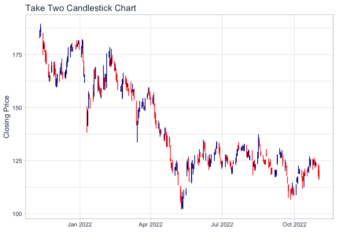

```r
library(ggplot2)
library(readr)
library(knitr)
library(tidyverse)
```

```
## ── Attaching packages ─────────────────────────────────────── tidyverse 1.3.1 ──
```

```
## ✔ tibble  3.1.8     ✔ dplyr   1.0.8
## ✔ tidyr   1.2.0     ✔ stringr 1.4.0
## ✔ purrr   0.3.4     ✔ forcats 0.5.1
```

```
## ── Conflicts ────────────────────────────────────────── tidyverse_conflicts() ──
## ✖ dplyr::filter() masks stats::filter()
## ✖ dplyr::lag()    masks stats::lag()
```

```r
library(dplyr)
library(forcats)
library(downloader)
library(corrplot)
```

```
## corrplot 0.92 loaded
```

```r
library(tidyquant)
```

```
## Loading required package: lubridate
```

```
## 
## Attaching package: 'lubridate'
```

```
## The following objects are masked from 'package:base':
## 
##     date, intersect, setdiff, union
```

```
## Loading required package: PerformanceAnalytics
```

```
## Loading required package: xts
```

```
## Loading required package: zoo
```

```
## 
## Attaching package: 'zoo'
```

```
## The following objects are masked from 'package:base':
## 
##     as.Date, as.Date.numeric
```

```
## 
## Attaching package: 'xts'
```

```
## The following objects are masked from 'package:dplyr':
## 
##     first, last
```

```
## 
## Attaching package: 'PerformanceAnalytics'
```

```
## The following object is masked from 'package:graphics':
## 
##     legend
```

```
## Loading required package: quantmod
```

```
## Loading required package: TTR
```

```
## Registered S3 method overwritten by 'quantmod':
##   method            from
##   as.zoo.data.frame zoo
```

```r
library(timetk)
library(dygraphs)
```
Stocks I chose: MSFT (Microsoft), SONY (Sony), NTDOF (Nintendo)
Stocks my friend chose Meta (Facebook), ATVI (Activision Blizzard), TTWO (Take Two Interactive)


```r
(Microsoft <- tq_get("MSFT", get = "stock.prices"))
```

```
## # A tibble: 2,727 × 8
##    symbol date        open  high   low close   volume adjusted
##    <chr>  <date>     <dbl> <dbl> <dbl> <dbl>    <dbl>    <dbl>
##  1 MSFT   2012-01-03  26.5  27.0  26.4  26.8 64731500     21.5
##  2 MSFT   2012-01-04  26.8  27.5  26.8  27.4 80516100     22.0
##  3 MSFT   2012-01-05  27.4  27.7  27.3  27.7 56081400     22.3
##  4 MSFT   2012-01-06  27.5  28.2  27.5  28.1 99455500     22.6
##  5 MSFT   2012-01-09  28.0  28.1  27.7  27.7 59706800     22.3
##  6 MSFT   2012-01-10  27.9  28.2  27.8  27.8 60014400     22.4
##  7 MSFT   2012-01-11  27.4  28.0  27.4  27.7 65582400     22.3
##  8 MSFT   2012-01-12  27.9  28.0  27.6  28   49370800     22.5
##  9 MSFT   2012-01-13  27.9  28.2  27.8  28.2 60196100     22.7
## 10 MSFT   2012-01-17  28.4  28.6  28.2  28.3 72395300     22.7
## # … with 2,717 more rows
```

```r
(Sony <- tq_get("SONY", get = "stock.prices"))
```

```
## # A tibble: 2,727 × 8
##    symbol date        open  high   low close  volume adjusted
##    <chr>  <date>     <dbl> <dbl> <dbl> <dbl>   <dbl>    <dbl>
##  1 SONY   2012-01-03  18.3  18.5  18.3  18.4 1414800     18.4
##  2 SONY   2012-01-04  18.2  18.3  18.1  18.2 1146400     18.2
##  3 SONY   2012-01-05  17.8  17.8  17.6  17.7 1464900     17.7
##  4 SONY   2012-01-06  17.6  17.6  17.4  17.4  594100     17.4
##  5 SONY   2012-01-09  17.5  17.5  17.4  17.5  529400     17.5
##  6 SONY   2012-01-10  17.7  17.8  17.6  17.7 1037400     17.7
##  7 SONY   2012-01-11  17.6  17.7  17.5  17.7  591200     17.7
##  8 SONY   2012-01-12  17.2  17.3  17.1  17.3  948800     17.3
##  9 SONY   2012-01-13  17.2  17.2  17.0  17.1  392000     17.1
## 10 SONY   2012-01-17  17    17    16.8  16.8 1156700     16.8
## # … with 2,717 more rows
```

```r
(Nintendo <- tq_get("NTDOF", get = "stock.prices"))
```

```
## # A tibble: 2,727 × 8
##    symbol date        open  high   low close volume adjusted
##    <chr>  <date>     <dbl> <dbl> <dbl> <dbl>  <dbl>    <dbl>
##  1 NTDOF  2012-01-03  14.0  14.0  14.0  14.0   1000     12.7
##  2 NTDOF  2012-01-04  14.0  14.0  14.0  14.0      0     12.7
##  3 NTDOF  2012-01-05  14.0  14.0  14.0  14.0      0     12.7
##  4 NTDOF  2012-01-06  14.0  14.0  14.0  14.0      0     12.7
##  5 NTDOF  2012-01-09  13.7  13.7  13.7  13.7      0     12.4
##  6 NTDOF  2012-01-10  13.7  13.7  13.7  13.7      0     12.4
##  7 NTDOF  2012-01-11  13.6  13.6  13.6  13.6   2000     12.3
##  8 NTDOF  2012-01-12  13.6  13.6  13.6  13.6   1000     12.3
##  9 NTDOF  2012-01-13  13.3  13.3  13.2  13.2   1000     11.9
## 10 NTDOF  2012-01-17  13.5  13.5  13.5  13.5   1000     12.2
## # … with 2,717 more rows
```

```r
(Meta <- tq_get("META", get = "stock.prices"))
```

```
## # A tibble: 2,632 × 8
##    symbol date        open  high   low close    volume adjusted
##    <chr>  <date>     <dbl> <dbl> <dbl> <dbl>     <dbl>    <dbl>
##  1 META   2012-05-18  42.0  45    38    38.2 573576400     38.2
##  2 META   2012-05-21  36.5  36.7  33    34.0 168192700     34.0
##  3 META   2012-05-22  32.6  33.6  30.9  31   101786600     31  
##  4 META   2012-05-23  31.4  32.5  31.4  32    73600000     32  
##  5 META   2012-05-24  33.0  33.2  31.8  33.0  50237200     33.0
##  6 META   2012-05-25  32.9  33.0  31.1  31.9  37149800     31.9
##  7 META   2012-05-29  31.5  31.7  28.6  28.8  78063400     28.8
##  8 META   2012-05-30  28.7  29.5  27.9  28.2  57267900     28.2
##  9 META   2012-05-31  28.5  29.7  26.8  29.6 111639200     29.6
## 10 META   2012-06-01  28.9  29.2  27.4  27.7  41855500     27.7
## # … with 2,622 more rows
```

```r
(Activision <- tq_get("ATVI", get = "stock.prices"))
```

```
## # A tibble: 2,727 × 8
##    symbol date        open  high   low close   volume adjusted
##    <chr>  <date>     <dbl> <dbl> <dbl> <dbl>    <dbl>    <dbl>
##  1 ATVI   2012-01-03  12.5  12.5  12.2  12.2 10330200     11.1
##  2 ATVI   2012-01-04  12.2  12.3  12.1  12.1  8551600     11.0
##  3 ATVI   2012-01-05  12.1  12.2  11.9  12.1  8809800     11.0
##  4 ATVI   2012-01-06  12.1  12.3  12.0  12.2  9625000     11.2
##  5 ATVI   2012-01-09  12.2  12.2  12.0  12.2  5827500     11.1
##  6 ATVI   2012-01-10  12.3  12.6  12.2  12.4  6011300     11.4
##  7 ATVI   2012-01-11  12.5  12.7  12.4  12.6  9253000     11.5
##  8 ATVI   2012-01-12  12.6  12.7  12.5  12.6  5077000     11.5
##  9 ATVI   2012-01-13  12.5  12.5  12.2  12.2 10131400     11.2
## 10 ATVI   2012-01-17  12.4  12.4  12.0  12.0 15108700     10.9
## # … with 2,717 more rows
```

```r
(TakeTwo<- tq_get("TTWO", get = "stock.prices"))
```

```
## # A tibble: 2,727 × 8
##    symbol date        open  high   low close  volume adjusted
##    <chr>  <date>     <dbl> <dbl> <dbl> <dbl>   <dbl>    <dbl>
##  1 TTWO   2012-01-03  13.8  14.0  13.8  14   3323800     14  
##  2 TTWO   2012-01-04  14.0  14.1  13.9  14   1882800     14  
##  3 TTWO   2012-01-05  14.2  14.9  14.1  14.7 3656900     14.7
##  4 TTWO   2012-01-06  14.6  15.0  14.5  14.8 2926800     14.8
##  5 TTWO   2012-01-09  14.8  15.0  14.6  14.9 2406700     14.9
##  6 TTWO   2012-01-10  15.0  15.1  14.3  14.5 2659100     14.5
##  7 TTWO   2012-01-11  14.4  14.6  14.3  14.5 1301700     14.5
##  8 TTWO   2012-01-12  14.3  14.6  14.1  14.6 1821700     14.6
##  9 TTWO   2012-01-13  14.4  14.5  14.2  14.5 1714300     14.5
## 10 TTWO   2012-01-17  14.5  15.0  14.5  14.8 3896900     14.8
## # … with 2,717 more rows
```
My Stocks

```r
MyStock <- tq_get(c("MSFT", "SONY", "NTDOF"), get = "stock.prices", from = "2021-11-11", to = today())
head(MyStock)
```

```
## # A tibble: 6 × 8
##   symbol date        open  high   low close   volume adjusted
##   <chr>  <date>     <dbl> <dbl> <dbl> <dbl>    <dbl>    <dbl>
## 1 MSFT   2021-11-11  331.  334.  331.  332. 16849800     330.
## 2 MSFT   2021-11-12  334.  337.  334.  337. 23831000     334.
## 3 MSFT   2021-11-15  338.  338.  334.  336. 16723000     333.
## 4 MSFT   2021-11-16  336.  341.  336.  340. 20886800     337.
## 5 MSFT   2021-11-17  339.  342.  338   339. 19053400     337.
## 6 MSFT   2021-11-18  338.  342.  337.  341. 22463500     339.
```

```r
tail(MyStock)
```

```
## # A tibble: 6 × 8
##   symbol date        open  high   low close volume adjusted
##   <chr>  <date>     <dbl> <dbl> <dbl> <dbl>  <dbl>    <dbl>
## 1 NTDOF  2022-10-25  41.4  41.4  40    41.0   8700     41.0
## 2 NTDOF  2022-10-26  40    42.5  40    40.6   2000     40.6
## 3 NTDOF  2022-10-27  41.5  41.5  41.3  41.4   5100     41.4
## 4 NTDOF  2022-10-28  41.6  41.6  40    40.3   6000     40.3
## 5 NTDOF  2022-10-31  39.5  42.0  39.5  40      100     40  
## 6 NTDOF  2022-11-01  40.1  41.5  40.1  40.6   1900     40.6
```
Friend Stock

```r
FriendStock <- tq_get(c("META", "ATVI", "TTWO"), get = "stock.prices", from = "2021-11-11", to = today())
head(FriendStock)
```

```
## # A tibble: 6 × 8
##   symbol date        open  high   low close   volume adjusted
##   <chr>  <date>     <dbl> <dbl> <dbl> <dbl>    <dbl>    <dbl>
## 1 META   2021-11-11  330.  332.  327   328. 12376600     328.
## 2 META   2021-11-12  330.  342.  330.  341. 25414300     341.
## 3 META   2021-11-15  344.  354.  343.  348. 25076600     348.
## 4 META   2021-11-16  344.  347.  341.  343. 18181100     343.
## 5 META   2021-11-17  344.  347.  340.  341. 13602800     341.
## 6 META   2021-11-18  340.  342.  335.  339. 17487200     339.
```

```r
tail(FriendStock)
```

```
## # A tibble: 6 × 8
##   symbol date        open  high   low close  volume adjusted
##   <chr>  <date>     <dbl> <dbl> <dbl> <dbl>   <dbl>    <dbl>
## 1 TTWO   2022-10-25  124.  126.  123.  125. 1309100     125.
## 2 TTWO   2022-10-26  124.  126.  123.  124. 1435200     124.
## 3 TTWO   2022-10-27  124.  125.  121.  123. 1268800     123.
## 4 TTWO   2022-10-28  123.  124.  122.  124. 1388200     124.
## 5 TTWO   2022-10-31  123.  123.  118.  118. 2593500     118.
## 6 TTWO   2022-11-01  120.  123.  116.  116. 1943700     116.
```
All

```r
Both <- tq_get(c("MSFT", "SONY", "NTDOF","META", "ATVI", "TTWO"), get = "stock.prices", from = "2021-11-11", to = today())
head(Both)
```

```
## # A tibble: 6 × 8
##   symbol date        open  high   low close   volume adjusted
##   <chr>  <date>     <dbl> <dbl> <dbl> <dbl>    <dbl>    <dbl>
## 1 MSFT   2021-11-11  331.  334.  331.  332. 16849800     330.
## 2 MSFT   2021-11-12  334.  337.  334.  337. 23831000     334.
## 3 MSFT   2021-11-15  338.  338.  334.  336. 16723000     333.
## 4 MSFT   2021-11-16  336.  341.  336.  340. 20886800     337.
## 5 MSFT   2021-11-17  339.  342.  338   339. 19053400     337.
## 6 MSFT   2021-11-18  338.  342.  337.  341. 22463500     339.
```

```r
tail(Both)
```

```
## # A tibble: 6 × 8
##   symbol date        open  high   low close  volume adjusted
##   <chr>  <date>     <dbl> <dbl> <dbl> <dbl>   <dbl>    <dbl>
## 1 TTWO   2022-10-25  124.  126.  123.  125. 1309100     125.
## 2 TTWO   2022-10-26  124.  126.  123.  124. 1435200     124.
## 3 TTWO   2022-10-27  124.  125.  121.  123. 1268800     123.
## 4 TTWO   2022-10-28  123.  124.  122.  124. 1388200     124.
## 5 TTWO   2022-10-31  123.  123.  118.  118. 2593500     118.
## 6 TTWO   2022-11-01  120.  123.  116.  116. 1943700     116.
```
Winning Chart

```r
Combined <- Both %>%
  select(symbol, date, adjusted) %>%
  pivot_wider(names_from = symbol, values_from = adjusted) %>%
  tk_xts(date_var = date)
```

```
## Warning: Non-numeric columns being dropped: date
```

```r
dygraph(Combined)
```

```{=html}
<div id="htmlwidget-d970fe5f0754ef5c33a7" style="width:672px;height:480px;" class="dygraphs html-widget"></div>
<script type="application/json" data-for="htmlwidget-d970fe5f0754ef5c33a7">{"x":{"attrs":{"labels":["day","MSFT","SONY","NTDOF","META","ATVI","TTWO"],"legend":"auto","retainDateWindow":false,"axes":{"x":{"pixelsPerLabel":60}}},"scale":"daily","annotations":[],"shadings":[],"events":[],"format":"date","data":[["2021-11-11T00:00:00.000Z","2021-11-12T00:00:00.000Z","2021-11-15T00:00:00.000Z","2021-11-16T00:00:00.000Z","2021-11-17T00:00:00.000Z","2021-11-18T00:00:00.000Z","2021-11-19T00:00:00.000Z","2021-11-22T00:00:00.000Z","2021-11-23T00:00:00.000Z","2021-11-24T00:00:00.000Z","2021-11-26T00:00:00.000Z","2021-11-29T00:00:00.000Z","2021-11-30T00:00:00.000Z","2021-12-01T00:00:00.000Z","2021-12-02T00:00:00.000Z","2021-12-03T00:00:00.000Z","2021-12-06T00:00:00.000Z","2021-12-07T00:00:00.000Z","2021-12-08T00:00:00.000Z","2021-12-09T00:00:00.000Z","2021-12-10T00:00:00.000Z","2021-12-13T00:00:00.000Z","2021-12-14T00:00:00.000Z","2021-12-15T00:00:00.000Z","2021-12-16T00:00:00.000Z","2021-12-17T00:00:00.000Z","2021-12-20T00:00:00.000Z","2021-12-21T00:00:00.000Z","2021-12-22T00:00:00.000Z","2021-12-23T00:00:00.000Z","2021-12-27T00:00:00.000Z","2021-12-28T00:00:00.000Z","2021-12-29T00:00:00.000Z","2021-12-30T00:00:00.000Z","2021-12-31T00:00:00.000Z","2022-01-03T00:00:00.000Z","2022-01-04T00:00:00.000Z","2022-01-05T00:00:00.000Z","2022-01-06T00:00:00.000Z","2022-01-07T00:00:00.000Z","2022-01-10T00:00:00.000Z","2022-01-11T00:00:00.000Z","2022-01-12T00:00:00.000Z","2022-01-13T00:00:00.000Z","2022-01-14T00:00:00.000Z","2022-01-18T00:00:00.000Z","2022-01-19T00:00:00.000Z","2022-01-20T00:00:00.000Z","2022-01-21T00:00:00.000Z","2022-01-24T00:00:00.000Z","2022-01-25T00:00:00.000Z","2022-01-26T00:00:00.000Z","2022-01-27T00:00:00.000Z","2022-01-28T00:00:00.000Z","2022-01-31T00:00:00.000Z","2022-02-01T00:00:00.000Z","2022-02-02T00:00:00.000Z","2022-02-03T00:00:00.000Z","2022-02-04T00:00:00.000Z","2022-02-07T00:00:00.000Z","2022-02-08T00:00:00.000Z","2022-02-09T00:00:00.000Z","2022-02-10T00:00:00.000Z","2022-02-11T00:00:00.000Z","2022-02-14T00:00:00.000Z","2022-02-15T00:00:00.000Z","2022-02-16T00:00:00.000Z","2022-02-17T00:00:00.000Z","2022-02-18T00:00:00.000Z","2022-02-22T00:00:00.000Z","2022-02-23T00:00:00.000Z","2022-02-24T00:00:00.000Z","2022-02-25T00:00:00.000Z","2022-02-28T00:00:00.000Z","2022-03-01T00:00:00.000Z","2022-03-02T00:00:00.000Z","2022-03-03T00:00:00.000Z","2022-03-04T00:00:00.000Z","2022-03-07T00:00:00.000Z","2022-03-08T00:00:00.000Z","2022-03-09T00:00:00.000Z","2022-03-10T00:00:00.000Z","2022-03-11T00:00:00.000Z","2022-03-14T00:00:00.000Z","2022-03-15T00:00:00.000Z","2022-03-16T00:00:00.000Z","2022-03-17T00:00:00.000Z","2022-03-18T00:00:00.000Z","2022-03-21T00:00:00.000Z","2022-03-22T00:00:00.000Z","2022-03-23T00:00:00.000Z","2022-03-24T00:00:00.000Z","2022-03-25T00:00:00.000Z","2022-03-28T00:00:00.000Z","2022-03-29T00:00:00.000Z","2022-03-30T00:00:00.000Z","2022-03-31T00:00:00.000Z","2022-04-01T00:00:00.000Z","2022-04-04T00:00:00.000Z","2022-04-05T00:00:00.000Z","2022-04-06T00:00:00.000Z","2022-04-07T00:00:00.000Z","2022-04-08T00:00:00.000Z","2022-04-11T00:00:00.000Z","2022-04-12T00:00:00.000Z","2022-04-13T00:00:00.000Z","2022-04-14T00:00:00.000Z","2022-04-18T00:00:00.000Z","2022-04-19T00:00:00.000Z","2022-04-20T00:00:00.000Z","2022-04-21T00:00:00.000Z","2022-04-22T00:00:00.000Z","2022-04-25T00:00:00.000Z","2022-04-26T00:00:00.000Z","2022-04-27T00:00:00.000Z","2022-04-28T00:00:00.000Z","2022-04-29T00:00:00.000Z","2022-05-02T00:00:00.000Z","2022-05-03T00:00:00.000Z","2022-05-04T00:00:00.000Z","2022-05-05T00:00:00.000Z","2022-05-06T00:00:00.000Z","2022-05-09T00:00:00.000Z","2022-05-10T00:00:00.000Z","2022-05-11T00:00:00.000Z","2022-05-12T00:00:00.000Z","2022-05-13T00:00:00.000Z","2022-05-16T00:00:00.000Z","2022-05-17T00:00:00.000Z","2022-05-18T00:00:00.000Z","2022-05-19T00:00:00.000Z","2022-05-20T00:00:00.000Z","2022-05-23T00:00:00.000Z","2022-05-24T00:00:00.000Z","2022-05-25T00:00:00.000Z","2022-05-26T00:00:00.000Z","2022-05-27T00:00:00.000Z","2022-05-31T00:00:00.000Z","2022-06-01T00:00:00.000Z","2022-06-02T00:00:00.000Z","2022-06-03T00:00:00.000Z","2022-06-06T00:00:00.000Z","2022-06-07T00:00:00.000Z","2022-06-08T00:00:00.000Z","2022-06-09T00:00:00.000Z","2022-06-10T00:00:00.000Z","2022-06-13T00:00:00.000Z","2022-06-14T00:00:00.000Z","2022-06-15T00:00:00.000Z","2022-06-16T00:00:00.000Z","2022-06-17T00:00:00.000Z","2022-06-21T00:00:00.000Z","2022-06-22T00:00:00.000Z","2022-06-23T00:00:00.000Z","2022-06-24T00:00:00.000Z","2022-06-27T00:00:00.000Z","2022-06-28T00:00:00.000Z","2022-06-29T00:00:00.000Z","2022-06-30T00:00:00.000Z","2022-07-01T00:00:00.000Z","2022-07-05T00:00:00.000Z","2022-07-06T00:00:00.000Z","2022-07-07T00:00:00.000Z","2022-07-08T00:00:00.000Z","2022-07-11T00:00:00.000Z","2022-07-12T00:00:00.000Z","2022-07-13T00:00:00.000Z","2022-07-14T00:00:00.000Z","2022-07-15T00:00:00.000Z","2022-07-18T00:00:00.000Z","2022-07-19T00:00:00.000Z","2022-07-20T00:00:00.000Z","2022-07-21T00:00:00.000Z","2022-07-22T00:00:00.000Z","2022-07-25T00:00:00.000Z","2022-07-26T00:00:00.000Z","2022-07-27T00:00:00.000Z","2022-07-28T00:00:00.000Z","2022-07-29T00:00:00.000Z","2022-08-01T00:00:00.000Z","2022-08-02T00:00:00.000Z","2022-08-03T00:00:00.000Z","2022-08-04T00:00:00.000Z","2022-08-05T00:00:00.000Z","2022-08-08T00:00:00.000Z","2022-08-09T00:00:00.000Z","2022-08-10T00:00:00.000Z","2022-08-11T00:00:00.000Z","2022-08-12T00:00:00.000Z","2022-08-15T00:00:00.000Z","2022-08-16T00:00:00.000Z","2022-08-17T00:00:00.000Z","2022-08-18T00:00:00.000Z","2022-08-19T00:00:00.000Z","2022-08-22T00:00:00.000Z","2022-08-23T00:00:00.000Z","2022-08-24T00:00:00.000Z","2022-08-25T00:00:00.000Z","2022-08-26T00:00:00.000Z","2022-08-29T00:00:00.000Z","2022-08-30T00:00:00.000Z","2022-08-31T00:00:00.000Z","2022-09-01T00:00:00.000Z","2022-09-02T00:00:00.000Z","2022-09-06T00:00:00.000Z","2022-09-07T00:00:00.000Z","2022-09-08T00:00:00.000Z","2022-09-09T00:00:00.000Z","2022-09-12T00:00:00.000Z","2022-09-13T00:00:00.000Z","2022-09-14T00:00:00.000Z","2022-09-15T00:00:00.000Z","2022-09-16T00:00:00.000Z","2022-09-19T00:00:00.000Z","2022-09-20T00:00:00.000Z","2022-09-21T00:00:00.000Z","2022-09-22T00:00:00.000Z","2022-09-23T00:00:00.000Z","2022-09-26T00:00:00.000Z","2022-09-27T00:00:00.000Z","2022-09-28T00:00:00.000Z","2022-09-29T00:00:00.000Z","2022-09-30T00:00:00.000Z","2022-10-03T00:00:00.000Z","2022-10-04T00:00:00.000Z","2022-10-05T00:00:00.000Z","2022-10-06T00:00:00.000Z","2022-10-07T00:00:00.000Z","2022-10-10T00:00:00.000Z","2022-10-11T00:00:00.000Z","2022-10-12T00:00:00.000Z","2022-10-13T00:00:00.000Z","2022-10-14T00:00:00.000Z","2022-10-17T00:00:00.000Z","2022-10-18T00:00:00.000Z","2022-10-19T00:00:00.000Z","2022-10-20T00:00:00.000Z","2022-10-21T00:00:00.000Z","2022-10-24T00:00:00.000Z","2022-10-25T00:00:00.000Z","2022-10-26T00:00:00.000Z","2022-10-27T00:00:00.000Z","2022-10-28T00:00:00.000Z","2022-10-31T00:00:00.000Z","2022-11-01T00:00:00.000Z"],[329.668976,333.92337,333.278809,336.690247,336.918701,339.054749,340.882782,337.624084,335.488068,335.716583,327.539978,334.444885,328.444061,327.937378,327.351196,320.9133,324.072632,332.745972,332.795654,330.937805,340.316528,337.196899,326.208679,332.477722,322.791016,321.69812,317.833405,325.165497,331.03717,332.517456,340.227112,339.034882,339.730377,337.117432,334.136902,332.577057,326.874359,314.326324,311.84256,312.001526,312.230011,312.935394,316.204041,302.821472,308.186462,300.685425,301.361023,299.642273,294.108429,294.446198,286.61734,294.783997,297.893677,306.259033,308.961365,306.755798,311.425262,299.294525,303.954102,298.99646,302.583038,309.18988,300.417206,293.124817,293.085114,298.519623,298.171173,289.440094,286.652496,286.44342,279.026489,293.282959,295.990875,297.464325,293.641357,298.858093,294.607056,288.573914,277.672516,274.626099,287.21994,284.322876,278.827362,275.21347,285.875946,293.083832,293.910156,299.097015,297.832642,302.710907,298.161194,302.750763,302.332611,309.321472,314.01059,312.467438,306.942047,308.04715,313.57251,309.500671,298.171173,300.032867,295.652374,283.994354,280.808533,286.343842,278.588409,279.27536,284.034149,285.089447,279.564087,272.814178,279.474487,269.021057,281.963409,288.344971,276.288666,283.207855,280.529785,288.69342,276.119446,273.511078,263.406067,268.30426,259.393951,254.217041,259.961456,260.339752,265.636169,253.54184,252.603821,252.025055,260.0979,259.070099,261.963928,265.336792,272.661224,271.294159,271.842987,273.998383,269.448059,268.180756,271.922821,269.83725,264.229156,252.454147,241.746857,243.972153,251.226746,244.451126,247.125443,253.20256,252.593842,258.311676,267.132996,264.328949,255.936752,259.70874,256.28598,259.030182,262.293274,265.646118,267.831482,267.093079,263.949738,253.13269,252.184708,253.54184,256.176239,253.711472,258.980286,261.714478,264.279022,259.808502,258.281769,251.36644,268.170776,275.824524,280.145355,277.421143,274.237915,281.871704,283.049194,282.31076,279.726257,281.702057,288.547516,286.412048,291.291718,292.848389,292.089996,291.320007,290.170013,286.149994,277.75,276.440002,275.790009,278.850006,268.089996,265.230011,262.970001,261.470001,260.399994,256.059998,253.25,258.089996,258.519989,264.459991,266.649994,251.990005,252.220001,245.380005,244.740005,244.520004,242.449997,238.949997,240.979996,237.919998,237.449997,236.410004,241.070007,237.5,232.899994,240.740005,248.880005,249.199997,246.789993,234.240005,229.25,225.410004,225.75,234.240005,228.559998,237.529999,238.5,236.479996,236.149994,242.119995,247.25,250.660004,231.320007,226.75,235.869995,232.130005,228.169998],[121,122.900002,122.949997,125.080002,124.230003,125.160004,125.239998,122.400002,121.779999,122.220001,121.269997,121.440002,121.849998,119.370003,120.160004,120.019997,121,124.760002,125.940002,122.849998,123.260002,120.589996,120.610001,123.849998,122.209999,121.129997,118.949997,120.550003,123.099998,123.860001,127.209999,127.480003,126.690002,125.919998,126.400002,126.269997,128.559998,128.589996,123.110001,124.309998,123.169998,126.32,127.150002,124.800003,124.790001,115.839996,110.040001,113.629997,111.629997,110.540001,109.919998,110.029999,102.970001,106.839996,111.660004,112.559998,112.25,108.029999,109.120003,109.75,109.769997,111.459999,109.910004,107.790001,107.110001,108.459999,106.519997,104.809998,104.230003,102.68,101.309998,101.989998,104.089996,102.529999,100.860001,101.739998,100.230003,98.470001,95.82,97.419998,98.339996,100.18,97.309998,94.790001,98.099998,102.75,104.620003,106.120003,104.449997,105.730003,104.150002,107.370003,106.290001,105.029999,105.800003,105.190002,102.709999,102.919998,105.040001,101.099998,99.370003,98.199997,98.269997,92.830002,90.830002,91.790001,89.139999,88.480003,89.32,89.07,88.150002,85.599998,87.580002,84.239998,85.449997,87.300003,86.050003,86.099998,86.330002,88.519997,84.93,83.660004,80.839996,82,80.059998,83.900002,87.010002,86.360001,87.690002,87.07,88.709999,89.940002,89.769997,89.029999,88.290001,90.540001,92.260002,94.07,94.059998,93.839996,92.639999,92.300003,92.639999,92.260002,89.529999,88.059998,83.93,83,84.339996,81.660004,84,84.849998,83.75,83.75,85.639999,84.449997,83.190002,83.410004,81.769997,81.68,80.949997,80.330002,83.510002,82.580002,81.989998,82.050003,81.519997,81.099998,82.150002,82.209999,85.019997,86.040001,87.260002,86.959999,85.489998,85.269997,86.660004,87.559998,85.389999,86.080002,85.290001,87.139999,85.949997,86.32,84.830002,83.519997,85.330002,85.82,86.800003,86.919998,86.110001,87.160004,86.879997,86.730003,85.230003,84.019997,84.160004,85.260002,81.709999,81.339996,80.739998,79.349998,78.879997,77.230003,75.370003,74.5,74.190002,75.379997,75.620003,72.010002,72.040001,71.860001,71.879997,72.480003,71.169998,69.910004,69.379997,68.43,66.699997,65.889999,66.989998,65.07,64.050003,66.160004,68.239998,67.610001,67.410004,66.410004,65.620003,64.169998,63.169998,65.169998,64.230003,66.089996,65.269997,64.629997,64.730003,65.040001,65.139999,67.239998,67.32,66.860001,67.849998,67.470001,74.010002],[43.495647,43.613712,43.289043,44.272884,43.549763,44.660519,44.880901,43.879349,43.289043,43.265434,42.845329,44.761856,43.289043,43.731773,44.961575,43.490734,44.125309,45.256729,46.388145,45.918854,46.882034,46.24057,45.997559,46.426514,46.270084,46.049702,46.828907,48.183655,47.260811,48.050838,48.208252,47.12603,46.690186,46.229744,46.033962,46.244507,45.807678,45.502689,45.453495,45.888351,45.847031,46.443241,46.056591,45.005848,45.10915,45.933609,47.12603,47.212605,46.688217,46.405853,46.535721,47.740929,48.582115,47.99279,48.209236,48.700172,49.236366,48.601791,49.660404,49.979168,49.487247,49.834545,48.984505,48.417812,48.990406,50.515362,49.812901,50.005733,50.563572,50.010651,49.556114,49.142902,48.946133,50.033279,49.585632,49.880783,50.120842,49.979168,48.357796,48.405022,49.511845,49.487247,49.081905,48.503407,48.296799,50.148388,50.372707,50.417961,50.256611,50.864628,51.94685,52.391548,52.630623,52.871666,53.521,51.898998,50.5,52.005001,52.492001,50.988998,50.900002,51.546001,51.400002,51.208,50.834999,51.439999,50.900002,50.131001,50.34,50.262001,49.599998,49.700001,49.700001,47.258999,47.457001,45.584,45.820999,44.5,44.764999,45.5,44.115002,44.162998,42.472,43.080002,44.099998,44.27,44.68,43.640999,44.299999,45.759998,46.116001,46.243999,46.869999,46.736,45.271999,45.424999,45.200001,44.433998,44.973999,44.632999,43.498001,44.248001,44,43.967999,44.400002,43.311001,42.405998,42.008999,42.5,41.705002,41.402,42.900002,42.625,42.224998,43.299999,43.299999,43.564999,43,43.150002,42.75,43.237,43.5,43.067001,42.5,42.845001,43.323002,43.849998,43.18,45,45.069,44.012001,45.099998,44.308998,44.805,44.487999,43.757,43.693001,44.650002,44.867001,44.596001,44.400002,41.938,43.242001,43.68,42.950001,41.775002,43.549999,43.689999,43.450001,43.271,43.101002,44.546001,44.994999,43.889,43.756001,43.506001,42.799,43,41.674999,41.945999,41.015999,41.450001,40.588001,40.349998,40.313,40.299999,40.700001,41.389999,41.646,42.5,43.249001,43.450001,43.040001,42.872002,42.425999,42.326,43,41.5,41.459999,41.450001,41.93,42.220001,40.060001,41.73,43,42.389999,41.279999,40.740002,42,40.869999,41.900002,41.209999,40.5,42.52,41.939999,40.279999,40.299999,41.060001,41.470001,40.970001,40.599998,41.41,40.34,40,40.599998],[327.73999,340.890015,347.559998,342.959991,340.769989,338.690002,345.299988,341.01001,337.25,341.059998,333.119995,338.029999,324.459991,310.600006,310.390015,306.839996,317.869995,322.809998,330.559998,329.820007,329.75,334.48999,333.73999,341.660004,334.899994,333.790009,325.450012,334.200012,330.450012,335.23999,346.179993,346.220001,342.940002,344.359985,336.350006,338.540009,336.529999,324.170013,332.459991,331.790009,328.070007,334.369995,333.26001,326.480011,331.899994,318.149994,319.589996,316.559998,303.170013,308.709991,300.149994,294.630005,294.640015,301.709991,313.26001,319,323,237.759995,237.089996,224.910004,220.179993,232,228.070007,219.550003,217.699997,221,216.539993,207.710007,206.160004,202.080002,198.449997,207.600006,210.479996,211.029999,203.490005,208.110001,202.970001,200.059998,187.470001,190.289993,198.5,195.210007,187.610001,186.630005,192.029999,203.630005,207.839996,216.490005,211.490005,216.649994,213.460007,219.570007,221.820007,223.589996,229.860001,227.850006,222.360001,224.850006,233.889999,231.839996,223.300003,222.949997,222.330002,216.460007,214.139999,214.990005,210.179993,210.770004,217.309998,200.419998,188.070007,184.110001,186.990005,180.949997,174.949997,205.729996,200.470001,211.130005,212.029999,223.410004,208.279999,203.770004,196.210007,197.649994,188.740005,191.240005,198.619995,200.039993,202.619995,192.240005,191.289993,193.539993,196.229996,181.279999,183.830002,191.630005,195.130005,193.639999,188.639999,198.860001,190.779999,194.25,195.649994,196.639999,184,175.570007,164.259995,163.729996,169.350006,160.869995,163.740005,157.050003,155.850006,158.75,170.160004,169.490005,160.679993,163.940002,161.25,160.029999,168.190002,169.770004,172.190002,170.880005,162.880005,163.270004,163.490005,158.050003,164.699997,167.229996,175.779999,183.089996,183.169998,169.270004,166.649994,159.149994,169.580002,160.720001,159.100006,159.929993,160.190002,168.800003,170.570007,167.110001,170.25,168.529999,178.339996,177.490005,180.5,180.889999,179.470001,174.850006,174.660004,167.960007,163.050003,161.110001,163.259995,168.779999,161.779999,159.169998,157.160004,162.929993,165.360001,160.320007,158.539993,160.389999,162.059998,169.149994,168.960007,153.130005,151.470001,149.550003,146.289993,148.020004,146.089996,142.119995,142.820007,140.410004,136.369995,134.399994,141.610001,136.410004,135.679993,138.610001,140.279999,138.979996,139.070007,133.449997,133.789993,128.539993,127.5,130.289993,126.760002,134.039993,132.800003,133.229996,131.529999,130.009995,129.720001,137.509995,129.820007,97.940002,99.199997,93.160004,95.199997],[67.101143,69.278206,70.013832,65.749184,63.820641,62.299683,62.011398,61.832462,61.405003,60.550083,60.261799,59.953632,58.253735,56.941532,56.951477,57.021061,57.74675,58.422729,58.919777,58.720959,58.253735,58.353146,59.168301,59.903923,61.126659,60.997425,61.434826,63.214249,63.721233,64.774979,65.063255,66.276047,66.763161,67.091202,66.136879,67.021614,66.802917,65.898293,63.44289,63.661591,62.737087,65.460892,64.42704,63.790821,65.003609,81.823631,81.664581,81.276886,80.869301,79.497459,78.652489,78.314491,78.433784,78.672363,78.543137,78.592834,78.781715,78.483482,78.781715,79.030235,79.755928,81.018417,80.968712,81.018417,81.018417,81.0383,80.978653,80.491554,80.571083,80.750015,80.233086,80.531319,80.958778,81.018417,80.402077,80.998543,81.018417,80.94883,80.074036,80.551193,80.352379,80.322556,79.835449,79.079948,79.040184,78.652489,78.423843,78.294609,78.37413,78.831421,78.602776,79.149529,79.129646,79.537224,80.27285,79.885155,79.636635,80.342438,80.252975,79.905037,79.636635,79.636635,79.616745,79.010361,79.07,79.099998,78.93,79.059998,79.029999,78.910004,78.900002,78.610001,78.050003,77.059998,76.099998,76.699997,75.599998,78.059998,78.779999,79.239998,78.760002,77.839996,77.169998,76.919998,77.470001,77.379997,77.739998,78,78.540001,77.919998,77.739998,77.400002,77.199997,77.029999,77.709999,77.989998,78.199997,77.879997,77.410004,78.230003,77.889999,77.790001,78.029999,77.629997,76.779999,76.480003,74.760002,74.639999,75.349998,73.93,74.709999,76.050003,75.699997,76.489998,77.940002,78.010002,77.160004,77.959999,77.860001,78.57,78.870003,78.370003,78.610001,78.129997,77.790001,76.540001,75.959999,76.239998,77.389999,76.989998,78.629997,79.300003,79.489998,79.230003,79.650002,79.459999,79.790001,79.510002,79.949997,80.080002,79.32,80.589996,80.660004,80.489998,81,80.589996,80.910004,80.510002,80.790001,80.730003,80.919998,80.529999,80.440002,80.269997,79.760002,79.339996,79.279999,79.07,78.629997,78.75,78.620003,78.489998,78.550003,77.529999,76.839996,77.720001,77.389999,78.510002,78.129997,76.760002,76.599998,76.830002,76.019997,75.940002,75.040001,75.32,77.029999,74.949997,74.330002,74.860001,75.389999,74.870003,74.339996,74.360001,75,74.110001,73.830002,73.349998,73.75,73.550003,73.5,73.120003,72.129997,71.760002,72.260002,72.209999,73.309998,72.709999,72.510002,72.5,72.480003,72.5,72.849998,72.800003,73.309998],[185.710007,187.830002,177.600006,179.690002,177.039993,174,170.5,164.910004,165.130005,164.309998,169.660004,169.600006,165.880005,160.350006,161.380005,165.779999,164.399994,167.289993,170.550003,166.380005,165.600006,166.259995,167.630005,171.149994,172.740005,175.740005,178.350006,179.440002,177.619995,177.960007,179.559998,179.389999,180.300003,180.830002,177.720001,178.610001,181.899994,171.850006,164.610001,164.600006,142.990005,148.419998,156.059998,154.830002,152.580002,154.039993,163.360001,164.460007,164.759995,164.990005,158.389999,157.919998,157.25,158.740005,163.339996,160.25,165.050003,163.020004,175,175.100006,172.199997,172.339996,173.149994,171.479996,167.070007,168.929993,166.089996,162.130005,158.5,158.279999,157.820007,163.380005,165.279999,162,159.800003,160.860001,158.199997,158.009995,158,156.100006,158.320007,158.289993,153.490005,141.820007,142.880005,148.789993,149.509995,151.369995,151.220001,152.289993,149.399994,150.5,154.5,156.5,158.570007,156.059998,153.740005,151.880005,154.429993,151.899994,147.199997,143.399994,141.309998,140.529999,138.360001,138.990005,137.960007,135.699997,140.369995,137.339996,131.529999,136.410004,132.960007,125.010002,121.650002,123.230003,119.510002,121.940002,121.349998,124.760002,120.230003,114.269997,106.150002,103.589996,105.260002,106.209999,109.93,110.110001,123.080002,123.050003,119.760002,116.120003,123.620003,122.690002,122.080002,123.279999,125.779999,124.529999,124.629997,129.050003,126.970001,126.989998,131.649994,131.399994,129.229996,127.949997,123.190002,121.410004,126.160004,124.900002,125.809998,128.779999,128.600006,130.050003,133.619995,129.210007,126.18,125.529999,122.529999,124.860001,127.040001,125.620003,126.82,124.93,122.699997,121.989998,121.139999,122.739998,123.849998,123.650002,126.970001,130.009995,132.270004,130.410004,130.770004,131.100006,130.580002,130.350006,132.729996,127.559998,126.660004,129.809998,127.389999,127.160004,125.510002,120.760002,123.790001,120.669998,123.139999,127.389999,136.589996,133,130.470001,127.739998,125.32,124.360001,123.300003,125.480003,127.470001,122.900002,123.040001,122.559998,120.720001,118.629997,119.529999,120.580002,120.580002,127.779999,129.539993,127.019997,128.160004,128.429993,124.190002,125.080002,121.690002,117.919998,114.739998,110.360001,109.57,109.900002,114.190002,108.580002,109,113.360001,116.589996,117.300003,121.379997,120.730003,117.93,115.089996,116.550003,118.860001,117.82,117.889999,121.290001,122.5,123.889999,125.550003,123.110001,125.029999,123.620003,122.739998,124.019997,118.480003,116.309998]]},"evals":[],"jsHooks":[]}</script>
```
To me the most interesting observation that you can make from the dygraph above is the strong performance of Take Two Interactive. Mainly because they are exclusively a software company, whereas Sony is both, which it ranks above. The success of Grand Theft Auto 5 keeps their stock price higher than it's product distributors. 


```r
Both %>%
  filter(symbol == "TTWO") %>%
  ggplot(aes(x = date, y = adjusted)) +
  geom_candlestick(aes(open = open, high = high, low = low, close = close)) +
  labs(title = "Take Two Candlestick Chart", 
       y = "Closing Price", x = "") + 
  theme_tq()
```

<!-- -->
As a quick analyzation of the Candlestick chart above, which was chosen to isolate this specific company, shows a dip in this past Summer. My best guess as to what the cause of this was the shutdown of the online portion of it's most recent release (2018), Red Dead Redemption 2. There was much social outcry of this decision as well as the disatrious release of it's extremely sub-par Grand Theft Auto: The Definitive Trilogy release. It will likely skyrocket back up once the marketing cycle begins for Grand Theft Auto 6, which leaked to the internet about a month ago and should be coming any time soon.
