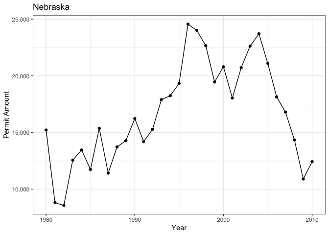

```r
library(ggplot2)
library(readr)
library(knitr)
library(dplyr)
```

```
## 
## Attaching package: 'dplyr'
```

```
## The following objects are masked from 'package:stats':
## 
##     filter, lag
```

```
## The following objects are masked from 'package:base':
## 
##     intersect, setdiff, setequal, union
```

```r
library(forcats)
library(downloader)
library(corrplot)
```

```
## corrplot 0.92 loaded
```

```r
library(tidyquant)
```

```
## Loading required package: lubridate
```

```
## 
## Attaching package: 'lubridate'
```

```
## The following objects are masked from 'package:base':
## 
##     date, intersect, setdiff, union
```

```
## Loading required package: PerformanceAnalytics
```

```
## Loading required package: xts
```

```
## Loading required package: zoo
```

```
## 
## Attaching package: 'zoo'
```

```
## The following objects are masked from 'package:base':
## 
##     as.Date, as.Date.numeric
```

```
## 
## Attaching package: 'xts'
```

```
## The following objects are masked from 'package:dplyr':
## 
##     first, last
```

```
## 
## Attaching package: 'PerformanceAnalytics'
```

```
## The following object is masked from 'package:graphics':
## 
##     legend
```

```
## Loading required package: quantmod
```

```
## Loading required package: TTR
```

```
## Registered S3 method overwritten by 'quantmod':
##   method            from
##   as.zoo.data.frame zoo
```

```r
library(timetk)
library(dygraphs)
library(scales)
```

```
## 
## Attaching package: 'scales'
```

```
## The following object is masked from 'package:readr':
## 
##     col_factor
```

```r
library(tidyverse)
```

```
## ── Attaching packages ─────────────────────────────────────── tidyverse 1.3.1 ──
```

```
## ✔ tibble  3.1.8     ✔ purrr   0.3.4
## ✔ tidyr   1.2.0     ✔ stringr 1.4.0
```

```
## ── Conflicts ────────────────────────────────────────── tidyverse_conflicts() ──
## ✖ lubridate::as.difftime() masks base::as.difftime()
## ✖ scales::col_factor()     masks readr::col_factor()
## ✖ lubridate::date()        masks base::date()
## ✖ purrr::discard()         masks scales::discard()
## ✖ dplyr::filter()          masks stats::filter()
## ✖ xts::first()             masks dplyr::first()
## ✖ lubridate::intersect()   masks base::intersect()
## ✖ dplyr::lag()             masks stats::lag()
## ✖ xts::last()              masks dplyr::last()
## ✖ lubridate::setdiff()     masks base::setdiff()
## ✖ lubridate::union()       masks base::union()
```

```r
library(sf)
```

```
## Linking to GEOS 3.10.2, GDAL 3.4.2, PROJ 8.2.1; sf_use_s2() is TRUE
```

```r
library(USAboundaries)
library(maps)
```

```
## 
## Attaching package: 'maps'
```

```
## The following object is masked from 'package:purrr':
## 
##     map
```

```r
library(ggsflabel)
```

```
## 
## Attaching package: 'ggsflabel'
```

```
## The following objects are masked from 'package:ggplot2':
## 
##     geom_sf_label, geom_sf_text, StatSfCoordinates
```

```r
library(devtools)
```

```
## Loading required package: usethis
```

```
## 
## Attaching package: 'devtools'
```

```
## The following object is masked from 'package:downloader':
## 
##     source_url
```

```r
library(plotly)
```

```
## 
## Attaching package: 'plotly'
```

```
## The following object is masked from 'package:ggplot2':
## 
##     last_plot
```

```
## The following object is masked from 'package:stats':
## 
##     filter
```

```
## The following object is masked from 'package:graphics':
## 
##     layout
```

```r
library(gridExtra)
```

```
## 
## Attaching package: 'gridExtra'
```

```
## The following object is masked from 'package:dplyr':
## 
##     combine
```

```r
library(remotes)
```

```
## 
## Attaching package: 'remotes'
```

```
## The following objects are masked from 'package:devtools':
## 
##     dev_package_deps, install_bioc, install_bitbucket, install_cran,
##     install_deps, install_dev, install_git, install_github,
##     install_gitlab, install_local, install_svn, install_url,
##     install_version, update_packages
```

```
## The following object is masked from 'package:usethis':
## 
##     git_credentials
```

```r
library(stringr)
```


```r
permit_data <- tempfile()
download("https://raw.githubusercontent.com/WJC-Data-Science/DTS350/master/permits.csv", 
         permit_data, mode = "wb")
permits <- read_csv(permit_data)
```

```
## New names:
## Rows: 327422 Columns: 8
## ── Column specification
## ──────────────────────────────────────────────────────── Delimiter: "," chr
## (3): StateAbbr, countyname, variable dbl (5): ...1, state, county, year, value
## ℹ Use `spec()` to retrieve the full column specification for this data. ℹ
## Specify the column types or set `show_col_types = FALSE` to quiet this message.
## • `` -> `...1`
```


```r
head(permits)
```

```
## # A tibble: 6 × 8
##    ...1 state StateAbbr county countyname     variable     year value
##   <dbl> <dbl> <chr>      <dbl> <chr>          <chr>       <dbl> <dbl>
## 1     1     1 AL             1 Autauga County All Permits  2010   191
## 2     2     1 AL             1 Autauga County All Permits  2009   110
## 3     3     1 AL             1 Autauga County All Permits  2008   173
## 4     4     1 AL             1 Autauga County All Permits  2007   260
## 5     5     1 AL             1 Autauga County All Permits  2006   347
## 6     6     1 AL             1 Autauga County All Permits  2005   313
```

```r
counties <- us_counties()
```

```r
FIPSsetup<-permits%>%
  mutate(state=as.character(state), stateFIPS=str_pad(state, 2,pad="0")) %>%
  mutate(county=as.character(county), countyFIPS=str_pad(county, 3,pad="0"))
FIPSsetup
```

```
## # A tibble: 327,422 × 10
##     ...1 state StateAbbr county countyname     variable     year value stateFIPS
##    <dbl> <chr> <chr>     <chr>  <chr>          <chr>       <dbl> <dbl> <chr>    
##  1     1 1     AL        1      Autauga County All Permits  2010   191 01       
##  2     2 1     AL        1      Autauga County All Permits  2009   110 01       
##  3     3 1     AL        1      Autauga County All Permits  2008   173 01       
##  4     4 1     AL        1      Autauga County All Permits  2007   260 01       
##  5     5 1     AL        1      Autauga County All Permits  2006   347 01       
##  6     6 1     AL        1      Autauga County All Permits  2005   313 01       
##  7     7 1     AL        1      Autauga County All Permits  2004   367 01       
##  8     8 1     AL        1      Autauga County All Permits  2003   283 01       
##  9     9 1     AL        1      Autauga County All Permits  2002   276 01       
## 10    10 1     AL        1      Autauga County All Permits  2001   400 01       
## # … with 327,412 more rows, and 1 more variable: countyFIPS <chr>
```


```r
FIPS <- FIPSsetup %>%
  mutate(geoid=paste0(stateFIPS,countyFIPS))
```


```r
county_FIPS_data <- merge(FIPS,counties, by = "geoid") %>%
  group_by(state_name,year) %>%
  summarise(across(value, sum))
```

```
## `summarise()` has grouped output by 'state_name'. You can override using the
## `.groups` argument.
```


```r
USA <- ggplot(data = county_FIPS_data, aes(x = year, y = value, color = state_name)) +
  geom_line() +
  geom_point() +
  labs(x = "Year", y = "Permit Amount") +
  scale_y_continuous(labels = comma) +
  theme_bw() +
  theme(legend.position = 'none') 
ggplotly(USA)
```

```{=html}
<div id="htmlwidget-c906620244fe1bb4ac2e" style="width:672px;height:480px;" class="plotly html-widget"></div>
<script type="application/json" data-for="htmlwidget-c906620244fe1bb4ac2e">{"x":{"data":[{"x":[1980,1981,1982,1983,1984,1985,1986,1987,1988,1989,1990,1991,1992,1993,1994,1995,1996,1997,1998,1999,2000,2001,2002,2003,2004,2005,2006,2007,2008,2009,2010],"y":[38954,24592,21454,43537,37676,41725,46008,32894,28649,27634,28850,28306,34266,40913,42997,46962,45050,39586,46960,42177,38586,39074,41008,53691,59843,67230,71970,58635,40417,30415,25107],"text":["year: 1980<br />value:  38954<br />state_name: Alabama","year: 1981<br />value:  24592<br />state_name: Alabama","year: 1982<br />value:  21454<br />state_name: Alabama","year: 1983<br />value:  43537<br />state_name: Alabama","year: 1984<br />value:  37676<br />state_name: Alabama","year: 1985<br />value:  41725<br />state_name: Alabama","year: 1986<br />value:  46008<br />state_name: Alabama","year: 1987<br />value:  32894<br />state_name: Alabama","year: 1988<br />value:  28649<br />state_name: Alabama","year: 1989<br />value:  27634<br />state_name: Alabama","year: 1990<br />value:  28850<br />state_name: Alabama","year: 1991<br />value:  28306<br />state_name: Alabama","year: 1992<br />value:  34266<br />state_name: Alabama","year: 1993<br />value:  40913<br />state_name: Alabama","year: 1994<br />value:  42997<br />state_name: Alabama","year: 1995<br />value:  46962<br />state_name: Alabama","year: 1996<br />value:  45050<br />state_name: Alabama","year: 1997<br />value:  39586<br />state_name: Alabama","year: 1998<br />value:  46960<br />state_name: Alabama","year: 1999<br />value:  42177<br />state_name: Alabama","year: 2000<br />value:  38586<br />state_name: Alabama","year: 2001<br />value:  39074<br />state_name: Alabama","year: 2002<br />value:  41008<br />state_name: Alabama","year: 2003<br />value:  53691<br />state_name: Alabama","year: 2004<br />value:  59843<br />state_name: Alabama","year: 2005<br />value:  67230<br />state_name: Alabama","year: 2006<br />value:  71970<br />state_name: Alabama","year: 2007<br />value:  58635<br />state_name: Alabama","year: 2008<br />value:  40417<br />state_name: Alabama","year: 2009<br />value:  30415<br />state_name: Alabama","year: 2010<br />value:  25107<br />state_name: Alabama"],"type":"scatter","mode":"lines+markers","line":{"width":1.88976377952756,"color":"rgba(248,118,109,1)","dash":"solid"},"hoveron":"points","name":"Alabama","legendgroup":"Alabama","showlegend":true,"xaxis":"x","yaxis":"y","hoverinfo":"text","marker":{"autocolorscale":false,"color":"rgba(248,118,109,1)","opacity":1,"size":5.66929133858268,"symbol":"circle","line":{"width":1.88976377952756,"color":"rgba(248,118,109,1)"}},"frame":null},{"x":[1980,1981,1982,1983,1984,1985,1986,1987,1988,1989,1990,1991,1992,1993,1994,1995,1996,1997,1998,1999,2000,2001,2002,2003,2004,2005,2006,2007,2008,2009,2010],"y":[4132,8831,18292,27349,15172,9842,3155,1812,1933,1379,1675,2251,2510,3842,4250,4499,5786,5365,6284,4832,4322,6634,6924,8389,7119,6402,6086,3690,1739,1871,1765],"text":["year: 1980<br />value:   4132<br />state_name: Alaska","year: 1981<br />value:   8831<br />state_name: Alaska","year: 1982<br />value:  18292<br />state_name: Alaska","year: 1983<br />value:  27349<br />state_name: Alaska","year: 1984<br />value:  15172<br />state_name: Alaska","year: 1985<br />value:   9842<br />state_name: Alaska","year: 1986<br />value:   3155<br />state_name: Alaska","year: 1987<br />value:   1812<br />state_name: Alaska","year: 1988<br />value:   1933<br />state_name: Alaska","year: 1989<br />value:   1379<br />state_name: Alaska","year: 1990<br />value:   1675<br />state_name: Alaska","year: 1991<br />value:   2251<br />state_name: Alaska","year: 1992<br />value:   2510<br />state_name: Alaska","year: 1993<br />value:   3842<br />state_name: Alaska","year: 1994<br />value:   4250<br />state_name: Alaska","year: 1995<br />value:   4499<br />state_name: Alaska","year: 1996<br />value:   5786<br />state_name: Alaska","year: 1997<br />value:   5365<br />state_name: Alaska","year: 1998<br />value:   6284<br />state_name: Alaska","year: 1999<br />value:   4832<br />state_name: Alaska","year: 2000<br />value:   4322<br />state_name: Alaska","year: 2001<br />value:   6634<br />state_name: Alaska","year: 2002<br />value:   6924<br />state_name: Alaska","year: 2003<br />value:   8389<br />state_name: Alaska","year: 2004<br />value:   7119<br />state_name: Alaska","year: 2005<br />value:   6402<br />state_name: Alaska","year: 2006<br />value:   6086<br />state_name: Alaska","year: 2007<br />value:   3690<br />state_name: Alaska","year: 2008<br />value:   1739<br />state_name: Alaska","year: 2009<br />value:   1871<br />state_name: Alaska","year: 2010<br />value:   1765<br />state_name: Alaska"],"type":"scatter","mode":"lines+markers","line":{"width":1.88976377952756,"color":"rgba(243,123,89,1)","dash":"solid"},"hoveron":"points","name":"Alaska","legendgroup":"Alaska","showlegend":true,"xaxis":"x","yaxis":"y","hoverinfo":"text","marker":{"autocolorscale":false,"color":"rgba(243,123,89,1)","opacity":1,"size":5.66929133858268,"symbol":"circle","line":{"width":1.88976377952756,"color":"rgba(243,123,89,1)"}},"frame":null},{"x":[1980,1981,1982,1983,1984,1985,1986,1987,1988,1989,1990,1991,1992,1993,1994,1995,1996,1997,1998,1999,2000,2001,2002,2003,2004,2005,2006,2007,2008,2009,2010],"y":[87748,81931,91166,162370,207032,182788,151200,92855,75197,51194,50167,49135,66234,81294,113372,118263,119834,128913,141250,142087,135611,135649,142295,159143,191154,205055,145492,116386,59085,30592,26349],"text":["year: 1980<br />value:  87748<br />state_name: Arizona","year: 1981<br />value:  81931<br />state_name: Arizona","year: 1982<br />value:  91166<br />state_name: Arizona","year: 1983<br />value: 162370<br />state_name: Arizona","year: 1984<br />value: 207032<br />state_name: Arizona","year: 1985<br />value: 182788<br />state_name: Arizona","year: 1986<br />value: 151200<br />state_name: Arizona","year: 1987<br />value:  92855<br />state_name: Arizona","year: 1988<br />value:  75197<br />state_name: Arizona","year: 1989<br />value:  51194<br />state_name: Arizona","year: 1990<br />value:  50167<br />state_name: Arizona","year: 1991<br />value:  49135<br />state_name: Arizona","year: 1992<br />value:  66234<br />state_name: Arizona","year: 1993<br />value:  81294<br />state_name: Arizona","year: 1994<br />value: 113372<br />state_name: Arizona","year: 1995<br />value: 118263<br />state_name: Arizona","year: 1996<br />value: 119834<br />state_name: Arizona","year: 1997<br />value: 128913<br />state_name: Arizona","year: 1998<br />value: 141250<br />state_name: Arizona","year: 1999<br />value: 142087<br />state_name: Arizona","year: 2000<br />value: 135611<br />state_name: Arizona","year: 2001<br />value: 135649<br />state_name: Arizona","year: 2002<br />value: 142295<br />state_name: Arizona","year: 2003<br />value: 159143<br />state_name: Arizona","year: 2004<br />value: 191154<br />state_name: Arizona","year: 2005<br />value: 205055<br />state_name: Arizona","year: 2006<br />value: 145492<br />state_name: Arizona","year: 2007<br />value: 116386<br />state_name: Arizona","year: 2008<br />value:  59085<br />state_name: Arizona","year: 2009<br />value:  30592<br />state_name: Arizona","year: 2010<br />value:  26349<br />state_name: Arizona"],"type":"scatter","mode":"lines+markers","line":{"width":1.88976377952756,"color":"rgba(238,128,66,1)","dash":"solid"},"hoveron":"points","name":"Arizona","legendgroup":"Arizona","showlegend":true,"xaxis":"x","yaxis":"y","hoverinfo":"text","marker":{"autocolorscale":false,"color":"rgba(238,128,66,1)","opacity":1,"size":5.66929133858268,"symbol":"circle","line":{"width":1.88976377952756,"color":"rgba(238,128,66,1)"}},"frame":null},{"x":[1980,1981,1982,1983,1984,1985,1986,1987,1988,1989,1990,1991,1992,1993,1994,1995,1996,1997,1998,1999,2000,2001,2002,2003,2004,2005,2006,2007,2008,2009,2010],"y":[20226,11352,17389,26763,24652,24585,21376,14672,14292,14646,13131,15955,17925,23345,29432,27906,25853,26247,22903,26757,20692,23764,29527,34709,37002,40607,30892,25109,21219,16644,16883],"text":["year: 1980<br />value:  20226<br />state_name: Arkansas","year: 1981<br />value:  11352<br />state_name: Arkansas","year: 1982<br />value:  17389<br />state_name: Arkansas","year: 1983<br />value:  26763<br />state_name: Arkansas","year: 1984<br />value:  24652<br />state_name: Arkansas","year: 1985<br />value:  24585<br />state_name: Arkansas","year: 1986<br />value:  21376<br />state_name: Arkansas","year: 1987<br />value:  14672<br />state_name: Arkansas","year: 1988<br />value:  14292<br />state_name: Arkansas","year: 1989<br />value:  14646<br />state_name: Arkansas","year: 1990<br />value:  13131<br />state_name: Arkansas","year: 1991<br />value:  15955<br />state_name: Arkansas","year: 1992<br />value:  17925<br />state_name: Arkansas","year: 1993<br />value:  23345<br />state_name: Arkansas","year: 1994<br />value:  29432<br />state_name: Arkansas","year: 1995<br />value:  27906<br />state_name: Arkansas","year: 1996<br />value:  25853<br />state_name: Arkansas","year: 1997<br />value:  26247<br />state_name: Arkansas","year: 1998<br />value:  22903<br />state_name: Arkansas","year: 1999<br />value:  26757<br />state_name: Arkansas","year: 2000<br />value:  20692<br />state_name: Arkansas","year: 2001<br />value:  23764<br />state_name: Arkansas","year: 2002<br />value:  29527<br />state_name: Arkansas","year: 2003<br />value:  34709<br />state_name: Arkansas","year: 2004<br />value:  37002<br />state_name: Arkansas","year: 2005<br />value:  40607<br />state_name: Arkansas","year: 2006<br />value:  30892<br />state_name: Arkansas","year: 2007<br />value:  25109<br />state_name: Arkansas","year: 2008<br />value:  21219<br />state_name: Arkansas","year: 2009<br />value:  16644<br />state_name: Arkansas","year: 2010<br />value:  16883<br />state_name: Arkansas"],"type":"scatter","mode":"lines+markers","line":{"width":1.88976377952756,"color":"rgba(231,133,30,1)","dash":"solid"},"hoveron":"points","name":"Arkansas","legendgroup":"Arkansas","showlegend":true,"xaxis":"x","yaxis":"y","hoverinfo":"text","marker":{"autocolorscale":false,"color":"rgba(231,133,30,1)","opacity":1,"size":5.66929133858268,"symbol":"circle","line":{"width":1.88976377952756,"color":"rgba(231,133,30,1)"}},"frame":null},{"x":[1980,1981,1982,1983,1984,1985,1986,1987,1988,1989,1990,1991,1992,1993,1994,1995,1996,1997,1998,1999,2000,2001,2002,2003,2004,2005,2006,2007,2008,2009,2010],"y":[346466,252607,204546,414778,560901,700413,798193,620658,599218,550089,384682,243983,217011,183455,213151,183444,202648,244618,278691,311367,331707,332856,355706,435974,470602,460357,373792,261953,155611,79682,105455],"text":["year: 1980<br />value: 346466<br />state_name: California","year: 1981<br />value: 252607<br />state_name: California","year: 1982<br />value: 204546<br />state_name: California","year: 1983<br />value: 414778<br />state_name: California","year: 1984<br />value: 560901<br />state_name: California","year: 1985<br />value: 700413<br />state_name: California","year: 1986<br />value: 798193<br />state_name: California","year: 1987<br />value: 620658<br />state_name: California","year: 1988<br />value: 599218<br />state_name: California","year: 1989<br />value: 550089<br />state_name: California","year: 1990<br />value: 384682<br />state_name: California","year: 1991<br />value: 243983<br />state_name: California","year: 1992<br />value: 217011<br />state_name: California","year: 1993<br />value: 183455<br />state_name: California","year: 1994<br />value: 213151<br />state_name: California","year: 1995<br />value: 183444<br />state_name: California","year: 1996<br />value: 202648<br />state_name: California","year: 1997<br />value: 244618<br />state_name: California","year: 1998<br />value: 278691<br />state_name: California","year: 1999<br />value: 311367<br />state_name: California","year: 2000<br />value: 331707<br />state_name: California","year: 2001<br />value: 332856<br />state_name: California","year: 2002<br />value: 355706<br />state_name: California","year: 2003<br />value: 435974<br />state_name: California","year: 2004<br />value: 470602<br />state_name: California","year: 2005<br />value: 460357<br />state_name: California","year: 2006<br />value: 373792<br />state_name: California","year: 2007<br />value: 261953<br />state_name: California","year: 2008<br />value: 155611<br />state_name: California","year: 2009<br />value:  79682<br />state_name: California","year: 2010<br />value: 105455<br />state_name: California"],"type":"scatter","mode":"lines+markers","line":{"width":1.88976377952756,"color":"rgba(224,138,0,1)","dash":"solid"},"hoveron":"points","name":"California","legendgroup":"California","showlegend":true,"xaxis":"x","yaxis":"y","hoverinfo":"text","marker":{"autocolorscale":false,"color":"rgba(224,138,0,1)","opacity":1,"size":5.66929133858268,"symbol":"circle","line":{"width":1.88976377952756,"color":"rgba(224,138,0,1)"}},"frame":null},{"x":[1980,1981,1982,1983,1984,1985,1986,1987,1988,1989,1990,1991,1992,1993,1994,1995,1996,1997,1998,1999,2000,2001,2002,2003,2004,2005,2006,2007,2008,2009,2010],"y":[71545,69650,76852,124345,109296,78399,72538,40989,28914,24443,25908,29684,50107,64398,82370,87462,93044,97218,117361,109529,125200,128584,108718,84984,98744,97563,84664,67846,45847,20804,25983],"text":["year: 1980<br />value:  71545<br />state_name: Colorado","year: 1981<br />value:  69650<br />state_name: Colorado","year: 1982<br />value:  76852<br />state_name: Colorado","year: 1983<br />value: 124345<br />state_name: Colorado","year: 1984<br />value: 109296<br />state_name: Colorado","year: 1985<br />value:  78399<br />state_name: Colorado","year: 1986<br />value:  72538<br />state_name: Colorado","year: 1987<br />value:  40989<br />state_name: Colorado","year: 1988<br />value:  28914<br />state_name: Colorado","year: 1989<br />value:  24443<br />state_name: Colorado","year: 1990<br />value:  25908<br />state_name: Colorado","year: 1991<br />value:  29684<br />state_name: Colorado","year: 1992<br />value:  50107<br />state_name: Colorado","year: 1993<br />value:  64398<br />state_name: Colorado","year: 1994<br />value:  82370<br />state_name: Colorado","year: 1995<br />value:  87462<br />state_name: Colorado","year: 1996<br />value:  93044<br />state_name: Colorado","year: 1997<br />value:  97218<br />state_name: Colorado","year: 1998<br />value: 117361<br />state_name: Colorado","year: 1999<br />value: 109529<br />state_name: Colorado","year: 2000<br />value: 125200<br />state_name: Colorado","year: 2001<br />value: 128584<br />state_name: Colorado","year: 2002<br />value: 108718<br />state_name: Colorado","year: 2003<br />value:  84984<br />state_name: Colorado","year: 2004<br />value:  98744<br />state_name: Colorado","year: 2005<br />value:  97563<br />state_name: Colorado","year: 2006<br />value:  84664<br />state_name: Colorado","year: 2007<br />value:  67846<br />state_name: Colorado","year: 2008<br />value:  45847<br />state_name: Colorado","year: 2009<br />value:  20804<br />state_name: Colorado","year: 2010<br />value:  25983<br />state_name: Colorado"],"type":"scatter","mode":"lines+markers","line":{"width":1.88976377952756,"color":"rgba(217,143,0,1)","dash":"solid"},"hoveron":"points","name":"Colorado","legendgroup":"Colorado","showlegend":true,"xaxis":"x","yaxis":"y","hoverinfo":"text","marker":{"autocolorscale":false,"color":"rgba(217,143,0,1)","opacity":1,"size":5.66929133858268,"symbol":"circle","line":{"width":1.88976377952756,"color":"rgba(217,143,0,1)"}},"frame":null},{"x":[1980,1981,1982,1983,1984,1985,1986,1987,1988,1989,1990,1991,1992,1993,1994,1995,1996,1997,1998,1999,2000,2001,2002,2003,2004,2005,2006,2007,2008,2009,2010],"y":[24053,22487,24497,35449,40042,56873,62696,62169,43836,27895,17227,16529,16825,19910,20270,18046,18021,20122,26459,22662,19970,20035,20709,23125,26248,26838,20601,17890,12521,8916,9164],"text":["year: 1980<br />value:  24053<br />state_name: Connecticut","year: 1981<br />value:  22487<br />state_name: Connecticut","year: 1982<br />value:  24497<br />state_name: Connecticut","year: 1983<br />value:  35449<br />state_name: Connecticut","year: 1984<br />value:  40042<br />state_name: Connecticut","year: 1985<br />value:  56873<br />state_name: Connecticut","year: 1986<br />value:  62696<br />state_name: Connecticut","year: 1987<br />value:  62169<br />state_name: Connecticut","year: 1988<br />value:  43836<br />state_name: Connecticut","year: 1989<br />value:  27895<br />state_name: Connecticut","year: 1990<br />value:  17227<br />state_name: Connecticut","year: 1991<br />value:  16529<br />state_name: Connecticut","year: 1992<br />value:  16825<br />state_name: Connecticut","year: 1993<br />value:  19910<br />state_name: Connecticut","year: 1994<br />value:  20270<br />state_name: Connecticut","year: 1995<br />value:  18046<br />state_name: Connecticut","year: 1996<br />value:  18021<br />state_name: Connecticut","year: 1997<br />value:  20122<br />state_name: Connecticut","year: 1998<br />value:  26459<br />state_name: Connecticut","year: 1999<br />value:  22662<br />state_name: Connecticut","year: 2000<br />value:  19970<br />state_name: Connecticut","year: 2001<br />value:  20035<br />state_name: Connecticut","year: 2002<br />value:  20709<br />state_name: Connecticut","year: 2003<br />value:  23125<br />state_name: Connecticut","year: 2004<br />value:  26248<br />state_name: Connecticut","year: 2005<br />value:  26838<br />state_name: Connecticut","year: 2006<br />value:  20601<br />state_name: Connecticut","year: 2007<br />value:  17890<br />state_name: Connecticut","year: 2008<br />value:  12521<br />state_name: Connecticut","year: 2009<br />value:   8916<br />state_name: Connecticut","year: 2010<br />value:   9164<br />state_name: Connecticut"],"type":"scatter","mode":"lines+markers","line":{"width":1.88976377952756,"color":"rgba(208,148,0,1)","dash":"solid"},"hoveron":"points","name":"Connecticut","legendgroup":"Connecticut","showlegend":true,"xaxis":"x","yaxis":"y","hoverinfo":"text","marker":{"autocolorscale":false,"color":"rgba(208,148,0,1)","opacity":1,"size":5.66929133858268,"symbol":"circle","line":{"width":1.88976377952756,"color":"rgba(208,148,0,1)"}},"frame":null},{"x":[1980,1981,1982,1983,1984,1985,1986,1987,1988,1989,1990,1991,1992,1993,1994,1995,1996,1997,1998,1999,2000,2001,2002,2003,2004,2005,2006,2007,2008,2009,2010],"y":[6334,5154,7379,8351,10336,10563,12371,16188,16384,12650,11274,9137,9698,10017,10232,9572,8892,10116,11212,11033,9918,10017,12942,16532,16042,17870,14497,11470,7358,6792,6543],"text":["year: 1980<br />value:   6334<br />state_name: Delaware","year: 1981<br />value:   5154<br />state_name: Delaware","year: 1982<br />value:   7379<br />state_name: Delaware","year: 1983<br />value:   8351<br />state_name: Delaware","year: 1984<br />value:  10336<br />state_name: Delaware","year: 1985<br />value:  10563<br />state_name: Delaware","year: 1986<br />value:  12371<br />state_name: Delaware","year: 1987<br />value:  16188<br />state_name: Delaware","year: 1988<br />value:  16384<br />state_name: Delaware","year: 1989<br />value:  12650<br />state_name: Delaware","year: 1990<br />value:  11274<br />state_name: Delaware","year: 1991<br />value:   9137<br />state_name: Delaware","year: 1992<br />value:   9698<br />state_name: Delaware","year: 1993<br />value:  10017<br />state_name: Delaware","year: 1994<br />value:  10232<br />state_name: Delaware","year: 1995<br />value:   9572<br />state_name: Delaware","year: 1996<br />value:   8892<br />state_name: Delaware","year: 1997<br />value:  10116<br />state_name: Delaware","year: 1998<br />value:  11212<br />state_name: Delaware","year: 1999<br />value:  11033<br />state_name: Delaware","year: 2000<br />value:   9918<br />state_name: Delaware","year: 2001<br />value:  10017<br />state_name: Delaware","year: 2002<br />value:  12942<br />state_name: Delaware","year: 2003<br />value:  16532<br />state_name: Delaware","year: 2004<br />value:  16042<br />state_name: Delaware","year: 2005<br />value:  17870<br />state_name: Delaware","year: 2006<br />value:  14497<br />state_name: Delaware","year: 2007<br />value:  11470<br />state_name: Delaware","year: 2008<br />value:   7358<br />state_name: Delaware","year: 2009<br />value:   6792<br />state_name: Delaware","year: 2010<br />value:   6543<br />state_name: Delaware"],"type":"scatter","mode":"lines+markers","line":{"width":1.88976377952756,"color":"rgba(199,152,0,1)","dash":"solid"},"hoveron":"points","name":"Delaware","legendgroup":"Delaware","showlegend":true,"xaxis":"x","yaxis":"y","hoverinfo":"text","marker":{"autocolorscale":false,"color":"rgba(199,152,0,1)","opacity":1,"size":5.66929133858268,"symbol":"circle","line":{"width":1.88976377952756,"color":"rgba(199,152,0,1)"}},"frame":null},{"x":[1980,1981,1982,1983,1984,1985,1986,1987,1988,1989,1990,1991,1992,1993,1994,1995,1997,1998,1999,2000,2001,2002,2003,2004,2005,2006,2007,2008,2009,2010],"y":[7505,2855,1267,438,1091,1618,1778,3308,2303,1139,924,916,304,816,534,70,34,1032,1730,2231,2557,4390,4129,5582,8455,6189,5154,1360,3227,2040],"text":["year: 1980<br />value:   7505<br />state_name: District of Columbia","year: 1981<br />value:   2855<br />state_name: District of Columbia","year: 1982<br />value:   1267<br />state_name: District of Columbia","year: 1983<br />value:    438<br />state_name: District of Columbia","year: 1984<br />value:   1091<br />state_name: District of Columbia","year: 1985<br />value:   1618<br />state_name: District of Columbia","year: 1986<br />value:   1778<br />state_name: District of Columbia","year: 1987<br />value:   3308<br />state_name: District of Columbia","year: 1988<br />value:   2303<br />state_name: District of Columbia","year: 1989<br />value:   1139<br />state_name: District of Columbia","year: 1990<br />value:    924<br />state_name: District of Columbia","year: 1991<br />value:    916<br />state_name: District of Columbia","year: 1992<br />value:    304<br />state_name: District of Columbia","year: 1993<br />value:    816<br />state_name: District of Columbia","year: 1994<br />value:    534<br />state_name: District of Columbia","year: 1995<br />value:     70<br />state_name: District of Columbia","year: 1997<br />value:     34<br />state_name: District of Columbia","year: 1998<br />value:   1032<br />state_name: District of Columbia","year: 1999<br />value:   1730<br />state_name: District of Columbia","year: 2000<br />value:   2231<br />state_name: District of Columbia","year: 2001<br />value:   2557<br />state_name: District of Columbia","year: 2002<br />value:   4390<br />state_name: District of Columbia","year: 2003<br />value:   4129<br />state_name: District of Columbia","year: 2004<br />value:   5582<br />state_name: District of Columbia","year: 2005<br />value:   8455<br />state_name: District of Columbia","year: 2006<br />value:   6189<br />state_name: District of Columbia","year: 2007<br />value:   5154<br />state_name: District of Columbia","year: 2008<br />value:   1360<br />state_name: District of Columbia","year: 2009<br />value:   3227<br />state_name: District of Columbia","year: 2010<br />value:   2040<br />state_name: District of Columbia"],"type":"scatter","mode":"lines+markers","line":{"width":1.88976377952756,"color":"rgba(189,157,0,1)","dash":"solid"},"hoveron":"points","name":"District of Columbia","legendgroup":"District of Columbia","showlegend":true,"xaxis":"x","yaxis":"y","hoverinfo":"text","marker":{"autocolorscale":false,"color":"rgba(189,157,0,1)","opacity":1,"size":5.66929133858268,"symbol":"circle","line":{"width":1.88976377952756,"color":"rgba(189,157,0,1)"}},"frame":null},{"x":[1980,1981,1982,1983,1984,1985,1986,1987,1988,1989,1990,1991,1992,1993,1994,1995,1996,1997,1998,1999,2000,2001,2002,2003,2004,2005,2006,2007,2008,2009,2010],"y":[433472,369341,255061,466152,509794,502601,476126,422961,401629,387978,296491,215097,222430,254108,289530,284638,284020,312271,348240,388455,359360,382403,427574,483849,580216,652588,463478,237623,144413,79345,85997],"text":["year: 1980<br />value: 433472<br />state_name: Florida","year: 1981<br />value: 369341<br />state_name: Florida","year: 1982<br />value: 255061<br />state_name: Florida","year: 1983<br />value: 466152<br />state_name: Florida","year: 1984<br />value: 509794<br />state_name: Florida","year: 1985<br />value: 502601<br />state_name: Florida","year: 1986<br />value: 476126<br />state_name: Florida","year: 1987<br />value: 422961<br />state_name: Florida","year: 1988<br />value: 401629<br />state_name: Florida","year: 1989<br />value: 387978<br />state_name: Florida","year: 1990<br />value: 296491<br />state_name: Florida","year: 1991<br />value: 215097<br />state_name: Florida","year: 1992<br />value: 222430<br />state_name: Florida","year: 1993<br />value: 254108<br />state_name: Florida","year: 1994<br />value: 289530<br />state_name: Florida","year: 1995<br />value: 284638<br />state_name: Florida","year: 1996<br />value: 284020<br />state_name: Florida","year: 1997<br />value: 312271<br />state_name: Florida","year: 1998<br />value: 348240<br />state_name: Florida","year: 1999<br />value: 388455<br />state_name: Florida","year: 2000<br />value: 359360<br />state_name: Florida","year: 2001<br />value: 382403<br />state_name: Florida","year: 2002<br />value: 427574<br />state_name: Florida","year: 2003<br />value: 483849<br />state_name: Florida","year: 2004<br />value: 580216<br />state_name: Florida","year: 2005<br />value: 652588<br />state_name: Florida","year: 2006<br />value: 463478<br />state_name: Florida","year: 2007<br />value: 237623<br />state_name: Florida","year: 2008<br />value: 144413<br />state_name: Florida","year: 2009<br />value:  79345<br />state_name: Florida","year: 2010<br />value:  85997<br />state_name: Florida"],"type":"scatter","mode":"lines+markers","line":{"width":1.88976377952756,"color":"rgba(178,161,0,1)","dash":"solid"},"hoveron":"points","name":"Florida","legendgroup":"Florida","showlegend":true,"xaxis":"x","yaxis":"y","hoverinfo":"text","marker":{"autocolorscale":false,"color":"rgba(178,161,0,1)","opacity":1,"size":5.66929133858268,"symbol":"circle","line":{"width":1.88976377952756,"color":"rgba(178,161,0,1)"}},"frame":null},{"x":[1980,1981,1982,1983,1984,1985,1986,1987,1988,1989,1990,1991,1992,1993,1994,1995,1996,1997,1998,1999,2000,2001,2002,2003,2004,2005,2006,2007,2008,2009,2010],"y":[80282,71164,92011,159902,166918,172695,179019,146067,146324,115866,94778,85182,98146,122070,142050,161696,165289,165821,188378,197251,206678,207646,217504,210609,237337,233541,226494,164663,81521,40338,37202],"text":["year: 1980<br />value:  80282<br />state_name: Georgia","year: 1981<br />value:  71164<br />state_name: Georgia","year: 1982<br />value:  92011<br />state_name: Georgia","year: 1983<br />value: 159902<br />state_name: Georgia","year: 1984<br />value: 166918<br />state_name: Georgia","year: 1985<br />value: 172695<br />state_name: Georgia","year: 1986<br />value: 179019<br />state_name: Georgia","year: 1987<br />value: 146067<br />state_name: Georgia","year: 1988<br />value: 146324<br />state_name: Georgia","year: 1989<br />value: 115866<br />state_name: Georgia","year: 1990<br />value:  94778<br />state_name: Georgia","year: 1991<br />value:  85182<br />state_name: Georgia","year: 1992<br />value:  98146<br />state_name: Georgia","year: 1993<br />value: 122070<br />state_name: Georgia","year: 1994<br />value: 142050<br />state_name: Georgia","year: 1995<br />value: 161696<br />state_name: Georgia","year: 1996<br />value: 165289<br />state_name: Georgia","year: 1997<br />value: 165821<br />state_name: Georgia","year: 1998<br />value: 188378<br />state_name: Georgia","year: 1999<br />value: 197251<br />state_name: Georgia","year: 2000<br />value: 206678<br />state_name: Georgia","year: 2001<br />value: 207646<br />state_name: Georgia","year: 2002<br />value: 217504<br />state_name: Georgia","year: 2003<br />value: 210609<br />state_name: Georgia","year: 2004<br />value: 237337<br />state_name: Georgia","year: 2005<br />value: 233541<br />state_name: Georgia","year: 2006<br />value: 226494<br />state_name: Georgia","year: 2007<br />value: 164663<br />state_name: Georgia","year: 2008<br />value:  81521<br />state_name: Georgia","year: 2009<br />value:  40338<br />state_name: Georgia","year: 2010<br />value:  37202<br />state_name: Georgia"],"type":"scatter","mode":"lines+markers","line":{"width":1.88976377952756,"color":"rgba(165,165,0,1)","dash":"solid"},"hoveron":"points","name":"Georgia","legendgroup":"Georgia","showlegend":true,"xaxis":"x","yaxis":"y","hoverinfo":"text","marker":{"autocolorscale":false,"color":"rgba(165,165,0,1)","opacity":1,"size":5.66929133858268,"symbol":"circle","line":{"width":1.88976377952756,"color":"rgba(165,165,0,1)"}},"frame":null},{"x":[1980,1981,1982,1983,1984,1985,1986,1987,1988,1989,1990,1991,1992,1993,1994,1995,1996,1997,1998,1999,2000,2001,2002,2003,2004,2005,2006,2007,2008,2009,2010],"y":[26975,16355,14893,11003,12082,17221,17163,15379,19595,22489,20619,23011,18799,15258,17532,15976,9083,8422,7115,9272,10460,10345,13144,15639,21499,22843,16993,16434,9835,5849,8407],"text":["year: 1980<br />value:  26975<br />state_name: Hawaii","year: 1981<br />value:  16355<br />state_name: Hawaii","year: 1982<br />value:  14893<br />state_name: Hawaii","year: 1983<br />value:  11003<br />state_name: Hawaii","year: 1984<br />value:  12082<br />state_name: Hawaii","year: 1985<br />value:  17221<br />state_name: Hawaii","year: 1986<br />value:  17163<br />state_name: Hawaii","year: 1987<br />value:  15379<br />state_name: Hawaii","year: 1988<br />value:  19595<br />state_name: Hawaii","year: 1989<br />value:  22489<br />state_name: Hawaii","year: 1990<br />value:  20619<br />state_name: Hawaii","year: 1991<br />value:  23011<br />state_name: Hawaii","year: 1992<br />value:  18799<br />state_name: Hawaii","year: 1993<br />value:  15258<br />state_name: Hawaii","year: 1994<br />value:  17532<br />state_name: Hawaii","year: 1995<br />value:  15976<br />state_name: Hawaii","year: 1996<br />value:   9083<br />state_name: Hawaii","year: 1997<br />value:   8422<br />state_name: Hawaii","year: 1998<br />value:   7115<br />state_name: Hawaii","year: 1999<br />value:   9272<br />state_name: Hawaii","year: 2000<br />value:  10460<br />state_name: Hawaii","year: 2001<br />value:  10345<br />state_name: Hawaii","year: 2002<br />value:  13144<br />state_name: Hawaii","year: 2003<br />value:  15639<br />state_name: Hawaii","year: 2004<br />value:  21499<br />state_name: Hawaii","year: 2005<br />value:  22843<br />state_name: Hawaii","year: 2006<br />value:  16993<br />state_name: Hawaii","year: 2007<br />value:  16434<br />state_name: Hawaii","year: 2008<br />value:   9835<br />state_name: Hawaii","year: 2009<br />value:   5849<br />state_name: Hawaii","year: 2010<br />value:   8407<br />state_name: Hawaii"],"type":"scatter","mode":"lines+markers","line":{"width":1.88976377952756,"color":"rgba(152,168,0,1)","dash":"solid"},"hoveron":"points","name":"Hawaii","legendgroup":"Hawaii","showlegend":true,"xaxis":"x","yaxis":"y","hoverinfo":"text","marker":{"autocolorscale":false,"color":"rgba(152,168,0,1)","opacity":1,"size":5.66929133858268,"symbol":"circle","line":{"width":1.88976377952756,"color":"rgba(152,168,0,1)"}},"frame":null},{"x":[1980,1981,1982,1983,1984,1985,1986,1987,1988,1989,1990,1991,1992,1993,1994,1995,1996,1997,1998,1999,2000,2001,2002,2003,2004,2005,2006,2007,2008,2009,2010],"y":[13387,8654,5620,9664,9596,10006,8557,7007,6845,10796,12450,14500,21985,26661,28641,23632,23085,22173,24724,26302,23212,25722,29740,32888,39051,45562,36436,26764,13735,10313,8883],"text":["year: 1980<br />value:  13387<br />state_name: Idaho","year: 1981<br />value:   8654<br />state_name: Idaho","year: 1982<br />value:   5620<br />state_name: Idaho","year: 1983<br />value:   9664<br />state_name: Idaho","year: 1984<br />value:   9596<br />state_name: Idaho","year: 1985<br />value:  10006<br />state_name: Idaho","year: 1986<br />value:   8557<br />state_name: Idaho","year: 1987<br />value:   7007<br />state_name: Idaho","year: 1988<br />value:   6845<br />state_name: Idaho","year: 1989<br />value:  10796<br />state_name: Idaho","year: 1990<br />value:  12450<br />state_name: Idaho","year: 1991<br />value:  14500<br />state_name: Idaho","year: 1992<br />value:  21985<br />state_name: Idaho","year: 1993<br />value:  26661<br />state_name: Idaho","year: 1994<br />value:  28641<br />state_name: Idaho","year: 1995<br />value:  23632<br />state_name: Idaho","year: 1996<br />value:  23085<br />state_name: Idaho","year: 1997<br />value:  22173<br />state_name: Idaho","year: 1998<br />value:  24724<br />state_name: Idaho","year: 1999<br />value:  26302<br />state_name: Idaho","year: 2000<br />value:  23212<br />state_name: Idaho","year: 2001<br />value:  25722<br />state_name: Idaho","year: 2002<br />value:  29740<br />state_name: Idaho","year: 2003<br />value:  32888<br />state_name: Idaho","year: 2004<br />value:  39051<br />state_name: Idaho","year: 2005<br />value:  45562<br />state_name: Idaho","year: 2006<br />value:  36436<br />state_name: Idaho","year: 2007<br />value:  26764<br />state_name: Idaho","year: 2008<br />value:  13735<br />state_name: Idaho","year: 2009<br />value:  10313<br />state_name: Idaho","year: 2010<br />value:   8883<br />state_name: Idaho"],"type":"scatter","mode":"lines+markers","line":{"width":1.88976377952756,"color":"rgba(137,172,0,1)","dash":"solid"},"hoveron":"points","name":"Idaho","legendgroup":"Idaho","showlegend":true,"xaxis":"x","yaxis":"y","hoverinfo":"text","marker":{"autocolorscale":false,"color":"rgba(137,172,0,1)","opacity":1,"size":5.66929133858268,"symbol":"circle","line":{"width":1.88976377952756,"color":"rgba(137,172,0,1)"}},"frame":null},{"x":[1980,1981,1982,1983,1984,1985,1986,1987,1988,1989,1990,1991,1992,1993,1994,1995,1996,1997,1998,1999,2000,2001,2002,2003,2004,2005,2006,2007,2008,2009,2010],"y":[65519,40487,49352,73008,70940,95695,124975,118389,113495,96938,87422,73619,90211,100004,109338,107009,112864,106168,107775,122694,118015,125155,140574,142148,133062,153129,138511,104549,55763,24733,29330],"text":["year: 1980<br />value:  65519<br />state_name: Illinois","year: 1981<br />value:  40487<br />state_name: Illinois","year: 1982<br />value:  49352<br />state_name: Illinois","year: 1983<br />value:  73008<br />state_name: Illinois","year: 1984<br />value:  70940<br />state_name: Illinois","year: 1985<br />value:  95695<br />state_name: Illinois","year: 1986<br />value: 124975<br />state_name: Illinois","year: 1987<br />value: 118389<br />state_name: Illinois","year: 1988<br />value: 113495<br />state_name: Illinois","year: 1989<br />value:  96938<br />state_name: Illinois","year: 1990<br />value:  87422<br />state_name: Illinois","year: 1991<br />value:  73619<br />state_name: Illinois","year: 1992<br />value:  90211<br />state_name: Illinois","year: 1993<br />value: 100004<br />state_name: Illinois","year: 1994<br />value: 109338<br />state_name: Illinois","year: 1995<br />value: 107009<br />state_name: Illinois","year: 1996<br />value: 112864<br />state_name: Illinois","year: 1997<br />value: 106168<br />state_name: Illinois","year: 1998<br />value: 107775<br />state_name: Illinois","year: 1999<br />value: 122694<br />state_name: Illinois","year: 2000<br />value: 118015<br />state_name: Illinois","year: 2001<br />value: 125155<br />state_name: Illinois","year: 2002<br />value: 140574<br />state_name: Illinois","year: 2003<br />value: 142148<br />state_name: Illinois","year: 2004<br />value: 133062<br />state_name: Illinois","year: 2005<br />value: 153129<br />state_name: Illinois","year: 2006<br />value: 138511<br />state_name: Illinois","year: 2007<br />value: 104549<br />state_name: Illinois","year: 2008<br />value:  55763<br />state_name: Illinois","year: 2009<br />value:  24733<br />state_name: Illinois","year: 2010<br />value:  29330<br />state_name: Illinois"],"type":"scatter","mode":"lines+markers","line":{"width":1.88976377952756,"color":"rgba(119,175,0,1)","dash":"solid"},"hoveron":"points","name":"Illinois","legendgroup":"Illinois","showlegend":true,"xaxis":"x","yaxis":"y","hoverinfo":"text","marker":{"autocolorscale":false,"color":"rgba(119,175,0,1)","opacity":1,"size":5.66929133858268,"symbol":"circle","line":{"width":1.88976377952756,"color":"rgba(119,175,0,1)"}},"frame":null},{"x":[1980,1981,1982,1983,1984,1985,1986,1987,1988,1989,1990,1991,1992,1993,1994,1995,1996,1997,1998,1999,2000,2001,2002,2003,2004,2005,2006,2007,2008,2009,2010],"y":[52888,35347,32126,38730,45700,56394,71860,62956,56533,60448,55801,52813,62389,67482,75133,79578,82190,77887,90739,91749,83298,84975,88202,86818,85527,83312,62769,52291,38113,27999,29476],"text":["year: 1980<br />value:  52888<br />state_name: Indiana","year: 1981<br />value:  35347<br />state_name: Indiana","year: 1982<br />value:  32126<br />state_name: Indiana","year: 1983<br />value:  38730<br />state_name: Indiana","year: 1984<br />value:  45700<br />state_name: Indiana","year: 1985<br />value:  56394<br />state_name: Indiana","year: 1986<br />value:  71860<br />state_name: Indiana","year: 1987<br />value:  62956<br />state_name: Indiana","year: 1988<br />value:  56533<br />state_name: Indiana","year: 1989<br />value:  60448<br />state_name: Indiana","year: 1990<br />value:  55801<br />state_name: Indiana","year: 1991<br />value:  52813<br />state_name: Indiana","year: 1992<br />value:  62389<br />state_name: Indiana","year: 1993<br />value:  67482<br />state_name: Indiana","year: 1994<br />value:  75133<br />state_name: Indiana","year: 1995<br />value:  79578<br />state_name: Indiana","year: 1996<br />value:  82190<br />state_name: Indiana","year: 1997<br />value:  77887<br />state_name: Indiana","year: 1998<br />value:  90739<br />state_name: Indiana","year: 1999<br />value:  91749<br />state_name: Indiana","year: 2000<br />value:  83298<br />state_name: Indiana","year: 2001<br />value:  84975<br />state_name: Indiana","year: 2002<br />value:  88202<br />state_name: Indiana","year: 2003<br />value:  86818<br />state_name: Indiana","year: 2004<br />value:  85527<br />state_name: Indiana","year: 2005<br />value:  83312<br />state_name: Indiana","year: 2006<br />value:  62769<br />state_name: Indiana","year: 2007<br />value:  52291<br />state_name: Indiana","year: 2008<br />value:  38113<br />state_name: Indiana","year: 2009<br />value:  27999<br />state_name: Indiana","year: 2010<br />value:  29476<br />state_name: Indiana"],"type":"scatter","mode":"lines+markers","line":{"width":1.88976377952756,"color":"rgba(98,178,0,1)","dash":"solid"},"hoveron":"points","name":"Indiana","legendgroup":"Indiana","showlegend":true,"xaxis":"x","yaxis":"y","hoverinfo":"text","marker":{"autocolorscale":false,"color":"rgba(98,178,0,1)","opacity":1,"size":5.66929133858268,"symbol":"circle","line":{"width":1.88976377952756,"color":"rgba(98,178,0,1)"}},"frame":null},{"x":[1980,1981,1982,1983,1984,1985,1986,1987,1988,1989,1990,1991,1992,1993,1994,1995,1996,1997,1998,1999,2000,2001,2002,2003,2004,2005,2006,2007,2008,2009,2010],"y":[21665,13242,12977,17231,17028,12760,13317,13495,15913,17231,17614,18288,24674,24795,29575,26888,28436,24917,30803,30772,29194,30454,34571,36673,36661,37486,29821,24839,18951,17482,16869],"text":["year: 1980<br />value:  21665<br />state_name: Iowa","year: 1981<br />value:  13242<br />state_name: Iowa","year: 1982<br />value:  12977<br />state_name: Iowa","year: 1983<br />value:  17231<br />state_name: Iowa","year: 1984<br />value:  17028<br />state_name: Iowa","year: 1985<br />value:  12760<br />state_name: Iowa","year: 1986<br />value:  13317<br />state_name: Iowa","year: 1987<br />value:  13495<br />state_name: Iowa","year: 1988<br />value:  15913<br />state_name: Iowa","year: 1989<br />value:  17231<br />state_name: Iowa","year: 1990<br />value:  17614<br />state_name: Iowa","year: 1991<br />value:  18288<br />state_name: Iowa","year: 1992<br />value:  24674<br />state_name: Iowa","year: 1993<br />value:  24795<br />state_name: Iowa","year: 1994<br />value:  29575<br />state_name: Iowa","year: 1995<br />value:  26888<br />state_name: Iowa","year: 1996<br />value:  28436<br />state_name: Iowa","year: 1997<br />value:  24917<br />state_name: Iowa","year: 1998<br />value:  30803<br />state_name: Iowa","year: 1999<br />value:  30772<br />state_name: Iowa","year: 2000<br />value:  29194<br />state_name: Iowa","year: 2001<br />value:  30454<br />state_name: Iowa","year: 2002<br />value:  34571<br />state_name: Iowa","year: 2003<br />value:  36673<br />state_name: Iowa","year: 2004<br />value:  36661<br />state_name: Iowa","year: 2005<br />value:  37486<br />state_name: Iowa","year: 2006<br />value:  29821<br />state_name: Iowa","year: 2007<br />value:  24839<br />state_name: Iowa","year: 2008<br />value:  18951<br />state_name: Iowa","year: 2009<br />value:  17482<br />state_name: Iowa","year: 2010<br />value:  16869<br />state_name: Iowa"],"type":"scatter","mode":"lines+markers","line":{"width":1.88976377952756,"color":"rgba(69,181,0,1)","dash":"solid"},"hoveron":"points","name":"Iowa","legendgroup":"Iowa","showlegend":true,"xaxis":"x","yaxis":"y","hoverinfo":"text","marker":{"autocolorscale":false,"color":"rgba(69,181,0,1)","opacity":1,"size":5.66929133858268,"symbol":"circle","line":{"width":1.88976377952756,"color":"rgba(69,181,0,1)"}},"frame":null},{"x":[1980,1981,1982,1983,1984,1985,1986,1987,1988,1989,1990,1991,1992,1993,1994,1995,1996,1997,1998,1999,2000,2001,2002,2003,2004,2005,2006,2007,2008,2009,2010],"y":[26642,19235,21618,35131,43169,33875,32049,27609,21844,19117,19104,17531,22107,25505,28772,29270,33923,31183,35086,35752,28396,33462,28760,33875,28355,30536,32742,26344,19163,15769,11458],"text":["year: 1980<br />value:  26642<br />state_name: Kansas","year: 1981<br />value:  19235<br />state_name: Kansas","year: 1982<br />value:  21618<br />state_name: Kansas","year: 1983<br />value:  35131<br />state_name: Kansas","year: 1984<br />value:  43169<br />state_name: Kansas","year: 1985<br />value:  33875<br />state_name: Kansas","year: 1986<br />value:  32049<br />state_name: Kansas","year: 1987<br />value:  27609<br />state_name: Kansas","year: 1988<br />value:  21844<br />state_name: Kansas","year: 1989<br />value:  19117<br />state_name: Kansas","year: 1990<br />value:  19104<br />state_name: Kansas","year: 1991<br />value:  17531<br />state_name: Kansas","year: 1992<br />value:  22107<br />state_name: Kansas","year: 1993<br />value:  25505<br />state_name: Kansas","year: 1994<br />value:  28772<br />state_name: Kansas","year: 1995<br />value:  29270<br />state_name: Kansas","year: 1996<br />value:  33923<br />state_name: Kansas","year: 1997<br />value:  31183<br />state_name: Kansas","year: 1998<br />value:  35086<br />state_name: Kansas","year: 1999<br />value:  35752<br />state_name: Kansas","year: 2000<br />value:  28396<br />state_name: Kansas","year: 2001<br />value:  33462<br />state_name: Kansas","year: 2002<br />value:  28760<br />state_name: Kansas","year: 2003<br />value:  33875<br />state_name: Kansas","year: 2004<br />value:  28355<br />state_name: Kansas","year: 2005<br />value:  30536<br />state_name: Kansas","year: 2006<br />value:  32742<br />state_name: Kansas","year: 2007<br />value:  26344<br />state_name: Kansas","year: 2008<br />value:  19163<br />state_name: Kansas","year: 2009<br />value:  15769<br />state_name: Kansas","year: 2010<br />value:  11458<br />state_name: Kansas"],"type":"scatter","mode":"lines+markers","line":{"width":1.88976377952756,"color":"rgba(0,183,9,1)","dash":"solid"},"hoveron":"points","name":"Kansas","legendgroup":"Kansas","showlegend":true,"xaxis":"x","yaxis":"y","hoverinfo":"text","marker":{"autocolorscale":false,"color":"rgba(0,183,9,1)","opacity":1,"size":5.66929133858268,"symbol":"circle","line":{"width":1.88976377952756,"color":"rgba(0,183,9,1)"}},"frame":null},{"x":[1980,1981,1982,1983,1984,1985,1986,1987,1988,1989,1990,1991,1992,1993,1994,1995,1996,1997,1998,1999,2000,2001,2002,2003,2004,2005,2006,2007,2008,2009,2010],"y":[24581,18974,18766,29294,32923,35221,32694,30874,31312,29548,26807,27663,34451,38485,41558,40046,42278,40608,46545,48255,40555,38075,42159,44128,49450,45566,36388,33267,24610,16136,17915],"text":["year: 1980<br />value:  24581<br />state_name: Kentucky","year: 1981<br />value:  18974<br />state_name: Kentucky","year: 1982<br />value:  18766<br />state_name: Kentucky","year: 1983<br />value:  29294<br />state_name: Kentucky","year: 1984<br />value:  32923<br />state_name: Kentucky","year: 1985<br />value:  35221<br />state_name: Kentucky","year: 1986<br />value:  32694<br />state_name: Kentucky","year: 1987<br />value:  30874<br />state_name: Kentucky","year: 1988<br />value:  31312<br />state_name: Kentucky","year: 1989<br />value:  29548<br />state_name: Kentucky","year: 1990<br />value:  26807<br />state_name: Kentucky","year: 1991<br />value:  27663<br />state_name: Kentucky","year: 1992<br />value:  34451<br />state_name: Kentucky","year: 1993<br />value:  38485<br />state_name: Kentucky","year: 1994<br />value:  41558<br />state_name: Kentucky","year: 1995<br />value:  40046<br />state_name: Kentucky","year: 1996<br />value:  42278<br />state_name: Kentucky","year: 1997<br />value:  40608<br />state_name: Kentucky","year: 1998<br />value:  46545<br />state_name: Kentucky","year: 1999<br />value:  48255<br />state_name: Kentucky","year: 2000<br />value:  40555<br />state_name: Kentucky","year: 2001<br />value:  38075<br />state_name: Kentucky","year: 2002<br />value:  42159<br />state_name: Kentucky","year: 2003<br />value:  44128<br />state_name: Kentucky","year: 2004<br />value:  49450<br />state_name: Kentucky","year: 2005<br />value:  45566<br />state_name: Kentucky","year: 2006<br />value:  36388<br />state_name: Kentucky","year: 2007<br />value:  33267<br />state_name: Kentucky","year: 2008<br />value:  24610<br />state_name: Kentucky","year: 2009<br />value:  16136<br />state_name: Kentucky","year: 2010<br />value:  17915<br />state_name: Kentucky"],"type":"scatter","mode":"lines+markers","line":{"width":1.88976377952756,"color":"rgba(0,186,56,1)","dash":"solid"},"hoveron":"points","name":"Kentucky","legendgroup":"Kentucky","showlegend":true,"xaxis":"x","yaxis":"y","hoverinfo":"text","marker":{"autocolorscale":false,"color":"rgba(0,186,56,1)","opacity":1,"size":5.66929133858268,"symbol":"circle","line":{"width":1.88976377952756,"color":"rgba(0,186,56,1)"}},"frame":null},{"x":[1980,1981,1982,1983,1984,1985,1986,1987,1988,1989,1990,1991,1992,1993,1994,1995,1996,1997,1998,1999,2000,2001,2002,2003,2004,2005,2006,2007,2008,2009,2010],"y":[51620,49918,51205,85330,69234,45165,22909,18490,16385,13152,13642,15908,22239,26505,31588,31708,39572,32243,35574,38951,31051,33685,40418,48784,48283,48227,62207,53497,37094,26676,23747],"text":["year: 1980<br />value:  51620<br />state_name: Louisiana","year: 1981<br />value:  49918<br />state_name: Louisiana","year: 1982<br />value:  51205<br />state_name: Louisiana","year: 1983<br />value:  85330<br />state_name: Louisiana","year: 1984<br />value:  69234<br />state_name: Louisiana","year: 1985<br />value:  45165<br />state_name: Louisiana","year: 1986<br />value:  22909<br />state_name: Louisiana","year: 1987<br />value:  18490<br />state_name: Louisiana","year: 1988<br />value:  16385<br />state_name: Louisiana","year: 1989<br />value:  13152<br />state_name: Louisiana","year: 1990<br />value:  13642<br />state_name: Louisiana","year: 1991<br />value:  15908<br />state_name: Louisiana","year: 1992<br />value:  22239<br />state_name: Louisiana","year: 1993<br />value:  26505<br />state_name: Louisiana","year: 1994<br />value:  31588<br />state_name: Louisiana","year: 1995<br />value:  31708<br />state_name: Louisiana","year: 1996<br />value:  39572<br />state_name: Louisiana","year: 1997<br />value:  32243<br />state_name: Louisiana","year: 1998<br />value:  35574<br />state_name: Louisiana","year: 1999<br />value:  38951<br />state_name: Louisiana","year: 2000<br />value:  31051<br />state_name: Louisiana","year: 2001<br />value:  33685<br />state_name: Louisiana","year: 2002<br />value:  40418<br />state_name: Louisiana","year: 2003<br />value:  48784<br />state_name: Louisiana","year: 2004<br />value:  48283<br />state_name: Louisiana","year: 2005<br />value:  48227<br />state_name: Louisiana","year: 2006<br />value:  62207<br />state_name: Louisiana","year: 2007<br />value:  53497<br />state_name: Louisiana","year: 2008<br />value:  37094<br />state_name: Louisiana","year: 2009<br />value:  26676<br />state_name: Louisiana","year: 2010<br />value:  23747<br />state_name: Louisiana"],"type":"scatter","mode":"lines+markers","line":{"width":1.88976377952756,"color":"rgba(0,188,81,1)","dash":"solid"},"hoveron":"points","name":"Louisiana","legendgroup":"Louisiana","showlegend":true,"xaxis":"x","yaxis":"y","hoverinfo":"text","marker":{"autocolorscale":false,"color":"rgba(0,188,81,1)","opacity":1,"size":5.66929133858268,"symbol":"circle","line":{"width":1.88976377952756,"color":"rgba(0,188,81,1)"}},"frame":null},{"x":[1980,1981,1982,1983,1984,1985,1986,1987,1988,1989,1990,1991,1992,1993,1994,1995,1996,1997,1998,1999,2000,2001,2002,2003,2004,2005,2006,2007,2008,2009,2010],"y":[8389,5964,7770,10109,15363,18667,21861,22643,19952,14087,10350,8523,10130,8900,9411,8623,9128,9288,11918,11531,12607,12957,15538,16371,17766,18635,14986,12236,7526,6377,6088],"text":["year: 1980<br />value:   8389<br />state_name: Maine","year: 1981<br />value:   5964<br />state_name: Maine","year: 1982<br />value:   7770<br />state_name: Maine","year: 1983<br />value:  10109<br />state_name: Maine","year: 1984<br />value:  15363<br />state_name: Maine","year: 1985<br />value:  18667<br />state_name: Maine","year: 1986<br />value:  21861<br />state_name: Maine","year: 1987<br />value:  22643<br />state_name: Maine","year: 1988<br />value:  19952<br />state_name: Maine","year: 1989<br />value:  14087<br />state_name: Maine","year: 1990<br />value:  10350<br />state_name: Maine","year: 1991<br />value:   8523<br />state_name: Maine","year: 1992<br />value:  10130<br />state_name: Maine","year: 1993<br />value:   8900<br />state_name: Maine","year: 1994<br />value:   9411<br />state_name: Maine","year: 1995<br />value:   8623<br />state_name: Maine","year: 1996<br />value:   9128<br />state_name: Maine","year: 1997<br />value:   9288<br />state_name: Maine","year: 1998<br />value:  11918<br />state_name: Maine","year: 1999<br />value:  11531<br />state_name: Maine","year: 2000<br />value:  12607<br />state_name: Maine","year: 2001<br />value:  12957<br />state_name: Maine","year: 2002<br />value:  15538<br />state_name: Maine","year: 2003<br />value:  16371<br />state_name: Maine","year: 2004<br />value:  17766<br />state_name: Maine","year: 2005<br />value:  18635<br />state_name: Maine","year: 2006<br />value:  14986<br />state_name: Maine","year: 2007<br />value:  12236<br />state_name: Maine","year: 2008<br />value:   7526<br />state_name: Maine","year: 2009<br />value:   6377<br />state_name: Maine","year: 2010<br />value:   6088<br />state_name: Maine"],"type":"scatter","mode":"lines+markers","line":{"width":1.88976377952756,"color":"rgba(0,189,101,1)","dash":"solid"},"hoveron":"points","name":"Maine","legendgroup":"Maine","showlegend":true,"xaxis":"x","yaxis":"y","hoverinfo":"text","marker":{"autocolorscale":false,"color":"rgba(0,189,101,1)","opacity":1,"size":5.66929133858268,"symbol":"circle","line":{"width":1.88976377952756,"color":"rgba(0,189,101,1)"}},"frame":null},{"x":[1980,1981,1982,1983,1984,1985,1986,1987,1988,1989,1990,1991,1992,1993,1994,1995,1996,1997,1998,1999,2000,2001,2002,2003,2004,2005,2006,2007,2008,2009,2010],"y":[43649,37302,46417,88470,85494,92136,92826,89756,86468,92207,72593,55067,69395,64645,61927,56534,52730,56835,68777,65104,65942,63469,63875,66344,60593,67631,51928,42514,30127,25236,27304],"text":["year: 1980<br />value:  43649<br />state_name: Maryland","year: 1981<br />value:  37302<br />state_name: Maryland","year: 1982<br />value:  46417<br />state_name: Maryland","year: 1983<br />value:  88470<br />state_name: Maryland","year: 1984<br />value:  85494<br />state_name: Maryland","year: 1985<br />value:  92136<br />state_name: Maryland","year: 1986<br />value:  92826<br />state_name: Maryland","year: 1987<br />value:  89756<br />state_name: Maryland","year: 1988<br />value:  86468<br />state_name: Maryland","year: 1989<br />value:  92207<br />state_name: Maryland","year: 1990<br />value:  72593<br />state_name: Maryland","year: 1991<br />value:  55067<br />state_name: Maryland","year: 1992<br />value:  69395<br />state_name: Maryland","year: 1993<br />value:  64645<br />state_name: Maryland","year: 1994<br />value:  61927<br />state_name: Maryland","year: 1995<br />value:  56534<br />state_name: Maryland","year: 1996<br />value:  52730<br />state_name: Maryland","year: 1997<br />value:  56835<br />state_name: Maryland","year: 1998<br />value:  68777<br />state_name: Maryland","year: 1999<br />value:  65104<br />state_name: Maryland","year: 2000<br />value:  65942<br />state_name: Maryland","year: 2001<br />value:  63469<br />state_name: Maryland","year: 2002<br />value:  63875<br />state_name: Maryland","year: 2003<br />value:  66344<br />state_name: Maryland","year: 2004<br />value:  60593<br />state_name: Maryland","year: 2005<br />value:  67631<br />state_name: Maryland","year: 2006<br />value:  51928<br />state_name: Maryland","year: 2007<br />value:  42514<br />state_name: Maryland","year: 2008<br />value:  30127<br />state_name: Maryland","year: 2009<br />value:  25236<br />state_name: Maryland","year: 2010<br />value:  27304<br />state_name: Maryland"],"type":"scatter","mode":"lines+markers","line":{"width":1.88976377952756,"color":"rgba(0,191,119,1)","dash":"solid"},"hoveron":"points","name":"Maryland","legendgroup":"Maryland","showlegend":true,"xaxis":"x","yaxis":"y","hoverinfo":"text","marker":{"autocolorscale":false,"color":"rgba(0,191,119,1)","opacity":1,"size":5.66929133858268,"symbol":"circle","line":{"width":1.88976377952756,"color":"rgba(0,191,119,1)"}},"frame":null},{"x":[1980,1981,1982,1983,1984,1985,1986,1987,1988,1989,1990,1991,1992,1993,1994,1995,1996,1997,1998,1999,2000,2001,2002,2003,2004,2005,2006,2007,2008,2009,2010],"y":[38956,39773,36462,51828,66680,91994,107535,95946,71334,49328,32121,26673,34071,36560,37812,34835,36706,36406,41459,41444,39801,38072,38759,47734,52589,59062,47824,37146,24281,18749,21386],"text":["year: 1980<br />value:  38956<br />state_name: Massachusetts","year: 1981<br />value:  39773<br />state_name: Massachusetts","year: 1982<br />value:  36462<br />state_name: Massachusetts","year: 1983<br />value:  51828<br />state_name: Massachusetts","year: 1984<br />value:  66680<br />state_name: Massachusetts","year: 1985<br />value:  91994<br />state_name: Massachusetts","year: 1986<br />value: 107535<br />state_name: Massachusetts","year: 1987<br />value:  95946<br />state_name: Massachusetts","year: 1988<br />value:  71334<br />state_name: Massachusetts","year: 1989<br />value:  49328<br />state_name: Massachusetts","year: 1990<br />value:  32121<br />state_name: Massachusetts","year: 1991<br />value:  26673<br />state_name: Massachusetts","year: 1992<br />value:  34071<br />state_name: Massachusetts","year: 1993<br />value:  36560<br />state_name: Massachusetts","year: 1994<br />value:  37812<br />state_name: Massachusetts","year: 1995<br />value:  34835<br />state_name: Massachusetts","year: 1996<br />value:  36706<br />state_name: Massachusetts","year: 1997<br />value:  36406<br />state_name: Massachusetts","year: 1998<br />value:  41459<br />state_name: Massachusetts","year: 1999<br />value:  41444<br />state_name: Massachusetts","year: 2000<br />value:  39801<br />state_name: Massachusetts","year: 2001<br />value:  38072<br />state_name: Massachusetts","year: 2002<br />value:  38759<br />state_name: Massachusetts","year: 2003<br />value:  47734<br />state_name: Massachusetts","year: 2004<br />value:  52589<br />state_name: Massachusetts","year: 2005<br />value:  59062<br />state_name: Massachusetts","year: 2006<br />value:  47824<br />state_name: Massachusetts","year: 2007<br />value:  37146<br />state_name: Massachusetts","year: 2008<br />value:  24281<br />state_name: Massachusetts","year: 2009<br />value:  18749<br />state_name: Massachusetts","year: 2010<br />value:  21386<br />state_name: Massachusetts"],"type":"scatter","mode":"lines+markers","line":{"width":1.88976377952756,"color":"rgba(0,192,135,1)","dash":"solid"},"hoveron":"points","name":"Massachusetts","legendgroup":"Massachusetts","showlegend":true,"xaxis":"x","yaxis":"y","hoverinfo":"text","marker":{"autocolorscale":false,"color":"rgba(0,192,135,1)","opacity":1,"size":5.66929133858268,"symbol":"circle","line":{"width":1.88976377952756,"color":"rgba(0,192,135,1)"}},"frame":null},{"x":[1980,1981,1982,1983,1984,1985,1986,1987,1988,1989,1990,1991,1992,1993,1994,1995,1996,1997,1998,1999,2000,2001,2002,2003,2004,2005,2006,2007,2008,2009,2010],"y":[68852,44839,34517,49337,65957,90879,114586,111195,104586,106295,88373,73579,79981,85826,100583,102069,113358,107169,118910,116981,114067,109604,107748,116503,117738,96563,62363,37811,23593,14124,19308],"text":["year: 1980<br />value:  68852<br />state_name: Michigan","year: 1981<br />value:  44839<br />state_name: Michigan","year: 1982<br />value:  34517<br />state_name: Michigan","year: 1983<br />value:  49337<br />state_name: Michigan","year: 1984<br />value:  65957<br />state_name: Michigan","year: 1985<br />value:  90879<br />state_name: Michigan","year: 1986<br />value: 114586<br />state_name: Michigan","year: 1987<br />value: 111195<br />state_name: Michigan","year: 1988<br />value: 104586<br />state_name: Michigan","year: 1989<br />value: 106295<br />state_name: Michigan","year: 1990<br />value:  88373<br />state_name: Michigan","year: 1991<br />value:  73579<br />state_name: Michigan","year: 1992<br />value:  79981<br />state_name: Michigan","year: 1993<br />value:  85826<br />state_name: Michigan","year: 1994<br />value: 100583<br />state_name: Michigan","year: 1995<br />value: 102069<br />state_name: Michigan","year: 1996<br />value: 113358<br />state_name: Michigan","year: 1997<br />value: 107169<br />state_name: Michigan","year: 1998<br />value: 118910<br />state_name: Michigan","year: 1999<br />value: 116981<br />state_name: Michigan","year: 2000<br />value: 114067<br />state_name: Michigan","year: 2001<br />value: 109604<br />state_name: Michigan","year: 2002<br />value: 107748<br />state_name: Michigan","year: 2003<br />value: 116503<br />state_name: Michigan","year: 2004<br />value: 117738<br />state_name: Michigan","year: 2005<br />value:  96563<br />state_name: Michigan","year: 2006<br />value:  62363<br />state_name: Michigan","year: 2007<br />value:  37811<br />state_name: Michigan","year: 2008<br />value:  23593<br />state_name: Michigan","year: 2009<br />value:  14124<br />state_name: Michigan","year: 2010<br />value:  19308<br />state_name: Michigan"],"type":"scatter","mode":"lines+markers","line":{"width":1.88976377952756,"color":"rgba(0,192,150,1)","dash":"solid"},"hoveron":"points","name":"Michigan","legendgroup":"Michigan","showlegend":true,"xaxis":"x","yaxis":"y","hoverinfo":"text","marker":{"autocolorscale":false,"color":"rgba(0,192,150,1)","opacity":1,"size":5.66929133858268,"symbol":"circle","line":{"width":1.88976377952756,"color":"rgba(0,192,150,1)"}},"frame":null},{"x":[1980,1981,1982,1983,1984,1985,1986,1987,1988,1989,1990,1991,1992,1993,1994,1995,1996,1997,1998,1999,2000,2001,2002,2003,2004,2005,2006,2007,2008,2009,2010],"y":[51117,40935,46027,59110,63860,69267,78923,78767,65903,57087,52857,45920,57602,59643,55551,55807,59066,54658,66326,73365,73413,75526,88762,94151,92963,79987,58155,39290,25751,20969,22467],"text":["year: 1980<br />value:  51117<br />state_name: Minnesota","year: 1981<br />value:  40935<br />state_name: Minnesota","year: 1982<br />value:  46027<br />state_name: Minnesota","year: 1983<br />value:  59110<br />state_name: Minnesota","year: 1984<br />value:  63860<br />state_name: Minnesota","year: 1985<br />value:  69267<br />state_name: Minnesota","year: 1986<br />value:  78923<br />state_name: Minnesota","year: 1987<br />value:  78767<br />state_name: Minnesota","year: 1988<br />value:  65903<br />state_name: Minnesota","year: 1989<br />value:  57087<br />state_name: Minnesota","year: 1990<br />value:  52857<br />state_name: Minnesota","year: 1991<br />value:  45920<br />state_name: Minnesota","year: 1992<br />value:  57602<br />state_name: Minnesota","year: 1993<br />value:  59643<br />state_name: Minnesota","year: 1994<br />value:  55551<br />state_name: Minnesota","year: 1995<br />value:  55807<br />state_name: Minnesota","year: 1996<br />value:  59066<br />state_name: Minnesota","year: 1997<br />value:  54658<br />state_name: Minnesota","year: 1998<br />value:  66326<br />state_name: Minnesota","year: 1999<br />value:  73365<br />state_name: Minnesota","year: 2000<br />value:  73413<br />state_name: Minnesota","year: 2001<br />value:  75526<br />state_name: Minnesota","year: 2002<br />value:  88762<br />state_name: Minnesota","year: 2003<br />value:  94151<br />state_name: Minnesota","year: 2004<br />value:  92963<br />state_name: Minnesota","year: 2005<br />value:  79987<br />state_name: Minnesota","year: 2006<br />value:  58155<br />state_name: Minnesota","year: 2007<br />value:  39290<br />state_name: Minnesota","year: 2008<br />value:  25751<br />state_name: Minnesota","year: 2009<br />value:  20969<br />state_name: Minnesota","year: 2010<br />value:  22467<br />state_name: Minnesota"],"type":"scatter","mode":"lines+markers","line":{"width":1.88976377952756,"color":"rgba(0,193,164,1)","dash":"solid"},"hoveron":"points","name":"Minnesota","legendgroup":"Minnesota","showlegend":true,"xaxis":"x","yaxis":"y","hoverinfo":"text","marker":{"autocolorscale":false,"color":"rgba(0,193,164,1)","opacity":1,"size":5.66929133858268,"symbol":"circle","line":{"width":1.88976377952756,"color":"rgba(0,193,164,1)"}},"frame":null},{"x":[1980,1981,1982,1983,1984,1985,1986,1987,1988,1989,1990,1991,1992,1993,1994,1995,1996,1997,1998,1999,2000,2001,2002,2003,2004,2005,2006,2007,2008,2009,2010],"y":[23583,13061,15492,24919,28107,20409,19003,14714,17270,15228,13395,11944,15344,18832,24825,24994,23042,22436,29966,29019,27344,21663,25569,26312,32397,28540,35740,39647,26857,15526,11350],"text":["year: 1980<br />value:  23583<br />state_name: Mississippi","year: 1981<br />value:  13061<br />state_name: Mississippi","year: 1982<br />value:  15492<br />state_name: Mississippi","year: 1983<br />value:  24919<br />state_name: Mississippi","year: 1984<br />value:  28107<br />state_name: Mississippi","year: 1985<br />value:  20409<br />state_name: Mississippi","year: 1986<br />value:  19003<br />state_name: Mississippi","year: 1987<br />value:  14714<br />state_name: Mississippi","year: 1988<br />value:  17270<br />state_name: Mississippi","year: 1989<br />value:  15228<br />state_name: Mississippi","year: 1990<br />value:  13395<br />state_name: Mississippi","year: 1991<br />value:  11944<br />state_name: Mississippi","year: 1992<br />value:  15344<br />state_name: Mississippi","year: 1993<br />value:  18832<br />state_name: Mississippi","year: 1994<br />value:  24825<br />state_name: Mississippi","year: 1995<br />value:  24994<br />state_name: Mississippi","year: 1996<br />value:  23042<br />state_name: Mississippi","year: 1997<br />value:  22436<br />state_name: Mississippi","year: 1998<br />value:  29966<br />state_name: Mississippi","year: 1999<br />value:  29019<br />state_name: Mississippi","year: 2000<br />value:  27344<br />state_name: Mississippi","year: 2001<br />value:  21663<br />state_name: Mississippi","year: 2002<br />value:  25569<br />state_name: Mississippi","year: 2003<br />value:  26312<br />state_name: Mississippi","year: 2004<br />value:  32397<br />state_name: Mississippi","year: 2005<br />value:  28540<br />state_name: Mississippi","year: 2006<br />value:  35740<br />state_name: Mississippi","year: 2007<br />value:  39647<br />state_name: Mississippi","year: 2008<br />value:  26857<br />state_name: Mississippi","year: 2009<br />value:  15526<br />state_name: Mississippi","year: 2010<br />value:  11350<br />state_name: Mississippi"],"type":"scatter","mode":"lines+markers","line":{"width":1.88976377952756,"color":"rgba(0,192,178,1)","dash":"solid"},"hoveron":"points","name":"Mississippi","legendgroup":"Mississippi","showlegend":true,"xaxis":"x","yaxis":"y","hoverinfo":"text","marker":{"autocolorscale":false,"color":"rgba(0,192,178,1)","opacity":1,"size":5.66929133858268,"symbol":"circle","line":{"width":1.88976377952756,"color":"rgba(0,192,178,1)"}},"frame":null},{"x":[1980,1981,1982,1983,1984,1985,1986,1987,1988,1989,1990,1991,1992,1993,1994,1995,1996,1997,1998,1999,2000,2001,2002,2003,2004,2005,2006,2007,2008,2009,2010],"y":[32595,23359,28797,43854,61985,68004,82182,69215,54340,40081,33545,36452,46275,50095,58285,53889,58797,56699,57006,59944,55108,55425,65214,67354,72104,73463,67698,49920,32052,23618,22198],"text":["year: 1980<br />value:  32595<br />state_name: Missouri","year: 1981<br />value:  23359<br />state_name: Missouri","year: 1982<br />value:  28797<br />state_name: Missouri","year: 1983<br />value:  43854<br />state_name: Missouri","year: 1984<br />value:  61985<br />state_name: Missouri","year: 1985<br />value:  68004<br />state_name: Missouri","year: 1986<br />value:  82182<br />state_name: Missouri","year: 1987<br />value:  69215<br />state_name: Missouri","year: 1988<br />value:  54340<br />state_name: Missouri","year: 1989<br />value:  40081<br />state_name: Missouri","year: 1990<br />value:  33545<br />state_name: Missouri","year: 1991<br />value:  36452<br />state_name: Missouri","year: 1992<br />value:  46275<br />state_name: Missouri","year: 1993<br />value:  50095<br />state_name: Missouri","year: 1994<br />value:  58285<br />state_name: Missouri","year: 1995<br />value:  53889<br />state_name: Missouri","year: 1996<br />value:  58797<br />state_name: Missouri","year: 1997<br />value:  56699<br />state_name: Missouri","year: 1998<br />value:  57006<br />state_name: Missouri","year: 1999<br />value:  59944<br />state_name: Missouri","year: 2000<br />value:  55108<br />state_name: Missouri","year: 2001<br />value:  55425<br />state_name: Missouri","year: 2002<br />value:  65214<br />state_name: Missouri","year: 2003<br />value:  67354<br />state_name: Missouri","year: 2004<br />value:  72104<br />state_name: Missouri","year: 2005<br />value:  73463<br />state_name: Missouri","year: 2006<br />value:  67698<br />state_name: Missouri","year: 2007<br />value:  49920<br />state_name: Missouri","year: 2008<br />value:  32052<br />state_name: Missouri","year: 2009<br />value:  23618<br />state_name: Missouri","year: 2010<br />value:  22198<br />state_name: Missouri"],"type":"scatter","mode":"lines+markers","line":{"width":1.88976377952756,"color":"rgba(0,192,190,1)","dash":"solid"},"hoveron":"points","name":"Missouri","legendgroup":"Missouri","showlegend":true,"xaxis":"x","yaxis":"y","hoverinfo":"text","marker":{"autocolorscale":false,"color":"rgba(0,192,190,1)","opacity":1,"size":5.66929133858268,"symbol":"circle","line":{"width":1.88976377952756,"color":"rgba(0,192,190,1)"}},"frame":null},{"x":[1980,1981,1982,1983,1984,1985,1986,1987,1988,1989,1990,1991,1992,1993,1994,1995,1996,1997,1998,1999,2000,2001,2002,2003,2004,2005,2006,2007,2008,2009,2010],"y":[5603,4668,5083,7344,6960,5148,2733,1778,1861,1638,2924,3664,4606,7018,6988,7484,6544,5917,6198,6091,6151,6022,8672,8961,11500,10950,10221,9424,5219,3695,4744],"text":["year: 1980<br />value:   5603<br />state_name: Montana","year: 1981<br />value:   4668<br />state_name: Montana","year: 1982<br />value:   5083<br />state_name: Montana","year: 1983<br />value:   7344<br />state_name: Montana","year: 1984<br />value:   6960<br />state_name: Montana","year: 1985<br />value:   5148<br />state_name: Montana","year: 1986<br />value:   2733<br />state_name: Montana","year: 1987<br />value:   1778<br />state_name: Montana","year: 1988<br />value:   1861<br />state_name: Montana","year: 1989<br />value:   1638<br />state_name: Montana","year: 1990<br />value:   2924<br />state_name: Montana","year: 1991<br />value:   3664<br />state_name: Montana","year: 1992<br />value:   4606<br />state_name: Montana","year: 1993<br />value:   7018<br />state_name: Montana","year: 1994<br />value:   6988<br />state_name: Montana","year: 1995<br />value:   7484<br />state_name: Montana","year: 1996<br />value:   6544<br />state_name: Montana","year: 1997<br />value:   5917<br />state_name: Montana","year: 1998<br />value:   6198<br />state_name: Montana","year: 1999<br />value:   6091<br />state_name: Montana","year: 2000<br />value:   6151<br />state_name: Montana","year: 2001<br />value:   6022<br />state_name: Montana","year: 2002<br />value:   8672<br />state_name: Montana","year: 2003<br />value:   8961<br />state_name: Montana","year: 2004<br />value:  11500<br />state_name: Montana","year: 2005<br />value:  10950<br />state_name: Montana","year: 2006<br />value:  10221<br />state_name: Montana","year: 2007<br />value:   9424<br />state_name: Montana","year: 2008<br />value:   5219<br />state_name: Montana","year: 2009<br />value:   3695<br />state_name: Montana","year: 2010<br />value:   4744<br />state_name: Montana"],"type":"scatter","mode":"lines+markers","line":{"width":1.88976377952756,"color":"rgba(0,190,202,1)","dash":"solid"},"hoveron":"points","name":"Montana","legendgroup":"Montana","showlegend":true,"xaxis":"x","yaxis":"y","hoverinfo":"text","marker":{"autocolorscale":false,"color":"rgba(0,190,202,1)","opacity":1,"size":5.66929133858268,"symbol":"circle","line":{"width":1.88976377952756,"color":"rgba(0,190,202,1)"}},"frame":null},{"x":[1980,1981,1982,1983,1984,1985,1986,1987,1988,1989,1990,1991,1992,1993,1994,1995,1996,1997,1998,1999,2000,2001,2002,2003,2004,2005,2006,2007,2008,2009,2010],"y":[15222,8809,8570,12558,13463,11735,15377,11417,13727,14286,16231,14192,15279,17896,18245,19331,24556,24005,22661,19460,20802,18043,20719,22621,23708,21100,18136,16797,14348,10902,12426],"text":["year: 1980<br />value:  15222<br />state_name: Nebraska","year: 1981<br />value:   8809<br />state_name: Nebraska","year: 1982<br />value:   8570<br />state_name: Nebraska","year: 1983<br />value:  12558<br />state_name: Nebraska","year: 1984<br />value:  13463<br />state_name: Nebraska","year: 1985<br />value:  11735<br />state_name: Nebraska","year: 1986<br />value:  15377<br />state_name: Nebraska","year: 1987<br />value:  11417<br />state_name: Nebraska","year: 1988<br />value:  13727<br />state_name: Nebraska","year: 1989<br />value:  14286<br />state_name: Nebraska","year: 1990<br />value:  16231<br />state_name: Nebraska","year: 1991<br />value:  14192<br />state_name: Nebraska","year: 1992<br />value:  15279<br />state_name: Nebraska","year: 1993<br />value:  17896<br />state_name: Nebraska","year: 1994<br />value:  18245<br />state_name: Nebraska","year: 1995<br />value:  19331<br />state_name: Nebraska","year: 1996<br />value:  24556<br />state_name: Nebraska","year: 1997<br />value:  24005<br />state_name: Nebraska","year: 1998<br />value:  22661<br />state_name: Nebraska","year: 1999<br />value:  19460<br />state_name: Nebraska","year: 2000<br />value:  20802<br />state_name: Nebraska","year: 2001<br />value:  18043<br />state_name: Nebraska","year: 2002<br />value:  20719<br />state_name: Nebraska","year: 2003<br />value:  22621<br />state_name: Nebraska","year: 2004<br />value:  23708<br />state_name: Nebraska","year: 2005<br />value:  21100<br />state_name: Nebraska","year: 2006<br />value:  18136<br />state_name: Nebraska","year: 2007<br />value:  16797<br />state_name: Nebraska","year: 2008<br />value:  14348<br />state_name: Nebraska","year: 2009<br />value:  10902<br />state_name: Nebraska","year: 2010<br />value:  12426<br />state_name: Nebraska"],"type":"scatter","mode":"lines+markers","line":{"width":1.88976377952756,"color":"rgba(0,188,214,1)","dash":"solid"},"hoveron":"points","name":"Nebraska","legendgroup":"Nebraska","showlegend":true,"xaxis":"x","yaxis":"y","hoverinfo":"text","marker":{"autocolorscale":false,"color":"rgba(0,188,214,1)","opacity":1,"size":5.66929133858268,"symbol":"circle","line":{"width":1.88976377952756,"color":"rgba(0,188,214,1)"}},"frame":null},{"x":[1980,1981,1982,1983,1984,1985,1986,1987,1988,1989,1990,1991,1992,1993,1994,1995,1996,1997,1998,1999,2000,2001,2002,2003,2004,2005,2006,2007,2008,2009,2010],"y":[28995,25020,20058,39530,34549,34627,37025,38857,79741,71612,60744,47604,38405,50477,70289,75942,87916,80971,86552,73646,71132,81370,79211,97008,94754,105638,91613,65371,37533,15747,13968],"text":["year: 1980<br />value:  28995<br />state_name: Nevada","year: 1981<br />value:  25020<br />state_name: Nevada","year: 1982<br />value:  20058<br />state_name: Nevada","year: 1983<br />value:  39530<br />state_name: Nevada","year: 1984<br />value:  34549<br />state_name: Nevada","year: 1985<br />value:  34627<br />state_name: Nevada","year: 1986<br />value:  37025<br />state_name: Nevada","year: 1987<br />value:  38857<br />state_name: Nevada","year: 1988<br />value:  79741<br />state_name: Nevada","year: 1989<br />value:  71612<br />state_name: Nevada","year: 1990<br />value:  60744<br />state_name: Nevada","year: 1991<br />value:  47604<br />state_name: Nevada","year: 1992<br />value:  38405<br />state_name: Nevada","year: 1993<br />value:  50477<br />state_name: Nevada","year: 1994<br />value:  70289<br />state_name: Nevada","year: 1995<br />value:  75942<br />state_name: Nevada","year: 1996<br />value:  87916<br />state_name: Nevada","year: 1997<br />value:  80971<br />state_name: Nevada","year: 1998<br />value:  86552<br />state_name: Nevada","year: 1999<br />value:  73646<br />state_name: Nevada","year: 2000<br />value:  71132<br />state_name: Nevada","year: 2001<br />value:  81370<br />state_name: Nevada","year: 2002<br />value:  79211<br />state_name: Nevada","year: 2003<br />value:  97008<br />state_name: Nevada","year: 2004<br />value:  94754<br />state_name: Nevada","year: 2005<br />value: 105638<br />state_name: Nevada","year: 2006<br />value:  91613<br />state_name: Nevada","year: 2007<br />value:  65371<br />state_name: Nevada","year: 2008<br />value:  37533<br />state_name: Nevada","year: 2009<br />value:  15747<br />state_name: Nevada","year: 2010<br />value:  13968<br />state_name: Nevada"],"type":"scatter","mode":"lines+markers","line":{"width":1.88976377952756,"color":"rgba(0,186,224,1)","dash":"solid"},"hoveron":"points","name":"Nevada","legendgroup":"Nevada","showlegend":true,"xaxis":"x","yaxis":"y","hoverinfo":"text","marker":{"autocolorscale":false,"color":"rgba(0,186,224,1)","opacity":1,"size":5.66929133858268,"symbol":"circle","line":{"width":1.88976377952756,"color":"rgba(0,186,224,1)"}},"frame":null},{"x":[1980,1981,1982,1983,1984,1985,1986,1987,1988,1989,1990,1991,1992,1993,1994,1995,1996,1997,1998,1999,2000,2001,2002,2003,2004,2005,2006,2007,2008,2009,2010],"y":[13006,11023,11534,19113,25941,42807,42365,33371,27832,16503,9089,7629,8954,9393,9871,9164,10545,11614,12003,13282,13943,13962,19402,19340,18957,16326,12205,9911,7369,5199,6120],"text":["year: 1980<br />value:  13006<br />state_name: New Hampshire","year: 1981<br />value:  11023<br />state_name: New Hampshire","year: 1982<br />value:  11534<br />state_name: New Hampshire","year: 1983<br />value:  19113<br />state_name: New Hampshire","year: 1984<br />value:  25941<br />state_name: New Hampshire","year: 1985<br />value:  42807<br />state_name: New Hampshire","year: 1986<br />value:  42365<br />state_name: New Hampshire","year: 1987<br />value:  33371<br />state_name: New Hampshire","year: 1988<br />value:  27832<br />state_name: New Hampshire","year: 1989<br />value:  16503<br />state_name: New Hampshire","year: 1990<br />value:   9089<br />state_name: New Hampshire","year: 1991<br />value:   7629<br />state_name: New Hampshire","year: 1992<br />value:   8954<br />state_name: New Hampshire","year: 1993<br />value:   9393<br />state_name: New Hampshire","year: 1994<br />value:   9871<br />state_name: New Hampshire","year: 1995<br />value:   9164<br />state_name: New Hampshire","year: 1996<br />value:  10545<br />state_name: New Hampshire","year: 1997<br />value:  11614<br />state_name: New Hampshire","year: 1998<br />value:  12003<br />state_name: New Hampshire","year: 1999<br />value:  13282<br />state_name: New Hampshire","year: 2000<br />value:  13943<br />state_name: New Hampshire","year: 2001<br />value:  13962<br />state_name: New Hampshire","year: 2002<br />value:  19402<br />state_name: New Hampshire","year: 2003<br />value:  19340<br />state_name: New Hampshire","year: 2004<br />value:  18957<br />state_name: New Hampshire","year: 2005<br />value:  16326<br />state_name: New Hampshire","year: 2006<br />value:  12205<br />state_name: New Hampshire","year: 2007<br />value:   9911<br />state_name: New Hampshire","year: 2008<br />value:   7369<br />state_name: New Hampshire","year: 2009<br />value:   5199<br />state_name: New Hampshire","year: 2010<br />value:   6120<br />state_name: New Hampshire"],"type":"scatter","mode":"lines+markers","line":{"width":1.88976377952756,"color":"rgba(0,183,233,1)","dash":"solid"},"hoveron":"points","name":"New Hampshire","legendgroup":"New Hampshire","showlegend":true,"xaxis":"x","yaxis":"y","hoverinfo":"text","marker":{"autocolorscale":false,"color":"rgba(0,183,233,1)","opacity":1,"size":5.66929133858268,"symbol":"circle","line":{"width":1.88976377952756,"color":"rgba(0,183,233,1)"}},"frame":null},{"x":[1980,1981,1982,1983,1984,1985,1986,1987,1988,1989,1990,1991,1992,1993,1994,1995,1996,1997,1998,1999,2000,2001,2002,2003,2004,2005,2006,2007,2008,2009,2010],"y":[52030,49699,49886,82152,98848,125863,129452,117889,94275,70131,39771,31699,40710,54224,53727,46222,51666,60582,68576,70799,78495,63298,68944,76789,85379,93500,85856,63099,45920,30052,33227],"text":["year: 1980<br />value:  52030<br />state_name: New Jersey","year: 1981<br />value:  49699<br />state_name: New Jersey","year: 1982<br />value:  49886<br />state_name: New Jersey","year: 1983<br />value:  82152<br />state_name: New Jersey","year: 1984<br />value:  98848<br />state_name: New Jersey","year: 1985<br />value: 125863<br />state_name: New Jersey","year: 1986<br />value: 129452<br />state_name: New Jersey","year: 1987<br />value: 117889<br />state_name: New Jersey","year: 1988<br />value:  94275<br />state_name: New Jersey","year: 1989<br />value:  70131<br />state_name: New Jersey","year: 1990<br />value:  39771<br />state_name: New Jersey","year: 1991<br />value:  31699<br />state_name: New Jersey","year: 1992<br />value:  40710<br />state_name: New Jersey","year: 1993<br />value:  54224<br />state_name: New Jersey","year: 1994<br />value:  53727<br />state_name: New Jersey","year: 1995<br />value:  46222<br />state_name: New Jersey","year: 1996<br />value:  51666<br />state_name: New Jersey","year: 1997<br />value:  60582<br />state_name: New Jersey","year: 1998<br />value:  68576<br />state_name: New Jersey","year: 1999<br />value:  70799<br />state_name: New Jersey","year: 2000<br />value:  78495<br />state_name: New Jersey","year: 2001<br />value:  63298<br />state_name: New Jersey","year: 2002<br />value:  68944<br />state_name: New Jersey","year: 2003<br />value:  76789<br />state_name: New Jersey","year: 2004<br />value:  85379<br />state_name: New Jersey","year: 2005<br />value:  93500<br />state_name: New Jersey","year: 2006<br />value:  85856<br />state_name: New Jersey","year: 2007<br />value:  63099<br />state_name: New Jersey","year: 2008<br />value:  45920<br />state_name: New Jersey","year: 2009<br />value:  30052<br />state_name: New Jersey","year: 2010<br />value:  33227<br />state_name: New Jersey"],"type":"scatter","mode":"lines+markers","line":{"width":1.88976377952756,"color":"rgba(0,179,242,1)","dash":"solid"},"hoveron":"points","name":"New Jersey","legendgroup":"New Jersey","showlegend":true,"xaxis":"x","yaxis":"y","hoverinfo":"text","marker":{"autocolorscale":false,"color":"rgba(0,179,242,1)","opacity":1,"size":5.66929133858268,"symbol":"circle","line":{"width":1.88976377952756,"color":"rgba(0,179,242,1)"}},"frame":null},{"x":[1980,1981,1982,1983,1984,1985,1986,1987,1988,1989,1990,1991,1992,1993,1994,1995,1996,1997,1998,1999,2000,2001,2002,2003,2004,2005,2006,2007,2008,2009,2010],"y":[15230,12351,14622,18338,35678,23015,21367,16222,11109,11939,9434,9480,11137,14406,20962,20526,17358,18899,17317,17013,15437,17767,22051,25674,24029,24997,24695,16658,10910,7976,7905],"text":["year: 1980<br />value:  15230<br />state_name: New Mexico","year: 1981<br />value:  12351<br />state_name: New Mexico","year: 1982<br />value:  14622<br />state_name: New Mexico","year: 1983<br />value:  18338<br />state_name: New Mexico","year: 1984<br />value:  35678<br />state_name: New Mexico","year: 1985<br />value:  23015<br />state_name: New Mexico","year: 1986<br />value:  21367<br />state_name: New Mexico","year: 1987<br />value:  16222<br />state_name: New Mexico","year: 1988<br />value:  11109<br />state_name: New Mexico","year: 1989<br />value:  11939<br />state_name: New Mexico","year: 1990<br />value:   9434<br />state_name: New Mexico","year: 1991<br />value:   9480<br />state_name: New Mexico","year: 1992<br />value:  11137<br />state_name: New Mexico","year: 1993<br />value:  14406<br />state_name: New Mexico","year: 1994<br />value:  20962<br />state_name: New Mexico","year: 1995<br />value:  20526<br />state_name: New Mexico","year: 1996<br />value:  17358<br />state_name: New Mexico","year: 1997<br />value:  18899<br />state_name: New Mexico","year: 1998<br />value:  17317<br />state_name: New Mexico","year: 1999<br />value:  17013<br />state_name: New Mexico","year: 2000<br />value:  15437<br />state_name: New Mexico","year: 2001<br />value:  17767<br />state_name: New Mexico","year: 2002<br />value:  22051<br />state_name: New Mexico","year: 2003<br />value:  25674<br />state_name: New Mexico","year: 2004<br />value:  24029<br />state_name: New Mexico","year: 2005<br />value:  24997<br />state_name: New Mexico","year: 2006<br />value:  24695<br />state_name: New Mexico","year: 2007<br />value:  16658<br />state_name: New Mexico","year: 2008<br />value:  10910<br />state_name: New Mexico","year: 2009<br />value:   7976<br />state_name: New Mexico","year: 2010<br />value:   7905<br />state_name: New Mexico"],"type":"scatter","mode":"lines+markers","line":{"width":1.88976377952756,"color":"rgba(0,174,249,1)","dash":"solid"},"hoveron":"points","name":"New Mexico","legendgroup":"New Mexico","showlegend":true,"xaxis":"x","yaxis":"y","hoverinfo":"text","marker":{"autocolorscale":false,"color":"rgba(0,174,249,1)","opacity":1,"size":5.66929133858268,"symbol":"circle","line":{"width":1.88976377952756,"color":"rgba(0,174,249,1)"}},"frame":null},{"x":[1980,1981,1982,1983,1984,1985,1986,1987,1988,1989,1990,1991,1992,1993,1994,1995,1996,1997,1998,1999,2000,2001,2002,2003,2004,2005,2006,2007,2008,2009,2010],"y":[59474,65470,63414,94829,107238,151331,142290,148305,130084,117923,83893,68317,70275,68502,71256,64344,84508,79087,92507,103105,108577,112492,122235,125110,136379,160624,143165,145086,142171,45376,48739],"text":["year: 1980<br />value:  59474<br />state_name: New York","year: 1981<br />value:  65470<br />state_name: New York","year: 1982<br />value:  63414<br />state_name: New York","year: 1983<br />value:  94829<br />state_name: New York","year: 1984<br />value: 107238<br />state_name: New York","year: 1985<br />value: 151331<br />state_name: New York","year: 1986<br />value: 142290<br />state_name: New York","year: 1987<br />value: 148305<br />state_name: New York","year: 1988<br />value: 130084<br />state_name: New York","year: 1989<br />value: 117923<br />state_name: New York","year: 1990<br />value:  83893<br />state_name: New York","year: 1991<br />value:  68317<br />state_name: New York","year: 1992<br />value:  70275<br />state_name: New York","year: 1993<br />value:  68502<br />state_name: New York","year: 1994<br />value:  71256<br />state_name: New York","year: 1995<br />value:  64344<br />state_name: New York","year: 1996<br />value:  84508<br />state_name: New York","year: 1997<br />value:  79087<br />state_name: New York","year: 1998<br />value:  92507<br />state_name: New York","year: 1999<br />value: 103105<br />state_name: New York","year: 2000<br />value: 108577<br />state_name: New York","year: 2001<br />value: 112492<br />state_name: New York","year: 2002<br />value: 122235<br />state_name: New York","year: 2003<br />value: 125110<br />state_name: New York","year: 2004<br />value: 136379<br />state_name: New York","year: 2005<br />value: 160624<br />state_name: New York","year: 2006<br />value: 143165<br />state_name: New York","year: 2007<br />value: 145086<br />state_name: New York","year: 2008<br />value: 142171<br />state_name: New York","year: 2009<br />value:  45376<br />state_name: New York","year: 2010<br />value:  48739<br />state_name: New York"],"type":"scatter","mode":"lines+markers","line":{"width":1.88976377952756,"color":"rgba(0,169,255,1)","dash":"solid"},"hoveron":"points","name":"New York","legendgroup":"New York","showlegend":true,"xaxis":"x","yaxis":"y","hoverinfo":"text","marker":{"autocolorscale":false,"color":"rgba(0,169,255,1)","opacity":1,"size":5.66929133858268,"symbol":"circle","line":{"width":1.88976377952756,"color":"rgba(0,169,255,1)"}},"frame":null},{"x":[1980,1981,1982,1983,1984,1985,1986,1987,1988,1989,1990,1991,1992,1993,1994,1995,1996,1997,1998,1999,2000,2001,2002,2003,2004,2005,2006,2007,2008,2009,2010],"y":[81986,81135,79871,131295,150316,170729,145552,122781,111578,110299,90553,85485,104864,116136,139461,135066,149195,163516,179153,190206,176067,183411,173072,170795,202084,208749,217341,186982,124872,76008,75616],"text":["year: 1980<br />value:  81986<br />state_name: North Carolina","year: 1981<br />value:  81135<br />state_name: North Carolina","year: 1982<br />value:  79871<br />state_name: North Carolina","year: 1983<br />value: 131295<br />state_name: North Carolina","year: 1984<br />value: 150316<br />state_name: North Carolina","year: 1985<br />value: 170729<br />state_name: North Carolina","year: 1986<br />value: 145552<br />state_name: North Carolina","year: 1987<br />value: 122781<br />state_name: North Carolina","year: 1988<br />value: 111578<br />state_name: North Carolina","year: 1989<br />value: 110299<br />state_name: North Carolina","year: 1990<br />value:  90553<br />state_name: North Carolina","year: 1991<br />value:  85485<br />state_name: North Carolina","year: 1992<br />value: 104864<br />state_name: North Carolina","year: 1993<br />value: 116136<br />state_name: North Carolina","year: 1994<br />value: 139461<br />state_name: North Carolina","year: 1995<br />value: 135066<br />state_name: North Carolina","year: 1996<br />value: 149195<br />state_name: North Carolina","year: 1997<br />value: 163516<br />state_name: North Carolina","year: 1998<br />value: 179153<br />state_name: North Carolina","year: 1999<br />value: 190206<br />state_name: North Carolina","year: 2000<br />value: 176067<br />state_name: North Carolina","year: 2001<br />value: 183411<br />state_name: North Carolina","year: 2002<br />value: 173072<br />state_name: North Carolina","year: 2003<br />value: 170795<br />state_name: North Carolina","year: 2004<br />value: 202084<br />state_name: North Carolina","year: 2005<br />value: 208749<br />state_name: North Carolina","year: 2006<br />value: 217341<br />state_name: North Carolina","year: 2007<br />value: 186982<br />state_name: North Carolina","year: 2008<br />value: 124872<br />state_name: North Carolina","year: 2009<br />value:  76008<br />state_name: North Carolina","year: 2010<br />value:  75616<br />state_name: North Carolina"],"type":"scatter","mode":"lines+markers","line":{"width":1.88976377952756,"color":"rgba(41,163,255,1)","dash":"solid"},"hoveron":"points","name":"North Carolina","legendgroup":"North Carolina","showlegend":true,"xaxis":"x","yaxis":"y","hoverinfo":"text","marker":{"autocolorscale":false,"color":"rgba(41,163,255,1)","opacity":1,"size":5.66929133858268,"symbol":"circle","line":{"width":1.88976377952756,"color":"rgba(41,163,255,1)"}},"frame":null},{"x":[1980,1981,1982,1983,1984,1985,1986,1987,1988,1989,1990,1991,1992,1993,1994,1995,1996,1997,1998,1999,2000,2001,2002,2003,2004,2005,2006,2007,2008,2009,2010],"y":[7739,5472,7167,11864,8158,7033,4232,4997,4597,5802,3678,5315,6379,7335,8501,8101,5495,8180,7224,6292,5131,6579,8016,8841,9578,9747,8290,7886,6611,7881,9415],"text":["year: 1980<br />value:   7739<br />state_name: North Dakota","year: 1981<br />value:   5472<br />state_name: North Dakota","year: 1982<br />value:   7167<br />state_name: North Dakota","year: 1983<br />value:  11864<br />state_name: North Dakota","year: 1984<br />value:   8158<br />state_name: North Dakota","year: 1985<br />value:   7033<br />state_name: North Dakota","year: 1986<br />value:   4232<br />state_name: North Dakota","year: 1987<br />value:   4997<br />state_name: North Dakota","year: 1988<br />value:   4597<br />state_name: North Dakota","year: 1989<br />value:   5802<br />state_name: North Dakota","year: 1990<br />value:   3678<br />state_name: North Dakota","year: 1991<br />value:   5315<br />state_name: North Dakota","year: 1992<br />value:   6379<br />state_name: North Dakota","year: 1993<br />value:   7335<br />state_name: North Dakota","year: 1994<br />value:   8501<br />state_name: North Dakota","year: 1995<br />value:   8101<br />state_name: North Dakota","year: 1996<br />value:   5495<br />state_name: North Dakota","year: 1997<br />value:   8180<br />state_name: North Dakota","year: 1998<br />value:   7224<br />state_name: North Dakota","year: 1999<br />value:   6292<br />state_name: North Dakota","year: 2000<br />value:   5131<br />state_name: North Dakota","year: 2001<br />value:   6579<br />state_name: North Dakota","year: 2002<br />value:   8016<br />state_name: North Dakota","year: 2003<br />value:   8841<br />state_name: North Dakota","year: 2004<br />value:   9578<br />state_name: North Dakota","year: 2005<br />value:   9747<br />state_name: North Dakota","year: 2006<br />value:   8290<br />state_name: North Dakota","year: 2007<br />value:   7886<br />state_name: North Dakota","year: 2008<br />value:   6611<br />state_name: North Dakota","year: 2009<br />value:   7881<br />state_name: North Dakota","year: 2010<br />value:   9415<br />state_name: North Dakota"],"type":"scatter","mode":"lines+markers","line":{"width":1.88976377952756,"color":"rgba(97,156,255,1)","dash":"solid"},"hoveron":"points","name":"North Dakota","legendgroup":"North Dakota","showlegend":true,"xaxis":"x","yaxis":"y","hoverinfo":"text","marker":{"autocolorscale":false,"color":"rgba(97,156,255,1)","opacity":1,"size":5.66929133858268,"symbol":"circle","line":{"width":1.88976377952756,"color":"rgba(97,156,255,1)"}},"frame":null},{"x":[1980,1981,1982,1983,1984,1985,1986,1987,1988,1989,1990,1991,1992,1993,1994,1995,1996,1997,1998,1999,2000,2001,2002,2003,2004,2005,2006,2007,2008,2009,2010],"y":[77003,55016,41172,63571,72436,80675,107582,106724,107652,97570,88952,80288,96527,98962,105891,101813,112137,106745,107549,127623,111244,111028,113967,117116,112542,104875,75752,60774,40125,29436,30527],"text":["year: 1980<br />value:  77003<br />state_name: Ohio","year: 1981<br />value:  55016<br />state_name: Ohio","year: 1982<br />value:  41172<br />state_name: Ohio","year: 1983<br />value:  63571<br />state_name: Ohio","year: 1984<br />value:  72436<br />state_name: Ohio","year: 1985<br />value:  80675<br />state_name: Ohio","year: 1986<br />value: 107582<br />state_name: Ohio","year: 1987<br />value: 106724<br />state_name: Ohio","year: 1988<br />value: 107652<br />state_name: Ohio","year: 1989<br />value:  97570<br />state_name: Ohio","year: 1990<br />value:  88952<br />state_name: Ohio","year: 1991<br />value:  80288<br />state_name: Ohio","year: 1992<br />value:  96527<br />state_name: Ohio","year: 1993<br />value:  98962<br />state_name: Ohio","year: 1994<br />value: 105891<br />state_name: Ohio","year: 1995<br />value: 101813<br />state_name: Ohio","year: 1996<br />value: 112137<br />state_name: Ohio","year: 1997<br />value: 106745<br />state_name: Ohio","year: 1998<br />value: 107549<br />state_name: Ohio","year: 1999<br />value: 127623<br />state_name: Ohio","year: 2000<br />value: 111244<br />state_name: Ohio","year: 2001<br />value: 111028<br />state_name: Ohio","year: 2002<br />value: 113967<br />state_name: Ohio","year: 2003<br />value: 117116<br />state_name: Ohio","year: 2004<br />value: 112542<br />state_name: Ohio","year: 2005<br />value: 104875<br />state_name: Ohio","year: 2006<br />value:  75752<br />state_name: Ohio","year: 2007<br />value:  60774<br />state_name: Ohio","year: 2008<br />value:  40125<br />state_name: Ohio","year: 2009<br />value:  29436<br />state_name: Ohio","year: 2010<br />value:  30527<br />state_name: Ohio"],"type":"scatter","mode":"lines+markers","line":{"width":1.88976377952756,"color":"rgba(130,149,255,1)","dash":"solid"},"hoveron":"points","name":"Ohio","legendgroup":"Ohio","showlegend":true,"xaxis":"x","yaxis":"y","hoverinfo":"text","marker":{"autocolorscale":false,"color":"rgba(130,149,255,1)","opacity":1,"size":5.66929133858268,"symbol":"circle","line":{"width":1.88976377952756,"color":"rgba(130,149,255,1)"}},"frame":null},{"x":[1980,1981,1982,1983,1984,1985,1986,1987,1988,1989,1990,1991,1992,1993,1994,1995,1996,1997,1998,1999,2000,2001,2002,2003,2004,2005,2006,2007,2008,2009,2010],"y":[41922,35198,72792,103820,57144,24987,20648,13541,10808,12232,11112,12216,16008,18148,20346,22439,23187,25080,33503,31492,24475,27270,28069,32503,37165,39545,33432,32212,23109,18969,17554],"text":["year: 1980<br />value:  41922<br />state_name: Oklahoma","year: 1981<br />value:  35198<br />state_name: Oklahoma","year: 1982<br />value:  72792<br />state_name: Oklahoma","year: 1983<br />value: 103820<br />state_name: Oklahoma","year: 1984<br />value:  57144<br />state_name: Oklahoma","year: 1985<br />value:  24987<br />state_name: Oklahoma","year: 1986<br />value:  20648<br />state_name: Oklahoma","year: 1987<br />value:  13541<br />state_name: Oklahoma","year: 1988<br />value:  10808<br />state_name: Oklahoma","year: 1989<br />value:  12232<br />state_name: Oklahoma","year: 1990<br />value:  11112<br />state_name: Oklahoma","year: 1991<br />value:  12216<br />state_name: Oklahoma","year: 1992<br />value:  16008<br />state_name: Oklahoma","year: 1993<br />value:  18148<br />state_name: Oklahoma","year: 1994<br />value:  20346<br />state_name: Oklahoma","year: 1995<br />value:  22439<br />state_name: Oklahoma","year: 1996<br />value:  23187<br />state_name: Oklahoma","year: 1997<br />value:  25080<br />state_name: Oklahoma","year: 1998<br />value:  33503<br />state_name: Oklahoma","year: 1999<br />value:  31492<br />state_name: Oklahoma","year: 2000<br />value:  24475<br />state_name: Oklahoma","year: 2001<br />value:  27270<br />state_name: Oklahoma","year: 2002<br />value:  28069<br />state_name: Oklahoma","year: 2003<br />value:  32503<br />state_name: Oklahoma","year: 2004<br />value:  37165<br />state_name: Oklahoma","year: 2005<br />value:  39545<br />state_name: Oklahoma","year: 2006<br />value:  33432<br />state_name: Oklahoma","year: 2007<br />value:  32212<br />state_name: Oklahoma","year: 2008<br />value:  23109<br />state_name: Oklahoma","year: 2009<br />value:  18969<br />state_name: Oklahoma","year: 2010<br />value:  17554<br />state_name: Oklahoma"],"type":"scatter","mode":"lines+markers","line":{"width":1.88976377952756,"color":"rgba(156,141,255,1)","dash":"solid"},"hoveron":"points","name":"Oklahoma","legendgroup":"Oklahoma","showlegend":true,"xaxis":"x","yaxis":"y","hoverinfo":"text","marker":{"autocolorscale":false,"color":"rgba(156,141,255,1)","opacity":1,"size":5.66929133858268,"symbol":"circle","line":{"width":1.88976377952756,"color":"rgba(156,141,255,1)"}},"frame":null},{"x":[1980,1981,1982,1983,1984,1985,1986,1987,1988,1989,1990,1991,1992,1993,1994,1995,1996,1997,1998,1999,2000,2001,2002,2003,2004,2005,2006,2007,2008,2009,2010],"y":[43838,29733,17337,18957,17839,27452,24972,28605,32868,57845,55268,37401,37861,46372,56078,62604,65545,64135,59960,52496,43366,47027,48629,56914,60673,68614,59480,47497,27224,15668,15173],"text":["year: 1980<br />value:  43838<br />state_name: Oregon","year: 1981<br />value:  29733<br />state_name: Oregon","year: 1982<br />value:  17337<br />state_name: Oregon","year: 1983<br />value:  18957<br />state_name: Oregon","year: 1984<br />value:  17839<br />state_name: Oregon","year: 1985<br />value:  27452<br />state_name: Oregon","year: 1986<br />value:  24972<br />state_name: Oregon","year: 1987<br />value:  28605<br />state_name: Oregon","year: 1988<br />value:  32868<br />state_name: Oregon","year: 1989<br />value:  57845<br />state_name: Oregon","year: 1990<br />value:  55268<br />state_name: Oregon","year: 1991<br />value:  37401<br />state_name: Oregon","year: 1992<br />value:  37861<br />state_name: Oregon","year: 1993<br />value:  46372<br />state_name: Oregon","year: 1994<br />value:  56078<br />state_name: Oregon","year: 1995<br />value:  62604<br />state_name: Oregon","year: 1996<br />value:  65545<br />state_name: Oregon","year: 1997<br />value:  64135<br />state_name: Oregon","year: 1998<br />value:  59960<br />state_name: Oregon","year: 1999<br />value:  52496<br />state_name: Oregon","year: 2000<br />value:  43366<br />state_name: Oregon","year: 2001<br />value:  47027<br />state_name: Oregon","year: 2002<br />value:  48629<br />state_name: Oregon","year: 2003<br />value:  56914<br />state_name: Oregon","year: 2004<br />value:  60673<br />state_name: Oregon","year: 2005<br />value:  68614<br />state_name: Oregon","year: 2006<br />value:  59480<br />state_name: Oregon","year: 2007<br />value:  47497<br />state_name: Oregon","year: 2008<br />value:  27224<br />state_name: Oregon","year: 2009<br />value:  15668<br />state_name: Oregon","year: 2010<br />value:  15173<br />state_name: Oregon"],"type":"scatter","mode":"lines+markers","line":{"width":1.88976377952756,"color":"rgba(177,134,255,1)","dash":"solid"},"hoveron":"points","name":"Oregon","legendgroup":"Oregon","showlegend":true,"xaxis":"x","yaxis":"y","hoverinfo":"text","marker":{"autocolorscale":false,"color":"rgba(177,134,255,1)","opacity":1,"size":5.66929133858268,"symbol":"circle","line":{"width":1.88976377952756,"color":"rgba(177,134,255,1)"}},"frame":null},{"x":[1980,1981,1982,1983,1984,1985,1986,1987,1988,1989,1990,1991,1992,1993,1994,1995,1996,1997,1998,1999,2000,2001,2002,2003,2004,2005,2006,2007,2008,2009,2010],"y":[69410,59459,55082,79501,88033,95987,116206,118426,116014,98590,80305,77267,83611,87759,83625,76745,81246,87389,89763,91424,88727,89406,96707,103605,107505,96309,84273,73504,53499,39490,42340],"text":["year: 1980<br />value:  69410<br />state_name: Pennsylvania","year: 1981<br />value:  59459<br />state_name: Pennsylvania","year: 1982<br />value:  55082<br />state_name: Pennsylvania","year: 1983<br />value:  79501<br />state_name: Pennsylvania","year: 1984<br />value:  88033<br />state_name: Pennsylvania","year: 1985<br />value:  95987<br />state_name: Pennsylvania","year: 1986<br />value: 116206<br />state_name: Pennsylvania","year: 1987<br />value: 118426<br />state_name: Pennsylvania","year: 1988<br />value: 116014<br />state_name: Pennsylvania","year: 1989<br />value:  98590<br />state_name: Pennsylvania","year: 1990<br />value:  80305<br />state_name: Pennsylvania","year: 1991<br />value:  77267<br />state_name: Pennsylvania","year: 1992<br />value:  83611<br />state_name: Pennsylvania","year: 1993<br />value:  87759<br />state_name: Pennsylvania","year: 1994<br />value:  83625<br />state_name: Pennsylvania","year: 1995<br />value:  76745<br />state_name: Pennsylvania","year: 1996<br />value:  81246<br />state_name: Pennsylvania","year: 1997<br />value:  87389<br />state_name: Pennsylvania","year: 1998<br />value:  89763<br />state_name: Pennsylvania","year: 1999<br />value:  91424<br />state_name: Pennsylvania","year: 2000<br />value:  88727<br />state_name: Pennsylvania","year: 2001<br />value:  89406<br />state_name: Pennsylvania","year: 2002<br />value:  96707<br />state_name: Pennsylvania","year: 2003<br />value: 103605<br />state_name: Pennsylvania","year: 2004<br />value: 107505<br />state_name: Pennsylvania","year: 2005<br />value:  96309<br />state_name: Pennsylvania","year: 2006<br />value:  84273<br />state_name: Pennsylvania","year: 2007<br />value:  73504<br />state_name: Pennsylvania","year: 2008<br />value:  53499<br />state_name: Pennsylvania","year: 2009<br />value:  39490<br />state_name: Pennsylvania","year: 2010<br />value:  42340<br />state_name: Pennsylvania"],"type":"scatter","mode":"lines+markers","line":{"width":1.88976377952756,"color":"rgba(195,126,255,1)","dash":"solid"},"hoveron":"points","name":"Pennsylvania","legendgroup":"Pennsylvania","showlegend":true,"xaxis":"x","yaxis":"y","hoverinfo":"text","marker":{"autocolorscale":false,"color":"rgba(195,126,255,1)","opacity":1,"size":5.66929133858268,"symbol":"circle","line":{"width":1.88976377952756,"color":"rgba(195,126,255,1)"}},"frame":null},{"x":[1980,1981,1982,1983,1984,1985,1986,1987,1988,1989,1990,1991,1992,1993,1994,1995,1996,1997,1998,1999,2000,2001,2002,2003,2004,2005,2006,2007,2008,2009,2010],"y":[7054,8071,6560,8704,9584,12234,17123,16799,14540,8695,6776,5086,5407,5324,5287,4928,5309,5692,5386,7540,5532,5036,6362,4910,5693,6700,5309,4419,2300,2179,2075],"text":["year: 1980<br />value:   7054<br />state_name: Rhode Island","year: 1981<br />value:   8071<br />state_name: Rhode Island","year: 1982<br />value:   6560<br />state_name: Rhode Island","year: 1983<br />value:   8704<br />state_name: Rhode Island","year: 1984<br />value:   9584<br />state_name: Rhode Island","year: 1985<br />value:  12234<br />state_name: Rhode Island","year: 1986<br />value:  17123<br />state_name: Rhode Island","year: 1987<br />value:  16799<br />state_name: Rhode Island","year: 1988<br />value:  14540<br />state_name: Rhode Island","year: 1989<br />value:   8695<br />state_name: Rhode Island","year: 1990<br />value:   6776<br />state_name: Rhode Island","year: 1991<br />value:   5086<br />state_name: Rhode Island","year: 1992<br />value:   5407<br />state_name: Rhode Island","year: 1993<br />value:   5324<br />state_name: Rhode Island","year: 1994<br />value:   5287<br />state_name: Rhode Island","year: 1995<br />value:   4928<br />state_name: Rhode Island","year: 1996<br />value:   5309<br />state_name: Rhode Island","year: 1997<br />value:   5692<br />state_name: Rhode Island","year: 1998<br />value:   5386<br />state_name: Rhode Island","year: 1999<br />value:   7540<br />state_name: Rhode Island","year: 2000<br />value:   5532<br />state_name: Rhode Island","year: 2001<br />value:   5036<br />state_name: Rhode Island","year: 2002<br />value:   6362<br />state_name: Rhode Island","year: 2003<br />value:   4910<br />state_name: Rhode Island","year: 2004<br />value:   5693<br />state_name: Rhode Island","year: 2005<br />value:   6700<br />state_name: Rhode Island","year: 2006<br />value:   5309<br />state_name: Rhode Island","year: 2007<br />value:   4419<br />state_name: Rhode Island","year: 2008<br />value:   2300<br />state_name: Rhode Island","year: 2009<br />value:   2179<br />state_name: Rhode Island","year: 2010<br />value:   2075<br />state_name: Rhode Island"],"type":"scatter","mode":"lines+markers","line":{"width":1.88976377952756,"color":"rgba(210,119,255,1)","dash":"solid"},"hoveron":"points","name":"Rhode Island","legendgroup":"Rhode Island","showlegend":true,"xaxis":"x","yaxis":"y","hoverinfo":"text","marker":{"autocolorscale":false,"color":"rgba(210,119,255,1)","opacity":1,"size":5.66929133858268,"symbol":"circle","line":{"width":1.88976377952756,"color":"rgba(210,119,255,1)"}},"frame":null},{"x":[1980,1981,1982,1983,1984,1985,1986,1987,1988,1989,1990,1991,1992,1993,1994,1995,1996,1997,1998,1999,2000,2001,2002,2003,2004,2005,2006,2007,2008,2009,2010],"y":[51857,46364,43214,71924,88618,79707,61392,52042,52215,46740,46654,40499,43673,45242,54275,52853,66170,68392,76263,81323,73573,65616,73717,83132,93619,119146,110663,89076,57984,33154,29385],"text":["year: 1980<br />value:  51857<br />state_name: South Carolina","year: 1981<br />value:  46364<br />state_name: South Carolina","year: 1982<br />value:  43214<br />state_name: South Carolina","year: 1983<br />value:  71924<br />state_name: South Carolina","year: 1984<br />value:  88618<br />state_name: South Carolina","year: 1985<br />value:  79707<br />state_name: South Carolina","year: 1986<br />value:  61392<br />state_name: South Carolina","year: 1987<br />value:  52042<br />state_name: South Carolina","year: 1988<br />value:  52215<br />state_name: South Carolina","year: 1989<br />value:  46740<br />state_name: South Carolina","year: 1990<br />value:  46654<br />state_name: South Carolina","year: 1991<br />value:  40499<br />state_name: South Carolina","year: 1992<br />value:  43673<br />state_name: South Carolina","year: 1993<br />value:  45242<br />state_name: South Carolina","year: 1994<br />value:  54275<br />state_name: South Carolina","year: 1995<br />value:  52853<br />state_name: South Carolina","year: 1996<br />value:  66170<br />state_name: South Carolina","year: 1997<br />value:  68392<br />state_name: South Carolina","year: 1998<br />value:  76263<br />state_name: South Carolina","year: 1999<br />value:  81323<br />state_name: South Carolina","year: 2000<br />value:  73573<br />state_name: South Carolina","year: 2001<br />value:  65616<br />state_name: South Carolina","year: 2002<br />value:  73717<br />state_name: South Carolina","year: 2003<br />value:  83132<br />state_name: South Carolina","year: 2004<br />value:  93619<br />state_name: South Carolina","year: 2005<br />value: 119146<br />state_name: South Carolina","year: 2006<br />value: 110663<br />state_name: South Carolina","year: 2007<br />value:  89076<br />state_name: South Carolina","year: 2008<br />value:  57984<br />state_name: South Carolina","year: 2009<br />value:  33154<br />state_name: South Carolina","year: 2010<br />value:  29385<br />state_name: South Carolina"],"type":"scatter","mode":"lines+markers","line":{"width":1.88976377952756,"color":"rgba(223,112,249,1)","dash":"solid"},"hoveron":"points","name":"South Carolina","legendgroup":"South Carolina","showlegend":true,"xaxis":"x","yaxis":"y","hoverinfo":"text","marker":{"autocolorscale":false,"color":"rgba(223,112,249,1)","opacity":1,"size":5.66929133858268,"symbol":"circle","line":{"width":1.88976377952756,"color":"rgba(223,112,249,1)"}},"frame":null},{"x":[1980,1981,1982,1983,1984,1985,1986,1987,1988,1989,1990,1991,1992,1993,1994,1995,1996,1997,1998,1999,2000,2001,2002,2003,2004,2005,2006,2007,2008,2009,2010],"y":[7431,3604,3052,6294,8026,6200,4686,4408,4672,5013,7076,6034,7463,9142,11249,9315,8548,7058,7732,8140,9460,9941,10756,11098,12858,12362,12007,11725,8988,8563,6652],"text":["year: 1980<br />value:   7431<br />state_name: South Dakota","year: 1981<br />value:   3604<br />state_name: South Dakota","year: 1982<br />value:   3052<br />state_name: South Dakota","year: 1983<br />value:   6294<br />state_name: South Dakota","year: 1984<br />value:   8026<br />state_name: South Dakota","year: 1985<br />value:   6200<br />state_name: South Dakota","year: 1986<br />value:   4686<br />state_name: South Dakota","year: 1987<br />value:   4408<br />state_name: South Dakota","year: 1988<br />value:   4672<br />state_name: South Dakota","year: 1989<br />value:   5013<br />state_name: South Dakota","year: 1990<br />value:   7076<br />state_name: South Dakota","year: 1991<br />value:   6034<br />state_name: South Dakota","year: 1992<br />value:   7463<br />state_name: South Dakota","year: 1993<br />value:   9142<br />state_name: South Dakota","year: 1994<br />value:  11249<br />state_name: South Dakota","year: 1995<br />value:   9315<br />state_name: South Dakota","year: 1996<br />value:   8548<br />state_name: South Dakota","year: 1997<br />value:   7058<br />state_name: South Dakota","year: 1998<br />value:   7732<br />state_name: South Dakota","year: 1999<br />value:   8140<br />state_name: South Dakota","year: 2000<br />value:   9460<br />state_name: South Dakota","year: 2001<br />value:   9941<br />state_name: South Dakota","year: 2002<br />value:  10756<br />state_name: South Dakota","year: 2003<br />value:  11098<br />state_name: South Dakota","year: 2004<br />value:  12858<br />state_name: South Dakota","year: 2005<br />value:  12362<br />state_name: South Dakota","year: 2006<br />value:  12007<br />state_name: South Dakota","year: 2007<br />value:  11725<br />state_name: South Dakota","year: 2008<br />value:   8988<br />state_name: South Dakota","year: 2009<br />value:   8563<br />state_name: South Dakota","year: 2010<br />value:   6652<br />state_name: South Dakota"],"type":"scatter","mode":"lines+markers","line":{"width":1.88976377952756,"color":"rgba(233,106,241,1)","dash":"solid"},"hoveron":"points","name":"South Dakota","legendgroup":"South Dakota","showlegend":true,"xaxis":"x","yaxis":"y","hoverinfo":"text","marker":{"autocolorscale":false,"color":"rgba(233,106,241,1)","opacity":1,"size":5.66929133858268,"symbol":"circle","line":{"width":1.88976377952756,"color":"rgba(233,106,241,1)"}},"frame":null},{"x":[1980,1981,1982,1983,1984,1985,1986,1987,1988,1989,1990,1991,1992,1993,1994,1995,1996,1997,1998,1999,2000,2001,2002,2003,2004,2005,2006,2007,2008,2009,2010],"y":[47651,28758,37653,67206,96333,96894,81310,67945,63864,54995,47913,45101,52821,61706,68798,77593,93349,75552,74105,81251,72275,70881,74188,82781,96579,99671,99125,82881,50939,33263,37827],"text":["year: 1980<br />value:  47651<br />state_name: Tennessee","year: 1981<br />value:  28758<br />state_name: Tennessee","year: 1982<br />value:  37653<br />state_name: Tennessee","year: 1983<br />value:  67206<br />state_name: Tennessee","year: 1984<br />value:  96333<br />state_name: Tennessee","year: 1985<br />value:  96894<br />state_name: Tennessee","year: 1986<br />value:  81310<br />state_name: Tennessee","year: 1987<br />value:  67945<br />state_name: Tennessee","year: 1988<br />value:  63864<br />state_name: Tennessee","year: 1989<br />value:  54995<br />state_name: Tennessee","year: 1990<br />value:  47913<br />state_name: Tennessee","year: 1991<br />value:  45101<br />state_name: Tennessee","year: 1992<br />value:  52821<br />state_name: Tennessee","year: 1993<br />value:  61706<br />state_name: Tennessee","year: 1994<br />value:  68798<br />state_name: Tennessee","year: 1995<br />value:  77593<br />state_name: Tennessee","year: 1996<br />value:  93349<br />state_name: Tennessee","year: 1997<br />value:  75552<br />state_name: Tennessee","year: 1998<br />value:  74105<br />state_name: Tennessee","year: 1999<br />value:  81251<br />state_name: Tennessee","year: 2000<br />value:  72275<br />state_name: Tennessee","year: 2001<br />value:  70881<br />state_name: Tennessee","year: 2002<br />value:  74188<br />state_name: Tennessee","year: 2003<br />value:  82781<br />state_name: Tennessee","year: 2004<br />value:  96579<br />state_name: Tennessee","year: 2005<br />value:  99671<br />state_name: Tennessee","year: 2006<br />value:  99125<br />state_name: Tennessee","year: 2007<br />value:  82881<br />state_name: Tennessee","year: 2008<br />value:  50939<br />state_name: Tennessee","year: 2009<br />value:  33263<br />state_name: Tennessee","year: 2010<br />value:  37827<br />state_name: Tennessee"],"type":"scatter","mode":"lines+markers","line":{"width":1.88976377952756,"color":"rgba(241,102,232,1)","dash":"solid"},"hoveron":"points","name":"Tennessee","legendgroup":"Tennessee","showlegend":true,"xaxis":"x","yaxis":"y","hoverinfo":"text","marker":{"autocolorscale":false,"color":"rgba(241,102,232,1)","opacity":1,"size":5.66929133858268,"symbol":"circle","line":{"width":1.88976377952756,"color":"rgba(241,102,232,1)"}},"frame":null},{"x":[1980,1981,1982,1983,1984,1985,1986,1987,1988,1989,1990,1991,1992,1993,1994,1995,1996,1997,1998,1999,2000,2001,2002,2003,2004,2005,2006,2007,2008,2009,2010],"y":[317075,343252,529286,734393,501715,360026,231144,107460,85604,87278,103352,123310,147628,186563,237411,244894,273424,295838,370578,338004,315424,339111,373053,404229,422076,465885,487746,416358,311905,188585,200838],"text":["year: 1980<br />value: 317075<br />state_name: Texas","year: 1981<br />value: 343252<br />state_name: Texas","year: 1982<br />value: 529286<br />state_name: Texas","year: 1983<br />value: 734393<br />state_name: Texas","year: 1984<br />value: 501715<br />state_name: Texas","year: 1985<br />value: 360026<br />state_name: Texas","year: 1986<br />value: 231144<br />state_name: Texas","year: 1987<br />value: 107460<br />state_name: Texas","year: 1988<br />value:  85604<br />state_name: Texas","year: 1989<br />value:  87278<br />state_name: Texas","year: 1990<br />value: 103352<br />state_name: Texas","year: 1991<br />value: 123310<br />state_name: Texas","year: 1992<br />value: 147628<br />state_name: Texas","year: 1993<br />value: 186563<br />state_name: Texas","year: 1994<br />value: 237411<br />state_name: Texas","year: 1995<br />value: 244894<br />state_name: Texas","year: 1996<br />value: 273424<br />state_name: Texas","year: 1997<br />value: 295838<br />state_name: Texas","year: 1998<br />value: 370578<br />state_name: Texas","year: 1999<br />value: 338004<br />state_name: Texas","year: 2000<br />value: 315424<br />state_name: Texas","year: 2001<br />value: 339111<br />state_name: Texas","year: 2002<br />value: 373053<br />state_name: Texas","year: 2003<br />value: 404229<br />state_name: Texas","year: 2004<br />value: 422076<br />state_name: Texas","year: 2005<br />value: 465885<br />state_name: Texas","year: 2006<br />value: 487746<br />state_name: Texas","year: 2007<br />value: 416358<br />state_name: Texas","year: 2008<br />value: 311905<br />state_name: Texas","year: 2009<br />value: 188585<br />state_name: Texas","year: 2010<br />value: 200838<br />state_name: Texas"],"type":"scatter","mode":"lines+markers","line":{"width":1.88976377952756,"color":"rgba(248,99,222,1)","dash":"solid"},"hoveron":"points","name":"Texas","legendgroup":"Texas","showlegend":true,"xaxis":"x","yaxis":"y","hoverinfo":"text","marker":{"autocolorscale":false,"color":"rgba(248,99,222,1)","opacity":1,"size":5.66929133858268,"symbol":"circle","line":{"width":1.88976377952756,"color":"rgba(248,99,222,1)"}},"frame":null},{"x":[1980,1981,1982,1983,1984,1985,1986,1987,1988,1989,1990,1991,1992,1993,1994,1995,1996,1997,1998,1999,2000,2001,2002,2003,2004,2005,2006,2007,2008,2009,2010],"y":[24555,21350,18585,35354,50400,39716,32288,16062,12894,12318,15472,18801,27440,38322,41154,47520,54000,43093,46309,44925,38302,41656,42414,49520,52565,59380,55124,45790,25631,23632,20630],"text":["year: 1980<br />value:  24555<br />state_name: Utah","year: 1981<br />value:  21350<br />state_name: Utah","year: 1982<br />value:  18585<br />state_name: Utah","year: 1983<br />value:  35354<br />state_name: Utah","year: 1984<br />value:  50400<br />state_name: Utah","year: 1985<br />value:  39716<br />state_name: Utah","year: 1986<br />value:  32288<br />state_name: Utah","year: 1987<br />value:  16062<br />state_name: Utah","year: 1988<br />value:  12894<br />state_name: Utah","year: 1989<br />value:  12318<br />state_name: Utah","year: 1990<br />value:  15472<br />state_name: Utah","year: 1991<br />value:  18801<br />state_name: Utah","year: 1992<br />value:  27440<br />state_name: Utah","year: 1993<br />value:  38322<br />state_name: Utah","year: 1994<br />value:  41154<br />state_name: Utah","year: 1995<br />value:  47520<br />state_name: Utah","year: 1996<br />value:  54000<br />state_name: Utah","year: 1997<br />value:  43093<br />state_name: Utah","year: 1998<br />value:  46309<br />state_name: Utah","year: 1999<br />value:  44925<br />state_name: Utah","year: 2000<br />value:  38302<br />state_name: Utah","year: 2001<br />value:  41656<br />state_name: Utah","year: 2002<br />value:  42414<br />state_name: Utah","year: 2003<br />value:  49520<br />state_name: Utah","year: 2004<br />value:  52565<br />state_name: Utah","year: 2005<br />value:  59380<br />state_name: Utah","year: 2006<br />value:  55124<br />state_name: Utah","year: 2007<br />value:  45790<br />state_name: Utah","year: 2008<br />value:  25631<br />state_name: Utah","year: 2009<br />value:  23632<br />state_name: Utah","year: 2010<br />value:  20630<br />state_name: Utah"],"type":"scatter","mode":"lines+markers","line":{"width":1.88976377952756,"color":"rgba(252,97,211,1)","dash":"solid"},"hoveron":"points","name":"Utah","legendgroup":"Utah","showlegend":true,"xaxis":"x","yaxis":"y","hoverinfo":"text","marker":{"autocolorscale":false,"color":"rgba(252,97,211,1)","opacity":1,"size":5.66929133858268,"symbol":"circle","line":{"width":1.88976377952756,"color":"rgba(252,97,211,1)"}},"frame":null},{"x":[1980,1981,1982,1983,1984,1985,1986,1987,1988,1989,1990,1991,1992,1993,1994,1995,1996,1997,1998,1999,2000,2001,2002,2003,2004,2005,2006,2007,2008,2009,2010],"y":[7430,8530,5836,7052,8124,8649,8598,8703,9528,6840,5033,4433,5311,5321,5094,4857,4338,3844,4761,5613,5306,5892,6809,6099,8078,6391,5807,4585,3275,3204,2977],"text":["year: 1980<br />value:   7430<br />state_name: Vermont","year: 1981<br />value:   8530<br />state_name: Vermont","year: 1982<br />value:   5836<br />state_name: Vermont","year: 1983<br />value:   7052<br />state_name: Vermont","year: 1984<br />value:   8124<br />state_name: Vermont","year: 1985<br />value:   8649<br />state_name: Vermont","year: 1986<br />value:   8598<br />state_name: Vermont","year: 1987<br />value:   8703<br />state_name: Vermont","year: 1988<br />value:   9528<br />state_name: Vermont","year: 1989<br />value:   6840<br />state_name: Vermont","year: 1990<br />value:   5033<br />state_name: Vermont","year: 1991<br />value:   4433<br />state_name: Vermont","year: 1992<br />value:   5311<br />state_name: Vermont","year: 1993<br />value:   5321<br />state_name: Vermont","year: 1994<br />value:   5094<br />state_name: Vermont","year: 1995<br />value:   4857<br />state_name: Vermont","year: 1996<br />value:   4338<br />state_name: Vermont","year: 1997<br />value:   3844<br />state_name: Vermont","year: 1998<br />value:   4761<br />state_name: Vermont","year: 1999<br />value:   5613<br />state_name: Vermont","year: 2000<br />value:   5306<br />state_name: Vermont","year: 2001<br />value:   5892<br />state_name: Vermont","year: 2002<br />value:   6809<br />state_name: Vermont","year: 2003<br />value:   6099<br />state_name: Vermont","year: 2004<br />value:   8078<br />state_name: Vermont","year: 2005<br />value:   6391<br />state_name: Vermont","year: 2006<br />value:   5807<br />state_name: Vermont","year: 2007<br />value:   4585<br />state_name: Vermont","year: 2008<br />value:   3275<br />state_name: Vermont","year: 2009<br />value:   3204<br />state_name: Vermont","year: 2010<br />value:   2977<br />state_name: Vermont"],"type":"scatter","mode":"lines+markers","line":{"width":1.88976377952756,"color":"rgba(255,97,199,1)","dash":"solid"},"hoveron":"points","name":"Vermont","legendgroup":"Vermont","showlegend":true,"xaxis":"x","yaxis":"y","hoverinfo":"text","marker":{"autocolorscale":false,"color":"rgba(255,97,199,1)","opacity":1,"size":5.66929133858268,"symbol":"circle","line":{"width":1.88976377952756,"color":"rgba(255,97,199,1)"}},"frame":null},{"x":[1980,1981,1982,1983,1984,1985,1986,1987,1988,1989,1990,1991,1992,1993,1994,1995,1996,1997,1998,1999,2000,2001,2002,2003,2004,2005,2006,2007,2008,2009,2010],"y":[82321,66581,66155,118005,137015,145240,166095,153681,151139,130117,94796,71397,85281,95628,100856,94642,102568,100610,110585,117358,105414,116877,132568,121497,140660,134583,104083,84122,62766,47928,46825],"text":["year: 1980<br />value:  82321<br />state_name: Virginia","year: 1981<br />value:  66581<br />state_name: Virginia","year: 1982<br />value:  66155<br />state_name: Virginia","year: 1983<br />value: 118005<br />state_name: Virginia","year: 1984<br />value: 137015<br />state_name: Virginia","year: 1985<br />value: 145240<br />state_name: Virginia","year: 1986<br />value: 166095<br />state_name: Virginia","year: 1987<br />value: 153681<br />state_name: Virginia","year: 1988<br />value: 151139<br />state_name: Virginia","year: 1989<br />value: 130117<br />state_name: Virginia","year: 1990<br />value:  94796<br />state_name: Virginia","year: 1991<br />value:  71397<br />state_name: Virginia","year: 1992<br />value:  85281<br />state_name: Virginia","year: 1993<br />value:  95628<br />state_name: Virginia","year: 1994<br />value: 100856<br />state_name: Virginia","year: 1995<br />value:  94642<br />state_name: Virginia","year: 1996<br />value: 102568<br />state_name: Virginia","year: 1997<br />value: 100610<br />state_name: Virginia","year: 1998<br />value: 110585<br />state_name: Virginia","year: 1999<br />value: 117358<br />state_name: Virginia","year: 2000<br />value: 105414<br />state_name: Virginia","year: 2001<br />value: 116877<br />state_name: Virginia","year: 2002<br />value: 132568<br />state_name: Virginia","year: 2003<br />value: 121497<br />state_name: Virginia","year: 2004<br />value: 140660<br />state_name: Virginia","year: 2005<br />value: 134583<br />state_name: Virginia","year: 2006<br />value: 104083<br />state_name: Virginia","year: 2007<br />value:  84122<br />state_name: Virginia","year: 2008<br />value:  62766<br />state_name: Virginia","year: 2009<br />value:  47928<br />state_name: Virginia","year: 2010<br />value:  46825<br />state_name: Virginia"],"type":"scatter","mode":"lines+markers","line":{"width":1.88976377952756,"color":"rgba(255,98,186,1)","dash":"solid"},"hoveron":"points","name":"Virginia","legendgroup":"Virginia","showlegend":true,"xaxis":"x","yaxis":"y","hoverinfo":"text","marker":{"autocolorscale":false,"color":"rgba(255,98,186,1)","opacity":1,"size":5.66929133858268,"symbol":"circle","line":{"width":1.88976377952756,"color":"rgba(255,98,186,1)"}},"frame":null},{"x":[1980,1981,1982,1983,1984,1985,1986,1987,1988,1989,1990,1991,1992,1993,1994,1995,1996,1997,1998,1999,2000,2001,2002,2003,2004,2005,2006,2007,2008,2009,2010],"y":[81463,58401,41252,63296,74014,89378,90038,95061,113661,118198,116669,75301,89990,93616,100638,87740,91975,95491,108537,100259,92031,88299,90840,96054,114480,119025,115026,112163,69317,38042,47371],"text":["year: 1980<br />value:  81463<br />state_name: Washington","year: 1981<br />value:  58401<br />state_name: Washington","year: 1982<br />value:  41252<br />state_name: Washington","year: 1983<br />value:  63296<br />state_name: Washington","year: 1984<br />value:  74014<br />state_name: Washington","year: 1985<br />value:  89378<br />state_name: Washington","year: 1986<br />value:  90038<br />state_name: Washington","year: 1987<br />value:  95061<br />state_name: Washington","year: 1988<br />value: 113661<br />state_name: Washington","year: 1989<br />value: 118198<br />state_name: Washington","year: 1990<br />value: 116669<br />state_name: Washington","year: 1991<br />value:  75301<br />state_name: Washington","year: 1992<br />value:  89990<br />state_name: Washington","year: 1993<br />value:  93616<br />state_name: Washington","year: 1994<br />value: 100638<br />state_name: Washington","year: 1995<br />value:  87740<br />state_name: Washington","year: 1996<br />value:  91975<br />state_name: Washington","year: 1997<br />value:  95491<br />state_name: Washington","year: 1998<br />value: 108537<br />state_name: Washington","year: 1999<br />value: 100259<br />state_name: Washington","year: 2000<br />value:  92031<br />state_name: Washington","year: 2001<br />value:  88299<br />state_name: Washington","year: 2002<br />value:  90840<br />state_name: Washington","year: 2003<br />value:  96054<br />state_name: Washington","year: 2004<br />value: 114480<br />state_name: Washington","year: 2005<br />value: 119025<br />state_name: Washington","year: 2006<br />value: 115026<br />state_name: Washington","year: 2007<br />value: 112163<br />state_name: Washington","year: 2008<br />value:  69317<br />state_name: Washington","year: 2009<br />value:  38042<br />state_name: Washington","year: 2010<br />value:  47371<br />state_name: Washington"],"type":"scatter","mode":"lines+markers","line":{"width":1.88976377952756,"color":"rgba(255,101,173,1)","dash":"solid"},"hoveron":"points","name":"Washington","legendgroup":"Washington","showlegend":true,"xaxis":"x","yaxis":"y","hoverinfo":"text","marker":{"autocolorscale":false,"color":"rgba(255,101,173,1)","opacity":1,"size":5.66929133858268,"symbol":"circle","line":{"width":1.88976377952756,"color":"rgba(255,101,173,1)"}},"frame":null},{"x":[1980,1981,1982,1983,1984,1985,1986,1987,1988,1989,1990,1991,1992,1993,1994,1995,1996,1997,1998,1999,2000,2001,2002,2003,2004,2005,2006,2007,2008,2009,2010],"y":[9889,6484,4721,4705,4919,3258,4244,4181,3972,3694,3813,6138,7137,8180,8298,8141,7940,9431,8414,9124,7994,8360,10184,10942,12033,12937,11775,10467,7883,4739,5389],"text":["year: 1980<br />value:   9889<br />state_name: West Virginia","year: 1981<br />value:   6484<br />state_name: West Virginia","year: 1982<br />value:   4721<br />state_name: West Virginia","year: 1983<br />value:   4705<br />state_name: West Virginia","year: 1984<br />value:   4919<br />state_name: West Virginia","year: 1985<br />value:   3258<br />state_name: West Virginia","year: 1986<br />value:   4244<br />state_name: West Virginia","year: 1987<br />value:   4181<br />state_name: West Virginia","year: 1988<br />value:   3972<br />state_name: West Virginia","year: 1989<br />value:   3694<br />state_name: West Virginia","year: 1990<br />value:   3813<br />state_name: West Virginia","year: 1991<br />value:   6138<br />state_name: West Virginia","year: 1992<br />value:   7137<br />state_name: West Virginia","year: 1993<br />value:   8180<br />state_name: West Virginia","year: 1994<br />value:   8298<br />state_name: West Virginia","year: 1995<br />value:   8141<br />state_name: West Virginia","year: 1996<br />value:   7940<br />state_name: West Virginia","year: 1997<br />value:   9431<br />state_name: West Virginia","year: 1998<br />value:   8414<br />state_name: West Virginia","year: 1999<br />value:   9124<br />state_name: West Virginia","year: 2000<br />value:   7994<br />state_name: West Virginia","year: 2001<br />value:   8360<br />state_name: West Virginia","year: 2002<br />value:  10184<br />state_name: West Virginia","year: 2003<br />value:  10942<br />state_name: West Virginia","year: 2004<br />value:  12033<br />state_name: West Virginia","year: 2005<br />value:  12937<br />state_name: West Virginia","year: 2006<br />value:  11775<br />state_name: West Virginia","year: 2007<br />value:  10467<br />state_name: West Virginia","year: 2008<br />value:   7883<br />state_name: West Virginia","year: 2009<br />value:   4739<br />state_name: West Virginia","year: 2010<br />value:   5389<br />state_name: West Virginia"],"type":"scatter","mode":"lines+markers","line":{"width":1.88976377952756,"color":"rgba(255,104,158,1)","dash":"solid"},"hoveron":"points","name":"West Virginia","legendgroup":"West Virginia","showlegend":true,"xaxis":"x","yaxis":"y","hoverinfo":"text","marker":{"autocolorscale":false,"color":"rgba(255,104,158,1)","opacity":1,"size":5.66929133858268,"symbol":"circle","line":{"width":1.88976377952756,"color":"rgba(255,104,158,1)"}},"frame":null},{"x":[1980,1981,1982,1983,1984,1985,1986,1987,1988,1989,1990,1991,1992,1993,1994,1995,1996,1997,1998,1999,2000,2001,2002,2003,2004,2005,2006,2007,2008,2009,2010],"y":[43847,34646,30162,40357,42896,49530,52361,57418,57618,65364,66043,61604,75525,78116,81098,76523,78137,75203,82392,81983,78520,87922,88632,94418,90632,80394,62666,49408,36559,24485,24995],"text":["year: 1980<br />value:  43847<br />state_name: Wisconsin","year: 1981<br />value:  34646<br />state_name: Wisconsin","year: 1982<br />value:  30162<br />state_name: Wisconsin","year: 1983<br />value:  40357<br />state_name: Wisconsin","year: 1984<br />value:  42896<br />state_name: Wisconsin","year: 1985<br />value:  49530<br />state_name: Wisconsin","year: 1986<br />value:  52361<br />state_name: Wisconsin","year: 1987<br />value:  57418<br />state_name: Wisconsin","year: 1988<br />value:  57618<br />state_name: Wisconsin","year: 1989<br />value:  65364<br />state_name: Wisconsin","year: 1990<br />value:  66043<br />state_name: Wisconsin","year: 1991<br />value:  61604<br />state_name: Wisconsin","year: 1992<br />value:  75525<br />state_name: Wisconsin","year: 1993<br />value:  78116<br />state_name: Wisconsin","year: 1994<br />value:  81098<br />state_name: Wisconsin","year: 1995<br />value:  76523<br />state_name: Wisconsin","year: 1996<br />value:  78137<br />state_name: Wisconsin","year: 1997<br />value:  75203<br />state_name: Wisconsin","year: 1998<br />value:  82392<br />state_name: Wisconsin","year: 1999<br />value:  81983<br />state_name: Wisconsin","year: 2000<br />value:  78520<br />state_name: Wisconsin","year: 2001<br />value:  87922<br />state_name: Wisconsin","year: 2002<br />value:  88632<br />state_name: Wisconsin","year: 2003<br />value:  94418<br />state_name: Wisconsin","year: 2004<br />value:  90632<br />state_name: Wisconsin","year: 2005<br />value:  80394<br />state_name: Wisconsin","year: 2006<br />value:  62666<br />state_name: Wisconsin","year: 2007<br />value:  49408<br />state_name: Wisconsin","year: 2008<br />value:  36559<br />state_name: Wisconsin","year: 2009<br />value:  24485<br />state_name: Wisconsin","year: 2010<br />value:  24995<br />state_name: Wisconsin"],"type":"scatter","mode":"lines+markers","line":{"width":1.88976377952756,"color":"rgba(255,108,145,1)","dash":"solid"},"hoveron":"points","name":"Wisconsin","legendgroup":"Wisconsin","showlegend":true,"xaxis":"x","yaxis":"y","hoverinfo":"text","marker":{"autocolorscale":false,"color":"rgba(255,108,145,1)","opacity":1,"size":5.66929133858268,"symbol":"circle","line":{"width":1.88976377952756,"color":"rgba(255,108,145,1)"}},"frame":null},{"x":[1980,1981,1982,1983,1984,1985,1986,1987,1988,1989,1990,1991,1992,1993,1994,1995,1996,1997,1998,1999,2000,2001,2002,2003,2004,2005,2006,2007,2008,2009,2010],"y":[9226,10001,6864,6605,3717,2709,1850,1232,1616,1144,1530,1616,2706,3199,4341,3698,4927,3719,4039,4244,3317,4236,4313,6305,7139,8832,7616,10017,5829,5308,5348],"text":["year: 1980<br />value:   9226<br />state_name: Wyoming","year: 1981<br />value:  10001<br />state_name: Wyoming","year: 1982<br />value:   6864<br />state_name: Wyoming","year: 1983<br />value:   6605<br />state_name: Wyoming","year: 1984<br />value:   3717<br />state_name: Wyoming","year: 1985<br />value:   2709<br />state_name: Wyoming","year: 1986<br />value:   1850<br />state_name: Wyoming","year: 1987<br />value:   1232<br />state_name: Wyoming","year: 1988<br />value:   1616<br />state_name: Wyoming","year: 1989<br />value:   1144<br />state_name: Wyoming","year: 1990<br />value:   1530<br />state_name: Wyoming","year: 1991<br />value:   1616<br />state_name: Wyoming","year: 1992<br />value:   2706<br />state_name: Wyoming","year: 1993<br />value:   3199<br />state_name: Wyoming","year: 1994<br />value:   4341<br />state_name: Wyoming","year: 1995<br />value:   3698<br />state_name: Wyoming","year: 1996<br />value:   4927<br />state_name: Wyoming","year: 1997<br />value:   3719<br />state_name: Wyoming","year: 1998<br />value:   4039<br />state_name: Wyoming","year: 1999<br />value:   4244<br />state_name: Wyoming","year: 2000<br />value:   3317<br />state_name: Wyoming","year: 2001<br />value:   4236<br />state_name: Wyoming","year: 2002<br />value:   4313<br />state_name: Wyoming","year: 2003<br />value:   6305<br />state_name: Wyoming","year: 2004<br />value:   7139<br />state_name: Wyoming","year: 2005<br />value:   8832<br />state_name: Wyoming","year: 2006<br />value:   7616<br />state_name: Wyoming","year: 2007<br />value:  10017<br />state_name: Wyoming","year: 2008<br />value:   5829<br />state_name: Wyoming","year: 2009<br />value:   5308<br />state_name: Wyoming","year: 2010<br />value:   5348<br />state_name: Wyoming"],"type":"scatter","mode":"lines+markers","line":{"width":1.88976377952756,"color":"rgba(255,108,145,1)","dash":"solid"},"hoveron":"points","name":"Wyoming","legendgroup":"Wyoming","showlegend":true,"xaxis":"x","yaxis":"y","hoverinfo":"text","marker":{"autocolorscale":false,"color":"rgba(255,108,145,1)","opacity":1,"size":5.66929133858268,"symbol":"circle","line":{"width":1.88976377952756,"color":"rgba(255,108,145,1)"}},"frame":null}],"layout":{"margin":{"t":26.2283105022831,"r":7.30593607305936,"b":40.1826484018265,"l":66.4840182648402},"plot_bgcolor":"rgba(255,255,255,1)","paper_bgcolor":"rgba(255,255,255,1)","font":{"color":"rgba(0,0,0,1)","family":"","size":14.6118721461187},"xaxis":{"domain":[0,1],"automargin":true,"type":"linear","autorange":false,"range":[1978.5,2011.5],"tickmode":"array","ticktext":["1980","1990","2000","2010"],"tickvals":[1980,1990,2000,2010],"categoryorder":"array","categoryarray":["1980","1990","2000","2010"],"nticks":null,"ticks":"outside","tickcolor":"rgba(51,51,51,1)","ticklen":3.65296803652968,"tickwidth":0.66417600664176,"showticklabels":true,"tickfont":{"color":"rgba(77,77,77,1)","family":"","size":11.689497716895},"tickangle":-0,"showline":false,"linecolor":null,"linewidth":0,"showgrid":true,"gridcolor":"rgba(235,235,235,1)","gridwidth":0.66417600664176,"zeroline":false,"anchor":"y","title":{"text":"Year","font":{"color":"rgba(0,0,0,1)","family":"","size":14.6118721461187}},"hoverformat":".2f"},"yaxis":{"domain":[0,1],"automargin":true,"type":"linear","autorange":false,"range":[-39873.95,838100.95],"tickmode":"array","ticktext":["0","200,000","400,000","600,000","800,000"],"tickvals":[0,200000,400000,600000,800000],"categoryorder":"array","categoryarray":["0","200,000","400,000","600,000","800,000"],"nticks":null,"ticks":"outside","tickcolor":"rgba(51,51,51,1)","ticklen":3.65296803652968,"tickwidth":0.66417600664176,"showticklabels":true,"tickfont":{"color":"rgba(77,77,77,1)","family":"","size":11.689497716895},"tickangle":-0,"showline":false,"linecolor":null,"linewidth":0,"showgrid":true,"gridcolor":"rgba(235,235,235,1)","gridwidth":0.66417600664176,"zeroline":false,"anchor":"x","title":{"text":"Permit Amount","font":{"color":"rgba(0,0,0,1)","family":"","size":14.6118721461187}},"hoverformat":".2f"},"shapes":[{"type":"rect","fillcolor":"transparent","line":{"color":"rgba(51,51,51,1)","width":0.66417600664176,"linetype":"solid"},"yref":"paper","xref":"paper","x0":0,"x1":1,"y0":0,"y1":1}],"showlegend":false,"legend":{"bgcolor":"rgba(255,255,255,1)","bordercolor":"transparent","borderwidth":1.88976377952756,"font":{"color":"rgba(0,0,0,1)","family":"","size":11.689497716895}},"hovermode":"closest","barmode":"relative"},"config":{"doubleClick":"reset","modeBarButtonsToAdd":["hoverclosest","hovercompare"],"showSendToCloud":false},"source":"A","attrs":{"101f959f3516c":{"x":{},"y":{},"colour":{},"type":"scatter"},"101f97566b796":{"x":{},"y":{},"colour":{}}},"cur_data":"101f959f3516c","visdat":{"101f959f3516c":["function (y) ","x"],"101f97566b796":["function (y) ","x"]},"highlight":{"on":"plotly_click","persistent":false,"dynamic":false,"selectize":false,"opacityDim":0.2,"selected":{"opacity":1},"debounce":0},"shinyEvents":["plotly_hover","plotly_click","plotly_selected","plotly_relayout","plotly_brushed","plotly_brushing","plotly_clickannotation","plotly_doubleclick","plotly_deselect","plotly_afterplot","plotly_sunburstclick"],"base_url":"https://plot.ly"},"evals":[],"jsHooks":[]}</script>
```


```r
Missouri <- county_FIPS_data %>%
  filter(state_name == 'Missouri') %>%
  ggplot(aes(x = year, y = value)) +
  geom_point() +
  geom_line() +
  labs(title="Missouri",x = 'Year', y = 'Permit Amount') +
  scale_y_continuous(labels = comma) +
  theme_bw() +
  theme(legend.position = 'none')
Missouri
```

<!-- -->


```r
Kansas <- county_FIPS_data %>%
  filter(state_name == 'Kansas') %>%
  ggplot(aes(x = year, y = value)) +
  geom_point() +
  geom_line() +
  labs(title="Kansas",x = 'Year', y = 'Permit Amount') +
  scale_y_continuous(labels = comma) +
  theme_bw() +
  theme(legend.position = 'none')
Kansas
```

<!-- -->


```r
Nebraska <- county_FIPS_data %>%
  filter(state_name == 'Nebraska') %>%
  ggplot(aes(x = year, y = value)) +
  geom_point() +
  geom_line() +
  labs(title="Nebraska",x = 'Year', y = 'Permit Amount') +
  scale_y_continuous(labels = comma) +
  theme_bw() +
  theme(legend.position = 'none')
Nebraska
```

<!-- -->


```r
Iowa <- county_FIPS_data %>%
  filter(state_name == 'Iowa') %>%
  ggplot(aes(x = year, y = value)) +
  geom_point() +
  geom_line() +
  labs(title="Iowa",x = 'Year', y = 'Permit Amount') +
  scale_y_continuous(labels = comma) 
  theme_bw() +
  theme(legend.position = 'none')
```

```
## List of 93
##  $ line                      :List of 6
##   ..$ colour       : chr "black"
##   ..$ size         : num 0.5
##   ..$ linetype     : num 1
##   ..$ lineend      : chr "butt"
##   ..$ arrow        : logi FALSE
##   ..$ inherit.blank: logi TRUE
##   ..- attr(*, "class")= chr [1:2] "element_line" "element"
##  $ rect                      :List of 5
##   ..$ fill         : chr "white"
##   ..$ colour       : chr "black"
##   ..$ size         : num 0.5
##   ..$ linetype     : num 1
##   ..$ inherit.blank: logi TRUE
##   ..- attr(*, "class")= chr [1:2] "element_rect" "element"
##  $ text                      :List of 11
##   ..$ family       : chr ""
##   ..$ face         : chr "plain"
##   ..$ colour       : chr "black"
##   ..$ size         : num 11
##   ..$ hjust        : num 0.5
##   ..$ vjust        : num 0.5
##   ..$ angle        : num 0
##   ..$ lineheight   : num 0.9
##   ..$ margin       : 'margin' num [1:4] 0points 0points 0points 0points
##   .. ..- attr(*, "unit")= int 8
##   ..$ debug        : logi FALSE
##   ..$ inherit.blank: logi TRUE
##   ..- attr(*, "class")= chr [1:2] "element_text" "element"
##  $ title                     : NULL
##  $ aspect.ratio              : NULL
##  $ axis.title                : NULL
##  $ axis.title.x              :List of 11
##   ..$ family       : NULL
##   ..$ face         : NULL
##   ..$ colour       : NULL
##   ..$ size         : NULL
##   ..$ hjust        : NULL
##   ..$ vjust        : num 1
##   ..$ angle        : NULL
##   ..$ lineheight   : NULL
##   ..$ margin       : 'margin' num [1:4] 2.75points 0points 0points 0points
##   .. ..- attr(*, "unit")= int 8
##   ..$ debug        : NULL
##   ..$ inherit.blank: logi TRUE
##   ..- attr(*, "class")= chr [1:2] "element_text" "element"
##  $ axis.title.x.top          :List of 11
##   ..$ family       : NULL
##   ..$ face         : NULL
##   ..$ colour       : NULL
##   ..$ size         : NULL
##   ..$ hjust        : NULL
##   ..$ vjust        : num 0
##   ..$ angle        : NULL
##   ..$ lineheight   : NULL
##   ..$ margin       : 'margin' num [1:4] 0points 0points 2.75points 0points
##   .. ..- attr(*, "unit")= int 8
##   ..$ debug        : NULL
##   ..$ inherit.blank: logi TRUE
##   ..- attr(*, "class")= chr [1:2] "element_text" "element"
##  $ axis.title.x.bottom       : NULL
##  $ axis.title.y              :List of 11
##   ..$ family       : NULL
##   ..$ face         : NULL
##   ..$ colour       : NULL
##   ..$ size         : NULL
##   ..$ hjust        : NULL
##   ..$ vjust        : num 1
##   ..$ angle        : num 90
##   ..$ lineheight   : NULL
##   ..$ margin       : 'margin' num [1:4] 0points 2.75points 0points 0points
##   .. ..- attr(*, "unit")= int 8
##   ..$ debug        : NULL
##   ..$ inherit.blank: logi TRUE
##   ..- attr(*, "class")= chr [1:2] "element_text" "element"
##  $ axis.title.y.left         : NULL
##  $ axis.title.y.right        :List of 11
##   ..$ family       : NULL
##   ..$ face         : NULL
##   ..$ colour       : NULL
##   ..$ size         : NULL
##   ..$ hjust        : NULL
##   ..$ vjust        : num 0
##   ..$ angle        : num -90
##   ..$ lineheight   : NULL
##   ..$ margin       : 'margin' num [1:4] 0points 0points 0points 2.75points
##   .. ..- attr(*, "unit")= int 8
##   ..$ debug        : NULL
##   ..$ inherit.blank: logi TRUE
##   ..- attr(*, "class")= chr [1:2] "element_text" "element"
##  $ axis.text                 :List of 11
##   ..$ family       : NULL
##   ..$ face         : NULL
##   ..$ colour       : chr "grey30"
##   ..$ size         : 'rel' num 0.8
##   ..$ hjust        : NULL
##   ..$ vjust        : NULL
##   ..$ angle        : NULL
##   ..$ lineheight   : NULL
##   ..$ margin       : NULL
##   ..$ debug        : NULL
##   ..$ inherit.blank: logi TRUE
##   ..- attr(*, "class")= chr [1:2] "element_text" "element"
##  $ axis.text.x               :List of 11
##   ..$ family       : NULL
##   ..$ face         : NULL
##   ..$ colour       : NULL
##   ..$ size         : NULL
##   ..$ hjust        : NULL
##   ..$ vjust        : num 1
##   ..$ angle        : NULL
##   ..$ lineheight   : NULL
##   ..$ margin       : 'margin' num [1:4] 2.2points 0points 0points 0points
##   .. ..- attr(*, "unit")= int 8
##   ..$ debug        : NULL
##   ..$ inherit.blank: logi TRUE
##   ..- attr(*, "class")= chr [1:2] "element_text" "element"
##  $ axis.text.x.top           :List of 11
##   ..$ family       : NULL
##   ..$ face         : NULL
##   ..$ colour       : NULL
##   ..$ size         : NULL
##   ..$ hjust        : NULL
##   ..$ vjust        : num 0
##   ..$ angle        : NULL
##   ..$ lineheight   : NULL
##   ..$ margin       : 'margin' num [1:4] 0points 0points 2.2points 0points
##   .. ..- attr(*, "unit")= int 8
##   ..$ debug        : NULL
##   ..$ inherit.blank: logi TRUE
##   ..- attr(*, "class")= chr [1:2] "element_text" "element"
##  $ axis.text.x.bottom        : NULL
##  $ axis.text.y               :List of 11
##   ..$ family       : NULL
##   ..$ face         : NULL
##   ..$ colour       : NULL
##   ..$ size         : NULL
##   ..$ hjust        : num 1
##   ..$ vjust        : NULL
##   ..$ angle        : NULL
##   ..$ lineheight   : NULL
##   ..$ margin       : 'margin' num [1:4] 0points 2.2points 0points 0points
##   .. ..- attr(*, "unit")= int 8
##   ..$ debug        : NULL
##   ..$ inherit.blank: logi TRUE
##   ..- attr(*, "class")= chr [1:2] "element_text" "element"
##  $ axis.text.y.left          : NULL
##  $ axis.text.y.right         :List of 11
##   ..$ family       : NULL
##   ..$ face         : NULL
##   ..$ colour       : NULL
##   ..$ size         : NULL
##   ..$ hjust        : num 0
##   ..$ vjust        : NULL
##   ..$ angle        : NULL
##   ..$ lineheight   : NULL
##   ..$ margin       : 'margin' num [1:4] 0points 0points 0points 2.2points
##   .. ..- attr(*, "unit")= int 8
##   ..$ debug        : NULL
##   ..$ inherit.blank: logi TRUE
##   ..- attr(*, "class")= chr [1:2] "element_text" "element"
##  $ axis.ticks                :List of 6
##   ..$ colour       : chr "grey20"
##   ..$ size         : NULL
##   ..$ linetype     : NULL
##   ..$ lineend      : NULL
##   ..$ arrow        : logi FALSE
##   ..$ inherit.blank: logi TRUE
##   ..- attr(*, "class")= chr [1:2] "element_line" "element"
##  $ axis.ticks.x              : NULL
##  $ axis.ticks.x.top          : NULL
##  $ axis.ticks.x.bottom       : NULL
##  $ axis.ticks.y              : NULL
##  $ axis.ticks.y.left         : NULL
##  $ axis.ticks.y.right        : NULL
##  $ axis.ticks.length         : 'simpleUnit' num 2.75points
##   ..- attr(*, "unit")= int 8
##  $ axis.ticks.length.x       : NULL
##  $ axis.ticks.length.x.top   : NULL
##  $ axis.ticks.length.x.bottom: NULL
##  $ axis.ticks.length.y       : NULL
##  $ axis.ticks.length.y.left  : NULL
##  $ axis.ticks.length.y.right : NULL
##  $ axis.line                 : list()
##   ..- attr(*, "class")= chr [1:2] "element_blank" "element"
##  $ axis.line.x               : NULL
##  $ axis.line.x.top           : NULL
##  $ axis.line.x.bottom        : NULL
##  $ axis.line.y               : NULL
##  $ axis.line.y.left          : NULL
##  $ axis.line.y.right         : NULL
##  $ legend.background         :List of 5
##   ..$ fill         : NULL
##   ..$ colour       : logi NA
##   ..$ size         : NULL
##   ..$ linetype     : NULL
##   ..$ inherit.blank: logi TRUE
##   ..- attr(*, "class")= chr [1:2] "element_rect" "element"
##  $ legend.margin             : 'margin' num [1:4] 5.5points 5.5points 5.5points 5.5points
##   ..- attr(*, "unit")= int 8
##  $ legend.spacing            : 'simpleUnit' num 11points
##   ..- attr(*, "unit")= int 8
##  $ legend.spacing.x          : NULL
##  $ legend.spacing.y          : NULL
##  $ legend.key                :List of 5
##   ..$ fill         : chr "white"
##   ..$ colour       : logi NA
##   ..$ size         : NULL
##   ..$ linetype     : NULL
##   ..$ inherit.blank: logi TRUE
##   ..- attr(*, "class")= chr [1:2] "element_rect" "element"
##  $ legend.key.size           : 'simpleUnit' num 1.2lines
##   ..- attr(*, "unit")= int 3
##  $ legend.key.height         : NULL
##  $ legend.key.width          : NULL
##  $ legend.text               :List of 11
##   ..$ family       : NULL
##   ..$ face         : NULL
##   ..$ colour       : NULL
##   ..$ size         : 'rel' num 0.8
##   ..$ hjust        : NULL
##   ..$ vjust        : NULL
##   ..$ angle        : NULL
##   ..$ lineheight   : NULL
##   ..$ margin       : NULL
##   ..$ debug        : NULL
##   ..$ inherit.blank: logi TRUE
##   ..- attr(*, "class")= chr [1:2] "element_text" "element"
##  $ legend.text.align         : NULL
##  $ legend.title              :List of 11
##   ..$ family       : NULL
##   ..$ face         : NULL
##   ..$ colour       : NULL
##   ..$ size         : NULL
##   ..$ hjust        : num 0
##   ..$ vjust        : NULL
##   ..$ angle        : NULL
##   ..$ lineheight   : NULL
##   ..$ margin       : NULL
##   ..$ debug        : NULL
##   ..$ inherit.blank: logi TRUE
##   ..- attr(*, "class")= chr [1:2] "element_text" "element"
##  $ legend.title.align        : NULL
##  $ legend.position           : chr "none"
##  $ legend.direction          : NULL
##  $ legend.justification      : chr "center"
##  $ legend.box                : NULL
##  $ legend.box.just           : NULL
##  $ legend.box.margin         : 'margin' num [1:4] 0cm 0cm 0cm 0cm
##   ..- attr(*, "unit")= int 1
##  $ legend.box.background     : list()
##   ..- attr(*, "class")= chr [1:2] "element_blank" "element"
##  $ legend.box.spacing        : 'simpleUnit' num 11points
##   ..- attr(*, "unit")= int 8
##  $ panel.background          :List of 5
##   ..$ fill         : chr "white"
##   ..$ colour       : logi NA
##   ..$ size         : NULL
##   ..$ linetype     : NULL
##   ..$ inherit.blank: logi TRUE
##   ..- attr(*, "class")= chr [1:2] "element_rect" "element"
##  $ panel.border              :List of 5
##   ..$ fill         : logi NA
##   ..$ colour       : chr "grey20"
##   ..$ size         : NULL
##   ..$ linetype     : NULL
##   ..$ inherit.blank: logi TRUE
##   ..- attr(*, "class")= chr [1:2] "element_rect" "element"
##  $ panel.spacing             : 'simpleUnit' num 5.5points
##   ..- attr(*, "unit")= int 8
##  $ panel.spacing.x           : NULL
##  $ panel.spacing.y           : NULL
##  $ panel.grid                :List of 6
##   ..$ colour       : chr "grey92"
##   ..$ size         : NULL
##   ..$ linetype     : NULL
##   ..$ lineend      : NULL
##   ..$ arrow        : logi FALSE
##   ..$ inherit.blank: logi TRUE
##   ..- attr(*, "class")= chr [1:2] "element_line" "element"
##  $ panel.grid.major          : NULL
##  $ panel.grid.minor          :List of 6
##   ..$ colour       : NULL
##   ..$ size         : 'rel' num 0.5
##   ..$ linetype     : NULL
##   ..$ lineend      : NULL
##   ..$ arrow        : logi FALSE
##   ..$ inherit.blank: logi TRUE
##   ..- attr(*, "class")= chr [1:2] "element_line" "element"
##  $ panel.grid.major.x        : NULL
##  $ panel.grid.major.y        : NULL
##  $ panel.grid.minor.x        : NULL
##  $ panel.grid.minor.y        : NULL
##  $ panel.ontop               : logi FALSE
##  $ plot.background           :List of 5
##   ..$ fill         : NULL
##   ..$ colour       : chr "white"
##   ..$ size         : NULL
##   ..$ linetype     : NULL
##   ..$ inherit.blank: logi TRUE
##   ..- attr(*, "class")= chr [1:2] "element_rect" "element"
##  $ plot.title                :List of 11
##   ..$ family       : NULL
##   ..$ face         : NULL
##   ..$ colour       : NULL
##   ..$ size         : 'rel' num 1.2
##   ..$ hjust        : num 0
##   ..$ vjust        : num 1
##   ..$ angle        : NULL
##   ..$ lineheight   : NULL
##   ..$ margin       : 'margin' num [1:4] 0points 0points 5.5points 0points
##   .. ..- attr(*, "unit")= int 8
##   ..$ debug        : NULL
##   ..$ inherit.blank: logi TRUE
##   ..- attr(*, "class")= chr [1:2] "element_text" "element"
##  $ plot.title.position       : chr "panel"
##  $ plot.subtitle             :List of 11
##   ..$ family       : NULL
##   ..$ face         : NULL
##   ..$ colour       : NULL
##   ..$ size         : NULL
##   ..$ hjust        : num 0
##   ..$ vjust        : num 1
##   ..$ angle        : NULL
##   ..$ lineheight   : NULL
##   ..$ margin       : 'margin' num [1:4] 0points 0points 5.5points 0points
##   .. ..- attr(*, "unit")= int 8
##   ..$ debug        : NULL
##   ..$ inherit.blank: logi TRUE
##   ..- attr(*, "class")= chr [1:2] "element_text" "element"
##  $ plot.caption              :List of 11
##   ..$ family       : NULL
##   ..$ face         : NULL
##   ..$ colour       : NULL
##   ..$ size         : 'rel' num 0.8
##   ..$ hjust        : num 1
##   ..$ vjust        : num 1
##   ..$ angle        : NULL
##   ..$ lineheight   : NULL
##   ..$ margin       : 'margin' num [1:4] 5.5points 0points 0points 0points
##   .. ..- attr(*, "unit")= int 8
##   ..$ debug        : NULL
##   ..$ inherit.blank: logi TRUE
##   ..- attr(*, "class")= chr [1:2] "element_text" "element"
##  $ plot.caption.position     : chr "panel"
##  $ plot.tag                  :List of 11
##   ..$ family       : NULL
##   ..$ face         : NULL
##   ..$ colour       : NULL
##   ..$ size         : 'rel' num 1.2
##   ..$ hjust        : num 0.5
##   ..$ vjust        : num 0.5
##   ..$ angle        : NULL
##   ..$ lineheight   : NULL
##   ..$ margin       : NULL
##   ..$ debug        : NULL
##   ..$ inherit.blank: logi TRUE
##   ..- attr(*, "class")= chr [1:2] "element_text" "element"
##  $ plot.tag.position         : chr "topleft"
##  $ plot.margin               : 'margin' num [1:4] 5.5points 5.5points 5.5points 5.5points
##   ..- attr(*, "unit")= int 8
##  $ strip.background          :List of 5
##   ..$ fill         : chr "grey85"
##   ..$ colour       : chr "grey20"
##   ..$ size         : NULL
##   ..$ linetype     : NULL
##   ..$ inherit.blank: logi TRUE
##   ..- attr(*, "class")= chr [1:2] "element_rect" "element"
##  $ strip.background.x        : NULL
##  $ strip.background.y        : NULL
##  $ strip.placement           : chr "inside"
##  $ strip.text                :List of 11
##   ..$ family       : NULL
##   ..$ face         : NULL
##   ..$ colour       : chr "grey10"
##   ..$ size         : 'rel' num 0.8
##   ..$ hjust        : NULL
##   ..$ vjust        : NULL
##   ..$ angle        : NULL
##   ..$ lineheight   : NULL
##   ..$ margin       : 'margin' num [1:4] 4.4points 4.4points 4.4points 4.4points
##   .. ..- attr(*, "unit")= int 8
##   ..$ debug        : NULL
##   ..$ inherit.blank: logi TRUE
##   ..- attr(*, "class")= chr [1:2] "element_text" "element"
##  $ strip.text.x              : NULL
##  $ strip.text.y              :List of 11
##   ..$ family       : NULL
##   ..$ face         : NULL
##   ..$ colour       : NULL
##   ..$ size         : NULL
##   ..$ hjust        : NULL
##   ..$ vjust        : NULL
##   ..$ angle        : num -90
##   ..$ lineheight   : NULL
##   ..$ margin       : NULL
##   ..$ debug        : NULL
##   ..$ inherit.blank: logi TRUE
##   ..- attr(*, "class")= chr [1:2] "element_text" "element"
##  $ strip.switch.pad.grid     : 'simpleUnit' num 2.75points
##   ..- attr(*, "unit")= int 8
##  $ strip.switch.pad.wrap     : 'simpleUnit' num 2.75points
##   ..- attr(*, "unit")= int 8
##  $ strip.text.y.left         :List of 11
##   ..$ family       : NULL
##   ..$ face         : NULL
##   ..$ colour       : NULL
##   ..$ size         : NULL
##   ..$ hjust        : NULL
##   ..$ vjust        : NULL
##   ..$ angle        : num 90
##   ..$ lineheight   : NULL
##   ..$ margin       : NULL
##   ..$ debug        : NULL
##   ..$ inherit.blank: logi TRUE
##   ..- attr(*, "class")= chr [1:2] "element_text" "element"
##  - attr(*, "class")= chr [1:2] "theme" "gg"
##  - attr(*, "complete")= logi TRUE
##  - attr(*, "validate")= logi TRUE
```

```r
Iowa
```

<!-- -->


```r
grid.arrange(USA, Missouri, Kansas, Nebraska, Iowa, nrow = 3)
```

<!-- -->
After finally being able to integrate the FIPS numbers with the permit data and after testing the results with surrounding border states of Missouri, that the midwest border states actually buck the trend shown in the United States wide chart. In the decade between 1990 and 2000, the majority of the U.S experienced a decrease in permits, but all of the states shown in the data above show growth or neutraility in that time period, with no sembelence of a decrease at all.
