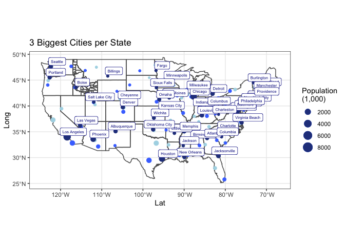

```r
library(ggplot2)
library(readr)
library(knitr)
library(dplyr)
```

```
## 
## Attaching package: 'dplyr'
```

```
## The following objects are masked from 'package:stats':
## 
##     filter, lag
```

```
## The following objects are masked from 'package:base':
## 
##     intersect, setdiff, setequal, union
```

```r
library(forcats)
library(downloader)
library(corrplot)
```

```
## corrplot 0.92 loaded
```

```r
library(tidyquant)
```

```
## Loading required package: lubridate
```

```
## 
## Attaching package: 'lubridate'
```

```
## The following objects are masked from 'package:base':
## 
##     date, intersect, setdiff, union
```

```
## Loading required package: PerformanceAnalytics
```

```
## Loading required package: xts
```

```
## Loading required package: zoo
```

```
## 
## Attaching package: 'zoo'
```

```
## The following objects are masked from 'package:base':
## 
##     as.Date, as.Date.numeric
```

```
## 
## Attaching package: 'xts'
```

```
## The following objects are masked from 'package:dplyr':
## 
##     first, last
```

```
## 
## Attaching package: 'PerformanceAnalytics'
```

```
## The following object is masked from 'package:graphics':
## 
##     legend
```

```
## Loading required package: quantmod
```

```
## Loading required package: TTR
```

```
## Registered S3 method overwritten by 'quantmod':
##   method            from
##   as.zoo.data.frame zoo
```

```r
library(timetk)
library(dygraphs)
library(scales)
```

```
## 
## Attaching package: 'scales'
```

```
## The following object is masked from 'package:readr':
## 
##     col_factor
```

```r
library(tidyverse)
```

```
## ── Attaching packages ─────────────────────────────────────── tidyverse 1.3.1 ──
```

```
## ✔ tibble  3.1.8     ✔ purrr   0.3.4
## ✔ tidyr   1.2.0     ✔ stringr 1.4.0
```

```
## ── Conflicts ────────────────────────────────────────── tidyverse_conflicts() ──
## ✖ lubridate::as.difftime() masks base::as.difftime()
## ✖ scales::col_factor()     masks readr::col_factor()
## ✖ lubridate::date()        masks base::date()
## ✖ purrr::discard()         masks scales::discard()
## ✖ dplyr::filter()          masks stats::filter()
## ✖ xts::first()             masks dplyr::first()
## ✖ lubridate::intersect()   masks base::intersect()
## ✖ dplyr::lag()             masks stats::lag()
## ✖ xts::last()              masks dplyr::last()
## ✖ lubridate::setdiff()     masks base::setdiff()
## ✖ lubridate::union()       masks base::union()
```

```r
library(sf)
```

```
## Linking to GEOS 3.10.2, GDAL 3.4.2, PROJ 8.2.1; sf_use_s2() is TRUE
```

```r
library(USAboundaries)
library(maps)
```

```
## 
## Attaching package: 'maps'
```

```
## The following object is masked from 'package:purrr':
## 
##     map
```

```r
library(ggsflabel)
```

```
## 
## Attaching package: 'ggsflabel'
```

```
## The following objects are masked from 'package:ggplot2':
## 
##     geom_sf_label, geom_sf_text, StatSfCoordinates
```

```r
library(devtools)
```

```
## Loading required package: usethis
```

```
## 
## Attaching package: 'devtools'
```

```
## The following object is masked from 'package:downloader':
## 
##     source_url
```

```r
library(remotes)
```

```
## 
## Attaching package: 'remotes'
```

```
## The following objects are masked from 'package:devtools':
## 
##     dev_package_deps, install_bioc, install_bitbucket, install_cran,
##     install_deps, install_dev, install_git, install_github,
##     install_gitlab, install_local, install_svn, install_url,
##     install_version, update_packages
```

```
## The following object is masked from 'package:usethis':
## 
##     git_credentials
```

```r
id <- us_counties(states = "ID")
states <- sf::st_as_sf(map("state", plot = FALSE, fill = TRUE))
```


```r
cities <- us_cities()
```

```
## City populations for contemporary data come from the 2010 census.
```

```r
big_cities <- cities %>%
  filter(state_name != 'Alaska', state_name != 'Hawaii') %>%
  group_by(state_name) %>%
  arrange(desc(population)) %>%
  slice(1:3)
```


```r
most <- big_cities %>%
  slice(1:1)

middle <- big_cities %>%
  slice(2:2)

third <- big_cities %>%
  slice(3:3)
```


```r
ggplot() +
  geom_sf(data = states, fill = NA) +
  geom_sf(data = id, fill = NA) +
  geom_sf(data = third, aes(size = population/1000), color = "lightblue") +
  geom_sf(data = middle, aes(size = population/1000), color = "royalblue1") +
  geom_sf(data = most, aes(size = population/1000), color = "royalblue4") +
  geom_sf_label(data = most, aes(label = city), color = "darkblue", nudge_x = 1.5, nudge_y = 1, size = 2) +
  scale_size_continuous(name = 'Population\n(1,000)') +
  labs(title="3 Biggest Cities per State", x="Lat",y="Long") +
  theme_bw()
```

```
## Warning in st_point_on_surface.sfc(data$geometry): st_point_on_surface may not
## give correct results for longitude/latitude data
```

<!-- -->

