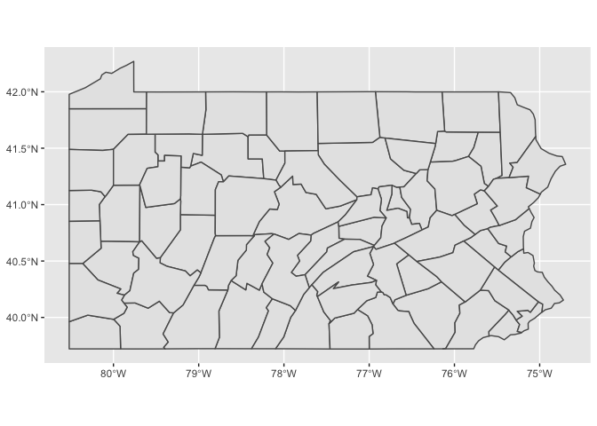

```r
library(ggplot2)
library(readr)
library(knitr)
library(dplyr)
```

```
## 
## Attaching package: 'dplyr'
```

```
## The following objects are masked from 'package:stats':
## 
##     filter, lag
```

```
## The following objects are masked from 'package:base':
## 
##     intersect, setdiff, setequal, union
```

```r
library(forcats)
library(downloader)
library(corrplot)
```

```
## corrplot 0.92 loaded
```

```r
library(tidyquant)
```

```
## Loading required package: lubridate
```

```
## 
## Attaching package: 'lubridate'
```

```
## The following objects are masked from 'package:base':
## 
##     date, intersect, setdiff, union
```

```
## Loading required package: PerformanceAnalytics
```

```
## Loading required package: xts
```

```
## Loading required package: zoo
```

```
## 
## Attaching package: 'zoo'
```

```
## The following objects are masked from 'package:base':
## 
##     as.Date, as.Date.numeric
```

```
## 
## Attaching package: 'xts'
```

```
## The following objects are masked from 'package:dplyr':
## 
##     first, last
```

```
## 
## Attaching package: 'PerformanceAnalytics'
```

```
## The following object is masked from 'package:graphics':
## 
##     legend
```

```
## Loading required package: quantmod
```

```
## Loading required package: TTR
```

```
## Registered S3 method overwritten by 'quantmod':
##   method            from
##   as.zoo.data.frame zoo
```

```r
library(timetk)
library(dygraphs)
library(scales)
```

```
## 
## Attaching package: 'scales'
```

```
## The following object is masked from 'package:readr':
## 
##     col_factor
```

```r
library(tidyverse)
```

```
## ── Attaching packages ─────────────────────────────────────── tidyverse 1.3.1 ──
```

```
## ✔ tibble  3.1.8     ✔ purrr   0.3.4
## ✔ tidyr   1.2.0     ✔ stringr 1.4.0
```

```
## ── Conflicts ────────────────────────────────────────── tidyverse_conflicts() ──
## ✖ lubridate::as.difftime() masks base::as.difftime()
## ✖ scales::col_factor()     masks readr::col_factor()
## ✖ lubridate::date()        masks base::date()
## ✖ purrr::discard()         masks scales::discard()
## ✖ dplyr::filter()          masks stats::filter()
## ✖ xts::first()             masks dplyr::first()
## ✖ lubridate::intersect()   masks base::intersect()
## ✖ dplyr::lag()             masks stats::lag()
## ✖ xts::last()              masks dplyr::last()
## ✖ lubridate::setdiff()     masks base::setdiff()
## ✖ lubridate::union()       masks base::union()
```

```r
library(sf)
```

```
## Linking to GEOS 3.10.2, GDAL 3.4.2, PROJ 8.2.1; sf_use_s2() is TRUE
```

```r
library(USAboundaries)
library(maps)
```

```
## 
## Attaching package: 'maps'
```

```
## The following object is masked from 'package:purrr':
## 
##     map
```

```r
library(ggsflabel)
```

```
## 
## Attaching package: 'ggsflabel'
```

```
## The following objects are masked from 'package:ggplot2':
## 
##     geom_sf_label, geom_sf_text, StatSfCoordinates
```

```r
library(devtools)
```

```
## Loading required package: usethis
```

```
## 
## Attaching package: 'devtools'
```

```
## The following object is masked from 'package:downloader':
## 
##     source_url
```

```r
library(remotes)
```

```
## 
## Attaching package: 'remotes'
```

```
## The following objects are masked from 'package:devtools':
## 
##     dev_package_deps, install_bioc, install_bitbucket, install_cran,
##     install_deps, install_dev, install_git, install_github,
##     install_gitlab, install_local, install_svn, install_url,
##     install_version, update_packages
```

```
## The following object is masked from 'package:usethis':
## 
##     git_credentials
```

```r
library(stringr)
library(leaflet)
```

```
## 
## Attaching package: 'leaflet'
```

```
## The following object is masked from 'package:xts':
## 
##     addLegend
```

```r
library(mapview)
```


```r
permit_data <- tempfile()
download("https://raw.githubusercontent.com/WJC-Data-Science/DTS350/master/permits.csv", 
         permit_data, mode = "wb")
permits <- read_csv(permit_data)
```

```
## New names:
## Rows: 327422 Columns: 8
## ── Column specification
## ──────────────────────────────────────────────────────── Delimiter: "," chr
## (3): StateAbbr, countyname, variable dbl (5): ...1, state, county, year, value
## ℹ Use `spec()` to retrieve the full column specification for this data. ℹ
## Specify the column types or set `show_col_types = FALSE` to quiet this message.
## • `` -> `...1`
```

```r
permits1 <- permits %>%
  filter(StateAbbr == "PA", year==2010)
```


```r
penn <- read.csv('pennlatlong.csv')
head(penn)
```

```
##   County.Name County.Code.Number County.Code.text Longitude Latitude
## 1       Adams                  1                1 -77.22224 39.87210
## 2   Allegheny                  2                2 -79.98620 40.46736
## 3   Armstrong                  3                3 -79.47317 40.81510
## 4      Beaver                  4                4 -80.35107 40.68349
## 5     Bedford                  5                5 -78.49116 40.00738
## 6       Berks                  6                6 -75.93077 40.41940
##   Georeferenced.Latitude...Longitude
## 1   POINT (-77.22224271 39.87209565)
## 2   POINT (-79.98619843 40.46735543)
## 3   POINT (-79.47316899 40.81509526)
## 4   POINT (-80.35107356 40.68349245)
## 5   POINT (-78.49116474 40.00737536)
## 6   POINT (-75.93077327 40.41939635)
```

```r
penn1 <- penn %>%
  mutate(county = as.character(County.Code.Number))
```


```r
permits2 <- permits1 %>%
  mutate(county = as.character(county))
```


```r
both <- left_join(penn1,permits2, by='county')
head(both)
```

```
##   County.Name County.Code.Number County.Code.text Longitude Latitude
## 1       Adams                  1                1 -77.22224 39.87210
## 2       Adams                  1                1 -77.22224 39.87210
## 3       Adams                  1                1 -77.22224 39.87210
## 4       Adams                  1                1 -77.22224 39.87210
## 5   Allegheny                  2                2 -79.98620 40.46736
## 6   Armstrong                  3                3 -79.47317 40.81510
##   Georeferenced.Latitude...Longitude county   ...1 state StateAbbr
## 1   POINT (-77.22224271 39.87209565)      1 235713    42        PA
## 2   POINT (-77.22224271 39.87209565)      1 235744    42        PA
## 3   POINT (-77.22224271 39.87209565)      1 235775    42        PA
## 4   POINT (-77.22224271 39.87209565)      1 235833    42        PA
## 5   POINT (-79.98619843 40.46735543)      2     NA    NA      <NA>
## 6   POINT (-79.47316899 40.81509526)      3 235844    42        PA
##         countyname            variable year value
## 1     Adams County         All Permits 2010   306
## 2     Adams County       Single Family 2010   284
## 3     Adams County     All Multifamily 2010    22
## 4     Adams County 5+-Unit Multifamily 2010    22
## 5             <NA>                <NA>   NA    NA
## 6 Allegheny County         All Permits 2010  1424
```

```r
both1 <- both %>%
  arrange(desc(value))
```


```r
both1$quartile <- ntile(both$value,4)
both1$quartile
```

```
##   [1]  4  4  2  2 NA  4  4  2  1  2 NA  3  3 NA  4  4  2  1  2 NA  3  3  1  1  1
##  [26] NA  4  4  3  3 NA  3  3  2  2  2  1 NA  3  3  1  1 NA NA  4  4  2  1  1  2
##  [51] NA  4  4  3  2  2 NA  3  3 NA NA NA  3  3 NA  4  4  3  1  3 NA  4  4  4  1
##  [76]  2  4 NA  2  2 NA  3  3 NA  2  2 NA  3  3 NA  3  3  1  1  1 NA  4  4  4  1
## [101]  1  3 NA  4  4  3  1  3 NA  4  4  1  1  1 NA  2  2 NA  4  4  4  1  1  3 NA
## [126]  4  4  1  1 NA  1  1 NA  4  4  2  2  1  2 NA  2  2 NA  2  2 NA  3  3  1  1
## [151] NA  3  3  1  1 NA  3  2  2  2 NA  2  2
```


```r
bestcounty <- both1 %>%
  filter(row_number() == 1)
```


```r
PA <- us_counties(state = 'PA')
```


```r
PAcounties <- ggplot(PA) +
  geom_sf()
PAcounties
```

<!-- -->

```r
ntile4 <- both1 %>%
  filter(quartile == 4)

ntile3 <- both1 %>%
  filter(quartile == 3)

ntile2 <- both1 %>%
  filter(quartile == 2)

ntile1 <- both1 %>%
  filter(quartile == 1)
```


```r
leaflet() %>%
  addTiles() %>%
  addCircleMarkers(data = ntile4,
                   radius = 7,
                   color = "blue",
                   stroke = FALSE,
                   fillOpacity = 1,
                   popup = ~county,
                   label = ~value) %>%
    addCircleMarkers(data = ntile3,
                   radius = 7,
                   color = "red",
                   stroke = FALSE,
                   fillOpacity = 1,
                   popup = ~county,
                   label = ~value)%>%
    addCircleMarkers(data = ntile2,
                   radius = 7,
                   color = "darkblue",
                   stroke = FALSE,
                   fillOpacity = 1,
                   popup = ~county,
                   label = ~value) %>%
    addCircleMarkers(data = ntile1,
                   radius = 7,
                   color = "green",
                   stroke = FALSE,
                   fillOpacity = 1,
                   popup = ~county,
                   label = ~value) %>%
    addCircleMarkers(data = bestcounty,
                   radius = 7,
                   color = "royalblue1",
                   stroke = FALSE,
                   fillOpacity = 1,
                   popup = ~county,
                   label = ~value)
```

```
## Assuming "Longitude" and "Latitude" are longitude and latitude, respectively
## Assuming "Longitude" and "Latitude" are longitude and latitude, respectively
## Assuming "Longitude" and "Latitude" are longitude and latitude, respectively
## Assuming "Longitude" and "Latitude" are longitude and latitude, respectively
## Assuming "Longitude" and "Latitude" are longitude and latitude, respectively
```

```{=html}
<div id="htmlwidget-b52c10887bd7c227648d" style="width:672px;height:480px;" class="leaflet html-widget"></div>
<script type="application/json" data-for="htmlwidget-b52c10887bd7c227648d">{"x":{"options":{"crs":{"crsClass":"L.CRS.EPSG3857","code":null,"proj4def":null,"projectedBounds":null,"options":{}}},"calls":[{"method":"addTiles","args":["https://{s}.tile.openstreetmap.org/{z}/{x}/{y}.png",null,null,{"minZoom":0,"maxZoom":18,"tileSize":256,"subdomains":"abc","errorTileUrl":"","tms":false,"noWrap":false,"zoomOffset":0,"zoomReverse":false,"opacity":1,"zIndex":1,"detectRetina":false,"attribution":"&copy; <a href=\"https://openstreetmap.org\">OpenStreetMap<\/a> contributors, <a href=\"https://creativecommons.org/licenses/by-sa/2.0/\">CC-BY-SA<\/a>"}]},{"method":"addCircleMarkers","args":[[40.81509526,40.81509526,41.30237777,41.34459792,41.000429,41.51357876,39.92487511,39.92487511,40.16759839,40.91936701,41.40341259,40.19109663,40.310315,40.91936701,39.92192531,39.92192531,41.04912086,40.48555024,40.85150926,40.19109663,40.19109663,41.34459792,41.74420644,40.00444354,40.00444354,41.40341259,41.40341259,40.33501133,40.81509526,41.51357876,41.43880265,40.9193135],[-79.47316899,-79.47316899,-80.26009411,-77.06942457,-78.47558343,-79.23780995,-78.11485045,-78.11485045,-77.26866271,-75.71107039,-79.76286561,-80.25180083,-79.47134118,-75.71107039,-76.72576052,-76.72576052,-76.4100218,-78.34907687,-76.71188423,-80.25180083,-80.25180083,-77.06942457,-77.89879229,-75.140236,-75.140236,-79.76286561,-79.76286561,-75.11291241,-79.47316899,-79.23780995,-78.20916932,-77.82500112],7,null,null,{"interactive":true,"className":"","stroke":false,"color":"blue","weight":5,"opacity":0.5,"fill":true,"fillColor":"blue","fillOpacity":1},null,null,["3","3","43","41","17","27","29","29","21","13","61","63","65","13","67","67","19","7","49","63","63","41","53","51","51","61","61","9","3","27","12","14"],null,["1424","1407","691","620","444","426","273","246","117","112","93","88","57","47","41","41","37","32","14","14","14","10","10","8","8","6","6","4","2","2",null,null],{"interactive":false,"permanent":false,"direction":"auto","opacity":1,"offset":[0,0],"textsize":"10px","textOnly":false,"className":"","sticky":true},null]},{"method":"addCircleMarkers","args":[[40.77113737,41.000429,40.49127491,41.51357876,40.00444354,40.00444354,41.34459792,41.34459792,41.99413787,41.13139091,41.30237777,41.51357876,40.19109663,40.00737536,41.04912086,40.416105,41.77333834,40.91936701,41.4480994,39.87209565,39.87209565,40.77113737,40.81509526,40.33501133,41.74420644,40.61464794,40.61464794,40.53433008,40.04590796,40.61274928,40.20989874,40.70751243],[-77.07255968,-78.47558343,-78.71894174,-79.23780995,-75.140236,-75.140236,-77.06942457,-77.06942457,-80.0407591,-79.00101814,-80.26009411,-79.23780995,-80.25180083,-78.49116474,-76.4100218,-77.9827661,-77.25788076,-75.71107039,-76.5147922,-77.22224271,-77.22224271,-77.07255968,-79.47316899,-75.11291241,-77.89879229,-75.60099481,-75.60099481,-77.405775,-76.25138768,-77.62003089,-75.37252001,-76.22332385],7,null,null,{"interactive":true,"className":"","stroke":false,"color":"red","weight":5,"opacity":0.5,"fill":true,"fillColor":"red","fillOpacity":1},null,null,["55","17","11","27","51","51","41","41","25","33","43","27","63","5","19","31","59","13","57","1","1","55","3","9","53","39","39","34","36","44","46","54"],null,["513","474","350","347","240","232","212","195","149","124","85","77","74","60","60","47","41","24","24","22","22","20","17","10","10","8","4",null,null,null,null,null],{"interactive":false,"permanent":false,"direction":"auto","opacity":1,"offset":[0,0],"textsize":"10px","textOnly":false,"className":"","sticky":true},null]},{"method":"addCircleMarkers","args":[[39.92487511,39.92487511,41.30237777,40.77113737,40.49127491,41.06091787,40.85150926,39.97487056,39.97487056,40.33501133,40.33501133,41.30237777,40.310315,41.02801824,41.43910064,41.000429,40.310315,40.310315,41.06091787,40.33501133,41.19279129,39.346129,41.68546907,39.91657867,41.42819416,39.92786197,39.85480393,39.97146299,41.8205686,40.96473131,41.64969805,41.51892488],[-78.11485045,-78.11485045,-80.26009411,-77.07255968,-78.71894174,-75.34083603,-76.71188423,-75.75626498,-75.75626498,-75.11291241,-75.11291241,-80.26009411,-79.47134118,-76.66470527,-75.61218345,-78.47558343,-79.47134118,-79.47134118,-75.34083603,-75.11291241,-79.42483608,-75.167756,-80.11321083,-75.40627712,-78.64947713,-77.72398845,-80.22943817,-79.03100206,-75.80250303,-77.06415803,-75.3051535,-76.01813003],7,null,null,{"interactive":true,"className":"","stroke":false,"color":"darkblue","weight":5,"opacity":0.5,"fill":true,"fillColor":"darkblue","fillOpacity":1},null,null,["29","29","43","55","11","45","49","15","15","9","9","43","65","47","35","17","65","65","45","9","16","0","20","23","24","28","30","56","58","60","64","66"],null,["1112","839","606","570","415","363","195","175","171","108","98","82","81","36","31","30","24","24","7","6",null,null,null,null,null,null,null,null,null,null,null,null],{"interactive":false,"permanent":false,"direction":"auto","opacity":1,"offset":[0,0],"textsize":"10px","textOnly":false,"className":"","sticky":true},null]},{"method":"addCircleMarkers","args":[[40.85150926,40.85150926,40.48555024,39.87209565,40.48555024,40.91936701,41.13139091,40.99325035,40.61464794,41.40341259,40.416105,41.02801824,41.000429,39.92487511,40.91936701,40.48555024,40.61464794,41.06091787,40.77113737,40.91936701,41.000429,39.97487056,39.97487056,41.06091787,40.46735543,40.41939635,41.79117814,41.23286274,40.367597,41.17836439,40.7545954,40.40415317],[-76.71188423,-76.71188423,-78.34907687,-77.22224271,-78.34907687,-75.71107039,-79.00101814,-80.33754114,-75.60099481,-79.76286561,-77.9827661,-76.66470527,-78.47558343,-78.11485045,-75.71107039,-78.34907687,-75.60099481,-75.34083603,-77.07255968,-75.71107039,-78.47558343,-75.75626498,-75.75626498,-75.34083603,-79.98619843,-75.93077327,-76.51825624,-77.6428376,-76.46182575,-75.9919961,-75.31263726,-77.25907385],7,null,null,{"interactive":true,"className":"","stroke":false,"color":"green","weight":5,"opacity":0.5,"fill":true,"fillColor":"green","fillOpacity":1},null,null,["49","49","7","1","7","13","33","37","39","61","31","47","17","29","13","7","39","45","55","13","17","15","15","45","2","6","8","18","38","40","48","50"],null,["586","369","337","306","305","159","124","123","108","99","47","36","17","17","16","12","12","9","8","7","7","4","4","2",null,null,null,null,null,null,null,null],{"interactive":false,"permanent":false,"direction":"auto","opacity":1,"offset":[0,0],"textsize":"10px","textOnly":false,"className":"","sticky":true},null]},{"method":"addCircleMarkers","args":[40.81509526,-79.47316899,7,null,null,{"interactive":true,"className":"","stroke":false,"color":"royalblue1","weight":5,"opacity":0.5,"fill":true,"fillColor":"royalblue1","fillOpacity":1},null,null,"3",null,"1424",{"interactive":false,"permanent":false,"direction":"auto","opacity":1,"offset":[0,0],"textsize":"10px","textOnly":false,"className":"","sticky":true},null]}],"limits":{"lat":[39.346129,41.99413787],"lng":[-80.33754114,-75.11291241]}},"evals":[],"jsHooks":[]}</script>
```

In my leaflet visualization, I was able to specifically designate each ntile with a unique color, in addition to the county with the most amount of permits. I'm not confident that the data is joined together correctly, due to some columns not matching each other correctly.

