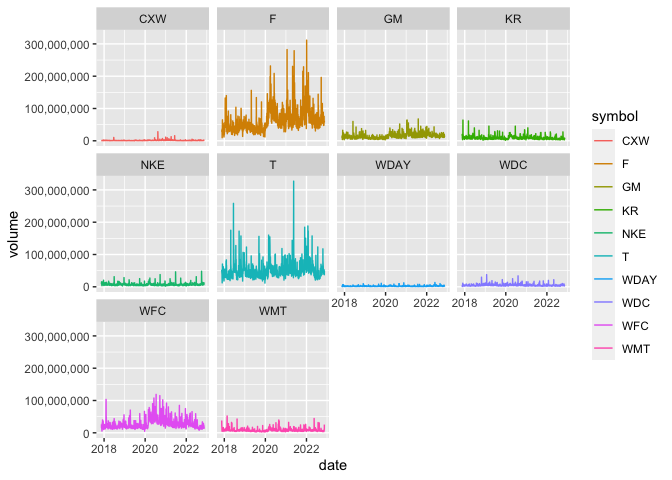
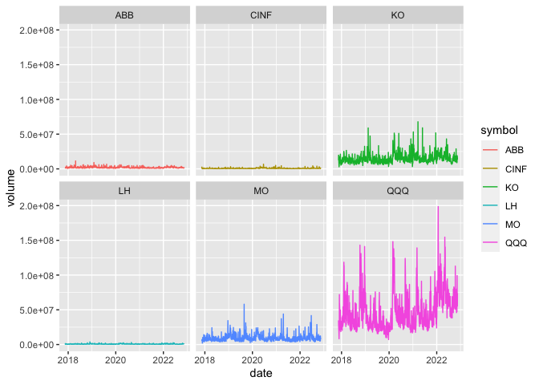
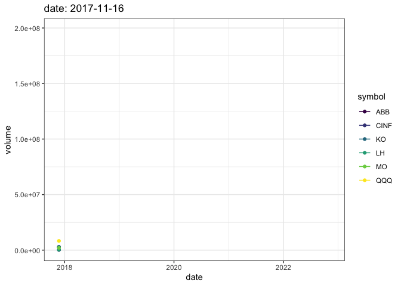

```r
library(ggplot2)
library(readr)
library(knitr)
library(tidyverse)
```

```
## ── Attaching packages ─────────────────────────────────────── tidyverse 1.3.1 ──
```

```
## ✔ tibble  3.1.8     ✔ dplyr   1.0.8
## ✔ tidyr   1.2.0     ✔ stringr 1.4.0
## ✔ purrr   0.3.4     ✔ forcats 0.5.1
```

```
## ── Conflicts ────────────────────────────────────────── tidyverse_conflicts() ──
## ✖ dplyr::filter() masks stats::filter()
## ✖ dplyr::lag()    masks stats::lag()
```

```r
library(dplyr)
library(forcats)
library(downloader)
library(corrplot)
```

```
## corrplot 0.92 loaded
```

```r
library(tidyquant)
```

```
## Loading required package: lubridate
```

```
## 
## Attaching package: 'lubridate'
```

```
## The following objects are masked from 'package:base':
## 
##     date, intersect, setdiff, union
```

```
## Loading required package: PerformanceAnalytics
```

```
## Loading required package: xts
```

```
## Loading required package: zoo
```

```
## 
## Attaching package: 'zoo'
```

```
## The following objects are masked from 'package:base':
## 
##     as.Date, as.Date.numeric
```

```
## 
## Attaching package: 'xts'
```

```
## The following objects are masked from 'package:dplyr':
## 
##     first, last
```

```
## 
## Attaching package: 'PerformanceAnalytics'
```

```
## The following object is masked from 'package:graphics':
## 
##     legend
```

```
## Loading required package: quantmod
```

```
## Loading required package: TTR
```

```
## Registered S3 method overwritten by 'quantmod':
##   method            from
##   as.zoo.data.frame zoo
```

```r
library(timetk)
library(dygraphs)
library(scales)
```

```
## 
## Attaching package: 'scales'
```

```
## The following object is masked from 'package:purrr':
## 
##     discard
```

```
## The following object is masked from 'package:readr':
## 
##     col_factor
```

```r
library(leaflet)
```

```
## 
## Attaching package: 'leaflet'
```

```
## The following object is masked from 'package:xts':
## 
##     addLegend
```


```r
tickers_today <- tq_get(c("CXW", "F", "GM", "JCP", "KR", "WDC", "NKE","T", "WDAY", "WFC", "WMT"), get = "stock.prices", from = today()-years(5), to = today())
```

```
## Warning: x = 'JCP', get = 'stock.prices': Error in getSymbols.yahoo(Symbols = "JCP", env = <environment>, verbose = FALSE, : Unable to import "JCP".
## JCP download failed after two attempts. Error message:
## HTTP error 404.
##  Removing JCP.
```

```r
head(tickers_today)
```

```
## # A tibble: 6 × 8
##   symbol date        open  high   low close volume adjusted
##   <chr>  <date>     <dbl> <dbl> <dbl> <dbl>  <dbl>    <dbl>
## 1 CXW    2017-11-16  23.2  23.6  23.1  23.4 621100     18.5
## 2 CXW    2017-11-17  23.4  23.6  23.1  23.2 726500     18.4
## 3 CXW    2017-11-20  23.2  23.5  23.2  23.2 583200     18.4
## 4 CXW    2017-11-21  23.4  23.4  22.9  23.0 732500     18.3
## 5 CXW    2017-11-22  23.0  23.3  22.8  23.2 409700     18.4
## 6 CXW    2017-11-24  23.3  23.3  22.9  23   304900     18.2
```
Graph setup

```r
setup <- tickers_today %>%
  select(symbol, date, adjusted) %>%
  pivot_wider(names_from = symbol, values_from = adjusted) %>%
  tk_xts(date_var = date)
```

```
## Warning: Non-numeric columns being dropped: date
```

```r
dygraph(setup, main = "Ticker Chart") %>%
  dyRebase(percent = TRUE) %>%
  dyShading(from = today()-years(5), to = today()) %>%
  dyRangeSelector()
```

```{=html}
<div id="htmlwidget-a5c5e772745e8992c02c" style="width:672px;height:480px;" class="dygraphs html-widget"></div>
<script type="application/json" data-for="htmlwidget-a5c5e772745e8992c02c">{"x":{"attrs":{"title":"Ticker Chart","labels":["day","CXW","F","GM","KR","WDC","NKE","T","WDAY","WFC","WMT"],"legend":"auto","retainDateWindow":false,"axes":{"x":{"pixelsPerLabel":60}},"showRangeSelector":true,"rangeSelectorHeight":40,"rangeSelectorPlotFillColor":" #A7B1C4","rangeSelectorPlotStrokeColor":"#808FAB","interactionModel":"Dygraph.Interaction.defaultModel"},"scale":"daily","annotations":[],"shadings":[{"from":"2017-11-16T00:00:00.000Z","to":"2022-11-16T00:00:00.000Z","color":"#EFEFEF","axis":"x"}],"events":[],"format":"date","data":[["2017-11-16T00:00:00.000Z","2017-11-17T00:00:00.000Z","2017-11-20T00:00:00.000Z","2017-11-21T00:00:00.000Z","2017-11-22T00:00:00.000Z","2017-11-24T00:00:00.000Z","2017-11-27T00:00:00.000Z","2017-11-28T00:00:00.000Z","2017-11-29T00:00:00.000Z","2017-11-30T00:00:00.000Z","2017-12-01T00:00:00.000Z","2017-12-04T00:00:00.000Z","2017-12-05T00:00:00.000Z","2017-12-06T00:00:00.000Z","2017-12-07T00:00:00.000Z","2017-12-08T00:00:00.000Z","2017-12-11T00:00:00.000Z","2017-12-12T00:00:00.000Z","2017-12-13T00:00:00.000Z","2017-12-14T00:00:00.000Z","2017-12-15T00:00:00.000Z","2017-12-18T00:00:00.000Z","2017-12-19T00:00:00.000Z","2017-12-20T00:00:00.000Z","2017-12-21T00:00:00.000Z","2017-12-22T00:00:00.000Z","2017-12-26T00:00:00.000Z","2017-12-27T00:00:00.000Z","2017-12-28T00:00:00.000Z","2017-12-29T00:00:00.000Z","2018-01-02T00:00:00.000Z","2018-01-03T00:00:00.000Z","2018-01-04T00:00:00.000Z","2018-01-05T00:00:00.000Z","2018-01-08T00:00:00.000Z","2018-01-09T00:00:00.000Z","2018-01-10T00:00:00.000Z","2018-01-11T00:00:00.000Z","2018-01-12T00:00:00.000Z","2018-01-16T00:00:00.000Z","2018-01-17T00:00:00.000Z","2018-01-18T00:00:00.000Z","2018-01-19T00:00:00.000Z","2018-01-22T00:00:00.000Z","2018-01-23T00:00:00.000Z","2018-01-24T00:00:00.000Z","2018-01-25T00:00:00.000Z","2018-01-26T00:00:00.000Z","2018-01-29T00:00:00.000Z","2018-01-30T00:00:00.000Z","2018-01-31T00:00:00.000Z","2018-02-01T00:00:00.000Z","2018-02-02T00:00:00.000Z","2018-02-05T00:00:00.000Z","2018-02-06T00:00:00.000Z","2018-02-07T00:00:00.000Z","2018-02-08T00:00:00.000Z","2018-02-09T00:00:00.000Z","2018-02-12T00:00:00.000Z","2018-02-13T00:00:00.000Z","2018-02-14T00:00:00.000Z","2018-02-15T00:00:00.000Z","2018-02-16T00:00:00.000Z","2018-02-20T00:00:00.000Z","2018-02-21T00:00:00.000Z","2018-02-22T00:00:00.000Z","2018-02-23T00:00:00.000Z","2018-02-26T00:00:00.000Z","2018-02-27T00:00:00.000Z","2018-02-28T00:00:00.000Z","2018-03-01T00:00:00.000Z","2018-03-02T00:00:00.000Z","2018-03-05T00:00:00.000Z","2018-03-06T00:00:00.000Z","2018-03-07T00:00:00.000Z","2018-03-08T00:00:00.000Z","2018-03-09T00:00:00.000Z","2018-03-12T00:00:00.000Z","2018-03-13T00:00:00.000Z","2018-03-14T00:00:00.000Z","2018-03-15T00:00:00.000Z","2018-03-16T00:00:00.000Z","2018-03-19T00:00:00.000Z","2018-03-20T00:00:00.000Z","2018-03-21T00:00:00.000Z","2018-03-22T00:00:00.000Z","2018-03-23T00:00:00.000Z","2018-03-26T00:00:00.000Z","2018-03-27T00:00:00.000Z","2018-03-28T00:00:00.000Z","2018-03-29T00:00:00.000Z","2018-04-02T00:00:00.000Z","2018-04-03T00:00:00.000Z","2018-04-04T00:00:00.000Z","2018-04-05T00:00:00.000Z","2018-04-06T00:00:00.000Z","2018-04-09T00:00:00.000Z","2018-04-10T00:00:00.000Z","2018-04-11T00:00:00.000Z","2018-04-12T00:00:00.000Z","2018-04-13T00:00:00.000Z","2018-04-16T00:00:00.000Z","2018-04-17T00:00:00.000Z","2018-04-18T00:00:00.000Z","2018-04-19T00:00:00.000Z","2018-04-20T00:00:00.000Z","2018-04-23T00:00:00.000Z","2018-04-24T00:00:00.000Z","2018-04-25T00:00:00.000Z","2018-04-26T00:00:00.000Z","2018-04-27T00:00:00.000Z","2018-04-30T00:00:00.000Z","2018-05-01T00:00:00.000Z","2018-05-02T00:00:00.000Z","2018-05-03T00:00:00.000Z","2018-05-04T00:00:00.000Z","2018-05-07T00:00:00.000Z","2018-05-08T00:00:00.000Z","2018-05-09T00:00:00.000Z","2018-05-10T00:00:00.000Z","2018-05-11T00:00:00.000Z","2018-05-14T00:00:00.000Z","2018-05-15T00:00:00.000Z","2018-05-16T00:00:00.000Z","2018-05-17T00:00:00.000Z","2018-05-18T00:00:00.000Z","2018-05-21T00:00:00.000Z","2018-05-22T00:00:00.000Z","2018-05-23T00:00:00.000Z","2018-05-24T00:00:00.000Z","2018-05-25T00:00:00.000Z","2018-05-29T00:00:00.000Z","2018-05-30T00:00:00.000Z","2018-05-31T00:00:00.000Z","2018-06-01T00:00:00.000Z","2018-06-04T00:00:00.000Z","2018-06-05T00:00:00.000Z","2018-06-06T00:00:00.000Z","2018-06-07T00:00:00.000Z","2018-06-08T00:00:00.000Z","2018-06-11T00:00:00.000Z","2018-06-12T00:00:00.000Z","2018-06-13T00:00:00.000Z","2018-06-14T00:00:00.000Z","2018-06-15T00:00:00.000Z","2018-06-18T00:00:00.000Z","2018-06-19T00:00:00.000Z","2018-06-20T00:00:00.000Z","2018-06-21T00:00:00.000Z","2018-06-22T00:00:00.000Z","2018-06-25T00:00:00.000Z","2018-06-26T00:00:00.000Z","2018-06-27T00:00:00.000Z","2018-06-28T00:00:00.000Z","2018-06-29T00:00:00.000Z","2018-07-02T00:00:00.000Z","2018-07-03T00:00:00.000Z","2018-07-05T00:00:00.000Z","2018-07-06T00:00:00.000Z","2018-07-09T00:00:00.000Z","2018-07-10T00:00:00.000Z","2018-07-11T00:00:00.000Z","2018-07-12T00:00:00.000Z","2018-07-13T00:00:00.000Z","2018-07-16T00:00:00.000Z","2018-07-17T00:00:00.000Z","2018-07-18T00:00:00.000Z","2018-07-19T00:00:00.000Z","2018-07-20T00:00:00.000Z","2018-07-23T00:00:00.000Z","2018-07-24T00:00:00.000Z","2018-07-25T00:00:00.000Z","2018-07-26T00:00:00.000Z","2018-07-27T00:00:00.000Z","2018-07-30T00:00:00.000Z","2018-07-31T00:00:00.000Z","2018-08-01T00:00:00.000Z","2018-08-02T00:00:00.000Z","2018-08-03T00:00:00.000Z","2018-08-06T00:00:00.000Z","2018-08-07T00:00:00.000Z","2018-08-08T00:00:00.000Z","2018-08-09T00:00:00.000Z","2018-08-10T00:00:00.000Z","2018-08-13T00:00:00.000Z","2018-08-14T00:00:00.000Z","2018-08-15T00:00:00.000Z","2018-08-16T00:00:00.000Z","2018-08-17T00:00:00.000Z","2018-08-20T00:00:00.000Z","2018-08-21T00:00:00.000Z","2018-08-22T00:00:00.000Z","2018-08-23T00:00:00.000Z","2018-08-24T00:00:00.000Z","2018-08-27T00:00:00.000Z","2018-08-28T00:00:00.000Z","2018-08-29T00:00:00.000Z","2018-08-30T00:00:00.000Z","2018-08-31T00:00:00.000Z","2018-09-04T00:00:00.000Z","2018-09-05T00:00:00.000Z","2018-09-06T00:00:00.000Z","2018-09-07T00:00:00.000Z","2018-09-10T00:00:00.000Z","2018-09-11T00:00:00.000Z","2018-09-12T00:00:00.000Z","2018-09-13T00:00:00.000Z","2018-09-14T00:00:00.000Z","2018-09-17T00:00:00.000Z","2018-09-18T00:00:00.000Z","2018-09-19T00:00:00.000Z","2018-09-20T00:00:00.000Z","2018-09-21T00:00:00.000Z","2018-09-24T00:00:00.000Z","2018-09-25T00:00:00.000Z","2018-09-26T00:00:00.000Z","2018-09-27T00:00:00.000Z","2018-09-28T00:00:00.000Z","2018-10-01T00:00:00.000Z","2018-10-02T00:00:00.000Z","2018-10-03T00:00:00.000Z","2018-10-04T00:00:00.000Z","2018-10-05T00:00:00.000Z","2018-10-08T00:00:00.000Z","2018-10-09T00:00:00.000Z","2018-10-10T00:00:00.000Z","2018-10-11T00:00:00.000Z","2018-10-12T00:00:00.000Z","2018-10-15T00:00:00.000Z","2018-10-16T00:00:00.000Z","2018-10-17T00:00:00.000Z","2018-10-18T00:00:00.000Z","2018-10-19T00:00:00.000Z","2018-10-22T00:00:00.000Z","2018-10-23T00:00:00.000Z","2018-10-24T00:00:00.000Z","2018-10-25T00:00:00.000Z","2018-10-26T00:00:00.000Z","2018-10-29T00:00:00.000Z","2018-10-30T00:00:00.000Z","2018-10-31T00:00:00.000Z","2018-11-01T00:00:00.000Z","2018-11-02T00:00:00.000Z","2018-11-05T00:00:00.000Z","2018-11-06T00:00:00.000Z","2018-11-07T00:00:00.000Z","2018-11-08T00:00:00.000Z","2018-11-09T00:00:00.000Z","2018-11-12T00:00:00.000Z","2018-11-13T00:00:00.000Z","2018-11-14T00:00:00.000Z","2018-11-15T00:00:00.000Z","2018-11-16T00:00:00.000Z","2018-11-19T00:00:00.000Z","2018-11-20T00:00:00.000Z","2018-11-21T00:00:00.000Z","2018-11-23T00:00:00.000Z","2018-11-26T00:00:00.000Z","2018-11-27T00:00:00.000Z","2018-11-28T00:00:00.000Z","2018-11-29T00:00:00.000Z","2018-11-30T00:00:00.000Z","2018-12-03T00:00:00.000Z","2018-12-04T00:00:00.000Z","2018-12-06T00:00:00.000Z","2018-12-07T00:00:00.000Z","2018-12-10T00:00:00.000Z","2018-12-11T00:00:00.000Z","2018-12-12T00:00:00.000Z","2018-12-13T00:00:00.000Z","2018-12-14T00:00:00.000Z","2018-12-17T00:00:00.000Z","2018-12-18T00:00:00.000Z","2018-12-19T00:00:00.000Z","2018-12-20T00:00:00.000Z","2018-12-21T00:00:00.000Z","2018-12-24T00:00:00.000Z","2018-12-26T00:00:00.000Z","2018-12-27T00:00:00.000Z","2018-12-28T00:00:00.000Z","2018-12-31T00:00:00.000Z","2019-01-02T00:00:00.000Z","2019-01-03T00:00:00.000Z","2019-01-04T00:00:00.000Z","2019-01-07T00:00:00.000Z","2019-01-08T00:00:00.000Z","2019-01-09T00:00:00.000Z","2019-01-10T00:00:00.000Z","2019-01-11T00:00:00.000Z","2019-01-14T00:00:00.000Z","2019-01-15T00:00:00.000Z","2019-01-16T00:00:00.000Z","2019-01-17T00:00:00.000Z","2019-01-18T00:00:00.000Z","2019-01-22T00:00:00.000Z","2019-01-23T00:00:00.000Z","2019-01-24T00:00:00.000Z","2019-01-25T00:00:00.000Z","2019-01-28T00:00:00.000Z","2019-01-29T00:00:00.000Z","2019-01-30T00:00:00.000Z","2019-01-31T00:00:00.000Z","2019-02-01T00:00:00.000Z","2019-02-04T00:00:00.000Z","2019-02-05T00:00:00.000Z","2019-02-06T00:00:00.000Z","2019-02-07T00:00:00.000Z","2019-02-08T00:00:00.000Z","2019-02-11T00:00:00.000Z","2019-02-12T00:00:00.000Z","2019-02-13T00:00:00.000Z","2019-02-14T00:00:00.000Z","2019-02-15T00:00:00.000Z","2019-02-19T00:00:00.000Z","2019-02-20T00:00:00.000Z","2019-02-21T00:00:00.000Z","2019-02-22T00:00:00.000Z","2019-02-25T00:00:00.000Z","2019-02-26T00:00:00.000Z","2019-02-27T00:00:00.000Z","2019-02-28T00:00:00.000Z","2019-03-01T00:00:00.000Z","2019-03-04T00:00:00.000Z","2019-03-05T00:00:00.000Z","2019-03-06T00:00:00.000Z","2019-03-07T00:00:00.000Z","2019-03-08T00:00:00.000Z","2019-03-11T00:00:00.000Z","2019-03-12T00:00:00.000Z","2019-03-13T00:00:00.000Z","2019-03-14T00:00:00.000Z","2019-03-15T00:00:00.000Z","2019-03-18T00:00:00.000Z","2019-03-19T00:00:00.000Z","2019-03-20T00:00:00.000Z","2019-03-21T00:00:00.000Z","2019-03-22T00:00:00.000Z","2019-03-25T00:00:00.000Z","2019-03-26T00:00:00.000Z","2019-03-27T00:00:00.000Z","2019-03-28T00:00:00.000Z","2019-03-29T00:00:00.000Z","2019-04-01T00:00:00.000Z","2019-04-02T00:00:00.000Z","2019-04-03T00:00:00.000Z","2019-04-04T00:00:00.000Z","2019-04-05T00:00:00.000Z","2019-04-08T00:00:00.000Z","2019-04-09T00:00:00.000Z","2019-04-10T00:00:00.000Z","2019-04-11T00:00:00.000Z","2019-04-12T00:00:00.000Z","2019-04-15T00:00:00.000Z","2019-04-16T00:00:00.000Z","2019-04-17T00:00:00.000Z","2019-04-18T00:00:00.000Z","2019-04-22T00:00:00.000Z","2019-04-23T00:00:00.000Z","2019-04-24T00:00:00.000Z","2019-04-25T00:00:00.000Z","2019-04-26T00:00:00.000Z","2019-04-29T00:00:00.000Z","2019-04-30T00:00:00.000Z","2019-05-01T00:00:00.000Z","2019-05-02T00:00:00.000Z","2019-05-03T00:00:00.000Z","2019-05-06T00:00:00.000Z","2019-05-07T00:00:00.000Z","2019-05-08T00:00:00.000Z","2019-05-09T00:00:00.000Z","2019-05-10T00:00:00.000Z","2019-05-13T00:00:00.000Z","2019-05-14T00:00:00.000Z","2019-05-15T00:00:00.000Z","2019-05-16T00:00:00.000Z","2019-05-17T00:00:00.000Z","2019-05-20T00:00:00.000Z","2019-05-21T00:00:00.000Z","2019-05-22T00:00:00.000Z","2019-05-23T00:00:00.000Z","2019-05-24T00:00:00.000Z","2019-05-28T00:00:00.000Z","2019-05-29T00:00:00.000Z","2019-05-30T00:00:00.000Z","2019-05-31T00:00:00.000Z","2019-06-03T00:00:00.000Z","2019-06-04T00:00:00.000Z","2019-06-05T00:00:00.000Z","2019-06-06T00:00:00.000Z","2019-06-07T00:00:00.000Z","2019-06-10T00:00:00.000Z","2019-06-11T00:00:00.000Z","2019-06-12T00:00:00.000Z","2019-06-13T00:00:00.000Z","2019-06-14T00:00:00.000Z","2019-06-17T00:00:00.000Z","2019-06-18T00:00:00.000Z","2019-06-19T00:00:00.000Z","2019-06-20T00:00:00.000Z","2019-06-21T00:00:00.000Z","2019-06-24T00:00:00.000Z","2019-06-25T00:00:00.000Z","2019-06-26T00:00:00.000Z","2019-06-27T00:00:00.000Z","2019-06-28T00:00:00.000Z","2019-07-01T00:00:00.000Z","2019-07-02T00:00:00.000Z","2019-07-03T00:00:00.000Z","2019-07-05T00:00:00.000Z","2019-07-08T00:00:00.000Z","2019-07-09T00:00:00.000Z","2019-07-10T00:00:00.000Z","2019-07-11T00:00:00.000Z","2019-07-12T00:00:00.000Z","2019-07-15T00:00:00.000Z","2019-07-16T00:00:00.000Z","2019-07-17T00:00:00.000Z","2019-07-18T00:00:00.000Z","2019-07-19T00:00:00.000Z","2019-07-22T00:00:00.000Z","2019-07-23T00:00:00.000Z","2019-07-24T00:00:00.000Z","2019-07-25T00:00:00.000Z","2019-07-26T00:00:00.000Z","2019-07-29T00:00:00.000Z","2019-07-30T00:00:00.000Z","2019-07-31T00:00:00.000Z","2019-08-01T00:00:00.000Z","2019-08-02T00:00:00.000Z","2019-08-05T00:00:00.000Z","2019-08-06T00:00:00.000Z","2019-08-07T00:00:00.000Z","2019-08-08T00:00:00.000Z","2019-08-09T00:00:00.000Z","2019-08-12T00:00:00.000Z","2019-08-13T00:00:00.000Z","2019-08-14T00:00:00.000Z","2019-08-15T00:00:00.000Z","2019-08-16T00:00:00.000Z","2019-08-19T00:00:00.000Z","2019-08-20T00:00:00.000Z","2019-08-21T00:00:00.000Z","2019-08-22T00:00:00.000Z","2019-08-23T00:00:00.000Z","2019-08-26T00:00:00.000Z","2019-08-27T00:00:00.000Z","2019-08-28T00:00:00.000Z","2019-08-29T00:00:00.000Z","2019-08-30T00:00:00.000Z","2019-09-03T00:00:00.000Z","2019-09-04T00:00:00.000Z","2019-09-05T00:00:00.000Z","2019-09-06T00:00:00.000Z","2019-09-09T00:00:00.000Z","2019-09-10T00:00:00.000Z","2019-09-11T00:00:00.000Z","2019-09-12T00:00:00.000Z","2019-09-13T00:00:00.000Z","2019-09-16T00:00:00.000Z","2019-09-17T00:00:00.000Z","2019-09-18T00:00:00.000Z","2019-09-19T00:00:00.000Z","2019-09-20T00:00:00.000Z","2019-09-23T00:00:00.000Z","2019-09-24T00:00:00.000Z","2019-09-25T00:00:00.000Z","2019-09-26T00:00:00.000Z","2019-09-27T00:00:00.000Z","2019-09-30T00:00:00.000Z","2019-10-01T00:00:00.000Z","2019-10-02T00:00:00.000Z","2019-10-03T00:00:00.000Z","2019-10-04T00:00:00.000Z","2019-10-07T00:00:00.000Z","2019-10-08T00:00:00.000Z","2019-10-09T00:00:00.000Z","2019-10-10T00:00:00.000Z","2019-10-11T00:00:00.000Z","2019-10-14T00:00:00.000Z","2019-10-15T00:00:00.000Z","2019-10-16T00:00:00.000Z","2019-10-17T00:00:00.000Z","2019-10-18T00:00:00.000Z","2019-10-21T00:00:00.000Z","2019-10-22T00:00:00.000Z","2019-10-23T00:00:00.000Z","2019-10-24T00:00:00.000Z","2019-10-25T00:00:00.000Z","2019-10-28T00:00:00.000Z","2019-10-29T00:00:00.000Z","2019-10-30T00:00:00.000Z","2019-10-31T00:00:00.000Z","2019-11-01T00:00:00.000Z","2019-11-04T00:00:00.000Z","2019-11-05T00:00:00.000Z","2019-11-06T00:00:00.000Z","2019-11-07T00:00:00.000Z","2019-11-08T00:00:00.000Z","2019-11-11T00:00:00.000Z","2019-11-12T00:00:00.000Z","2019-11-13T00:00:00.000Z","2019-11-14T00:00:00.000Z","2019-11-15T00:00:00.000Z","2019-11-18T00:00:00.000Z","2019-11-19T00:00:00.000Z","2019-11-20T00:00:00.000Z","2019-11-21T00:00:00.000Z","2019-11-22T00:00:00.000Z","2019-11-25T00:00:00.000Z","2019-11-26T00:00:00.000Z","2019-11-27T00:00:00.000Z","2019-11-29T00:00:00.000Z","2019-12-02T00:00:00.000Z","2019-12-03T00:00:00.000Z","2019-12-04T00:00:00.000Z","2019-12-05T00:00:00.000Z","2019-12-06T00:00:00.000Z","2019-12-09T00:00:00.000Z","2019-12-10T00:00:00.000Z","2019-12-11T00:00:00.000Z","2019-12-12T00:00:00.000Z","2019-12-13T00:00:00.000Z","2019-12-16T00:00:00.000Z","2019-12-17T00:00:00.000Z","2019-12-18T00:00:00.000Z","2019-12-19T00:00:00.000Z","2019-12-20T00:00:00.000Z","2019-12-23T00:00:00.000Z","2019-12-24T00:00:00.000Z","2019-12-26T00:00:00.000Z","2019-12-27T00:00:00.000Z","2019-12-30T00:00:00.000Z","2019-12-31T00:00:00.000Z","2020-01-02T00:00:00.000Z","2020-01-03T00:00:00.000Z","2020-01-06T00:00:00.000Z","2020-01-07T00:00:00.000Z","2020-01-08T00:00:00.000Z","2020-01-09T00:00:00.000Z","2020-01-10T00:00:00.000Z","2020-01-13T00:00:00.000Z","2020-01-14T00:00:00.000Z","2020-01-15T00:00:00.000Z","2020-01-16T00:00:00.000Z","2020-01-17T00:00:00.000Z","2020-01-21T00:00:00.000Z","2020-01-22T00:00:00.000Z","2020-01-23T00:00:00.000Z","2020-01-24T00:00:00.000Z","2020-01-27T00:00:00.000Z","2020-01-28T00:00:00.000Z","2020-01-29T00:00:00.000Z","2020-01-30T00:00:00.000Z","2020-01-31T00:00:00.000Z","2020-02-03T00:00:00.000Z","2020-02-04T00:00:00.000Z","2020-02-05T00:00:00.000Z","2020-02-06T00:00:00.000Z","2020-02-07T00:00:00.000Z","2020-02-10T00:00:00.000Z","2020-02-11T00:00:00.000Z","2020-02-12T00:00:00.000Z","2020-02-13T00:00:00.000Z","2020-02-14T00:00:00.000Z","2020-02-18T00:00:00.000Z","2020-02-19T00:00:00.000Z","2020-02-20T00:00:00.000Z","2020-02-21T00:00:00.000Z","2020-02-24T00:00:00.000Z","2020-02-25T00:00:00.000Z","2020-02-26T00:00:00.000Z","2020-02-27T00:00:00.000Z","2020-02-28T00:00:00.000Z","2020-03-02T00:00:00.000Z","2020-03-03T00:00:00.000Z","2020-03-04T00:00:00.000Z","2020-03-05T00:00:00.000Z","2020-03-06T00:00:00.000Z","2020-03-09T00:00:00.000Z","2020-03-10T00:00:00.000Z","2020-03-11T00:00:00.000Z","2020-03-12T00:00:00.000Z","2020-03-13T00:00:00.000Z","2020-03-16T00:00:00.000Z","2020-03-17T00:00:00.000Z","2020-03-18T00:00:00.000Z","2020-03-19T00:00:00.000Z","2020-03-20T00:00:00.000Z","2020-03-23T00:00:00.000Z","2020-03-24T00:00:00.000Z","2020-03-25T00:00:00.000Z","2020-03-26T00:00:00.000Z","2020-03-27T00:00:00.000Z","2020-03-30T00:00:00.000Z","2020-03-31T00:00:00.000Z","2020-04-01T00:00:00.000Z","2020-04-02T00:00:00.000Z","2020-04-03T00:00:00.000Z","2020-04-06T00:00:00.000Z","2020-04-07T00:00:00.000Z","2020-04-08T00:00:00.000Z","2020-04-09T00:00:00.000Z","2020-04-13T00:00:00.000Z","2020-04-14T00:00:00.000Z","2020-04-15T00:00:00.000Z","2020-04-16T00:00:00.000Z","2020-04-17T00:00:00.000Z","2020-04-20T00:00:00.000Z","2020-04-21T00:00:00.000Z","2020-04-22T00:00:00.000Z","2020-04-23T00:00:00.000Z","2020-04-24T00:00:00.000Z","2020-04-27T00:00:00.000Z","2020-04-28T00:00:00.000Z","2020-04-29T00:00:00.000Z","2020-04-30T00:00:00.000Z","2020-05-01T00:00:00.000Z","2020-05-04T00:00:00.000Z","2020-05-05T00:00:00.000Z","2020-05-06T00:00:00.000Z","2020-05-07T00:00:00.000Z","2020-05-08T00:00:00.000Z","2020-05-11T00:00:00.000Z","2020-05-12T00:00:00.000Z","2020-05-13T00:00:00.000Z","2020-05-14T00:00:00.000Z","2020-05-15T00:00:00.000Z","2020-05-18T00:00:00.000Z","2020-05-19T00:00:00.000Z","2020-05-20T00:00:00.000Z","2020-05-21T00:00:00.000Z","2020-05-22T00:00:00.000Z","2020-05-26T00:00:00.000Z","2020-05-27T00:00:00.000Z","2020-05-28T00:00:00.000Z","2020-05-29T00:00:00.000Z","2020-06-01T00:00:00.000Z","2020-06-02T00:00:00.000Z","2020-06-03T00:00:00.000Z","2020-06-04T00:00:00.000Z","2020-06-05T00:00:00.000Z","2020-06-08T00:00:00.000Z","2020-06-09T00:00:00.000Z","2020-06-10T00:00:00.000Z","2020-06-11T00:00:00.000Z","2020-06-12T00:00:00.000Z","2020-06-15T00:00:00.000Z","2020-06-16T00:00:00.000Z","2020-06-17T00:00:00.000Z","2020-06-18T00:00:00.000Z","2020-06-19T00:00:00.000Z","2020-06-22T00:00:00.000Z","2020-06-23T00:00:00.000Z","2020-06-24T00:00:00.000Z","2020-06-25T00:00:00.000Z","2020-06-26T00:00:00.000Z","2020-06-29T00:00:00.000Z","2020-06-30T00:00:00.000Z","2020-07-01T00:00:00.000Z","2020-07-02T00:00:00.000Z","2020-07-06T00:00:00.000Z","2020-07-07T00:00:00.000Z","2020-07-08T00:00:00.000Z","2020-07-09T00:00:00.000Z","2020-07-10T00:00:00.000Z","2020-07-13T00:00:00.000Z","2020-07-14T00:00:00.000Z","2020-07-15T00:00:00.000Z","2020-07-16T00:00:00.000Z","2020-07-17T00:00:00.000Z","2020-07-20T00:00:00.000Z","2020-07-21T00:00:00.000Z","2020-07-22T00:00:00.000Z","2020-07-23T00:00:00.000Z","2020-07-24T00:00:00.000Z","2020-07-27T00:00:00.000Z","2020-07-28T00:00:00.000Z","2020-07-29T00:00:00.000Z","2020-07-30T00:00:00.000Z","2020-07-31T00:00:00.000Z","2020-08-03T00:00:00.000Z","2020-08-04T00:00:00.000Z","2020-08-05T00:00:00.000Z","2020-08-06T00:00:00.000Z","2020-08-07T00:00:00.000Z","2020-08-10T00:00:00.000Z","2020-08-11T00:00:00.000Z","2020-08-12T00:00:00.000Z","2020-08-13T00:00:00.000Z","2020-08-14T00:00:00.000Z","2020-08-17T00:00:00.000Z","2020-08-18T00:00:00.000Z","2020-08-19T00:00:00.000Z","2020-08-20T00:00:00.000Z","2020-08-21T00:00:00.000Z","2020-08-24T00:00:00.000Z","2020-08-25T00:00:00.000Z","2020-08-26T00:00:00.000Z","2020-08-27T00:00:00.000Z","2020-08-28T00:00:00.000Z","2020-08-31T00:00:00.000Z","2020-09-01T00:00:00.000Z","2020-09-02T00:00:00.000Z","2020-09-03T00:00:00.000Z","2020-09-04T00:00:00.000Z","2020-09-08T00:00:00.000Z","2020-09-09T00:00:00.000Z","2020-09-10T00:00:00.000Z","2020-09-11T00:00:00.000Z","2020-09-14T00:00:00.000Z","2020-09-15T00:00:00.000Z","2020-09-16T00:00:00.000Z","2020-09-17T00:00:00.000Z","2020-09-18T00:00:00.000Z","2020-09-21T00:00:00.000Z","2020-09-22T00:00:00.000Z","2020-09-23T00:00:00.000Z","2020-09-24T00:00:00.000Z","2020-09-25T00:00:00.000Z","2020-09-28T00:00:00.000Z","2020-09-29T00:00:00.000Z","2020-09-30T00:00:00.000Z","2020-10-01T00:00:00.000Z","2020-10-02T00:00:00.000Z","2020-10-05T00:00:00.000Z","2020-10-06T00:00:00.000Z","2020-10-07T00:00:00.000Z","2020-10-08T00:00:00.000Z","2020-10-09T00:00:00.000Z","2020-10-12T00:00:00.000Z","2020-10-13T00:00:00.000Z","2020-10-14T00:00:00.000Z","2020-10-15T00:00:00.000Z","2020-10-16T00:00:00.000Z","2020-10-19T00:00:00.000Z","2020-10-20T00:00:00.000Z","2020-10-21T00:00:00.000Z","2020-10-22T00:00:00.000Z","2020-10-23T00:00:00.000Z","2020-10-26T00:00:00.000Z","2020-10-27T00:00:00.000Z","2020-10-28T00:00:00.000Z","2020-10-29T00:00:00.000Z","2020-10-30T00:00:00.000Z","2020-11-02T00:00:00.000Z","2020-11-03T00:00:00.000Z","2020-11-04T00:00:00.000Z","2020-11-05T00:00:00.000Z","2020-11-06T00:00:00.000Z","2020-11-09T00:00:00.000Z","2020-11-10T00:00:00.000Z","2020-11-11T00:00:00.000Z","2020-11-12T00:00:00.000Z","2020-11-13T00:00:00.000Z","2020-11-16T00:00:00.000Z","2020-11-17T00:00:00.000Z","2020-11-18T00:00:00.000Z","2020-11-19T00:00:00.000Z","2020-11-20T00:00:00.000Z","2020-11-23T00:00:00.000Z","2020-11-24T00:00:00.000Z","2020-11-25T00:00:00.000Z","2020-11-27T00:00:00.000Z","2020-11-30T00:00:00.000Z","2020-12-01T00:00:00.000Z","2020-12-02T00:00:00.000Z","2020-12-03T00:00:00.000Z","2020-12-04T00:00:00.000Z","2020-12-07T00:00:00.000Z","2020-12-08T00:00:00.000Z","2020-12-09T00:00:00.000Z","2020-12-10T00:00:00.000Z","2020-12-11T00:00:00.000Z","2020-12-14T00:00:00.000Z","2020-12-15T00:00:00.000Z","2020-12-16T00:00:00.000Z","2020-12-17T00:00:00.000Z","2020-12-18T00:00:00.000Z","2020-12-21T00:00:00.000Z","2020-12-22T00:00:00.000Z","2020-12-23T00:00:00.000Z","2020-12-24T00:00:00.000Z","2020-12-28T00:00:00.000Z","2020-12-29T00:00:00.000Z","2020-12-30T00:00:00.000Z","2020-12-31T00:00:00.000Z","2021-01-04T00:00:00.000Z","2021-01-05T00:00:00.000Z","2021-01-06T00:00:00.000Z","2021-01-07T00:00:00.000Z","2021-01-08T00:00:00.000Z","2021-01-11T00:00:00.000Z","2021-01-12T00:00:00.000Z","2021-01-13T00:00:00.000Z","2021-01-14T00:00:00.000Z","2021-01-15T00:00:00.000Z","2021-01-19T00:00:00.000Z","2021-01-20T00:00:00.000Z","2021-01-21T00:00:00.000Z","2021-01-22T00:00:00.000Z","2021-01-25T00:00:00.000Z","2021-01-26T00:00:00.000Z","2021-01-27T00:00:00.000Z","2021-01-28T00:00:00.000Z","2021-01-29T00:00:00.000Z","2021-02-01T00:00:00.000Z","2021-02-02T00:00:00.000Z","2021-02-03T00:00:00.000Z","2021-02-04T00:00:00.000Z","2021-02-05T00:00:00.000Z","2021-02-08T00:00:00.000Z","2021-02-09T00:00:00.000Z","2021-02-10T00:00:00.000Z","2021-02-11T00:00:00.000Z","2021-02-12T00:00:00.000Z","2021-02-16T00:00:00.000Z","2021-02-17T00:00:00.000Z","2021-02-18T00:00:00.000Z","2021-02-19T00:00:00.000Z","2021-02-22T00:00:00.000Z","2021-02-23T00:00:00.000Z","2021-02-24T00:00:00.000Z","2021-02-25T00:00:00.000Z","2021-02-26T00:00:00.000Z","2021-03-01T00:00:00.000Z","2021-03-02T00:00:00.000Z","2021-03-03T00:00:00.000Z","2021-03-04T00:00:00.000Z","2021-03-05T00:00:00.000Z","2021-03-08T00:00:00.000Z","2021-03-09T00:00:00.000Z","2021-03-10T00:00:00.000Z","2021-03-11T00:00:00.000Z","2021-03-12T00:00:00.000Z","2021-03-15T00:00:00.000Z","2021-03-16T00:00:00.000Z","2021-03-17T00:00:00.000Z","2021-03-18T00:00:00.000Z","2021-03-19T00:00:00.000Z","2021-03-22T00:00:00.000Z","2021-03-23T00:00:00.000Z","2021-03-24T00:00:00.000Z","2021-03-25T00:00:00.000Z","2021-03-26T00:00:00.000Z","2021-03-29T00:00:00.000Z","2021-03-30T00:00:00.000Z","2021-03-31T00:00:00.000Z","2021-04-01T00:00:00.000Z","2021-04-05T00:00:00.000Z","2021-04-06T00:00:00.000Z","2021-04-07T00:00:00.000Z","2021-04-08T00:00:00.000Z","2021-04-09T00:00:00.000Z","2021-04-12T00:00:00.000Z","2021-04-13T00:00:00.000Z","2021-04-14T00:00:00.000Z","2021-04-15T00:00:00.000Z","2021-04-16T00:00:00.000Z","2021-04-19T00:00:00.000Z","2021-04-20T00:00:00.000Z","2021-04-21T00:00:00.000Z","2021-04-22T00:00:00.000Z","2021-04-23T00:00:00.000Z","2021-04-26T00:00:00.000Z","2021-04-27T00:00:00.000Z","2021-04-28T00:00:00.000Z","2021-04-29T00:00:00.000Z","2021-04-30T00:00:00.000Z","2021-05-03T00:00:00.000Z","2021-05-04T00:00:00.000Z","2021-05-05T00:00:00.000Z","2021-05-06T00:00:00.000Z","2021-05-07T00:00:00.000Z","2021-05-10T00:00:00.000Z","2021-05-11T00:00:00.000Z","2021-05-12T00:00:00.000Z","2021-05-13T00:00:00.000Z","2021-05-14T00:00:00.000Z","2021-05-17T00:00:00.000Z","2021-05-18T00:00:00.000Z","2021-05-19T00:00:00.000Z","2021-05-20T00:00:00.000Z","2021-05-21T00:00:00.000Z","2021-05-24T00:00:00.000Z","2021-05-25T00:00:00.000Z","2021-05-26T00:00:00.000Z","2021-05-27T00:00:00.000Z","2021-05-28T00:00:00.000Z","2021-06-01T00:00:00.000Z","2021-06-02T00:00:00.000Z","2021-06-03T00:00:00.000Z","2021-06-04T00:00:00.000Z","2021-06-07T00:00:00.000Z","2021-06-08T00:00:00.000Z","2021-06-09T00:00:00.000Z","2021-06-10T00:00:00.000Z","2021-06-11T00:00:00.000Z","2021-06-14T00:00:00.000Z","2021-06-15T00:00:00.000Z","2021-06-16T00:00:00.000Z","2021-06-17T00:00:00.000Z","2021-06-18T00:00:00.000Z","2021-06-21T00:00:00.000Z","2021-06-22T00:00:00.000Z","2021-06-23T00:00:00.000Z","2021-06-24T00:00:00.000Z","2021-06-25T00:00:00.000Z","2021-06-28T00:00:00.000Z","2021-06-29T00:00:00.000Z","2021-06-30T00:00:00.000Z","2021-07-01T00:00:00.000Z","2021-07-02T00:00:00.000Z","2021-07-06T00:00:00.000Z","2021-07-07T00:00:00.000Z","2021-07-08T00:00:00.000Z","2021-07-09T00:00:00.000Z","2021-07-12T00:00:00.000Z","2021-07-13T00:00:00.000Z","2021-07-14T00:00:00.000Z","2021-07-15T00:00:00.000Z","2021-07-16T00:00:00.000Z","2021-07-19T00:00:00.000Z","2021-07-20T00:00:00.000Z","2021-07-21T00:00:00.000Z","2021-07-22T00:00:00.000Z","2021-07-23T00:00:00.000Z","2021-07-26T00:00:00.000Z","2021-07-27T00:00:00.000Z","2021-07-28T00:00:00.000Z","2021-07-29T00:00:00.000Z","2021-07-30T00:00:00.000Z","2021-08-02T00:00:00.000Z","2021-08-03T00:00:00.000Z","2021-08-04T00:00:00.000Z","2021-08-05T00:00:00.000Z","2021-08-06T00:00:00.000Z","2021-08-09T00:00:00.000Z","2021-08-10T00:00:00.000Z","2021-08-11T00:00:00.000Z","2021-08-12T00:00:00.000Z","2021-08-13T00:00:00.000Z","2021-08-16T00:00:00.000Z","2021-08-17T00:00:00.000Z","2021-08-18T00:00:00.000Z","2021-08-19T00:00:00.000Z","2021-08-20T00:00:00.000Z","2021-08-23T00:00:00.000Z","2021-08-24T00:00:00.000Z","2021-08-25T00:00:00.000Z","2021-08-26T00:00:00.000Z","2021-08-27T00:00:00.000Z","2021-08-30T00:00:00.000Z","2021-08-31T00:00:00.000Z","2021-09-01T00:00:00.000Z","2021-09-02T00:00:00.000Z","2021-09-03T00:00:00.000Z","2021-09-07T00:00:00.000Z","2021-09-08T00:00:00.000Z","2021-09-09T00:00:00.000Z","2021-09-10T00:00:00.000Z","2021-09-13T00:00:00.000Z","2021-09-14T00:00:00.000Z","2021-09-15T00:00:00.000Z","2021-09-16T00:00:00.000Z","2021-09-17T00:00:00.000Z","2021-09-20T00:00:00.000Z","2021-09-21T00:00:00.000Z","2021-09-22T00:00:00.000Z","2021-09-23T00:00:00.000Z","2021-09-24T00:00:00.000Z","2021-09-27T00:00:00.000Z","2021-09-28T00:00:00.000Z","2021-09-29T00:00:00.000Z","2021-09-30T00:00:00.000Z","2021-10-01T00:00:00.000Z","2021-10-04T00:00:00.000Z","2021-10-05T00:00:00.000Z","2021-10-06T00:00:00.000Z","2021-10-07T00:00:00.000Z","2021-10-08T00:00:00.000Z","2021-10-11T00:00:00.000Z","2021-10-12T00:00:00.000Z","2021-10-13T00:00:00.000Z","2021-10-14T00:00:00.000Z","2021-10-15T00:00:00.000Z","2021-10-18T00:00:00.000Z","2021-10-19T00:00:00.000Z","2021-10-20T00:00:00.000Z","2021-10-21T00:00:00.000Z","2021-10-22T00:00:00.000Z","2021-10-25T00:00:00.000Z","2021-10-26T00:00:00.000Z","2021-10-27T00:00:00.000Z","2021-10-28T00:00:00.000Z","2021-10-29T00:00:00.000Z","2021-11-01T00:00:00.000Z","2021-11-02T00:00:00.000Z","2021-11-03T00:00:00.000Z","2021-11-04T00:00:00.000Z","2021-11-05T00:00:00.000Z","2021-11-08T00:00:00.000Z","2021-11-09T00:00:00.000Z","2021-11-10T00:00:00.000Z","2021-11-11T00:00:00.000Z","2021-11-12T00:00:00.000Z","2021-11-15T00:00:00.000Z","2021-11-16T00:00:00.000Z","2021-11-17T00:00:00.000Z","2021-11-18T00:00:00.000Z","2021-11-19T00:00:00.000Z","2021-11-22T00:00:00.000Z","2021-11-23T00:00:00.000Z","2021-11-24T00:00:00.000Z","2021-11-26T00:00:00.000Z","2021-11-29T00:00:00.000Z","2021-11-30T00:00:00.000Z","2021-12-01T00:00:00.000Z","2021-12-02T00:00:00.000Z","2021-12-03T00:00:00.000Z","2021-12-06T00:00:00.000Z","2021-12-07T00:00:00.000Z","2021-12-08T00:00:00.000Z","2021-12-09T00:00:00.000Z","2021-12-10T00:00:00.000Z","2021-12-13T00:00:00.000Z","2021-12-14T00:00:00.000Z","2021-12-15T00:00:00.000Z","2021-12-16T00:00:00.000Z","2021-12-17T00:00:00.000Z","2021-12-20T00:00:00.000Z","2021-12-21T00:00:00.000Z","2021-12-22T00:00:00.000Z","2021-12-23T00:00:00.000Z","2021-12-27T00:00:00.000Z","2021-12-28T00:00:00.000Z","2021-12-29T00:00:00.000Z","2021-12-30T00:00:00.000Z","2021-12-31T00:00:00.000Z","2022-01-03T00:00:00.000Z","2022-01-04T00:00:00.000Z","2022-01-05T00:00:00.000Z","2022-01-06T00:00:00.000Z","2022-01-07T00:00:00.000Z","2022-01-10T00:00:00.000Z","2022-01-11T00:00:00.000Z","2022-01-12T00:00:00.000Z","2022-01-13T00:00:00.000Z","2022-01-14T00:00:00.000Z","2022-01-18T00:00:00.000Z","2022-01-19T00:00:00.000Z","2022-01-20T00:00:00.000Z","2022-01-21T00:00:00.000Z","2022-01-24T00:00:00.000Z","2022-01-25T00:00:00.000Z","2022-01-26T00:00:00.000Z","2022-01-27T00:00:00.000Z","2022-01-28T00:00:00.000Z","2022-01-31T00:00:00.000Z","2022-02-01T00:00:00.000Z","2022-02-02T00:00:00.000Z","2022-02-03T00:00:00.000Z","2022-02-04T00:00:00.000Z","2022-02-07T00:00:00.000Z","2022-02-08T00:00:00.000Z","2022-02-09T00:00:00.000Z","2022-02-10T00:00:00.000Z","2022-02-11T00:00:00.000Z","2022-02-14T00:00:00.000Z","2022-02-15T00:00:00.000Z","2022-02-16T00:00:00.000Z","2022-02-17T00:00:00.000Z","2022-02-18T00:00:00.000Z","2022-02-22T00:00:00.000Z","2022-02-23T00:00:00.000Z","2022-02-24T00:00:00.000Z","2022-02-25T00:00:00.000Z","2022-02-28T00:00:00.000Z","2022-03-01T00:00:00.000Z","2022-03-02T00:00:00.000Z","2022-03-03T00:00:00.000Z","2022-03-04T00:00:00.000Z","2022-03-07T00:00:00.000Z","2022-03-08T00:00:00.000Z","2022-03-09T00:00:00.000Z","2022-03-10T00:00:00.000Z","2022-03-11T00:00:00.000Z","2022-03-14T00:00:00.000Z","2022-03-15T00:00:00.000Z","2022-03-16T00:00:00.000Z","2022-03-17T00:00:00.000Z","2022-03-18T00:00:00.000Z","2022-03-21T00:00:00.000Z","2022-03-22T00:00:00.000Z","2022-03-23T00:00:00.000Z","2022-03-24T00:00:00.000Z","2022-03-25T00:00:00.000Z","2022-03-28T00:00:00.000Z","2022-03-29T00:00:00.000Z","2022-03-30T00:00:00.000Z","2022-03-31T00:00:00.000Z","2022-04-01T00:00:00.000Z","2022-04-04T00:00:00.000Z","2022-04-05T00:00:00.000Z","2022-04-06T00:00:00.000Z","2022-04-07T00:00:00.000Z","2022-04-08T00:00:00.000Z","2022-04-11T00:00:00.000Z","2022-04-12T00:00:00.000Z","2022-04-13T00:00:00.000Z","2022-04-14T00:00:00.000Z","2022-04-18T00:00:00.000Z","2022-04-19T00:00:00.000Z","2022-04-20T00:00:00.000Z","2022-04-21T00:00:00.000Z","2022-04-22T00:00:00.000Z","2022-04-25T00:00:00.000Z","2022-04-26T00:00:00.000Z","2022-04-27T00:00:00.000Z","2022-04-28T00:00:00.000Z","2022-04-29T00:00:00.000Z","2022-05-02T00:00:00.000Z","2022-05-03T00:00:00.000Z","2022-05-04T00:00:00.000Z","2022-05-05T00:00:00.000Z","2022-05-06T00:00:00.000Z","2022-05-09T00:00:00.000Z","2022-05-10T00:00:00.000Z","2022-05-11T00:00:00.000Z","2022-05-12T00:00:00.000Z","2022-05-13T00:00:00.000Z","2022-05-16T00:00:00.000Z","2022-05-17T00:00:00.000Z","2022-05-18T00:00:00.000Z","2022-05-19T00:00:00.000Z","2022-05-20T00:00:00.000Z","2022-05-23T00:00:00.000Z","2022-05-24T00:00:00.000Z","2022-05-25T00:00:00.000Z","2022-05-26T00:00:00.000Z","2022-05-27T00:00:00.000Z","2022-05-31T00:00:00.000Z","2022-06-01T00:00:00.000Z","2022-06-02T00:00:00.000Z","2022-06-03T00:00:00.000Z","2022-06-06T00:00:00.000Z","2022-06-07T00:00:00.000Z","2022-06-08T00:00:00.000Z","2022-06-09T00:00:00.000Z","2022-06-10T00:00:00.000Z","2022-06-13T00:00:00.000Z","2022-06-14T00:00:00.000Z","2022-06-15T00:00:00.000Z","2022-06-16T00:00:00.000Z","2022-06-17T00:00:00.000Z","2022-06-21T00:00:00.000Z","2022-06-22T00:00:00.000Z","2022-06-23T00:00:00.000Z","2022-06-24T00:00:00.000Z","2022-06-27T00:00:00.000Z","2022-06-28T00:00:00.000Z","2022-06-29T00:00:00.000Z","2022-06-30T00:00:00.000Z","2022-07-01T00:00:00.000Z","2022-07-05T00:00:00.000Z","2022-07-06T00:00:00.000Z","2022-07-07T00:00:00.000Z","2022-07-08T00:00:00.000Z","2022-07-11T00:00:00.000Z","2022-07-12T00:00:00.000Z","2022-07-13T00:00:00.000Z","2022-07-14T00:00:00.000Z","2022-07-15T00:00:00.000Z","2022-07-18T00:00:00.000Z","2022-07-19T00:00:00.000Z","2022-07-20T00:00:00.000Z","2022-07-21T00:00:00.000Z","2022-07-22T00:00:00.000Z","2022-07-25T00:00:00.000Z","2022-07-26T00:00:00.000Z","2022-07-27T00:00:00.000Z","2022-07-28T00:00:00.000Z","2022-07-29T00:00:00.000Z","2022-08-01T00:00:00.000Z","2022-08-02T00:00:00.000Z","2022-08-03T00:00:00.000Z","2022-08-04T00:00:00.000Z","2022-08-05T00:00:00.000Z","2022-08-08T00:00:00.000Z","2022-08-09T00:00:00.000Z","2022-08-10T00:00:00.000Z","2022-08-11T00:00:00.000Z","2022-08-12T00:00:00.000Z","2022-08-15T00:00:00.000Z","2022-08-16T00:00:00.000Z","2022-08-17T00:00:00.000Z","2022-08-18T00:00:00.000Z","2022-08-19T00:00:00.000Z","2022-08-22T00:00:00.000Z","2022-08-23T00:00:00.000Z","2022-08-24T00:00:00.000Z","2022-08-25T00:00:00.000Z","2022-08-26T00:00:00.000Z","2022-08-29T00:00:00.000Z","2022-08-30T00:00:00.000Z","2022-08-31T00:00:00.000Z","2022-09-01T00:00:00.000Z","2022-09-02T00:00:00.000Z","2022-09-06T00:00:00.000Z","2022-09-07T00:00:00.000Z","2022-09-08T00:00:00.000Z","2022-09-09T00:00:00.000Z","2022-09-12T00:00:00.000Z","2022-09-13T00:00:00.000Z","2022-09-14T00:00:00.000Z","2022-09-15T00:00:00.000Z","2022-09-16T00:00:00.000Z","2022-09-19T00:00:00.000Z","2022-09-20T00:00:00.000Z","2022-09-21T00:00:00.000Z","2022-09-22T00:00:00.000Z","2022-09-23T00:00:00.000Z","2022-09-26T00:00:00.000Z","2022-09-27T00:00:00.000Z","2022-09-28T00:00:00.000Z","2022-09-29T00:00:00.000Z","2022-09-30T00:00:00.000Z","2022-10-03T00:00:00.000Z","2022-10-04T00:00:00.000Z","2022-10-05T00:00:00.000Z","2022-10-06T00:00:00.000Z","2022-10-07T00:00:00.000Z","2022-10-10T00:00:00.000Z","2022-10-11T00:00:00.000Z","2022-10-12T00:00:00.000Z","2022-10-13T00:00:00.000Z","2022-10-14T00:00:00.000Z","2022-10-17T00:00:00.000Z","2022-10-18T00:00:00.000Z","2022-10-19T00:00:00.000Z","2022-10-20T00:00:00.000Z","2022-10-21T00:00:00.000Z","2022-10-24T00:00:00.000Z","2022-10-25T00:00:00.000Z","2022-10-26T00:00:00.000Z","2022-10-27T00:00:00.000Z","2022-10-28T00:00:00.000Z","2022-10-31T00:00:00.000Z","2022-11-01T00:00:00.000Z","2022-11-02T00:00:00.000Z","2022-11-03T00:00:00.000Z","2022-11-04T00:00:00.000Z","2022-11-07T00:00:00.000Z","2022-11-08T00:00:00.000Z","2022-11-09T00:00:00.000Z","2022-11-10T00:00:00.000Z","2022-11-11T00:00:00.000Z","2022-11-14T00:00:00.000Z","2022-11-15T00:00:00.000Z"],[18.540398,18.381998,18.381998,18.255285,18.374079,18.215685,18.302803,18.564157,18.492876,18.619598,18.381998,18.334478,17.803852,17.732571,17.86721,17.859291,17.487059,17.281141,17.24946,17.241541,17.487059,17.843449,17.582094,17.384096,17.534571,17.708813,17.740492,17.708813,17.708813,18.160814,18.201174,18.451389,18.233456,18.346458,19.00832,18.112385,17.515099,18.249603,18.01553,18.193102,17.934811,17.741096,18.031672,18.104315,17.950956,18.217316,18.386818,19.395748,18.612816,18.402958,18.733887,18.459459,18.007456,17.256809,16.724091,16.441591,16.078375,16.255947,16.320517,17.159954,17.482811,17.329453,17.20031,17.168026,17.458595,17.490881,17.846027,17.644241,16.780594,16.780594,17.208382,17.20031,17.184166,17.523169,17.563526,17.119595,17.36981,17.700743,17.555454,17.272951,17.216452,17.345594,16.772524,16.764452,16.925875,16.514231,15.731303,15.553731,15.666726,16.191376,16.100647,15.671735,16.348093,16.925472,17.02445,17.098686,17.18117,17.007957,16.867735,16.570797,16.45532,16.735762,16.88423,16.859486,16.777004,16.711018,16.628534,16.56255,16.75226,16.900726,17.073942,16.628534,16.859486,16.900726,17.379129,17.717306,17.832783,17.214163,16.966713,17.14818,17.214163,17.065695,16.917225,17.304892,16.950216,17.0327,17.370878,17.255404,17.395626,17.329641,17.395626,17.667818,17.882271,17.750301,17.874023,17.849277,17.775047,17.601833,17.65132,17.684319,17.700809,17.667818,17.230659,17.478106,17.692564,17.370878,17.511099,18.129721,18.583376,19.317474,19.647404,19.127762,18.962797,19.556675,20.069113,19.800289,19.993504,20.228724,19.993504,19.968304,20.144718,20.598352,20.68236,20.867172,20.774767,20.379936,20.413536,20.673958,20.640354,20.71596,20.63195,20.816769,21.085588,21.261999,21.488819,21.539221,21.530823,21.64003,21.337608,21.65683,21.673632,21.497221,21.186396,21.312405,21.077188,20.791567,20.472345,20.909174,21.228399,21.261999,21.446815,21.312405,20.976377,20.984779,21.320805,21.598026,21.564426,21.808041,21.749239,21.36281,21.572826,21.63163,20.993181,20.741163,20.615156,20.85877,21.119192,21.194798,21.438416,21.413214,21.295609,21.665232,21.077188,20.640354,20.489143,20.203522,20.295929,20.809101,20.620939,20.663702,20.552515,20.141977,20.005133,20.484091,20.655149,20.364353,20.013685,19.132742,19.175505,19.628805,19.774206,19.671572,19.979473,20.013685,20.347246,20.390009,20.697916,20.30448,20.184744,20.193296,19.209717,19.278139,19.397881,19.979473,18.636679,18.807732,18.970238,18.687992,19.423538,19.278139,18.867601,18.602463,18.320219,18.303112,18.17482,18.14916,18.439959,18.747862,18.277458,18.747862,18.824837,18.77352,19.06432,18.337326,18.961683,18.918921,18.722202,18.576805,18.362982,18.397194,17.969553,17.037291,17.18269,16.053713,16.438589,15.74581,15.138558,15.514881,15.087237,15.506328,15.620218,15.225989,15.339877,15.690303,15.918079,16.426195,16.653975,16.899271,17.074484,16.557608,16.794144,17.16209,17.056959,17.074484,16.724058,16.732819,16.811663,16.794144,16.855467,17.197132,17.144569,17.407389,17.083244,17.494993,17.573839,17.459951,17.643923,17.766573,17.775335,17.530037,17.600122,17.521275,17.819138,17.933025,18.695204,18.958021,19.308449,19.247122,18.922977,18.800327,18.555031,18.213367,18.458664,18.292212,17.451191,17.179609,17.065723,17.311022,17.074484,16.846708,16.820425,16.759098,16.759098,16.706535,16.618931,17.074484,16.811663,16.802904,17.109528,16.978115,17.293501,17.427904,17.669834,17.616072,17.786318,17.974485,18.216415,18.198494,17.875923,18.225378,18.162653,18.234337,18.458347,18.126814,18.395624,18.512108,18.234337,18.368742,18.422504,18.225378,18.422504,18.314981,18.646513,18.933243,18.583792,19.085571,19.166214,18.55691,18.288099,19.345421,19.605274,19.435026,19.354383,19.55151,19.829281,19.784479,19.856161,20.06225,20.01745,19.981609,20.008488,19.721756,19.452946,19.488787,19.623192,19.2827,19.390223,19.372303,19.82032,20.411705,20.716358,21.083735,21.262939,21.504869,21.325661,21.460068,21.567591,21.415264,21.325661,20.044331,19.883045,19.372303,18.521069,18.673395,19.002926,18.490322,18.490322,18.4354,18.545244,18.4354,17.977718,17.70311,16.650444,16.641291,16.412449,15.991382,16.119534,15.561162,15.222476,14.883793,15.414705,15.021096,14.462727,14.810564,14.838024,15.167555,15.5337,15.158402,15.195018,15.378088,15.963922,16.229376,16.494833,16.192762,16.156149,16.265989,15.725927,15.753387,16.174454,16.06461,15.890693,15.854078,15.817463,15.268245,15.762543,15.240785,15.57947,15.63439,15.515394,15.771693,15.909,15.918152,15.835771,16.110378,16.384987,16.751133,16.531446,16.302605,16.384987,16.073765,16.018841,15.863231,15.890693,15.60693,15.826617,16.558907,16.320913,16.220222,16.220224,15.253392,14.906085,15.093819,15.412966,15.262779,14.849764,14.652643,14.173923,14.586936,14.708963,14.46491,14.371043,14.596323,14.389815,14.568163,14.971791,15.20646,14.915472,14.859151,14.643257,14.52123,14.52123,14.324109,14.746511,15.150138,14.896698,14.624483,14.953018,15.159525,14.962404,14.924858,14.66203,14.774671,14.502456,14.511843,14.417975,14.371043,14.164536,14.145761,14.164536,14.361656,14.455523,14.220855,14.004961,14.033121,14.173923,13.94864,14.126988,14.427362,14.324109,14.164536,14.399202,14.943631,15.056273,15.694567,15.994944,16.032488,16.370409,16.257769,16.276543,16.576918,16.445505,16.285931,16.314089,16.210836,15.526958,15.49806,15.430635,15.392107,14.987559,15.026088,15.295786,15.642542,15.825552,15.989298,15.604014,15.594381,15.54622,15.729231,15.632909,15.623277,15.950768,15.81592,15.81592,15.363211,15.459531,15.77739,16.201204,16.220469,15.979666,16.162676,16.326422,16.750233,16.278261,16.230101,16.326422,16.143412,16.576855,16.759867,16.220469,15.26689,15.536588,15.180201,14.265151,15.488428,15.13204,15.931506,15.738863,15.565485,14.255519,14.159197,12.743278,10.431572,11.65485,10.171505,11.38515,8.803746,9.603211,9.535786,8.408829,9.757324,9.892175,10.739799,10.999866,11.52,11.17,10.08,9.78,8.98,9.6,9.48,10.34,11.26,12.02,12.48,11.96,11.39,11.64,11.42,11.1,11.1,10.93,11.16,11.84,12.5,13.21,13.12,12.16,11.72,11.81,11.54,11,12.33,11.65,11,10.33,10.05,10.24,11.62,11.06,11.43,11.58,11.48,12.23,13.07,12.56,12.03,12.55,12.2,12.97,12.93,13.79,13.96,14.16,13.22,11.96,12.38,12.5,12.52,10.43,10.19,9.84,10.1,9.73,9.35,9.45,9.02,9.53,9.36,9.4,9.53,9.26,9.17,9.25,8.8,9.25,9.12,9.11,9.42,9.24,9.14,8.83,9.16,9.16,9.17,8.91,8.84,8.91,9.04,8.79,8.91,8.92,9.21,9.14,8.74,8.74,8.98,9.16,9.9,9.68,9.87,10.05,9.59,9.37,9.31,9.25,9.66,9.54,9.21,9.43,9.35,9.31,9.41,9.48,9.53,9.49,9.5,9.4,9.06,9.03,9.13,9.15,9.13,8.93,8.57,8.22,8.21,8,8,8.04,8.25,8.16,8,8.18,8.31,8.03,7.98,7.91,7.99,7.92,7.89,7.72,7.82,7.94,7.76,7.64,7.66,6.85,6.73,6.62,6.41,6,5.92,6.32,6.41,7.19,7.51,6.46,6.18,6,6.22,6.38,6.58,6.23,6.6,6.72,6.81,6.71,6.82,6.8,7.09,7.79,7.84,7.68,7.09,7.46,7.64,7.71,7.86,7.59,7.85,7.71,7.55,7.53,7.86,7.76,7.55,7.55,7.4,7.2,6.45,6.73,6.98,7.03,6.83,6.78,6.55,6.7,6.73,6.93,6.85,6.69,6.52,6.86,6.87,7.1,7.34,7.28,6.71,6.77,6.77,6.65,6.26,7.29,6.94,7.11,7.23,7.29,6.92,7.24,7.19,7.63,7.96,7.85,7.62,7.73,7.62,7.6,6.95,7.19,7.59,7.51,7.73,8.23,7.18,7.59,7.42,7.67,7.79,7.74,8.15,8.31,8.54,8.33,8.52,9.09,9.09,9.31,9.25,9.22,9.01,8.48,8.51,8.63,8.92,9.11,9.06,9.05,8.84,8.97,9.08,7.51,7.26,7.53,7.59,7.61,7.94,8.14,8.61,8.42,8.32,8.73,8.47,8.18,8.15,8.18,8,7.96,7.77,8.42,8.34,8.29,7.91,8.14,8.07,7.92,7.72,7.8,7.83,8.13,8.22,8.11,8.06,7.97,7.86,7.55,7.45,7.63,7.83,8.59,8.63,9.07,9.03,9.3,9.43,11.12,10.79,11.41,11.38,11.29,11.97,11.98,11.7,11.63,11.4,11.24,11.65,11.15,11,10.69,10.47,10.59,10.49,10.48,10.6,10.42,10.42,10.62,10.13,10.19,9.97,9.69,9.55,10.01,10.24,9.83,9.73,10.16,10.17,10.13,10.2,10.28,10.16,10.04,10.27,10.29,10.51,10.69,10.55,10.8,10.84,10.72,10.55,10.43,10.01,9.37,9.39,9.45,9.6,9.54,9.38,9.64,9.62,9.72,9.74,9.77,9.5,9.42,9.18,9.07,8.9,8.98,8.74,8.79,8.81,8.56,8.73,8.62,8.57,8.62,8.52,8.72,8.69,8.95,8.9,8.88,8.82,8.94,8.87,8.97,9.4,9.51,9.48,9.49,9.49,9.41,9.23,9.15,9.23,9.16,9,9,8.47,8.36,8.56,8.61,8.82,8.92,9.3,9.11,9.57,9.64,9.79,10.6,10.87,11.39,11.45,11.63,11.58,11.32,11.59,11.84,11.88,11.88,11.3,11.07,10.77,10.41,10.33,10.25,10.43,10.37,10.03,9.8,9.64,9.32,9.69,9.81,9.53,9.85,9.77,10.24,10.29,10.29,10.26,10.28,10.19,9.99,9.97,10.13,10.17,10.05,9.98,10.37,10.24,10.69,10.72,10.8,10.95,10.71,10.51,10.11,9.99,10.17,10.57,10.59,10.2,9.97,10.11,10.29,10.28,9.94,9.73,9.87,9.6,10.06,9.69,9.72,9.74,9.78,9.84,9.84,9.87,9.24,9.06,9,9.16,9.11,8.74,8.71,8.81,8.73,8.59,8.4,8.93,8.91,8.85,8.85,9.43,9.4,9.38,9.47,9.75,9.7,9.75,9.78,10.1,9.98,10.2,10.13,11.17,11.49,11.65,11.35,11.41,11.21,11.17,11.09,11.47,11.7,13.45,13.14,13.79,13.81,13.41,13.04,12.93,12.49,12.76,13,12.43,12.92,13.22,13.73,11.99,12.15,11.62,10.79,10.36,10.41,10.67,11.33,11.82,11.57,12.1,12.16,12.42,12.91,13.26,13.03,13,12.87,12.61,12.68,12.43,12.81,13.06,12.82,12.38,12.25,11.65,11.51,11.54,10.75,10.86,11.1,11,11.09,11.67,11.63,11.4,11.28,11.11,11.14,11.14,10.76,10.77,11.05,11.21,11.11,10.92,10.73,10.99,10.98,11.29,11.56,11.07,11,10.98,11.12,11.21,11.02,10.77,10.63,10.9,10.38,9.82,9.58,9.62,9.5,9.6,9.87,10.07,10.3,10.11,10.08,9.98,9.79,9.75,9.79,9.63,9.78,9.77,10.06,9.66,9.53,9.6,9.54,9.36,9.59,9.38,9.67,9.87,9.56,9.66,9.58,9.74,9.7,9.44,9.53,9.48,9.19,8.93,8.89,9.11,8.82,8.84,9.39,9.8,9.74,9.64,9.43,9.54,9.62,9.17,9.57,9.4,9.52,9.5,9.63,9.53,9.55,9.67,9.88,10.06,10.32,10.36,10.47,10.21,9.95,10.5,11.21,11.91,11.69,10.93,11.2,10.78,11.03,11.59],[9.979821,9.954953,10.054421,10.046132,10.004687,10.029554,10.037844,10.120731,10.410844,10.377687,10.427422,10.468865,10.303088,10.261643,10.385976,10.452286,10.427422,10.443999,10.468865,10.327956,10.427422,10.493734,10.518599,10.543467,10.468865,10.427422,10.443999,10.361111,10.427422,10.35282,10.493734,10.576623,10.758977,10.941333,10.899888,10.841865,10.800422,10.908176,10.966198,10.858445,10.095866,10.004687,9.946666,9.963244,9.913509,9.988109,9.590242,9.656555,9.444229,9.393272,9.316835,9.274369,9.096017,8.696845,9.138481,9.138481,8.858212,8.943141,9.087523,8.9941,9.121493,9.138481,9.011085,9.02807,9.002593,9.02807,9.087523,9.248891,9.011085,9.011085,8.739309,8.832732,8.985604,9.02807,9.02807,9.011085,9.113001,9.180947,9.155466,9.359299,9.401764,9.469707,9.350806,9.333819,9.427242,9.129986,8.968621,9.19793,9.19793,9.223412,9.410258,9.223412,9.469707,9.622584,9.639567,9.495186,9.554639,9.724499,9.707513,9.605596,9.580117,9.665049,9.665049,9.622584,9.433229,9.31273,9.502083,9.433229,9.562334,9.837756,9.8894,9.674223,9.691439,9.648403,9.639796,9.777508,9.760294,9.700047,9.5193,9.648403,9.631187,9.622584,9.657011,9.811935,9.863577,9.751687,9.906613,9.915219,9.846364,10.001289,9.906613,9.846364,9.941039,9.941039,10.078752,10.104572,10.182034,10.302534,10.354173,10.414424,10.354173,10.42303,10.345567,10.233679,10.22507,10.319747,10.233679,10.216463,10.078752,10.02711,9.898005,9.915219,9.82915,9.708652,9.527905,9.553728,9.45905,9.510693,9.5193,9.639796,9.682831,9.527905,9.510693,9.450442,9.338555,9.347157,9.355767,9.31273,9.216724,9.138174,9.225452,9.181813,8.631952,8.666865,8.789055,8.762871,8.640678,8.658134,8.762871,8.754143,8.797781,8.771599,8.649407,8.50103,8.256651,8.291562,8.24792,8.300288,8.335201,8.483576,8.605767,8.457391,8.405025,8.448665,8.71923,8.736688,8.701775,8.466121,8.274104,8.265378,8.282833,8.230467,8.090818,8.186827,8.12573,8.151913,8.178097,8.24792,8.335201,8.361385,8.535943,8.562129,8.597039,8.370112,8.195554,8.090818,8.055905,8.073363,8.134458,8.029723,7.968626,7.986084,7.959897,8.082089,7.811524,7.69806,7.689332,7.540956,7.689332,7.680602,7.645692,7.427494,7.418765,7.472073,7.632,7.267725,7.987388,7.978504,8.245047,8.404972,8.484935,8.253932,8.333895,8.467165,8.476051,8.529359,8.404972,8.333895,8.431625,8.476051,8.476051,8.271701,8.040698,8.218393,8.049583,8.094007,8.111775,8.351662,8.245047,8.360548,8.325008,8.360548,8.529359,8.156199,8.014044,7.836349,7.569806,7.587574,7.676424,7.552036,7.569806,7.552036,7.525382,7.39211,7.338802,7.152223,6.779063,6.974528,6.974528,6.938989,6.796833,7.018951,6.912334,7.178876,7.365457,7.436534,7.747503,7.703078,7.836349,7.987388,7.854117,7.365457,7.427649,7.623114,7.552036,7.40988,7.640884,7.871886,7.694191,7.783041,7.873434,7.954789,7.882474,7.864395,7.909593,7.882474,7.511855,7.58417,7.529932,7.647447,7.602249,7.61129,7.719763,7.98191,8.081345,7.873434,7.873434,7.918633,8.027107,7.936711,7.927673,7.945751,7.963831,7.927673,7.755921,7.665524,7.61129,7.783041,7.746881,7.710723,7.602249,7.620328,7.746881,7.864395,7.692646,7.855356,7.719763,7.692646,7.918633,7.792079,7.927673,7.936711,8.117502,8.14462,8.253096,8.352531,8.361571,8.406768,8.325411,8.433887,8.488123,8.54236,8.433887,8.461004,8.587559,8.632757,8.587559,8.725327,8.789617,8.633481,9.561121,9.47846,9.597858,9.460091,9.496829,9.561121,9.524383,9.533567,9.496829,9.368245,9.533567,9.25803,9.404984,9.515197,9.551936,9.450906,9.441721,9.404984,9.157001,9.046787,9.028416,8.982493,8.918201,8.945756,8.743696,8.826357,9.111078,8.982493,8.954941,8.964125,9.019233,9.111078,9.046787,9.239662,9.166183,9.230476,9.276399,9.221293,9.221293,9.175369,9.138631,9.037601,9.101892,9.368245,9.3958,9.322322,9.294768,9.368245,9.368245,9.368245,9.313138,9.285583,9.35906,9.634597,9.570307,9.652966,9.487644,9.423353,9.368245,9.340281,9.480105,9.629251,8.911486,8.920807,8.948771,8.902162,8.88352,8.678446,8.650478,8.60387,8.836911,8.88352,8.911486,8.808946,8.659801,8.631836,8.389473,8.258972,8.352187,8.417438,8.352187,8.42676,8.42676,8.175076,8.221683,8.165754,8.389473,8.501334,8.547942,8.48269,8.575906,8.706409,8.706409,8.892842,8.780982,8.780982,8.771662,8.808946,8.669122,8.650478,8.622515,8.48269,8.547942,8.53862,8.492011,8.575906,8.519977,8.464046,8.53862,8.296257,8.02593,8.119146,8.14711,8.091182,7.960677,7.979321,8.035252,8.184397,8.221683,8.454723,8.454723,8.492011,8.659801,8.555581,8.593478,8.726124,8.148171,8.261868,8.157646,8.186071,8.091324,8.138697,8.422937,8.527157,8.546106,8.451361,8.422937,8.565055,8.602953,8.565055,8.347139,8.328191,8.479783,8.479783,8.432411,8.271341,8.252392,8.422937,8.527157,8.536632,8.621902,8.584004,8.536632,8.422937,8.479783,8.460834,8.546106,8.536632,8.593478,8.631377,8.830345,8.745072,8.896667,8.896667,9.038786,8.915615,8.981939,8.944038,8.972465,8.953513,8.868242,8.764021,8.811395,8.925089,8.726124,8.67875,8.764021,8.764021,8.773497,8.764021,8.754547,8.80192,8.707173,8.688226,8.67875,8.726124,8.67875,8.659801,8.527157,8.422937,8.498732,8.537274,8.518004,8.498732,8.652905,8.84562,8.007308,7.949495,7.814594,7.766416,7.804959,7.939859,7.949495,7.804959,7.766416,7.708601,7.737508,7.602607,7.294263,6.966648,6.947376,6.716118,6.706483,6.937741,6.716118,6.822112,6.494496,6.253602,5.685093,6.031981,5.685093,5.155127,5.424928,4.827511,4.827511,4.336088,4.307181,4.17228,3.863936,4.769697,5.19367,5.05877,5.000955,4.846783,4.654068,4.239731,4.201188,4.085558,4.364995,4.538438,4.846783,5.174398,4.972048,5.097312,4.846783,4.760061,4.933505,4.798604,4.596253,4.596253,4.711882,4.692611,4.981683,5.184034,5.068405,4.904597,4.74079,4.682975,4.788968,4.692611,4.692611,5.049133,4.933505,4.798604,4.548074,4.711882,4.721518,5.116584,5.106948,5.290027,5.424928,5.444199,5.627279,5.810358,5.636914,5.502013,5.656186,5.685093,5.96453,6.330688,7.072641,7.255721,6.976284,6.561946,5.906715,6.224695,6.263238,6.311418,6.09943,6.09943,6.003073,6.051252,5.925987,5.733272,5.810358,5.694728,5.791087,5.858537,5.762179,5.829629,5.96453,5.89708,5.868173,5.627279,5.877808,5.839265,6.128338,6.494496,6.610125,6.552311,6.41741,6.436682,6.590854,6.725754,6.629397,6.677575,6.754663,6.66794,6.494496,6.369231,6.446318,6.610125,6.706483,6.677575,6.610125,6.831748,6.966648,6.851019,6.773933,6.783568,6.725754,6.639032,6.619761,6.590854,6.41741,6.725754,6.687212,6.571583,6.658303,6.687212,6.571583,6.581218,6.696846,6.571583,6.648668,6.773933,6.716118,6.658303,6.745025,6.860655,6.783568,6.764297,7.014827,6.966648,6.619761,6.533039,6.398139,6.41741,6.272874,6.446318,6.359595,6.41741,6.504132,6.639032,6.764297,6.725754,6.966648,7.082277,6.985919,7.390621,7.477343,7.294263,7.342442,7.390621,7.313536,7.458072,7.564065,7.910952,7.862772,7.737508,7.631515,7.419528,7.612244,7.448436,7.429164,7.592972,7.361713,7.698965,7.50625,7.901316,8.074759,8.026581,7.910952,8.228931,8.479462,8.431283,8.498732,8.498732,8.421646,8.537274,9.105784,8.749262,8.758898,8.749262,8.903434,8.864891,8.874527,8.999791,8.884163,8.913069,9.105784,8.787805,8.691448,8.585454,8.816711,8.710718,8.749262,8.623997,8.604726,8.469826,8.662539,8.537274,8.566184,8.498732,8.537274,8.469826,8.209661,8.334924,8.518004,8.729991,8.672176,8.961248,9.423764,9.423764,9.799559,9.471942,9.655023,10.464424,11.110021,11.100385,10.878762,10.782406,10.396976,10.329525,10.146446,10.435518,10.464424,10.792041,10.95585,11.09075,11.138928,11.495452,11.331644,11.032936,11.032936,11.119657,11.061842,11.013663,11.158199,11.273829,11.196743,11.823067,11.331644,11.273829,11.54363,12.092867,11.726708,11.495452,11.823067,12.189224,12.112139,12.439754,12.343397,12.882999,12.719191,12.035052,12.227768,12.035052,12.362668,12.38194,11.765252,11.697803,11.871245,11.851974,11.707437,12.006146,11.803795,11.726708,12.237404,12.44939,12.266312,12.054325,12.054325,11.929059,11.755616,11.79416,11.79416,11.784523,11.668894,11.032936,11.302734,11.505087,11.774888,11.823067,12.035052,11.977239,10.849855,11.119657,11.206378,10.994391,11.187106,11.312371,11.389457,11.283464,11.158199,10.917306,11.129293,11.40873,11.707437,11.697803,11.668894,12.035052,12.844457,12.584291,12.343397,13.393693,14.337999,14.000746,14.270548,14.366904,15.407565,15.388295,15.301573,15.060679,14.916143,14.55962,14.723427,14.328362,14.453626,14.472898,14.232004,13.991111,14.24164,14.366904,14.858328,14.704156,14.636705,14.415084,14.463264,14.318726,14.366904,14.386176,13.971839,13.711673,13.547867,13.952567,14.077832,13.894753,13.730945,13.499687,13.114257,12.796277,13.40333,13.673131,13.40333,13.316607,13.518959,13.287701,13.35515,13.865845,13.441872,13.40333,13.509325,12.834821,13.210614,13.297337,13.249159,13.316607,13.422602,13.393693,13.094987,12.969722,12.516841,12.526476,12.208497,12.112139,12.266312,12.603562,12.690285,12.430119,12.825186,12.574656,12.555384,12.632469,12.536113,12.420485,12.478297,12.555384,12.295218,12.218132,12.516841,12.391575,12.738462,12.911906,13.056443,12.353032,12.304853,12.748098,13.210614,13.278064,13.644223,13.788761,13.779125,13.644223,13.644223,13.827303,13.769487,13.60568,14.347634,14.569255,14.540349,15.070315,14.945049,14.887236,15.128129,14.993228,14.858328,15.455746,15.947166,15.687003,15.417202,15.359386,14.945049,16.245876,16.457863,17.296173,17.353987,17.951405,18.712629,18.587366,19.416039,19.387133,18.654814,18.837893,18.789719,19.136604,19.069153,19.232958,18.94243,18.777798,19.833384,19.562223,19.610645,19.126432,19.048958,18.584114,18.9618,19.242643,18.535692,18.613165,19.3298,19.184536,18.952112,20.772758,19.784962,19.416962,19.55254,19.707489,19.145802,18.806852,18.990852,19.50412,19.610645,20.14328,20.104542,19.910858,19.8237,20.114229,21.082655,23.542458,22.912979,23.687721,23.668354,23.096983,23.581196,23.697407,24.230042,24.394676,23.610249,21.741184,20.966444,19.998016,19.746225,19.349169,19.28138,18.932749,19.020355,19.760141,20.110567,20.081366,19.361044,17.48237,17.414234,17.248755,17.862001,17.59918,17.083275,16.995668,17.59918,17.531042,17.073542,17.560244,16.830191,16.499231,16.693911,17.355827,17.09301,16.25588,17.618649,17.131947,16.40189,15.545294,15.603699,15.934657,15.89572,15.613433,15.321409,15.6329,16.139072,16.139072,16.411625,16.041731,16.635509,16.236412,16.382423,16.031996,16.226679,17.277956,16.810722,16.460295,16.207209,16.216944,15.399283,14.980719,14.562154,14.64976,14.873643,14.951516,15.097528,15.068325,15.253272,15.720507,15.623166,15.282474,14.727633,14.884413,14.41407,14.551253,14.32588,13.875134,13.982923,14.267088,14.678638,14.237692,13.924129,13.101027,13.08143,12.571891,12.189736,13.228413,12.787466,13.257809,12.522897,12.59149,12.24853,12.571891,12.170139,12.454306,12.856057,13.355797,13.404792,13.277407,13.610567,13.228413,13.189218,13.463584,13.257809,13.012838,12.493501,11.572412,11.954565,12.023157,11.023678,11.004079,11.229453,11.24905,11.327441,11.768388,11.797784,11.572412,11.288246,10.906091,11.092268,10.974683,10.837501,11.41563,11.386233,11.062873,11.327441,11.278446,11.160861,11.641004,11.719394,12.33672,12.473903,12.738471,12.562092,12.581691,12.287725,12.924648,13.718354,14.394472,15.031396,14.855018,15.374355,15.060793,14.992201,15.462543,14.884413,15.339656,15.666242,16.012621,16.151173,16.260035,15.864174,15.982931,15.715725,14.924001,15.161517,15.359449,15.765207,15.250587,15.408931,15.290173,15.082345,15.032862,15.003173,14.874517,15.27038,15.309966,15.260483,15.379242,14.587518,14.508345,14.735967,14.567725,14.775553,12.954587,12.915001,12.637897,12.182656,11.865966,11.786794,12.054001,11.351345,11.084138,11.351345,12.232138,12.380587,12.232138,12.073793,11.242483,11.440414,11.420621,11.648242,11.549276,11.707621,11.905552,12.004518,11.648242,12.063896,12.350897,12.697276,12.687379,12.865518,13.122828,13.231689,13.261379,12.924897,13.122828,13.370242,13.558276,13.57807,13.172311,14.033311,14.35,14.06,14.3],[39.264019,39.516174,40.416733,40.49778,39.885406,40.038498,39.777328,40.452747,39.453136,38.804737,38.534573,38.768723,38.543579,37.958221,38.185413,38.185413,37.86734,37.740128,37.621994,37.085831,37.213047,38.303543,38.612518,38.639774,38.312637,38.185413,37.985485,37.540203,37.603806,37.249405,37.985485,38.912403,40.111946,39.993809,40.184643,40.030159,39.075981,40.157383,40.048332,40.157383,40.011978,39.857502,39.212292,39.339516,39.421295,40.130127,39.221375,39.521259,39.094158,38.803352,38.539818,38.557991,37.258484,35.931725,38.040012,38.521641,37.031307,37.67651,38.167236,37.621994,37.994576,38.030914,37.340275,37.04948,36.858643,37.176697,37.176697,37.74921,36.504227,35.759064,34.341427,34.014278,34.295982,34.468651,34.295982,34.736614,34.736614,34.727444,34.892677,34.598919,34.7458,34.828419,33.974682,33.864529,34.497936,33.36882,32.285591,33.038342,32.010204,32.560989,33.359638,32.827202,33.910423,34.911034,34.883499,34.589741,34.727444,35.865742,35.801476,35.645432,35.553631,35.957542,36.003441,35.737228,34.672359,34.525478,34.598919,34.819233,34.984474,35.112991,34.562206,33.726833,33.433079,33.231121,33.185223,33.699295,33.359638,33.350464,33.29538,34.112389,33.864529,33.625854,33.910423,34.911034,35.158894,34.690716,34.966118,35.140526,34.7458,35.241512,35.158894,34.31435,34.727444,39.198032,39.657032,40.189457,39.849804,40.327156,40.753117,40.975357,41.530949,40.910538,41.160557,40.34568,40.660519,40.697556,39.132622,38.845562,38.076984,38.197365,37.604729,37.975124,37.382488,37.521385,36.484276,36.576874,36.08609,36.549091,36.262032,36.808369,37.123211,36.39167,36.363892,36.447231,36.632435,37.067646,36.919483,36.400936,36.484276,36.363892,36.55835,34.863777,34.030376,34.752655,34.882294,35.104534,34.391518,33.910007,34.937859,34.817478,34.798954,34.873039,34.734138,33.882217,33.484043,33.52108,33.280319,33.604424,33.687767,34.048901,34.178535,33.456261,33.030308,33.289581,34.900814,34.558201,34.372997,33.669239,33.382183,32.965485,32.678421,32.182301,31.742352,31.704906,31.611298,31.882763,32.060616,32.416321,32.781395,32.856281,33.446007,33.77364,33.062222,32.528656,31.405359,31.573856,31.517685,31.517685,32.013813,31.171341,31.826593,32.060616,31.938927,32.060616,30.562893,30.51609,30.244629,29.757866,30.066771,30.272707,29.888916,29.09325,29.20558,29.336634,30.066771,28.606493,29.954443,30.562893,31.012207,31.395998,34.25103,34.138706,33.726826,33.932766,34.129345,34.522499,34.232311,33.417927,33.408558,33.633221,32.97797,33.277512,33.464733,33.399204,32.84692,33.277512,33.633221,35.243275,34.344639,34.58802,34.41016,35.524101,35.992134,34.185509,33.769306,32.813927,32.558525,32.813927,33.750385,33.211208,33.201752,32.785549,33.012573,33.040947,32.416641,31.196405,30.619392,31.707203,32.123405,32.085567,31.640987,31.820709,30.505884,31.527475,32.501774,32.927433,33.277424,32.851761,35.169266,35.623306,35.519249,35.632759,36.190853,36.521931,36.086807,35.632759,36.09626,36.550301,36.380032,36.389503,36.975964,36.909756,36.682728,36.824623,37.17461,37.751621,36.559761,36.607059,36.540844,36.919212,36.890839,36.786777,36.975964,37.39217,37.789459,37.477299,37.827297,37.969181,37.940804,37.836758,37.344875,37.39217,37.127319,37.155689,36.578682,36.339855,36.292091,36.893932,36.893932,37.065887,36.330303,36.368511,36.282539,36.559578,35.346336,35.680695,34.811363,35.10751,35.222149,34.973763,35.403656,35.441864,36.072369,36.120132,36.67421,37.056335,37.199627,37.314266,37.123207,37.495777,37.572201,37.935215,37.801476,37.887455,38.202705,38.498844,37.734604,38.049854,37.944771,37.362034,37.906559,38.221809,37.209187,37.018124,36.54047,37.065887,36.387623,36.807953,36.502254,35.90041,36.196556,34.926003,35.384548,35.699795,35.709358,35.346336,35.31768,35.470524,33.96114,33.559914,33.550362,33.292423,33.235111,33.263775,31.849911,32.193829,34.133099,34.238182,33.977482,34.267147,34.76923,34.952686,34.440945,34.778881,34.43129,34.894749,35.435455,35.512699,35.686497,35.647877,35.686497,36.381691,36.816181,36.999634,37.2024,37.414818,37.018948,36.845146,37.173435,36.912731,36.767906,36.787212,37.105843,37.858967,38.003803,38.071388,37.810692,37.772068,38.119663,38.486572,39.307285,39.471428,39.345909,39.365219,39.278316,39.03693,38.950031,38.766582,38.409328,37.665859,37.733452,38.032764,38.7183,38.24519,37.521027,37.665859,35.908566,35.213379,35.725117,36.072712,35.686497,35.840977,35.976158,34.817509,35.000961,34.653362,35.184414,35.638222,35.812016,35.638222,36.92239,37.770847,37.819607,38.599796,38.599796,38.482769,38.102425,37.897625,36.288486,37.341743,37.234463,36.844372,36.444527,36.317745,35.859386,36.190964,36.678585,36.493286,36.5518,35.215729,33.821144,34.113712,34.045448,33.889408,33.040958,33.294518,33.80164,34.689106,34.620838,35.362015,35.742359,35.293743,35.274239,35.040192,35.410778,35.703346,34.932911,35.830132,35.732605,37.263721,36.971153,36.239727,37.029667,37.439262,37.283226,37.468521,37.536789,37.71233,37.761093,37.634312,36.268982,35.888638,35.976414,35.7131,35.479042,34.406284,33.81139,34.455048,34.923161,35.020683,35.244987,35.108456,34.991428,34.650097,34.913406,34.804981,35.031693,34.873978,34.607841,34.735985,35.583679,35.140118,35.593536,35.79068,36.776379,36.727089,36.717236,36.244099,36.05682,35.958244,36.037106,35.918816,36.07653,36.845375,35.800533,35.327396,34.64727,34.154423,34.57827,34.154423,34.479698,34.64727,34.64727,35.04155,35.090832,34.489559,34.410702,34.381134,33.819283,32.932156,33.158863,33.119434,32.853298,32.912437,33.23772,33.878422,34.528984,33.838997,33.14901,33.760139,34.50927,34.982407,34.785267,34.262844,33.91785,34.420555,34.785267,34.154423,32.616734,31.295898,31.542322,30.270771,30.063774,30.970617,30.08349,31.079044,30.031435,28.624647,24.633759,27.058224,25.940775,22.987518,24.653711,20.952164,20.273712,16.76173,17.669657,18.098679,17.55991,21.061914,21.441048,22.50861,21.331297,21.271435,20.732666,19.216127,18.148565,17.998907,19.505466,21.25148,23.077311,24.005194,22.957586,22.927652,21.610661,20.82246,22.428793,22.32902,21.191616,21.25148,21.47098,21.900002,22.398861,22.129477,23.725832,22.239225,20.852392,20.702734,21.211573,21.840136,22.388884,23.87549,22.748062,22.50861,21.411116,22.25918,22.578449,24.753485,24.633759,25.421959,25.74123,25.92082,27.337585,27.726698,26.619226,25.821047,26.878633,27.347563,29.00378,29.093576,30.540274,30.610113,29.791983,28.684509,26.439636,27.896309,27.706743,27.716721,27.098131,27.028292,26.52943,26.309933,26.190205,25.222416,25.172527,24.404282,25.242369,25.242369,24.903143,25.182505,25.671389,25.072756,24.88319,23.366652,24.33444,24.803371,25.581594,26.818769,26.788839,26.38975,25.950752,26.090433,26.240089,26.699043,26.190205,25.641459,26.270023,25.831024,25.142597,24.833302,25.581594,25.74123,26.270023,26.559362,26.659134,27.916264,28.455034,27.96615,27.487244,27.796537,29.941641,29.772028,29.153439,28.764328,28.494942,30.240955,29.62237,29.412848,29.62237,29.951618,29.562504,29.722141,30.889475,29.412848,29.931664,32.306244,31.877222,30.101276,30.390614,31.108974,31.508064,31.717587,31.84729,31.428246,29.931664,29.372938,29.273167,29.04369,28.933941,29.372938,28.674532,29.522596,30.310797,30.390614,30.889475,30.330751,31.547974,32.136627,32.086742,32.136627,31.797403,31.597858,32.515762,33.373806,33.274029,35.518906,35.688519,37.324783,36.746105,35.738403,34.810524,34.012344,34.810524,34.451344,34.471298,35.269474,35.159729,37.055397,37.384647,38.87125,40.986423,40.467609,39.230431,41.096172,42.034031,41.884373,42.622688,42.722458,42.941959,44.668018,46.354168,45.356445,44.957359,43.740135,44.578224,44.478451,43.989567,44.298862,44.209068,43.700226,44.328793,42.772346,41.824509,41.525192,41.565102,41.325645,41.934258,40.91658,41.116127,40.806835,42.353302,41.485287,41.565102,41.475307,41.744694,41.545147,40.417721,41.565102,42.882095,43.221321,42.961914,44.907471,47.711071,48.618996,51.412617,49.856174,54.71508,55.732758,54.954533,55.273804,53.268383,51.921459,49.227608,50.923737,50.564556,51.392662,52.599911,54.126423,54.006699,54.28606,56.750435,55.932301,54.75499,53.378132,53.477901,53.338223,52.76952,52.041183,52.450249,51.861595,50.993576,52.779499,50.484737,51.213078,52.420319,53.986744,52.550022,51.711937,53.627563,54.854759,54.525513,56.700546,56.201687,59.125008,57.808018,56.989883,59.913212,59.134987,59.683735,57.967651,56.032074,55.682873,56.471069,56.391254,55.812572,58.376717,57.329109,57.668335,60.900959,61.798904,60.691437,59.953121,60.022961,59.524101,58.356766,58.346786,58.476494,58.576263,57.748154,55.64296,57.359043,56.530933,57.398952,58.0774,58.835674,58.416626,56.441139,57.089661,57.019817,55.21394,57.448841,58.586243,58.855629,57.279224,55.60305,53.637539,54.475624,55.872437,55.912346,55.762688,55.403507,55.383553,56.590797,56.471069,56.630703,57.947701,59.63385,59.1749,59.514126,59.514126,63.315441,63.225647,63.085968,63.774395,62.627014,61.200272,61.349934,60.651527,60.671482,61.619316,59.943146,58.626148,59.164921,59.105057,59.983051,59.903236,60.16264,58.506424,58.695992,59.035213,58.975353,58.825695,57.329109,56.461094,55.932301,58.626148,58.835674,58.596218,57.867882,56.820274,55.333668,54.056583,56.022099,56.920044,55.513256,54.81485,55.64296,54.874714,55.363602,57.149521,56.710526,56.900089,57.748154,52.599911,54.31599,54.924599,53.827106,54.136398,54.146378,54.495579,53.52779,52.829384,50.355034,50.72419,48.968201,48.688839,48.070251,49.457085,49.586788,48.509247,49.686558,49.057995,48.898357,48.998131,48.838497,48.708794,48.60902,48.858452,48.3097,49.37727,50.704235,50.62442,51.701958,51.402641,51.213078,49.257538,49.257538,50.664326,51.801727,52.111023,53.118725,52.72961,52.809429,52.589931,53.008976,53.857037,54.216217,53.807152,56.311432,58.436581,57.957676,58.825695,57.638405,57.558586,57.867882,56.76041,56.720501,57.538631,58.276947,57.638405,57.628426,57.239315,54.136398,54.116447,54.306015,55.363602,55.463371,55.872437,58.506424,58.386696,59.464233,58.486469,59.134987,61.67918,63.255581,62.826561,62.467381,64.462822,62.188019,61.659225,63.914074,62.906376,62.048336,60.032936,59.723644,57.738174,57.927746,60.881001,59.573986,59.70369,61.389839,60.641548,59.484188,63.066013,58.995308,58.266972,58.476494,58.256992,55.034351,53.916904,54.665195,55.952255,56.780365,57.299179,56.979908,57.099636,57.997585,58.496449,61.030659,65.590248,62.597084,62.726788,62.128155,60.930889,61.32,60.89098,61.629295,60.960819,58.656082,56.111893,54.525513,53.15863,52.520092,51.781776,52.230751,51.332802,50.125561,52.609886,53.946835,53.378132,52.989021,51.173168,50.594486,49.347332,50.604465,50.22533,48.718773,48.289749,49.556854,50.315125,48.708794,48.489292,46.663464,46.274353,46.244419,47.32196,46.613579,44.418587,46.214485,44.797722,42.303417,39.739273,40.108429,42.183689,41.754669,41.415443,40.736996,42.034031,43.750111,43.560547,44.717903,43.510662,44.458496,43.680271,44.248974,43.550571,44.11927,46.154621,45.116993,43.640366,42.862141,43.081638,41.325645,39.410023,38.631802,39.260365,40.238132,39.948792,40.128384,40.038589,40.537449,41.984146,41.624966,40.617264,39.749249,39.729294,37.95335,38.571938,38.661732,37.823643,38.362415,39.849018,41.076218,39.858997,39.489841,38.172844,38.611847,37.185104,35.479,38.122959,37.015488,38.01321,35.748383,36.03772,35.319363,35.917995,35.129795,35.898041,37.334759,38.48214,38.591892,38.182823,38.781456,37.52433,37.743828,38.282597,37.604145,36.566517,34.930248,32.206467,33.124374,34.102142,31.348429,31.807379,32.565647,32.755219,32.914852,34.740685,34.551117,33.912575,33.373806,31.687654,32.116673,32.296265,31.198771,32.585602,32.236401,30.799683,31.458178,31.647743,31.518042,32.795124,32.545692,34.32164,34.680817,35.049976,34.591022,34.441368,33.264053,34.601002,35.658588,36.177402,36.686241,36.047699,37.225014,36.147472,35.977859,37.474442,36.536583,37.863556,38.372391,39.390068,39.310253,38.901184,38.312531,38.631802,39.60957,38.462185,38.472164,39.160591,40.297993,39.140636,39.419998,39.130001,38.209999,38.560001,38.470001,38.709999,40.110001,40.5,41.290001,42.049999,40.529999,40.619999,40.66,39.970001,41.389999,39.060001,37.68,37.380001,35.48,35.040001,34.709999,35.25,33.259998,32.09,32.869999,35.799999,34.84,34.630001,33.619999,32.290001,32.09,32.200001,32.759998,32.889999,33.57,34.25,33.630001,33.439999,35,35.720001,37.009998,37.860001,38.16,38.849998,39.25,39.349998,38.52,38.509998,39,39.389999,39.049999,38.060001,39.740002,41.119999,39.93,40.240002],[20.103767,21.123396,20.933907,20.55493,20.879765,20.735395,20.915863,21.258747,21.998646,23.334091,23.162645,24.254456,23.658924,23.830364,23.938641,24.07399,23.983759,23.758177,24.083014,23.370186,23.866457,24.362736,24.317619,24.651476,24.859011,25.490641,25.084589,25.003382,24.949245,24.768782,25.535755,25.129709,24.344688,24.651476,25.237989,25.057526,25.256037,25.337242,25.391376,25.490641,25.869614,26.221523,26.817059,26.735846,26.447102,26.600496,27.304308,27.863747,28.278814,27.818632,27.394545,27.259195,26.474173,25.68915,26.230545,26.077154,24.87706,24.958269,24.543201,25.373337,25.740412,26.093887,26.00326,24.91563,24.843121,24.670914,24.852188,25.241919,24.716234,24.580276,24.888437,24.788738,25.368803,25.386934,23.773623,20.827982,21.824965,21.743393,21.76152,21.244902,21.41711,21.471489,20.991125,21.217714,21.253965,21.199583,21.099884,21.634636,21.272091,21.408045,21.698078,21.099884,21.380856,21.824965,21.580254,21.544001,21.335537,21.263027,21.281153,21.389925,21.507744,21.906538,21.960918,22.278149,21.915606,21.861219,22.468481,23.003229,23.229813,23.229813,23.130114,22.831017,22.441286,22.250952,21.634636,21.879345,21.734329,21.834034,22.078749,22.078749,22.269081,22.528709,22.546934,22.72002,23.047976,22.674469,22.565151,22.501383,22.382956,22.373842,22.419392,22.319185,22.756462,22.164318,22.246302,22.546934,22.692688,22.483164,22.756462,23.102634,23.266611,23.403257,23.694777,23.831423,23.576347,23.694777,23.676558,23.849646,26.172659,27.047211,26.719252,26.418629,26.427738,25.899359,25.917585,25.708061,26.145334,26.054232,26.527945,26.190884,26.209101,25.480307,25.462091,25.55319,25.498531,25.890253,25.635174,25.616961,25.635174,25.771828,25.471199,25.762716,26.090673,26.145334,27.074533,26.418629,26.136221,27.092756,27.265844,27.247623,27.329613,27.885317,27.165638,27.457151,27.229406,27.870104,27.51314,27.943317,28.693842,28.739611,28.702997,29.0508,29.57251,28.556555,28.547401,28.474178,28.08061,28.410109,28.831135,29.197247,29.252159,29.801325,29.627422,29.059958,28.730457,29.041647,26.158533,25.44462,26.396507,26.808382,26.433115,26.707699,27.412462,27.101267,26.780924,26.899904,26.542952,26.643631,26.314135,26.616175,26.890747,26.341591,26.607018,26.863297,25.554453,25.380548,24.474428,24.639177,25.170042,24.895454,24.977833,25.041903,25.224951,25.609375,26.02124,25.581911,25.627678,25.243261,25.838194,27.5406,27.238558,26.844988,27.613819,28.016542,28.217901,28.666382,28.693842,28.730457,28.712147,28.721296,27.8479,27.608858,27.801929,28.096127,27.20433,27.14917,27.29627,27.185947,27.618052,27.811123,27.912249,27.268686,27.360628,26.330925,27.176754,26.818197,26.468834,26.882555,27.351433,27.360628,27.167561,26.588352,26.24818,25.953981,25.448324,25.190901,24.455397,25.494293,25.172508,25.35639,25.282833,25.098963,25.144932,25.429935,25.668976,26.165438,25.788494,26.183826,26.137857,26.018337,26.312538,26.386086,26.597548,27.057232,26.9561,26.882555,26.395281,25.852848,25.944794,25.816074,25.98156,26.045921,25.806883,25.852848,26.018337,26.009146,25.908012,25.586233,25.328804,26.275764,26.625126,26.754463,27.25334,27.29953,26.560459,26.403406,26.347973,26.65284,26.717512,27.530491,27.096285,25.886053,26.458834,26.717512,26.274069,23.659594,22.606413,22.791183,22.615652,22.846615,22.865091,22.504789,22.680321,22.477076,22.16297,22.467838,22.486315,22.310785,22.606413,22.421646,22.578699,22.726515,22.615652,21.950485,21.987438,21.876579,22.079824,22.04287,22.116776,23.077574,23.779694,23.715025,23.530254,23.622641,23.594925,23.816647,23.55797,23.299295,23.622641,23.807411,23.096052,23.622641,23.816647,23.631876,23.816647,23.779694,23.751976,23.807411,23.354727,23.428633,23.862839,23.456347,23.456347,23.419186,22.908258,22.499514,22.360168,22.573828,22.295139,21.858528,22.035032,21.942135,21.394045,21.161808,21.189674,21.329016,21.951426,21.709898,22.016453,22.230118,22.657438,22.908258,22.88039,22.871099,22.536671,22.62957,22.239407,21.960714,21.48694,20.660166,20.511526,20.297869,19.907703,19.870546,20.167814,20.065626,19.916994,20.019182,20.204973,20.251421,20.167814,20.112078,20.21426,20.335028,20.511526,20.400055,20.102787,20.121365,20.149235,19.378197,19.341038,19.731201,19.638302,19.954153,19.907703,19.907703,19.656883,19.99131,20.660166,20.362898,20.697323,22.202244,21.691315,21.663448,21.431204,21.412626,20.68297,20.795225,21.197472,21.50617,21.431335,21.833582,22.142281,21.786808,22.376148,21.627779,21.992611,22.142281,22.15164,22.460339,23.068384,23.227415,23.105806,23.564178,24.153517,23.919657,23.93836,24.537056,24.30319,23.994488,23.592243,24.153517,24.022551,24.059969,24.144163,24.106743,24.116098,24.07868,24.116098,23.93836,23.433214,23.002901,23.189997,23.236767,22.881296,22.946777,22.301311,22.684847,22.544527,22.740973,22.928068,22.85323,22.394857,22.553888,23.246122,23.367733,23.320961,23.648373,23.695141,23.040323,23.143223,23.049675,23.377087,23.377087,26.033791,25.257357,25.126394,25.276068,24.892532,25.257357,25.313482,25.322891,25.172333,25.416996,25.285255,25.021767,25.12528,25.454634,25.407587,25.445229,25.624022,25.727531,26.103941,25.774586,26.009836,25.219383,25.868687,26.198048,26.226278,26.36743,26.536814,26.433298,26.640324,27.007322,26.659147,27.063786,27.289631,27.186117,27.383732,27.186117,27.063786,27.346092,27.280218,26.969685,27.007322,27.101427,26.903811,26.743837,26.762661,26.687378,26.743837,27.139067,26.621506,26.423887,26.489765,26.734426,26.696789,26.762661,26.527401,26.659147,26.659147,25.831047,25.925148,25.275845,25.388765,25.774586,26.423887,26.395658,26.310966,26.48035,26.762661,26.99791,27.092543,26.714025,28.114548,27.953676,28.180788,28.682323,28.644476,28.076696,27.2061,26.837044,26.619394,28.086157,27.764416,29.297419,31.67263,30.319422,29.57185,30.84935,28.947292,27.556231,29.060846,29.429901,31.227863,32.089005,32.344501,30.063925,29.410975,28.53092,26.439594,27.442675,27.565689,28.057768,28.502531,28.862123,29.903055,30.556,30.877741,30.149088,29.354198,29.392052,29.647551,30.366739,30.309959,30.234257,30.215332,30.215332,30.442442,30.574926,31.114317,31.190012,31.492828,30.622242,29.827343,29.912516,30.243719,30.783113,31.048075,31.01969,30.925053,31.549614,31.918669,31.748335,32.268803,31.165922,30.909208,30.671516,30.196142,30.709551,30.538414,30.776108,29.825346,31.641293,30.481371,31.013792,30.890196,31.375076,31.070839,31.479664,30.880692,31.384594,31.299023,30.966261,31.089859,30.671516,30.500385,30.92823,31.194439,30.243679,30.652508,30.490875,30.519402,31.203947,31.165922,31.070839,32.449448,32.183228,31.917021,31.85047,32.069138,32.021606,30.823643,31.146904,31.793421,31.641293,32.554031,32.107174,32.069138,32.183228,32.468464,33.07695,33.42873,33.400204,33.000889,33.048424,33.495281,33.381187,32.71566,33.07695,33.371681,33.6474,33.362175,33.305126,33.504784,33.305126,32.573044,32.905815,33.058727,33.823307,34.406303,34.635677,34.616566,34.329849,34.320286,34.46365,34.482769,34.759922,34.559219,33.737293,34.100468,33.83287,34.979748,34.511436,33.899765,33.087399,33.622612,33.202091,32.848457,31.386198,31.271513,30.602499,31.070801,31.739815,31.978743,32.246357,31.806723,31.950075,32.04565,32.208126,32.275024,32.408833,32.513954,32.561745,33.001377,32.44706,32.523518,32.772003,32.924923,33.096954,33.25943,32.341927,32.475727,32.561745,32.380157,31.854506,31.854506,31.195047,31.309738,31.69203,30.908329,30.736301,30.831871,30.784086,30.640728,31.290628,30.669399,31.271513,31.701586,29.637209,30.506924,30.669399,30.784731,30.890455,31.044233,30.659786,30.794342,31.486353,31.178791,31.745853,31.419071,31.063452,31.169184,31.717024,31.726629,31.034626,29.679441,29.391106,29.746723,30.083113,29.996611,29.996611,30.121559,30.083113,29.97739,29.765944,29.794775,29.669832,29.602552,29.689054,30.169615,30.304173,30.169615,30.236893,30.323395,30.52523,30.880844,30.659786,30.957735,30.582897,30.400282,30.52523,30.294559,30.746288,31.851574,32.389801,32.312912,31.784294,31.918858,32.255253,33.225979,35.628788,37.243469,34.00449,33.158703,32.389801,31.813133,32.639698,32.149521,31.861193,31.986137,32.284081,32.30331,32.274315,32.805779,32.525551,33.211624,32.699486,32.873421,32.457916,31.916786,31.646225,31.317678,31.124422,31.781506,31.462627,32.129372,32.941059,33.279266,33.569157,33.298592,34.052303,33.762409,34.264889,34.661064,34.612751,34.090954,33.520836,34.206913,34.97028,35.405117,34.506458,35.260178,35.975231,36.670967,36.796585,34.777027,34.738373,35.492085,35.64669,35.89793,35.975231,36.506695,36.690292,36.313435,35.984894,35.936581,35.859272,36.168491,36.48737,36.632313,36.168491,36.091187,35.308495,35.530739,35.414783,35.810959,35.308495,36.120178,34.680397,35.240852,36.419727,36.458385,37.550301,37.125122,35.395458,35.745033,36.12376,36.308258,36.12376,35.346897,35.30806,35.531403,35.541115,35.405167,35.337193,35.240082,35.910118,36.201439,36.852058,37.376438,37.492958,37.842548,37.764862,37.172512,37.667759,37.590069,37.28904,36.774368,36.463631,38.046471,37.628914,38.434906,38.67767,38.056183,38.017338,38.0756,38.221264,37.726013,37.201641,37.026852,37.259911,36.327682,36.551022,36.784081,37.162796,37.201641,36.968586,37.211349,37.716309,38.221264,39.881794,39.396255,38.949562,38.580563,38.735928,38.638824,38.87188,38.87188,39.54192,39.522495,39.823524,41.386948,40.707203,40.658642,40.542118,41.056786,41.542316,41.755959,41.609573,41.775471,42.400002,44.341915,45.142097,44.820072,45.805664,45.6105,44.644421,44.693214,44.078434,44.390705,45.083549,44.917652,44.63467,46.166729,45.522678,44.878628,45.171379,45.015244,41.638847,41.843781,40.780121,40.106785,39.882351,39.950661,39.433472,39.472504,39.130959,39.209023,39.013859,39.218784,39.531052,40.340996,39.452988,38.19416,38.672318,38.916279,38.59425,38.54546,38.516182,38.623531,38.867485,38.516182,38.174637,37.657448,38.262463,38.125847,38.369808,38.350292,39.257816,39.355404,38.994343,38.525936,38.730865,39.052895,39.472504,39.716457,41.91209,42.370728,41.29731,40.692295,40.916733,41.443691,41.24852,41.611382,41.836945,40.885654,39.865723,40.601254,40.101093,42.033085,42.229225,41.719257,42.307678,41.532921,40.728745,39.434212,43.788548,42.592087,44.239674,44.200443,41.984051,42.837269,43.73951,44.749641,44.700607,45.328259,45.024242,43.925846,44.63195,43.023598,42.680347,42.376335,42.896107,43.562988,43.847389,44.269096,44.38678,44.31813,45.279221,45.906876,46.210896,47.191601,48.152691,46.789513,46.230507,48.525364,48.17231,47.652531,47.642731,46.357998,46.014751,46.79932,44.210255,43.523758,44.524082,42.631317,42.749001,43.27858,43.249157,44.239674,43.906231,43.808163,44.62215,44.2789,44.298512,45.377296,45.012779,45.722103,43.909378,44.559597,44.914261,44.372414,43.869972,43.781303,45.771366,46.106323,47.63335,48.638233,54.283302,58.066383,56.962986,54.884262,54.519749,56.243805,55.061592,54.598557,55.357147,54.174934,54.835003,54.992634,54.85471,55.731514,55.613293,55.908848,56.155144,56.155144,55.55418,55.534477,56.519653,56.628025,56.588619,56.795509,57.859497,58.992455,60.75592,59.751041,57.8792,57.475277,57.455574,56.962986,56.93343,56.844769,57.317654,56.155144,55.849735,54.894115,54.756187,54.667526,53.160198,52.923759,53.977901,54.943371,53.05183,53.05183,54.027157,54.371967,53.524719,53.623615,52.802742,52.614834,50.6665,47.373131,47.472031,48.124771,49.667614,50.94342,50.597271,51.56649,52.377472,52.387363,50.785183,52.298355,51.962097,51.576385,51.457703,50.656616,49.875301,50.528042,49.776405,49.835743,50.320354,49.272015,45.69183,47.86763,46.81929,47.205002,47.91708,48.16433,47.897301,47.580822,46.809402,47.610493,46.710503,46.878632,48.203892,47.49181,47.373131,47.076427,47.422585,46.977531,47.224781,47.007198,46.779728,46.680832,45.770947,45.731392,45.207218,45.513809,45.434689,45.533592,45.929188,46.225891,46.26545,46.453362,46.186329,46.730282,46.572041,46.354458,46.275341,46.670937,46.94939,47.257683,48.809071,48.281994,49.346088,49.226753,49.843327,49.326199,49.385868,49.047745,48.112934,48.033375,47.247734,47.675362,48.341667,48.162659,48.252163,49.544987,48.093044,51.653282,50.261013,49.097469,48.669842,47.615696,47.019005,47.188068,46.660992,45.020103,45.248833,44.612366,44.751591,44.045513,45.199108,44.433361,43.508492,43.508492,44.453251,44.353798,43.478661,42.762634,44.015675,45.427837,45.785854,46.312927,42.921749,41.877548,42.921749,42.702961,41.937214,43.389156,43.747169,44.522861,45.189163,45.427837,46.511822,47.028954,46.909611,46.302982,46.959339,46.143867,46.591377,46.85989,47.794701,47.844425,46.84,46.560001,46.869999],[83.150024,83.232086,82.849197,84.189278,84.699806,84.581291,78.901817,79.211777,73.842262,71.891357,72.347191,70.296013,71.617867,70.979721,71.42643,74.270729,74.024582,74.544212,76.239853,75.337334,74.407486,76.230736,76.795937,75.455849,73.687279,73.550545,72.930626,73.805794,73.970901,72.952705,74.649704,75.833023,75.374359,75.851364,74.704742,73.952553,74.218567,75.447754,76.245804,76.942947,78.117096,79.254547,78.520706,79.107765,80.116798,79.777405,80.713036,82.189888,80.217705,79.878311,81.62117,80.401169,78.199654,74.713921,77.282356,76.787003,73.466393,73.925041,75.530296,76.108223,76.438438,77.54837,77.887787,79.30957,78.584915,78.45649,81.767929,81.841324,79.979202,79.841614,80.052582,80.951546,82.510956,86.042549,87.390968,89.17971,91.317001,94.353256,94.399132,94.665146,93.775375,97.64637,94.628456,95.096268,94.334915,92.49115,84.703278,86.473663,84.556519,83.744904,85.10067,82.997833,84.123047,85.322021,83.49588,80.950325,81.67894,83.671127,82.665802,83.468208,82.94249,83.486649,84.270607,84.574959,82.555122,82.601242,80.24015,79.714455,79.244064,81.079453,74.59568,72.668076,73.59037,70.805016,70.998695,71.275383,72.419037,71.69043,72.354485,72.898643,72.677292,74.817032,76.532509,80.258591,79.797455,78.164978,79.806679,81.042557,81.623604,80.664413,79.640656,79.769775,79.806679,77.021324,79.197952,78.257195,79.225616,78.137306,76.182037,76.200478,76.550949,75.739334,76.421822,76.135925,74.337433,74.033073,74.254425,73.986946,74.604904,73.488914,72.059341,72.409828,71.293831,71.41452,71.860107,72.444931,71.358826,71.906525,72.342827,73.967354,74.338669,72.584183,73.196861,73.818817,72.806969,73.32682,73.131874,71.906525,71.145302,70.903946,69.725006,70.207718,71.563042,66.030342,65.009216,65.120605,64.266563,63.607468,63.087612,63.403248,62.89267,62.24287,61.370258,60.144894,59.615757,60.330555,59.365112,60.395535,59.996365,59.430099,60.23772,59.430099,58.808132,59.235157,59.847832,60.033501,58.845264,58.743153,58.70602,55.921104,55.707592,53.646755,53.553925,52.959812,51.038216,52.514225,53.006226,52.876263,53.080486,53.934528,54.203739,55.744724,56.366695,55.624046,55.401253,54.71431,54.56451,54.807934,54.321083,54.040215,54.639408,53.000977,52.570301,52.102184,50.950592,50.697811,50.679081,50.941227,51.025497,52.486042,52.205162,52.27071,52.935436,51.830666,52.111542,49.003193,50.56673,41.372784,38.901089,38.732567,40.324184,44.078537,44.696465,45.276928,45.782509,45.436092,44.527935,42.814602,40.689323,41.840904,42.177952,43.750847,43.629135,42.234127,42.767792,43.910011,44.321957,44.864983,45.576534,45.080326,42.617996,42.496273,43.413803,40.296101,40.820393,39.350483,39.00407,38.947895,38.358067,37.412453,36.307678,35.811474,36.251511,34.247936,34.350925,33.61129,32.824844,34.575623,35.012207,34.869846,35.088135,36.312469,33.835331,35.268463,36.521271,36.170109,37.764595,37.783577,37.992374,36.122654,35.762001,35.904362,34.613586,37.204628,35.648106,35.705044,38.096775,40.963055,41.760288,40.384102,41.598946,42.699898,44.60759,45.414318,44.996716,45.556683,43.525612,44.332348,43.592052,44.854347,45.262463,45.537704,45.224503,45.556683,45.993267,44.78791,46.97084,48.745651,48.375504,46.069191,47.739601,49.03038,49.932022,48.157211,45.67057,44.598095,45.063148,47.132183,46.648144,46.496288,45.158062,45.651592,45.831924,45.442791,44.768929,49.144272,45.92683,45.452274,44.683514,43.070049,43.904961,46.121803,47.321396,48.348244,49.912502,49.327106,49.941296,49.509445,48.08913,48.645733,48.780098,49.739765,49.768555,52.100555,52.254105,53.156197,52.023781,52.254105,51.764668,50.814594,48.866463,48.434612,49.058395,48.751305,47.753242,48.751305,47.56131,45.30608,44.816654,44.547939,44.010521,41.256268,42.830132,43.655449,43.271584,42.830132,40.258213,41.69772,40.488525,39.816765,39.327332,37.983791,38.060562,37.868629,35.718967,35.584614,37.561531,36.371544,36.457912,35.45026,36.448315,36.860973,34.778492,35.834126,34.864861,34.807278,36.573074,37.273632,38.04137,38.42524,39.375317,39.44249,42.321499,43.243649,46.155678,48.194099,46.912807,46.534237,47.097237,48.407646,49.970436,52.455372,52.668915,53.678421,53.037773,49.980145,49.980145,51.329384,50.9217,53.688129,54.338482,55.678017,55.299454,54.843231,54.154057,54.930592,52.309769,53.882267,52.795101,51.203194,52.008862,51.280849,53.581356,52.668915,52.581558,53.969624,52.833935,52.474785,53.571648,55.571243,54.542324,54.697628,55.250916,53.028072,53.037773,51.115837,51.872963,53.464874,55.59066,55.78479,57.590252,60.133423,60.414921,60.909962,60.444038,62.414516,62.80278,62.705711,61.142929,62.03595,61.696213,60.812893,58.900665,59.201572,57.83292,59.259811,59.98782,58.716236,57.891159,56.871952,55.153851,56.583622,57.357262,56.789276,54.370415,55.359505,56.152733,57.141819,58.052559,59.560677,58.228832,58.385521,56.926373,57.386639,57.641258,56.456314,58.287594,59.962185,61.431129,61.489883,60.872932,50.580547,52.715408,53.82201,53.018986,52.607689,52.137627,50.942886,50.913509,51.452122,49.963593,49.336845,49.297672,48.484856,46.536064,47.49577,46.849434,47.4566,48.729679,47.70142,49.366222,49.28788,47.49577,46.722126,46.457718,46.408756,48.063763,47.064884,48.220451,50.012554,52.617477,53.175674,55.330124,56.054802,56.04501,57.553123,59.844673,61.401749,60.941479,61.499676,60.843552,61.088375,62.155804,64.771545,63.774597,62.550629,66.785164,67.752487,67.73275,67.061546,68.236153,68.315117,65.807961,67.782104,67.377403,67.900551,67.782104,70.012878,68.621109,65.798096,67.525467,65.896797,66.094215,64.653091,66.37059,67.545204,67.229347,67.811714,66.163307,67.140503,68.02887,69.440376,68.680336,68.354607,67.426758,68.660591,68.167061,66.11396,62.738174,58.760281,58.849117,54.456654,54.841614,59.263687,56.193901,58.375324,56.963814,54.022346,46.787125,49.30415,44.556343,38.604313,41.27927,32.839821,33.609737,28.812576,30.934776,30.648525,33.925598,39.946728,41.091728,43.717335,41.703712,42.947418,41.081856,38.169998,38.400002,38.209999,43.310001,42.860001,45.34,45.049999,43.759998,44.77,42.650002,41.080002,42.32,39.549999,37.830002,39.93,39.389999,40.689999,43.09,44.700001,47.73,46.080002,40.48,39.669998,40.34,40.630001,41.849998,44.200001,42.389999,40.98,39.25,40.34,39.209999,42.380001,41.740002,42.98,42.689999,42.419998,45.07,46.009998,43.619999,44.369999,43.080002,44,45.439999,45.98,48.459999,48.529999,47.830002,46.849998,42.349998,42.950001,42.93,44.470001,43.709999,42.82,44.389999,45.110001,43.509998,42.25,42.57,40.869999,41.990002,44.150002,42.450001,42.439999,42.950001,41.720001,42.799999,42.32,42.310001,41.849998,42.049999,44.07,43.799999,43.41,43.580002,44.169998,43.959999,46.16,42.849998,43.73,42.849998,42.419998,42.759998,43.099998,43.900002,44.759998,44.470001,37.299999,36.990002,37.360001,36.98,36.77,35.740002,35.740002,35.599998,34.709999,34.450001,34.099998,33.709999,34.540001,34.310001,34.299999,35.240002,37.84,38.419998,37.34,38.860001,37.709999,38.16,36.450001,36.549999,36.25,37.369999,38.939999,37.779999,38.779999,38.279999,37.209999,36.09,36.470001,38.919998,37.529999,38.470001,38.619999,39.32,36.549999,36.330002,35.959999,36.57,36.259998,37.549999,38.700001,38.119999,38.32,37.849998,37.73,38,37.939999,40.919998,41.41,42.060001,42.939999,41.720001,40.490002,40.32,38.810001,38.110001,37.73,37.029999,37.48,37.509998,39.150002,39.810001,41.48,41.27,40.599998,39.310001,41.470001,43.580002,42.720001,42.490002,42.610001,42.419998,44.48,45.84,45.259998,45.849998,44.880001,47.27,47.720001,48.48,51.75,51.139999,52.419998,51.099998,51.610001,51.09,51.139999,53.580002,53.02,53.459999,53.189999,52.209999,49.720001,49.93,49.919998,50.060001,48.290001,49.529999,55.389999,52.23,53.060001,53.41,54.740002,51.82,51.560001,49.900002,49.470001,50.369999,51.209999,51.990002,51.82,53.509998,50.709999,51.279999,52.060001,53.189999,52.650002,56.43,57.59,57.91,57.700001,59.259998,59.740002,62.119999,61.689999,60.389999,63.959999,65.57,66.660004,67.300003,68.709999,68.879997,67.860001,67.150002,70.529999,67.790001,68.529999,72.209999,69.540001,69.669998,63.490002,68.07,68.860001,69.330002,66.580002,68.690002,68.470001,68.599998,69.769997,71.300003,69.169998,70.580002,70.330002,65.459999,63.66,64.050003,67.279999,65.349998,65.459999,66.75,71.370003,72.040001,72.82,72.220001,72.940002,72.93,71.43,69.800003,68.690002,68.730003,68.889999,68.309998,67.980003,69.459999,66.260002,68.07,71.410004,72.449997,70.599998,71.129997,70.629997,70.120003,67.279999,68.580002,69.610001,71.650002,68.620003,68.150002,64.379997,66.370003,71.870003,76.419998,73.209999,71.260002,72.949997,72.339996,73.910004,73.050003,74.760002,75.860001,75.230003,75.550003,76.599998,76.779999,77.169998,76.129997,75.699997,74.860001,73.559998,74.779999,74.709999,74.919998,73.269997,70.769997,69.470001,69.199997,68.459999,69.239998,69.790001,70.75,69.989998,70.650002,71.169998,70.860001,70.209999,69.150002,69.330002,67.82,70.169998,70.889999,70.080002,70.010002,66.910004,64.199997,62.990002,64.639999,64.449997,63.049999,63.75,64.269997,62.360001,63.52,64.459999,64.93,64.690002,66.139999,64.940002,67.07,68.760002,67.610001,65.5,66.720001,62.380001,63.150002,61.849998,61.139999,61.009998,59.57,60.040001,62.279999,60.759998,65.5,62.57,63.240002,62.07,63.200001,61.040001,61.639999,61.41,60.400002,58.080002,58.740002,57.970001,58.509998,57.540001,58.259998,58.279999,57.919998,56.619999,55.470001,56.580002,57.490002,57.939999,59.060001,58.32,56.700001,56.439999,57.09,56.950001,56.959999,56.43,57.389999,56.59,56.169998,54.200001,54.209999,56.549999,55.41,55.400002,55.650002,56.41,56.799999,57.049999,56.830002,56.32,55.48,57.279999,52.290001,54.18,55.029999,55.77,55.040001,56.18,55.779999,56.25,55.259998,58.82,60.560001,58.93,58.48,56.490002,55.700001,56.02,56.93,60.529999,59.869999,57.759998,58.990002,57.84,57.720001,56.950001,57.52,57.060001,59.169998,59,57.330002,57.869999,55.73,55.630001,56.349998,56.709999,56.849998,55.900002,59.02,59.790001,61.200001,62.09,62.84,66.129997,65.370003,65.209999,65.93,67.620003,67.059998,64.739998,65.830002,65.540001,66.019997,66.540001,66.510002,66.639999,64.120003,61.939999,59.919998,57.810001,57.02,55.09,54.580002,53.84,49.900002,51.740002,52.57,53.439999,52.290001,51.810001,51.849998,52.369999,54.48,54.09,53.73,52.860001,55.869999,56.389999,56.450001,55.529999,53.419998,51.98,51.830002,52.950001,50.939999,49.490002,51.84,52.02,50.27,46.610001,45.77,47.77,46.59,45.299999,44.470001,45.939999,48.25,48.860001,49.299999,48.950001,49.73,48.68,50.5,50.810001,50.700001,51.889999,50.619999,49.650002,48.389999,49.34,48.119999,47.860001,47.759998,47.200001,47.02,47.5,47.860001,46.34,47.279999,48.950001,49.5,50.240002,49.459999,51.009998,49.580002,50.049999,52.610001,53.07,53.919998,61.720001,62.860001,61.189999,59.450001,56.529999,57.360001,55.75,55.549999,58.450001,57.889999,61.189999,59.099998,58.009998,56.810001,57.34,56.599998,59.099998,60.68,62.25,60.689999,60.279999,61.93,60.080002,59.720001,60.32,57.82,56.580002,54.029999,50.360001,49.240002,49.950001,46.349998,46.349998,46.5,45.52,45.919998,47.07,47.580002,46.740002,45.400002,44.830002,43.419998,43.790001,43.77,44.860001,45.240002,44.82,46.029999,46.310001,46.009998,47.41,46.900002,48.560001,49.59,50.43,47.220001,46.84,46.950001,48.43,48.720001,49.099998,49.119999,48.470001,49.389999,49.91,47.09,47.580002,46.310001,47.68,49.060001,50.669998,49.610001,49.240002,48.200001,48.720001,47.669998,46.060001,45.849998,46.209999,47.91,45.490002,44.759998,43.360001,42.259998,41.990002,41.650002,40.970001,41.450001,42.41,43.799999,43.27,39.32,38.330002,37.77,37.220001,36.619999,35.540001,34.779999,33.82,33.84,32.400002,32.720001,33.150002,32.18,32.549999,34.049999,36.459999,37.169998,37.060001,35.740002,34.66,34.82,34.279999,35.099998,33.720001,33.889999,33.610001,33.360001,33.470001,34.860001,34.919998,35.290001,35.279999,34.34,35.5,34.369999,35.700001,34.580002,33.709999,35.439999,36.619999,36.52,34.349998,37.75,39.75,39.599998,39.459999],[54.456165,56.321163,56.378265,56.511478,56.206982,56.444874,56.739849,56.692272,57.43446,57.491543,57.166969,57.376991,57.682484,57.014206,57.854328,58.522617,59.104973,59.353199,61.3867,61.606266,61.854485,61.873581,61.329403,60.708878,61.8354,60.422451,60.766136,60.097866,60.097866,59.715977,60.613396,60.603844,60.565666,61.081192,61.625366,61.186203,61.310318,61.377148,61.739929,60.546562,60.9189,61.205307,64.164841,63.382008,64.09803,64.919052,64.642189,64.957245,64.518089,64.279411,65.129089,64.584923,64.1744,61.472614,62.265011,62.656422,59.658703,62.522781,62.990585,62.885551,64.880882,65.195923,65.20546,64.432159,64.0121,64.08847,65.071793,66.494293,64.947701,63.992996,63.315163,63.094936,62.290562,62.472496,61.447895,62.348011,63.48753,63.985477,63.363041,63.391766,63.573727,63.114082,62.922562,63.966331,63.535416,61.687279,61.888378,63.104504,63.363041,62.664024,63.621597,61.400021,63.870541,65.517609,66.637955,64.684517,64.3302,64.157829,63.995045,64.895172,64.39724,64.215309,64.646225,63.391766,62.941727,63.28643,64.042915,64.129112,63.841835,65.163315,66.609253,65.488876,65.211174,65.364395,64.062096,65.211174,66.398575,65.555893,65.067558,65.038811,65.527184,65.919785,66.551781,68.313744,67.930695,68.294579,68.352036,68.285011,68.313744,69.118103,69.185135,67.911545,69.165993,68.754234,69.868134,70.895592,71.106865,71.779015,71.788635,71.923096,71.625381,71.337311,71.164467,71.73101,72.825684,72.604836,71.308495,71.750221,71.001213,70.511482,69.474396,69.676071,68.51416,68.850243,76.513084,75.235939,73.248222,73.507484,73.440269,74.208458,74.486946,74.285286,74.294884,74.304482,74.659782,74.390915,73.545891,73.891586,73.901192,73.545891,72.528023,74.093239,75.043877,73.833977,72.940941,73.853165,74.458145,75.52401,75.61042,76.349846,77.329292,77.300484,78.030281,77.521339,76.964409,76.954803,76.407448,76.868393,76.580299,78.913719,79.653122,79.355446,79.6147,79.172989,79.365036,79.297821,79.499474,78.164703,79.127335,76.624519,76.932541,77.39463,77.298363,79.031082,79.541267,79.897438,80.349861,80.369118,80.147705,82.07296,81.273972,82.178856,82.352135,81.119957,81.620522,80.571266,81.379883,81.553139,81.302864,79.676018,79.416138,77.182861,77.125092,77.230988,77.413872,72.138718,71.724792,73.072479,72.186852,74.583778,73.621155,72.774048,71.436005,72.100243,70.608162,69.424118,70.367493,69.376007,69.491516,71.724792,72.234985,73.919556,73.717415,74.631889,73.707802,75.055443,74.872559,73.505653,72.29274,72.389008,72.389008,71.551521,71.94619,69.809181,68.46151,69.664803,68.81768,69.992088,69.395248,71.869209,71.561165,72.526627,75.249268,73.173492,72.932129,70.808067,70.006744,71.030128,71.754242,70.412239,70.026039,67.486839,68.693687,66.588951,65.198654,69.871582,65.748985,70.489471,71.126686,70.808067,71.580452,71.50322,70.238449,72.072861,73.105927,74.081055,73.945877,73.781746,73.414856,73.463127,75.191353,74.998253,76.398186,77.672607,77.962273,77.720894,77.662971,77.827087,77.547104,77.450546,78.473969,79.053238,78.696022,79.159447,79.999413,79.854591,79.545639,79.516701,80.791107,81.785553,82.451706,81.756592,82.432411,81.650383,81.911057,81.051781,81.833824,82.22966,82.837936,83.195152,82.77034,84.36747,82.896172,82.702583,82.402512,82.528358,82.083092,83.070404,82.692894,83.176888,84.086784,84.01902,85.006332,84.880501,83.912537,85.190231,79.556709,79.692215,80.70858,80.427856,81.347443,81.511978,82.499313,81.666855,81.763664,82.547707,82.663841,82.015343,81.57975,82.160522,82.276688,83.476959,84.048042,84.986969,85.887161,86.34211,84.561066,84.628822,85.558075,84.754662,85.480629,85.432236,85.016022,83.147842,82.538025,82.954247,80.892502,79.895485,80.118118,80.321396,81.260315,79.885803,80.989281,81.318398,81.57975,81.860458,80.195572,80.960258,80.534355,79.99231,79.527672,78.598427,76.343071,76.720589,74.876335,75.672272,79.224884,80.292587,80.030518,80.962357,80.1567,80.816742,80.205231,81.156471,80.991463,79.7005,81.826218,81.098228,82.738647,83.233665,82.020348,80.195526,80.127579,81.205002,81.486496,82.903664,82.466866,83.670471,84.272278,85.883553,85.456467,84.874084,85.69915,86.504791,86.85421,86.000038,84.932312,84.874084,84.010201,83.447227,84.155807,84.155807,84.718788,84.971153,85.048813,84.641121,83.50547,80.680855,78.758957,76.652641,78.914261,78.894852,80.564377,79.574326,79.253983,80.874985,78.652176,77.176796,77.924194,78.749245,78.166847,80.312019,80.865257,78.079506,79.836365,79.622833,81.030289,82.874519,82.232246,82.39769,84.032585,86.047043,86.309792,86.290337,84.499702,84.42186,85.317169,84.976563,84.92791,85.239319,85.716171,85.346375,84.353745,85.336632,84.840317,88.372902,89.696411,89.832649,91.399445,89.803452,89.034653,89.745064,90.572243,90.669563,89.287674,90.03701,90.50412,91.360512,92.333672,92.246094,92.333672,92.99543,93.520927,93.637703,93.034355,89.842377,89.04438,88.47995,88.411835,86.883942,87.769547,87.146713,86.786652,87.448402,87.467865,87.078598,87.973907,87.39975,87.633301,87.098053,88.840019,88.820564,90.54306,91.652466,91.097763,90.552795,89.686676,90.834999,90.406799,90.825287,91.613548,91.218391,91.286674,90.213409,91.442787,93.462494,94.643089,94.282066,94.652847,94.818718,95.345604,95.394379,96.409111,97.228699,98.12635,98.692253,97.531166,97.609238,97.706787,98.262939,99.102058,98.350761,98.848366,99.716743,99.443535,99.355743,99.306961,99.082542,99.014229,98.448326,99.677719,100.41925,100.292404,100.858307,101.990128,102.03891,101.951096,100.51683,99.550873,97.804359,97.97023,97.414078,95.804184,93.960106,96.857918,98.916656,98.097084,97.833626,97.023796,97.589714,97.589714,100.497299,100.858307,101.024193,99.521606,99.970421,100.038712,97.814125,93.579582,90.6427,89.764587,86.398415,87.450195,90.678947,88.966721,91.764984,88.62429,86.45224,82.293976,86.393509,82.186363,72.597954,73.948143,65.347946,68.332085,66.570953,68.821281,65.993698,61.444088,70.768326,77.304092,82.479874,81.432991,83.53656,80.953568,77.519356,78.409691,77.157333,82.802757,82.342911,83.45829,84.916122,82.636421,85.581436,83.203896,84.436691,87.968765,86.002151,83.360451,86.853363,85.46402,86.462013,87.440414,86.882721,86.16848,85.297707,83.693115,83.898575,85.317261,86.530487,86.647911,88.506882,88.966721,86.354378,84.162735,84.681313,85.111794,89.074371,89.53421,90.943123,92.224846,91.725845,94.53389,97.713715,96.33416,96.692154,97.633789,98.810791,102.116264,99.340446,100.74308,102.292816,100.664612,100.164383,93.347458,94.583336,95.966324,97.143356,97.310089,96.564644,93.945786,97.604355,99.968208,98.163437,99.458168,91.87619,94.034065,96.172318,95.534767,96.545044,98.035934,95.211075,96.947189,95.132614,96.113464,94.612762,94.907021,96.652931,95.397446,94.436211,93.818268,96.476364,97.015854,96.417526,96.545044,95.348396,94.426392,95.113007,94.965874,95.740738,96.446953,95.466095,99.006966,98.526352,99.909355,103.391365,103.106934,103.205002,104.480103,104.39183,103.636574,104.921501,106.314293,105.941574,107.648247,109.688416,109.374557,109.394173,108.717377,110.383606,109.990379,112.890297,114.817032,110.934097,110.491737,110.806313,112.949287,112.841156,115.996651,117.254929,117.245087,116.576637,114.384506,112.713379,111.445267,114.885841,124.952003,122.632065,122.120903,122.209358,124.20491,123.408646,124.489983,124.489983,125.738419,125.482819,127.851913,127.507874,128.756271,127.2621,127.0065,125.492661,126.809914,125.826881,125.266563,126.308571,127.23259,127.812592,127.783081,126.190605,125.817047,120.007401,120.774155,118.041359,120.312126,122.474777,125.178078,127.498016,126.711594,126.760773,125.541809,125.492661,124.489983,126.102135,127.901054,129.965454,129.395248,129.670502,130.722336,131.852814,132.413147,133.238861,131.970764,132.413147,133.140579,133.278198,134.634781,135.132187,136.668793,137.033234,136.708176,135.516342,135.348907,134.235855,137.299194,136.264938,138.392563,135.220856,141.859772,140.313278,139.633636,139.476044,140.293594,139.446533,139.456329,139.348007,137.99855,139.111588,140.214813,142.775787,144.1548,144.844299,142.874298,140.89444,139.180557,138.609238,137.180984,140.658066,139.485901,137.259796,135.486786,133.073532,129.054749,132.699249,131.586166,133.674408,137.496216,136.550613,138.520615,142.933395,141.258911,139.663177,140.323151,141.386948,139.988235,139.584412,141.8302,142.913696,139.88974,134.619995,134.088104,133.615311,133.506927,133.028244,135.860962,135.239136,132.514999,130.323853,131.616852,132.811111,134.183044,135.801743,139.35495,138.624542,143.056183,142.769958,142.937759,141.309189,135.703018,136.4729,135.337814,131.429306,126.968048,131.261536,131.75502,131.222015,131.162796,130.807465,133.363815,135.377335,134.765381,131.942535,133.689545,134.86409,131.804352,130.541,131.932663,132.564362,130.847,125.457939,128.21167,127.50103,128.49791,129.889603,130.39296,129.011154,131.528,130.896332,131.30098,129.840225,130.491653,131.75502,136.018875,134.627167,135.337814,131.656326,131.873444,134.163284,134.63707,133.798111,131.231918,131.537888,130.935791,132.317581,132.574249,135.110825,134.785126,134.958206,133.029648,132.693405,132.693405,132.268127,132.4758,131.882431,130.389038,129.538498,130.487946,129.914307,128.856079,128.964874,127.501167,126.996788,128.648407,131.021988,131.635178,132.129669,152.651291,150.683197,154.233704,152.789749,156.261124,157.981979,158.3479,158.397339,158.862198,159.228119,160.039093,159.8116,159.762177,159.910522,158.090775,156.132538,157.981979,159.30722,161.878601,164.529129,163.273087,162.758835,163.639038,165.152191,165.666473,166.892822,169.34552,170.018051,171.936707,170.898254,169.879593,170.3741,169.385086,168.762039,169.800476,170.463074,168.781799,166.952164,163.767609,165.943375,167.852142,168.109283,167.970825,165.082947,166.009186,166.454956,163.195801,163.017487,162.135834,161.759384,161.115494,159.203583,161.808929,162.05658,158.02475,157.271866,156.42984,156.122742,154.953796,152.804123,153.566925,155.964249,158.084167,148.18782,146.652344,143.938034,144.651291,143.868683,145.681519,145.760788,148.059036,147.405212,150.42662,151.050735,148.871353,151.912567,154.834915,155.667038,156.5289,157.935562,156.340683,156.964752,160.659805,161.947617,162.680679,162.2547,160.828217,162.918457,165.721893,164.770905,166.256851,170.883072,173.795517,175.8461,170.239182,172.19072,166.682816,165.404907,167.505051,167.267303,170.21936,170.130188,169.743866,173.240768,172.606781,170.536346,170.417496,166.445084,168.277725,167.653625,165.137436,168.406494,168.947357,167.627457,169.98938,168.957291,166.823624,167.776321,165.573166,164.144104,162.655487,161.484467,160.134796,155.78804,165.364777,164.183823,164.412079,166.307556,165.156372,167.498459,166.218262,165.40448,163.419662,165.126587,161.018051,159.81723,155.778122,149.297699,149.158768,151.054276,148.454163,147.054855,145.834213,144.008194,141.64624,141.864578,144.891418,144.375366,142.896683,143.541748,144.802109,146.945709,147.094574,147.580856,144.20665,144.286041,144.037949,142.440186,145.149429,143.720398,139.115601,140.514908,144.474625,145.377701,141.715714,141.864578,137.140732,135.791046,136.128464,137.746094,135.513184,131.216049,134.649765,132.952774,130.481003,123.776924,120.564133,126.273544,125.358444,121.97657,116.943535,118.763779,124.522926,126.731102,130.540695,129.496277,132.380829,132.291306,131.376205,132.987579,134.09166,138.398605,137.801788,133.842987,132.808548,133.624161,131.595047,127.676041,128.690598,127.467148,124.314049,124.373726,126.810669,132.748871,130.928619,136.319733,135.146011,134.73822,128.382263,127.25827,119.877808,120.593971,126.373024,124.035538,125.408188,122.205345,125.388283,117.997879,113.879936,110.617416,108.906578,107.344948,107.325058,112.407829,112.000015,115.282433,108.787224,105.872841,107.424522,108.051163,106.718307,107.623451,112.338196,115.371941,118.216705,118.047615,122.752419,120.603584,119.885651,121.321518,122.049431,118.260315,114.401405,110.123688,110.402885,113.115097,106.813194,107.032562,108.368729,104.619492,107.690674,112.586617,110.183517,102.485626,102.954277,101.90728,100.890205,104.021217,103.931473,107.820297,107.620872,104.808952,103.462822,104.808952,102.92437,104.400124,103.642303,108.877266,110.791771,111.300308,108.807472,108.96701,104.898689,107.551079,111.908562,114.590851,113.972633,111.449875,113.95269,114.152115,113.543861,113.673492,109.794632,112.815956,113.773201,115.737564,115.986847,117.721863,116.704781,115.677734,112.835899,110.023972,110.362999,111.090912,112.895729,107.969872,107.571014,107.551079,106.145111,106.184998,105.739998,105.150002,108.480003,108.730003,110.970001,112.379997,105.720001,107,105.5,104.120003,107.209999,102.419998,99.790001,98.550003,97.019997,96.059998,96.290001,98.699997,95.330002,83.120003,85.400002,88.639999,91.099998,90.169998,87.160004,86.690002,87.989998,88.510002,89.559998,87.550003,89.970001,89.68,88.57,86.830002,88.5,88.010002,91.720001,92.389999,90.540001,93.830002,92.68,93.769997,90.300003,90.400002,95.790001,93.440002,93.75,92.099998,99.489998,106.089996,104.389999,106.709999],[17.261454,17.256454,17.321459,17.166454,17.436476,17.406469,17.341461,17.711498,18.241541,18.191534,18.251541,18.636576,18.276541,18.056526,18.086525,18.366549,18.451557,19.051611,19.021605,18.871593,19.121614,19.231623,19.026602,19.276625,19.441641,19.471643,19.531649,19.44664,19.591656,19.441641,19.271626,18.826588,19.0016,19.071608,19.126612,19.07675,18.634048,18.562811,18.776527,18.684931,18.751083,18.903738,18.934267,19.270109,18.924091,18.837585,19.056391,19.244667,18.959711,19.051304,19.056391,19.926521,19.371878,18.639139,18.740906,18.791794,18.099754,18.344007,18.506838,18.623873,18.527189,18.827408,18.898645,18.710377,18.476307,18.557722,18.684931,19.06148,18.761261,18.471218,18.318562,18.496658,18.674757,18.761261,18.781614,18.883389,18.852852,19.010597,19.025858,18.842674,18.847763,18.827408,18.613693,18.49157,18.318562,17.997992,17.657061,17.65197,17.758825,18.094667,18.140467,17.860596,17.997992,18.2575,18.389797,18.130287,18.23502,18.566853,18.276501,18.229836,18.219469,18.478708,18.333529,18.25576,18.053549,17.975779,18.089849,18.146879,18.250578,17.161764,17.130655,16.954374,16.871414,16.622541,16.56032,16.664017,16.612171,16.435888,16.280344,16.529215,16.741793,16.689941,16.638096,16.746979,16.555141,16.617357,16.897337,16.814383,16.762527,16.995846,16.855856,16.762527,16.886967,16.757345,16.835119,16.80401,16.943998,17.30694,17.529888,17.540258,17.721722,17.80987,16.705498,16.861042,17.187689,16.689941,16.793638,16.591433,16.384037,16.430702,16.441074,16.394413,16.409966,16.689941,16.648464,16.700312,16.959551,16.902521,16.943998,17.013855,17.199074,16.865681,17.056192,16.759838,16.881554,16.807468,16.781008,16.548155,16.458193,16.405272,16.765129,16.008368,16.061293,16.447609,16.934475,16.918598,16.881554,16.855095,17.077362,16.992685,17.146154,17.124987,17.193785,17.072065,17.045605,17.061481,17.183201,17.511309,17.479555,17.521889,17.67536,17.294331,17.193785,17.273165,17.373716,17.289042,17.056192,16.913307,16.902719,16.860388,16.945061,17.02973,16.997978,17.140862,17.289042,17.68594,17.823536,17.781195,17.79178,17.844702,17.659481,17.696527,17.876455,17.94525,17.865871,17.648897,17.68594,17.770617,17.72299,17.950541,17.950541,18.056383,17.987585,18.051088,18.079155,17.728367,17.134722,17.404556,17.463924,17.480116,17.577255,17.539478,17.739157,17.631226,17.820108,16.384571,16.179497,15.699183,15.996003,16.443937,16.55727,16.454733,16.470919,16.530287,16.708378,16.783932,16.751554,16.562664,16.611233,16.36838,16.465521,16.255047,16.346794,16.379179,15.877276,16.066164,15.844896,16.163305,16.427748,16.589649,16.497906,16.859488,17.113136,16.584251,16.476315,16.265844,16.141718,16.028387,16.27664,16.141718,16.309019,16.114737,16.055372,16.093147,15.461725,15.278237,14.765543,15.15411,15.191888,15.359187,15.40236,15.942039,15.963627,16.373775,16.670599,16.881071,16.602655,16.768129,17.027374,16.889479,16.87845,16.856384,16.900513,17.077019,16.86742,17.038406,16.87845,16.911543,16.917061,16.933603,16.200003,16.580593,16.547497,16.332382,16.343412,16.304804,16.244125,16.299286,16.387535,16.442699,16.459246,16.431664,16.806744,16.894997,17.016344,17.005312,17.181818,17.170788,17.220427,17.132175,17.165276,16.999798,16.536467,16.51992,16.442699,16.50337,16.525434,16.66885,16.894997,16.701942,16.701942,16.917061,16.988766,16.922579,16.828804,17.132175,17.13769,16.972218,17.314199,17.319719,17.104595,17.297653,17.623085,17.446581,17.578962,17.639635,17.843716,17.865782,17.885635,17.958868,18.139135,18.139135,18.037731,18.167295,17.998301,18.043367,18.071535,18.082798,17.344839,17.091345,17.282875,17.39554,17.440603,17.344839,17.249077,17.294146,17.232176,17.198374,17.068811,17.113874,17.249077,17.164576,17.51384,17.603973,17.812403,17.913799,18.133501,18.257431,18.184196,18.105331,18.178562,17.987032,17.975765,17.947599,17.226542,17.51384,17.733536,17.846201,18.082798,18.302492,17.987032,18.08843,18.127865,18.189831,18.223631,18.195463,18.27433,18.257431,18.330664,18.279964,18.353195,18.336296,18.325031,18.578526,18.87709,18.832022,19.06299,19.141853,19.322117,19.293955,19.273979,19.4004,19.228006,19.337187,19.371666,19.296963,19.113075,19.015381,18.842985,18.463715,18.440722,19.10158,19.429136,19.624519,19.733698,19.64176,19.567053,19.607273,19.636011,19.245239,19.515333,19.572798,19.848633,19.848633,19.814156,20.032522,19.590038,19.733698,20.095734,20.331343,20.101484,20.204924,20.33709,20.009539,20.07275,19.95207,20.089989,20.199173,20.262386,20.331343,20.526726,20.624422,20.831297,21.141611,21.595589,22.262188,22.055313,21.785231,21.440434,21.354233,21.124371,21.348486,21.785231,21.60708,21.480658,21.480658,21.480658,21.509394,21.744997,21.497898,21.30826,21.371473,21.555365,21.64156,21.538122,21.681635,21.898159,21.991793,21.92742,22.17906,22.114681,22.126387,22.512621,22.372169,22.337057,22.085426,21.547039,21.599709,22.524324,22.272686,22.354616,22.524324,22.793514,22.758408,22.922256,22.969078,23.068558,23.045155,23.039299,22.922256,22.916407,22.793514,23.115374,23.19145,22.237576,21.757715,22.003494,22.09128,21.804529,21.886457,22.038607,21.874752,21.839638,21.974236,22.296097,22.348764,22.354616,22.260984,22.272686,22.337057,22.442396,22.389729,22.582844,22.530176,22.670622,22.781809,22.910557,22.863739,22.799368,22.916407,22.963221,22.846186,22.869591,22.740849,22.857887,22.881296,22.969078,23.039299,23.109867,22.972876,22.692936,22.686979,22.555944,22.651241,22.859709,22.943098,23.252815,23.008614,22.931183,22.78228,22.97883,22.067539,22.293879,22.40704,22.013931,22.412996,22.520206,22.895445,22.901402,22.835886,22.734627,22.6572,22.818018,22.78228,22.788235,22.895445,22.996698,22.960964,22.663155,22.246223,22.097322,21.28133,20.977564,22.144974,21.620832,22.740587,22.144974,22.05563,20.66189,21.352804,20.560633,18.660624,20.530851,18.946518,20.096054,19.565956,18.553411,16.945251,15.944617,16.730829,16.915472,18.225824,17.773155,18.005445,17.362181,16.707005,17.12989,16.355591,17.534908,17.916103,18.219961,18.731997,18.402828,18.975824,18.341875,18.384544,19.036777,18.88439,18.207769,17.963942,17.982231,18.110237,18.61618,18.683233,19.158693,18.573509,18.226055,18.043186,18.128525,17.549438,17.610394,18.159004,17.909081,17.610394,17.122736,17.421431,17.256845,17.95175,17.653061,18.03709,18.146809,18.213863,18.786858,19.414711,18.933155,18.811241,18.853912,18.890484,19.207458,19.384233,19.975515,20.255917,19.884079,19.591484,18.390638,18.591795,18.591795,18.762474,18.445499,18.500362,18.475981,18.354061,18.439402,17.933464,18.116333,17.726208,18.232153,18.427216,18.226055,18.335777,18.585705,18.482073,18.567415,18.423025,18.790985,18.56023,18.684959,18.716146,18.953136,18.865822,18.616358,18.865822,18.809694,18.647541,18.44173,18.267107,18.516571,18.435497,18.44173,18.447971,18.472919,18.716146,18.616358,18.610123,18.722383,18.834641,18.834641,18.822166,18.65378,18.716146,18.616358,18.578939,18.541519,18.504101,18.516571,18.728619,18.647541,18.703669,18.647541,18.734858,18.591413,18.379366,18.522808,18.454206,18.348183,18.404312,18.316999,18.030115,18.086245,18.173555,18.161083,18.235924,18.129902,18.042585,17.85549,17.780649,17.381504,17.487526,17.487526,17.699572,17.649679,17.780649,17.768175,17.886671,17.880436,17.905378,17.961512,18.28001,18.094715,17.973318,17.730526,17.5644,17.538843,17.462172,17.174646,17.097973,17.072418,18.069157,17.775248,17.494116,17.200205,16.93185,17.097973,17.264095,17.468561,17.545229,17.276875,17.577181,17.53245,18.081938,18.433355,18.356682,18.171391,18.471691,18.510029,18.548365,18.286398,18.069157,18.094715,18.286398,18.676151,18.522806,18.548365,18.369457,18.446133,18.586699,18.676151,18.874224,18.938118,19.685673,20.100983,19.608999,19.813459,19.519548,19.538719,19.353424,18.925341,18.784771,18.535583,18.145834,18.369457,18.331123,18.241676,18.235283,18.203337,18.375851,18.810326,18.695316,19.059515,19.11063,18.978836,18.880735,18.802259,18.710699,19.155415,19.076933,18.933056,18.939596,18.854576,18.919975,19.037695,19.456251,19.057316,18.834959,18.723776,18.73686,18.664921,18.6453,18.89382,18.919975,18.815338,18.717239,18.671461,18.763018,18.834959,18.946136,19.338531,19.116173,18.965755,19.175034,19.083475,19.214275,18.723776,18.239822,18.370621,18.455643,18.782637,18.913435,19.371233,19.613205,19.384312,19.613205,19.318914,19.495489,19.573967,19.613205,19.717846,19.626287,19.462791,19.613205,19.619747,19.613205,19.672064,19.822485,19.985983,20.09716,19.796324,19.927124,20.08408,20.26066,20.227957,20.066412,20.09317,20.039656,19.818926,19.885817,19.899193,20.032969,20.059721,19.992834,20.139988,20.976088,21.002844,20.675093,20.581451,20.708536,20.962709,21.009533,21.069731,21.417549,21.424242,21.678411,21.511194,21.825565,21.578081,21.384104,21.544638,21.564703,20.982779,19.765415,19.370777,19.825615,20.073101,19.899193,19.745352,19.765415,19.872437,19.685152,19.611574,19.80555,19.551374,19.578129,19.45104,19.384153,19.404219,19.517929,19.611574,19.457729,19.584816,19.437664,19.223621,19.163424,19.350708,19.25038,19.163424,19.257065,19.323957,19.25038,19.170113,19.25038,19.471107,19.551374,19.41091,19.350708,19.308558,19.493557,19.514112,19.370224,19.363371,19.479855,19.418188,19.041332,19.123554,19.116705,19.192076,19.288,19.308558,19.322262,19.192076,19.383924,19.219479,19.260593,19.315409,19.082445,19.144112,19.157818,19.082445,19.246887,19.294853,19.198925,19.315409,19.322262,19.315409,19.068739,18.863184,18.890593,18.856333,18.808371,18.794664,18.513739,18.589109,18.657629,18.787813,18.630224,18.938555,18.883739,18.787813,18.911148,18.787813,18.623369,18.856333,18.726149,18.890593,18.911148,18.863184,18.643927,18.472628,18.506889,18.630224,18.589109,18.774113,18.664482,18.774113,18.506889,18.609667,18.671333,18.739853,18.712444,19.041744,18.816811,18.296661,17.874916,17.783537,18.008467,18.064701,17.804626,17.987383,18.212313,18.106876,17.917089,18.022528,17.832743,17.61484,17.959265,17.755423,17.832743,17.734335,17.69919,17.432083,17.642958,17.488317,17.368824,17.537523,17.516434,17.530493,17.432083,17.333677,17.333677,17.14389,16.961138,17.361794,17.403971,17.200127,17.024399,16.792439,16.047358,15.625614,16.201998,16.490189,16.363668,16.223085,16.286348,16.124678,16.054388,15.773226,15.667788,15.58344,16.665915,16.71512,17.003311,17.200127,17.418028,17.481291,17.418028,17.446142,17.319618,17.418028,17.291502,17.874916,18.022528,18.423183,18.352894,18.979887,19.102615,19.015984,19.095396,19.348078,19.622416,19.716267,19.694611,19.506903,19.210905,19.015984,19.117054,17.507122,17.413271,18.200186,18.409552,17.629852,17.716484,17.730925,17.384392,17.2761,17.283321,17.687607,17.507122,17.42049,17.362736,17.572098,17.283321,17.15337,17.232784,17.146151,16.972885,16.770739,17.261662,17.102835,16.987322,17.196686,17.261662,17.232784,17.016201,16.604691,16.792398,16.741861,16.741861,16.52528,16.669668,16.741861,16.741861,16.763519,16.720205,16.7563,16.7563,16.842936,17.211124,17.232784,17.319416,17.42771,17.059515,17.312195,17.456587,17.247221,17.348295,17.131712,17.42771,18.76339,18.69648,18.83029,18.946646,18.869072,18.898165,18.839985,19.5963,18.927254,18.917557,18.713932,18.490917,18.83029,18.287294,18.5394,18.743021,19.344196,19.344196,19.421766,18.956341,18.772112,18.839985,19.12118,19.237535,19.664175,19.945368,19.615692,19.5963,19.780531,20.110207,20.517452,20.6532,20.672594,20.643505,20.643505,20.57563,20.546541,20.265347,20.304132,20.498058,20.410791,20.245955,20.061724,19.159966,18.859379,18.849682,18.384256,18.791504,19.353891,19.702959,19.984154,20.352615,20.148993,19.984154,20.313829,20.323524,20.662895,20.527147,20.449579,20.507755,20.437012,20.299456,20.240503,20.093121,19.975214,20.211025,20.171724,20.437012,20.122597,18.589821,18.078896,18.206627,17.98064,18.069069,18.255754,18.452265,18.403135,18.039595,18.049419,17.951164,18.029768,17.685875,17.78413,17.695702,17.725178,17.951164,18.069069,18.245928,18.098547,18.108372,18.108372,17.813606,17.744827,17.695702,17.774305,17.577795,17.469715,17.509016,17.233904,17.194601,16.890013,16.496992,16.575596,16.477341,16.732803,17.076694,16.536293,16.477341,16.467516,16.447865,16.467516,16.271006,15.966415,15.95659,15.730604,15.396538,15.45549,15.553745,15.258981,15.072296,15.622523,15.809208,15.652,15.32,14.94,14.9,14.81,14.63,15.12,14.99,15.31,15.6,15.54,16.74,17.1,17.51,17.690001,18.139999,18.030001,18.48,18.23,18.35,18.43,18.17,18.32,18.360001,18.57,18.379999,18.84,19.049999,19.059999,19.02],[109.339996,111.68,113.800003,115.290001,115.150002,116.139999,114.940002,114.760002,106.540001,103,100.519997,96.580002,99.199997,102.349998,104.199997,104.849998,104.809998,102.489998,101.470001,103.349998,103.470001,103.650002,102.93,102,102.889999,102.32,102.93,103.059998,102.199997,101.739998,103.400002,105.169998,109.25,109.32,109.940002,109.699997,114.139999,114.239998,112.900002,110.089996,112.260002,113.279999,114.110001,115.300003,117.209999,115.870003,115.32,118.809998,116.519997,120.260002,119.889999,119.029999,117.489998,114.75,116.07,117.769997,110.970001,112.959999,115.629997,116.629997,120.709999,124.309998,124.010002,126.019997,125.669998,124.360001,127.330002,127.800003,128.210007,126.669998,123.949997,131.279999,132.919998,135.949997,137.580002,136.940002,137.619995,139.070007,137.339996,138.789993,136.419998,135.330002,131.600006,133.080002,133.429993,131.220001,127.639999,131.740005,126.440002,123.769997,127.110001,125.239998,125.010002,126.040001,126,122.580002,123.290001,126.5,126.629997,128.229996,124.709999,126.830002,132.570007,132.600006,131.970001,130.529999,129.830002,125.559998,122.580002,125.93,124.239998,124.839996,125.620003,126.370003,128.699997,130.050003,133.130005,134.789993,136.5,138.009995,135.740005,133.960007,133.429993,133.970001,132.919998,134.479996,131.699997,130.350006,129.520004,130.5,130.789993,130.410004,131.779999,130.960007,126.290001,128.149994,128.710007,128.309998,123.370003,123.900002,123.239998,126.589996,126.440002,128.199997,128.089996,131.130005,129.559998,128.179993,125.760002,124.010002,120.720001,121.82,117.720001,119.910004,121.120003,124.260002,123.739998,126.389999,128.75,129.100006,129.139999,131.619995,137.309998,134.759995,132.880005,133.199997,133.190002,132.979996,132.330002,133.919998,130.910004,133.669998,134.410004,130.550003,123.900002,124.019997,126.379997,130.779999,129.160004,131.550003,132.75,135.009995,136.529999,137.169998,137.089996,137.399994,139.199997,140.050003,142.649994,143.289993,145.009995,146.139999,145.679993,151,151.679993,152.259995,153.779999,153.809998,154.539993,156.690002,142.210007,144.520004,144.929993,143.660004,146.149994,148.210007,150.539993,151.070007,144.729996,143.679993,140.660004,141.660004,138.630005,141.5,143.789993,144.509995,145.970001,145.979996,145.869995,142.899994,145.660004,139.759995,139.970001,132.419998,131.669998,124.300003,124.75,128.309998,127,134.190002,137.25,130.429993,127.699997,129.720001,128.779999,122.110001,125.839996,120.650002,122.75,128.020004,133.020004,137.889999,132.839996,130.320007,134.979996,144.240005,145.990005,139.929993,133.100006,135.059998,132.389999,136.179993,134.229996,124.07,126.809998,133.100006,135.259995,140.229996,138.75,145.830002,145.300003,164,167.800003,165.020004,168.130005,160.429993,159.679993,162.940002,165.520004,164.649994,162.029999,153.759995,155.710007,155.690002,152.059998,144.929993,142.410004,153.809998,158.490005,159.559998,159.679993,159.740005,154.020004,163.350006,163.5,166.949997,166.179993,167.960007,167.460007,163.330002,164.470001,165.339996,166.580002,172.080002,170.770004,171.660004,171.199997,175.580002,172.5,166.690002,172.619995,181.529999,186.059998,186.779999,189.289993,188.479996,186.610001,189.410004,190.300003,189.520004,187.75,188.539993,190.789993,192.740005,188.649994,189.470001,194.699997,196.229996,195.119995,197.449997,197.929993,189.139999,179.220001,181.960007,182.429993,181.75,181.610001,185.5,187.339996,186.160004,187.039993,186.690002,187.509995,191.529999,192.710007,197.580002,191.080002,190.699997,192.639999,189.679993,190.199997,192.850006,192.75,193.779999,193.5,185.470001,186.289993,187.110001,190.800003,195.100006,195.869995,195.75,192.910004,195.789993,191.020004,187.830002,189.369995,195.199997,195.369995,198.820007,204.410004,204.509995,205.630005,201.179993,198.649994,203.119995,202.979996,198.539993,196.919998,200.350006,203.529999,194.080002,201.279999,204.990005,212,210.380005,202.809998,206.830002,210.410004,205.320007,210.720001,212.869995,203.229996,207.910004,204.119995,191.880005,195.789993,199.600006,204.110001,211.470001,213.690002,205.770004,209.449997,208.460007,208,209.029999,213.240005,215.759995,220.110001,216.330002,209.070007,204.520004,204.580002,206.259995,205.580002,213.470001,213.960007,216.800003,216.009995,215.270004,218.740005,219.229996,224.300003,222.169998,218,213.5,218.009995,217.880005,214.240005,214.339996,211.970001,214.589996,215.009995,215.889999,212.5,205.970001,199.979996,203.860001,195.830002,187.839996,187.330002,187.149994,192.789993,191.520004,189.740005,192.149994,185.770004,185.990005,192.389999,187.639999,186.149994,190.919998,193.369995,192.130005,193.860001,188.350006,185.309998,187.649994,177.279999,174.979996,173.669998,175.899994,172.300003,171.039993,173.889999,172.559998,170.380005,167.589996,173,175.070007,175.509995,172.740005,174.970001,174.449997,167.509995,169.979996,174.440002,168.649994,169.960007,168.740005,165.809998,172.089996,173.880005,177.839996,169.490005,173.289993,174.320007,180.440002,180.240005,180.960007,160.460007,157.830002,154.539993,154.089996,153.020004,152.289993,158.589996,160.75,159.399994,158.110001,164.100006,162.160004,165.330002,165.190002,161.380005,161.550003,160.440002,162.419998,163.970001,163.710007,166.380005,164.800003,165.979996,164,166.889999,172.559998,171.509995,172.839996,176.449997,177.990005,179.679993,179.119995,171.929993,173.5,165.389999,160.970001,166.220001,163.630005,163.220001,165,159.740005,159.460007,160.449997,159.610001,161.479996,161.570007,167.160004,165.610001,166.190002,165.360001,165.850006,163.839996,164.449997,167.460007,168.440002,169.490005,172.949997,178.710007,179.479996,180.110001,181.919998,179.979996,179.179993,182.779999,181.059998,182.309998,182.410004,184.380005,186.070007,183.960007,186.679993,183.610001,188.149994,184.630005,188.570007,194.699997,188.470001,187.5,192.080002,194.860001,193.070007,194.399994,194.669998,196.990005,199.380005,197.580002,190.559998,183.860001,177.110001,175.470001,175.360001,171.199997,173.25,172.889999,166.559998,170.889999,165.309998,158.679993,142.970001,150.309998,142.029999,131.289993,137.759995,120.190002,124.019997,113.870003,126.739998,125,127.150002,132.389999,135.729996,145.279999,136.210007,137.300003,130.220001,126.279999,122.370003,116.080002,130.309998,131.800003,142.110001,145.410004,141.179993,149.449997,146.070007,142.580002,149.300003,150.899994,140.149994,145.820007,143.600006,144.960007,148.100006,145.070007,154.770004,153.899994,146.660004,148.470001,152.179993,152.279999,160.660004,165.550003,166.580002,159.729996,153.759995,155.229996,154.300003,150.559998,157.419998,159.539993,163.830002,168.149994,168.339996,170.380005,182.559998,183.429993,177.960007,178.830002,181.710007,175.300003,178.669998,181.229996,179.759995,183.050003,173.5,173.550003,178,181.139999,182.559998,187.809998,183.559998,184.940002,185.339996,180.070007,186.259995,187.479996,186.179993,187.360001,191.470001,188.449997,190.789993,191.600006,198.300003,197.559998,195.880005,184.770004,185.679993,183.229996,181.710007,182.830002,193.990005,188.5,188.570007,185.369995,182.779999,183.759995,180.380005,183.910004,180.580002,180.919998,181.589996,181.490005,183.990005,183.690002,177.470001,181.050003,177.550003,178.25,183.759995,181.580002,185.240005,191.559998,191.199997,194.320007,192.649994,191.600006,194.029999,213.619995,216.630005,243.880005,239.710007,241.75,233.479996,223,215.800003,208.580002,210.75,207.309998,206.199997,208.410004,207.630005,205.619995,203.190002,200.449997,203.550003,211.800003,207.389999,208.690002,215.779999,220.339996,220.779999,215.130005,220.520004,218.979996,222.039993,217.009995,227.210007,224.039993,225.729996,228.190002,232.899994,230.539993,226.669998,229.449997,227.639999,224.429993,224.309998,220.850006,224.139999,210.330002,214.169998,209.699997,217.630005,210.119995,205.479996,209.179993,215.240005,225.229996,225,223.399994,213.899994,218.619995,219.809998,222,224.970001,226.779999,223.610001,230.800003,209.399994,207.100006,213.139999,214.880005,223.860001,224.789993,225.699997,225.429993,224.169998,222.179993,227.279999,228.169998,219.479996,218.289993,219.240005,220.369995,220.25,230.589996,239.809998,241.389999,242.320007,257.709991,248.759995,248.759995,241.919998,237.720001,236.929993,239.610001,228.080002,225.360001,220,226.210007,227.649994,228.830002,225.619995,229.070007,227.330002,222.559998,221.039993,226.789993,229.389999,235.529999,234.990005,235.600006,223.449997,228.559998,227.529999,236.690002,257.76001,258.630005,264.190002,263.950012,272.790009,275.369995,274.089996,275.98999,281.359985,274.869995,271.049988,272.790009,276.339996,269.950012,261.730011,262.779999,251.190002,245.179993,252.800003,247.960007,236.699997,230.350006,237.020004,231.070007,245.919998,242.710007,257.269989,252.729996,254.880005,257.119995,260.720001,249.139999,251.229996,257.269989,257.390015,246.070007,246.149994,249.660004,243.119995,243.229996,248.429993,254.970001,255,254.899994,251.929993,257.040009,257.609985,259.51001,265.929993,259.850006,260.290009,256.350006,254.509995,249.919998,251.619995,252.949997,254.800003,259.23999,261.329987,260.890015,254.669998,247,243.75,237.160004,235.940002,234.929993,236.710007,232.289993,236.899994,224.5,222.580002,228.770004,229.449997,225.089996,226,233.429993,231.419998,234,236.570007,237.070007,229.350006,228.720001,226.410004,226.830002,221.240005,223.309998,225.649994,224.720001,225.460007,229.070007,230.089996,232.279999,231.809998,230.199997,235.039993,236.490005,236.929993,238.970001,238.690002,241.710007,243,242.910004,246.389999,238.740005,235.509995,238.300003,238.550003,238.649994,237.089996,239.940002,236.389999,232.990005,232.029999,228.699997,227.529999,226.149994,230.830002,237.360001,237.919998,240.399994,238.610001,230.660004,234.389999,235.25,234.399994,233.649994,235.360001,232.229996,236,235.720001,234.190002,230.699997,231.369995,235.330002,236.679993,232.580002,231.360001,231.580002,231.899994,235.949997,242.619995,245.809998,246.110001,246.759995,269.279999,271.369995,273.160004,273.369995,271.320007,277.73999,274.369995,272.200012,270,267.529999,267.75,269.779999,269.850006,271.070007,268.51001,267.190002,270.179993,270.709991,270.070007,268.429993,263.779999,252.369995,249.509995,249.889999,254.550003,249.679993,252.050003,256.329987,257.859985,255.899994,253.669998,257.190002,266.600006,271.109985,270.98999,272.670013,277.269989,277.26001,281.01001,280.790009,282.149994,282.76001,283.130005,286.73999,289.980011,288.070007,291.279999,288.959991,290.480011,289.920013,292.730011,293.480011,291.01001,295.23999,296.450012,295.600006,299.839996,300.899994,299.089996,286.600006,274.75,274.279999,277.880005,277.549988,281.589996,274.230011,260.859985,266.660004,266.98999,269.089996,280.23999,282.299988,279.350006,279.679993,280.920013,273.350006,279.220001,272.230011,273.880005,269.700012,278.859985,277.880005,278.049988,279.350006,275.799988,275.75,276.5,273.179993,263.720001,253.059998,248.259995,250.630005,250.240005,252.309998,255.720001,257.959991,249.410004,254.309998,245.860001,249.460007,251.770004,245.690002,247.630005,236.110001,225.039993,226.179993,238.179993,253.009995,252.740005,242.850006,233.020004,236.789993,236.449997,238.509995,243.449997,239.639999,232.770004,232.979996,235.460007,228.309998,216.710007,214.470001,218.089996,213.009995,222.360001,225.229996,229.050003,240.330002,248.389999,245.369995,240.210007,224.410004,219.899994,233.529999,228.449997,224.910004,220.910004,221.419998,227.470001,235.300003,243.600006,242.839996,244.149994,236.779999,241.229996,238.089996,244.229996,246.259995,241.559998,239.460007,237.929993,243,239.720001,230.139999,233.25,228.770004,227.210007,225.970001,228.660004,224.669998,219.5,224.619995,220.139999,212.449997,206.130005,209.130005,201.899994,206.720001,215.460007,206.699997,208.410004,201.300003,207.759995,195.820007,189.460007,176.210007,183.669998,173.139999,171.919998,182.289993,176.059998,173.339996,162.949997,164.520004,165.990005,165.789993,158.770004,164.509995,168.149994,158.789993,156.300003,156.559998,169.440002,162.130005,158.860001,159.25,160.039993,153.830002,149.279999,142.229996,139.380005,142.809998,136.860001,139.380005,138.600006,136.589996,142.190002,152.050003,148.050003,144.25,146.309998,139.580002,142.350006,146.369995,145.940002,147.600006,148.009995,145.539993,137.779999,140.050003,137.919998,140.710007,138.740005,141.839996,147.300003,149.779999,148,145.440002,140.910004,150.100006,152.809998,155.100006,155.580002,155.059998,160.360001,162.539993,161.710007,166.800003,166.429993,171.330002,166.080002,176.229996,179.550003,177.789993,175.889999,173.130005,168.179993,160.850006,157.660004,160.380005,162.360001,166.460007,160.889999,164.270004,164.559998,161.089996,158.539993,159.899994,165.770004,167.580002,169.960007,169.75,160.110001,160.130005,154.330002,152.289993,155,152.649994,150.979996,150.490005,151.240005,146.970001,149.179993,156.850006,156.259995,152.220001,154.25,159,159.449997,159.5,152.880005,147.830002,142.699997,143.929993,142.710007,139.589996,148.940002,152.610001,146.5,145.419998,149.479996,147.949997,156.179993,154.729996,155.240005,157.649994,155.820007,151.600006,143.509995,140.220001,132.630005,136.520004,140.179993,134.949997,153.130005,156.949997,153.380005,160.740005],[47.262196,46.872681,46.786114,47.192951,46.794781,46.82074,46.699551,48.101845,49.062672,48.88089,48.647171,49.677258,50.681351,50.698658,51.382496,51.339214,50.958347,52.222145,51.417122,51.261314,51.823959,52.732838,52.248112,52.057667,53.330112,53.278179,52.914616,52.758816,53.061771,52.516441,52.879997,53.286839,53.953354,54.316906,53.702335,53.892765,54.63718,54.541962,54.143784,54.100506,55.295044,55.355633,55.589355,56.030819,55.823071,56.680019,56.827164,57.069542,56.974323,56.506901,56.93969,57.044197,55.790276,50.644035,49.87775,50.104153,48.2407,48.876373,49.198547,50.504711,51.854404,52.263657,52.202713,52.202713,52.011139,51.210033,51.523499,52.220123,51.558338,50.861725,49.903881,49.990955,50.147694,49.694889,49.285622,49.390114,50.704983,50.522118,50.121559,49.31176,49.485901,48.676086,48.310364,47.805317,47.70953,45.741589,44.391895,45.532604,44.496395,44.827282,45.637085,44.714085,45.349751,46.072475,46.377251,45.480362,45.497776,45.819958,45.21912,45.889626,44.313522,44.235157,44.034882,43.878136,44.879528,45.767715,45.811237,45.724171,46.246628,45.663216,45.593555,45.245251,45.767715,45.445526,45.217422,45.98069,46.200027,46.665005,47.165089,47.945911,47.770443,47.796768,48.033642,48.288067,47.568661,47.112446,47.8494,48.481068,49.288219,47.963451,48.165245,46.454449,47.577431,47.366875,47.981007,48.103828,47.814304,48.761818,48.805691,48.849548,48.700409,48.586353,48.393337,48.024868,48.235416,48.323162,48.323162,47.796768,47.700253,47.323013,47.340553,46.875568,46.743969,47.051041,48.638992,49.411041,48.744274,48.463531,49.033787,49.805843,49.67424,49.191711,49.15662,48.568806,49.998859,49.621605,49.630371,49.419815,49.490005,50.884953,51.192013,51.086739,51.156921,51.437668,51.314842,50.262047,50.577888,51.139374,51.613132,51.665771,51.604359,51.92897,51.646168,51.30151,50.912663,51.319187,51.248489,51.840591,52.017345,52.167583,52.105717,52.291306,51.805233,51.867107,52.229446,52.202942,52.105717,51.663845,51.681522,51.964317,52.096882,51.195469,50.727077,50.780098,50.7094,49.436806,48.606079,48.367466,47.9963,48.164204,48.800507,49.092152,48.59724,47.95211,47.925594,46.979988,46.679512,46.449741,46.175781,46.069725,46.529274,47.289295,47.006493,47.430698,47.306973,46.334854,45.459942,46.052052,47.05069,47.483719,48.128853,46.926956,46.741379,45.645527,45.566002,44.355255,45.831112,45.292034,46.1581,46.564617,47.041855,47.333492,47.377678,47.42186,47.32465,47.351162,47.360073,47.253162,46.638443,46.985897,46.460274,47.057163,47.16407,47.502617,46.807716,46.709709,46.175175,47.110626,47.386791,48.420242,48.144062,48.357868,48.32225,46.130638,45.515923,44.776474,43.475761,42.549225,42.531414,41.89888,41.462337,41.524696,41.444519,40.687256,41.016895,40.197262,38.84309,40.615982,40.562523,40.785248,41.052525,41.818695,41.489067,42.718491,42.442329,42.353241,42.584869,42.540325,42.647232,43.137218,42.469048,43.600483,43.858856,44.553745,44.420116,44.651749,44.52702,44.660656,44.384476,44.411205,44.625019,43.968773,43.968773,44.103622,44.2924,44.247452,43.222618,42.836063,42.836063,44.09462,44.067661,43.618168,44.247452,44.391285,44.77784,44.553101,44.067661,44.643002,44.580067,44.858757,44.849762,44.975613,45.047539,44.849762,44.786835,44.66098,44.768852,44.732891,44.634003,44.876728,45.26329,45.541969,46.503868,46.216202,45.308235,44.822796,43.429386,43.222618,44.058666,43.842911,44.130581,43.438374,43.878872,43.339485,43.92382,44.202499,43.851902,43.941803,43.276562,42.961922,42.916973,41.793247,42.044968,42.836063,42.746166,42.773136,42.485458,42.566372,42.683235,42.710205,43.114742,43.393433,43.519283,43.357471,43.420395,43.735035,43.537258,42.404552,42.251736,42.424187,42.796333,42.052052,42.197266,41.607288,41.661755,41.480221,41.2533,42.052052,41.843277,41.353149,41.906818,41.380375,41.280533,40.89024,40.273022,40.40918,41.462063,41.625443,41.679897,41.416679,41.997585,41.988503,40.763161,41.108074,41.380375,41.089928,41.843277,41.434837,41.625443,42.560337,41.997585,41.879589,41.57098,42.015739,42.950642,43.286469,42.868942,43.259232,43.359081,43.141239,43.413544,42.796333,42.787251,42.986935,42.396961,41.117146,41.035465,41.589138,41.779743,42.188202,42.841713,43.976288,43.649532,44.747803,43.821987,44.067055,43.939991,42.714642,43.059551,41.879589,42.596638,41.580063,42.589733,42.49794,41.69939,42.185863,40.359276,39.817734,40.744793,41.534176,41.010979,41.304703,41.873779,40.772327,41.286339,41.075226,41.736107,42.396976,42.745773,42.305187,42.681522,43.709549,43.278145,44.434677,44.342884,44.838547,44.654961,44.90279,44.95787,44.755928,44.911976,44.893616,44.636608,44.939503,44.654961,45.21487,44.856903,46.545807,46.297977,45.0313,44.489746,44.498924,45.168983,44.801823,43.893124,44.196022,44.654961,45.168983,45.224052,45.995079,45.517773,45.536129,45.866573,46.316334,46.4632,46.747734,46.903778,47.33519,47.408611,47.885906,47.757416,47.390255,47.895092,48.390751,48.923115,49.382053,50.039989,50.132656,50.086323,50.243862,49.382057,49.567394,49.854656,50.039989,50.067791,49.613728,49.632259,50.299461,50.234596,49.86393,50.355061,50.466259,49.687862,48.724133,49.335732,49.326454,50.382854,49.965862,49.752728,49.270863,50.373592,49.84539,50.243862,50.355061,49.734188,49.697128,49.419128,49.86393,49.873192,50.178993,49.965862,49.669323,49.854656,49.808327,49.502522,49.205994,48.798267,48.946533,48.863129,48.64999,48.288589,45.684658,44.776527,45.638336,45.573467,45.351063,44.998924,44.683861,44.081532,43.645988,43.896187,43.80352,44.396595,43.497734,43.664528,43.794262,44.767258,44.935833,44.804726,44.739162,44.945206,44.757896,45.066956,45.160614,44.008652,44.102299,44.336449,44.673603,43.446724,42.257294,41.339478,39.775433,38.258213,39.578751,37.958523,38.773319,36.431934,34.736774,30.419258,32.854301,30.278778,25.474257,28.930138,24.818666,27.750082,26.33589,26.4951,24.818666,23.647978,27.085127,27.131958,28.939507,28.358843,28.021681,26.879091,24.884228,25.492989,24.5658,26.81353,26.944647,28.358843,31.093578,29.435877,28.265186,26.635582,25.183922,26.57939,25.923803,25.137096,25.099634,24.846767,25.212023,26.607489,27.038301,28.096607,27.206879,25.839512,25.614744,24.650091,23.98514,24.109364,24.300478,23.67935,22.972218,21.529287,22.991329,22.322426,24.281368,22.886217,23.430897,23.373564,23.096445,25.093613,26.708551,26.010975,25.294283,25.886747,26.182978,27.549461,28.877724,30.263319,31.840036,31.180681,28.390373,25.600069,26.727661,26.957001,27.253229,26.230761,26.326313,26.374094,26.135202,26.020529,24.959835,26.154312,24.214476,24.558491,24.462933,23.975584,24.214476,24.357815,23.373564,23.459568,22.972218,24.338701,24.281368,23.172894,24.224035,24.329144,23.841803,23.478678,25.036278,25.093613,25.179613,25.093613,24.357815,24.396036,24.634937,23.555124,23.182449,23.211117,23.144224,23.316229,23.258656,24.055054,23.700037,24.294933,24.170198,24.007082,24.275745,23.479347,23.066753,23.095541,22.788496,22.682947,23.498537,23.613678,23.066753,23.59449,23.690441,23.172304,23.076349,23.575298,23.527321,23.786392,22.999588,22.874851,22.980398,23.287443,23.805584,23.872749,24.669147,24.093435,24.112625,23.066753,22.692543,21.905743,22.375902,22.682947,22.855661,22.318333,22.55821,22.606188,23.018776,23.460159,23.201088,23.805584,24.275745,24.275745,24.640362,23.738415,22.308735,22.020882,21.934528,21.627483,21.886549,21.781004,22.308735,22.337523,21.781004,20.93663,20.322542,20.284157,20.58161,21.013393,21.195704,20.994202,21.524357,21.119509,23.346169,23.317253,23.317253,22.950958,23.20158,24.001635,24.136583,24.155865,25.216173,24.560709,25.351122,27.577784,27.558502,27.433191,26.363243,27.047626,27.828402,28.107937,28.483866,28.281443,27.895874,28.001905,28.426029,28.030823,27.606699,28.657372,28.580259,28.406752,27.96335,28.483866,27.915154,29.255005,28.763405,28.850157,28.705568,28.676649,29.091137,28.628456,29.428511,31.510572,32.223885,31.992538,32.040741,32.715477,32.580532,33.49625,30.884029,31.452747,31.288876,30.845474,30.749081,31.076817,30.247841,29.081499,29.698408,28.80196,28.907993,29.640574,30.556297,31.581287,31.484587,32.296848,32.161469,32.103451,31.639307,32.422546,33.640938,35.381485,35.739269,36.580528,36.029358,35.913319,37.025333,36.31945,34.975353,35.864971,35.913319,36.445152,35.932659,36.193741,37.392784,36.870621,38.272728,37.595848,38.649845,38.388763,38.050327,38.524143,39.462109,38.321079,37.682873,36.976994,36.86095,38.00198,38.446785,37.17038,38.089001,37.779575,38.321079,38.176029,38.533806,38.669189,38.70787,39.162342,39.423428,38.475796,40.603134,40.844872,42.392025,42.43071,41.134964,41.811844,41.289684,42.411369,42.682117,43.600739,43.591076,44.712765,43.562065,43.977859,44.229279,44.422665,45.18824,45.101025,45.159172,44.306385,44.228851,44.965355,45.508041,46.418976,45.411129,44.742462,44.316071,44.46143,44.810307,44.66494,44.965355,45.314224,45.275463,45.798759,45.362682,45.023502,45.508041,45.653404,45.168858,44.500195,43.695854,44.267612,43.754005,44.054417,44.161018,41.466976,40.459126,41.941822,42.193783,42.600796,43.783077,44.945972,44.374214,43.405132,43.889668,44.005962,43.676479,42.145332,42.058113,41.011501,42.552338,42.794613,41.89336,43.560184,43.608643,42.910904,41.718929,43.453587,44.3839,43.637714,43.211315,43.618328,43.744312,44.102875,45.062256,44.519577,44.374214,45.382061,44.723083,45.735313,47.467789,47.35099,48.304825,49.30732,49.784237,49.025059,48.090694,47.409386,46.689144,45.988373,46.153831,46.338757,47.068729,47.9739,47.740307,48.480019,47.117397,44.479759,42.289841,43.379925,42.990612,43.126869,42.649952,43.175541,43.146339,44.538151,44.820412,45.394661,45.044266,45.229198,44.586823,44.625755,45.822914,46.523685,46.64048,46.290092,44.693882,45.774242,45.170799,45.764511,45.764511,46.679409,46.591816,46.484749,46.718346,46.017567,45.404392,44.820412,44.10017,47.088203,48.110161,48.995865,48.820671,48.98613,49.30732,49.268387,49.278122,48.713604,49.988632,49.793968,50.329281,49.930233,50.611538,49.458614,49.282742,49.702877,48.745365,49.204582,49.429298,49.790813,49.908062,49.214352,48.69651,48.755135,47.699913,49.185036,50.220722,50.132782,47.318859,48.032116,46.683769,46.126854,47.787846,46.654465,47.690144,49.097107,48.276379,48.54995,49.048248,47.445881,47.768307,47.817158,49.145954,46.849873,45.775112,46.713089,46.928032,47.250465,47.651062,47.30909,47.338402,46.996429,46.879181,49.56609,51.539745,51.090302,52.399555,53.513401,54.08009,54.773804,55.106007,54.715183,56.727917,55.389343,54.295048,53.738121,52.438637,52.096672,52.360474,52.897854,52.526569,52.946705,52.565655,54.324352,54.646786,54.146248,55.284725,56.266167,57.659817,57.964066,57.954254,57.227982,56.776516,57.296684,57.061138,55.108067,54.597717,54.254208,52.948891,51.731895,53.105923,52.37965,49.356804,51.250992,50.289177,47.88464,44.959938,45.597878,48.247776,48.100555,47.570576,48.934784,49.180145,50.642498,50.524723,50.465832,50.191032,52.399281,50.171402,50.377506,51.584686,50.848598,50.642498,49.180145,47.56076,47.806122,47.56076,47.22707,47.001335,46.854126,47.825748,48.414619,47.521503,47.639278,45.489914,46.294697,46.942455,47.747242,46.893379,45.480103,44.979568,43.752762,43.752762,44.33181,42.820393,42.859646,43.340553,45.126781,44.169575,43.962345,43.380127,42.511738,42.008465,41.258492,42.077538,41.653214,43.133427,41.554531,41.445984,41.120335,43.241974,42.718967,43.538021,44.998497,45.284672,45.166256,44.564301,44.732059,44.228783,44.524826,44.870213,44.041294,42.107143,39.551311,38.475693,36.936268,37.666504,37.153366,37.972412,38.475693,38.090828,37.40007,40.22234,39.709202,39.64999,39.186192,38.653313,39.393417,39.571045,38.978962,39.590782,39.64999,39.265137,39.077641,38.55463,38.228989,40.58746,40.646667,42.334114,42.156487,42.709099,42.600548,42.926197,42.334114,43.133427,42.748569,43.291317,42.965672,42.314373,43.311054,42.4963,43.479965,42.913612,43.122269,44.046318,44.96043,45.646011,45.45723,45.765247,45.844734,45.844734,45.059788,44.125805,44.08606,44.354332,45.099533,43.688622,43.638939,43.857533,43.430283,43.420349,43.102398,42.605598,43.559452,44.940559,45.039921,45.238636,42.94342,43.003036,43.857533,43.658813,44.036381,43.132206,41.9995,41.254299,40.151402,39.75396,39.773834,40.548843,40.240826,39.96262,41.313919,43.261375,43.032845,41.969692,41.522572,41.18475,39.972553,40.250763,42.108799,42.893738,43.678684,44.38414,43.340858,43.37067,44.543121,44.910751,45.079662,45.407551,45.357872,46.053391,45.695698,46.649551,46.580002,45.540001,46.740002,47.07,47.18,45.970001,47.950001,47.549999,46.869999,46.709999],[90.779289,88.820091,88.829201,87.954399,87.854179,88.045525,88.045525,88.182205,88.9021,88.601395,88.710739,88.400902,89.14814,88.646935,88.656113,88.445427,88.79351,88.582832,89.553856,88.97673,88.95842,89.682114,90.506561,90.460754,89.828667,89.966095,90.836327,90.927948,91.056206,90.460754,90.314178,91.101982,91.184433,91.724915,93.080673,91.963089,91.303528,91.624138,92.402802,92.2379,94.07917,95.544884,95.810524,96.598335,97.010567,96.909782,97.651802,99.291534,100.354172,98.686958,97.651802,96.662453,95.709747,91.688255,92.430267,94.216568,91.624138,91.028709,91.193581,92.503578,93.163124,94.56469,95.984581,86.210236,83.837654,84.982712,85.092651,85.303329,83.837654,82.454391,81.602478,81.318489,82.426926,81.584129,80.374947,81.02002,81.757233,81.158249,81.370186,80.789627,80.642197,82.171906,80.586914,81.047646,81.259605,80.301216,78.716209,80.632973,79.296761,80.881775,81.987617,78.836021,79.987923,80.374947,80.918648,79.886536,79.50872,79.665367,79.167755,78.725433,79.269127,80.024757,81.001595,80.697479,80.992386,80.153793,79.342857,79.739105,80.328873,81.038429,80.439445,81.517632,80.550034,79.563995,79.462646,80.660614,78.762291,79.011101,76.54142,76.680519,77.320374,78.256981,78.377541,79.870514,78.349693,77.56147,78.368263,77.311119,76.977287,76.828896,76.467247,76.411598,78.006584,76.541428,76.958717,79.212128,78.470261,78.414635,78.776276,78.229172,78.173523,77.988045,77.978767,77.700577,77.617126,76.967995,77.533669,77.533669,78.090057,78.655716,80.185829,79.73143,80.575302,79.620148,79.425415,77.895325,78.303337,78.423904,78.368263,79.685059,80.872032,80.241455,80.232178,81.326439,81.270775,81.7808,81.66954,81.344971,81.660271,81.261505,81.567528,81.511894,81.817902,81.725159,82.420662,82.745247,81.827179,82.309402,83.088341,83.153252,83.245979,83.505638,83.02063,84.111893,83.608223,84.736816,84.1492,92.002632,91.265785,89.540276,89.614883,89.232483,88.775452,88.560928,88.178513,89.605576,89.204491,89.633553,89.409683,88.943344,90.118553,89.960007,89.381714,90.379707,90.137222,89.512291,88.719482,88.225166,88.439697,89.008629,88.831421,89.307091,89.447014,88.532959,88.700844,88.225166,87.796104,87.590919,88.047935,88.747475,87.74015,87.870728,87.031288,88.318428,90.547607,89.316429,87.600235,88.430344,87.506966,89.36306,90.062592,89.698837,90.612907,90.603569,91.219154,90.9953,92.506294,92.282463,93.084587,95.52829,93.532265,93.812096,94.520966,95.985313,96.377052,97.30043,97.822746,98.457001,96.880714,96.013298,94.698189,92.842072,91.11657,90.267799,87.824074,87.833412,88.700844,88.747475,88.644875,90.902039,90.743484,91.079277,92.10524,89.36306,88.875404,87.393677,88.097023,88.012627,87.318665,87.177971,86.137032,85.124207,85.414917,84.917885,81.851288,81.710602,80.482094,84.786598,85.893204,86.399605,87.356178,87.534355,87.084206,87.628136,88.659706,89.278656,88.98793,89.053589,88.941032,89.044212,90.263351,90.357124,90.722878,91.651314,91.426216,92.570335,92.242119,90.910439,91.022964,90.69474,88.903534,89.869476,88.021996,88.875404,89.653778,89.691284,90.713493,89.635017,90.216461,90.938576,91.848236,92.392151,93.770721,95.843254,93.667572,93.208046,93.358101,92.954842,92.55159,92.007668,92.832916,91.838844,91.763817,92.223366,92.148323,91.388695,91.519997,92.354645,92.251488,92.870453,92.606445,92.794998,93.964134,94.143257,93.002434,93.39843,92.663002,92.559303,92.700722,91.654167,91.578735,91.955887,92.229294,91.399597,91.6353,92.502716,93.18158,93.558723,93.049576,93.90757,95.039001,95.755554,96.575829,97.047241,97.264107,97.282959,96.519249,97.179245,97.612961,97.603516,95.727264,95.755554,96.962402,95.566986,95.368988,96.245834,96.604111,95.510414,94.567566,94.349556,96.595985,94.68129,95.060448,94.671814,96.027252,95.600731,96.226303,95.84716,96.8993,96.548576,97.316338,97.079399,96.795021,96.861374,96.150482,96.643356,97.212082,98.975098,99.629105,100.529564,101.913429,102.311539,103.145638,102.984512,103.382622,103.467934,103.932388,103.903954,104.567451,105.335213,105.439461,104.946579,104.415771,104.358894,104.728569,104.851807,105.780693,106.463165,106.140869,106.842293,106.99395,107.08873,107.979721,108.624268,108.984444,108.775917,108.624268,108.738007,107.960762,106.93708,106.245148,106.159828,106.368355,107.126648,106.415749,106.216705,104.624306,103.676468,103.695404,100.302094,101.676483,102.557976,103.367622,102.186493,100.224312,102.310333,101.157768,107.339653,107.625412,108.406456,106.730034,106.701454,106.59668,105.567947,106.672867,107.082474,107.368217,108.663643,108.835091,109.197052,110.406754,109.959076,109.282799,110.806808,110.540108,110.511528,111.368805,111.854591,110.082909,110.978287,111.597412,111.549789,111.425972,112.035583,112.778534,112.8452,112.683289,112.826164,113.045242,112.254654,110.606796,110.787773,112.54995,111.664078,111.997482,113.283371,113.931084,114.531189,113.511971,113.854881,113.750099,114.150162,113.483383,114.054916,113.902512,113.683434,113.445305,113.388138,113.559608,111.587891,112.492767,111.69265,112.035583,111.987938,113.216698,113.826309,114.52166,113.769157,113.388138,113.464355,115.236038,114.921707,113.226219,114.54071,114.197792,113.473885,114.169228,113.692963,113.273857,113.531021,113.121445,113.435776,113.61676,113.035728,113.054771,113.533157,114.604782,114.202927,113.992409,113.858467,114.585648,115.092735,115.331947,116.039978,114.681328,114.891808,115.092735,113.887177,114.346436,114.356003,114.422989,114.241196,113.705368,113.801064,112.79644,112.566803,111.523888,111.14119,112.289337,111.351662,110.87326,111.160309,110.299194,110.892418,109.993019,110.595795,111.083763,110.806305,109.42852,110.854149,111.562172,110.882843,111.543037,109.543327,109.332848,110.289635,111.763092,111.284698,111.41864,110.2705,110.414017,110.844582,112.365875,112.79644,114.461258,112.595505,112.605087,113.456604,111.294258,109.447655,108.864021,105.630043,103.02755,110.87326,108.031593,111.724823,110.911545,112.16494,112.097977,114.614342,109.485939,99.554405,109.170181,102.147316,114.107239,117.283798,114.794731,109.528297,109.82621,110.546982,105.136398,105.540039,105.309387,110.70076,109.191948,109.691673,114.025909,114.82357,121.156723,117.235733,117.091583,117.053139,120.416748,123.972534,123.741882,127.172775,126.970955,124.789421,124.174362,126.461617,123.520859,124.395401,123.299828,123.01152,118.783005,116.812897,118.129494,118.879082,119.86895,118.494698,117.654915,118.668427,119.37307,119.479248,119.411682,119.131752,121.564201,123.224442,120.608604,121.091225,120.647194,120.010147,119.556473,118.224411,119.392372,119.749512,119.653,119.63369,119.180023,117.867271,117.33638,117.027489,117.133675,116.950264,115.917442,113.649117,113.977295,115.492744,114.894279,113.890411,115.685791,117.452209,116.863403,116.120155,115.550659,114.208946,114.923241,115.61824,115.531357,115.068031,114.759155,122.539108,120.11631,123.31131,126.139496,125.019821,127.423294,127.413643,127.606682,127.162689,126.902046,127.732185,128.050705,127.06617,126.680061,126.651108,127.181976,126.149155,125.598961,124.903976,124.807465,127.06617,125.299736,124.855713,125.454178,127.297821,125.676186,127.307442,127.792068,128.518982,131.426666,130.564041,128.334854,126.551483,127.578865,127.288094,126.609627,126.677467,132.424973,135.982025,134.57663,143.047623,143.134872,140.091507,138.434143,134.188934,135.584641,132.599411,132.492798,133.093719,133.132507,132.06633,132.483139,131.12619,132.851425,134.053253,131.804642,132.492798,133.045258,133.025879,132.91925,135.604004,138.676468,136.175842,137.435852,136.301865,136.553848,137.009384,138.385681,139.810455,141.729507,139.509995,140.081818,140.256302,138.550446,139.471191,139.955811,139.131973,139.42276,137.78476,138.472931,135.730026,135.613708,134.479706,136.078934,138.385681,137.590927,139.054474,141.283661,139.122299,141.080124,143.425644,143.667938,145.90686,147.748383,144.772858,144.501465,147.438232,145.616089,146.284851,146.701614,147.15715,146.93425,148.087585,147.942245,145.887466,144.705017,144.327026,143.551636,144.850403,143.706726,143.035507,142.996597,141.683365,141.615265,141.46933,142.121109,141.975174,141.994675,140.272842,139.31955,139.591919,141.265091,140.370148,140.253418,140.224228,142.539383,141.780655,142.665878,142.656113,142.636688,143.278687,144.912964,143.434357,142.967407,140.700897,139.484924,141.54718,140.905151,142.344833,142.218399,143.492722,139.922653,139.835129,136.66391,135.477127,136.936279,137.354568,138.648346,140.428482,141.080261,141.85849,140.204742,140.097763,140.535522,141.6931,143.191147,133.910965,134.572449,133.94014,131.780594,129.582169,128.356461,126.381744,127.792267,126.566589,124.115204,124.056847,125.603539,124.397316,125.379799,128.5802,128.53157,130.467392,129.796158,129.757263,128.677475,126.99733,128.687256,129.302658,130.836288,130.025497,130.904633,131.998703,133.503021,132.594559,132.682495,132.477325,136.199036,136.853546,136.560471,136.47258,136.540939,136.560471,136.140442,136.091599,136.912155,137.35173,136.47258,137.527527,137.928055,136.433502,136.658157,134.714279,135.173386,134.694748,136.394409,136.667923,138.826736,137.459183,137.341949,138.322601,137.489029,138.097061,136.851608,133.311432,135.56694,136.822205,136.204361,139.16597,139.175781,139.666122,139.009094,139.01886,139.587662,139.420959,138.950241,139.283661,138.920807,138.616806,138.861984,139.107132,138.175491,137.12619,136.390686,137.175232,138.028397,137.842087,137.292923,134.498016,135.056992,132.556305,133.762512,134.380325,133.331039,134.262665,135.851334,135.429657,134.645096,138.293182,136.626083,137.400803,137.234085,137.008514,136.890839,137.587112,137.341949,137.861694,138.812943,138.920807,138.822754,138.49913,139.12674,138.440277,138.538361,139.675919,139.87207,139.881851,139.313065,139.489594,139.79361,139.470001,141.039063,140.077988,142.676743,142.421783,142.765015,145.805069,147.109329,146.715637,147.178238,148.379059,148.329849,146.755035,147.74913,149.068039,148.083786,146.558167,146.617218,145.032532,144.215591,145.377014,145.770737,145.455765,146.223511,146.902649,144.953796,145.140823,144.117172,143.59549,142.778564,142.030518,142.276581,142.749023,142.453735,140.495041,140.770645,140.445831,140.524582,140.918289,140.012741,138.290253,138.231201,137.187897,134.894516,133.595291,134.471298,135.455551,137.050095,137.46347,137.33551,137.187897,136.193756,137.670166,138.339478,139.451691,142.414368,143.703766,144.501022,146.006958,147.699905,146.410522,145.209686,146.115234,147.069977,147.434158,147.365265,147.818008,148.900711,147.867233,146.922348,147.434158,146.105392,146.164444,145.436081,144.599457,140.918289,139.707626,140.908432,140.150528,142.502975,143.516754,144.235275,142.621048,140.38678,138.418213,134.983124,133.339371,135.34729,136.813858,136.370956,134.99295,136.870605,139.370819,141.880951,143.234848,144.055084,141.653671,137.117661,137.562378,137.977417,138.155319,137.848953,139.104019,141.10025,141.031082,141.485672,142.987778,142.948242,140.329437,142.226837,141.831558,143.18544,142.908737,142.50354,141.752487,143.758606,143.353439,140.843323,142.246613,139.558624,138.540726,138.550598,135.536484,134.152954,134.241898,135.902145,138.165207,139.252258,139.192963,139.331329,137.690857,136.336975,136.366608,136.070145,134.47908,133.7379,132.37413,132.789185,131.959076,137.246124,136.366608,134.844727,133.461182,132.947327,134.775558,133.569901,134.390137,134.558136,137.651306,141.139801,140.003311,137.107788,137.819321,140.952026,140.398605,142.355316,144.064957,143.640015,143.858261,144.284866,143.084473,142.657883,140.822571,141.695587,142.310654,144.840408,146.060638,148.679672,147.737213,149.810608,149.840363,150.266968,153.759018,155.296677,156.15979,153.06456,152.012985,155.971298,155.832413,154.641937,156.397873,158.362152,158.60025,155.614151,155.693527,154.066559,153.014969,154.969315,151.774887,150.772903,151.298706,153.391937,152.077667,148.911453,150.65387,148.533096,146.979858,146.840469,147.408005,147.567322,130.780426,121.899101,118.553673,118.683105,122.068359,123.591728,122.83503,125.453621,127.922859,128.07222,124.905998,126.957077,124.776566,124.328522,122.83503,121.769669,120.495209,121.172264,118.892197,118.941978,118.86232,120.096954,117.777054,121.640228,120.166649,123.083939,123.18351,123.581772,121.839363,121.391312,121.052788,122.098228,123.711205,124.587387,124.776566,124.856224,124.905998,124.527649,124.826355,127.265724,128.510315,128.211609,128.998184,130.073502,131.97522,131.636703,131.447525,121.451057,126.041054,129.187363,131.477386,131.965256,132.104645,129.934113,125.025482,126.031105,127.056641,128.311172,128.580002,129.820007,132.220001,132.600006,139.369995,139.520004,139.070007,137.020004,134.570007,134,134.970001,135.869995,131.600006,132.880005,132.479996,132.550003,134.479996,133,132.339996,135.740005,136.429993,136.839996,138.070007,135.220001,134.919998,133.470001,133.190002,134.330002,133.550003,134.770004,133.389999,130.059998,131.309998,130.949997,133.110001,132.25,129.699997,132.529999,134.25,132.919998,131.679993,128.559998,129.320007,132.669998,131.169998,132.279999,130.429993,131.369995,134.139999,133.759995,134.089996,136.800003,139.410004,140.070007,141.139999,140.729996,142.509995,142.330002,141.690002,140.75,140.720001,140.970001,142.449997,142.789993,139.470001,142.360001,142.580002,138.389999,147.440002]],"plugins":{"Rebase":"percent"}},"evals":["attrs.interactionModel"],"jsHooks":[]}</script>
```
2nd dy Chart

```r
monthlyReturns <- tickers_today %>%
  group_by(symbol) %>%
  tq_transmute(adjusted, mutate_fun = monthlyReturn) %>%
  select(symbol, date, monthly.returns) %>%
  pivot_wider(names_from = symbol, values_from = monthly.returns) %>%
  tk_xts(date_var = date)
```

```
## Warning: Non-numeric columns being dropped: date
```

```r
monthlyReturns
```

```
##                     CXW            F           GM           KR          WDC
## 2017-11-30  0.004271753  0.039867048 -0.011697274  0.160682523 -0.135401849
## 2017-12-29 -0.024639845 -0.002396199 -0.040080983  0.061484761  0.014763221
## 2018-01-31  0.031555469 -0.100067904  0.034642513  0.106010986  0.118823079
## 2018-02-28 -0.104265228 -0.032816938 -0.072152754 -0.102731000 -0.021802628
## 2018-03-29 -0.040519841  0.044297995 -0.067099799 -0.117256535  0.065868608
## 2018-04-30  0.032786695  0.028050772  0.011007164  0.052213795 -0.146092786
## 2018-05-31  0.067460367  0.027580096  0.162220953 -0.029201459  0.059905921
## 2018-06-29  0.130635080 -0.041558433 -0.069231945  0.169338258 -0.067010235
## 2018-07-31  0.073252266 -0.080294042 -0.037817442  0.019332202 -0.093786418
## 2018-08-31  0.009750492 -0.055777039 -0.049063491  0.091318365 -0.098503154
## 2018-09-28 -0.043226248 -0.024261358 -0.055853088 -0.075872976 -0.066400107
## 2018-10-31 -0.076859832  0.050979003  0.086724168  0.022329051 -0.264263747
## 2018-11-30 -0.022707102 -0.014659747  0.037168838  0.001106079  0.053865665
## 2018-12-31 -0.167965411 -0.187034989 -0.109309283 -0.072825401 -0.174324417
## 2019-01-31  0.114413960  0.170366993  0.166517214  0.030182061  0.216932675
## 2019-02-28  0.065928440 -0.003408764  0.011788726  0.040327389  0.118026113
## 2019-03-29 -0.060745088  0.001140057 -0.050957755 -0.161268233 -0.033887967
## 2019-04-30  0.069922866  0.209299167  0.049865408  0.047967407  0.063670364
## 2019-05-31  0.052378640 -0.088995065 -0.144030989 -0.110299867 -0.271909181
## 2019-06-28 -0.031608823  0.074579903  0.168053499 -0.048224432  0.292189609
## 2019-07-31 -0.182562727 -0.054522233  0.046976297 -0.025333980  0.133333346
## 2019-08-30 -0.001178470 -0.037775341 -0.080565148  0.126915188  0.062720426
## 2019-09-30  0.045427786 -0.001090555  0.020657424  0.088682283  0.041382833
## 2019-10-31 -0.116898201 -0.046836960 -0.008537829 -0.044220379 -0.126282011
## 2019-11-29 -0.007208406  0.054714778 -0.031216322  0.116177603 -0.025556604
## 2019-12-31  0.147194666  0.026490086  0.027573813  0.060351186  0.261076841
## 2020-01-31 -0.058285694 -0.035483939 -0.087705026 -0.073473496  0.040177857
## 2020-02-28 -0.071473340 -0.210884283 -0.086552782  0.053155453 -0.151755730
## 2020-03-31 -0.216972887 -0.306034474 -0.310377134  0.070743045 -0.250899946
## 2020-04-30  0.174574754  0.053830112  0.072665956  0.049468765  0.121663101
## 2020-05-29 -0.083079268  0.121807357  0.161058760  0.036816562 -0.037109438
## 2020-06-30 -0.221945137  0.064798829 -0.022411097  0.037706966 -0.004958238
## 2020-07-31 -0.048076923  0.087170910 -0.016205571  0.027769806 -0.023782649
## 2020-08-31  0.044893378  0.031770240  0.190437905  0.030943542 -0.108584692
## 2020-09-30 -0.140708915 -0.023460557 -0.001349953 -0.049607384 -0.048672543
## 2020-10-30 -0.198750000  0.160660765  0.166948327 -0.050132845  0.032284570
## 2020-11-30  0.106084243  0.174644180  0.269620570  0.030305853  0.189504400
## 2020-12-31 -0.076163611 -0.031938237 -0.050182470 -0.037575846  0.234179986
## 2021-01-29  0.085496183  0.197952118  0.217098979  0.086272012  0.018775971
## 2021-02-26  0.009845288  0.111111122  0.012825624 -0.061349836  0.214424934
## 2021-03-31  0.260445682  0.047008519  0.119423226  0.117354950 -0.025974012
## 2021-04-30 -0.141436464 -0.057959156 -0.004176726  0.015282157  0.058127296
## 2021-05-28  0.007722008  0.259098729  0.036525685  0.017039044  0.065128220
## 2021-06-30  0.337164751  0.022711647 -0.002360579  0.035965435 -0.053967896
## 2021-07-30 -0.018147087 -0.061238269 -0.039377973  0.062385796 -0.087677367
## 2021-08-31 -0.054474708 -0.065949743 -0.137755185  0.136508512 -0.026644063
## 2021-09-30 -0.084362140  0.086722875  0.075494847 -0.121659609 -0.106962055
## 2021-10-29 -0.032584270  0.206214747  0.032631418 -0.010141006 -0.073529378
## 2021-11-30  0.250871080  0.129193626  0.063200347  0.042912312  0.106138820
## 2021-12-31 -0.074280409  0.082334568  0.013132992  0.089814577  0.127420453
## 2022-01-31  0.014042126 -0.017603856 -0.100631117 -0.036897901 -0.206563368
## 2022-02-28 -0.098911968 -0.134975302 -0.113976810  0.078535683 -0.015461982
## 2022-03-31  0.226125137 -0.037016008 -0.063784268  0.225854705 -0.025323852
## 2022-04-29  0.112802149 -0.157054354 -0.133287677 -0.059438705  0.068882132
## 2022-05-31  0.035398230 -0.033898195  0.020311343 -0.014537850  0.143583927
## 2022-06-30 -0.136752137 -0.186403564 -0.178903849 -0.106475315 -0.261328016
## 2022-07-29 -0.030603060  0.319856216  0.141687611 -0.018804214  0.095248624
## 2022-08-31 -0.115134633  0.047787303  0.056184162  0.038018830 -0.139307541
## 2022-09-30 -0.072402938 -0.265091867 -0.160167473 -0.087400910 -0.229768089
## 2022-10-31  0.184389140  0.193749933  0.223122468  0.080914365  0.055913980
## 2022-11-15  0.106972302  0.080738823  0.025222981 -0.003379939  0.148094273
##                     NKE             T         WDAY           WFC           WMT
## 2017-11-30  0.055739841  0.0538819036 -0.057984235  0.0342492338 -0.0239910890
## 2017-12-29  0.038691499  0.0687191635 -0.012233029  0.0743757121  0.0209856628
## 2018-01-31  0.090647634 -0.0198157141  0.178395924  0.0842259855  0.0794935669
## 2018-02-28 -0.017443711 -0.0307074409  0.056551831 -0.1067439075 -0.1556285771
## 2018-03-29 -0.005803745 -0.0179062907  0.003473617 -0.1027224303 -0.0056609963
## 2018-04-30  0.029349766 -0.0653838184 -0.017858587 -0.0085858683 -0.0057323901
## 2018-05-31  0.049861262 -0.0116211309  0.049022839  0.0468916395 -0.0610445112
## 2018-06-29  0.112849050 -0.0064975090 -0.075137473  0.0268566799  0.0376787718
## 2018-07-31 -0.034764237  0.0162257611  0.023943147  0.0333694210  0.0417981071
## 2018-08-31  0.071414272 -0.0009385529  0.246089314  0.0282414881  0.0805416171
## 2018-09-28  0.030656966  0.0513466502 -0.055390173 -0.1012311712 -0.0203419131
## 2018-10-31 -0.114258680 -0.0682782708 -0.088779232  0.0127474123  0.0678306161
## 2018-11-30  0.004037407  0.0182528883  0.232897272  0.0279753636 -0.0262261157
## 2018-12-31 -0.013045898 -0.0864277729 -0.026341506 -0.1510683432 -0.0408775643
## 2019-01-31  0.104397022  0.0764969135  0.136836216  0.0710369947  0.0287706955
## 2019-02-28  0.047020237  0.0352630934  0.090343161  0.0200366974  0.0329749336
## 2019-03-29 -0.015203055  0.0077119063 -0.025665575 -0.0314692417 -0.0094473926
## 2019-04-30  0.042988087  0.0082641269  0.066269114  0.0018626158  0.0544447470
## 2019-05-31 -0.119267954 -0.0122737155 -0.007343335 -0.0745936232 -0.0083735549
## 2019-06-28  0.088281044  0.0958142383  0.007152690  0.0664866918  0.0892152262
## 2019-07-31  0.024776792  0.0365502840 -0.027240033  0.0230345567 -0.0009955545
## 2019-08-30 -0.015247193  0.0355359082 -0.113511338 -0.0271783852  0.0402467186
## 2019-09-30  0.111479370  0.0731706029 -0.041290569  0.0831007080  0.0386837642
## 2019-10-31 -0.046529079  0.0358393703 -0.045893167  0.0235923483 -0.0119650502
## 2019-11-29  0.046722106 -0.0288386901  0.104588003  0.0649079436  0.0156064522
## 2019-12-31  0.083645139  0.0454788699 -0.081900393 -0.0121190477  0.0023766047
## 2020-01-31 -0.049452107 -0.0202255913  0.122712121 -0.1275090936 -0.0366037336
## 2020-02-28 -0.069283777 -0.0637958427 -0.061636812 -0.1204550334 -0.0594812772
## 2020-03-31 -0.074289451 -0.1723452256 -0.248369403 -0.2974295219  0.0598325205
## 2020-04-30  0.053662107  0.0697681933  0.181846051  0.0121949064  0.0697940566
## 2020-05-29  0.133584447  0.0127995200  0.191877844 -0.0702982507  0.0251394758
## 2020-06-30 -0.005376196 -0.0204146553  0.021425111 -0.0328671107 -0.0344992805
## 2020-07-31 -0.004487570  0.0011263232 -0.034372347 -0.0523438461  0.0803137636
## 2020-08-31  0.148835713  0.0077754892  0.324950308 -0.0004376155  0.0774407213
## 2020-09-30  0.121994916 -0.0436095955 -0.102540575 -0.0265012059  0.0076341189
## 2020-10-30 -0.043491985 -0.0290514705 -0.023288290 -0.0876222005 -0.0082910384
## 2020-11-30  0.121752139  0.0640266403  0.069817239  0.2809125720  0.1011890895
## 2020-12-31  0.052372896  0.0003480778  0.065928237  0.1034733853 -0.0530993668
## 2021-01-29 -0.055701127  0.0189338170 -0.050415266 -0.0099403815 -0.0253901772
## 2021-02-26  0.010959192 -0.0258470300  0.077572162  0.2143393366 -0.0752368786
## 2021-03-31 -0.014022947  0.0853353722  0.013255568  0.0801770893  0.0498549142
## 2021-04-30 -0.002031552  0.0612845597 -0.005756121  0.1530586302  0.0300373308
## 2021-05-28  0.031031229 -0.0630371460 -0.074008093  0.0393323411  0.0191393704
## 2021-06-30  0.132126408 -0.0220862912  0.043809041 -0.0306080801 -0.0071112361
## 2021-07-30  0.084277408 -0.0016052151 -0.018178818  0.0143521022  0.0108496166
## 2021-08-31 -0.014913531 -0.0224598180  0.165358409 -0.0008943930  0.0427567970
## 2021-09-30 -0.118429015 -0.0149524588 -0.085188185  0.0155360554 -0.0588790328
## 2021-10-29  0.151896921 -0.0406046635  0.160430638  0.1023486213  0.0720331765
## 2021-11-30  0.011656468 -0.0961996231 -0.054314089 -0.0624613608 -0.0588275335
## 2021-12-31 -0.013415427  0.0775295223 -0.003828968  0.0041858660  0.0330127438
## 2022-01-31 -0.111597769  0.0646589290 -0.073834097  0.1213006260 -0.0337271553
## 2022-02-28 -0.077801013 -0.0709803802 -0.094699784 -0.0035385272 -0.0332595022
## 2022-03-31 -0.012324978 -0.0025329134  0.045448609 -0.0919992783  0.1060666504
## 2022-04-29 -0.073275778  0.0719703344 -0.136807855 -0.0996697067  0.0273301081
## 2022-05-31 -0.046912628  0.1288441581 -0.243831615  0.0547837802 -0.1561698873
## 2022-06-30 -0.137962101 -0.0155003232 -0.106973773 -0.1441993111 -0.0548083886
## 2022-07-29  0.124461874 -0.0920735498  0.111190742  0.1199898182  0.0861161331
## 2022-08-31 -0.073703441 -0.0660277207  0.060992854  0.0032100202  0.0081581862
## 2022-09-30 -0.216921041 -0.1254276454 -0.074987829 -0.0798443565 -0.0215013650
## 2022-10-31  0.115014397  0.2095038473  0.023650020  0.1434610143  0.0973786067
## 2022-11-15  0.151381085  0.0433351618  0.031574880  0.0221968598  0.0359024796
```

```r
dygraph(monthlyReturns, main = "Stock Comparison Monthly Returns") %>%
  dyOptions(colors = RColorBrewer::brewer.pal(3, "Set2"))
```

```{=html}
<div id="htmlwidget-3421bd411fef342f8596" style="width:672px;height:480px;" class="dygraphs html-widget"></div>
<script type="application/json" data-for="htmlwidget-3421bd411fef342f8596">{"x":{"attrs":{"title":"Stock Comparison Monthly Returns","labels":["month","CXW","F","GM","KR","WDC","NKE","T","WDAY","WFC","WMT"],"legend":"auto","retainDateWindow":false,"axes":{"x":{"pixelsPerLabel":60,"drawAxis":true},"y":{"drawAxis":true}},"stackedGraph":false,"fillGraph":false,"fillAlpha":0.15,"stepPlot":false,"drawPoints":false,"pointSize":1,"drawGapEdgePoints":false,"connectSeparatedPoints":false,"strokeWidth":1,"strokeBorderColor":"white","colors":["#66C2A5","#FC8D62","#8DA0CB"],"colorValue":0.5,"colorSaturation":1,"includeZero":false,"drawAxesAtZero":false,"logscale":false,"axisTickSize":3,"axisLineColor":"black","axisLineWidth":0.3,"axisLabelColor":"black","axisLabelFontSize":14,"axisLabelWidth":60,"drawGrid":true,"gridLineWidth":0.3,"rightGap":5,"digitsAfterDecimal":2,"labelsKMB":false,"labelsKMG2":false,"labelsUTC":false,"maxNumberWidth":6,"animatedZooms":false,"mobileDisableYTouch":true,"disableZoom":false},"scale":"monthly","annotations":[],"shadings":[],"events":[],"format":"date","data":[["2017-11-30T00:00:00.000Z","2017-12-29T00:00:00.000Z","2018-01-31T00:00:00.000Z","2018-02-28T00:00:00.000Z","2018-03-29T00:00:00.000Z","2018-04-30T00:00:00.000Z","2018-05-31T00:00:00.000Z","2018-06-29T00:00:00.000Z","2018-07-31T00:00:00.000Z","2018-08-31T00:00:00.000Z","2018-09-28T00:00:00.000Z","2018-10-31T00:00:00.000Z","2018-11-30T00:00:00.000Z","2018-12-31T00:00:00.000Z","2019-01-31T00:00:00.000Z","2019-02-28T00:00:00.000Z","2019-03-29T00:00:00.000Z","2019-04-30T00:00:00.000Z","2019-05-31T00:00:00.000Z","2019-06-28T00:00:00.000Z","2019-07-31T00:00:00.000Z","2019-08-30T00:00:00.000Z","2019-09-30T00:00:00.000Z","2019-10-31T00:00:00.000Z","2019-11-29T00:00:00.000Z","2019-12-31T00:00:00.000Z","2020-01-31T00:00:00.000Z","2020-02-28T00:00:00.000Z","2020-03-31T00:00:00.000Z","2020-04-30T00:00:00.000Z","2020-05-29T00:00:00.000Z","2020-06-30T00:00:00.000Z","2020-07-31T00:00:00.000Z","2020-08-31T00:00:00.000Z","2020-09-30T00:00:00.000Z","2020-10-30T00:00:00.000Z","2020-11-30T00:00:00.000Z","2020-12-31T00:00:00.000Z","2021-01-29T00:00:00.000Z","2021-02-26T00:00:00.000Z","2021-03-31T00:00:00.000Z","2021-04-30T00:00:00.000Z","2021-05-28T00:00:00.000Z","2021-06-30T00:00:00.000Z","2021-07-30T00:00:00.000Z","2021-08-31T00:00:00.000Z","2021-09-30T00:00:00.000Z","2021-10-29T00:00:00.000Z","2021-11-30T00:00:00.000Z","2021-12-31T00:00:00.000Z","2022-01-31T00:00:00.000Z","2022-02-28T00:00:00.000Z","2022-03-31T00:00:00.000Z","2022-04-29T00:00:00.000Z","2022-05-31T00:00:00.000Z","2022-06-30T00:00:00.000Z","2022-07-29T00:00:00.000Z","2022-08-31T00:00:00.000Z","2022-09-30T00:00:00.000Z","2022-10-31T00:00:00.000Z","2022-11-15T00:00:00.000Z"],[0.00427175295805404,-0.0246398445337005,0.0315554688242499,-0.104265228033029,-0.0405198409543788,0.0327866948452444,0.067460366620413,0.130635080498072,0.0732522658076618,0.00975049190497645,-0.0432262480540124,-0.0768598316669229,-0.0227071018276844,-0.16796541085529,0.11441396016368,0.0659284399285844,-0.0607450884883997,0.0699228662264835,0.0523786404460715,-0.0316088228663308,-0.182562727445237,-0.00117847003611493,0.0454277861071399,-0.116898200666033,-0.00720840647051757,0.147194665862214,-0.0582856940402863,-0.0714733397855436,-0.216972887283142,0.174574753804834,-0.083079268292683,-0.221945137157107,-0.048076923076923,0.0448933782267116,-0.140708915145005,-0.19875,0.106084243369735,-0.076163610719323,0.085496183206107,0.00984528832630094,0.260445682451254,-0.141436464088398,0.00772200772200771,0.337164750957855,-0.0181470869149953,-0.0544747081712061,-0.0843621399176955,-0.0325842696629215,0.250871080139373,-0.0742804085422469,0.0140421263791373,-0.0989119683481702,0.226125137211855,0.112802148612354,0.0353982300884956,-0.136752136752137,-0.0306030603060305,-0.115134633240483,-0.0724029380902413,0.184389140271493,0.106972301814709],[0.0398670477155854,-0.00239619869051755,-0.100067904203879,-0.0328169383701654,0.0442979951914781,0.0280507718279348,0.0275800960966064,-0.0415584326748943,-0.0802940415547804,-0.05577703928313,-0.0242613580878364,0.0509790034214985,-0.0146597469515088,-0.187034988615579,0.170366992980407,-0.00340876420480785,0.00114005711385912,0.209299166871517,-0.0889950653572912,0.074579903052439,-0.0545222333383,-0.0377753413061489,-0.00109055489613763,-0.0468369596023712,0.0547147780535384,0.0264900855125416,-0.0354839386952915,-0.210884282502378,-0.30603447440335,0.0538301116356701,0.121807357464844,0.0647988290831012,0.087170909733949,0.0317702403947981,-0.0234605573725539,0.160660765012676,0.174644180335308,-0.0319382366192715,0.197952118496885,0.111111122061853,0.0470085185787366,-0.0579591563560702,0.259098729394261,0.0227116469365276,-0.0612382693823459,-0.0659497427144077,0.086722875222295,0.206214747442929,0.129193626171271,0.0823345681155423,-0.0176038564540555,-0.134975302048705,-0.0370160082981289,-0.157054354129133,-0.0338981951453585,-0.186403563740489,0.3198562161273,0.0477873033481186,-0.265091867345562,0.193749933463477,0.0807388232900579],[-0.0116972742907443,-0.0400809828964953,0.0346425130817525,-0.0721527538090604,-0.0670997988090517,0.0110071638067537,0.162220953268871,-0.0692319451139791,-0.0378174422318261,-0.0490634913427423,-0.0558530878582745,0.0867241677172672,0.037168838426173,-0.109309282731743,0.166517213890957,0.0117887259942873,-0.0509577552475406,0.049865407756206,-0.144030988906046,0.168053499427361,0.046976297228136,-0.0805651476888427,0.0206574240333188,-0.00853782850639362,-0.0312163223525388,0.0275738129868202,-0.0877050259545472,-0.0865527824633587,-0.310377133622678,0.0726659562257939,0.161058759916319,-0.022411097427614,-0.0162055708796587,0.190437904713598,-0.00134995330571464,0.166948326630896,0.269620569809991,-0.0501824697157428,0.217098979093756,0.0128256243365412,0.119423226231393,-0.00417672634681976,0.0365256854476681,-0.00236057855611083,-0.0393779726008611,-0.13775518498982,0.0754948474035642,0.0326314175996922,0.063200347143866,0.013132992394252,-0.100631116941816,-0.113976810366021,-0.0637842676701569,-0.133287676826542,0.0203113433573812,-0.178903848507868,0.14168761120656,0.0561841615934722,-0.160167473440656,0.223122468058585,0.0252229808917197],[0.160682522832661,0.0614847606448437,0.106010985925751,-0.102730999912574,-0.117256535280564,0.0522137951573407,-0.0292014586998028,0.169338258005502,0.0193322024409297,0.0913183647796409,-0.0758729755176132,0.0223290511717416,0.00110607911035521,-0.0728254012679599,0.0301820606891641,0.0403273894595626,-0.161268232896133,0.0479674072333571,-0.110299867147546,-0.048224432334353,-0.0253339801725661,0.126915187926794,0.0886822826662044,-0.0442203792669942,0.116177603371848,0.0603511856617722,-0.0734734964361355,0.0531554533587304,0.0707430454652724,0.0494687647212804,0.0368165620036776,0.037706965984682,0.0277698060617162,0.0309435422552564,-0.04960738368752,-0.0501328449561884,0.0303058534854665,-0.0375758457035565,0.086272011709658,-0.0613498362707372,0.117354950398757,0.0152821573851039,0.0170390440034331,0.0359654345886584,0.0623857963684988,0.136508512430705,-0.121659609455989,-0.0101410063035022,0.0429123116224803,0.089814576903855,-0.0368979006812389,0.0785356832081294,0.225854705438124,-0.059438705329631,-0.0145378502916788,-0.106475315430555,-0.018804213734668,0.0380188302044442,-0.0874009095096122,0.0809143649474222,-0.00337993909028889],[-0.135401849072226,0.0147632211198907,0.118823078595921,-0.0218026279211631,0.065868608317462,-0.146092786343515,0.0599059207237027,-0.0670102347240876,-0.0937864175459688,-0.0985031542627713,-0.0664001068374248,-0.26426374692394,0.0538656653287763,-0.174324416637666,0.216932675390128,0.118026113317648,-0.0338879665123301,0.0636703643177174,-0.271909180885351,0.292189608954817,0.133333346332817,0.0627204260833192,0.0413828330154742,-0.126282011386229,-0.0255566038065979,0.261076840797372,0.0401778569222595,-0.151755729668053,-0.250899946161322,0.121663101102345,-0.037109438493514,-0.00495823765964021,-0.0237826489792685,-0.108584691813675,-0.0486725428772797,0.032284569966746,0.189504399681951,0.23417998586943,0.0187759707307451,0.214424933545986,-0.0259740117608933,0.0581272958801498,0.065128220237642,-0.0539678962926532,-0.087677366521775,-0.0266440628369013,-0.106962055269588,-0.0735293776316333,0.106138819924674,0.12742045297372,-0.206563367682309,-0.0154619823942024,-0.025323852087237,0.068882132169904,0.143583926889014,-0.26132801551043,0.0952486239014667,-0.139307541315989,-0.22976808943531,0.0559139802124111,0.148094272566025],[0.0557398413935319,0.0386914993740906,0.0906476335470487,-0.0174437109046619,-0.00580374452229115,0.0293497662436861,0.0498612619340113,0.112849050139952,-0.0347642371858911,0.0714142718189532,0.0306569657628428,-0.114258679852899,0.00403740652815276,-0.0130458983015991,0.104397021689665,0.0470202371723218,-0.0152030546207736,0.0429880869778427,-0.119267953986367,0.0882810436702064,0.0247767924638704,-0.0152471927886879,0.111479370270392,-0.0465290790332479,0.0467221064321726,0.0836451390597319,-0.0494521072811664,-0.0692837766700689,-0.0742894512699485,0.0536621066535325,0.133584446765961,-0.00537619629406538,-0.0044875699055108,0.148835712964736,0.121994915573479,-0.0434919851563723,0.12175213943445,0.0523728961747278,-0.0557011267480848,0.0109591915612164,-0.0140229468863771,-0.00203155169092295,0.031031228590882,0.132126408082218,0.0842774079038509,-0.0149135305125981,-0.118429015217125,0.151896921166645,0.0116564683460381,-0.0134154271940138,-0.111597769298631,-0.0778010128897333,-0.0123249779150639,-0.0732757779830481,-0.0469126275729138,-0.137962101041473,0.124461873577629,-0.0737034407746915,-0.216921041233826,0.115014396715073,0.15138108545533],[0.0538819035754463,0.0687191635405788,-0.019815714115902,-0.0307074408790207,-0.0179062907492077,-0.0653838183989419,-0.0116211309246806,-0.00649750900276869,0.0162257611272727,-0.000938552946290083,0.0513466502046209,-0.0682782708107436,0.0182528883082778,-0.0864277728955944,0.0764969134600153,0.0352630934249456,0.0077119062926807,0.00826412693097733,-0.012273715536097,0.0958142382841549,0.0365502839685568,0.0355359082433107,0.0731706029092527,0.0358393703158477,-0.0288386901200675,0.045478869886159,-0.0202255912665863,-0.0637958427351403,-0.172345225594354,0.0697681932932275,0.0127995200045397,-0.0204146552585233,0.00112632315158168,0.00777548923943994,-0.043609595462163,-0.0290514705059416,0.0640266402611895,0.000348077790214507,0.0189338169971012,-0.0258470300007863,0.0853353722421193,0.0612845596990634,-0.0630371460422277,-0.0220862912310761,-0.0016052150658844,-0.0224598179794572,-0.0149524588093355,-0.0406046634850407,-0.0961996230672737,0.0775295223051671,0.0646589289929818,-0.0709803801852431,-0.00253291340295325,0.0719703344438571,0.128844158135151,-0.01550032322515,-0.0920735498430291,-0.0660277207161289,-0.125427645413367,0.209503847323593,0.0433351618211739],[-0.0579842347899848,-0.0122330291262136,0.178395924481933,0.0565518313166389,0.00347361653862177,-0.017858586910089,0.0490228388023979,-0.075137473076036,0.0239431466988984,0.246089314128914,-0.0553901733384963,-0.0887792324641521,0.232897271601345,-0.026341506097561,0.136836215918421,0.0903431614077186,-0.025665574595357,0.0662691138313991,-0.00734333493791439,0.0071526897695644,-0.0272400328121409,-0.113511338404067,-0.0412905688249694,-0.0458931670907733,0.104588003093537,-0.0819003930856519,0.122712121423754,-0.0616368124996801,-0.248369402597403,0.181846051437214,0.191877843737928,0.0214251112139552,-0.034372347169234,0.324950307593967,-0.102540575204272,-0.0232882902596503,0.0698172394302599,0.065928237294798,-0.0504152662642825,0.0775721622536463,0.0132555677167345,-0.00575612059853015,-0.074008093117409,0.043809041431405,-0.0181788175802375,0.165358408669584,-0.0851881851634474,0.160430638122496,-0.0543140885666081,-0.00382896823061418,-0.0738340966280061,-0.0946997844887512,0.0454486088786472,-0.136807855350977,-0.243831614569399,-0.106973772738827,0.111190742066331,0.060992853862301,-0.0749878290591618,0.0236500195529497,0.0315748798548057],[0.0342492337850742,0.0743757120625259,0.0842259855347014,-0.106743907457171,-0.102722430275418,-0.00858586826919372,0.0468916395225656,0.0268566799055248,0.0333694209781321,0.0282414880555899,-0.101231171171778,0.0127474123052698,0.0279753636415911,-0.151068343211491,0.0710369946793772,0.0200366974079536,-0.0314692416873916,0.00186261575997282,-0.0745936232451258,0.0664866917610505,0.0230345567360786,-0.0271783851753633,0.0831007079928114,0.0235923483222604,0.0649079436268067,-0.0121190476987804,-0.127509093634103,-0.120455033358749,-0.297429521865018,0.0121949064423348,-0.0702982506740299,-0.0328671107222134,-0.052343846095642,-0.000437615542689174,-0.0265012059223805,-0.0876222005203426,0.280912571951368,0.10347338527358,-0.00994038149832366,0.214339336628479,0.0801770892776981,0.153058630225459,0.0393323411091739,-0.0306080801426593,0.0143521021849606,-0.000894393044210573,0.0155360553999404,0.10234862128518,-0.0624613607816915,0.00418586596981929,0.121300625964434,-0.00353852719993697,-0.0919992783456933,-0.0996697067077986,0.0547837802422784,-0.144199311096319,0.119989818207821,0.00321002015254024,-0.0798443565288304,0.14346101431788,0.0221968597569075],[-0.0239910889806596,0.0209856628103879,0.0794935669008463,-0.15562857713573,-0.00566099627125982,-0.00573239005104875,-0.0610445112046436,0.0376787718149183,0.0417981070668627,0.0805416170913116,-0.0203419130789223,0.0678306160938897,-0.0262261156617986,-0.0408775642784254,0.0287706955311164,0.0329749335580858,-0.00944739256062999,0.0544447469687286,-0.00837355493730452,0.0892152261909618,-0.00099555451769795,0.0402467185779947,0.0386837642282121,-0.0119650502406815,0.0156064521703085,0.00237660471419532,-0.0366037336073702,-0.0594812772118926,0.0598325205248498,0.0697940566093758,0.0251394758234613,-0.0344992804647086,0.0803137636414462,0.0774407213426096,0.00763411894026489,-0.00829103836786416,0.101189089452649,-0.0530993668375372,-0.0253901772238676,-0.0752368785585016,0.049854914171781,0.0300373308475999,0.0191393703992999,-0.00711123611261189,0.0108496165776271,0.0427567969666138,-0.0588790327649918,0.0720331765126483,-0.0588275335080796,0.0330127437781615,-0.03372715533771,-0.0332595021552714,0.106066650449939,0.0273301080886101,-0.156169887314757,-0.054808388579506,0.0861161330708053,0.00815818622983588,-0.0215013650358047,0.0973786067242546,0.0359024796472636]],"fixedtz":false,"tzone":"UTC"},"evals":[],"jsHooks":[]}</script>
```

GGPlot Visualization (Volume Chart)

```r
volume <- tickers_today %>%
  select(symbol, date, volume)
head(volume)
```

```
## # A tibble: 6 × 3
##   symbol date       volume
##   <chr>  <date>      <dbl>
## 1 CXW    2017-11-16 621100
## 2 CXW    2017-11-17 726500
## 3 CXW    2017-11-20 583200
## 4 CXW    2017-11-21 732500
## 5 CXW    2017-11-22 409700
## 6 CXW    2017-11-24 304900
```

```r
volumechart <- ggplot(data = volume, mapping = aes(x = date, y = volume, color = symbol)) +
  geom_line() +
  scale_y_continuous(labels = comma) +
  facet_wrap(~symbol)
volumechart
```

<!-- -->
After reading in the data, I first had to create a dataframe (setup) in order to convert the tickers we were given into XTS in order to graph them using a time series plot through dygraph. The dyrebase and dyshading were added to set a base value percentage for the chart to refer to as it shows the data from the last 5 years. While creating an additional plot using dygraphs, I referred to the Day17TidyquantTimeTK class code to build a plot that didn't refer from the last 5 years, but compared the respective stock with it's performance in the previous year. The most notable aspect to the volume chart is that I felt it essential to convert the yaxis into digestable numbers because as an average observer you can't really put the chart results into perspective until you see those full values. 

Section 2 (My Stocks)

```r
MyStocks <- tq_get(c("QQQ","MO","KO","ABB","LH","CINF"), get = "stock.prices", from = today()-years(5), to = today())
```

Setup for first DY

```r
newsetup <- MyStocks %>%
  select(symbol, date, adjusted) %>%
  pivot_wider(names_from = symbol, values_from = adjusted) %>%
  tk_xts(date_var = date)
```

```
## Warning: Non-numeric columns being dropped: date
```

```r
dygraph(newsetup, main = "Ticker Chart") %>%
  dyRebase(percent = TRUE) %>%
  dyShading(from = today()-years(5), to = today()) %>%
  dyRangeSelector()
```

```{=html}
<div id="htmlwidget-2969369cbf624c8a80d3" style="width:672px;height:480px;" class="dygraphs html-widget"></div>
<script type="application/json" data-for="htmlwidget-2969369cbf624c8a80d3">{"x":{"attrs":{"title":"Ticker Chart","labels":["day","QQQ","MO","KO","ABB","LH","CINF"],"legend":"auto","retainDateWindow":false,"axes":{"x":{"pixelsPerLabel":60}},"showRangeSelector":true,"rangeSelectorHeight":40,"rangeSelectorPlotFillColor":" #A7B1C4","rangeSelectorPlotStrokeColor":"#808FAB","interactionModel":"Dygraph.Interaction.defaultModel"},"scale":"daily","annotations":[],"shadings":[{"from":"2017-11-16T00:00:00.000Z","to":"2022-11-16T00:00:00.000Z","color":"#EFEFEF","axis":"x"}],"events":[],"format":"date","data":[["2017-11-16T00:00:00.000Z","2017-11-17T00:00:00.000Z","2017-11-20T00:00:00.000Z","2017-11-21T00:00:00.000Z","2017-11-22T00:00:00.000Z","2017-11-24T00:00:00.000Z","2017-11-27T00:00:00.000Z","2017-11-28T00:00:00.000Z","2017-11-29T00:00:00.000Z","2017-11-30T00:00:00.000Z","2017-12-01T00:00:00.000Z","2017-12-04T00:00:00.000Z","2017-12-05T00:00:00.000Z","2017-12-06T00:00:00.000Z","2017-12-07T00:00:00.000Z","2017-12-08T00:00:00.000Z","2017-12-11T00:00:00.000Z","2017-12-12T00:00:00.000Z","2017-12-13T00:00:00.000Z","2017-12-14T00:00:00.000Z","2017-12-15T00:00:00.000Z","2017-12-18T00:00:00.000Z","2017-12-19T00:00:00.000Z","2017-12-20T00:00:00.000Z","2017-12-21T00:00:00.000Z","2017-12-22T00:00:00.000Z","2017-12-26T00:00:00.000Z","2017-12-27T00:00:00.000Z","2017-12-28T00:00:00.000Z","2017-12-29T00:00:00.000Z","2018-01-02T00:00:00.000Z","2018-01-03T00:00:00.000Z","2018-01-04T00:00:00.000Z","2018-01-05T00:00:00.000Z","2018-01-08T00:00:00.000Z","2018-01-09T00:00:00.000Z","2018-01-10T00:00:00.000Z","2018-01-11T00:00:00.000Z","2018-01-12T00:00:00.000Z","2018-01-16T00:00:00.000Z","2018-01-17T00:00:00.000Z","2018-01-18T00:00:00.000Z","2018-01-19T00:00:00.000Z","2018-01-22T00:00:00.000Z","2018-01-23T00:00:00.000Z","2018-01-24T00:00:00.000Z","2018-01-25T00:00:00.000Z","2018-01-26T00:00:00.000Z","2018-01-29T00:00:00.000Z","2018-01-30T00:00:00.000Z","2018-01-31T00:00:00.000Z","2018-02-01T00:00:00.000Z","2018-02-02T00:00:00.000Z","2018-02-05T00:00:00.000Z","2018-02-06T00:00:00.000Z","2018-02-07T00:00:00.000Z","2018-02-08T00:00:00.000Z","2018-02-09T00:00:00.000Z","2018-02-12T00:00:00.000Z","2018-02-13T00:00:00.000Z","2018-02-14T00:00:00.000Z","2018-02-15T00:00:00.000Z","2018-02-16T00:00:00.000Z","2018-02-20T00:00:00.000Z","2018-02-21T00:00:00.000Z","2018-02-22T00:00:00.000Z","2018-02-23T00:00:00.000Z","2018-02-26T00:00:00.000Z","2018-02-27T00:00:00.000Z","2018-02-28T00:00:00.000Z","2018-03-01T00:00:00.000Z","2018-03-02T00:00:00.000Z","2018-03-05T00:00:00.000Z","2018-03-06T00:00:00.000Z","2018-03-07T00:00:00.000Z","2018-03-08T00:00:00.000Z","2018-03-09T00:00:00.000Z","2018-03-12T00:00:00.000Z","2018-03-13T00:00:00.000Z","2018-03-14T00:00:00.000Z","2018-03-15T00:00:00.000Z","2018-03-16T00:00:00.000Z","2018-03-19T00:00:00.000Z","2018-03-20T00:00:00.000Z","2018-03-21T00:00:00.000Z","2018-03-22T00:00:00.000Z","2018-03-23T00:00:00.000Z","2018-03-26T00:00:00.000Z","2018-03-27T00:00:00.000Z","2018-03-28T00:00:00.000Z","2018-03-29T00:00:00.000Z","2018-04-02T00:00:00.000Z","2018-04-03T00:00:00.000Z","2018-04-04T00:00:00.000Z","2018-04-05T00:00:00.000Z","2018-04-06T00:00:00.000Z","2018-04-09T00:00:00.000Z","2018-04-10T00:00:00.000Z","2018-04-11T00:00:00.000Z","2018-04-12T00:00:00.000Z","2018-04-13T00:00:00.000Z","2018-04-16T00:00:00.000Z","2018-04-17T00:00:00.000Z","2018-04-18T00:00:00.000Z","2018-04-19T00:00:00.000Z","2018-04-20T00:00:00.000Z","2018-04-23T00:00:00.000Z","2018-04-24T00:00:00.000Z","2018-04-25T00:00:00.000Z","2018-04-26T00:00:00.000Z","2018-04-27T00:00:00.000Z","2018-04-30T00:00:00.000Z","2018-05-01T00:00:00.000Z","2018-05-02T00:00:00.000Z","2018-05-03T00:00:00.000Z","2018-05-04T00:00:00.000Z","2018-05-07T00:00:00.000Z","2018-05-08T00:00:00.000Z","2018-05-09T00:00:00.000Z","2018-05-10T00:00:00.000Z","2018-05-11T00:00:00.000Z","2018-05-14T00:00:00.000Z","2018-05-15T00:00:00.000Z","2018-05-16T00:00:00.000Z","2018-05-17T00:00:00.000Z","2018-05-18T00:00:00.000Z","2018-05-21T00:00:00.000Z","2018-05-22T00:00:00.000Z","2018-05-23T00:00:00.000Z","2018-05-24T00:00:00.000Z","2018-05-25T00:00:00.000Z","2018-05-29T00:00:00.000Z","2018-05-30T00:00:00.000Z","2018-05-31T00:00:00.000Z","2018-06-01T00:00:00.000Z","2018-06-04T00:00:00.000Z","2018-06-05T00:00:00.000Z","2018-06-06T00:00:00.000Z","2018-06-07T00:00:00.000Z","2018-06-08T00:00:00.000Z","2018-06-11T00:00:00.000Z","2018-06-12T00:00:00.000Z","2018-06-13T00:00:00.000Z","2018-06-14T00:00:00.000Z","2018-06-15T00:00:00.000Z","2018-06-18T00:00:00.000Z","2018-06-19T00:00:00.000Z","2018-06-20T00:00:00.000Z","2018-06-21T00:00:00.000Z","2018-06-22T00:00:00.000Z","2018-06-25T00:00:00.000Z","2018-06-26T00:00:00.000Z","2018-06-27T00:00:00.000Z","2018-06-28T00:00:00.000Z","2018-06-29T00:00:00.000Z","2018-07-02T00:00:00.000Z","2018-07-03T00:00:00.000Z","2018-07-05T00:00:00.000Z","2018-07-06T00:00:00.000Z","2018-07-09T00:00:00.000Z","2018-07-10T00:00:00.000Z","2018-07-11T00:00:00.000Z","2018-07-12T00:00:00.000Z","2018-07-13T00:00:00.000Z","2018-07-16T00:00:00.000Z","2018-07-17T00:00:00.000Z","2018-07-18T00:00:00.000Z","2018-07-19T00:00:00.000Z","2018-07-20T00:00:00.000Z","2018-07-23T00:00:00.000Z","2018-07-24T00:00:00.000Z","2018-07-25T00:00:00.000Z","2018-07-26T00:00:00.000Z","2018-07-27T00:00:00.000Z","2018-07-30T00:00:00.000Z","2018-07-31T00:00:00.000Z","2018-08-01T00:00:00.000Z","2018-08-02T00:00:00.000Z","2018-08-03T00:00:00.000Z","2018-08-06T00:00:00.000Z","2018-08-07T00:00:00.000Z","2018-08-08T00:00:00.000Z","2018-08-09T00:00:00.000Z","2018-08-10T00:00:00.000Z","2018-08-13T00:00:00.000Z","2018-08-14T00:00:00.000Z","2018-08-15T00:00:00.000Z","2018-08-16T00:00:00.000Z","2018-08-17T00:00:00.000Z","2018-08-20T00:00:00.000Z","2018-08-21T00:00:00.000Z","2018-08-22T00:00:00.000Z","2018-08-23T00:00:00.000Z","2018-08-24T00:00:00.000Z","2018-08-27T00:00:00.000Z","2018-08-28T00:00:00.000Z","2018-08-29T00:00:00.000Z","2018-08-30T00:00:00.000Z","2018-08-31T00:00:00.000Z","2018-09-04T00:00:00.000Z","2018-09-05T00:00:00.000Z","2018-09-06T00:00:00.000Z","2018-09-07T00:00:00.000Z","2018-09-10T00:00:00.000Z","2018-09-11T00:00:00.000Z","2018-09-12T00:00:00.000Z","2018-09-13T00:00:00.000Z","2018-09-14T00:00:00.000Z","2018-09-17T00:00:00.000Z","2018-09-18T00:00:00.000Z","2018-09-19T00:00:00.000Z","2018-09-20T00:00:00.000Z","2018-09-21T00:00:00.000Z","2018-09-24T00:00:00.000Z","2018-09-25T00:00:00.000Z","2018-09-26T00:00:00.000Z","2018-09-27T00:00:00.000Z","2018-09-28T00:00:00.000Z","2018-10-01T00:00:00.000Z","2018-10-02T00:00:00.000Z","2018-10-03T00:00:00.000Z","2018-10-04T00:00:00.000Z","2018-10-05T00:00:00.000Z","2018-10-08T00:00:00.000Z","2018-10-09T00:00:00.000Z","2018-10-10T00:00:00.000Z","2018-10-11T00:00:00.000Z","2018-10-12T00:00:00.000Z","2018-10-15T00:00:00.000Z","2018-10-16T00:00:00.000Z","2018-10-17T00:00:00.000Z","2018-10-18T00:00:00.000Z","2018-10-19T00:00:00.000Z","2018-10-22T00:00:00.000Z","2018-10-23T00:00:00.000Z","2018-10-24T00:00:00.000Z","2018-10-25T00:00:00.000Z","2018-10-26T00:00:00.000Z","2018-10-29T00:00:00.000Z","2018-10-30T00:00:00.000Z","2018-10-31T00:00:00.000Z","2018-11-01T00:00:00.000Z","2018-11-02T00:00:00.000Z","2018-11-05T00:00:00.000Z","2018-11-06T00:00:00.000Z","2018-11-07T00:00:00.000Z","2018-11-08T00:00:00.000Z","2018-11-09T00:00:00.000Z","2018-11-12T00:00:00.000Z","2018-11-13T00:00:00.000Z","2018-11-14T00:00:00.000Z","2018-11-15T00:00:00.000Z","2018-11-16T00:00:00.000Z","2018-11-19T00:00:00.000Z","2018-11-20T00:00:00.000Z","2018-11-21T00:00:00.000Z","2018-11-23T00:00:00.000Z","2018-11-26T00:00:00.000Z","2018-11-27T00:00:00.000Z","2018-11-28T00:00:00.000Z","2018-11-29T00:00:00.000Z","2018-11-30T00:00:00.000Z","2018-12-03T00:00:00.000Z","2018-12-04T00:00:00.000Z","2018-12-06T00:00:00.000Z","2018-12-07T00:00:00.000Z","2018-12-10T00:00:00.000Z","2018-12-11T00:00:00.000Z","2018-12-12T00:00:00.000Z","2018-12-13T00:00:00.000Z","2018-12-14T00:00:00.000Z","2018-12-17T00:00:00.000Z","2018-12-18T00:00:00.000Z","2018-12-19T00:00:00.000Z","2018-12-20T00:00:00.000Z","2018-12-21T00:00:00.000Z","2018-12-24T00:00:00.000Z","2018-12-26T00:00:00.000Z","2018-12-27T00:00:00.000Z","2018-12-28T00:00:00.000Z","2018-12-31T00:00:00.000Z","2019-01-02T00:00:00.000Z","2019-01-03T00:00:00.000Z","2019-01-04T00:00:00.000Z","2019-01-07T00:00:00.000Z","2019-01-08T00:00:00.000Z","2019-01-09T00:00:00.000Z","2019-01-10T00:00:00.000Z","2019-01-11T00:00:00.000Z","2019-01-14T00:00:00.000Z","2019-01-15T00:00:00.000Z","2019-01-16T00:00:00.000Z","2019-01-17T00:00:00.000Z","2019-01-18T00:00:00.000Z","2019-01-22T00:00:00.000Z","2019-01-23T00:00:00.000Z","2019-01-24T00:00:00.000Z","2019-01-25T00:00:00.000Z","2019-01-28T00:00:00.000Z","2019-01-29T00:00:00.000Z","2019-01-30T00:00:00.000Z","2019-01-31T00:00:00.000Z","2019-02-01T00:00:00.000Z","2019-02-04T00:00:00.000Z","2019-02-05T00:00:00.000Z","2019-02-06T00:00:00.000Z","2019-02-07T00:00:00.000Z","2019-02-08T00:00:00.000Z","2019-02-11T00:00:00.000Z","2019-02-12T00:00:00.000Z","2019-02-13T00:00:00.000Z","2019-02-14T00:00:00.000Z","2019-02-15T00:00:00.000Z","2019-02-19T00:00:00.000Z","2019-02-20T00:00:00.000Z","2019-02-21T00:00:00.000Z","2019-02-22T00:00:00.000Z","2019-02-25T00:00:00.000Z","2019-02-26T00:00:00.000Z","2019-02-27T00:00:00.000Z","2019-02-28T00:00:00.000Z","2019-03-01T00:00:00.000Z","2019-03-04T00:00:00.000Z","2019-03-05T00:00:00.000Z","2019-03-06T00:00:00.000Z","2019-03-07T00:00:00.000Z","2019-03-08T00:00:00.000Z","2019-03-11T00:00:00.000Z","2019-03-12T00:00:00.000Z","2019-03-13T00:00:00.000Z","2019-03-14T00:00:00.000Z","2019-03-15T00:00:00.000Z","2019-03-18T00:00:00.000Z","2019-03-19T00:00:00.000Z","2019-03-20T00:00:00.000Z","2019-03-21T00:00:00.000Z","2019-03-22T00:00:00.000Z","2019-03-25T00:00:00.000Z","2019-03-26T00:00:00.000Z","2019-03-27T00:00:00.000Z","2019-03-28T00:00:00.000Z","2019-03-29T00:00:00.000Z","2019-04-01T00:00:00.000Z","2019-04-02T00:00:00.000Z","2019-04-03T00:00:00.000Z","2019-04-04T00:00:00.000Z","2019-04-05T00:00:00.000Z","2019-04-08T00:00:00.000Z","2019-04-09T00:00:00.000Z","2019-04-10T00:00:00.000Z","2019-04-11T00:00:00.000Z","2019-04-12T00:00:00.000Z","2019-04-15T00:00:00.000Z","2019-04-16T00:00:00.000Z","2019-04-17T00:00:00.000Z","2019-04-18T00:00:00.000Z","2019-04-22T00:00:00.000Z","2019-04-23T00:00:00.000Z","2019-04-24T00:00:00.000Z","2019-04-25T00:00:00.000Z","2019-04-26T00:00:00.000Z","2019-04-29T00:00:00.000Z","2019-04-30T00:00:00.000Z","2019-05-01T00:00:00.000Z","2019-05-02T00:00:00.000Z","2019-05-03T00:00:00.000Z","2019-05-06T00:00:00.000Z","2019-05-07T00:00:00.000Z","2019-05-08T00:00:00.000Z","2019-05-09T00:00:00.000Z","2019-05-10T00:00:00.000Z","2019-05-13T00:00:00.000Z","2019-05-14T00:00:00.000Z","2019-05-15T00:00:00.000Z","2019-05-16T00:00:00.000Z","2019-05-17T00:00:00.000Z","2019-05-20T00:00:00.000Z","2019-05-21T00:00:00.000Z","2019-05-22T00:00:00.000Z","2019-05-23T00:00:00.000Z","2019-05-24T00:00:00.000Z","2019-05-28T00:00:00.000Z","2019-05-29T00:00:00.000Z","2019-05-30T00:00:00.000Z","2019-05-31T00:00:00.000Z","2019-06-03T00:00:00.000Z","2019-06-04T00:00:00.000Z","2019-06-05T00:00:00.000Z","2019-06-06T00:00:00.000Z","2019-06-07T00:00:00.000Z","2019-06-10T00:00:00.000Z","2019-06-11T00:00:00.000Z","2019-06-12T00:00:00.000Z","2019-06-13T00:00:00.000Z","2019-06-14T00:00:00.000Z","2019-06-17T00:00:00.000Z","2019-06-18T00:00:00.000Z","2019-06-19T00:00:00.000Z","2019-06-20T00:00:00.000Z","2019-06-21T00:00:00.000Z","2019-06-24T00:00:00.000Z","2019-06-25T00:00:00.000Z","2019-06-26T00:00:00.000Z","2019-06-27T00:00:00.000Z","2019-06-28T00:00:00.000Z","2019-07-01T00:00:00.000Z","2019-07-02T00:00:00.000Z","2019-07-03T00:00:00.000Z","2019-07-05T00:00:00.000Z","2019-07-08T00:00:00.000Z","2019-07-09T00:00:00.000Z","2019-07-10T00:00:00.000Z","2019-07-11T00:00:00.000Z","2019-07-12T00:00:00.000Z","2019-07-15T00:00:00.000Z","2019-07-16T00:00:00.000Z","2019-07-17T00:00:00.000Z","2019-07-18T00:00:00.000Z","2019-07-19T00:00:00.000Z","2019-07-22T00:00:00.000Z","2019-07-23T00:00:00.000Z","2019-07-24T00:00:00.000Z","2019-07-25T00:00:00.000Z","2019-07-26T00:00:00.000Z","2019-07-29T00:00:00.000Z","2019-07-30T00:00:00.000Z","2019-07-31T00:00:00.000Z","2019-08-01T00:00:00.000Z","2019-08-02T00:00:00.000Z","2019-08-05T00:00:00.000Z","2019-08-06T00:00:00.000Z","2019-08-07T00:00:00.000Z","2019-08-08T00:00:00.000Z","2019-08-09T00:00:00.000Z","2019-08-12T00:00:00.000Z","2019-08-13T00:00:00.000Z","2019-08-14T00:00:00.000Z","2019-08-15T00:00:00.000Z","2019-08-16T00:00:00.000Z","2019-08-19T00:00:00.000Z","2019-08-20T00:00:00.000Z","2019-08-21T00:00:00.000Z","2019-08-22T00:00:00.000Z","2019-08-23T00:00:00.000Z","2019-08-26T00:00:00.000Z","2019-08-27T00:00:00.000Z","2019-08-28T00:00:00.000Z","2019-08-29T00:00:00.000Z","2019-08-30T00:00:00.000Z","2019-09-03T00:00:00.000Z","2019-09-04T00:00:00.000Z","2019-09-05T00:00:00.000Z","2019-09-06T00:00:00.000Z","2019-09-09T00:00:00.000Z","2019-09-10T00:00:00.000Z","2019-09-11T00:00:00.000Z","2019-09-12T00:00:00.000Z","2019-09-13T00:00:00.000Z","2019-09-16T00:00:00.000Z","2019-09-17T00:00:00.000Z","2019-09-18T00:00:00.000Z","2019-09-19T00:00:00.000Z","2019-09-20T00:00:00.000Z","2019-09-23T00:00:00.000Z","2019-09-24T00:00:00.000Z","2019-09-25T00:00:00.000Z","2019-09-26T00:00:00.000Z","2019-09-27T00:00:00.000Z","2019-09-30T00:00:00.000Z","2019-10-01T00:00:00.000Z","2019-10-02T00:00:00.000Z","2019-10-03T00:00:00.000Z","2019-10-04T00:00:00.000Z","2019-10-07T00:00:00.000Z","2019-10-08T00:00:00.000Z","2019-10-09T00:00:00.000Z","2019-10-10T00:00:00.000Z","2019-10-11T00:00:00.000Z","2019-10-14T00:00:00.000Z","2019-10-15T00:00:00.000Z","2019-10-16T00:00:00.000Z","2019-10-17T00:00:00.000Z","2019-10-18T00:00:00.000Z","2019-10-21T00:00:00.000Z","2019-10-22T00:00:00.000Z","2019-10-23T00:00:00.000Z","2019-10-24T00:00:00.000Z","2019-10-25T00:00:00.000Z","2019-10-28T00:00:00.000Z","2019-10-29T00:00:00.000Z","2019-10-30T00:00:00.000Z","2019-10-31T00:00:00.000Z","2019-11-01T00:00:00.000Z","2019-11-04T00:00:00.000Z","2019-11-05T00:00:00.000Z","2019-11-06T00:00:00.000Z","2019-11-07T00:00:00.000Z","2019-11-08T00:00:00.000Z","2019-11-11T00:00:00.000Z","2019-11-12T00:00:00.000Z","2019-11-13T00:00:00.000Z","2019-11-14T00:00:00.000Z","2019-11-15T00:00:00.000Z","2019-11-18T00:00:00.000Z","2019-11-19T00:00:00.000Z","2019-11-20T00:00:00.000Z","2019-11-21T00:00:00.000Z","2019-11-22T00:00:00.000Z","2019-11-25T00:00:00.000Z","2019-11-26T00:00:00.000Z","2019-11-27T00:00:00.000Z","2019-11-29T00:00:00.000Z","2019-12-02T00:00:00.000Z","2019-12-03T00:00:00.000Z","2019-12-04T00:00:00.000Z","2019-12-05T00:00:00.000Z","2019-12-06T00:00:00.000Z","2019-12-09T00:00:00.000Z","2019-12-10T00:00:00.000Z","2019-12-11T00:00:00.000Z","2019-12-12T00:00:00.000Z","2019-12-13T00:00:00.000Z","2019-12-16T00:00:00.000Z","2019-12-17T00:00:00.000Z","2019-12-18T00:00:00.000Z","2019-12-19T00:00:00.000Z","2019-12-20T00:00:00.000Z","2019-12-23T00:00:00.000Z","2019-12-24T00:00:00.000Z","2019-12-26T00:00:00.000Z","2019-12-27T00:00:00.000Z","2019-12-30T00:00:00.000Z","2019-12-31T00:00:00.000Z","2020-01-02T00:00:00.000Z","2020-01-03T00:00:00.000Z","2020-01-06T00:00:00.000Z","2020-01-07T00:00:00.000Z","2020-01-08T00:00:00.000Z","2020-01-09T00:00:00.000Z","2020-01-10T00:00:00.000Z","2020-01-13T00:00:00.000Z","2020-01-14T00:00:00.000Z","2020-01-15T00:00:00.000Z","2020-01-16T00:00:00.000Z","2020-01-17T00:00:00.000Z","2020-01-21T00:00:00.000Z","2020-01-22T00:00:00.000Z","2020-01-23T00:00:00.000Z","2020-01-24T00:00:00.000Z","2020-01-27T00:00:00.000Z","2020-01-28T00:00:00.000Z","2020-01-29T00:00:00.000Z","2020-01-30T00:00:00.000Z","2020-01-31T00:00:00.000Z","2020-02-03T00:00:00.000Z","2020-02-04T00:00:00.000Z","2020-02-05T00:00:00.000Z","2020-02-06T00:00:00.000Z","2020-02-07T00:00:00.000Z","2020-02-10T00:00:00.000Z","2020-02-11T00:00:00.000Z","2020-02-12T00:00:00.000Z","2020-02-13T00:00:00.000Z","2020-02-14T00:00:00.000Z","2020-02-18T00:00:00.000Z","2020-02-19T00:00:00.000Z","2020-02-20T00:00:00.000Z","2020-02-21T00:00:00.000Z","2020-02-24T00:00:00.000Z","2020-02-25T00:00:00.000Z","2020-02-26T00:00:00.000Z","2020-02-27T00:00:00.000Z","2020-02-28T00:00:00.000Z","2020-03-02T00:00:00.000Z","2020-03-03T00:00:00.000Z","2020-03-04T00:00:00.000Z","2020-03-05T00:00:00.000Z","2020-03-06T00:00:00.000Z","2020-03-09T00:00:00.000Z","2020-03-10T00:00:00.000Z","2020-03-11T00:00:00.000Z","2020-03-12T00:00:00.000Z","2020-03-13T00:00:00.000Z","2020-03-16T00:00:00.000Z","2020-03-17T00:00:00.000Z","2020-03-18T00:00:00.000Z","2020-03-19T00:00:00.000Z","2020-03-20T00:00:00.000Z","2020-03-23T00:00:00.000Z","2020-03-24T00:00:00.000Z","2020-03-25T00:00:00.000Z","2020-03-26T00:00:00.000Z","2020-03-27T00:00:00.000Z","2020-03-30T00:00:00.000Z","2020-03-31T00:00:00.000Z","2020-04-01T00:00:00.000Z","2020-04-02T00:00:00.000Z","2020-04-03T00:00:00.000Z","2020-04-06T00:00:00.000Z","2020-04-07T00:00:00.000Z","2020-04-08T00:00:00.000Z","2020-04-09T00:00:00.000Z","2020-04-13T00:00:00.000Z","2020-04-14T00:00:00.000Z","2020-04-15T00:00:00.000Z","2020-04-16T00:00:00.000Z","2020-04-17T00:00:00.000Z","2020-04-20T00:00:00.000Z","2020-04-21T00:00:00.000Z","2020-04-22T00:00:00.000Z","2020-04-23T00:00:00.000Z","2020-04-24T00:00:00.000Z","2020-04-27T00:00:00.000Z","2020-04-28T00:00:00.000Z","2020-04-29T00:00:00.000Z","2020-04-30T00:00:00.000Z","2020-05-01T00:00:00.000Z","2020-05-04T00:00:00.000Z","2020-05-05T00:00:00.000Z","2020-05-06T00:00:00.000Z","2020-05-07T00:00:00.000Z","2020-05-08T00:00:00.000Z","2020-05-11T00:00:00.000Z","2020-05-12T00:00:00.000Z","2020-05-13T00:00:00.000Z","2020-05-14T00:00:00.000Z","2020-05-15T00:00:00.000Z","2020-05-18T00:00:00.000Z","2020-05-19T00:00:00.000Z","2020-05-20T00:00:00.000Z","2020-05-21T00:00:00.000Z","2020-05-22T00:00:00.000Z","2020-05-26T00:00:00.000Z","2020-05-27T00:00:00.000Z","2020-05-28T00:00:00.000Z","2020-05-29T00:00:00.000Z","2020-06-01T00:00:00.000Z","2020-06-02T00:00:00.000Z","2020-06-03T00:00:00.000Z","2020-06-04T00:00:00.000Z","2020-06-05T00:00:00.000Z","2020-06-08T00:00:00.000Z","2020-06-09T00:00:00.000Z","2020-06-10T00:00:00.000Z","2020-06-11T00:00:00.000Z","2020-06-12T00:00:00.000Z","2020-06-15T00:00:00.000Z","2020-06-16T00:00:00.000Z","2020-06-17T00:00:00.000Z","2020-06-18T00:00:00.000Z","2020-06-19T00:00:00.000Z","2020-06-22T00:00:00.000Z","2020-06-23T00:00:00.000Z","2020-06-24T00:00:00.000Z","2020-06-25T00:00:00.000Z","2020-06-26T00:00:00.000Z","2020-06-29T00:00:00.000Z","2020-06-30T00:00:00.000Z","2020-07-01T00:00:00.000Z","2020-07-02T00:00:00.000Z","2020-07-06T00:00:00.000Z","2020-07-07T00:00:00.000Z","2020-07-08T00:00:00.000Z","2020-07-09T00:00:00.000Z","2020-07-10T00:00:00.000Z","2020-07-13T00:00:00.000Z","2020-07-14T00:00:00.000Z","2020-07-15T00:00:00.000Z","2020-07-16T00:00:00.000Z","2020-07-17T00:00:00.000Z","2020-07-20T00:00:00.000Z","2020-07-21T00:00:00.000Z","2020-07-22T00:00:00.000Z","2020-07-23T00:00:00.000Z","2020-07-24T00:00:00.000Z","2020-07-27T00:00:00.000Z","2020-07-28T00:00:00.000Z","2020-07-29T00:00:00.000Z","2020-07-30T00:00:00.000Z","2020-07-31T00:00:00.000Z","2020-08-03T00:00:00.000Z","2020-08-04T00:00:00.000Z","2020-08-05T00:00:00.000Z","2020-08-06T00:00:00.000Z","2020-08-07T00:00:00.000Z","2020-08-10T00:00:00.000Z","2020-08-11T00:00:00.000Z","2020-08-12T00:00:00.000Z","2020-08-13T00:00:00.000Z","2020-08-14T00:00:00.000Z","2020-08-17T00:00:00.000Z","2020-08-18T00:00:00.000Z","2020-08-19T00:00:00.000Z","2020-08-20T00:00:00.000Z","2020-08-21T00:00:00.000Z","2020-08-24T00:00:00.000Z","2020-08-25T00:00:00.000Z","2020-08-26T00:00:00.000Z","2020-08-27T00:00:00.000Z","2020-08-28T00:00:00.000Z","2020-08-31T00:00:00.000Z","2020-09-01T00:00:00.000Z","2020-09-02T00:00:00.000Z","2020-09-03T00:00:00.000Z","2020-09-04T00:00:00.000Z","2020-09-08T00:00:00.000Z","2020-09-09T00:00:00.000Z","2020-09-10T00:00:00.000Z","2020-09-11T00:00:00.000Z","2020-09-14T00:00:00.000Z","2020-09-15T00:00:00.000Z","2020-09-16T00:00:00.000Z","2020-09-17T00:00:00.000Z","2020-09-18T00:00:00.000Z","2020-09-21T00:00:00.000Z","2020-09-22T00:00:00.000Z","2020-09-23T00:00:00.000Z","2020-09-24T00:00:00.000Z","2020-09-25T00:00:00.000Z","2020-09-28T00:00:00.000Z","2020-09-29T00:00:00.000Z","2020-09-30T00:00:00.000Z","2020-10-01T00:00:00.000Z","2020-10-02T00:00:00.000Z","2020-10-05T00:00:00.000Z","2020-10-06T00:00:00.000Z","2020-10-07T00:00:00.000Z","2020-10-08T00:00:00.000Z","2020-10-09T00:00:00.000Z","2020-10-12T00:00:00.000Z","2020-10-13T00:00:00.000Z","2020-10-14T00:00:00.000Z","2020-10-15T00:00:00.000Z","2020-10-16T00:00:00.000Z","2020-10-19T00:00:00.000Z","2020-10-20T00:00:00.000Z","2020-10-21T00:00:00.000Z","2020-10-22T00:00:00.000Z","2020-10-23T00:00:00.000Z","2020-10-26T00:00:00.000Z","2020-10-27T00:00:00.000Z","2020-10-28T00:00:00.000Z","2020-10-29T00:00:00.000Z","2020-10-30T00:00:00.000Z","2020-11-02T00:00:00.000Z","2020-11-03T00:00:00.000Z","2020-11-04T00:00:00.000Z","2020-11-05T00:00:00.000Z","2020-11-06T00:00:00.000Z","2020-11-09T00:00:00.000Z","2020-11-10T00:00:00.000Z","2020-11-11T00:00:00.000Z","2020-11-12T00:00:00.000Z","2020-11-13T00:00:00.000Z","2020-11-16T00:00:00.000Z","2020-11-17T00:00:00.000Z","2020-11-18T00:00:00.000Z","2020-11-19T00:00:00.000Z","2020-11-20T00:00:00.000Z","2020-11-23T00:00:00.000Z","2020-11-24T00:00:00.000Z","2020-11-25T00:00:00.000Z","2020-11-27T00:00:00.000Z","2020-11-30T00:00:00.000Z","2020-12-01T00:00:00.000Z","2020-12-02T00:00:00.000Z","2020-12-03T00:00:00.000Z","2020-12-04T00:00:00.000Z","2020-12-07T00:00:00.000Z","2020-12-08T00:00:00.000Z","2020-12-09T00:00:00.000Z","2020-12-10T00:00:00.000Z","2020-12-11T00:00:00.000Z","2020-12-14T00:00:00.000Z","2020-12-15T00:00:00.000Z","2020-12-16T00:00:00.000Z","2020-12-17T00:00:00.000Z","2020-12-18T00:00:00.000Z","2020-12-21T00:00:00.000Z","2020-12-22T00:00:00.000Z","2020-12-23T00:00:00.000Z","2020-12-24T00:00:00.000Z","2020-12-28T00:00:00.000Z","2020-12-29T00:00:00.000Z","2020-12-30T00:00:00.000Z","2020-12-31T00:00:00.000Z","2021-01-04T00:00:00.000Z","2021-01-05T00:00:00.000Z","2021-01-06T00:00:00.000Z","2021-01-07T00:00:00.000Z","2021-01-08T00:00:00.000Z","2021-01-11T00:00:00.000Z","2021-01-12T00:00:00.000Z","2021-01-13T00:00:00.000Z","2021-01-14T00:00:00.000Z","2021-01-15T00:00:00.000Z","2021-01-19T00:00:00.000Z","2021-01-20T00:00:00.000Z","2021-01-21T00:00:00.000Z","2021-01-22T00:00:00.000Z","2021-01-25T00:00:00.000Z","2021-01-26T00:00:00.000Z","2021-01-27T00:00:00.000Z","2021-01-28T00:00:00.000Z","2021-01-29T00:00:00.000Z","2021-02-01T00:00:00.000Z","2021-02-02T00:00:00.000Z","2021-02-03T00:00:00.000Z","2021-02-04T00:00:00.000Z","2021-02-05T00:00:00.000Z","2021-02-08T00:00:00.000Z","2021-02-09T00:00:00.000Z","2021-02-10T00:00:00.000Z","2021-02-11T00:00:00.000Z","2021-02-12T00:00:00.000Z","2021-02-16T00:00:00.000Z","2021-02-17T00:00:00.000Z","2021-02-18T00:00:00.000Z","2021-02-19T00:00:00.000Z","2021-02-22T00:00:00.000Z","2021-02-23T00:00:00.000Z","2021-02-24T00:00:00.000Z","2021-02-25T00:00:00.000Z","2021-02-26T00:00:00.000Z","2021-03-01T00:00:00.000Z","2021-03-02T00:00:00.000Z","2021-03-03T00:00:00.000Z","2021-03-04T00:00:00.000Z","2021-03-05T00:00:00.000Z","2021-03-08T00:00:00.000Z","2021-03-09T00:00:00.000Z","2021-03-10T00:00:00.000Z","2021-03-11T00:00:00.000Z","2021-03-12T00:00:00.000Z","2021-03-15T00:00:00.000Z","2021-03-16T00:00:00.000Z","2021-03-17T00:00:00.000Z","2021-03-18T00:00:00.000Z","2021-03-19T00:00:00.000Z","2021-03-22T00:00:00.000Z","2021-03-23T00:00:00.000Z","2021-03-24T00:00:00.000Z","2021-03-25T00:00:00.000Z","2021-03-26T00:00:00.000Z","2021-03-29T00:00:00.000Z","2021-03-30T00:00:00.000Z","2021-03-31T00:00:00.000Z","2021-04-01T00:00:00.000Z","2021-04-05T00:00:00.000Z","2021-04-06T00:00:00.000Z","2021-04-07T00:00:00.000Z","2021-04-08T00:00:00.000Z","2021-04-09T00:00:00.000Z","2021-04-12T00:00:00.000Z","2021-04-13T00:00:00.000Z","2021-04-14T00:00:00.000Z","2021-04-15T00:00:00.000Z","2021-04-16T00:00:00.000Z","2021-04-19T00:00:00.000Z","2021-04-20T00:00:00.000Z","2021-04-21T00:00:00.000Z","2021-04-22T00:00:00.000Z","2021-04-23T00:00:00.000Z","2021-04-26T00:00:00.000Z","2021-04-27T00:00:00.000Z","2021-04-28T00:00:00.000Z","2021-04-29T00:00:00.000Z","2021-04-30T00:00:00.000Z","2021-05-03T00:00:00.000Z","2021-05-04T00:00:00.000Z","2021-05-05T00:00:00.000Z","2021-05-06T00:00:00.000Z","2021-05-07T00:00:00.000Z","2021-05-10T00:00:00.000Z","2021-05-11T00:00:00.000Z","2021-05-12T00:00:00.000Z","2021-05-13T00:00:00.000Z","2021-05-14T00:00:00.000Z","2021-05-17T00:00:00.000Z","2021-05-18T00:00:00.000Z","2021-05-19T00:00:00.000Z","2021-05-20T00:00:00.000Z","2021-05-21T00:00:00.000Z","2021-05-24T00:00:00.000Z","2021-05-25T00:00:00.000Z","2021-05-26T00:00:00.000Z","2021-05-27T00:00:00.000Z","2021-05-28T00:00:00.000Z","2021-06-01T00:00:00.000Z","2021-06-02T00:00:00.000Z","2021-06-03T00:00:00.000Z","2021-06-04T00:00:00.000Z","2021-06-07T00:00:00.000Z","2021-06-08T00:00:00.000Z","2021-06-09T00:00:00.000Z","2021-06-10T00:00:00.000Z","2021-06-11T00:00:00.000Z","2021-06-14T00:00:00.000Z","2021-06-15T00:00:00.000Z","2021-06-16T00:00:00.000Z","2021-06-17T00:00:00.000Z","2021-06-18T00:00:00.000Z","2021-06-21T00:00:00.000Z","2021-06-22T00:00:00.000Z","2021-06-23T00:00:00.000Z","2021-06-24T00:00:00.000Z","2021-06-25T00:00:00.000Z","2021-06-28T00:00:00.000Z","2021-06-29T00:00:00.000Z","2021-06-30T00:00:00.000Z","2021-07-01T00:00:00.000Z","2021-07-02T00:00:00.000Z","2021-07-06T00:00:00.000Z","2021-07-07T00:00:00.000Z","2021-07-08T00:00:00.000Z","2021-07-09T00:00:00.000Z","2021-07-12T00:00:00.000Z","2021-07-13T00:00:00.000Z","2021-07-14T00:00:00.000Z","2021-07-15T00:00:00.000Z","2021-07-16T00:00:00.000Z","2021-07-19T00:00:00.000Z","2021-07-20T00:00:00.000Z","2021-07-21T00:00:00.000Z","2021-07-22T00:00:00.000Z","2021-07-23T00:00:00.000Z","2021-07-26T00:00:00.000Z","2021-07-27T00:00:00.000Z","2021-07-28T00:00:00.000Z","2021-07-29T00:00:00.000Z","2021-07-30T00:00:00.000Z","2021-08-02T00:00:00.000Z","2021-08-03T00:00:00.000Z","2021-08-04T00:00:00.000Z","2021-08-05T00:00:00.000Z","2021-08-06T00:00:00.000Z","2021-08-09T00:00:00.000Z","2021-08-10T00:00:00.000Z","2021-08-11T00:00:00.000Z","2021-08-12T00:00:00.000Z","2021-08-13T00:00:00.000Z","2021-08-16T00:00:00.000Z","2021-08-17T00:00:00.000Z","2021-08-18T00:00:00.000Z","2021-08-19T00:00:00.000Z","2021-08-20T00:00:00.000Z","2021-08-23T00:00:00.000Z","2021-08-24T00:00:00.000Z","2021-08-25T00:00:00.000Z","2021-08-26T00:00:00.000Z","2021-08-27T00:00:00.000Z","2021-08-30T00:00:00.000Z","2021-08-31T00:00:00.000Z","2021-09-01T00:00:00.000Z","2021-09-02T00:00:00.000Z","2021-09-03T00:00:00.000Z","2021-09-07T00:00:00.000Z","2021-09-08T00:00:00.000Z","2021-09-09T00:00:00.000Z","2021-09-10T00:00:00.000Z","2021-09-13T00:00:00.000Z","2021-09-14T00:00:00.000Z","2021-09-15T00:00:00.000Z","2021-09-16T00:00:00.000Z","2021-09-17T00:00:00.000Z","2021-09-20T00:00:00.000Z","2021-09-21T00:00:00.000Z","2021-09-22T00:00:00.000Z","2021-09-23T00:00:00.000Z","2021-09-24T00:00:00.000Z","2021-09-27T00:00:00.000Z","2021-09-28T00:00:00.000Z","2021-09-29T00:00:00.000Z","2021-09-30T00:00:00.000Z","2021-10-01T00:00:00.000Z","2021-10-04T00:00:00.000Z","2021-10-05T00:00:00.000Z","2021-10-06T00:00:00.000Z","2021-10-07T00:00:00.000Z","2021-10-08T00:00:00.000Z","2021-10-11T00:00:00.000Z","2021-10-12T00:00:00.000Z","2021-10-13T00:00:00.000Z","2021-10-14T00:00:00.000Z","2021-10-15T00:00:00.000Z","2021-10-18T00:00:00.000Z","2021-10-19T00:00:00.000Z","2021-10-20T00:00:00.000Z","2021-10-21T00:00:00.000Z","2021-10-22T00:00:00.000Z","2021-10-25T00:00:00.000Z","2021-10-26T00:00:00.000Z","2021-10-27T00:00:00.000Z","2021-10-28T00:00:00.000Z","2021-10-29T00:00:00.000Z","2021-11-01T00:00:00.000Z","2021-11-02T00:00:00.000Z","2021-11-03T00:00:00.000Z","2021-11-04T00:00:00.000Z","2021-11-05T00:00:00.000Z","2021-11-08T00:00:00.000Z","2021-11-09T00:00:00.000Z","2021-11-10T00:00:00.000Z","2021-11-11T00:00:00.000Z","2021-11-12T00:00:00.000Z","2021-11-15T00:00:00.000Z","2021-11-16T00:00:00.000Z","2021-11-17T00:00:00.000Z","2021-11-18T00:00:00.000Z","2021-11-19T00:00:00.000Z","2021-11-22T00:00:00.000Z","2021-11-23T00:00:00.000Z","2021-11-24T00:00:00.000Z","2021-11-26T00:00:00.000Z","2021-11-29T00:00:00.000Z","2021-11-30T00:00:00.000Z","2021-12-01T00:00:00.000Z","2021-12-02T00:00:00.000Z","2021-12-03T00:00:00.000Z","2021-12-06T00:00:00.000Z","2021-12-07T00:00:00.000Z","2021-12-08T00:00:00.000Z","2021-12-09T00:00:00.000Z","2021-12-10T00:00:00.000Z","2021-12-13T00:00:00.000Z","2021-12-14T00:00:00.000Z","2021-12-15T00:00:00.000Z","2021-12-16T00:00:00.000Z","2021-12-17T00:00:00.000Z","2021-12-20T00:00:00.000Z","2021-12-21T00:00:00.000Z","2021-12-22T00:00:00.000Z","2021-12-23T00:00:00.000Z","2021-12-27T00:00:00.000Z","2021-12-28T00:00:00.000Z","2021-12-29T00:00:00.000Z","2021-12-30T00:00:00.000Z","2021-12-31T00:00:00.000Z","2022-01-03T00:00:00.000Z","2022-01-04T00:00:00.000Z","2022-01-05T00:00:00.000Z","2022-01-06T00:00:00.000Z","2022-01-07T00:00:00.000Z","2022-01-10T00:00:00.000Z","2022-01-11T00:00:00.000Z","2022-01-12T00:00:00.000Z","2022-01-13T00:00:00.000Z","2022-01-14T00:00:00.000Z","2022-01-18T00:00:00.000Z","2022-01-19T00:00:00.000Z","2022-01-20T00:00:00.000Z","2022-01-21T00:00:00.000Z","2022-01-24T00:00:00.000Z","2022-01-25T00:00:00.000Z","2022-01-26T00:00:00.000Z","2022-01-27T00:00:00.000Z","2022-01-28T00:00:00.000Z","2022-01-31T00:00:00.000Z","2022-02-01T00:00:00.000Z","2022-02-02T00:00:00.000Z","2022-02-03T00:00:00.000Z","2022-02-04T00:00:00.000Z","2022-02-07T00:00:00.000Z","2022-02-08T00:00:00.000Z","2022-02-09T00:00:00.000Z","2022-02-10T00:00:00.000Z","2022-02-11T00:00:00.000Z","2022-02-14T00:00:00.000Z","2022-02-15T00:00:00.000Z","2022-02-16T00:00:00.000Z","2022-02-17T00:00:00.000Z","2022-02-18T00:00:00.000Z","2022-02-22T00:00:00.000Z","2022-02-23T00:00:00.000Z","2022-02-24T00:00:00.000Z","2022-02-25T00:00:00.000Z","2022-02-28T00:00:00.000Z","2022-03-01T00:00:00.000Z","2022-03-02T00:00:00.000Z","2022-03-03T00:00:00.000Z","2022-03-04T00:00:00.000Z","2022-03-07T00:00:00.000Z","2022-03-08T00:00:00.000Z","2022-03-09T00:00:00.000Z","2022-03-10T00:00:00.000Z","2022-03-11T00:00:00.000Z","2022-03-14T00:00:00.000Z","2022-03-15T00:00:00.000Z","2022-03-16T00:00:00.000Z","2022-03-17T00:00:00.000Z","2022-03-18T00:00:00.000Z","2022-03-21T00:00:00.000Z","2022-03-22T00:00:00.000Z","2022-03-23T00:00:00.000Z","2022-03-24T00:00:00.000Z","2022-03-25T00:00:00.000Z","2022-03-28T00:00:00.000Z","2022-03-29T00:00:00.000Z","2022-03-30T00:00:00.000Z","2022-03-31T00:00:00.000Z","2022-04-01T00:00:00.000Z","2022-04-04T00:00:00.000Z","2022-04-05T00:00:00.000Z","2022-04-06T00:00:00.000Z","2022-04-07T00:00:00.000Z","2022-04-08T00:00:00.000Z","2022-04-11T00:00:00.000Z","2022-04-12T00:00:00.000Z","2022-04-13T00:00:00.000Z","2022-04-14T00:00:00.000Z","2022-04-18T00:00:00.000Z","2022-04-19T00:00:00.000Z","2022-04-20T00:00:00.000Z","2022-04-21T00:00:00.000Z","2022-04-22T00:00:00.000Z","2022-04-25T00:00:00.000Z","2022-04-26T00:00:00.000Z","2022-04-27T00:00:00.000Z","2022-04-28T00:00:00.000Z","2022-04-29T00:00:00.000Z","2022-05-02T00:00:00.000Z","2022-05-03T00:00:00.000Z","2022-05-04T00:00:00.000Z","2022-05-05T00:00:00.000Z","2022-05-06T00:00:00.000Z","2022-05-09T00:00:00.000Z","2022-05-10T00:00:00.000Z","2022-05-11T00:00:00.000Z","2022-05-12T00:00:00.000Z","2022-05-13T00:00:00.000Z","2022-05-16T00:00:00.000Z","2022-05-17T00:00:00.000Z","2022-05-18T00:00:00.000Z","2022-05-19T00:00:00.000Z","2022-05-20T00:00:00.000Z","2022-05-23T00:00:00.000Z","2022-05-24T00:00:00.000Z","2022-05-25T00:00:00.000Z","2022-05-26T00:00:00.000Z","2022-05-27T00:00:00.000Z","2022-05-31T00:00:00.000Z","2022-06-01T00:00:00.000Z","2022-06-02T00:00:00.000Z","2022-06-03T00:00:00.000Z","2022-06-06T00:00:00.000Z","2022-06-07T00:00:00.000Z","2022-06-08T00:00:00.000Z","2022-06-09T00:00:00.000Z","2022-06-10T00:00:00.000Z","2022-06-13T00:00:00.000Z","2022-06-14T00:00:00.000Z","2022-06-15T00:00:00.000Z","2022-06-16T00:00:00.000Z","2022-06-17T00:00:00.000Z","2022-06-21T00:00:00.000Z","2022-06-22T00:00:00.000Z","2022-06-23T00:00:00.000Z","2022-06-24T00:00:00.000Z","2022-06-27T00:00:00.000Z","2022-06-28T00:00:00.000Z","2022-06-29T00:00:00.000Z","2022-06-30T00:00:00.000Z","2022-07-01T00:00:00.000Z","2022-07-05T00:00:00.000Z","2022-07-06T00:00:00.000Z","2022-07-07T00:00:00.000Z","2022-07-08T00:00:00.000Z","2022-07-11T00:00:00.000Z","2022-07-12T00:00:00.000Z","2022-07-13T00:00:00.000Z","2022-07-14T00:00:00.000Z","2022-07-15T00:00:00.000Z","2022-07-18T00:00:00.000Z","2022-07-19T00:00:00.000Z","2022-07-20T00:00:00.000Z","2022-07-21T00:00:00.000Z","2022-07-22T00:00:00.000Z","2022-07-25T00:00:00.000Z","2022-07-26T00:00:00.000Z","2022-07-27T00:00:00.000Z","2022-07-28T00:00:00.000Z","2022-07-29T00:00:00.000Z","2022-08-01T00:00:00.000Z","2022-08-02T00:00:00.000Z","2022-08-03T00:00:00.000Z","2022-08-04T00:00:00.000Z","2022-08-05T00:00:00.000Z","2022-08-08T00:00:00.000Z","2022-08-09T00:00:00.000Z","2022-08-10T00:00:00.000Z","2022-08-11T00:00:00.000Z","2022-08-12T00:00:00.000Z","2022-08-15T00:00:00.000Z","2022-08-16T00:00:00.000Z","2022-08-17T00:00:00.000Z","2022-08-18T00:00:00.000Z","2022-08-19T00:00:00.000Z","2022-08-22T00:00:00.000Z","2022-08-23T00:00:00.000Z","2022-08-24T00:00:00.000Z","2022-08-25T00:00:00.000Z","2022-08-26T00:00:00.000Z","2022-08-29T00:00:00.000Z","2022-08-30T00:00:00.000Z","2022-08-31T00:00:00.000Z","2022-09-01T00:00:00.000Z","2022-09-02T00:00:00.000Z","2022-09-06T00:00:00.000Z","2022-09-07T00:00:00.000Z","2022-09-08T00:00:00.000Z","2022-09-09T00:00:00.000Z","2022-09-12T00:00:00.000Z","2022-09-13T00:00:00.000Z","2022-09-14T00:00:00.000Z","2022-09-15T00:00:00.000Z","2022-09-16T00:00:00.000Z","2022-09-19T00:00:00.000Z","2022-09-20T00:00:00.000Z","2022-09-21T00:00:00.000Z","2022-09-22T00:00:00.000Z","2022-09-23T00:00:00.000Z","2022-09-26T00:00:00.000Z","2022-09-27T00:00:00.000Z","2022-09-28T00:00:00.000Z","2022-09-29T00:00:00.000Z","2022-09-30T00:00:00.000Z","2022-10-03T00:00:00.000Z","2022-10-04T00:00:00.000Z","2022-10-05T00:00:00.000Z","2022-10-06T00:00:00.000Z","2022-10-07T00:00:00.000Z","2022-10-10T00:00:00.000Z","2022-10-11T00:00:00.000Z","2022-10-12T00:00:00.000Z","2022-10-13T00:00:00.000Z","2022-10-14T00:00:00.000Z","2022-10-17T00:00:00.000Z","2022-10-18T00:00:00.000Z","2022-10-19T00:00:00.000Z","2022-10-20T00:00:00.000Z","2022-10-21T00:00:00.000Z","2022-10-24T00:00:00.000Z","2022-10-25T00:00:00.000Z","2022-10-26T00:00:00.000Z","2022-10-27T00:00:00.000Z","2022-10-28T00:00:00.000Z","2022-10-31T00:00:00.000Z","2022-11-01T00:00:00.000Z","2022-11-02T00:00:00.000Z","2022-11-03T00:00:00.000Z","2022-11-04T00:00:00.000Z","2022-11-07T00:00:00.000Z","2022-11-08T00:00:00.000Z","2022-11-09T00:00:00.000Z","2022-11-10T00:00:00.000Z","2022-11-11T00:00:00.000Z","2022-11-14T00:00:00.000Z","2022-11-15T00:00:00.000Z"],[149.352356,148.782135,148.666153,150.280136,150.463776,151.014603,150.94696,151.333511,148.69519,149.941864,149.304047,147.583817,147.680374,148.347244,148.849808,149.506989,150.666733,150.463776,150.753647,150.647354,152.357925,153.635315,152.72496,152.560379,152.579697,152.405396,151.58223,151.601593,151.785583,150.846161,153.490067,154.981461,155.252655,156.81189,157.422028,157.431671,157.06366,158.138641,159.300781,158.845657,160.559753,160.588821,161.092422,162.816269,164.162384,163.097122,163.039032,165.537613,164.733795,163.37796,164.055862,162.661331,159.416992,153.131729,157.18956,155.155838,148.609055,151.175461,153.858063,154.652206,157.547882,160.472595,159.755966,160.075546,159.620361,159.600998,162.86467,165.024307,162.980865,161.934982,159.291061,160.753464,162.5354,163.223022,163.600723,164.501389,167.69725,168.588257,166.293015,166.263947,166.118683,165.624771,162.090988,162.624451,161.916367,157.919876,153.758484,159.471924,154.311371,152.53624,155.329895,150.848389,152.545944,154.951599,155.834305,151.93486,153.001862,156.377533,155.475433,157.347565,156.532761,157.725891,161.120956,161.450775,159.966644,157.434845,157.03717,153.709976,153.894257,157.134155,157.231155,156.115631,157.900467,156.969284,156.94986,159.927795,161.25676,161.091873,162.847595,164.535461,164.380234,164.661545,162.837906,163.914658,163.284103,162.440155,163.35199,163.138596,164.516037,164.46756,164.632446,163.904907,165.078629,164.971939,167.56192,169.07518,169.598938,170.588379,169.201218,169.210953,169.666885,170.559311,170.549591,172.27623,171.674835,171.575684,171.089584,172.304718,170.807709,170.428574,166.588776,167.269257,164.994553,166.413788,166.860931,167.978836,166.034683,168.095535,170.71051,172.246414,172.372772,171.49791,174.453079,174.598877,174.180862,175.240479,174.909927,174.035095,173.996216,174.550293,175.269653,177.71933,175.026611,172.664383,170.224426,171.527039,172.17836,174.521088,175.055771,176.086212,176.727783,176.941635,176.834702,175.483505,175.289078,176.387558,174.229492,174.803024,174.841888,174.686401,175.327988,176.008423,175.755676,177.388855,179.196899,179.459381,181.529984,181.209183,181.442444,180.664795,178.331741,176.737503,176.056976,176.650024,178.010941,177.486008,179.381653,178.856705,176.280624,177.738785,177.602692,179.56633,178.584488,179.081161,179.324615,179.451218,180.970444,180.931473,181.301544,180.892517,181.087296,177.610657,175.438965,174.367706,174.932571,167.239151,165.164856,169.761414,167.706604,172.585587,172.653763,168.651215,168.495438,169.362152,168.738876,161.016235,166.586655,162.301743,158.961426,161.58107,165.379074,167.560486,164.950607,164.541626,165.788116,170.988464,169.897766,167.034683,161.980377,162.116699,160.879913,163.694336,163.119766,157.822021,154.997864,156.176193,155.04657,158.630325,159.165924,164.288376,163.752792,164.940857,167.823471,161.386307,162.525711,157.159821,158.805634,159.331482,160.733841,160.782547,156.867645,153.31308,154.277206,150.488907,148.307495,143.710953,140.147247,148.897873,149.474091,149.39595,150.655792,151.261322,146.31955,152.579773,154.396301,155.792892,157.062546,157.511795,156.935562,155.548782,158.586105,158.556763,159.806854,161.389023,158.156372,158.36145,159.386917,161.291367,159.299057,157.795029,161.80896,164.231033,163.537598,165.569031,167.034012,166.535904,164.299408,164.621658,164.465424,166.897247,167.01445,167.219528,167.922714,168.254745,168.225479,167.610199,168.850525,169.465805,169.641586,169.534149,169.143509,170.315491,170.344788,170.471725,169.504868,167.424622,167.170715,170.647522,171.585098,172.874252,172.581284,174.182983,174.597794,175.18483,175.879517,178.62886,174.705414,174.372772,175.18483,174.059677,174.4608,175.781662,178.11026,178.785416,179.812744,179.744263,180.673767,181.133621,180.49762,181.466263,181.035782,181.818466,181.847839,182.47403,183.109985,183.344772,183.863342,186.201782,185.614731,186.368103,186.534424,186.896469,185.44838,184.851547,184.049271,186.984482,185.839737,182.219635,181.759781,180.781357,181.006409,174.725006,176.642715,179.137634,180.937912,179.088715,176.06543,177.904861,177.112289,174.402115,174.314056,173.658493,172.230042,172.954071,170.194946,166.447617,171.134216,172.406143,173.775925,177.131882,179.196335,179.440933,178.403809,179.460495,178.697342,179.77359,182.386002,183.070831,184.7733,184.499359,184.505188,181.337936,182.181274,182.877472,183.112823,185.583893,186.319275,187.721527,187.339096,186.025131,186.956665,188.819748,188.682465,189.770905,190.37886,189.3983,188.466736,188.682465,187.299866,188.790329,190.025848,191.359436,189.54538,191.496704,190.839752,190.016037,187.388123,186.456589,183.710968,177.219543,179.700378,180.671158,184.603302,182.867645,180.769226,184.730759,179.210083,179.004211,181.877274,184.769974,183.338333,184.966125,184.367966,178.533508,181.230103,180.847656,181.494843,184.269867,183.828613,182.043961,184.671921,188.054901,187.868591,187.476349,186.937073,188.692276,189.476746,188.80014,187.956833,188.858978,188.780533,189.094284,187.093948,187.176453,184.690613,186.763794,186.076035,183.767014,185.515915,184.002838,180.839035,182.823761,185.515915,184.955902,182.185059,183.963531,185.388214,187.775833,187.756165,190.143784,189.672165,190.173264,188.345703,190.016037,188.502914,188.86647,190.703857,192.226837,194.123138,192.619843,193.553268,193.641647,195.400436,196.608994,196.717087,196.274918,196.933228,197.719238,197.453979,198.023849,198.072983,197.915771,199.369949,199.527176,199.82193,198.62323,198.181076,198.308807,200.657104,201.040298,202.445358,201.521759,199.458389,197.896149,198.898346,199.291336,201.423477,200.509705,200.342682,201.403854,202.90715,203.575287,205.619019,205.736893,205.894104,207.18129,208.016434,208.565887,208.67421,210.515579,210.338318,208.959763,209.353638,212.849289,210.899612,212.258438,212.228912,213.824097,215.635895,215.084473,217.565903,216.709213,216.797836,218.875565,219.958694,219.860214,220.441177,221.150162,219.289108,214.759552,218.058243,218.412735,219.190643,215.714706,218.974014,223.986023,224.724564,226.664368,225.689545,228.41713,228.456482,230.6819,230.386459,231.046204,231.134842,233.350388,231.184067,226.743179,217.999207,212.071381,213.164352,202.490387,202.647949,213.105286,206.271576,214.877716,208.349274,204.833954,190.605255,200.98381,192.229996,174.604156,189.394089,166.706985,179.350342,173.895172,174.938919,168.085526,168.206924,181.232437,179.890411,189.363541,182.850739,189.501663,187.883331,179.900284,183.551361,180.946259,193.88298,193.804062,197.9189,198.205078,200.346405,209.059708,206.661774,210.43132,212.444351,209.928085,202.181808,208.181458,207.737396,211.013519,212.710785,208.704453,216.105316,216.01651,209.928085,212.375259,214.783035,216.105316,218.888062,221.887848,223.871292,219.184067,216.440811,218.897919,220.318893,224.423904,223.86142,228.331558,225.844849,226.624435,226.012619,227.246078,226.950058,230.275513,230.966263,232.515488,233.561493,231.923447,236.521851,238.357269,240.084137,242.96553,230.926804,232.762222,235.594284,239.64006,240.399887,241.051178,241.011703,243.902054,245.977936,240.906921,243.200241,237.457062,240.046936,244.752167,247.608932,249.289368,255.418106,253.658554,256.999634,259.164459,260.933899,255.56633,257.375275,257.8992,256.139648,256.436249,263.711548,260.963593,261.882843,255.042465,252.620621,257.128204,253.856247,256.782196,258.126556,262.732971,266.281708,267.270203,267.932465,271.481171,268.347626,267.200958,262.139893,268.733124,269.346008,269.029724,272.153381,274.772888,272.924377,276.710358,278.628021,280.367828,282.572144,288.601959,287.702454,289.165405,291.488403,296.470428,299.277771,284.104309,280.31839,266.845093,274.683929,269.207611,267.339386,271.995178,275.850311,271.451477,267.210846,263.800537,264.433167,269.346008,261.121704,262.337585,268.436584,274.011749,272.776123,274.644348,279.003662,271.154968,276.937714,271.995178,276.700409,278.17337,282.423828,291.142395,291.132477,288.700806,286.763367,285.19165,280.535828,281.138824,280.921387,280.911407,281.464996,277.244141,279.408905,268.515686,273.21106,266.281708,266.874756,271.491058,283.610077,291.004059,291.221497,285.270721,280.160187,286.427277,285.082916,287.583801,289.827698,288.908417,286.773254,289.017151,287.040161,287.050018,291.083099,292.872253,295.570892,296.173828,299.969666,300.355194,300.780304,302.005981,303.716095,304.744171,297.844421,299.040497,298.378235,300.54306,303.755646,305.426208,307.422943,306.493774,305.92041,306.752258,305.207367,306.554199,309.643951,309.921143,309.931091,310.693542,306.30658,308.831848,304.553802,311.9216,315.93222,311.367004,310.871887,312.971191,311.297699,308.831848,313.337646,320.62619,323.19104,322.260223,324.924042,325.399384,316.328339,318.200043,311.505585,319.289307,324.49826,323.210846,327.033356,328.142517,330.340942,330.271606,329.519012,331.331238,333.183075,332.281921,330.687531,329.24176,327.805817,319.309113,318.358459,320.982727,309.792419,311.089691,320.447968,315.308319,306.158081,301.147186,305.682739,297.027618,308.742706,307.861359,314.951874,312.396851,315.734192,317.467194,318.774384,309.010132,310.099487,315.914795,314.53656,309.231842,308.696381,313.326904,313.23764,311.661102,316.43042,321.824402,328.249573,328.021515,328.814697,332.245422,334.258301,333.822052,337.718781,333.663391,338.720245,339.116882,336.013336,333.56424,336.419861,332.364471,336.548828,338.740112,337.272552,336.132324,337.34198,335.130859,333.3461,327.34729,326.246674,328.705688,331.372955,323.004333,322.558136,314.209381,316.638641,323.628998,321.665741,319.494263,319.861145,326.04834,324.243805,329.697205,330.15332,331.303497,330.064087,331.105225,330.004639,330.649139,327.208466,332.761108,333.752655,333.911316,333.990601,337.470886,338.353333,341.595734,339.364746,338.125336,342.418671,339.731628,341.843048,345.029633,345.198395,347.332611,346.905762,351.124695,352.395355,351.839447,351.978455,356.018707,357.557373,358.311829,356.147736,358.371338,359.771088,359.771088,360.416321,357.884949,354.986298,352.077728,356.167603,358.917358,361.289886,365.50882,365.796661,361.766327,363.156097,363.801361,361.905334,361.93512,364.128967,364.65509,366.968109,365.359894,366.034973,364.158752,363.533325,364.843689,366.124298,366.283142,363.056854,359.562592,361.299805,365.042267,370.502045,371.633698,372.060516,369.697968,373.291473,377.480682,377.172943,377.798279,377.619659,378.781128,379.317139,377.996826,376.696411,373.837494,373.579376,372.517212,375.286774,375.544922,371.097626,363.429565,363.87677,367.275543,370.664398,371.012177,368.05069,357.635742,357.049438,355.73761,357.943817,350.430786,355.161255,357.437012,360.716492,358.917725,356.164978,354.922729,357.764954,364.35379,366.649475,370.336426,373.138885,372.651947,374.927704,371.777405,375.583618,376.766235,377.640778,381.834564,383.71286,385.024628,386.634583,390.738983,395.74765,396.125305,395.588654,392.865662,387.091766,388.165039,392.249512,392.160065,394.952637,395.161346,399.255737,401.481842,396.820953,395.012268,396.284332,388.77124,397.208557,391.375,384.716583,387.489258,380.751373,383.802307,395.360077,397.128998,391.285522,395.538971,389.824707,385.789886,394.584961,384.438293,382.520325,378.809692,387.287628,392.004242,394.959564,401.487122,399.626373,399.566681,398.37262,395.884949,399.696045,394.51178,382.391937,382.12326,377.983795,378.232574,383.914398,385.436829,375.794678,378.133057,368.719788,364.669891,359.933411,349.952942,351.554962,343.405426,342.868134,339.415253,350.062378,361.256805,363.71463,366.669952,351.803741,356.24173,353.375946,357.346252,364.918701,356.659637,345.345825,345.773651,354.371002,354.281494,343.743805,339.823212,336.410156,327.792938,338.808258,344.062164,345.087097,339.803284,345.505005,340.569519,335.634003,323.255463,321.75293,333.335419,329.633789,322.797729,316.598511,326.529205,338.639099,342.738739,349.753937,348.781525,355.636047,350.525055,358.316071,358.017181,363.556549,369.813263,365.728455,361.195343,360.507935,367.930267,359.760712,351.949799,352.786652,347.855011,339.625671,338.19101,345.065399,337.174774,337.433838,344.975739,339.944458,332.910645,324.193085,328.357574,315.963745,315.585144,326.793427,312.088165,317.298767,317.637512,328.377533,311.839111,308.102997,296.047882,299.644501,290.757568,290.070129,300.820129,297.333099,305.034424,290.060181,288.505951,287.609314,292.39151,286.174622,290.179718,298.219788,307.953583,307.136597,304.865051,313.213989,305.064331,306.080536,308.720673,306.498993,298.289551,287.768677,274.388519,274.886658,281.751099,270.383423,273.671173,280.575775,280.166534,284.33902,294.081482,291.925385,283.031372,283.290894,279.777222,281.623901,286.445221,288.281921,294.450867,294.82019,288.521515,285.726501,285.137573,286.155762,291.346436,288.880859,297.764893,302.48642,306.828613,301.448273,299.731354,293.841949,306.259613,309.254242,314.894104,314.704437,313.766113,322.310791,323.818054,321.172821,320.134674,316.5112,325.345306,323.498627,329.797333,332.462524,331.683929,327.900726,328.689331,322.280823,313.796082,313.53656,314.444916,320.004913,306.888489,303.863922,300.480011,298.733154,298.862915,294.640533,292.524292,298.433685,299.980896,306.539124,310.182556,293.173157,295.498962,290.57782,288.800995,291.049988,288.730011,283.559998,280.070007,275.51001,274.369995,274.480011,279.940002,271.869995,267.26001,273.529999,282.130005,281.980011,279.76001,269.100006,266.410004,262.75,262.660004,268.820007,260.73999,269.350006,271.480011,270.48999,269.109985,275.420013,278.450012,284.209991,277.929993,272.869995,281.220001,277.950012,275.109985,265.679993,260.48999,264.679993,267.589996,269.540009,263.320007,282.75,287.959991,285.440002,289.390015],[46.63781,47.020084,46.602413,46.474979,46.361721,46.354637,46.064392,47.005928,47.692616,48.018253,48.549198,49.61108,49.681866,50.729584,50.616318,50.644642,50.722515,50.772064,51.196815,50.821625,50.736671,51.430435,52.315338,51.858177,51.386745,51.529591,51.486744,51.736752,50.908157,51.008156,50.529579,50.343872,50.143856,50.286724,50.222427,49.693851,50.208141,50.208141,49.722427,49.229546,50.10815,50.02243,50.801018,50.915298,51.036732,51.115299,49.936714,50.729584,49.879574,49.872433,50.243862,49.950996,49.572411,47.172375,47.522377,47.708099,45.750919,45.736633,46.679501,46.886658,46.558075,46.658073,46.75808,45.850925,45.665199,45.243767,46.136639,46.736649,45.715202,44.965172,44.59375,44.679462,45.80806,46.265209,45.765194,46.736649,46.893795,46.979504,47.236664,46.074329,46.067112,45.619507,45.106926,44.413864,43.316517,43.598072,42.789497,43.027737,43.836308,45.085262,44.991417,43.6847,45.236881,45.735012,46.594128,46.095997,45.66283,46.363106,46.088768,45.771122,46.168182,46.384769,46.189842,44.399426,41.713802,41.316738,40.840244,39.923382,40.31324,39.540756,40.522602,40.50816,40.450405,40.204945,40.688648,40.616447,40.219383,39.90173,40.370987,40.457626,39.843975,39.721241,39.360271,39.612949,39.916172,40.096645,40.168846,39.858406,40.342117,40.349323,40.161629,40.233826,40.854691,40.241047,40.226601,40.443192,40.666992,40.652546,40.926884,41.663261,42.053116,41.785992,41.461124,41.439194,42.235821,41.366108,41.504974,41.475739,41.431877,41.673061,41.709614,41.00069,40.9203,41.870403,41.504974,40.832592,41.26379,42.118881,42.60125,42.403915,42.944744,42.893585,42.39661,42.754723,41.760769,41.914253,41.972717,41.614597,42.126194,42.089649,42.381992,42.279675,41.00069,42.316216,42.718185,42.88628,42.447769,42.995907,43.653671,44.004478,43.529434,42.835114,43.280945,43.156689,43.10553,43.273636,43.982548,44.457603,44.581844,44.574547,43.799843,43.354023,43.719444,42.959366,43.127468,42.718185,42.696255,42.88628,42.769341,43.200542,44.326054,44.428375,44.530682,44.274891,43.463646,46.357822,45.491802,45.943317,46.217182,45.995132,45.773071,46.083946,46.298595,45.195728,44.936657,45.010677,44.981068,44.640591,44.655399,45.365967,45.047684,45.728657,45.943317,46.757519,46.705704,46.565067,45.240131,44.45554,45.47699,44.981068,44.870041,45.099499,45.854492,45.380772,45.780476,46.120964,46.750107,46.698303,47.808578,48.756023,48.141663,47.127617,47.127617,47.838192,48.015835,48.385925,48.385925,46.942566,45.299355,44.411125,43.744961,42.39782,42.027733,41.213524,41.176517,40.258694,39.762764,39.385269,39.814579,40.673191,41.405975,40.584373,41.250542,40.266094,40.266094,40.103252,39.496304,39.93301,39.474098,39.910805,39.029991,38.748711,37.668041,38.045536,37.334953,36.335709,35.786415,36.441044,36.644215,36.78717,37.163395,37.103203,36.900043,37.848125,36.704403,36.915085,37.366562,36.764606,36.794701,36.313133,36.049774,35.515545,35.410191,36.350754,33.837585,33.634415,32.603561,33.288292,34.085888,34.544884,35.967007,37.133301,37.020432,36.952713,36.900043,37.073101,36.659264,36.749557,36.78717,37.366562,36.869949,36.975285,36.674305,36.862419,38.006142,37.900799,38.751064,39.006897,39.202526,39.368069,39.435795,39.691624,39.473412,39.78944,41.136322,41.188999,41.66304,42.1446,41.948971,42.234905,42.438057,42.701416,43.115261,42.1446,41.926395,42.836857,42.676586,43.157379,43.523705,42.966602,43.271866,43.828976,44.05793,43.264225,41.196037,41.669205,41.798943,42.18816,42.058422,42.294998,42.722382,43.165024,43.455025,43.035282,42.875015,41.493671,41.676834,41.837101,41.753151,39.234688,40.287861,40.837337,41.463142,40.745762,40.57024,41.028137,40.852612,40.402332,39.654427,39.677326,39.768906,39.257576,39.600998,39.784164,39.707844,39.952065,39.936802,39.585739,40.318386,40.30312,39.990215,38.059399,38.303619,38.318878,37.441227,38.234924,38.479137,37.922028,38.730991,39.211784,39.08205,39.799431,39.372051,39.697632,39.426319,39.426319,38.852673,38.682137,38.961208,37.209267,37.589111,37.813915,37.162754,37.131752,36.705391,36.968956,37.674374,38.131748,37.813915,38.046478,37.480583,37.984459,38.186012,38.372059,38.403061,38.302284,38.333294,39.170498,39.170498,38.503838,38.790657,38.589108,38.441826,38.651123,38.999969,37.596859,36.488338,37.116238,37.154999,36.16275,35.782909,35.837177,36.046471,35.782909,35.643379,36.263531,35.558109,35.263538,36.030975,36.201515,35.682133,35.85268,36.116241,35.9767,36.527092,35.077492,35.542603,34.302292,33.906944,34.139503,34.341053,33.992214,33.992214,34.139503,34.29454,34.666626,34.465084,33.192986,32.718918,32.639904,32.268547,31.699657,32.24485,32.300148,32.181633,32.04731,32.126324,31.70756,32.315952,32.521385,31.770767,32.24485,32.908543,33.319405,33.185085,33.548542,33.959404,33.635456,33.753975,34.31496,34.378162,34.986561,35.02607,35.997917,36.614208,36.938156,37.104084,36.977665,36.337669,36.645817,36.313965,35.389519,35.602859,36.029522,36.543095,36.274456,36.329769,36.669514,36.669514,37.135693,37.001366,36.843346,37.902107,38.194447,37.080379,38.281368,38.573711,38.715927,38.921364,38.889759,39.308521,39.269016,39.980122,39.585064,39.592968,39.640377,39.830006,39.924812,39.545559,39.743092,39.450737,39.632473,39.980122,40.161858,40.580616,40.130249,40.398891,40.730743,40.385361,40.481747,40.481747,40.072105,40.088169,39.558052,39.863281,40.023918,39.815079,40.224712,40.618294,40.33717,40.770901,40.859257,41.164478,41.035965,40.979736,41.035965,40.98777,40.61026,40.361263,39.975719,40.297009,40.24881,38.554043,38.176537,37.156456,37.365292,37.172523,37.477745,37.124332,37.108265,36.602242,36.465706,36.6665,36.28096,36.321117,36.256866,36.594215,36.859272,35.180561,34.128361,33.831169,32.369328,32.425556,33.791012,33.654469,35.284981,34.666508,33.855278,32.401463,33.855278,32.513908,29.25288,32.184593,30.698658,32.007889,30.778978,29.799059,27.534012,25.204706,26.723263,28.365608,30.239044,30.239044,30.79199,31.914406,31.039589,29.892416,30.874525,30.767231,31.757595,33.11935,33.763081,33.375187,34.761696,33.763081,33.342175,33.713562,32.244522,31.163376,31.204647,31.732841,32.533379,32.805737,33.598019,33.399952,32.393085,31.287178,31.369699,30.37109,29.488022,28.968075,30.321581,30.057474,29.776875,29.99971,29.917177,30.197777,31.031332,30.635187,31.171631,30.981819,31.138624,31.592539,32.228024,32.029953,32.228024,32.335312,32.731453,33.185364,33.614525,34.588383,35.34766,34.811211,34.514107,32.426098,32.999557,33.99469,34.652485,34.458527,34.972954,34.315155,33.775417,34.019985,33.25256,33.446522,32.206821,33.083889,33.100761,33.092323,33.227261,33.39592,33.682659,33.623619,32.552589,33.960957,33.910351,34.627186,34.576588,34.981384,35.03199,34.466953,34.762123,34.863323,35.06572,35.293423,35.529556,35.858452,35.107887,35.06572,34.703091,34.585018,35.082588,35.133186,35.040421,35.563282,36.448784,36.769249,36.229515,35.900616,35.875328,36.288551,36.448784,36.811413,36.684917,36.65118,37.140312,36.701782,36.431908,36.895752,37.047546,36.887318,36.364452,36.904186,36.507816,36.676483,36.322285,36.929485,36.558418,36.760811,36.993103,36.803833,35.926319,35.15205,34.274532,33.39703,33.164742,32.631351,32.975479,32.923859,33.508865,33.001289,33.242168,33.483051,33.526073,33.982025,34.068066,34.868145,34.739105,35.005795,34.799324,33.878796,34.025043,34.154095,34.007843,33.70673,33.293789,33.130333,33.543278,33.620708,33.181946,31.977516,31.590389,31.719433,31.039791,31.383915,32.16679,32.760399,32.097965,32.063553,32.837826,34.05946,34.205715,33.982025,34.696087,35.685436,35.435947,34.558437,34.463802,34.360565,34.584248,35.272491,34.739105,34.730492,34.26593,34.833736,34.429394,34.773514,35.590797,35.866096,36.330666,36.975895,36.950085,36.993103,36.907066,36.287647,37.079128,36.993103,37.664135,36.941483,36.605961,36.881256,36.626667,36.415962,35.757526,35.766308,35.99456,35.854095,35.783867,36.363285,36.67934,36.512535,36.30183,35.933105,36.073574,36.091133,36.170147,36.196484,36.96027,36.819805,36.723236,36.837364,37.074402,36.714451,37.443127,36.0648,35.792641,36.494976,36.872478,37.337776,37.285099,37.72406,38.066444,38.23325,38.022552,38.101566,38.11034,38.277145,38.303482,38.452728,38.997036,38.882908,39.506233,39.1814,38.277145,39.10239,39.26041,39.550121,38.856567,39.611576,41.174271,41.859043,42.315556,41.964394,42.710621,43.755341,43.404179,43.702667,44.396225,44.378662,45.33559,44.343544,44.218506,44.825829,46.888947,46.710316,45.781471,45.692162,45.549263,45.83506,45.888649,45.665363,45.977962,45.986893,46.219109,45.701088,45.861855,46.094067,46.719257,43.834469,42.146458,42.494785,41.530209,42.325092,42.17326,42.119663,42.137531,41.619518,42.64661,43.200348,42.735924,43.182484,44.200649,44.611485,45.263462,45.040184,44.075611,44.763313,44.906216,44.843697,44.647213,44.155991,44.68293,44.656136,44.94194,44.307823,44.138123,43.941643,43.959503,44.084538,44.218506,44.459652,44.450718,45.093765,44.548962,44.566826,44.781178,44.441788,43.696548,43.532959,43.051281,42.596863,42.087917,42.978577,42.933132,42.733192,43.105812,43.278488,42.878597,42.515068,43.333015,43.469341,43.19669,42.4151,42.524158,42.196976,43.078545,43.160339,42.569599,43.223957,43.160339,42.99675,42.524158,42.905865,43.014931,42.705925,43.160339,43.269394,43.432995,43.278488,44.169136,43.660194,43.378456,43.432995,42.742275,43.042191,43.0331,43.151249,43.723816,43.778343,43.732903,44.169136,43.978287,44.13279,43.823784,43.841961,44.050999,44.060078,43.814693,44.214581,44.305462,45.014351,45.168854,45.650536,45.51421,46.386688,46.323067,46.159477,46.241276,45.977715,45.986797,45.51421,44.764584,45.560482,45.153278,44.986694,44.551727,44.449928,44.644272,45.171787,44.847874,45.107002,44.672039,45.107002,42.127018,42.441677,43.03397,42.728565,42.987698,43.015457,43.246826,43.228317,43.635521,44.348122,45.042221,45.069984,44.542477,44.329617,44.82011,44.635017,44.625763,44.375889,44.523964,43.959435,41.25708,40.822117,40.766586,40.859138,41.608757,41.284847,41.830872,41.71056,41.451431,41.41441,41.553238,41.571739,41.830872,41.136772,41.109009,40.729568,40.165039,40.711063,40.942429,40.794353,40.479702,40.239075,39.461689,39.785599,39.989201,40.646275,41.118263,41.173798,41.201557,41.266338,41.729069,41.978943,42.015961,42.534222,43.82061,44.653526,44.523964,44.209309,44.218739,44.048958,44.133846,44.690353,44.709221,44.567734,44.699787,45.246864,46.246685,45.878822,46.41647,46.944679,47.670967,46.671143,46.680576,47.454025,47.92564,47.595509,47.246513,47.472893,47.463459,47.114464,47.189919,46.661709,47.482323,47.614372,47.991669,47.765289,47.63324,47.557777,47.340836,47.52948,47.557777,47.727562,47.331406,47.510612,47.246513,47.463459,47.736996,48.45385,48.802849,48.368958,49.000927,46.756031,48.557606,48.378395,48.642494,49.812107,50.151669,50.453506,49.849834,48.001099,48.104858,48.3218,47.614372,47.670967,48.614201,48.368958,48.755684,48.746254,49.283894,50.283722,50.198833,50.371532,51.446125,49.920586,49.584778,49.939777,50.131668,50.573017,50.582615,50.505856,51.647614,51.551662,51.91626,52.242474,52.683826,52.578285,52.750988,52.386395,52.981258,53.125175,54.238148,53.278687,52.990852,52.655041,52.69342,52.962067,53.317066,53.134773,53.192337,54.113419,53.681664,54.276524,53.019634,49.479237,49.594372,50.054913,50.889641,51.56126,52.040993,51.043156,49.0187,49.0187,50.006939,50.7841,51.705177,52.290447,52.223286,51.897068,51.887478,51.954639,51.638016,51.417343,51.820309,47.483566,46.687214,46.95586,45.248028,45.277374,44.670933,44.38728,44.318813,44.700279,40.592155,41.580059,42.450596,42.245186,42.245186,40.846466,40.856251,41.325748,40.807346,40.259594,40.895378,40.611721,41.032314,41.384438,41.042091,40.719315,41.071438,41.345314,42.020218,41.394218,41.834373,42.147373,42.871189,43.174404,43.105934,43.037468,42.900532,43.086372,42.871189,43.262436,43.281998,43.135277,43.252655,43.252655,43.76128,44.14275,44.162312,44.289467,44.739407,44.45575,44.612247,44.475311,44.38728,44.533997,44.798092,45.375183,44.876343,44.71006,44.132965,44.132965,44.377495,44.015591,43.594997,43.966686,44.162312,44.573124,44.162312,42.029999,41.759998,42.009998,42.290001,42.91,42.919998,43.009998,43.27,41.68,41.470001,40.790001,41.41,41.169998,40.380001,41.369999,42.5,42.900002,42.990002,42.82,43.459999,44.349998,44.75,45.889999,45.23,44.59,44.77,44.669998,43.560001,44.48,45.41,45.740002,46.310001,45.419998,46.310001,46.27,46.139999,44.84,44.91,45.5,45.880001,45.900002,45.209999,44.220001,44.380001,43.959999,43.66],[39.661808,38.946106,38.733105,39.005741,39.056866,39.09095,39.10799,39.048347,38.767189,39.316952,39.48875,39.71209,39.737869,39.901073,39.325535,38.921799,38.938988,38.904629,39.428619,39.540287,39.677731,39.454388,39.626194,39.583244,39.170918,39.162331,39.351311,39.454388,39.274006,39.411442,39.119377,39.033474,39.583244,39.574646,39.514515,39.71209,39.574646,39.548889,39.643372,39.969791,40.218914,40.270447,40.510975,40.699963,40.76009,41.086525,41.095104,41.68782,40.974846,40.725735,40.880356,40.76009,40.141594,38.561012,38.372032,38.277554,37.02338,37.049152,37.770729,37.959709,37.882393,38.466526,38.638332,37.78791,37.229553,37.384174,37.830856,37.822266,37.470074,37.126472,37.306866,37.555984,37.702,37.736362,37.641872,38.183052,38.500885,38.251774,38.286137,37.939499,37.84417,37.662186,37.488865,37.40221,37.263557,37.055565,36.682938,36.994911,37.168228,37.540859,37.636192,36.977573,37.592857,38.338127,38.476788,38.060822,37.982834,38.121479,38.121479,38.156143,38.572113,38.719425,38.89275,38.572113,38.398792,37.904835,38.11282,37.324215,36.769588,37.046909,37.532192,37.445538,36.908249,36.448959,36.301636,36.708935,36.518276,36.232304,36.206306,36.552952,36.518276,36.431625,36.15432,36.006989,36.656937,36.552952,36.752266,36.613609,36.743599,36.674267,36.743599,36.98624,37.376205,37.263557,37.367546,37.688183,37.358879,37.662186,37.644855,38.086815,38.242805,38.485451,38.286133,38.102531,38.574654,38.076298,38.12001,37.822742,37.674114,37.814011,38.102531,37.883953,37.656628,38.006359,38.347343,38.251156,38.460991,39.046787,39.029308,38.819469,39.317837,39.160439,39.055527,39.116734,39.107983,39.562626,39.448975,39.440228,39.588867,39.300335,39.571369,40.29705,40.428204,40.401962,40.419445,40.769188,40.559345,40.375744,40.760433,40.786667,40.655518,40.349506,40.524368,40.288307,40.069736,40.122181,40.288307,40.410717,40.742947,40.856617,40.410717,40.157158,39.956074,39.894867,39.947319,39.667545,39.632576,39.300335,38.968102,39.134212,39.6763,40.017269,39.97356,40.270828,40.235847,40.428204,40.410568,40.551643,40.842621,40.498741,40.525188,41.124775,41.071873,40.622177,40.278305,40.428196,40.569279,40.727985,40.763256,41.010155,40.445831,40.428196,40.454659,40.983696,40.90435,40.278305,39.361286,39.396553,39.599354,40.110767,40.437016,40.216583,40.85144,40.534008,40.877892,41.204132,41.010155,40.489914,40.966064,41.997719,42.218151,42.094711,42.323963,42.932358,43.3027,43.531952,43.496689,43.80529,43.972832,43.964012,43.875839,43.858204,44.237358,44.537151,43.540775,42.967632,43.223339,43.091084,43.531952,43.831749,43.529587,44.791573,44.160576,44.062817,43.885078,43.627346,43.760658,44.027264,43.742882,43.965054,43.849522,42.951916,42.943031,42.569763,42.249825,42.276478,40.84565,41.716591,42.24094,41.947662,42.080971,41.707714,41.449974,42.276478,41.725491,42.196503,41.387775,41.832127,42.07209,41.903233,42.276478,41.698818,41.823242,42.312038,42.409801,42.898594,42.383125,42.098743,41.920998,42.125408,42.534218,42.77417,43.280746,43.769543,43.778419,43.778419,43.92062,43.991718,44.089485,44.133915,44.249451,40.516815,40.205765,39.841393,40.081348,40.756771,40.24131,39.939152,39.716965,39.939152,40.294632,40.330185,40.570145,40.525707,40.392399,40.24131,39.850277,41.041168,40.925625,41.076714,40.969135,40.610546,40.709152,40.843632,40.816727,40.798801,41.175323,41.264973,41.811825,41.784931,41.758034,42.009052,41.883545,41.749073,41.399437,41.668385,41.659428,41.731144,41.838715,41.811825,41.874577,41.901482,42.13456,42.089741,42.385574,42.564865,42.493156,43.219296,43.013115,42.8876,43.264122,43.407562,43.981304,43.559971,43.380665,43.676502,43.452385,43.031036,42.896568,42.493156,43.20137,43.075863,43.649609,44.08889,44.447483,44.106823,43.793045,43.568924,44.510235,44.689522,44.474377,44.017166,43.577885,44.151642,44.04406,44.806065,44.824001,45.523254,46.079075,46.159752,46.061146,46.016319,46.294228,46.194839,46.357471,45.959938,45.75214,46.185806,46.673691,46.574299,46.908592,46.764034,46.185806,46.14967,46.005108,46.619476,46.962795,47.071213,47.080254,46.980865,46.610447,46.818241,47.017014,47.089287,47.09832,47.107357,47.143497,47.007969,46.429752,46.276154,49.085979,48.589058,47.947578,48.941414,48.77879,48.534855,47.550068,47.007969,47.279018,46.66465,47.224812,48.046974,48.507748,48.263809,48.065041,48.336094,47.875317,48.670376,49.158245,49.411224,48.679413,48.87817,49.230534,48.552925,49.275711,49.438332,49.790695,49.736477,49.72744,49.962345,50.386986,49.799717,49.899094,49.257633,49.149216,49.483494,49.790695,49.381145,49.10812,49.362946,49.35384,49.617775,49.062622,49.271942,49.417545,49.299244,49.499458,49.426651,49.544952,49.736088,48.307251,48.998913,49.635979,49.026222,48.762291,48.989819,48.835094,48.507469,48.507469,48.698589,48.680389,48.953411,49.854393,49.35384,49.008007,49.726974,49.699677,48.917007,48.753193,48.607586,49.08992,49.535862,49.05352,48.361851,47.706593,48.052433,47.588284,47.515472,47.178745,47.060436,47.697495,47.89772,47.934116,48.261749,48.307251,48.434666,48.198048,48.261749,48.434666,49.05352,49.09903,48.961491,49.282402,49.328247,49.777519,49.685829,49.896709,49.575809,49.300739,49.465782,49.639984,49.896709,49.896709,49.896709,49.4291,49.805027,50.400993,50.345978,50.162605,50.446842,50.749405,50.67606,50.749405,50.419338,50.144264,50.125931,49.740841,49.832531,50.740242,50.914448,51.464577,51.345387,51.987206,52.097229,52.20726,52.418137,52.82156,53.023281,52.885742,52.702374,52.271427,52.271427,53.967663,53.545906,53.710941,53.949326,53.9585,54.086857,54.270237,54.783691,54.63699,54.471951,54.655334,54.967068,54.581978,54.802029,54.756191,55.132111,53.775124,53.014111,52.812393,50.364315,49.044018,51.272034,51.400394,54.022675,52.023876,50.666889,47.549492,49.199883,47.870403,43.24015,44.831017,41.862007,43.637871,41.482796,38.689533,35.424553,34.740105,36.488213,38.486042,40.964836,39.595955,41.621536,40.927837,38.957748,40.650364,40.539375,43.166157,43.018166,44.229816,45.32122,43.406639,45.247231,44.035587,43.563873,44.451797,43.036663,41.973011,42.250488,41.686279,42.019253,43.267895,43.230904,43.582371,42.444717,42.176491,41.751026,41.991501,41.390308,41.251564,42.648201,42.120991,41.455048,40.641117,40.419136,40.012161,41.593788,41.196075,42.444717,41.778767,41.649277,42.6297,43.221645,43.554626,43.175404,43.462135,43.378887,44.303806,44.322304,45.404472,46.107403,45.32122,44.969753,42.120991,42.559662,43.212982,43.651649,43.474316,43.856979,42.951656,42.690327,42.596989,41.672997,41.934326,40.665005,41.402336,41.700996,41.831661,41.887665,42.214325,42.195656,42.064995,40.982338,42.13966,42.23299,42.811653,43.306316,43.072983,43.698311,43.044987,44.052979,45.247631,45.060966,45.256973,45.247631,44.967636,44.818302,44.510311,44.090313,43.212982,43.576981,44.071648,44.314308,44.612976,44.538307,44.734306,45.200962,45.154312,45.219631,44.99564,45.191643,44.211639,44.192982,44.127647,44.771641,44.715641,44.948975,45.014305,46.507626,46.227627,45.844955,47.776947,47.114281,47.636955,46.48896,46.84362,46.66629,47.655617,47.712067,48.031967,47.787342,47.561531,47.467442,46.187843,46.724144,45.359863,45.820896,45.839718,46.366608,46.027889,46.451286,46.272522,46.441879,46.460697,46.046707,46.630054,47.476849,47.80616,48.069599,47.251038,47.156948,47.034637,47.072269,46.686501,47.279263,47.034637,47.683842,47.533302,46.855865,46.949955,45.124641,45.181099,45.218731,45.745625,46.432472,46.263107,46.517147,46.526558,49.462105,50.788746,50.412395,49.876091,50.290081,50.666431,50.506485,49.499737,49.989002,49.556194,49.565601,50.073681,49.800827,49.584423,48.930122,49.347359,49.413734,50.049068,51.063705,50.248203,50.428368,50.57061,50.305096,50.589573,50.513718,51.054222,50.314575,50.513718,50.959396,50.077515,50.030102,50.333546,50.674911,51.357662,51.32922,51.623177,52.00248,50.030102,49.48011,47.906006,47.374981,48.437031,47.602566,47.51722,47.564632,46.682751,46.180172,46.000004,46.161209,46.41724,45.981041,46.256035,46.739647,46.018963,46.606895,45.65863,45.971561,46.42672,46.246555,46.474129,47.081017,47.337044,47.128433,47.033604,47.69738,48.067207,47.668941,47.536182,48.14307,47.51722,48.010311,47.924976,48.08617,47.574108,46.45517,47.318085,47.507736,47.393944,47.35601,48.162037,48.968052,48.228416,48.7784,48.247375,48.15176,48.792381,48.974056,48.993179,48.352551,48.582031,48.763695,49.136597,49.260899,49.738972,50.714245,51.488728,50.819424,50.398716,50.207481,50.494331,50.857666,50.943726,50.790737,50.848106,51.010651,50.762054,50.752491,50.991528,51.32618,51.632153,51.794697,52.215405,52.052856,52.081543,51.307064,51.230572,51.240128,51.880749,51.613029,52.091103,51.76601,51.632153,52.148476,52.119789,52.502251,51.938122,51.670399,52.119789,52.330139,52.244087,51.957241,51.794697,52.253651,52.224968,52.397072,52.387508,52.616985,53.056816,52.865585,52.856018,53.066376,53.200233,53.77393,53.582703,53.209797,53.047256,53.458401,53.697437,53.514404,53.379528,52.666645,52.93639,51.799629,52.368011,52.56068,52.136795,52.396912,52.329475,52.271667,51.88633,52.127167,51.982666,52.194603,51.905598,52.329475,52.146439,52.464336,52.483608,53.003826,54.198383,54.371784,54.333256,53.687809,53.784142,54.47776,54.400684,54.920898,54.969067,55.161739,54.660801,54.959431,54.940163,54.795662,54.834194,54.044239,54.429588,54.564457,54.574089,54.71859,54.651161,54.75713,55.132839,55.37368,55.181,54.429588,54.776398,54.564457,54.371784,53.957542,54.01535,53.504768,53.610733,54.121315,54.246552,54.612621,54.689693,54.651161,53.630005,54.35252,53.813042,53.572201,54.01535,54.054169,54.23859,53.724155,52.840889,52.47205,52.462341,52.539997,52.452641,52.307041,52.035271,51.093761,51.404358,50.928753,51.462601,51.433483,51.520836,52.132328,52.297337,52.530281,52.637054,52.637054,52.646763,53.005894,52.879711,52.355576,52.55941,53.025311,52.753529,52.850594,52.637054,52.870007,53.889164,54.39389,54.714199,54.520069,54.452122,54.636547,54.937443,55.170391,54.675373,54.830677,55.053921,55.073334,54.947147,54.956852,54.568604,54.267708,53.782391,53.51062,53.840633,54.23859,53.801807,52.151745,52.976776,51.304134,51.157413,51.910591,52.370323,53.710392,54.003838,53.798424,53.661484,55.050461,56.498123,56.537254,56.791573,57.368687,56.468781,56.282936,56.507912,56.908955,56.948078,57.368687,57.593658,57.662132,57.495842,57.916451,58.004486,58.972855,59.461933,59.148922,59.011986,59.109795,59.12936,59.217396,59.56953,60.048824,59.56953,59.667339,59.422806,59.12936,58.650063,58.513123,58.297928,58.34684,59.510841,59.677124,59.236958,59.843414,60.264015,59.62822,60.254234,60.645496,59.70647,60.039043,58.972855,59.354336,59.579308,59.56953,60.762878,61.173698,60.919376,60.244453,59.188046,61.476925,60.880257,60.616154,61.066105,61.105228,61.203045,59.745598,57.378468,57.671913,56.615505,56.654629,57.699413,58.763905,58.606197,59.227154,59.237011,59.710117,59.92696,59.532703,60.104374,60.646477,61.030876,61.267429,61.316711,61.10973,61.967236,61.641975,61.572979,62.193932,62.529049,62.913452,62.893742,63.632969,63.800526,64.086357,63.514694,64.135643,65.012871,65.25927,64.313057,64.993156,64.115936,64.618607,65.239563,63.682247,62.529049,62.174221,64.096222,63.583687,63.810383,63.682247,63.090866,63.386555,63.583687,64.776314,65.012871,64.835449,60.321217,59.138447,60.104374,61.957378,63.100719,63.150002,63.376705,63.751247,62.46991,62.164364,62.814884,62.0658,61.967236,62.341778,61.986946,60.912598,60.528198,60.459206,58.801292,59.238106,58.642448,58.999844,60.260651,60.707397,61.43211,62.583717,62.454655,61.829216,62.275959,62.454655,63.914013,62.821976,62.951035,62.454655,62.682991,62.484436,62.216393,61.928493,61.729939,62.047623,61.203777,62.077404,61.054863,60.915874,61.144211,61.739864,62.752483,62.553928,63.596329,63.705532,64.053001,63.179371,63.457344,63.209152,62.921253,62.514221,62.593643,63.189301,62.762413,63.238937,64.03315,64.559311,64.410393,64.74794,64.698296,63.735317,63.80481,63.894161,64.201912,62.65321,62.275959,61.700157,61.26334,61.551243,60.707397,60.737179,61.859001,61.670372,61.868927,62.047623,60.032318,60.350002,59.529999,59.540001,59.990002,59.900002,59.400002,59.259998,58.599998,57.869999,56.380001,56.98,56.57,56.02,56.650002,56.779999,56.240002,55.029999,54.509998,54.389999,54.48,55.139999,55.869999,54.98,55.689999,56.439999,55.959999,55.080002,55.959999,57.57,58.950001,59.389999,59.529999,60.759998,59.849998,59.639999,58.810001,58.779999,59.259998,59.490002,59.599998,58.77,60.880001,61.32,60.73,60.630001],[21.257156,21.215113,21.341244,21.48419,21.358061,21.551458,21.551458,21.719635,21.442146,21.643957,21.576685,21.635546,21.37488,21.568277,21.702816,22.030756,21.862581,21.88781,21.946669,21.946669,21.862581,22.224155,22.358696,22.333467,22.375513,22.367102,22.417557,22.484823,22.543686,22.552094,22.720266,22.888443,23.081842,23.233198,23.20797,23.107065,23.15752,23.308874,23.619997,23.60318,23.460232,23.527502,23.552729,23.577951,23.678858,23.872257,23.779762,24.04884,23.59477,23.510685,23.435007,23.59477,23.065023,21.971893,22.190519,21.980301,20.424696,20.433105,20.685366,20.483559,20.912401,21.416922,21.37488,21.231932,20.962851,21.021713,21.063755,21.038528,20.85354,20.424696,20.19766,20.189253,20.340611,20.458332,20.340611,20.483559,20.693775,20.567644,20.374245,20.365835,20.290155,20.391062,20.147207,20.113575,20.063122,19.482925,19.365202,19.735184,19.550194,19.810862,19.962215,19.718367,19.600645,19.422806,19.78023,19.457676,19.727922,20.024321,19.841251,19.910992,19.928427,20.059193,20.303286,20.451483,21.157608,21.096588,21.061714,20.713011,20.338154,20.390459,20.294567,20.285849,20.338154,20.381741,20.320719,20.43405,20.64327,20.852491,20.800188,20.957106,20.913515,20.835056,20.765316,20.843775,21.000692,21.18376,21.358114,21.410418,20.843775,20.713011,20.512508,19.980732,20.146366,19.823816,20.250977,20.111496,20.146366,20.198671,20.13765,20.163803,20.355589,20.355589,20.259695,20.460201,20.076626,19.745359,19.588442,19.588442,19.257172,19.588442,18.917185,18.952057,18.725397,18.699245,18.978209,18.812574,18.768986,18.725397,18.786421,19.091539,19.108974,18.742834,18.777706,18.856163,19.030514,19.00436,19.178715,19.701771,19.457676,19.466393,19.588442,19.78023,19.910992,19.963299,19.910992,20.067909,19.893557,19.675619,19.797663,20.006886,20.13765,20.189953,19.963299,19.69305,19.640747,19.62331,19.283327,19.440243,19.649464,19.823816,20.033039,20.059193,20.320719,20.43405,20.747881,20.678139,20.817621,20.582247,20.49507,20.416613,20.320719,20.399178,20.181236,20.320719,20.294567,20.582247,20.948387,20.887363,20.93095,20.93095,21.009409,21.201195,21.192478,20.913515,20.774033,20.704294,20.669424,20.599684,20.416613,20.207392,20.224827,19.972015,19.736639,19.597158,19.457676,18.777706,18.428999,18.533611,18.385412,18.716681,18.629505,18.490021,18.289518,18.289518,18.115168,17.3393,17.269558,17.008034,16.816248,17.269558,17.487499,17.757744,17.801332,17.714157,17.792616,17.984402,17.775181,17.565956,17.069054,17.173668,17.173668,17.391607,17.55724,17.330582,17.164949,17.400324,17.278276,17.548523,17.452631,17.818769,17.740313,17.679289,17.705439,17.138794,16.755222,16.432671,16.511131,16.450106,17.217255,17.269558,16.912138,16.65061,16.920855,16.61574,16.301907,16.075249,15.857308,16.284472,16.240883,16.502409,16.572151,16.563435,16.232166,16.816248,16.755222,16.999313,17.208536,17.269558,16.912138,16.920855,16.790092,16.711634,16.694197,16.955729,16.711634,16.676764,16.519848,16.990595,16.746504,16.58087,16.877268,16.694197,16.772655,16.929575,17.095209,17.086491,16.877268,16.737787,16.633175,16.737787,16.824963,16.868551,17.278276,17.313148,17.661852,17.626982,17.722874,17.731592,17.85364,17.810051,17.182383,17.060337,16.885986,16.894703,16.868551,16.502409,16.476259,16.598305,16.502409,16.755222,16.720352,16.798809,17.095209,17.042902,16.981878,16.824963,16.197296,16.197296,16.275755,16.240883,16.275755,16.450106,16.68548,16.790092,17.095209,17.130077,17.069054,17.217255,16.981878,16.94701,17.008034,17.191101,17.260841,17.391607,18.211061,18.272081,18.080296,17.993118,17.966967,17.844919,17.88851,17.932098,18.010555,17.862356,17.679289,17.801332,17.771397,17.290598,17.263384,17.236168,17.426672,16.973089,16.954947,17.109165,17.462961,17.218025,17.145452,17.127306,17.199881,16.954947,17.081949,16.773516,16.619295,16.646511,16.492292,16.719086,17.109165,17.145452,17.308743,17.444818,17.544605,17.626251,17.472033,17.490177,17.081949,16.991232,17.372242,17.544605,17.952831,18.043545,18.079834,17.907471,17.943758,18.107048,18.170551,18.333841,18.270338,18.152407,17.635324,17.417604,16.954947,16.991232,16.973089,17.154522,17.218025,17.190811,17.000303,17.027519,17.199881,17.227097,17.571821,17.526463,16.809801,16.945875,16.809801,17.036592,17.054733,16.764442,16.900517,16.374359,16.274572,16.301786,16.465076,16.38343,16.782585,17.027519,16.58301,16.555794,16.755369,16.900517,16.773516,16.900517,16.909588,16.710012,16.7463,16.719086,16.764442,17.072878,17.254313,16.973089,17.199881,17.544605,17.653465,17.871185,18.179623,18.397343,18.351984,18.469917,18.388271,18.469917,18.342911,18.306627,18.206837,18.052618,17.762325,17.644394,17.635324,17.753254,17.843969,17.417604,16.827942,16.601152,16.58301,16.428791,16.229214,16.338074,16.465076,16.764442,16.827942,17.036592,17.109165,17.208952,17.381315,17.753254,17.671608,18.569704,18.859997,19.077717,19.159363,19.150291,19.186577,19.04143,19.20472,19.576658,19.576658,19.640162,19.658304,19.74902,19.703661,19.794376,19.894167,19.85788,20.148172,20.039314,19.876022,19.74902,19.676449,19.830666,19.957668,19.975813,20.02117,19.80345,19.767164,19.821592,20.084673,20.338678,20.374966,20.574543,20.574543,20.810406,21.42728,21.32749,21.581499,21.663141,21.808289,21.844576,21.626856,21.735714,21.681284,21.826431,21.87179,21.790146,21.853647,22.107655,21.935293,22.053223,22.016939,22.080439,21.92622,21.744787,21.76293,21.663141,21.635927,21.753859,21.690357,21.545212,21.65407,21.617785,21.690357,21.082554,21.173273,21.354706,21.409136,21.019054,21.091627,21.862719,22.824316,22.443306,22.016939,22.134869,22.352589,22.443306,22.062296,21.944365,21.917149,22.162085,22.044153,21.76293,20.683401,20.247961,20.338678,19.912312,19.631088,19.966742,19.622017,20.202604,19.377083,19.068645,17.254313,18.107048,17.081949,15.267617,15.984281,14.033871,14.723316,14.169945,14.52374,14.478382,13.471427,15.267617,16.011492,17.199881,16.52858,16.437626,16.35236,15.717591,15.992342,15.603902,16.655531,16.797644,16.892385,17.148188,16.873438,17.280825,16.390255,16.200773,16.740799,16.579739,16.020765,16.162876,16.162876,16.494471,16.977654,17.650316,18.161921,17.773479,17.422935,17.157661,17.015547,16.740799,16.920809,17.366093,17.328196,17.110289,16.920809,16.589214,16.731325,17.697687,17.640842,17.944014,17.56505,17.782953,18.398773,18.53141,18.6451,18.626152,18.796686,19.336712,20.340969,20.322023,20.483084,20.786255,20.587297,20.502029,19.317764,19.772522,19.980953,20.123066,20.246229,20.198858,20.198858,20.719938,20.824152,20.606247,20.937841,20.56835,20.994686,21.37365,22.036842,22.197901,22.908463,22.737928,23.315849,22.965307,23.20216,22.908463,23.524281,23.306376,23.543228,23.457962,23.581125,23.543228,24.822239,24.519064,24.386427,24.680124,24.490643,24.746445,24.225367,23.675865,24.395901,24.291685,24.585384,24.661177,24.62328,24.689598,24.60433,25.134884,25.049618,24.765392,25.144358,25.078039,24.888556,24.632753,24.481169,24.680124,24.556961,24.793816,24.282211,24.462219,24.159046,24.433798,24.490643,23.941143,24.386427,24.424324,25.002245,24.585384,24.774866,24.774866,24.793816,24.746445,24.699074,24.500116,23.893772,23.865351,23.495857,23.742186,23.770609,24.054832,24.263264,24.111677,24.291685,24.528538,24.983299,24.547485,24.916977,25.144358,25.438057,25.599117,25.362263,25.352789,25.248571,25.333839,25.115934,25.324366,25.021194,25.343315,24.755917,24.642229,24.234842,23.164265,22.955832,23.012678,23.61902,24.111677,24.339056,24.935926,25.343315,25.324366,25.646486,25.608591,25.409634,25.580168,25.835972,26.224409,26.082298,25.504374,25.248571,25.210678,25.419107,25.153831,25.201202,24.954876,25.267523,25.153831,25.494902,25.665436,25.494902,25.655962,25.513849,25.447531,25.343315,25.258047,25.845444,25.627539,25.902288,25.873865,25.959133,25.655962,26.11072,26.195988,26.394945,26.423367,26.461262,26.489683,26.783384,27.399202,28.109762,28.460306,28.668737,28.460306,28.74453,28.678209,29.123495,27.806589,27.948702,28.185556,28.573996,28.829798,28.507675,28.915064,28.251875,28.56452,27.958176,28.555046,28.867693,28.952961,27.493944,27.304461,27.550789,27.797117,27.645529,27.721323,27.967651,28.176081,27.825539,28.119236,28.555046,28.213978,27.749744,28.157133,27.740273,27.266565,27.740273,28.204504,27.87291,27.636055,28.138186,28.422409,28.839272,29.104546,29.265608,29.170866,29.464563,29.294029,29.388771,29.227711,29.710892,29.900373,29.398247,29.227711,29.445616,29.928797,29.542946,29.445507,29.6891,29.874231,30.517317,30.361418,30.410135,30.770653,31.257841,30.955784,30.887579,30.780397,32.086056,32.524525,32.388111,31.754768,31.900927,31.491688,31.930157,31.910667,32.212727,32.436829,32.388111,31.598869,32.047081,31.822975,32.651188,32.90453,33.235813,32.651188,32.524525,31.735281,32.407597,33.342995,32.96299,32.972733,32.095798,32.475807,32.787605,32.88504,32.807087,32.90453,33.284531,33.265045,33.820435,33.888641,33.742489,34.200439,34.268646,34.132233,33.839924,33.742489,33.664536,33.742489,33.927616,33.187096,32.592728,31.969131,32.875298,32.972733,32.836323,33.420944,33.606075,33.576843,33.625561,33.118889,33.089657,33.635307,33.674282,34.200439,34.268646,35.057888,35.038399,34.794807,34.833782,34.716858,34.346596,33.537868,34.219929,34.921478,35.096863,35.759438,36.003029,35.886105,35.895847,36.061489,35.681484,35.496357,36.149181,36.207645,36.334316,36.032261,35.76918,36.207645,36.460983,36.558422,36.850731,37.00663,36.665604,36.558422,36.509705,36.655857,36.840988,36.977402,36.344059,36.412266,36.685089,36.499958,36.042004,36.227135,36.548676,36.704575,36.012772,35.56456,35.56456,35.671741,35.798412,35.866619,35.691231,35.671741,34.726601,33.791206,34.054287,34.297878,34.765575,34.04454,33.567101,32.768116,32.777859,32.505035,32.397854,32.095798,32.115284,31.959387,32.358879,32.20298,31.764511,32.183491,32.943504,33.625561,33.606075,33.362484,33.654793,34.141979,32.017849,32.358879,31.715794,32.105545,32.20298,32.349136,32.193237,32.495289,32.943504,33.84967,33.84967,33.64505,33.98608,34.112747,33.742489,33.869152,34.161469,33.98608,34.200439,34.736347,34.775318,34.824039,34.707115,34.648655,34.268646,33.313763,33.84967,33.664536,33.274792,34.395313,34.512238,35.194298,35.340458,35.856873,35.778923,35.788666,35.749691,35.252762,35.84713,36.431751,35.817898,35.623024,36.051746,36.061489,36.802013,37.2892,37.396381,37.659462,37.162529,37.191761,37.484074,38.000492,37.445099,37.2892,37.123554,35.837383,36.460983,37.620487,36.977402,36.392776,35.681484,36.080978,36.022518,35.457378,34.794807,34.375828,34.346596,33.654793,33.089657,33.878899,34.278393,34.648655,33.411201,33.177349,33.800949,34.04454,34.892246,34.288132,33.44043,33.079914,34.054287,34.424549,33.576843,33.459919,32.914268,32.251698,32.241955,32.875298,32.816833,32.066566,32.514778,32.232212,30.868092,29.718332,31.111685,32.456318,32.105545,31.667076,32.446571,32.456318,33.800949,34.385574,34.551216,34.161469,34.40506,33.937363,33.888641,33.723,33.540001,33.970001,32.630001,32.34,32.869999,32.93,32.209999,31.690001,31.790001,31.889999,31.209999,30.709999,31.110001,30.83,30.85,31.530001,31.799999,32.700001,31.370001,30.99,29.809999,29.66,30.23,29.870001,29.6,29.709999,30.530001,29.559999,29,27.959999,28.51,28.059999,28.15,28.809999,28.440001,29.32,28.809999,29.41,29.5,30.040001,30.1,29.780001,30.370001,30.860001,30.969999,30.66,31.969999,31.57,31.549999,31.6,30.65,29.93,29.219999,27.870001,27.540001,28.15,27.379999,26.65,26.75,26.370001,26.18,26.77,27.1,26.870001,26.879999,26.73,26.610001,26.389999,26.370001,27.030001,26.9,26.440001,26.42,26.59,26.33,26.93,27.049999,28.110001,28.09,28.709999,28.540001,28.540001,28.35,28.870001,29.549999,30.370001,30.129999,29.639999,29.75,30.120001,29.690001,29.709999,29.280001,30.49,30.51,30.75,30.59,30.610001,30.030001,30.299999,29.719999,28.440001,28.540001,28.49,29.07,28.17,28.33,27.969999,27.57,27.25,27.33,27.32,27.76,27.93,28.52,29.09,28.15,27.969999,27.879999,27.129999,27.389999,26.83,26.540001,26.120001,25.76,25.379999,25.469999,26.299999,25.950001,25.66,24.299999,26.379999,26.059999,25.620001,25.01,24.99,24.77,24.860001,25.780001,25.15,26.09,26.870001,26.66,26.42,27.41,27.48,28,28.27,27.91,28.02,27.84,28.09,27.41,27.26,28.65,28.91,29.07,28.950001,30.559999,31.58,31.360001,31.309999],[150.162766,149.5065,149.864456,151.972412,151.047714,150.232361,150.689743,150.361618,156.128708,157.371597,155.601715,157.013641,154.338913,154.627258,154.378693,155.373001,154.90567,155.134369,155.373001,154.955399,158.15712,160.543503,163.019348,162.104584,160.463943,159.807693,160.12587,159.837524,159.936966,158.604568,161.378738,162.124466,161.537827,165.535004,164.998062,169.571945,169.50235,169.313431,170.66571,170.029343,171.669968,172.127365,173.400085,175.259476,174.782196,173.847534,173.718292,175.408646,177.098984,176.462616,173.509476,172.057755,168.69696,162.293503,167.71257,168.69696,164.520798,167.125916,167.5336,170.039276,171.709747,172.972549,176.780792,173.419998,172.773666,170.238144,171.391556,173.847534,174.344696,171.719681,169.373093,171.252365,173.002365,171.739578,170.476791,171.819122,174.75238,174.613174,173.658615,173.360336,172.843277,172.843277,169.611725,169.532181,168.607468,164.75943,161.567657,163.804871,161.806274,160.613098,160.831848,159.419907,162.542084,162.909973,164.123062,160.732407,161.716797,164.202606,163.238113,163.963959,163.88443,165.554886,165.833298,166.648651,167.304901,164.232437,165.674194,165.137268,171.729645,171.500931,173.529373,169.780762,169.910019,169.969696,168.677063,170.327637,170.138718,169.035019,170.88446,173.012314,174.941299,176.134491,174.831924,175.866013,175.299271,175.209778,176.671417,175.667145,174.57341,174.404358,181.10611,179.087631,182.040771,179.564911,181.384506,182.010956,181.314926,183.562088,182.915787,185.898758,187.877441,187.907272,186.684265,186.813522,188.334854,184.854721,186.246765,186.107544,186.515228,188.056442,186.445633,182.189926,178.371719,178.481094,178.510925,179.75383,178.888763,179.763763,180.310638,181.096161,183.452713,183.412949,184.944183,186.147339,185.381699,183.800735,184.854721,185.928574,185.87886,187.201309,183.432816,178.640198,173.54924,172.992416,171.610306,174.344696,173.867432,175.48819,177.89444,178.33194,179.097565,178.809219,178.918594,178.570587,178.749573,179.564911,178.192749,177.864624,181.155823,178.003815,176.572006,175.577682,174.921417,173.708344,173.191284,173.250961,172.952652,171.878784,171.888718,168.189835,167.941254,168.746674,166.718246,167.93132,169.820526,171.003769,171.550659,171.998093,170.33757,170.347534,170.039276,171.192703,171.10321,168.547791,169.571945,169.880203,169.790695,172.694122,172.435608,172.356064,170.824799,169.50235,168.140137,169.233871,171.302078,169.492416,167.294952,168.895813,168.567688,172.71402,173.101791,171.421387,171.620255,168.388718,167.642975,154.418457,155.750854,153.652817,157.212524,157.520752,159.638657,163.44693,161.557709,162.074753,163.794922,170.019394,170.48674,169.184158,166.54921,163.506577,162.939819,163.367386,163.367386,160.782135,160.086105,159.777863,160.782135,161.309113,159.618774,164.152893,160.89151,144.813293,147.229507,142.516418,142.774918,141.15419,138.757874,140.1698,140.050491,138.916962,136.63002,133.040512,129.739334,127.67115,124.877106,123.415451,120.134186,123.833069,123.892723,123.803238,125.642731,125.712341,122.997833,127.233658,126.259216,127.631378,128.953827,130.156952,131.171173,130.405533,131.887085,131.280548,134.492203,136.918365,134.929718,135.228012,135.585968,136.620056,135.725174,135.844482,137.584564,138.559006,140.189697,140.1698,141.104462,140.438278,146.622971,144.007904,143.470947,145.757889,146.354507,145.926926,149.317581,148.939743,148.899963,147.478088,147.915573,146.255066,146.086029,146.284897,147.398544,147.885757,146.185471,146.533463,144.385742,144.98233,145.67836,148.164169,150.550552,154.050552,151.952545,153.483795,154.010788,155.074722,153.235214,155.412781,153.444031,152.051971,150.282074,150.053391,149.765015,152.111633,153.911346,156.685516,155.790619,156.556259,158.07756,157.868759,156.745178,158.70401,156.973862,156.556259,158.167068,151.743729,143.341705,144.395691,143.431183,150.431213,153.086075,153.841751,153.74231,154.597427,159.012238,160.245193,164.689819,164.013672,164.5009,161.299179,162.571915,164.97818,165.395782,161.100327,162.402878,164.421371,164.053467,163.476761,164.650055,165.425629,166.509445,165.296356,165.85318,164.311981,162.770782,162.442642,161.686966,162.750885,165.485275,165.892944,166.280731,166.032166,166.489548,165.664261,165.525055,167.056305,165.445511,165.186981,165.147217,168.537857,167.036438,169.830475,168.358887,168.448364,167.215408,169.999512,171.918549,174.036469,175.179932,175.219711,176.770859,174.881638,173.708344,173.320557,173.956909,174.454071,173.608917,174.056351,172.883041,173.976807,172.256638,171.172806,174.97113,177.08905,170.794968,165.584717,166.350342,169.651505,166.569092,165.057724,163.834717,158.863083,160.732407,161.010818,163.506577,164.003738,162.989532,165.256592,162.701187,162.701187,165.206863,167.662842,166.061981,167.623077,166.986725,164.918533,164.28215,162.999466,163.287827,166.897232,166.608871,166.638702,167.235291,169.522232,171.94838,171.500931,173.131638,173.171402,171.819122,171.341858,171.769409,170.407181,170.277924,170.138718,171.709747,171.10321,169.46257,166.996658,166.052048,164.490952,167.046371,167.006607,163.506577,163.496628,166.201202,166.032166,162.552032,164.421371,163.566238,164.819092,164.510834,166.827621,169.015121,169.532181,166.509445,167.086151,166.668518,168.090424,163.327591,164.749481,162.890106,164.152893,165.336136,163.834717,165.584717,165.097488,164.202606,164.331879,164.858856,167.454041,164.888687,165.177032,166.231018,168.438416,170.576218,167.473923,170.26799,169.90007,168.73671,168.796371,171.79924,172.485321,172.624527,171.312012,171.620255,169.323364,170.844696,169.999512,170.705475,168.120239,166.588974,166.46965,168.199799,165.644379,166.360291,166.54921,166.936996,168.140137,166.847504,168.140137,168.030762,167.185577,168.378769,167.394394,168.209732,166.529327,166.280731,168.458298,168.199799,172.853226,173.91716,176.572006,178.202682,179.366043,177.218292,176.731079,175.995285,178.610352,178.540756,178.749573,176.174255,176.482513,179.554962,178.958374,178.023697,174.404358,177.566315,181.473999,183.273727,182.836227,181.295029,182.528,185.063522,186.445633,193.624634,194.171524,189.856155,188.822052,187.738251,188.483978,186.485397,183.462646,182.557816,181.553543,174.692734,186.893082,180.012344,190.144501,185.968353,178.689911,175.090454,169.740982,158.087509,136.112961,150.162766,121.218002,123.723694,107.148323,113.860001,106.631264,103.727837,117.101486,122.122826,136.272049,127.979408,131.201004,125.672562,115.510574,115.351486,112.666809,125.692451,132.69249,140.358734,145.966721,139.652756,143.858734,140.67691,137.743652,147.676956,144.783478,147.338867,153.255096,158.763657,162.790665,177.476837,174.961197,172.495255,163.51651,158.127289,156.755112,161.826172,158.196884,159.270752,166.310577,167.911423,162.402878,157.789215,162.820496,166.479599,166.141541,166.061981,169.552063,171.341858,169.194122,167.613144,173.867432,174.662888,174.324829,176.015182,178.799286,178.172852,179.614609,178.719727,181.404419,177.924271,174.106079,162.621628,166.777893,169.542114,172.733902,169.253769,167.473923,161.428452,164.162842,161.348892,156.198288,160.404297,161.040665,161.11026,165.167099,166.081863,169.303497,171.610306,172.137314,173.469711,172.137314,171.699799,177.248123,186.773743,187.678589,189.368927,192.550766,194.370377,195.692825,198.934341,197.63176,197.611893,200.157364,195.424362,193.505325,193.734009,191.824905,194.907318,193.664429,192.421509,188.692795,192.01384,186.31636,185.073471,187.032288,189.508148,188.76239,186.694199,185.461258,181.672882,180.648712,179.594727,178.053543,178.550705,178.272278,173.270828,176.402969,174.75238,173.121689,175.915741,173.728226,174.722549,172.743851,174.722549,180.559219,180.439911,182.0905,184.864655,184.258102,182.020889,182.358948,183.283691,183.850433,177.665741,176.840454,179.962646,183.025162,185.41153,187.201309,185.849045,186.922897,191.964127,190.025192,191.417236,193.157318,194.648788,192.550766,193.147369,191.775208,191.645935,197.959885,198.775253,204.045166,202.00679,204.094864,206.312225,200.813614,205.317902,202.842026,198.387466,198.636032,206.05368,209.295181,210.508255,213.202881,212.715652,197.422958,200.018143,202.344864,200.395981,198.457047,203.339188,203.607651,197.900238,197.641708,201.579224,197.243973,197.63176,195.344833,198.864716,198.705643,200.316452,197.711319,195.523804,197.721268,196.2099,200.95282,201.221268,206.411636,203.001114,202.951401,204.60199,200.823547,201.539474,203.945724,203.756805,202.235489,202.901672,202.712753,201.370438,201.052246,200.36615,202.394577,203.717041,207.594894,215.917374,217.050903,212.337814,215.768234,218.950058,218.810852,218.950058,222.44014,224.458633,228.60495,227.153229,227.600677,224.160324,220.710022,213.590668,218.542389,227.610626,233.079407,232.065201,226.695847,222.50975,225.264023,224.687317,225.492706,227.898987,235.86351,236.907547,235.028275,241.570923,241.441681,244.981476,242.475754,245.74707,243.112137,235.187363,238.548187,240.12915,242.266953,238.558136,233.56662,236.450165,239.204437,237.862091,231.299561,235.943054,237.354996,238.568069,237.374878,237.404709,238.568069,238.85643,241.720093,237.424591,248.99852,247.069534,251.414749,250.151947,252.100815,253.582367,251.265579,251.235748,250.440292,250.867859,250.589447,253.303955,254.208786,252.607925,251.683182,257.9375,260.71167,259.03125,258.524139,259.876404,263.346619,262.451721,263.147766,262.660522,261.21875,265.484436,264.360809,265.812531,272.027069,274.64212,276.501495,276.561188,275.507172,274.532745,270.366547,275.000092,272.941833,265.812531,265.514252,265.5242,268.07959,267.483032,269.730164,272.89212,273.588165,273.856628,272.921967,262.242889,262.024139,263.674713,264.838104,262.561096,258.931824,257.71875,259.528412,257.082367,258.355103,258.951721,257.619324,258.703094,258.713074,263.823883,265.802582,262.352295,263.48584,265.723053,268.527039,274.433319,274.28418,276.412018,276.372284,276.988739,279.67337,275.556915,279.434753,279.872253,278.122253,275.66626,275.37796,274.880768,273.26004,275.208893,275.914856,279.504395,282.15921,279.504395,281.522858,281.58252,292.987396,294.468933,295.920654,298.376617,298.376617,297.213287,296.557037,299.440582,299.937714,298.28714,298.814117,300.325531,304.581238,303.726074,298.734589,301.051361,304.521545,301.986053,300.395081,302.532898,299.917847,298.814117,301.459045,301.657928,303.238892,306.589752,304.909332,301.737427,305.326965,301.439178,299.24173,295.771515,295.115265,297.99881,295.145081,294.250183,292.241669,292.490234,289.805573,295.055573,294.687714,289.079712,281.403534,285.281403,279.842438,277.893555,273.47879,274.532745,273.84668,277.7146,276.76004,272.663422,272.424805,271.917694,274.144958,270.058319,272.733032,274.483032,277.05835,278.22168,280.548401,279.474548,281.950409,278.897827,283.610931,285.390747,287.140778,284.615204,285.858093,282.626526,273.279907,279.017151,274.980194,282.22879,285.251587,295.542816,283.690491,286.733093,288.085388,285.858093,281.711792,282.149292,284.287079,282.119446,287.657806,290.26297,283.710358,283.829712,289.616638,288.672058,287.618073,294.429138,295.145081,280.369446,286.752991,290.780029,292.987396,305.416443,308.369598,306.17215,307.653687,300.872375,302.493134,300.196228,305.06842,305.257355,306.917877,311.561371,312.426422,296.487427,288.562683,284.943329,286.912079,283.650696,289.964661,290.282837,281.184784,276.233032,274.512848,270.237274,270.475922,269.332428,270.028503,270.605194,266.528442,265.285553,264.221619,268.546906,269.819672,271.410583,271.629333,276.451782,275.904907,273.001495,276.610901,280.051239,280.588196,274.691864,271.132141,263.11792,268.089539,260.433258,262.968781,265.007111,266.956024,270.167664,275.059753,269.720245,267.522766,268.904877,268.914825,267.612274,265.235809,258.345154,264.122192,264.708862,263.982971,264.152039,269.988678,272.464539,272.772797,273.667694,275.089569,275.865143,270.147797,269.8992,272.404907,274.850952,275.179077,267.473053,262.163391,261.676147,261.835236,262.750031,263.376465,270.346649,275.179077,270.873657,267.134979,267.403442,267.512848,265.603729,269.600922,276.292694,274.731598,266.995758,262.600891,248.690277,251.603653,239.29393,238.916077,241.630585,243.917526,252.259903,250.519836,250.062454,239.890518,239.274048,237.235672,243.251328,243.231445,241.004166,246.343674,241.776398,245.745331,247.859451,248.806824,248.457779,246.712646,249.455002,257.153564,246.034546,245.097153,248.098785,242.973068,241.307709,244.807968,236.700546,229.151566,223.946091,215.868591,213.265839,218.351669,217.533936,225.591492,228.902267,232.611923,238.954254,241.886093,240.639572,235.304443,239.333206,233.708878,240.270599,239.323242,243.202438,243.711014,243.262268,241.955902,239.243469,239.622391,239.702179,243.830673,240.21077,245.256714,244.598541,248.397949,245.655594,246.204071,246.233978,248.776901,251.678818,261.461548,257.223358,251.788513,252.077698,251.688782,253.962448,255.099289,252.147522,258.390106,258.021149,258.69928,259.427216,258.429993,253.300003,250.419998,249.309998,243.490005,238.850006,232.800003,237.059998,229.160004,229.669998,228.009995,225.270004,227.089996,225.740005,226.100006,231.940002,238.270004,238.320007,241.270004,228.429993,222.960007,224.119995,223.990005,223.550003,220.210007,213.399994,213.029999,211.660004,210.429993,206.639999,212.020004,208,204.809998,211.800003,216.009995,215.029999,210.270004,205.610001,205.710007,204.300003,204.830002,209.289993,208.660004,212.429993,212.990005,208.820007,211.160004,211.710007,214.710007,228.210007,229.949997,216.300003,224.289993,221.860001,222.559998,224.580002,223.580002,227.990005,233.770004,235.589996,230.539993,243.070007,248.970001,245.130005,245.779999],[64.179695,64.066338,64.040176,64.066338,63.368626,63.237823,64.02272,64.75531,65.296013,65.612099,65.427711,66.174019,65.304787,65.375038,65.111671,65.322365,65.462837,65.427711,64.690201,63.785889,65.217018,65.480392,65.011917,64.923538,65.109154,65.400848,65.648331,65.895844,66.364319,66.267082,64.596489,64.340149,65.073799,65.409698,65.118004,64.711403,63.809814,64.322479,65.436195,65.586456,66.346626,66.169846,66.435013,67.115654,68.07029,68.273575,68.255898,68.512222,67.69902,67.522255,67.97303,68.2117,67.513412,64.870491,64.172203,64.19873,62.174557,63.765598,65.683723,65.383171,66.79744,67.345459,68.229378,66.903526,66.77092,66.222885,67.000748,68.291267,67.071442,65.93119,64.826294,65.948875,67.080284,67.212875,66.930031,66.523407,68.096794,66.505722,66.364319,65.45388,65.674858,66.408501,66.390823,67.120804,67.254318,65.376007,63.74696,65.108948,65.10006,65.749893,66.105965,64.423492,65.420525,65.7855,66.186089,64.984306,64.779587,65.349304,65.349304,65.856712,65.456116,66.533249,66.310715,66.373024,66.800331,67.005043,67.40567,66.720184,66.604477,63.595619,63.604507,62.616405,63.364182,62.055592,61.735107,62.322643,62.135689,62.473976,63.390881,63.996204,63.987286,62.812244,63.106018,62.990292,63.106018,62.963593,63.462105,63.604507,63.097103,62.696526,62.687622,60.987335,62.402744,61.752914,62.473976,62.527386,62.313736,62.660915,62.999184,63.453175,62.785534,62.367153,62.019974,61.352318,61.414631,61.423538,61.683693,61.441475,60.795574,61.306911,61.199268,60.230419,59.503769,60.248348,59.979229,60.086887,60.42778,60.553356,61.306911,62.607689,62.688416,62.607689,62.473125,62.446213,63.280499,63.289482,63.962303,63.029324,63.424026,63.59449,63.459919,63.962303,64.859383,66.779152,67.640358,67.84668,67.505783,67.505783,67.765945,68.142731,67.326378,67.353279,67.281502,66.734291,66.106331,66.662537,66.779152,67.541656,67.954346,68.304199,68.564346,68.196533,68.313164,68.618156,68.941132,68.887306,68.815529,68.46566,68.779648,69.23716,69.479378,69.649826,69.219223,69.102608,68.896278,68.151688,68.98597,69.766457,69.829224,70.434418,70.976357,71.328606,71.382813,69.919571,69.756973,69.187927,69.115677,69.377617,68.076965,68.718262,68.510513,69.097603,69.260185,70.100212,70.479561,68.944061,65.900162,65.331108,65.177567,67.101471,68.420197,68.356979,68.925995,67.824051,66.758247,64.482063,64.807243,69.097603,69.368607,70.786674,71.030548,70.840889,70.497627,71.518295,72.403473,72.96347,73.523483,73.45121,72.502815,73.126045,71.346657,71.762154,72.484741,72.900246,72.069267,71.843452,71.18409,72.222832,72.23185,73.658958,73.595749,73.821541,74.643486,73.622841,72.75573,72.385406,71.70797,71.482162,71.997017,71.987968,71.726036,69.784081,69.629471,69.474854,68.97464,68.783653,65.618683,68.565384,69.611275,69.674934,70.411613,68.774567,67.665009,69.020119,68.710892,68.647232,69.33844,70.302475,70.075104,70.575325,70.611702,70.884537,71.102806,73.076378,72.303322,72.448837,71.957726,72.166901,71.8395,72.203285,72.93087,73.77668,74.176849,75.004471,75.104523,74.440575,76.668816,76.414154,76.450546,77.050781,76.850685,76.386871,77.741997,77.860214,78.169449,77.796562,78.324066,78.087593,77.860214,78.205818,78.960701,79.115295,78.033043,77.814751,77.087158,76.932549,76.841614,77.714699,77.932976,77.341805,77.596466,77.869316,78.142159,77.428108,76.924637,77.730202,77.48304,77.501358,77.849205,78.151321,78.215408,78.636505,79.011826,78.288643,78.242867,78.407654,78.929451,78.416786,77.885834,78.773827,79.52449,80.092049,79.762474,80.302605,79.15831,79.277306,78.700577,79.606865,80.275139,85.657921,86.225517,86.957878,88.047249,87.168419,87.836693,87.946548,88.019791,86.976189,87.113503,87.0494,88.257805,87.168419,87.644447,88.266937,88.935226,89.466179,89.795746,90.839348,91.214691,90.830193,91.26046,90.491486,90.161911,90.070374,89.933044,91.150589,91.315392,93.008942,93.109634,93.961021,93.90609,93.375122,94.27227,93.970161,94.784897,95.077858,95.630074,96.495255,97.507713,96.265175,96.660942,96.679352,94.111427,94.654465,95.418396,96.762184,97.019905,99.044807,99.247276,98.833084,98.943542,98.547768,98.308456,99.10923,99.238075,100.020424,98.529366,98.89753,98.244019,97.95871,98.023125,98.722664,98.658226,99.247276,97.802261,97.443291,98.787071,97.829857,97.793037,95.538048,98.474144,98.81469,101.005257,101.216957,100.011223,101.898056,98.428123,99.937592,100.96843,101.750786,100.719917,101.686348,102.192574,99.615433,101.548279,101.603516,102.256996,103.711243,103.536377,103.711243,104.613243,104.86174,105.791359,104.37394,102.882874,102.606766,104.226662,103.959763,103.803307,105.496048,105.958534,105.727295,105.27404,105.708786,105.773529,106.467278,107.845512,107.077782,107.919525,105.634789,104.543282,105.625534,108.604034,107.281281,105.283279,106.217522,107.512535,107.420029,107.447784,107.373779,106.606026,106.485771,107.040802,107.336784,104.876274,105.412781,106.624535,103.276031,102.425034,103.026276,104.321304,104.719032,103.692276,101.91629,101.777542,102.573029,100.852547,100.547295,100.954292,100.42704,100.242043,99.899803,99.067307,99.770287,99.807297,99.83506,98.133049,97.818558,97.994301,99.233803,99.344803,99.021049,97.707527,96.560547,96.708557,96.847298,97.467049,98.290306,97.781563,97.420799,98.216293,97.541046,97.772293,97.661308,96.536079,96.052528,96.833656,95.773537,96.033913,96.294296,96.619766,97.121948,97.782196,98.535439,99.037582,98.275055,96.424492,95.875832,97.586899,97.363708,97.726395,97.512505,98.014664,98.135551,99.790855,98.879524,99.632751,98.554031,98.591232,97.410217,97.968155,97.679909,99.316574,97.596199,98.860909,98.609833,100.441795,104.933365,104.924057,106.086472,106.867622,105.770294,106.802513,107.137276,105.872574,105.100746,104.263809,103.519867,99.948921,97.382324,95.903725,90.817009,86.706734,94.257759,92.779175,97.11264,94.053185,91.328468,84.344673,89.264015,83.693748,74.915184,84.233109,73.018135,79.634018,79.999474,76.775879,70.309959,62.578941,73.111855,69.560287,73.767822,71.172058,74.723656,70.703522,68.94178,68.33268,66.561592,72.540237,74.854843,75.979355,78.32209,77.441208,81.620636,77.722336,77.281914,80.40242,77.291283,75.126587,74.676804,73.467949,73.589775,76.869591,67.292503,65.98996,61.660599,57.1157,56.366032,55.288372,49.778282,51.549385,52.224091,50.462353,48.213341,45.486404,47.304359,46.151733,49.825134,48.813076,50.190605,53.835888,53.714066,55.513287,57.537399,56.759609,55.241528,55.888119,56.965767,59.852005,60.564198,64.453125,66.936424,64.481247,61.126461,54.969765,57.190674,58.043427,59.822388,58.724731,59.737221,59.775074,59.424961,60.361748,58.677414,60.314445,58.667953,60.32391,60.588852,60.655087,61.383717,64.40226,64.629372,65.424217,63.739906,66.692215,66.323181,68.802376,69.56884,71.735771,72.540085,72.918587,73.95002,75.90876,78.227089,78.757004,78.018913,78.917862,78.955719,75.520798,73.741829,74.186577,73.297096,75.284233,75.18013,77.28083,78.93679,78.652901,76.656303,75.303169,75.804672,74.025726,74.735405,74.006783,73.789146,73.18354,75.246376,75.08551,74.281197,76.135872,76.069626,75.142296,75.700577,77.28083,76.258881,76.722549,74.896263,74.602928,73.07946,72.78611,73.495804,72.456367,73.619781,73.848648,74.392204,71.941406,72.360992,71.474113,72.771049,73.305092,75.35537,74.277771,74.354065,72.942696,74.172882,78.225777,76.213638,75.755898,76.900246,75.994308,77.453346,75.47934,75.116974,75.164635,74.935776,74.067978,76.118286,80.380974,73.181107,73.810501,73.247856,70.425133,67.869431,68.327164,67.459366,68.870728,70.27256,68.937485,71.092674,70.806587,81.754204,82.621979,80.600304,79.141258,75.126503,76.137344,76.013382,75.81311,74.716438,73.810501,74.029839,75.870331,74.8881,74.201492,72.809196,76.289925,76.223167,77.911079,79.11264,76.461578,77.491501,77.55825,77.214928,76.452034,75.918022,77.762878,78.829437,80.991386,79.790298,80.76078,80.674301,82.355827,81.8946,83.950859,82.855469,83.076469,83.950859,81.193161,80.424469,84.210289,84.248718,84.344803,85.199989,88.851265,88.217102,89.831352,90.033119,90.100395,88.860886,84.825249,83.902817,85.017426,83.383949,80.952957,82.278954,80.79921,83.989288,83.701027,82.749779,83.922028,83.316666,84.229515,83.768295,85.555504,87.794327,88.803223,87.265839,90.129227,90.974777,92.492958,93.184792,94.558823,96.941757,94.904716,94.039948,97.201202,96.067375,97.133926,95.961685,100.179878,102.831871,101.332916,102.091995,100.64109,103.398788,104.667122,102.84053,102.734215,104.174232,103.410736,102.308975,101.129898,101.110573,102.521599,102.241325,100.550026,101.55513,99.631889,100.646675,102.048027,102.39595,101.719429,101.013908,101.564804,102.898506,101.912727,102.444275,102.927498,102.84053,103.623352,103.381752,106.155464,105.189011,105.691566,105.362968,104.79277,103.178787,107.759781,108.9002,111.045731,112.398773,113.732468,115.704048,116.312912,116.651161,114.186699,113.036629,116.013321,116.902451,116.167938,115.240143,115.617058,117.1054,116.245262,116.873451,115.249817,114.901886,116.747818,117.627296,117.762596,118.091202,119.221947,120.053101,118.642082,119.270271,117.076408,117.472664,117.714279,116.43856,117.61763,116.850151,113.411095,110.574364,113.527679,113.925987,113.459671,114.392288,115.68438,114.032845,113.041939,113.294525,114.557442,114.479729,113.061371,113.857986,110.516075,115.480362,116.393555,115.324921,114.63517,115.111198,115.150063,110.875526,113.828835,114.285431,111.740143,111.953865,113.440239,112.740776,110.457779,114.353439,114.518593,115.713516,115.548378,112.595062,113.071075,115.88839,116.218681,116.966736,117.802208,118.365669,117.928505,118.579391,119.220581,117.675911,118.219955,119.793755,119.745178,119.628601,121.299553,119.084572,120.852676,119.444016,119.881195,118.695969,118.637695,117.627342,116.024391,116.811295,115.849525,114.032845,115.111198,114.091141,115.53669,115.146004,113.739517,111.61026,111.102364,111.795837,113.407425,113.905571,115.722267,113.026512,113.641838,111.561424,112.118156,110.682373,112.81163,113.759048,116.103188,117.294785,115.99575,115.331581,114.266945,115.76133,116.171562,114.237648,115.077629,116.992012,116.992012,119.345917,120.566818,120.185898,118.369186,123.243042,118.613373,117.685478,120.693794,121.777962,121.289597,123.155136,121.514244,121.270058,120.674255,119.922173,119.287308,118.652435,117.831985,115.985985,115.937141,116.044579,117.079918,118.125008,117.031075,114.540428,115.702736,111.248871,110.223305,114.979958,113.182785,113.583244,115.019028,114.481819,112.459999,113.671143,111.707939,113.192551,113.732681,115.176315,110.973083,108.03672,109.539276,110.423134,110.324928,112.072998,112.770256,112.956848,111.631065,111.886406,111.081116,113.663933,112.063179,114.13533,116.511925,116.128914,117.336861,116.747612,118.819763,117.395782,115.264702,112.907753,113.703224,112.406906,115.068283,113.025589,112.91758,111.434662,115.323624,115.716454,116.197655,118.770668,118.328743,119.507217,119.143845,120.950851,120.931198,120.341965,118.967072,117.336861,118.525154,125.841522,123.98542,123.327438,121.716858,120.243759,117.277931,122.698921,120.587486,117.896637,121.17672,122.129318,120.990128,117.582375,117.179718,119.183136,119.968781,119.507217,125.743301,128.375244,128.15918,130.587891,126.312965,129.442657,130.015289,130.064636,133.105469,135.149155,134.043396,134.823349,136.393112,134.230988,136.314148,133.41153,133.559616,135.623032,135.247879,136.136429,134.74437,135.099777,136.087051,136.432617,136.82753,137.074341,139.453705,138.496033,134.922073,134.349442,132.325516,133.293045,134.270462,121.100121,119.214401,120.616348,125.720596,124.24955,124.851784,123.430092,123.410355,123.558449,123.232643,124.624718,124.506233,125.355309,123.222771,121.109985,120.428764,123.746025,123.499199,122.857483,125.444153,126.786858,126.233986,124.506233,125.730469,124.733307,126.490677,126.70787,124.901154,121.850449,118.375214,114.850616,114.939468,116.025475,111.92392,113.185173,114.754295,114.923126,112.797859,115.697754,116.37307,116.829903,117.088112,118.160675,119.531174,118.24012,118.984955,118.339439,117.823013,116.949081,116.025482,115.012505,110.354805,111.606125,108.209671,110.940735,110.116447,109.947624,110.066803,111.774956,112.837585,112.678688,97.007355,96.669693,94.236565,93.958496,96.034096,94.842361,96.590248,97.662804,98.159363,99.351105,102.052368,103.611557,103.780388,104.604675,105.716957,105.438889,103.164658,100.920219,100.463394,100.602425,102.211266,100.135658,99.529861,97.861427,96.292313,97.047081,96.153275,96.550522,98.348053,98.993576,99.996628,101.913338,98.695641,99.509995,99.800003,97.410004,99.160004,97.029999,94.5,92.989998,92,90.260002,90.739998,92.480003,91.849998,89.57,93.260002,96.190002,96.639999,95.57,93.940002,95.75,96.559998,97.099998,101.400002,99.050003,100.290001,101.589996,101.040001,97.75,99.239998,99.660004,98.949997,98.099998,98.809998,102.489998,103.32,99.220001,99.050003,97,99.790001,102.43,103.150002,101.489998,107.550003,110.089996,108.93,106.389999]],"plugins":{"Rebase":"percent"}},"evals":["attrs.interactionModel"],"jsHooks":[]}</script>
```

Setup for second DY

```r
monthlyReturns <- MyStocks %>%
  group_by(symbol) %>%
  tq_transmute(adjusted, mutate_fun = monthlyReturn) %>%
  select(symbol, date, monthly.returns) %>%
  pivot_wider(names_from = symbol, values_from = monthly.returns) %>%
  tk_xts(date_var = date)
```

```
## Warning: Non-numeric columns being dropped: date
```

```r
monthlyReturns
```

```
##                     QQQ            MO            KO          ABB            LH
## 2017-11-30  0.003947095  0.0295992243 -0.0086949138  0.018196272  0.0480067809
## 2017-12-29  0.006030984  0.0622659679  0.0024032890  0.041957993  0.0078347747
## 2018-01-31  0.087570681 -0.0149837606  0.0372712574  0.039149934  0.0939752757
## 2018-02-28 -0.012927792 -0.1050613904 -0.0918261084 -0.128453599 -0.0103152579
## 2018-03-29 -0.040788512  0.0005836740  0.0137292873 -0.022643226 -0.0634046892
## 2018-04-30  0.005058498 -0.0996469393 -0.0050657091  0.016212329  0.0556414299
## 2018-05-31  0.056729156 -0.0065940541 -0.0048598848 -0.022776123  0.0576281369
## 2018-06-29  0.011450384  0.0314088995  0.0290843410 -0.042656116 -0.0058696657
## 2018-07-31  0.027964053  0.0332804931  0.0631554838  0.057418485 -0.0233387900
## 2018-08-31  0.057806659 -0.0027267229 -0.0441776275  0.021285775 -0.0140869098
## 2018-09-28 -0.002816160  0.0437521354  0.0451621431  0.005104349  0.0046856129
## 2018-10-31 -0.085957400  0.0784279939  0.0365882574 -0.151079259 -0.0755987804
## 2018-11-30 -0.002649773 -0.1569802439  0.0609553460  0.010967263 -0.0928682581
## 2018-12-31 -0.086607195 -0.0842929864 -0.0605158921 -0.062623446 -0.1323812311
## 2019-01-31  0.090107661 -0.0008097753  0.0164729802  0.007364524  0.1028016097
## 2019-02-28  0.029911984  0.0620061761 -0.0579681149  0.029242856  0.0637961996
## 2019-03-29  0.039245686  0.1114008479  0.0425471065 -0.042617895  0.0319751395
## 2019-04-30  0.054992756 -0.0539787651  0.0469482625  0.094859510  0.0453653995
## 2019-05-31 -0.082251643 -0.0969997643  0.0014268790 -0.084298513  0.0168208940
## 2019-06-28  0.075900474 -0.0196530952  0.0445246873  0.101760204  0.0632801966
## 2019-07-31  0.023347901 -0.0059133820  0.0335823579 -0.061408044 -0.0311162293
## 2019-08-30 -0.018995387 -0.0707457270  0.0457911438  0.011702323  0.0002388138
## 2019-09-30  0.009178669 -0.0469223059 -0.0036697646  0.034174412  0.0026259106
## 2019-10-31  0.043800727  0.0951099011 -0.0001834698  0.067107323 -0.0192261225
## 2019-11-29  0.040694304  0.1096227671 -0.0115950541  0.040019053  0.0456392585
## 2019-12-31  0.038863689  0.0208600338  0.0365167392  0.103527264 -0.0181089461
## 2020-01-31  0.030384320 -0.0476856900  0.0551041140 -0.038190102  0.0368267991
## 2020-02-28 -0.060574252 -0.1506417672 -0.0840752979 -0.066033704  0.0016534908
## 2020-03-31 -0.072858463 -0.0157638006 -0.1654876850 -0.167017131 -0.2806079616
## 2020-04-30  0.149737493  0.0149988378  0.0370623055  0.086906049  0.3011313480
## 2020-05-29  0.066008857 -0.0050955628  0.0172150282  0.047974457  0.0660992520
## 2020-06-30  0.062866667  0.0270800655 -0.0341492578  0.147507547 -0.0525325626
## 2020-07-31  0.073465352  0.0484076484  0.0572964013  0.107712768  0.1613990084
## 2020-08-31  0.109447367  0.0629404165  0.0484758183  0.020408167 -0.0890005654
## 2020-09-30 -0.057786364 -0.0988185153  0.0048382107 -0.001960715  0.0712375362
## 2020-10-30 -0.030448979 -0.0662525080 -0.0265343569 -0.045579534  0.0610824949
## 2020-11-30  0.112257504  0.1039355903  0.0820764077  0.084396870  0.0003504450
## 2020-12-31  0.049024298  0.0504474853  0.0627907284  0.061503291  0.0185648175
## 2021-01-29  0.002613646  0.0019514060 -0.1219912973  0.055436413  0.1245885605
## 2021-02-26 -0.001335109  0.0613436093  0.0174455519 -0.024737343  0.0480538242
## 2021-03-31  0.017167811  0.1937191763  0.0848892814  0.088846358  0.0630236607
## 2021-04-30  0.059098108 -0.0666537075  0.0240941257  0.064325594  0.0425046983
## 2021-05-28 -0.012012126  0.0307854012  0.0242682134  0.052728976  0.0323843690
## 2021-06-30  0.062621247 -0.0142514805 -0.0139678394 -0.004393681  0.0049912179
## 2021-07-30  0.028609319  0.0075503401  0.0539641067  0.077375633  0.0735906570
## 2021-08-31  0.042186748  0.0455871085 -0.0126248442  0.010103840  0.0244134243
## 2021-09-30 -0.056831577 -0.0771845921 -0.0611614725 -0.098134638 -0.0723186364
## 2021-10-29  0.078640125 -0.0309753945  0.0743282680 -0.009592299  0.0198265461
## 2021-11-30  0.019968421 -0.0333257582 -0.0623250466  0.045702114 -0.0058880290
## 2021-12-31  0.011523345  0.1327388192  0.1288846821  0.104775690  0.1012161283
## 2022-01-31 -0.087470221  0.0736442435  0.0304002226 -0.089075158 -0.1363737091
## 2022-02-28 -0.044759594  0.0080581903  0.0201607068 -0.031348894 -0.0003684943
## 2022-03-31  0.046678784  0.0362408261  0.0037692515 -0.014530135 -0.0280173778
## 2022-04-29 -0.135957395  0.0635406346  0.0420966841 -0.076375974 -0.0886749058
## 2022-05-31 -0.015865927 -0.0266330859 -0.0190372837  0.036826179  0.0297948514
## 2022-06-30 -0.089078850 -0.2127445234 -0.0002441976 -0.136906656 -0.0500973063
## 2022-07-29  0.125517302  0.0500359419  0.0200285631  0.136176618  0.1187488907
## 2022-08-31 -0.051321856  0.0287276857 -0.0383356347 -0.092196276 -0.1384201397
## 2022-09-30 -0.105355377 -0.0850376584 -0.0855869105 -0.069278201 -0.0908243691
## 2022-10-31  0.039998509  0.1458642609  0.0683684041  0.084957132  0.0832479037
## 2022-11-15  0.041158491 -0.0564080398  0.0130326320  0.124640769  0.1078157302
##                    CINF
## 2017-11-30  0.022318648
## 2017-12-29  0.009982656
## 2018-01-31  0.025743521
## 2018-02-28 -0.030038973
## 2018-03-29  0.002650870
## 2018-04-30 -0.052787369
## 2018-05-31 -0.013790172
## 2018-06-29 -0.028722288
## 2018-07-31  0.131169592
## 2018-08-31  0.013751122
## 2018-09-28  0.008693982
## 2018-10-31  0.023825134
## 2018-11-30  0.039292855
## 2018-12-31 -0.046191504
## 2019-01-31  0.047791364
## 2019-02-28  0.070266390
## 2019-03-29 -0.004105789
## 2019-04-30  0.119673986
## 2019-05-31  0.021417989
## 2019-06-28  0.060993732
## 2019-07-31  0.035304251
## 2019-08-30  0.048076190
## 2019-09-30  0.042334377
## 2019-10-31 -0.029656293
## 2019-11-29 -0.054412105
## 2019-12-31 -0.012511007
## 2020-01-31 -0.001902156
## 2020-02-28 -0.111576733
## 2020-03-31 -0.184567118
## 2020-04-30 -0.127899187
## 2020-05-29 -0.104103286
## 2020-06-30  0.096798988
## 2020-07-31  0.217085760
## 2020-08-31  0.018991487
## 2020-09-30 -0.010489844
## 2020-10-30 -0.092727936
## 2020-11-30  0.079304481
## 2020-12-31  0.153025491
## 2021-01-29 -0.037541593
## 2021-02-26  0.163872122
## 2021-03-31  0.059463463
## 2021-04-30  0.093025547
## 2021-05-28  0.080138475
## 2021-06-30 -0.036834741
## 2021-07-30  0.010804300
## 2021-08-31  0.046827348
## 2021-09-30 -0.069400134
## 2021-10-29  0.063211357
## 2021-11-30 -0.062088294
## 2021-12-31  0.005730710
## 2022-01-31  0.034231576
## 2022-02-28  0.042094549
## 2022-03-31  0.113141939
## 2022-04-29 -0.097822919
## 2022-05-31  0.042393558
## 2022-06-30 -0.063955130
## 2022-07-29 -0.181879310
## 2022-08-31 -0.003903809
## 2022-09-30 -0.069811523
## 2022-10-31  0.153511220
## 2022-11-15  0.029713502
```

```r
dygraph(monthlyReturns, main = "Stock Comparison Monthly Returns") %>%
  dyOptions(colors = RColorBrewer::brewer.pal(3, "Set2"))
```

```{=html}
<div id="htmlwidget-2ad0cd359c9b787aa8c7" style="width:672px;height:480px;" class="dygraphs html-widget"></div>
<script type="application/json" data-for="htmlwidget-2ad0cd359c9b787aa8c7">{"x":{"attrs":{"title":"Stock Comparison Monthly Returns","labels":["month","QQQ","MO","KO","ABB","LH","CINF"],"legend":"auto","retainDateWindow":false,"axes":{"x":{"pixelsPerLabel":60,"drawAxis":true},"y":{"drawAxis":true}},"stackedGraph":false,"fillGraph":false,"fillAlpha":0.15,"stepPlot":false,"drawPoints":false,"pointSize":1,"drawGapEdgePoints":false,"connectSeparatedPoints":false,"strokeWidth":1,"strokeBorderColor":"white","colors":["#66C2A5","#FC8D62","#8DA0CB"],"colorValue":0.5,"colorSaturation":1,"includeZero":false,"drawAxesAtZero":false,"logscale":false,"axisTickSize":3,"axisLineColor":"black","axisLineWidth":0.3,"axisLabelColor":"black","axisLabelFontSize":14,"axisLabelWidth":60,"drawGrid":true,"gridLineWidth":0.3,"rightGap":5,"digitsAfterDecimal":2,"labelsKMB":false,"labelsKMG2":false,"labelsUTC":false,"maxNumberWidth":6,"animatedZooms":false,"mobileDisableYTouch":true,"disableZoom":false},"scale":"monthly","annotations":[],"shadings":[],"events":[],"format":"date","data":[["2017-11-30T00:00:00.000Z","2017-12-29T00:00:00.000Z","2018-01-31T00:00:00.000Z","2018-02-28T00:00:00.000Z","2018-03-29T00:00:00.000Z","2018-04-30T00:00:00.000Z","2018-05-31T00:00:00.000Z","2018-06-29T00:00:00.000Z","2018-07-31T00:00:00.000Z","2018-08-31T00:00:00.000Z","2018-09-28T00:00:00.000Z","2018-10-31T00:00:00.000Z","2018-11-30T00:00:00.000Z","2018-12-31T00:00:00.000Z","2019-01-31T00:00:00.000Z","2019-02-28T00:00:00.000Z","2019-03-29T00:00:00.000Z","2019-04-30T00:00:00.000Z","2019-05-31T00:00:00.000Z","2019-06-28T00:00:00.000Z","2019-07-31T00:00:00.000Z","2019-08-30T00:00:00.000Z","2019-09-30T00:00:00.000Z","2019-10-31T00:00:00.000Z","2019-11-29T00:00:00.000Z","2019-12-31T00:00:00.000Z","2020-01-31T00:00:00.000Z","2020-02-28T00:00:00.000Z","2020-03-31T00:00:00.000Z","2020-04-30T00:00:00.000Z","2020-05-29T00:00:00.000Z","2020-06-30T00:00:00.000Z","2020-07-31T00:00:00.000Z","2020-08-31T00:00:00.000Z","2020-09-30T00:00:00.000Z","2020-10-30T00:00:00.000Z","2020-11-30T00:00:00.000Z","2020-12-31T00:00:00.000Z","2021-01-29T00:00:00.000Z","2021-02-26T00:00:00.000Z","2021-03-31T00:00:00.000Z","2021-04-30T00:00:00.000Z","2021-05-28T00:00:00.000Z","2021-06-30T00:00:00.000Z","2021-07-30T00:00:00.000Z","2021-08-31T00:00:00.000Z","2021-09-30T00:00:00.000Z","2021-10-29T00:00:00.000Z","2021-11-30T00:00:00.000Z","2021-12-31T00:00:00.000Z","2022-01-31T00:00:00.000Z","2022-02-28T00:00:00.000Z","2022-03-31T00:00:00.000Z","2022-04-29T00:00:00.000Z","2022-05-31T00:00:00.000Z","2022-06-30T00:00:00.000Z","2022-07-29T00:00:00.000Z","2022-08-31T00:00:00.000Z","2022-09-30T00:00:00.000Z","2022-10-31T00:00:00.000Z","2022-11-15T00:00:00.000Z"],[0.00394709541776517,0.00603098411528347,0.0875706807016454,-0.0129277916323405,-0.0407885122684609,0.00505849823692994,0.0567291560958427,0.0114503836922231,0.0279640534907479,0.0578066586924526,-0.00281616025851139,-0.085957400015198,-0.00264977296946289,-0.0866071952081587,0.0901076607794806,0.0299119838088091,0.0392456857448784,0.0549927557289791,-0.0822516432874744,0.0759004735663538,0.0233479006546691,-0.018995387450463,0.00917866904647768,0.0438007272853114,0.0406943037413847,0.0388636891562661,0.0303843203336167,-0.0605742521791722,-0.0728584625349453,0.149737493210614,0.06600885737854,0.0628666670259463,0.0734653515856309,0.109447367380472,-0.0577863641456776,-0.030448979055633,0.112257504372024,0.0490242979875992,0.00261364621476434,-0.00133510928865044,0.0171678109384859,0.0590981075713264,-0.0120121256872975,0.0626212467652842,0.0286093190681942,0.0421867476537385,-0.0568315765958852,0.0786401246694157,0.0199684211782738,0.0115233446183327,-0.0874702210515208,-0.0447595942171939,0.0466787838201901,-0.135957395220348,-0.0158659268607638,-0.0890788504764217,0.125517301762329,-0.0513218564422534,-0.105355376792226,0.039998509316826,0.0411584907576834],[0.0295992243203529,0.0622659679018309,-0.0149837606362402,-0.105061390384362,0.00058367395992609,-0.0996469393262275,-0.00659405413625291,0.0314088994752049,0.0332804930801789,-0.0027267228586858,0.043752135437392,0.0784279939304566,-0.15698024391056,-0.0842929863669447,-0.00080977531789006,0.0620061760736001,0.111400847884517,-0.0539787650982309,-0.0969997642725676,-0.0196530952364354,-0.00591338204243619,-0.0707457270320176,-0.0469223059441747,0.0951099011410834,0.109622767124922,0.0208600337731917,-0.0476856900099378,-0.150641767219484,-0.0157638006268883,0.0149988378289103,-0.00509556283385793,0.0270800654734527,0.0484076483921323,0.0629404164603089,-0.0988185153499097,-0.0662525079591679,0.103935590287963,0.0504474853009973,0.00195140599023857,0.0613436092810717,0.193719176286528,-0.0666537074783198,0.0307854012311881,-0.0142514805046816,0.00755034008134436,0.0455871084768886,-0.077184592093289,-0.0309753944606286,-0.0333257581913255,0.132738819162049,0.073644243539684,0.0080581902663146,0.036240826096029,0.0635406346343792,-0.0266330859241204,-0.212744523447837,0.0500359418684793,0.0287276857079535,-0.0850376583581003,0.14586426087508,-0.0564080397665876],[-0.00869491375683129,0.0024032890443797,0.0372712574180869,-0.0918261083636356,0.0137292872859021,-0.00506570909192949,-0.00485988477452237,0.0290843410359349,0.063155483810182,-0.0441776274769072,0.0451621431292701,0.0365882574352745,0.0609553459600825,-0.0605158921299772,0.0164729801505767,-0.0579681148693242,0.0425471065227745,0.0469482624840001,0.00142687902114047,0.0445246873244656,0.0335823578546974,0.0457911437687113,-0.00366976462090141,-0.000183469750863807,-0.0115950541044385,0.036516739247177,0.0551041140285289,-0.0840752979322079,-0.165487684960886,0.0370623055403587,0.0172150281977379,-0.0341492577579586,0.0572964012658115,0.0484758182596707,0.00483821070893398,-0.0265343568744255,0.0820764076727407,0.0627907283779101,-0.121991297338127,0.0174455519142822,0.0848892814298172,0.0240941257312983,0.0242682133613976,-0.0139678393798158,0.0539641066624625,-0.0126248442328064,-0.0611614725300882,0.0743282679628932,-0.0623250465569276,0.128884682080395,0.0304002225550732,0.0201607068061793,0.0037692514997103,0.0420966841123336,-0.0190372836561499,-0.000244197566476312,0.020028563123117,-0.0383356346510064,-0.0855869105406267,0.0683684041413779,0.0130326320144571],[0.0181962723517672,0.041957993171027,0.0391499343697308,-0.128453599352456,-0.0226432256323423,0.0162123291428331,-0.0227761233951804,-0.042656116259352,0.0574184845366599,0.0212857752145477,0.00510434948502247,-0.151079259274074,0.0109672629573847,-0.0626234459994403,0.00736452377244201,0.029242856065494,-0.042617895317547,0.0948595103277754,-0.0842985127332279,0.101760204100194,-0.0614080442579865,0.0117023233374571,0.0341744119281946,0.0671073234884008,0.0400190531908582,0.103527264188815,-0.0381901016338371,-0.0660337044664333,-0.167017131195174,0.0869060490351239,0.0479744567734883,0.147507547452636,0.107712767823933,0.020408166713233,-0.00196071483948501,-0.0455795339328741,0.0843968702816769,0.0615032909800874,0.055436412734724,-0.0247373433803407,0.0888463581679613,0.0643255942416578,0.0527289758377112,-0.00439368111481575,0.077375632980925,0.0101038398515039,-0.0981346375745367,-0.00959229854697885,0.0457021143912926,0.104775690358542,-0.0890751583395043,-0.0313488935989329,-0.0145301345806281,-0.0763759740259742,0.036826178880945,-0.136906656018943,0.136176618032174,-0.0921962761871492,-0.069278200943054,0.0849571317225253,0.124640768678161],[0.0480067808553819,0.00783477465758953,0.0939752756679746,-0.0103152579401484,-0.0634046891806187,0.0556414299237549,0.0576281369263731,-0.00586966570545633,-0.0233387900488443,-0.0140869097617973,0.00468561293243219,-0.0755987803684482,-0.0928682580936522,-0.132381231051765,0.102801609748518,0.0637961995772398,0.0319751394559231,0.0453653995023509,0.0168208939993664,0.0632801966238887,-0.031116229348818,0.000238813813069116,0.00262591059752149,-0.0192261225477325,0.0456392584973306,-0.0181089461490885,0.0368267990582138,0.00165349079178401,-0.28060796163394,0.301131347986683,0.0660992519960215,-0.052532562644877,0.161399008406632,-0.0890005653853967,0.0712375362212521,0.0610824948878963,0.000350444978683528,0.0185648175074726,0.124588560492903,0.0480538241654853,0.0630236607080146,0.0425046982860602,0.0323843690461696,0.00499121787437495,0.0735906569602374,0.0244134242847276,-0.0723186363595257,0.0198265461080638,-0.00588802901868435,0.10121612831633,-0.136373709135266,-0.000368494258639718,-0.0280173777834141,-0.0886749057956761,0.0297948513527619,-0.050097306253895,0.118748890660457,-0.138420139698706,-0.0908243691423737,0.0832479037473552,0.107815730154982],[0.0223186476657455,0.00998265579035973,0.0257435207423196,-0.0300389728102454,0.00265086979318885,-0.0527873694907864,-0.013790172080304,-0.028722288311771,0.131169592059945,0.0137511223835858,0.00869398168481483,0.0238251336882902,0.0392928546743017,-0.0461915039134715,0.0477913636206573,0.070266390409544,-0.00410578928370964,0.119673986019597,0.0214179888800388,0.0609937321814662,0.0353042509748329,0.0480761900512265,0.0423343768345303,-0.0296562925012873,-0.0544121053372609,-0.0125110066244603,-0.00190215609393762,-0.111576732614351,-0.18456711793573,-0.127899187256895,-0.104103286443909,0.0967989878918627,0.217085760264941,0.0189914871788712,-0.0104898444945041,-0.092727936260109,0.0793044808633392,0.153025491450283,-0.0375415932313449,0.163872122017034,0.0594634633358155,0.0930255472723196,0.0801384754114318,-0.0368347411471569,0.0108042996782061,0.0468273479399106,-0.0694001340243564,0.0632113570009647,-0.0620882942094565,0.00573070984243973,0.0342315759074432,0.0420945494925034,0.113141939122937,-0.0978229185052262,0.0423935579717547,-0.0639551301184453,-0.181879309677268,-0.00390380881834396,-0.0698115227536387,0.153511220274646,0.0297135017421604]],"fixedtz":false,"tzone":"UTC"},"evals":[],"jsHooks":[]}</script>
```


```r
library(gganimate)
library(gifski)
```

Setup for GGplot volume

```r
volume <- MyStocks %>%
  select(symbol, date, volume)
head(volume)
```

```
## # A tibble: 6 × 3
##   symbol date         volume
##   <chr>  <date>        <dbl>
## 1 QQQ    2017-11-16 34790600
## 2 QQQ    2017-11-17 28725800
## 3 QQQ    2017-11-20 21143900
## 4 QQQ    2017-11-21 20147800
## 5 QQQ    2017-11-22 17299000
## 6 QQQ    2017-11-24  8280600
```

```r
volumechart <- ggplot(data = volume, mapping = aes(x = date, y = volume, color = symbol)) +
  geom_line() +
  facet_wrap(~symbol)
volumechart
```

<!-- -->


```r
library(viridis)
```

```
## Loading required package: viridisLite
```

```
## 
## Attaching package: 'viridis'
```

```
## The following object is masked from 'package:scales':
## 
##     viridis_pal
```


```r
ggplot(data = volume, mapping = aes(x=date, y=volume, group=symbol, color=symbol)) +
  geom_line()+
  geom_point()+
  scale_color_viridis(discrete = TRUE) +
  ggtitle("Wow")+
  theme_bw()+
  labs(title = "date: {frame_along}")  +
  transition_reveal(date)
```

```
## geom_path: Each group consists of only one observation. Do you need to adjust
## the group aesthetic?
## geom_path: Each group consists of only one observation. Do you need to adjust
## the group aesthetic?
```

<!-- -->

