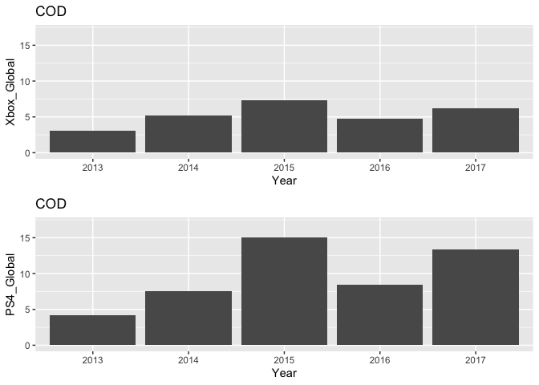

#Loading in all necessary packages. It is important to note that not all of these packages are going to be used. As a Data Scientist, I personally tend to lean towards a better safe than sorry approach to coding. 

```r
library(mice)
library(ggcorrplot)
library(usmap)
library(ggmap)
library(lubridate)
library(ggplot2)
library(readr)
library(knitr)
library(dplyr)
library(forcats)
library(downloader)
library(corrplot)
library(tidyquant)
library(timetk)
library(dygraphs)
library(scales)
library(tidyverse)
library(sf)
library(USAboundaries)
library(maps)
library(ggsflabel)
library(devtools)
library(remotes)
library(stringr)
library(leaflet)
library(mapview)
library(riem)
library(stringi)
library(stringr)
library(gifski)
library(gganimate)
library(gridExtra)
library(viridis)
library(ggthemes)
library(DT)
library(plotly)
library(corrgram)
library(ellipse)
library(RColorBrewer)
```
Introduction: Despite carrying the market momemtum going into the next generation, the rough announcement of the Xbox One with all it's it's media/kinect focused elements, it primed the PS4 for success, with Sony even taking direct jabs at Microsoft in it's marketing for the console. Because of this, many people who had been loyal to Xbox in the past were switching over, and game developers were too. Playstation secured more exclusive rights to games, and deals with third parties. PS4 is on track to be one of the most successful consoles of all time. 


#Loading in seperate CSV files for each console respectively.

```r
xbox <- read_csv("XboxOne_GameSales.csv")
```


```r
ps4 <- read_csv("PS4_GamesSales.csv")
```

#While both datasets have the same columns, that primes them for a full_join on said similarities, along with dropping any NA values that may be lingnering in the dataset as a part of general R tidying steps.

```r
bothconsoles <- full_join(xbox, ps4, by = c("Game", "Year", "Publisher", "Genre"))
bothconsoles <- bothconsoles %>% drop_na()
```

#The dataset now designates the different columns as either '.x' or '.y' respectively based on what console they were coming from, so I wanted to rename the column names to make it clearler for audience interpretation as well as for myself.

```r
data <- bothconsoles %>%
  rename("Xbox_North_America"="North America.x",
         "Xbox_Europe"="Europe.x",
         "Xbox_Japan"="Japan.x",
         "Xbox_Rest_of_World"="Rest of World.x",
         "Xbox_Global"="Global.x",
         "PS4_North_America"="North America.y",
         "PS4_Europe"="Europe.y",
         "PS4_Japan"="Japan.y",
         "PS4_Rest_of_World"="Rest of World.y",
         "PS4_Global"="Global.y")
```
It is important to note that the numeric values shown in the dataset represent the amount of copies sold, which is the metric that most developers and analysts alike use as a rule of thumb when determining a games success. This is because of the rising popularity in digital storefronts that are essentially a free market. All that's needed to get a game on the store is to pass a very lax certification test, in which your game can be of whatever quality and whatever price that developer determines. Therefore, the revenue grossed from a game may not indicate it's true success, being that games have varying budgets that serve as the crutch for it's success factor. Indie games that have smaller budgets can make their money back with 100,000 copies sold, whereas a game as big as Call of Duty would have to close the doors of it's studios if their sales numbers ever dropped that low.


#Adding a column that takes the combined sales from the Xbox and Playstation datasets in order to create one that sums the two together to get an idea of how many copies a game sold collectively. 

```r
finaldata <- data %>% rowwise() %>%
  mutate(TotalSales = sum(Xbox_Global+PS4_Global))
```

#Converting TotalSales to numeric value to make it easier for data manipulation

```r
finaldat <- finaldata %>%
  mutate(TotalSales = as.numeric(TotalSales))
```

#Creating an interactive datatable to serve as the center of answers for any questions that anyone pondering questions regarding the Xbox One/PS4 Generation. An example I used to see this was searching call of duty into the search to get a list of all the games in that respective franchise sales compared against each other. The same process can be done with any publisher, genre, game, year, etc. However, one interesting angle that is now easy to see is that noticably weak sales in the Japan Region for xbox. This is something that we will explore later on within the dataset. 


```r
finaldat <- finaldat %>% mutate_if(is.character, function(x) {Encoding(x) <- 'latin1'; return(x)})
datatable(finaldat,filter='top', options=list(paging=FALSE))
```

```{=html}
<div id="htmlwidget-c2ea2ec7376854bfd04a" style="width:100%;height:auto;" class="datatables html-widget"></div>
<script type="application/json" data-for="htmlwidget-c2ea2ec7376854bfd04a">{"x":{"filter":"top","vertical":false,"filterHTML":"<tr>\n  <td><\/td>\n  <td data-type=\"number\" style=\"vertical-align: top;\">\n    <div class=\"form-group has-feedback\" style=\"margin-bottom: auto;\">\n      <input type=\"search\" placeholder=\"All\" class=\"form-control\" style=\"width: 100%;\"/>\n      <span class=\"glyphicon glyphicon-remove-circle form-control-feedback\"><\/span>\n    <\/div>\n    <div style=\"display: none;position: absolute;width: 200px;opacity: 1\">\n      <div data-min=\"1\" data-max=\"611\"><\/div>\n      <span style=\"float: left;\"><\/span>\n      <span style=\"float: right;\"><\/span>\n    <\/div>\n  <\/td>\n  <td data-type=\"character\" style=\"vertical-align: top;\">\n    <div class=\"form-group has-feedback\" style=\"margin-bottom: auto;\">\n      <input type=\"search\" placeholder=\"All\" class=\"form-control\" style=\"width: 100%;\"/>\n      <span class=\"glyphicon glyphicon-remove-circle form-control-feedback\"><\/span>\n    <\/div>\n  <\/td>\n  <td data-type=\"character\" style=\"vertical-align: top;\">\n    <div class=\"form-group has-feedback\" style=\"margin-bottom: auto;\">\n      <input type=\"search\" placeholder=\"All\" class=\"form-control\" style=\"width: 100%;\"/>\n      <span class=\"glyphicon glyphicon-remove-circle form-control-feedback\"><\/span>\n    <\/div>\n  <\/td>\n  <td data-type=\"character\" style=\"vertical-align: top;\">\n    <div class=\"form-group has-feedback\" style=\"margin-bottom: auto;\">\n      <input type=\"search\" placeholder=\"All\" class=\"form-control\" style=\"width: 100%;\"/>\n      <span class=\"glyphicon glyphicon-remove-circle form-control-feedback\"><\/span>\n    <\/div>\n  <\/td>\n  <td data-type=\"character\" style=\"vertical-align: top;\">\n    <div class=\"form-group has-feedback\" style=\"margin-bottom: auto;\">\n      <input type=\"search\" placeholder=\"All\" class=\"form-control\" style=\"width: 100%;\"/>\n      <span class=\"glyphicon glyphicon-remove-circle form-control-feedback\"><\/span>\n    <\/div>\n  <\/td>\n  <td data-type=\"number\" style=\"vertical-align: top;\">\n    <div class=\"form-group has-feedback\" style=\"margin-bottom: auto;\">\n      <input type=\"search\" placeholder=\"All\" class=\"form-control\" style=\"width: 100%;\"/>\n      <span class=\"glyphicon glyphicon-remove-circle form-control-feedback\"><\/span>\n    <\/div>\n    <div style=\"display: none;position: absolute;width: 200px;opacity: 1\">\n      <div data-min=\"0\" data-max=\"4.7\" data-scale=\"2\"><\/div>\n      <span style=\"float: left;\"><\/span>\n      <span style=\"float: right;\"><\/span>\n    <\/div>\n  <\/td>\n  <td data-type=\"number\" style=\"vertical-align: top;\">\n    <div class=\"form-group has-feedback\" style=\"margin-bottom: auto;\">\n      <input type=\"search\" placeholder=\"All\" class=\"form-control\" style=\"width: 100%;\"/>\n      <span class=\"glyphicon glyphicon-remove-circle form-control-feedback\"><\/span>\n    <\/div>\n    <div style=\"display: none;position: absolute;width: 200px;opacity: 1\">\n      <div data-min=\"0\" data-max=\"3.25\" data-scale=\"2\"><\/div>\n      <span style=\"float: left;\"><\/span>\n      <span style=\"float: right;\"><\/span>\n    <\/div>\n  <\/td>\n  <td data-type=\"number\" style=\"vertical-align: top;\">\n    <div class=\"form-group has-feedback\" style=\"margin-bottom: auto;\">\n      <input type=\"search\" placeholder=\"All\" class=\"form-control\" style=\"width: 100%;\"/>\n      <span class=\"glyphicon glyphicon-remove-circle form-control-feedback\"><\/span>\n    <\/div>\n    <div style=\"display: none;position: absolute;width: 200px;opacity: 1\">\n      <div data-min=\"0\" data-max=\"0.02\" data-scale=\"2\"><\/div>\n      <span style=\"float: left;\"><\/span>\n      <span style=\"float: right;\"><\/span>\n    <\/div>\n  <\/td>\n  <td data-type=\"number\" style=\"vertical-align: top;\">\n    <div class=\"form-group has-feedback\" style=\"margin-bottom: auto;\">\n      <input type=\"search\" placeholder=\"All\" class=\"form-control\" style=\"width: 100%;\"/>\n      <span class=\"glyphicon glyphicon-remove-circle form-control-feedback\"><\/span>\n    <\/div>\n    <div style=\"display: none;position: absolute;width: 200px;opacity: 1\">\n      <div data-min=\"0\" data-max=\"0.76\" data-scale=\"2\"><\/div>\n      <span style=\"float: left;\"><\/span>\n      <span style=\"float: right;\"><\/span>\n    <\/div>\n  <\/td>\n  <td data-type=\"number\" style=\"vertical-align: top;\">\n    <div class=\"form-group has-feedback\" style=\"margin-bottom: auto;\">\n      <input type=\"search\" placeholder=\"All\" class=\"form-control\" style=\"width: 100%;\"/>\n      <span class=\"glyphicon glyphicon-remove-circle form-control-feedback\"><\/span>\n    <\/div>\n    <div style=\"display: none;position: absolute;width: 200px;opacity: 1\">\n      <div data-min=\"0\" data-max=\"8.73\" data-scale=\"2\"><\/div>\n      <span style=\"float: left;\"><\/span>\n      <span style=\"float: right;\"><\/span>\n    <\/div>\n  <\/td>\n  <td data-type=\"number\" style=\"vertical-align: top;\">\n    <div class=\"form-group has-feedback\" style=\"margin-bottom: auto;\">\n      <input type=\"search\" placeholder=\"All\" class=\"form-control\" style=\"width: 100%;\"/>\n      <span class=\"glyphicon glyphicon-remove-circle form-control-feedback\"><\/span>\n    <\/div>\n    <div style=\"display: none;position: absolute;width: 200px;opacity: 1\">\n      <div data-min=\"0\" data-max=\"6.18\" data-scale=\"2\"><\/div>\n      <span style=\"float: left;\"><\/span>\n      <span style=\"float: right;\"><\/span>\n    <\/div>\n  <\/td>\n  <td data-type=\"number\" style=\"vertical-align: top;\">\n    <div class=\"form-group has-feedback\" style=\"margin-bottom: auto;\">\n      <input type=\"search\" placeholder=\"All\" class=\"form-control\" style=\"width: 100%;\"/>\n      <span class=\"glyphicon glyphicon-remove-circle form-control-feedback\"><\/span>\n    <\/div>\n    <div style=\"display: none;position: absolute;width: 200px;opacity: 1\">\n      <div data-min=\"0\" data-max=\"9.72\" data-scale=\"2\"><\/div>\n      <span style=\"float: left;\"><\/span>\n      <span style=\"float: right;\"><\/span>\n    <\/div>\n  <\/td>\n  <td data-type=\"number\" style=\"vertical-align: top;\">\n    <div class=\"form-group has-feedback\" style=\"margin-bottom: auto;\">\n      <input type=\"search\" placeholder=\"All\" class=\"form-control\" style=\"width: 100%;\"/>\n      <span class=\"glyphicon glyphicon-remove-circle form-control-feedback\"><\/span>\n    <\/div>\n    <div style=\"display: none;position: absolute;width: 200px;opacity: 1\">\n      <div data-min=\"0\" data-max=\"2.17\" data-scale=\"2\"><\/div>\n      <span style=\"float: left;\"><\/span>\n      <span style=\"float: right;\"><\/span>\n    <\/div>\n  <\/td>\n  <td data-type=\"number\" style=\"vertical-align: top;\">\n    <div class=\"form-group has-feedback\" style=\"margin-bottom: auto;\">\n      <input type=\"search\" placeholder=\"All\" class=\"form-control\" style=\"width: 100%;\"/>\n      <span class=\"glyphicon glyphicon-remove-circle form-control-feedback\"><\/span>\n    <\/div>\n    <div style=\"display: none;position: absolute;width: 200px;opacity: 1\">\n      <div data-min=\"0\" data-max=\"3.02\" data-scale=\"2\"><\/div>\n      <span style=\"float: left;\"><\/span>\n      <span style=\"float: right;\"><\/span>\n    <\/div>\n  <\/td>\n  <td data-type=\"number\" style=\"vertical-align: top;\">\n    <div class=\"form-group has-feedback\" style=\"margin-bottom: auto;\">\n      <input type=\"search\" placeholder=\"All\" class=\"form-control\" style=\"width: 100%;\"/>\n      <span class=\"glyphicon glyphicon-remove-circle form-control-feedback\"><\/span>\n    <\/div>\n    <div style=\"display: none;position: absolute;width: 200px;opacity: 1\">\n      <div data-min=\"0\" data-max=\"19.39\" data-scale=\"2\"><\/div>\n      <span style=\"float: left;\"><\/span>\n      <span style=\"float: right;\"><\/span>\n    <\/div>\n  <\/td>\n  <td data-type=\"number\" style=\"vertical-align: top;\">\n    <div class=\"form-group has-feedback\" style=\"margin-bottom: auto;\">\n      <input type=\"search\" placeholder=\"All\" class=\"form-control\" style=\"width: 100%;\"/>\n      <span class=\"glyphicon glyphicon-remove-circle form-control-feedback\"><\/span>\n    <\/div>\n    <div style=\"display: none;position: absolute;width: 200px;opacity: 1\">\n      <div data-min=\"0\" data-max=\"28.11\" data-scale=\"15\"><\/div>\n      <span style=\"float: left;\"><\/span>\n      <span style=\"float: right;\"><\/span>\n    <\/div>\n  <\/td>\n<\/tr>","data":[["1","2","3","4","5","6","7","8","9","10","11","12","13","14","15","16","17","18","19","20","21","22","23","24","25","26","27","28","29","30","31","32","33","34","35","36","37","38","39","40","41","42","43","44","45","46","47","48","49","50","51","52","53","54","55","56","57","58","59","60","61","62","63","64","65","66","67","68","69","70","71","72","73","74","75","76","77","78","79","80","81","82","83","84","85","86","87","88","89","90","91","92","93","94","95","96","97","98","99","100","101","102","103","104","105","106","107","108","109","110","111","112","113","114","115","116","117","118","119","120","121","122","123","124","125","126","127","128","129","130","131","132","133","134","135","136","137","138","139","140","141","142","143","144","145","146","147","148","149","150","151","152","153","154","155","156","157","158","159","160","161","162","163","164","165","166","167","168","169","170","171","172","173","174","175","176","177","178","179","180","181","182","183","184","185","186","187","188","189","190","191","192","193","194","195","196","197","198","199","200","201","202","203","204","205","206","207","208","209","210","211","212","213","214","215","216","217","218","219","220","221","222","223","224","225","226","227","228","229","230","231","232","233","234","235","236","237","238","239","240","241","242","243","244","245","246","247","248","249","250","251","252","253","254","255","256","257","258","259","260","261","262","263","264","265","266","267","268","269","270","271","272","273","274","275","276","277","278","279","280","281","282","283","284","285","286","287","288","289","290","291","292","293","294","295","296","297","298","299","300","301","302","303","304","305","306","307","308","309","310","311","312","313","314","315","316","317","318","319","320","321","322","323","324","325","326","327","328","329","330","331","332","333","334","335","336","337","338","339","340","341","342","343","344","345","346","347","348","349","350","351","352","353","354","355","356","357","358","359","360","361","362","363","364","365","366","367","368","369","370","371","372","373","374","375","376","377","378","379","380","381","382","383","384","385","386","387","388","389","390","391","392","393","394","395","396","397","398","399","400","401","402","403","404","405","406","407","408","409","410","411","412","413","414","415","416","417","418","419","420"],[1,2,3,4,6,7,8,10,13,15,17,19,20,22,23,24,25,26,27,28,29,31,33,35,36,38,39,40,41,42,43,44,45,46,47,49,50,57,58,59,60,61,62,63,64,65,66,68,69,70,71,72,73,74,75,77,78,79,80,81,82,83,84,85,86,87,88,90,91,92,94,95,96,97,98,100,101,102,103,104,106,107,108,109,110,111,112,114,115,116,117,118,119,120,121,122,123,124,126,127,128,129,131,132,133,134,135,136,138,139,140,141,142,143,144,146,147,148,149,150,151,152,153,154,155,156,157,158,160,161,162,163,164,165,166,167,168,169,170,171,172,173,174,175,176,177,179,180,182,184,185,186,187,188,189,190,191,192,193,194,195,197,198,199,201,202,204,205,206,207,209,211,212,213,216,220,222,223,225,226,227,228,229,230,231,232,233,234,236,237,238,239,240,241,242,243,244,245,246,247,248,249,250,251,252,253,254,255,256,257,258,259,260,261,262,264,265,266,267,268,269,270,271,272,273,274,275,276,277,278,279,280,281,282,283,284,285,287,288,289,290,291,292,293,295,296,297,298,301,302,303,304,305,306,307,308,309,310,311,312,313,315,316,317,318,319,320,321,322,323,324,325,326,327,328,329,330,331,332,333,334,335,336,337,338,339,340,341,342,343,344,346,347,348,349,350,351,352,353,354,355,356,357,358,359,360,361,362,363,364,365,366,367,368,369,370,371,372,373,374,375,376,377,378,379,380,381,382,383,384,385,386,387,389,390,391,392,395,396,397,398,399,400,401,402,403,404,405,406,407,408,411,412,413,414,415,416,418,420,421,422,423,424,425,426,427,428,429,430,431,432,433,435,436,438,439,443,447,462,464,465,469,482,485,492,506,510,511,517,519,520,526,537,538,543,545,546,547,565,566,568,581,585,588,589,590,591,592,594,595,600,601,602,604,605,606,608,609,610,611],["Grand Theft Auto V","Call of Duty: Black Ops 3","Call of Duty: WWII","Red Dead Redemption 2","Call of Duty: Advanced Warfare","Battlefield 1","Fallout 4","Call of Duty: Infinite Warfare","FIFA 17","Assassin's Creed: Unity","Destiny","FIFA 16","FIFA 18","Call of Duty: Ghosts","Overwatch","Tom Clancy's Rainbow Six: Siege","Tom Clancy's The Division","Assassin's Creed Origins","Madden NFL 16","Madden NFL 17","NBA 2K16","Destiny 2","FIFA 15","Battlefield 4","NBA 2K17","NBA 2K18","Star Wars Battlefront II (2017)","Madden NFL 18","The Elder Scrolls V: Skyrim","Far Cry 5","Mortal Kombat X","NBA 2K15","The Witcher 3: Wild Hunt","Far Cry 4","Watch Dogs","Tom Clancy's Ghost Recon Wildlands","Madden NFL 15","Doom (2016)","Assassin's Creed Syndicate","Middle-Earth: Shadow of Mordor","Rocket League","The Elder Scrolls Online","Titanfall 2","Watch Dogs 2","FIFA Soccer 14","Destiny: The Taken King","Battlefield: Hardline","Middle-Earth: Shadow of War","Lego Marvel Super Heroes","Final Fantasy XV","Mafia III","Diablo III","Just Cause 3","Far Cry: Primal","Dragon Age III: Inquisition","NBA 2K14","Monster Hunter: World","Injustice 2","Resident Evil VII: Biohazard","For Honor","Dishonored 2","Plants vs. Zombies: Garden Warfare 2","Madden NFL 25","Metal Gear Solid V: The Phantom Pain","Guitar Hero Live","Dark Souls III","LEGO Jurassic World","Mass Effect: Andromeda","Minecraft: Story Mode","Fortnite","Wolfenstein: The New Order","Rock Band 4","Need for Speed (2015)","The Sims 4","Need for Speed: Payback","LEGO Dimensions","The Crew","Plants vs Zombies: Garden Warfare","Need for Speed Rivals","Wolfenstein II: The New Colossus","LEGO Worlds","Borderlands: The Handsome Collection","Evolve","WWE 2K18","Tomb Raider (2013)","The LEGO Movie Videogame","WWE 2K16","South Park: The Fractured But Whole","WWE 2K15","EA Sports UFC 2","NHL 17","Tekken 7","LEGO Marvel Super Heroes 2","WWE 2K17","Disney Infinity 2.0: Marvel Super Heroes","Just Dance 2015","Dragon Ball Fighter Z","Alien: Isolation","NHL 16","Lego Star Wars: The Force Awakens","Mad Max (2013)","LEGO Marvel's Avengers","Steep","Thief 4","Just Dance 2014","EA Sports UFC","BioShock The Collection","Dragon Ball: Xenoverse 2","Disney Infinity 3.0","Prey (2017)","Skylanders: Trap Team","Lego Batman 3: Beyond Gotham","EA Sports UFC 3","Rocksmith 2014","Sniper Elite 3","NHL 15","Project CARS","Destiny: The Collection","Skylanders: SuperChargers","Deus Ex: Mankind Divided","NHL 18","The Evil Within II","Rayman Legends","Just Dance 2016","Skylanders SWAP Force","Naruto Shippuden: Ultimate Ninja Storm 4","Dragon Ball: XenoVerse","Marvel vs. Capcom: Infinite","The Lego Ninjago Movie Videogame","The Crew 2","Farming Simulator 17","METRO 2033","Hitman (2016)","LEGO City Undercover","Final Fantasy Type-0","Sniper Elite 4","Sonic Forces","Dark Souls II","Battleborn","Rory McIlroy PGA Tour","Assassin's Creed The Ezio Collection","LEGO The Hobbit","Metal Gear Solid: Ground Zeroes","Minecraft: Story Mode - Season Two","Skylanders Imaginators","Friday the 13th: The Game","F1 2015","L.A. Noire","Call of Duty: Modern Warfare Remastered","Saints Row IV","Farming Simulator 2015","A Way Out","NBA Live 14","Payday 2","DiRT 4","NBA Live 15","F1 2016 (Codemasters)","Deadpool","The Amazing Spider-Man 2 (2014)","Kingdom Come: Deliverance","Lords of the Fallen","DiRT Rally","Just Dance 2018","Homefront: The Revolution","NBA Live 18","theHunter: Call of the Wild","Project CARS 2","Batman: Return to Arkham","Dishonored","One Piece: Burning Blood","Mirror's Edge 2","Naruto to Boruto: Shinobi Striker","XCOM 2","F1 2017","Sniper: Ghost Warrior 3","Murdered: Soul Suspect","Angry Birds: Star Wars","Little Nightmares","Wolfenstein: The Old Blood","Pro Evolution Soccer 2015","Transformer: Rise of the Dark Spark","The Escapists 2","Transformers: Devastation","Spintires: MudRunner","DmC: Devil May Cry","Attack on Titan (KOEI)","Tony Hawk's Pro Skater 5","Naruto Shippuden: Ultimate Ninja Storm Legacy","Resident Evil: Revelations 2","Dishonored: Death of the Outsider","Ultimate Marvel vs. Capcom 3","The Elder Scrolls Online: Morrowind","Hasbro Family Fun Pack","Rocksmith 2014 Edition Remastered","Song of the Deep","NBA Live 16","Outlast Trinity","Sonic Mania","Dead by Daylight","Darksiders III","Vampyr","The Walking Dead - The Telltale Series: A New Frontier","NASCAR Heat 2","Life is Strange","Wolfenstein The Two Pack","The Surge","Naruto Shippuden Ultimate Ninja Storm 4: Road to Boruto","Pro Evolution Soccer 2016","Pro Evolution Soccer 2018","7 Days to Die","Zombie Army Trilogy","Prototype: Biohazard Bundle","Ride","Agents of Mayhem","Metal Gear Solid V: The Definitive Experience","MXGP 2","NASCAR Heat Evolution","TrackMania Turbo","Divinity: Original Sin","Dead or Alive 5","Pro Evolution Soccer 2017","Resident Evil Zero","Sword Art Online: Fatal Bullet","Yooka-Laylee","Real Farm","We Happy Few","Duke Nukem 3D: 20th Anniversary World Tour","The Wolf Among Us","Attack on Titan 2","Rugby 15","MXGP 3: The Official Motocross Videogame","Bladestorm: Nightmare","Monster Energy Supercross - The Official Videogame","America's Greatest Game Shows: Wheel of Fortune &amp; Jeopardy!","Dead Island Definitive Collection","Ride 2","Elite: Dangerous","Bulletstorm: Full Clip Edition","Micro Machines: World Series","Darksiders II","Sherlock Holmes: Crimes &amp; Punishments","Toy Soldiers: War Chest","BlazBlue: Chrono Phantasma Extend","Metal Gear Survive","Batman: A Telltale Game Series","Constructor HD","Teenage Mutant Ninja Turtles: Mutants in Manhattan","Valentino Rossi: The Game","Resident Evil 6","Ghostbusters (2016)","R.B.I. Baseball 2017","Aven Colony","Adventure Time: Finn &amp; Jake Investigations","Atari Flashback Classics: Volume 1","MotoGP 17","Wasteland 2","MX vs ATV Supercross Encore 2017 Track Edition","Cartoon Network Battle Crashers","Hasbro Family Fun Pack Conquest Edition","Sherlock Holmes: The Devil's Daughter","MX vs. ATV Supercross Encore","R.B.I. Baseball 2016","Okami","Rapala Fishing Pro Series","Arslan: The Warriors of Legend","Golf Club 2","Mark McMorris Infinite Air","Atari Flashback Classics: Volume 2","Hunting Simulator","Styx: Shards of Darknes","Marvel's Guardians of the Galaxy: The Telltale Series","Baja: Edge of Control HD","Agatha Christie's The ABC Murders","Brothers: A Tale of Two Sons","The Walking Dead: A Telltale Series Collection","Rugby 18","Has-Been Heroes","Deformers","Extinction","Resident Evil 4 HD","The Technomancer","Cars 3: Driven to Win","Pillars of Eternity","Just Sing","Mighty No. 9","Batman: The Enemy Within","WRC 7","King's Quest: The Complete Collection","Marvel Pinball: Epic Collection Volume 1","Road Rage","Dragon's Dogma","Overcooked","Resident Evil 5 HD","Darksiders: Warmastered Edition","Valkyria: Azure Revolution","Game of Thrones (Telltale)","Terraria","Elex","Battle Chasers: Nightwar","Don't Starve","Dead Rising 2","Don Bradman Cricket 14","Monster Jam: Crush It","Shadow Warrior (2013)","Dead Alliance","Warriors Orochi 3","Dead Rising","Sine Mora","WRC 6","Black Mirror","Pure Farming 2018","MotoGP 15","Raid: World War II","Carmageddon: Max Damage","INSIDE / LIMBO Double Pack","Warhammer: The End Times - Vermintide","Stardew Valley","Ben 10 (2017)","The Pillars of the Earth","Rime","Worms: WMD","Syberia III","Moto Racer 4","Rugby League Live 4","ABZU","Pharaonic","Geometry Wars 3: Dimensions Evolved","Resident Evil: Revelations","Broken Sword 5: The Serpent's Curse","Rugby World Cup 2015","The Crew: Wild Run","Prison Architect","The Dwarves","Redout","Troll and I","Portal Knights","Shaq-Fu: A Legend Reborn","Back to the Future: The Game","Saints Row: Gat out of Hell","Mega Man Legacy Collection 2","Dungeons 3","Blackguards 2","Rogue Trooper: Redux","Vikings: Wolves of Midgard","The Inner World: The Last Wind Monk","Assetto Corsa","Le Tour de France 2017","Lock's Quest","WRC 5: FIA World Rally Championship","FlatOut 4: Total Insanity","Shadow Tactics: Blades of the Shogun","Rugby League Live 3","Assassin's Creed Chronicles","SŽbastien Loeb Rally Evo","Rugby Challenge 3","Rabbids Invasion: The Interactive TV Show","ZombiU","Battle Worlds: Kronos","Torment: Tides of Numenera","Ziggurat","ATV Renegades","This Is The Police","Valhalla Hills","Handball 16","Shovel Knight","Blood Bowl 2","The Peanuts Movie: Snoopy's Grand Adventure","Farming 2017 - The Simulation","Kung Fu Panda: Showdown of Legendary Legends","Strider (2014)","The Amazing Spider-Man 2","Mega Man Legacy Collection","Agatha Christie: The ABC Murders","Ancients of Ooga - The Forgotten Chapters","Bladestorm: The Hundred Years' War","Brothers in Arms: Furious 4","Devil May Cry 4","Industry Giant II","Slender: The Arrival","Human Element","Whore of the Orient","Carmageddon: Reincarnation","Kingdom Hearts III","Reus","WonderFlick","Get Even","The Book of Unwritten Tales 2","Puyo Puyo Tetris","Cult County","R.B.I. Baseball 14","Blue EstateÊ","Space Hulk: Deathwing","EA Sports PGA Tour","Lara Croft and the Temple of Osiris","Dead Island 2","Tetris UltimateÊ","Afro Samurai 2","The Legend of Korra (2014)","Assassin's Creed Chronicles: China","Pathologic","Assassin's Creed: Victory","R.B.I. Baseball 15","Cross Reverie","Woodcutter Simulator 2016","Professional Farmer 2016","Professional Lumberjack 2016","Alekhine's Gun","World to the West","Super Dungeon Bros","Pro Cycling Manager 2016","We Sing (2016)","Don Bradman Cricket 17","Ace Combat 7: Skies Unknown","Metro Exodus","Anthem","AereA","Iron Harvest","Biomutant","Biomutant","de Blob"],["2014","2015","2017","2018","2014","2016","2015","2016","2016","2014","2014","2015","2017","2013","2016","2015","2016","2017","2015","2016","2015","2017","2014","2013","2016","2017","2017","2017","2016","2018","2015","2014","2015","2014","2014","2017","2014","2016","2015","2014","2016","2015","2016","2016","2013","2015","2015","2017","2013","2016","2016","2014","2015","2016","2014","2013","2018","2017","2017","2017","2016","2016","2013","2015","2015","2016","2015","2017","2015","2017","2014","2015","2015","2017","2017","2015","2014","2014","2013","2017","2017","2015","2015","2017","2014","2014","2015","2017","2014","2016","2016","2017","2017","2016","2014","2014","2018","2014","2015","2016","2015","2016","2016","2014","2013","2014","2016","2016","2015","2017","2014","2014","2018","2014","2014","2014","2015","2016","2015","2016","2017","2017","2014","2015","2013","2016","2015","2017","2017","2018","2016","2014","2017","2017","2015","2017","2017","2015","2016","2015","2016","2014","2014","2017","2016","2017","2015","2017","2017","2015","2015","2018","2013","2015","2017","2014","2016","2015","2014","2018","2014","2016","2017","2016","2017","2017","2017","2016","2015","2016","2016","2018","2016","2017","2017","2014","2013","2017","2015","2014","2014","2017","2015","2017","2015","2016","2015","2017","2015","2017","2017","2017","2015","2016","2016","2015","2017","2017","2017","2018","2018","2017","2017","2016","2017","2017","2017","2015","2017","2016","2015","2016","2015","2017","2016","2016","2016","2016","2015","2015","2016","2016","2018","2017","2017","2018","2016","2014","2018","2015","2017","2015","2018","2017","2016","2016","2017","2017","2017","2015","2014","2015","2015","2018","2016","2017","2016","2016","2016","2016","2017","2017","2015","2016","2017","2015","2017","2016","2016","2016","2015","2016","2017","2017","2016","2017","2016","2016","2017","2017","2017","2017","2016","2015","2017","2017","2017","2017","2018","2016","2016","2017","2017","2016","2016","2017","2017","2016","2016","2017","2017","2016","2016","2016","2017","2015","2014","2017","2017","2018","2016","2015","2016","2014","2017","2014","2016","2017","2016","2017","2018","2015","2017","2016","2017","2016","2017","2017","2017","2017","2016","2017","2016","2017","2017","2017","2016","2017","2015","2015","2015","2016","2016","2017","2017","2017","2018","2015","2015","2017","2017","2017","2017","2017","2017","2016","2017","2017","2015","2017","2017","2015","2016","2016","2016","2014","2016","2016","2017","2016","2017","2017","2017","2015","2015","2015","2015","2016","2015","2014","2014","2016","2016","2016","2015","2019","2015","2017","2015","2015","2020","2015","2019","2016","2014","2015","2015","2014","2015","2014","2014","2015","2015","2014","2017","2014","2015","2014","2015","2015","2015","2015","2017","2015","2015","2015","2016","2017","2016","2016","2016","2016","2019","2019","2019","2017","2018","2018","2019","2017"],["Action","Shooter","Shooter","Action-Adventure","Shooter","Shooter","Role-Playing","Shooter","Sports","Action","Shooter","Sports","Sports","Shooter","Shooter","Shooter","Shooter","Action","Sports","Sports","Sports","Shooter","Sports","Shooter","Sports","Sports","Shooter","Sports","Role-Playing","Action","Fighting","Sports","Role-Playing","Shooter","Action-Adventure","Shooter","Sports","Shooter","Action","Action","Sports","MMO","Shooter","Action","Sports","Shooter","Shooter","Action","Action","Role-Playing","Action-Adventure","Role-Playing","Action-Adventure","Action-Adventure","Role-Playing","Sports","Action","Fighting","Action","Action","Action","Shooter","Sports","Action","Music","Role-Playing","Action","Role-Playing","Adventure","Action","Shooter","Music","Racing","Simulation","Racing","Action","Racing","Shooter","Racing","Shooter","Misc","Shooter","Shooter","Sports","Action-Adventure","Action-Adventure","Sports","Role-Playing","Sports","Sports","Sports","Fighting","Action","Sports","Action-Adventure","Music","Fighting","Adventure","Sports","Action-Adventure","Action","Action","Sports","Action","Music","Fighting","Shooter","Action","Action","Shooter","Platform","Action","Sports","Music","Shooter","Sports","Racing","Shooter","Action-Adventure","Role-Playing","Sports","Action","Platform","Music","Misc","Fighting","Fighting","Fighting","Action","Racing","Simulation","Shooter","Action","Platform","Role-Playing","Shooter","Platform","Role-Playing","Shooter","Sports","Action","Action-Adventure","Action-Adventure","Adventure","Platform","Action","Racing","Adventure","Shooter","Action","Simulation","Action","Sports","Shooter","Racing","Sports","Racing","Action","Action-Adventure","Role-Playing","Role-Playing","Racing","Music","Shooter","Sports","Shooter","Racing","Action","Action","Fighting","Platform","Action","Strategy","Racing","Shooter","Action-Adventure","Puzzle","Platform","Shooter","Sports","Shooter","Action","Action","Simulation","Action","Action","Sports","Fighting","Action","Action","Fighting","MMO","Misc","Music","Action","Sports","Action","Platform","Action","Action","Role-Playing","Adventure","Racing","Adventure","Shooter","Action","Fighting","Sports","Sports","Action","Shooter","Action","Racing","Action","Action","Racing","Racing","Racing","Role-Playing","Fighting","Sports","Action-Adventure","Role-Playing","Platform","Simulation","Action-Adventure","Shooter","Adventure","Action","Sports","Racing","Action","Racing","Misc","Action","Racing","Simulation","Shooter","Racing","Action-Adventure","Adventure","Action","Fighting","Action","Adventure","Strategy","Action","Racing","Shooter","Action","Sports","Strategy","Action","Misc","Racing","Role-Playing","Racing","Action","Misc","Adventure","Sports","Sports","Action","Simulation","Action","Sports","Sports","Misc","Shooter","Action","Adventure","Racing","Adventure","Adventure","Adventure","Sports","Action","Action","Action","Action-Adventure","Role-Playing","Racing","Role-Playing","Music","Platform","Adventure","Racing","Adventure","Puzzle","Racing","Role-Playing","Action","Action","Action-Adventure","Role-Playing","Adventure","Action","Role-Playing","Role-Playing","Adventure","Action","Sports","Racing","Shooter","Shooter","Action","Action","Action","Racing","Adventure","Simulation","Racing","Shooter","Action","Platform","Action","Simulation","Action","Adventure","Adventure","Strategy","Adventure","Racing","Sports","Adventure","Action","Action","Action","Adventure","Sports","Racing","Simulation","Role-Playing","Racing","Action","Role-Playing","Action","Adventure","Action","Action","Strategy","Strategy","Shooter","Action","Puzzle","Racing","Simulation","Strategy","Racing","Racing","Strategy","Sports","Action","Racing","Sports","Misc","Action","Strategy","Role-Playing","Shooter","Racing","Simulation","Strategy","Sports","Platform","Sports","Platform","Simulation","Action","Platform","Misc","Platform","Adventure","Platform","Action","Shooter","Action","Strategy","Adventure","Misc","Misc","Misc","Role-Playing","Strategy","Misc","Misc","Adventure","Puzzle","Misc","Misc","Misc","Shooter","Sports","Action","Action","Puzzle","Action","Action","Action-Adventure","Adventure","Action","Sports","Role-Playing","Action","Action","Simulation","Action","Action-Adventure","Action","Sports","Music","Sports","Shooter","Shooter","Role-Playing","Role-Playing","Strategy","Action","Action","Platform"],["Rockstar Games","Activision","Activision","Rockstar Games","Activision","Electronic Arts","Bethesda Softworks","Activision","Electronic Arts","Ubisoft","Activision","EA Sports","EA Sports","Activision","Blizzard Entertainment","Ubisoft","Ubisoft","Ubisoft","EA Sports","EA Sports","2K Sports","Activision","EA Sports","Electronic Arts","2K Sports","2K Sports","Electronic Arts","EA Sports","Bethesda Softworks","Ubisoft","Warner Bros. Interactive Entertainment","2K Sports","Namco Bandai Games","Ubisoft","Ubisoft","Ubisoft","EA Sports","Bethesda Softworks","Ubisoft","Warner Bros. Interactive Entertainment","505 Games","Bethesda Softworks","Electronic Arts","Ubisoft","EA Sports","Activision","Electronic Arts","Warner Bros. Interactive Entertainment","Warner Bros. Interactive Entertainment","Square Enix","2K Games","Blizzard Entertainment","Square Enix","Ubisoft","Electronic Arts","2K Sports","Capcom","Warner Bros. Interactive Entertainment","Capcom","Ubisoft","Bethesda Softworks","Electronic Arts","EA Sports","Konami Digital Entertainment","Activision","Namco Bandai Games","Warner Bros. Interactive Entertainment","Electronic Arts","Mojang","Gearbox Software","Bethesda Softworks","Harmonix Music Systems","Electronic Arts","Electronic Arts","Electronic Arts","Warner Bros. Interactive Entertainment","Ubisoft","Electronic Arts","Electronic Arts","Bethesda Softworks","Warner Bros. Interactive Entertainment","2K Games","2K Games","2K Sports","Square Enix","Warner Bros. Interactive Entertainment","Take-Two Interactive","Ubisoft","2K Sports","EA Sports","EA Sports","Namco Bandai Games","Warner Bros. Interactive Entertainment","2K Games","Disney Interactive Studios","Ubisoft","Namco Bandai Games","Sega","EA Sports","Warner Bros. Interactive Entertainment","Warner Bros. Interactive Entertainment","Warner Bros. Interactive Entertainment","Ubisoft","Square Enix","Ubisoft","Electronic Arts","2K Games","Namco Bandai Games","Disney Interactive Studios","Bethesda Softworks","Activision","Warner Bros. Interactive Entertainment","EA Sports","Ubisoft","505 Games","EA Sports","Bandai Namco Games","Activision","Activision","Square Enix","EA Sports","Bethesda Softworks","Ubisoft","Ubisoft","Activision","Namco Bandai Games","Namco Bandai Games","Capcom","Warner Bros. Interactive Entertainment","Ubisoft","Focus Home Interactive","Deep Silver","Square Enix","Warner Bros. Interactive Entertainment","Square Enix","Rebellion Developments","Sega","Namco Bandai Games","2K Games","Electronic Arts","Ubisoft","Warner Bros. Interactive Entertainment","Konami Digital Entertainment","Telltale Games","Activision","Gun Media","Codemasters","Rockstar Games","Activision","Deep Silver","Koch Media","Electronic Arts","EA Sports","505 Games","Codemasters","Electronic Arts","Codemasters","Activision","Activision","Deep Silver","Square Enix","Codemasters","Ubisoft","Deep Silver","EA Sports","Astragon","Namco Bandai Games","Warner Bros. Interactive Entertainment","Bethesda Softworks","Namco Bandai Games","Electronic Arts","Bandai Namco Games","2K Games","Koch Media","City Interactive","Square Enix","Activision","Namco Bandai Games","Bethesda Softworks","Konami Digital Entertainment","Activision","Sold Out","Activision","Focus Home Interactive","Capcom","Tecmo Koei","Activision","Namco Bandai Games","Capcom","Bethesda Softworks","Capcom","Bethesda Softworks","Ubisoft","Ubisoft","Insomniac Games","EA Sports","Warner Bros. Interactive Entertainment","Sega","505 Games","THQ Nordic","Focus Home Interactive","Warner Bros. Interactive Entertainment","505 Games","Square Enix","Bethesda Softworks","Koch Media","Namco Bandai Games","Konami Digital Entertainment","Konami Digital Entertainment","Telltale Games","Rebellion Developments","Activision","Milestone S.r.l.","Deep Silver","Konami Digital Entertainment","Milestone S.r.l.","Dusenberry Martin Racing","Ubisoft","Focus Home Interactive","Tecmo Koei","Konami Digital Entertainment","Capcom","Namco Bandai Games","Sold Out","Soedesco","Gearbox Software","Gearbox Software","Telltale Games","Koei Tecmo","Bigben Interactive","Milestone","Tecmo Koei","Milestone S.r.l.","Ubisoft","Deep Silver","Milestone S.r.l","Frontier Developments","Gearbox Software","Codemasters","Nordic Games","Focus Home Interactive","Ubisoft","PQube","Konami Digital Entertainment","Telltale Games","System 3","Activision","Namco Bandai Games","Capcom","Activision","MLB.com","Sold Out","Little Orbit","Atari","Koch Media","Deep Silver","THQ Nordic","Maximum Games","Ubisoft","Bigben Interactive","Nordic Games","MLB.com","Capcom","GameMill","Tecmo Koei","Maximum Games","Maximum Games","Atari","Bigben Interactive","Focus Home Interactive","Warner Bros. Interactive Entertainment","THQ Nordic","Microids","505 Games","Warner Bros. Interactive Entertainment","Koch Media","GameTrust","Ready at Dawn","Maximum Games","Capcom","Focus Home Interactive","Warner Bros. Interactive Entertainment","Paradox InteractiveÊ","Ubisoft","Deep Silver","Telltale Games","Bigben Interactive","Activision","Nighthawk Interactive","Maximum Games","Capcom","Sold Out","Capcom","THQ Nordic","Deep Silver","Telltale Games","505 Games","THQ Nordic","THQ Nordic","505 Games","Capcom","Tru Blu Entertainment","GameMill","Devolver Digital","Maximum Games","Tecmo Koei","Capcom","THQ Nordic","PQube","THQ Nordic","Techland","Milestone S.r.l.","505 Games","Stainless Games","505 Games","Games Workshop","505 Games","Outright Games","Kalypso Media","Grey Box","Team17 Digital Ltd","Microids","PQube","Tru Blu Entertainment","505 Games","Soedesco","Activision","Capcom","Revolution Software","Big Ben Interactive","Ubisoft","Introversion Software","THQ Nordic","505 Games","Maximum Games","505 Games","Wired Productions","Telltale Games","Deep Silver","Capcom","Kalypso Media","Kalypso Media","Rebellion","Kalypso Media","Kalypso Media","505 Games","Focus Home Interactive","THQ Nordic","Bigben Interactive","Bigben Interactive","Kalypso Media","Tru Blu Entertainment","Ubisoft","Milestone S.r.l","Alternative Software","Ubisoft","Ubisoft","Nordic Games","Techland","Soedesco","Nighthawk Interactive","THQ Nordic","Kalypso Media","Bigben Interactive","Yacht Club Games","Focus Home Interactive","Activision","UIG Entertainment","Little Orbit","Capcom","Activision","Capcom","Microids","Koch Media","BioWare","Ubisoft","Capcom","UIG Entertainment","Unknown","Unknown","Warner Bros. Interactive Entertainment","Stainless Games","Square Enix","Soedesco","Level 5","Unknown","Nordic Games","Sega","Renegade Kid","MLB.com","Focus Home Interactive","Focus Home Interactive","EA Sports","Square Enix","Deep Silver","Ubisoft","Versus Evil","Activision","Ubisoft","Ice-pick Lodge","Ubisoft","MLB.com","Sinxsoft","Namco Bandai Games","Namco Bandai Games","Namco Bandai Games","Maximum Games","Soedesco","Wired Productions","Focus Home Interactive","THQ Nordic","Tru Blu Entertainment","Bandai Namco Games","Deep Silver","Electronic Arts","Soedesco","Unknown","THQ Nordic","THQ Nordic","THQ Nordic"],[4.7,4.63,3.75,3.76,3.25,3.37,2.94,2.91,1.04,2.34,2.17,0.92,0.98,1.92,1.63,1.62,1.54,1.34,2.13,2.14,2.01,1.66,0.64,1.26,1.7,1.67,1.15,1.63,1.13,1.14,1.34,1.39,0.97,0.85,0.91,0.98,1.34,0.76,0.71,0.77,0.52,0.86,0.88,0.71,0.44,0.91,0.73,0.75,0.61,0.72,0.54,0.62,0.52,0.51,0.63,0.72,0.67,0.65,0.51,0.57,0.47,0.47,0.69,0.49,0.52,0.56,0.44,0.5,0.46,0.6,0.39,0.62,0.35,0.42,0.42,0.47,0.32,0.39,0.45,0.45,0.28,0.49,0.4,0.35,0.38,0.42,0.34,0.4,0.32,0.36,0.52,0.3,0.32,0.26,0.35,0.36,0.38,0.23,0.41,0.24,0.29,0.26,0.24,0.26,0.31,0.3,0.35,0.33,0.3,0.21,0.34,0.24,0.3,0.31,0.27,0.32,0.21,0.25,0.31,0.25,0.32,0.25,0.13,0.3,0.25,0.25,0.21,0.26,0.21,0.2,0.19,0.15,0.2,0.15,0.2,0.18,0.15,0.19,0.2,0.16,0.13,0.13,0.13,0.17,0.19,0.21,0.09,0.14,0.16,0.13,0.13,0.17,0.19,0.14,0.11,0.18,0.09,0.17,0.12,0.14,0.1,0.12,0.15,0.1,0.18,0.18,0.01,0.12,0.13,0.11,0.11,0.17,0.15,0.04,0.11,0.08,0.11,0.12,0.07,0.04,0.1,0.05,0.1,0.11,0.09,0.06,0.11,0.11,0.1,0.07,0.12,0.09,0.1,0.12,0.12,0.11,0.1,0.09,0.08,0.11,0.07,0.1,0.11,0.08,0.11,0.07,0.11,0.05,0.06,0.09,0.05,0.1,0.05,0.07,0.1,0.07,0.09,0.05,0.06,0.05,0.05,0.07,0.09,0.05,0.08,0.07,0.08,0.06,0.08,0.03,0.06,0.06,0.08,0.08,0.05,0.06,0.07,0.06,0.02,0.05,0.03,0.07,0.06,0.05,0.06,0.07,0.05,0.05,0.06,0.06,0.06,0.06,0.04,0.06,0.04,0.05,0.05,0.05,0.05,0.05,0.05,0.05,0.05,0.05,0.05,0.05,0.05,0.05,0.05,0.05,0.05,0.05,0.04,0.04,0.05,0.04,0.04,0.04,0.04,0.04,0.03,0.04,0.04,0.04,0.04,0.04,0.04,0.04,0.04,0.04,0.04,0.04,0.04,0.04,0.04,0.04,0,0.04,0.04,0.04,0.03,0,0.03,0,0.03,0.01,0.03,0.03,0.03,0.03,0.03,0,0.03,0.02,0.03,0.03,0.02,0.02,0.02,0.02,0.02,0.02,0.02,0,0.02,0.02,0.02,0.02,0,0,0,0.02,0.02,0.02,0.02,0.02,0.02,0,0,0.02,0.02,0.02,0.02,0.01,0.01,0,0,0.01,0,0.01,0.01,0,0,0,0,0,0,0.01,0.01,0,0,0,0,0,0,0,0,0,0,0,0,0,0,0,0,0,0,0,0,0,0,0,0,0,0,0,0,0,0,0,0,0,0,0,0,0,0,0,0,0,0,0,0,0,0,0,0,0,0,0,0,0,0,0,0,0,0,0,0,0],[3.25,2.04,1.91,1.47,1.49,1.26,1.62,1.44,2.4,0.9,0.92,2.1,1.92,0.86,0.84,0.84,0.82,0.92,0.08,0.04,0.15,0.47,1.39,0.65,0.12,0.14,0.59,0.07,0.53,0.47,0.23,0.18,0.61,0.68,0.59,0.48,0.1,0.57,0.61,0.52,0.75,0.39,0.37,0.53,0.78,0.23,0.39,0.29,0.44,0.3,0.48,0.32,0.41,0.41,0.27,0.12,0.17,0.16,0.3,0.21,0.31,0.32,0.06,0.25,0.23,0.15,0.27,0.2,0.24,0.09,0.3,0.05,0.33,0.24,0.24,0.18,0.34,0.25,0.19,0.19,0.35,0.13,0.2,0.25,0.22,0.17,0.24,0.17,0.23,0.19,0.01,0.23,0.2,0.26,0.15,0.13,0.09,0.25,0.05,0.22,0.16,0.18,0.2,0.17,0.12,0.13,0.08,0.09,0.12,0.2,0.07,0.17,0.1,0.08,0.12,0.06,0.16,0.12,0.05,0.11,0.03,0.1,0.22,0.04,0.07,0.07,0.11,0.05,0.09,0.1,0.11,0.14,0.08,0.12,0.07,0.09,0.11,0.07,0.05,0.09,0.12,0.13,0.13,0.08,0.05,0.03,0.15,0.09,0.06,0.09,0.09,0.05,0.02,0.07,0.1,0.02,0.12,0.03,0.08,0.06,0.1,0.08,0.04,0.09,0,0,0.18,0.06,0.05,0.07,0.06,0,0.02,0.13,0.05,0.07,0.04,0.03,0.07,0.1,0.03,0.08,0.04,0.02,0.04,0.07,0.02,0.02,0.02,0.06,0,0.03,0.02,0,0,0.01,0.02,0.03,0.03,0,0.04,0.01,0,0.03,0,0.04,0,0.06,0.05,0.02,0.05,0,0.05,0.03,0,0.02,0,0.04,0.03,0.03,0.03,0.02,0,0.04,0,0.01,0,0.02,0,0.05,0.02,0.02,0,0,0.03,0.01,0,0.01,0.05,0.03,0.04,0,0.01,0.01,0.01,0,0.01,0.02,0,0,0,0,0.02,0,0.02,0.01,0,0.01,0,0,0,0,0,0,0,0,0,0,0,0,0,0,0,0.01,0,0,0,0,0,0,0.02,0,0,0,0,0,0,0,0,0,0,0,0,0,0,0,0.04,0,0,0,0,0.04,0,0.04,0,0.03,0,0,0,0,0,0.03,0,0.01,0,0,0,0,0,0,0,0,0,0.02,0,0,0,0,0.02,0.02,0.02,0,0,0,0,0,0,0.02,0.02,0,0,0,0,0,0,0.01,0.01,0,0.01,0,0,0.01,0.01,0.01,0.01,0.01,0.01,0,0,0.01,0,0,0,0,0,0,0,0,0,0,0,0,0,0,0,0,0,0,0,0,0,0,0,0,0,0,0,0,0,0,0,0,0,0,0,0,0,0,0,0,0,0,0,0,0,0,0,0,0,0,0,0,0,0,0,0,0,0,0,0],[0.01,0.02,0,0,0.01,0.02,0.02,0,0,0,0,0,0,0,0,0,0,0,0,0,0,0,0,0,0,0,0,0,0,0,0,0,0.01,0.02,0,0,0,0,0,0.01,0,0,0,0,0,0,0.01,0,0,0.01,0,0,0,0,0,0,0,0,0,0,0,0,0,0.02,0,0,0,0,0,0,0,0,0,0,0,0,0,0,0,0,0,0,0,0,0,0,0,0,0,0,0,0,0,0,0,0,0,0,0,0,0,0,0,0,0,0,0,0,0,0,0,0,0,0,0,0,0,0,0,0,0,0,0,0,0,0,0,0,0,0,0,0,0,0,0,0,0,0,0,0,0,0,0,0,0,0,0,0,0,0,0,0,0,0,0,0,0,0,0,0,0,0,0,0,0,0,0,0,0,0,0,0,0,0,0,0,0,0,0,0,0,0,0,0,0,0,0,0,0,0,0,0,0,0,0,0,0,0,0,0,0,0,0,0,0,0,0,0,0,0,0,0,0,0,0,0,0,0,0,0.01,0,0,0,0,0,0,0,0,0,0,0,0,0,0,0,0,0,0,0,0,0,0,0,0,0,0,0,0,0,0,0,0,0,0,0,0,0,0,0,0,0,0,0,0,0,0,0,0,0,0,0,0,0,0,0,0,0,0,0,0,0,0,0,0,0,0,0,0,0,0,0,0,0,0,0,0,0,0,0,0,0,0,0,0,0,0,0,0,0,0,0,0,0,0,0,0,0,0,0,0,0,0,0,0,0,0,0,0,0,0,0,0,0,0,0,0,0,0,0,0,0,0,0,0,0,0,0,0,0,0,0,0,0,0,0,0,0,0,0,0,0,0,0,0,0,0,0,0,0,0,0,0,0,0,0,0,0,0,0,0,0,0,0,0,0,0,0,0,0,0,0,0,0,0,0,0,0,0,0,0,0,0,0,0,0,0,0,0,0,0,0,0,0,0,0,0,0,0,0,0],[0.76,0.68,0.57,0.54,0.48,0.48,0.45,0.44,0.27,0.34,0.32,0.24,0.23,0.28,0.25,0.25,0.24,0.22,0.26,0.26,0.25,0.23,0.16,0.19,0.21,0.21,0.17,0.2,0.17,0.17,0.18,0.18,0.15,0.14,0.15,0.15,0.17,0.13,0.12,0.12,0.11,0.13,0.13,0.12,0.1,0.12,0.11,0.11,0.1,0.11,0.09,0.09,0.09,0.09,0.09,0.09,0.09,0.09,0.08,0.08,0.08,0.08,0.09,0.07,0.08,0.08,0.07,0.07,0.07,0.08,0.06,0.08,0.06,0.07,0.07,0.07,0.06,0.06,0.07,0.07,0.05,0.07,0.06,0.06,0.06,0.06,0.06,0.06,0.05,0.06,0.06,0.05,0.05,0.05,0.05,0.05,0.05,0.04,0.05,0.04,0.05,0.04,0.04,0.04,0.04,0.04,0.05,0.05,0.04,0.04,0.04,0.04,0.04,0.04,0.04,0.04,0.04,0.04,0.04,0.04,0.04,0.04,0.03,0.04,0.03,0.03,0.03,0.03,0.03,0.03,0.03,0.03,0.03,0.03,0.03,0.03,0.03,0.03,0.03,0.02,0.02,0.02,0.02,0.02,0.03,0.03,0.02,0.02,0.02,0.02,0.02,0.02,0.02,0.02,0.02,0.02,0.02,0.02,0.02,0.02,0.02,0.02,0.02,0.02,0.02,0.02,0.01,0.02,0.02,0.02,0.02,0.02,0.02,0.01,0.02,0.01,0.02,0.02,0.01,0.01,0.01,0.01,0.01,0.01,0.01,0.01,0.01,0.01,0.01,0.01,0.01,0.01,0.01,0.01,0.01,0.01,0.01,0.01,0.01,0.01,0.01,0.01,0.01,0.01,0.01,0.01,0.01,0.01,0.01,0.01,0.01,0.01,0.01,0.01,0.01,0.01,0.01,0.01,0.01,0.01,0.01,0.01,0.01,0.01,0.01,0.01,0.01,0.01,0.01,0.01,0.01,0.01,0.01,0.01,0.01,0.01,0.01,0.01,0.01,0.01,0.01,0.01,0.01,0.01,0.01,0.01,0.01,0.01,0.01,0.01,0.01,0.01,0.01,0.01,0.01,0.01,0.01,0.01,0.01,0.01,0.01,0.01,0.01,0.01,0.01,0.01,0.01,0.01,0.01,0.01,0.01,0.01,0.01,0.01,0.01,0.01,0.01,0.01,0.01,0.01,0,0.01,0.01,0.01,0.01,0.01,0.01,0.01,0.01,0,0,0,0,0,0,0,0,0,0,0,0,0,0,0,0,0,0,0,0,0,0,0,0,0,0,0,0,0,0,0,0,0,0,0,0,0,0,0,0,0,0,0,0,0,0,0,0,0,0,0,0,0,0,0,0,0,0,0,0,0,0,0,0,0,0,0,0,0,0,0,0,0,0,0,0,0,0,0,0,0,0,0,0,0,0,0,0,0,0,0,0,0,0,0,0,0,0,0,0,0,0,0,0,0,0,0,0,0,0,0,0,0,0,0,0,0,0,0,0,0,0,0,0,0,0,0,0,0,0,0],[8.72,7.37,6.23,5.77,5.22,5.13,5.03,4.79,3.71,3.58,3.41,3.25,3.14,3.07,2.72,2.71,2.59,2.47,2.47,2.44,2.41,2.35,2.19,2.09,2.04,2.02,1.92,1.91,1.83,1.78,1.74,1.74,1.74,1.68,1.64,1.61,1.6,1.45,1.44,1.42,1.38,1.38,1.37,1.35,1.31,1.27,1.24,1.15,1.15,1.14,1.11,1.04,1.01,1,0.99,0.94,0.93,0.89,0.89,0.87,0.86,0.86,0.83,0.83,0.83,0.79,0.78,0.78,0.77,0.77,0.75,0.75,0.74,0.73,0.73,0.72,0.71,0.71,0.7,0.7,0.69,0.68,0.67,0.66,0.66,0.65,0.63,0.62,0.61,0.61,0.6,0.58,0.57,0.57,0.55,0.54,0.52,0.52,0.51,0.5,0.5,0.48,0.48,0.48,0.48,0.48,0.48,0.47,0.46,0.45,0.45,0.44,0.44,0.43,0.43,0.42,0.41,0.41,0.4,0.39,0.39,0.39,0.38,0.38,0.35,0.35,0.35,0.34,0.33,0.33,0.33,0.31,0.31,0.3,0.3,0.3,0.29,0.28,0.28,0.28,0.27,0.27,0.27,0.27,0.27,0.27,0.25,0.25,0.24,0.24,0.24,0.24,0.24,0.23,0.23,0.22,0.22,0.22,0.22,0.22,0.22,0.21,0.21,0.21,0.21,0.21,0.2,0.2,0.19,0.19,0.19,0.19,0.19,0.19,0.18,0.17,0.16,0.16,0.15,0.15,0.15,0.15,0.15,0.15,0.15,0.15,0.14,0.14,0.14,0.14,0.14,0.14,0.13,0.13,0.13,0.13,0.13,0.13,0.12,0.12,0.12,0.12,0.12,0.12,0.12,0.12,0.12,0.12,0.12,0.12,0.12,0.11,0.11,0.11,0.11,0.1,0.1,0.1,0.1,0.1,0.1,0.1,0.1,0.1,0.1,0.09,0.09,0.09,0.09,0.09,0.09,0.08,0.08,0.08,0.08,0.08,0.08,0.08,0.08,0.08,0.08,0.08,0.08,0.08,0.07,0.07,0.07,0.07,0.07,0.07,0.07,0.06,0.06,0.06,0.06,0.06,0.06,0.06,0.06,0.06,0.06,0.06,0.06,0.06,0.06,0.06,0.06,0.06,0.06,0.06,0.05,0.05,0.05,0.05,0.05,0.05,0.05,0.05,0.05,0.05,0.05,0.05,0.05,0.05,0.05,0.05,0.05,0.05,0.05,0.04,0.04,0.04,0.04,0.04,0.04,0.04,0.04,0.04,0.04,0.04,0.04,0.04,0.04,0.04,0.04,0.04,0.04,0.04,0.03,0.03,0.03,0.03,0.03,0.03,0.03,0.03,0.03,0.03,0.03,0.03,0.02,0.02,0.02,0.02,0.02,0.02,0.02,0.02,0.02,0.02,0.02,0.02,0.02,0.02,0.02,0.02,0.02,0.02,0.02,0.02,0.02,0.02,0.02,0.02,0.02,0.02,0.02,0.02,0.02,0.01,0.01,0.01,0.01,0.01,0.01,0.01,0.01,0.01,0.01,0.01,0.01,0.01,0,0,0,0,0,0,0,0,0,0,0,0,0,0,0,0,0,0,0,0,0,0,0,0,0,0,0,0,0,0,0,0,0,0,0,0,0,0,0,0,0,0,0,0,0,0,0,0,0,0,0,0,0,0,0,0,0,0],[6.06,6.18,4.67,5.26,2.84,2.2,2.91,3.11,1.26,1.25,2.53,1.15,1.27,1.79,1.84,1.29,1.49,1.22,2.39,2.3,2.56,1.92,0.83,1.4,2.28,2.13,1.7,1.73,1.24,1.44,1.94,1.49,1.48,1.18,1.4,1.07,1.58,0.93,0.9,1.03,0.37,0.74,0.75,0.98,0.62,0.97,0.72,0.82,0.59,1.81,0.72,0.83,0.53,0.63,1.07,0.91,1.03,0.88,0.88,0.73,0.62,0.22,0.64,0.97,0.52,1,0.41,0.58,0.31,0.42,0.48,0.41,0.59,0.44,0.62,0.48,0.44,0.24,0.75,0.55,0.21,0.69,0.38,0.45,0.47,0.26,0.43,0.62,0.4,0.44,0.32,0.6,0.33,0.32,0.37,0.21,0.61,0.29,0.38,0.3,0.38,0.31,0.23,0.28,0.21,0.49,0.41,0.54,0.31,0.25,0.25,0.37,0.4,0.38,0.25,0.32,0.29,0.24,0.29,0.25,0.31,0.31,0.22,0.19,0.23,0.71,0.33,0.36,0.16,0.22,0.19,0.22,0.24,0.17,0.4,0.21,0.15,0.27,0.25,0.19,0.14,0.14,0.36,0.09,0.18,0.29,0.1,0.18,0.17,0.15,0.13,0.23,0.17,0.12,0.1,0.16,0.07,0.26,0.2,0.18,0.2,0.13,0.1,0.11,0.2,0.19,0.1,0.15,0.12,0.21,0.13,0.19,0.16,0.04,0.14,0.09,0.11,0.18,0.13,0.09,0.08,0.04,0.11,0.11,0.12,0.08,0.11,0.07,0.14,0.1,0.19,0.11,0,0.11,0.12,0.13,0.09,0.1,0.11,0.13,0.12,0.11,0.11,0.11,0.08,0.07,0,0.14,0.12,0.09,0.06,0.14,0.04,0.08,0.13,0.05,0.12,0.04,0.13,0.09,0.08,0.07,0.11,0.09,0.04,0.08,0.07,0.11,0.09,0.05,0.06,0.11,0.08,0.1,0.09,0.07,0.06,0.05,0.03,0.1,0.1,0.07,0.08,0.08,0.09,0.09,0.07,0.05,0.1,0.07,0.03,0.04,0.07,0.05,0.04,0.1,0.05,0.05,0.07,0.05,0,0.04,0.16,0.06,0.03,0.05,0.05,0.05,0.06,0.06,0.06,0.02,0.05,0.04,0.06,0.05,0.06,0.05,0.05,0.07,0.04,0.06,0.11,0.03,0.09,0.05,0.06,0.05,0.03,0.02,0.07,0.04,0.05,0.07,0.04,0.05,0,0.03,0.03,0.04,0.04,0.01,0.04,0,0.04,0.04,0.04,0.03,0.03,0.04,0.02,0,0.04,0.02,0.04,0.03,0.04,0.04,0.02,0.02,0.02,0.04,0.01,0,0.03,0.01,0.02,0.06,0,0,0,0.02,0.03,0.02,0.02,0.02,0.02,0.1,0,0.06,0.03,0.02,0.01,0.03,0.02,0,0,0.01,0,0.01,0.02,0,0.02,0,0,0,0,0.01,0.01,0,0.01,0.01,0.01,0,0.08,0,0,0,0,0,0,0.09,0,0,0,0,0.01,0,0,0,0,0,0,0,0,0,0,0.05,0,0,0,0,0,0,0,0,0,0,0,0,0,0,0,0,0,0,0,0,0.02,0,0.02,0,0,0,0,0.02,0,0,0,0],[9.71,6.05,6.21,6.21,3.34,3.65,3.97,3.83,7.95,2.16,2.13,5.77,8.64,1.64,1.8,2.06,2.04,2.11,0.31,0.37,0.66,1.44,4.49,1.74,0.59,0.57,1.99,0.42,1.5,1.73,0.94,0.55,2.82,2.14,2.13,1.35,0.25,1.48,2.06,1.6,1.34,0.98,0.62,1.74,2.18,0.8,0.97,0.84,1,1.53,1.67,1.48,1.07,1.61,0.8,0.35,1.06,0.54,1.56,0.66,1.02,0.31,0.15,1.15,0.49,0.63,0.56,0.67,0.42,0.32,0.84,0.06,1.66,0.72,1.18,0.5,1.04,0.3,1.04,0.58,0.72,0.34,0.41,0.67,0.74,0.32,0.65,0.57,0.57,0.65,0.11,0.72,0.6,0.7,0.25,0.13,0.51,0.59,0.16,0.78,0.59,0.53,0.6,0.41,0.18,0.43,0.28,0.59,0.4,0.62,0.18,0.42,0.41,0.17,0.37,0.19,0.76,0.4,0.09,0.34,0.16,0.49,1.05,0.13,0.14,0.47,0.55,0.19,0.32,0.42,0.52,0.31,0.36,0.46,0.33,0.25,0.31,0.23,0.12,0.27,0.52,0.39,0.5,0,0.18,0.09,0.45,0.32,0.3,0.18,0.22,0.16,0.05,0.14,0.3,0.04,0.56,0.13,0.26,0.28,0.24,0.3,0.15,0.29,0,0,0.35,0.39,0.21,0.26,0.19,0.03,0.1,0.47,0.15,0.17,0.09,0.12,0.25,0.45,0.11,0.16,0.09,0.12,0.13,0.24,0.08,0.04,0.25,0.18,0,0.09,0,0,0,0.05,0.09,0.15,0.06,0.07,0.19,0.04,0,0.16,0,0.08,0,0.43,0.36,0.08,0.13,0,0.13,0.08,0.08,0.06,0,0.35,0.13,0.13,0.41,0.18,0.03,0.16,0,0.04,0,0.07,0.04,0.06,0.08,0.04,0.01,0,0.08,0.06,0.1,0.06,0.16,0.1,0.14,0,0.04,0.06,0.07,0,0.03,0.05,0,0,0,0.01,0.05,0,0.07,0,0,0,0,0,0.05,0,0.12,0,0.04,0.06,0,0,0,0,0.04,0,0.02,0.09,0,0,0,0,0,0,0.04,0.18,0.02,0,0,0,0,0,0,0,0.07,0,0,0.02,0.03,0,0.05,0.16,0.02,0,0,0.09,0,0.09,0,0.05,0,0.01,0.02,0,0.01,0.13,0,0,0,0.03,0.04,0,0,0.07,0.02,0,0,0.08,0,0,0,0.06,0.06,0.05,0.12,0.02,0,0,0,0.05,0,0.05,0.04,0,0,0,0,0.01,0,0.06,0.06,0,0.05,0,0.01,0.02,0.05,0.04,0.04,0.01,0.04,0,0,0.01,0,0,0,0.05,0.04,0,0.03,0.01,0,0,0,0,0,0,0,0,0,0,0,0,0,0,0,0,0,0,0.06,0.03,0,0,0,0.01,0,0.07,0,0,0,0,0.03,0,0,0,0,0.01,0.02,0,0,0,0,0.12,0,0,0,0,0,0,0,0,0,0],[0.6,0.41,0.4,0.21,0.14,0.29,0.27,0.19,0.12,0.09,0.16,0.07,0.15,0.05,0.17,0.36,0.16,0.11,0,0,0.05,0.1,0.05,0.19,0.03,0.04,0.12,0,0.08,0.15,0,0.01,0.28,0.11,0.11,0.22,0,0.04,0.08,0.05,0,0,0.06,0.12,0.12,0.05,0.14,0.06,0.01,1.05,0.04,0.08,0.09,0.07,0.08,0.01,2.17,0,0.41,0.07,0.01,0,0,0.5,0,0.44,0.02,0,0,0,0.03,0,0.06,0.01,0.04,0,0.03,0.01,0.03,0.01,0.04,0.03,0.05,0,0.06,0.01,0,0,0,0,0,0.12,0,0,0,0,0.12,0.05,0,0.02,0.05,0.01,0.02,0.03,0,0.01,0.03,0.14,0,0.02,0,0,0.01,0,0,0,0.04,0.02,0,0.01,0,0.09,0,0,0,0.12,0.14,0.04,0,0.05,0.01,0.05,0.06,0.01,0.16,0,0.01,0.09,0.03,0,0.02,0,0.17,0,0,0.03,0.04,0,0.03,0.03,0,0,0,0,0.02,0,0.03,0,0.02,0,0.02,0,0,0.04,0,0,0.02,0.01,0.02,0.09,0.03,0.02,0,0.02,0.03,0.02,0,0.02,0.02,0.12,0.01,0,0,0,0,0.12,0,0.03,0.11,0,0.02,0,0,0,0,0,0,0.01,0.02,0,0,0,0,0.05,0,0.01,0.03,0.14,0.19,0,0,0,0.03,0,0.03,0,0,0,0.04,0.09,0.18,0.07,0.13,0,0,0,0,0,0.06,0,0,0.03,0,0,0.03,0.01,0,0,0,0,0,0,0.02,0.05,0,0,0,0,0.05,0,0,0,0,0,0,0.03,0,0,0,0,0,0,0.03,0,0.06,0,0,0,0,0,0,0,0,0,0,0,0,0,0,0.01,0,0.01,0,0,0,0,0,0,0,0,0.03,0,0.01,0,0.07,0,0.01,0,0,0,0.02,0,0,0,0,0.04,0.02,0,0.01,0,0,0.04,0,0,0,0,0,0,0,0,0,0,0,0,0,0,0,0.04,0,0,0,0,0,0,0,0.03,0,0,0,0.02,0,0,0,0,0,0.01,0,0,0,0,0,0,0.02,0,0,0,0.01,0,0,0,0,0,0,0,0,0,0,0,0,0,0,0,0,0,0,0,0.09,0,0,0,0,0,0,0,0,0,0,0,0,0,0,0,0,0,0,0,0,0,0,0,0,0,0,0,0,0,0,0,0,0,0,0,0,0,0,0,0,0,0,0],[3.02,2.44,2.12,2.26,1.22,1.12,1.34,1.36,1.61,0.65,0.94,1.23,1.73,0.69,0.73,0.64,0.69,0.63,0.61,0.6,0.71,0.69,0.94,0.62,0.63,0.59,0.73,0.47,0.54,0.62,0.61,0.44,0.81,0.63,0.68,0.47,0.41,0.46,0.55,0.51,0.31,0.33,0.28,0.52,0.51,0.36,0.33,0.33,0.3,0.68,0.44,0.44,0.3,0.41,0.38,0.27,0.42,0.29,0.46,0.28,0.31,0.1,0.17,0.42,0.2,0.34,0.19,0.25,0.14,0.15,0.25,0.1,0.41,0.22,0.34,0.2,0.27,0.11,0.35,0.22,0.17,0.22,0.16,0.22,0.23,0.11,0.21,0.24,0.19,0.21,0.09,0.26,0.18,0.19,0.13,0.07,0.23,0.16,0.12,0.2,0.19,0.16,0.15,0.13,0.08,0.18,0.14,0.23,0.14,0.16,0.09,0.16,0.16,0.12,0.12,0.11,0.19,0.12,0.08,0.12,0.1,0.15,0.23,0.07,0.08,0.24,0.17,0.11,0.09,0.12,0.13,0.1,0.11,0.12,0.15,0.09,0.09,0.1,0.08,0.09,0.12,0.1,0.17,0.02,0.07,0.08,0.1,0.1,0.09,0.06,0.07,0.08,0.05,0.05,0.07,0.04,0.11,0.08,0.09,0.09,0.09,0.08,0.05,0.07,0.05,0.04,0.08,0.1,0.06,0.09,0.06,0.05,0.05,0.09,0.06,0.05,0.04,0.06,0.07,0.1,0.04,0.04,0.04,0.05,0.05,0.06,0.04,0.02,0.07,0.05,0.04,0.04,0,0.03,0.03,0.04,0.04,0.05,0.04,0.04,0.06,0.03,0.02,0.05,0.02,0.03,0,0.1,0.09,0.03,0.03,0.03,0.03,0.03,0.04,0.02,0.03,0.07,0.05,0.04,0.09,0.05,0.03,0.05,0.01,0.02,0.02,0.04,0.03,0.02,0.03,0.03,0.02,0.02,0.03,0.03,0.03,0.02,0.03,0.04,0.05,0.02,0.02,0.03,0.03,0.02,0.02,0.02,0.02,0.02,0.01,0.01,0.02,0.01,0.02,0.02,0.01,0.01,0.02,0.01,0.01,0.01,0.06,0.02,0.01,0.02,0.01,0.01,0.01,0.01,0.02,0.01,0.02,0.02,0.01,0.01,0.01,0.01,0.01,0.02,0.02,0.04,0.03,0.01,0.02,0.01,0.01,0.01,0.01,0.01,0.03,0.01,0.01,0.02,0.02,0.01,0.01,0.04,0.01,0.01,0.01,0.02,0.01,0.02,0.01,0.02,0.01,0.01,0.01,0.01,0.01,0.02,0.01,0,0.01,0.01,0.02,0.01,0.01,0.02,0.01,0.01,0,0.01,0.01,0,0.01,0.02,0.01,0.01,0.02,0.01,0.01,0,0.01,0.01,0,0.03,0.01,0.01,0.01,0.01,0,0.01,0,0.01,0.01,0,0.01,0,0.01,0,0.01,0.01,0.01,0,0.01,0,0,0,0,0,0,0.01,0.02,0,0,0,0,0,0,0.02,0,0,0,0,0,0,0,0,0,0,0,0,0,0,0.01,0.02,0,0,0,0,0,0.01,0,0,0,0,0.01,0,0,0,0,0,0,0,0,0,0.01,0.02,0.01,0,0,0,0,0,0,0,0,0],[19.39,15.09,13.4,13.94,7.53,7.26,8.48,8.48,10.94,4.14,5.76,8.22,11.8,4.17,4.54,4.36,4.37,4.06,3.3,3.28,3.98,4.14,6.32,3.94,3.52,3.34,4.53,2.62,3.36,3.95,3.49,2.49,5.39,4.06,4.32,3.12,2.25,2.92,3.6,3.19,2.02,2.05,1.72,3.36,3.43,2.18,2.15,2.04,1.91,5.07,2.87,2.82,1.98,2.73,2.34,1.54,4.67,1.72,3.31,1.75,1.97,0.63,0.96,3.04,1.21,2.42,1.18,1.49,0.87,0.89,1.61,0.57,2.72,1.39,2.18,1.18,1.79,0.66,2.17,1.36,1.14,1.28,1.01,1.33,1.51,0.71,1.29,1.43,1.16,1.31,0.52,1.7,1.11,1.22,0.75,0.41,1.46,1.09,0.66,1.31,1.2,1.01,1.01,0.85,0.47,1.11,0.86,1.5,0.85,1.04,0.52,0.94,0.97,0.67,0.74,0.62,1.28,0.78,0.45,0.72,0.57,1.05,1.5,0.39,0.44,1.54,1.19,0.7,0.57,0.82,0.85,0.68,0.78,0.75,1.04,0.55,0.56,0.69,0.48,0.55,0.79,0.62,1.2,0.11,0.43,0.48,0.68,0.6,0.58,0.42,0.41,0.48,0.27,0.32,0.49,0.25,0.78,0.47,0.56,0.56,0.55,0.51,0.3,0.5,0.24,0.24,0.55,0.64,0.42,0.65,0.42,0.29,0.31,0.62,0.36,0.33,0.23,0.39,0.48,0.76,0.23,0.24,0.24,0.28,0.31,0.5,0.23,0.16,0.57,0.33,0.26,0.24,0,0.14,0.15,0.21,0.22,0.31,0.22,0.25,0.37,0.17,0.13,0.37,0.1,0.19,0.03,0.82,0.75,0.21,0.22,0.17,0.24,0.2,0.29,0.14,0.15,0.47,0.34,0.35,0.75,0.37,0.29,0.29,0.05,0.14,0.09,0.22,0.22,0.13,0.17,0.22,0.11,0.12,0.23,0.16,0.19,0.13,0.22,0.24,0.29,0.09,0.16,0.23,0.19,0.11,0.12,0.13,0.17,0.08,0.04,0.06,0.14,0.07,0.14,0.15,0.06,0.06,0.08,0.06,0.06,0.04,0.36,0.08,0.14,0.13,0.06,0.06,0.07,0.07,0.12,0.03,0.08,0.15,0.07,0.06,0.07,0.06,0.06,0.1,0.09,0.29,0.16,0.04,0.11,0.07,0.07,0.06,0.04,0.03,0.21,0.05,0.07,0.11,0.16,0.06,0.07,0.23,0.06,0.05,0.07,0.13,0.05,0.11,0.04,0.15,0.08,0.06,0.08,0.05,0.04,0.18,0.04,0.02,0.04,0.07,0.1,0.05,0.03,0.11,0.05,0.05,0.01,0.09,0.04,0.02,0.03,0.18,0.07,0.06,0.14,0.05,0.03,0.02,0.03,0.12,0.02,0.18,0.05,0.1,0.04,0.03,0.02,0.04,0.02,0.08,0.07,0.01,0.06,0.02,0.04,0.02,0.11,0.05,0.04,0.02,0.07,0.01,0.01,0.01,0.01,0.02,0.01,0.06,0.14,0,0.03,0.01,0,0,0,0.11,0,0,0,0,0.1,0,0,0,0,0,0,0,0,0,0.07,0.1,0,0,0,0.02,0,0.09,0,0,0,0,0.04,0,0,0,0,0.01,0.02,0,0,0,0.03,0.14,0.03,0,0,0,0,0.03,0,0,0,0],[28.11,22.46,19.63,19.71,12.75,12.39,13.51,13.27,14.65,7.72,9.17,11.47,14.94,7.24,7.26,7.07,6.96,6.53,5.77,5.72,6.39,6.49,8.51,6.03,5.56,5.36,6.45,4.53,5.19,5.73,5.23,4.23,7.13,5.74,5.96,4.73,3.85,4.37,5.04,4.61,3.4,3.43,3.09,4.71,4.74,3.45,3.39,3.19,3.06,6.21,3.98,3.86,2.99,3.73,3.33,2.48,5.6,2.61,4.2,2.62,2.83,1.49,1.79,3.87,2.04,3.21,1.96,2.27,1.64,1.66,2.36,1.32,3.46,2.12,2.91,1.9,2.5,1.37,2.87,2.06,1.83,1.96,1.68,1.99,2.17,1.36,1.92,2.05,1.77,1.92,1.12,2.28,1.68,1.79,1.3,0.95,1.98,1.61,1.17,1.81,1.7,1.49,1.49,1.33,0.95,1.59,1.34,1.97,1.31,1.49,0.97,1.38,1.41,1.1,1.17,1.04,1.69,1.19,0.85,1.11,0.96,1.44,1.88,0.77,0.79,1.89,1.54,1.04,0.9,1.15,1.18,0.99,1.09,1.05,1.34,0.85,0.85,0.97,0.76,0.83,1.06,0.89,1.47,0.38,0.7,0.75,0.93,0.85,0.82,0.66,0.65,0.72,0.51,0.55,0.72,0.47,1,0.69,0.78,0.78,0.77,0.72,0.51,0.71,0.45,0.45,0.75,0.84,0.61,0.84,0.61,0.48,0.5,0.81,0.54,0.5,0.39,0.55,0.63,0.91,0.38,0.39,0.39,0.43,0.46,0.65,0.37,0.3,0.71,0.47,0.4,0.38,0.13,0.27,0.28,0.34,0.35,0.44,0.34,0.37,0.49,0.29,0.25,0.49,0.22,0.31,0.15,0.94,0.87,0.33,0.34,0.28,0.35,0.31,0.4,0.24,0.25,0.57,0.44,0.45,0.85,0.47,0.39,0.39,0.15,0.23,0.18,0.31,0.31,0.22,0.26,0.3,0.19,0.2,0.31,0.24,0.27,0.21,0.3,0.32,0.37,0.17,0.24,0.31,0.26,0.18,0.19,0.2,0.24,0.15,0.11,0.12,0.2,0.13,0.2,0.21,0.12,0.12,0.14,0.12,0.12,0.1,0.42,0.14,0.2,0.19,0.12,0.12,0.13,0.13,0.17,0.08,0.13,0.2,0.12,0.11,0.12,0.11,0.11,0.15,0.14,0.34,0.21,0.09,0.16,0.12,0.12,0.11,0.09,0.07,0.25,0.09,0.11,0.15,0.2,0.1,0.11,0.27,0.1,0.09,0.11,0.17,0.09,0.15,0.08,0.19,0.12,0.1,0.11,0.08,0.07,0.21,0.07,0.05,0.07,0.1,0.13,0.08,0.06,0.14,0.07,0.07,0.03,0.11,0.06,0.04,0.05,0.2,0.09,0.08,0.16,0.07,0.05,0.04,0.05,0.14,0.04,0.2,0.07,0.12,0.06,0.05,0.04,0.06,0.04,0.1,0.09,0.03,0.08,0.03,0.05,0.03,0.12,0.06,0.05,0.03,0.08,0.02,0.02,0.02,0.02,0.03,0.01,0.06,0.14,0,0.03,0.01,0,0,0,0.11,0,0,0,0,0.1,0,0,0,0,0,0,0,0,0,0.07,0.1,0,0,0,0.02,0,0.09,0,0,0,0,0.04,0,0,0,0,0.01,0.02,0,0,0,0.03,0.14,0.03,0,0,0,0,0.03,0,0,0,0]],"container":"<table class=\"display\">\n  <thead>\n    <tr>\n      <th> <\/th>\n      <th>Pos<\/th>\n      <th>Game<\/th>\n      <th>Year<\/th>\n      <th>Genre<\/th>\n      <th>Publisher<\/th>\n      <th>Xbox_North_America<\/th>\n      <th>Xbox_Europe<\/th>\n      <th>Xbox_Japan<\/th>\n      <th>Xbox_Rest_of_World<\/th>\n      <th>Xbox_Global<\/th>\n      <th>PS4_North_America<\/th>\n      <th>PS4_Europe<\/th>\n      <th>PS4_Japan<\/th>\n      <th>PS4_Rest_of_World<\/th>\n      <th>PS4_Global<\/th>\n      <th>TotalSales<\/th>\n    <\/tr>\n  <\/thead>\n<\/table>","options":{"paging":false,"columnDefs":[{"className":"dt-right","targets":[1,6,7,8,9,10,11,12,13,14,15,16]},{"orderable":false,"targets":0}],"order":[],"autoWidth":false,"orderClasses":false,"orderCellsTop":true}},"evals":[],"jsHooks":[]}</script>
```


Question 1: What relationship do the sales for each console respectively have with the total amount of copies sold for a game? Is it valid to assume that when it comes to third party releases, that the PS4 version is likely to sell more copies?


#Getting a micro set of data to use for graph (more than 5 million copies sold)

```r
q1 <- finaldat %>%
  filter(TotalSales > 5 )
```


```r
Question1 <- q1 %>%
ggplot() +
    geom_point(aes(x=Year, y=TotalSales, size = Xbox_Global, color = Game)) +
    geom_point(aes(x=Year, y=TotalSales, size = PS4_Global, color = Game)) +
    ggtitle("Relationship between sales for each console respectively") +
    scale_size(range = c(5, 10), name="Game") +
    scale_color_viridis(discrete=TRUE, guide=FALSE) 
```


```r
Question1F <- ggplotly(Question1) 
Question1F
```

```{=html}
<div id="htmlwidget-a70b337e8ba7e5ad0d6a" style="width:672px;height:480px;" class="plotly html-widget"></div>
<script type="application/json" data-for="htmlwidget-a70b337e8ba7e5ad0d6a">{"x":{"data":[{"x":[5],"y":[6.53],"text":"Year: 2017<br />TotalSales:  6.53<br />Xbox_Global: 2.47<br />Game: Assassin's Creed Origins","type":"scatter","mode":"markers","marker":{"autocolorscale":false,"color":"rgba(68,1,84,1)","opacity":1,"size":24.3558703179422,"symbol":"circle","line":{"width":1.88976377952756,"color":"rgba(68,1,84,1)"}},"hoveron":"points","name":"Assassin's Creed Origins","legendgroup":"Assassin's Creed Origins","showlegend":true,"xaxis":"x","yaxis":"y","hoverinfo":"text","frame":null},{"x":[3],"y":[5.04],"text":"Year: 2015<br />TotalSales:  5.04<br />Xbox_Global: 1.44<br />Game: Assassin's Creed Syndicate","type":"scatter","mode":"markers","marker":{"autocolorscale":false,"color":"rgba(70,12,95,1)","opacity":1,"size":22.0387016152384,"symbol":"circle","line":{"width":1.88976377952756,"color":"rgba(70,12,95,1)"}},"hoveron":"points","name":"Assassin's Creed Syndicate","legendgroup":"Assassin's Creed Syndicate","showlegend":true,"xaxis":"x","yaxis":"y","hoverinfo":"text","frame":null},{"x":[2],"y":[7.72],"text":"Year: 2014<br />TotalSales:  7.72<br />Xbox_Global: 3.58<br />Game: Assassin's Creed: Unity","type":"scatter","mode":"markers","marker":{"autocolorscale":false,"color":"rgba(72,23,105,1)","opacity":1,"size":26.0576639605883,"symbol":"circle","line":{"width":1.88976377952756,"color":"rgba(72,23,105,1)"}},"hoveron":"points","name":"Assassin's Creed: Unity","legendgroup":"Assassin's Creed: Unity","showlegend":true,"xaxis":"x","yaxis":"y","hoverinfo":"text","frame":null},{"x":[4],"y":[12.39],"text":"Year: 2016<br />TotalSales: 12.39<br />Xbox_Global: 5.13<br />Game: Battlefield 1","type":"scatter","mode":"markers","marker":{"autocolorscale":false,"color":"rgba(72,32,113,1)","opacity":1,"size":27.9116121389108,"symbol":"circle","line":{"width":1.88976377952756,"color":"rgba(72,32,113,1)"}},"hoveron":"points","name":"Battlefield 1","legendgroup":"Battlefield 1","showlegend":true,"xaxis":"x","yaxis":"y","hoverinfo":"text","frame":null},{"x":[1],"y":[6.03],"text":"Year: 2013<br />TotalSales:  6.03<br />Xbox_Global: 2.09<br />Game: Battlefield 4","type":"scatter","mode":"markers","marker":{"autocolorscale":false,"color":"rgba(72,41,121,1)","opacity":1,"size":23.6348263030035,"symbol":"circle","line":{"width":1.88976377952756,"color":"rgba(72,41,121,1)"}},"hoveron":"points","name":"Battlefield 4","legendgroup":"Battlefield 4","showlegend":true,"xaxis":"x","yaxis":"y","hoverinfo":"text","frame":null},{"x":[2],"y":[12.75],"text":"Year: 2014<br />TotalSales: 12.75<br />Xbox_Global: 5.22<br />Game: Call of Duty: Advanced Warfare","type":"scatter","mode":"markers","marker":{"autocolorscale":false,"color":"rgba(70,51,126,1)","opacity":1,"size":28.0076785219695,"symbol":"circle","line":{"width":1.88976377952756,"color":"rgba(70,51,126,1)"}},"hoveron":"points","name":"Call of Duty: Advanced Warfare","legendgroup":"Call of Duty: Advanced Warfare","showlegend":true,"xaxis":"x","yaxis":"y","hoverinfo":"text","frame":null},{"x":[3],"y":[22.46],"text":"Year: 2015<br />TotalSales: 22.46<br />Xbox_Global: 7.37<br />Game: Call of Duty: Black Ops 3","type":"scatter","mode":"markers","marker":{"autocolorscale":false,"color":"rgba(68,59,132,1)","opacity":1,"size":30.0594472954042,"symbol":"circle","line":{"width":1.88976377952756,"color":"rgba(68,59,132,1)"}},"hoveron":"points","name":"Call of Duty: Black Ops 3","legendgroup":"Call of Duty: Black Ops 3","showlegend":true,"xaxis":"x","yaxis":"y","hoverinfo":"text","frame":null},{"x":[1],"y":[7.24],"text":"Year: 2013<br />TotalSales:  7.24<br />Xbox_Global: 3.07<br />Game: Call of Duty: Ghosts","type":"scatter","mode":"markers","marker":{"autocolorscale":false,"color":"rgba(65,68,135,1)","opacity":1,"size":25.3318970973929,"symbol":"circle","line":{"width":1.88976377952756,"color":"rgba(65,68,135,1)"}},"hoveron":"points","name":"Call of Duty: Ghosts","legendgroup":"Call of Duty: Ghosts","showlegend":true,"xaxis":"x","yaxis":"y","hoverinfo":"text","frame":null},{"x":[4],"y":[13.27],"text":"Year: 2016<br />TotalSales: 13.27<br />Xbox_Global: 4.79<br />Game: Call of Duty: Infinite Warfare","type":"scatter","mode":"markers","marker":{"autocolorscale":false,"color":"rgba(62,76,138,1)","opacity":1,"size":27.5390619942716,"symbol":"circle","line":{"width":1.88976377952756,"color":"rgba(62,76,138,1)"}},"hoveron":"points","name":"Call of Duty: Infinite Warfare","legendgroup":"Call of Duty: Infinite Warfare","showlegend":true,"xaxis":"x","yaxis":"y","hoverinfo":"text","frame":null},{"x":[5],"y":[19.63],"text":"Year: 2017<br />TotalSales: 19.63<br />Xbox_Global: 6.23<br />Game: Call of Duty: WWII","type":"scatter","mode":"markers","marker":{"autocolorscale":false,"color":"rgba(58,84,140,1)","opacity":1,"size":29.023443905207,"symbol":"circle","line":{"width":1.88976377952756,"color":"rgba(58,84,140,1)"}},"hoveron":"points","name":"Call of Duty: WWII","legendgroup":"Call of Duty: WWII","showlegend":true,"xaxis":"x","yaxis":"y","hoverinfo":"text","frame":null},{"x":[2],"y":[9.17],"text":"Year: 2014<br />TotalSales:  9.17<br />Xbox_Global: 3.41<br />Game: Destiny","type":"scatter","mode":"markers","marker":{"autocolorscale":false,"color":"rgba(54,92,141,1)","opacity":1,"size":25.8241963958797,"symbol":"circle","line":{"width":1.88976377952756,"color":"rgba(54,92,141,1)"}},"hoveron":"points","name":"Destiny","legendgroup":"Destiny","showlegend":true,"xaxis":"x","yaxis":"y","hoverinfo":"text","frame":null},{"x":[5],"y":[6.49],"text":"Year: 2017<br />TotalSales:  6.49<br />Xbox_Global: 2.35<br />Game: Destiny 2","type":"scatter","mode":"markers","marker":{"autocolorscale":false,"color":"rgba(51,99,141,1)","opacity":1,"size":24.1388994918919,"symbol":"circle","line":{"width":1.88976377952756,"color":"rgba(51,99,141,1)"}},"hoveron":"points","name":"Destiny 2","legendgroup":"Destiny 2","showlegend":true,"xaxis":"x","yaxis":"y","hoverinfo":"text","frame":null},{"x":[3],"y":[13.51],"text":"Year: 2015<br />TotalSales: 13.51<br />Xbox_Global: 5.03<br />Game: Fallout 4","type":"scatter","mode":"markers","marker":{"autocolorscale":false,"color":"rgba(48,106,142,1)","opacity":1,"size":27.8036564559988,"symbol":"circle","line":{"width":1.88976377952756,"color":"rgba(48,106,142,1)"}},"hoveron":"points","name":"Fallout 4","legendgroup":"Fallout 4","showlegend":true,"xaxis":"x","yaxis":"y","hoverinfo":"text","frame":null},{"x":[2],"y":[5.74],"text":"Year: 2014<br />TotalSales:  5.74<br />Xbox_Global: 1.68<br />Game: Far Cry 4","type":"scatter","mode":"markers","marker":{"autocolorscale":false,"color":"rgba(44,113,142,1)","opacity":1,"size":22.7067371795441,"symbol":"circle","line":{"width":1.88976377952756,"color":"rgba(44,113,142,1)"}},"hoveron":"points","name":"Far Cry 4","legendgroup":"Far Cry 4","showlegend":true,"xaxis":"x","yaxis":"y","hoverinfo":"text","frame":null},{"x":[6],"y":[5.73],"text":"Year: 2018<br />TotalSales:  5.73<br />Xbox_Global: 1.78<br />Game: Far Cry 5","type":"scatter","mode":"markers","marker":{"autocolorscale":false,"color":"rgba(42,120,142,1)","opacity":1,"size":22.9527337499725,"symbol":"circle","line":{"width":1.88976377952756,"color":"rgba(42,120,142,1)"}},"hoveron":"points","name":"Far Cry 5","legendgroup":"Far Cry 5","showlegend":true,"xaxis":"x","yaxis":"y","hoverinfo":"text","frame":null},{"x":[2],"y":[8.51],"text":"Year: 2014<br />TotalSales:  8.51<br />Xbox_Global: 2.19<br />Game: FIFA 15","type":"scatter","mode":"markers","marker":{"autocolorscale":false,"color":"rgba(39,127,142,1)","opacity":1,"size":23.8347948760574,"symbol":"circle","line":{"width":1.88976377952756,"color":"rgba(39,127,142,1)"}},"hoveron":"points","name":"FIFA 15","legendgroup":"FIFA 15","showlegend":true,"xaxis":"x","yaxis":"y","hoverinfo":"text","frame":null},{"x":[3],"y":[11.47],"text":"Year: 2015<br />TotalSales: 11.47<br />Xbox_Global: 3.25<br />Game: FIFA 16","type":"scatter","mode":"markers","marker":{"autocolorscale":false,"color":"rgba(36,134,142,1)","opacity":1,"size":25.5970340304224,"symbol":"circle","line":{"width":1.88976377952756,"color":"rgba(36,134,142,1)"}},"hoveron":"points","name":"FIFA 16","legendgroup":"FIFA 16","showlegend":true,"xaxis":"x","yaxis":"y","hoverinfo":"text","frame":null},{"x":[4],"y":[14.65],"text":"Year: 2016<br />TotalSales: 14.65<br />Xbox_Global: 3.71<br />Game: FIFA 17","type":"scatter","mode":"markers","marker":{"autocolorscale":false,"color":"rgba(34,141,141,1)","opacity":1,"size":26.2311846380589,"symbol":"circle","line":{"width":1.88976377952756,"color":"rgba(34,141,141,1)"}},"hoveron":"points","name":"FIFA 17","legendgroup":"FIFA 17","showlegend":true,"xaxis":"x","yaxis":"y","hoverinfo":"text","frame":null},{"x":[5],"y":[14.94],"text":"Year: 2017<br />TotalSales: 14.94<br />Xbox_Global: 3.14<br />Game: FIFA 18","type":"scatter","mode":"markers","marker":{"autocolorscale":false,"color":"rgba(32,147,140,1)","opacity":1,"size":25.4362835514454,"symbol":"circle","line":{"width":1.88976377952756,"color":"rgba(32,147,140,1)"}},"hoveron":"points","name":"FIFA 18","legendgroup":"FIFA 18","showlegend":true,"xaxis":"x","yaxis":"y","hoverinfo":"text","frame":null},{"x":[4],"y":[6.21],"text":"Year: 2016<br />TotalSales:  6.21<br />Xbox_Global: 1.14<br />Game: Final Fantasy XV","type":"scatter","mode":"markers","marker":{"autocolorscale":false,"color":"rgba(31,154,138,1)","opacity":1,"size":20.9132237332563,"symbol":"circle","line":{"width":1.88976377952756,"color":"rgba(31,154,138,1)"}},"hoveron":"points","name":"Final Fantasy XV","legendgroup":"Final Fantasy XV","showlegend":true,"xaxis":"x","yaxis":"y","hoverinfo":"text","frame":null},{"x":[2],"y":[28.11],"text":"Year: 2014<br />TotalSales: 28.11<br />Xbox_Global: 8.72<br />Game: Grand Theft Auto V","type":"scatter","mode":"markers","marker":{"autocolorscale":false,"color":"rgba(31,161,135,1)","opacity":1,"size":31.1737373359189,"symbol":"circle","line":{"width":1.88976377952756,"color":"rgba(31,161,135,1)"}},"hoveron":"points","name":"Grand Theft Auto V","legendgroup":"Grand Theft Auto V","showlegend":true,"xaxis":"x","yaxis":"y","hoverinfo":"text","frame":null},{"x":[3],"y":[5.77],"text":"Year: 2015<br />TotalSales:  5.77<br />Xbox_Global: 2.47<br />Game: Madden NFL 16","type":"scatter","mode":"markers","marker":{"autocolorscale":false,"color":"rgba(34,168,132,1)","opacity":1,"size":24.3558703179422,"symbol":"circle","line":{"width":1.88976377952756,"color":"rgba(34,168,132,1)"}},"hoveron":"points","name":"Madden NFL 16","legendgroup":"Madden NFL 16","showlegend":true,"xaxis":"x","yaxis":"y","hoverinfo":"text","frame":null},{"x":[4],"y":[5.72],"text":"Year: 2016<br />TotalSales:  5.72<br />Xbox_Global: 2.44<br />Game: Madden NFL 17","type":"scatter","mode":"markers","marker":{"autocolorscale":false,"color":"rgba(40,174,128,1)","opacity":1,"size":24.3024442438661,"symbol":"circle","line":{"width":1.88976377952756,"color":"rgba(40,174,128,1)"}},"hoveron":"points","name":"Madden NFL 17","legendgroup":"Madden NFL 17","showlegend":true,"xaxis":"x","yaxis":"y","hoverinfo":"text","frame":null},{"x":[6],"y":[5.6],"text":"Year: 2018<br />TotalSales:  5.60<br />Xbox_Global: 0.93<br />Game: Monster Hunter: World","type":"scatter","mode":"markers","marker":{"autocolorscale":false,"color":"rgba(50,182,122,1)","opacity":1,"size":18.8976377952756,"symbol":"circle","line":{"width":1.88976377952756,"color":"rgba(50,182,122,1)"}},"hoveron":"points","name":"Monster Hunter: World","legendgroup":"Monster Hunter: World","showlegend":true,"xaxis":"x","yaxis":"y","hoverinfo":"text","frame":null},{"x":[3],"y":[5.23],"text":"Year: 2015<br />TotalSales:  5.23<br />Xbox_Global: 1.74<br />Game: Mortal Kombat X","type":"scatter","mode":"markers","marker":{"autocolorscale":false,"color":"rgba(61,188,116,1)","opacity":1,"size":22.856169994055,"symbol":"circle","line":{"width":1.88976377952756,"color":"rgba(61,188,116,1)"}},"hoveron":"points","name":"Mortal Kombat X","legendgroup":"Mortal Kombat X","showlegend":true,"xaxis":"x","yaxis":"y","hoverinfo":"text","frame":null},{"x":[3],"y":[6.39],"text":"Year: 2015<br />TotalSales:  6.39<br />Xbox_Global: 2.41<br />Game: NBA 2K16","type":"scatter","mode":"markers","marker":{"autocolorscale":false,"color":"rgba(74,193,109,1)","opacity":1,"size":24.2484847583233,"symbol":"circle","line":{"width":1.88976377952756,"color":"rgba(74,193,109,1)"}},"hoveron":"points","name":"NBA 2K16","legendgroup":"NBA 2K16","showlegend":true,"xaxis":"x","yaxis":"y","hoverinfo":"text","frame":null},{"x":[4],"y":[5.56],"text":"Year: 2016<br />TotalSales:  5.56<br />Xbox_Global: 2.04<br />Game: NBA 2K17","type":"scatter","mode":"markers","marker":{"autocolorscale":false,"color":"rgba(89,200,100,1)","opacity":1,"size":23.5316071970377,"symbol":"circle","line":{"width":1.88976377952756,"color":"rgba(89,200,100,1)"}},"hoveron":"points","name":"NBA 2K17","legendgroup":"NBA 2K17","showlegend":true,"xaxis":"x","yaxis":"y","hoverinfo":"text","frame":null},{"x":[5],"y":[5.36],"text":"Year: 2017<br />TotalSales:  5.36<br />Xbox_Global: 2.02<br />Game: NBA 2K18","type":"scatter","mode":"markers","marker":{"autocolorscale":false,"color":"rgba(104,205,91,1)","opacity":1,"size":23.4896699597921,"symbol":"circle","line":{"width":1.88976377952756,"color":"rgba(104,205,91,1)"}},"hoveron":"points","name":"NBA 2K18","legendgroup":"NBA 2K18","showlegend":true,"xaxis":"x","yaxis":"y","hoverinfo":"text","frame":null},{"x":[4],"y":[7.26],"text":"Year: 2016<br />TotalSales:  7.26<br />Xbox_Global: 2.72<br />Game: Overwatch","type":"scatter","mode":"markers","marker":{"autocolorscale":false,"color":"rgba(122,209,81,1)","opacity":1,"size":24.782254603353,"symbol":"circle","line":{"width":1.88976377952756,"color":"rgba(122,209,81,1)"}},"hoveron":"points","name":"Overwatch","legendgroup":"Overwatch","showlegend":true,"xaxis":"x","yaxis":"y","hoverinfo":"text","frame":null},{"x":[6],"y":[19.71],"text":"Year: 2018<br />TotalSales: 19.71<br />Xbox_Global: 5.77<br />Game: Red Dead Redemption 2","type":"scatter","mode":"markers","marker":{"autocolorscale":false,"color":"rgba(140,214,70,1)","opacity":1,"size":28.5740498367364,"symbol":"circle","line":{"width":1.88976377952756,"color":"rgba(140,214,70,1)"}},"hoveron":"points","name":"Red Dead Redemption 2","legendgroup":"Red Dead Redemption 2","showlegend":true,"xaxis":"x","yaxis":"y","hoverinfo":"text","frame":null},{"x":[5],"y":[6.45],"text":"Year: 2017<br />TotalSales:  6.45<br />Xbox_Global: 1.92<br />Game: Star Wars Battlefront II (2017)","type":"scatter","mode":"markers","marker":{"autocolorscale":false,"color":"rgba(159,218,58,1)","opacity":1,"size":23.2739598032396,"symbol":"circle","line":{"width":1.88976377952756,"color":"rgba(159,218,58,1)"}},"hoveron":"points","name":"Star Wars Battlefront II (2017)","legendgroup":"Star Wars Battlefront II (2017)","showlegend":true,"xaxis":"x","yaxis":"y","hoverinfo":"text","frame":null},{"x":[4],"y":[5.19],"text":"Year: 2016<br />TotalSales:  5.19<br />Xbox_Global: 1.83<br />Game: The Elder Scrolls V: Skyrim","type":"scatter","mode":"markers","marker":{"autocolorscale":false,"color":"rgba(178,221,45,1)","opacity":1,"size":23.0702971083614,"symbol":"circle","line":{"width":1.88976377952756,"color":"rgba(178,221,45,1)"}},"hoveron":"points","name":"The Elder Scrolls V: Skyrim","legendgroup":"The Elder Scrolls V: Skyrim","showlegend":true,"xaxis":"x","yaxis":"y","hoverinfo":"text","frame":null},{"x":[3],"y":[7.13],"text":"Year: 2015<br />TotalSales:  7.13<br />Xbox_Global: 1.74<br />Game: The Witcher 3: Wild Hunt","type":"scatter","mode":"markers","marker":{"autocolorscale":false,"color":"rgba(197,224,33,1)","opacity":1,"size":22.856169994055,"symbol":"circle","line":{"width":1.88976377952756,"color":"rgba(197,224,33,1)"}},"hoveron":"points","name":"The Witcher 3: Wild Hunt","legendgroup":"The Witcher 3: Wild Hunt","showlegend":true,"xaxis":"x","yaxis":"y","hoverinfo":"text","frame":null},{"x":[3],"y":[7.07],"text":"Year: 2015<br />TotalSales:  7.07<br />Xbox_Global: 2.71<br />Game: Tom Clancy's Rainbow Six: Siege","type":"scatter","mode":"markers","marker":{"autocolorscale":false,"color":"rgba(217,226,25,1)","opacity":1,"size":24.7657941045136,"symbol":"circle","line":{"width":1.88976377952756,"color":"rgba(217,226,25,1)"}},"hoveron":"points","name":"Tom Clancy's Rainbow Six: Siege","legendgroup":"Tom Clancy's Rainbow Six: Siege","showlegend":true,"xaxis":"x","yaxis":"y","hoverinfo":"text","frame":null},{"x":[4],"y":[6.96],"text":"Year: 2016<br />TotalSales:  6.96<br />Xbox_Global: 2.59<br />Game: Tom Clancy's The Division","type":"scatter","mode":"markers","marker":{"autocolorscale":false,"color":"rgba(235,229,27,1)","opacity":1,"size":24.5645399799416,"symbol":"circle","line":{"width":1.88976377952756,"color":"rgba(235,229,27,1)"}},"hoveron":"points","name":"Tom Clancy's The Division","legendgroup":"Tom Clancy's The Division","showlegend":true,"xaxis":"x","yaxis":"y","hoverinfo":"text","frame":null},{"x":[2],"y":[5.96],"text":"Year: 2014<br />TotalSales:  5.96<br />Xbox_Global: 1.64<br />Game: Watch Dogs","type":"scatter","mode":"markers","marker":{"autocolorscale":false,"color":"rgba(253,231,37,1)","opacity":1,"size":22.6037694829263,"symbol":"circle","line":{"width":1.88976377952756,"color":"rgba(253,231,37,1)"}},"hoveron":"points","name":"Watch Dogs","legendgroup":"Watch Dogs","showlegend":true,"xaxis":"x","yaxis":"y","hoverinfo":"text","frame":null},{"x":[5],"y":[6.53],"text":"Year: 2017<br />TotalSales:  6.53<br />PS4_Global:  4.06<br />Game: Assassin's Creed Origins","type":"scatter","mode":"markers","marker":{"autocolorscale":false,"color":"rgba(68,1,84,1)","opacity":1,"size":26.6791471015909,"symbol":"circle","line":{"width":1.88976377952756,"color":"rgba(68,1,84,1)"}},"hoveron":"points","name":"Assassin's Creed Origins","legendgroup":"Assassin's Creed Origins","showlegend":false,"xaxis":"x","yaxis":"y","hoverinfo":"text","frame":null},{"x":[3],"y":[5.04],"text":"Year: 2015<br />TotalSales:  5.04<br />PS4_Global:  3.60<br />Game: Assassin's Creed Syndicate","type":"scatter","mode":"markers","marker":{"autocolorscale":false,"color":"rgba(70,12,95,1)","opacity":1,"size":26.0846321395391,"symbol":"circle","line":{"width":1.88976377952756,"color":"rgba(70,12,95,1)"}},"hoveron":"points","name":"Assassin's Creed Syndicate","legendgroup":"Assassin's Creed Syndicate","showlegend":false,"xaxis":"x","yaxis":"y","hoverinfo":"text","frame":null},{"x":[2],"y":[7.72],"text":"Year: 2014<br />TotalSales:  7.72<br />PS4_Global:  4.14<br />Game: Assassin's Creed: Unity","type":"scatter","mode":"markers","marker":{"autocolorscale":false,"color":"rgba(72,23,105,1)","opacity":1,"size":26.7779638767474,"symbol":"circle","line":{"width":1.88976377952756,"color":"rgba(72,23,105,1)"}},"hoveron":"points","name":"Assassin's Creed: Unity","legendgroup":"Assassin's Creed: Unity","showlegend":false,"xaxis":"x","yaxis":"y","hoverinfo":"text","frame":null},{"x":[4],"y":[12.39],"text":"Year: 2016<br />TotalSales: 12.39<br />PS4_Global:  7.26<br />Game: Battlefield 1","type":"scatter","mode":"markers","marker":{"autocolorscale":false,"color":"rgba(72,32,113,1)","opacity":1,"size":29.9637107087504,"symbol":"circle","line":{"width":1.88976377952756,"color":"rgba(72,32,113,1)"}},"hoveron":"points","name":"Battlefield 1","legendgroup":"Battlefield 1","showlegend":false,"xaxis":"x","yaxis":"y","hoverinfo":"text","frame":null},{"x":[1],"y":[6.03],"text":"Year: 2013<br />TotalSales:  6.03<br />PS4_Global:  3.94<br />Game: Battlefield 4","type":"scatter","mode":"markers","marker":{"autocolorscale":false,"color":"rgba(72,41,121,1)","opacity":1,"size":26.5285229985266,"symbol":"circle","line":{"width":1.88976377952756,"color":"rgba(72,41,121,1)"}},"hoveron":"points","name":"Battlefield 4","legendgroup":"Battlefield 4","showlegend":false,"xaxis":"x","yaxis":"y","hoverinfo":"text","frame":null},{"x":[2],"y":[12.75],"text":"Year: 2014<br />TotalSales: 12.75<br />PS4_Global:  7.53<br />Game: Call of Duty: Advanced Warfare","type":"scatter","mode":"markers","marker":{"autocolorscale":false,"color":"rgba(70,51,126,1)","opacity":1,"size":30.1972526315992,"symbol":"circle","line":{"width":1.88976377952756,"color":"rgba(70,51,126,1)"}},"hoveron":"points","name":"Call of Duty: Advanced Warfare","legendgroup":"Call of Duty: Advanced Warfare","showlegend":false,"xaxis":"x","yaxis":"y","hoverinfo":"text","frame":null},{"x":[3],"y":[22.46],"text":"Year: 2015<br />TotalSales: 22.46<br />PS4_Global: 15.09<br />Game: Call of Duty: Black Ops 3","type":"scatter","mode":"markers","marker":{"autocolorscale":false,"color":"rgba(68,59,132,1)","opacity":1,"size":35.4486019874654,"symbol":"circle","line":{"width":1.88976377952756,"color":"rgba(68,59,132,1)"}},"hoveron":"points","name":"Call of Duty: Black Ops 3","legendgroup":"Call of Duty: Black Ops 3","showlegend":false,"xaxis":"x","yaxis":"y","hoverinfo":"text","frame":null},{"x":[1],"y":[7.24],"text":"Year: 2013<br />TotalSales:  7.24<br />PS4_Global:  4.17<br />Game: Call of Duty: Ghosts","type":"scatter","mode":"markers","marker":{"autocolorscale":false,"color":"rgba(65,68,135,1)","opacity":1,"size":26.8147021928344,"symbol":"circle","line":{"width":1.88976377952756,"color":"rgba(65,68,135,1)"}},"hoveron":"points","name":"Call of Duty: Ghosts","legendgroup":"Call of Duty: Ghosts","showlegend":false,"xaxis":"x","yaxis":"y","hoverinfo":"text","frame":null},{"x":[4],"y":[13.27],"text":"Year: 2016<br />TotalSales: 13.27<br />PS4_Global:  8.48<br />Game: Call of Duty: Infinite Warfare","type":"scatter","mode":"markers","marker":{"autocolorscale":false,"color":"rgba(62,76,138,1)","opacity":1,"size":30.9831524195532,"symbol":"circle","line":{"width":1.88976377952756,"color":"rgba(62,76,138,1)"}},"hoveron":"points","name":"Call of Duty: Infinite Warfare","legendgroup":"Call of Duty: Infinite Warfare","showlegend":false,"xaxis":"x","yaxis":"y","hoverinfo":"text","frame":null},{"x":[5],"y":[19.63],"text":"Year: 2017<br />TotalSales: 19.63<br />PS4_Global: 13.40<br />Game: Call of Duty: WWII","type":"scatter","mode":"markers","marker":{"autocolorscale":false,"color":"rgba(58,84,140,1)","opacity":1,"size":34.4295490040035,"symbol":"circle","line":{"width":1.88976377952756,"color":"rgba(58,84,140,1)"}},"hoveron":"points","name":"Call of Duty: WWII","legendgroup":"Call of Duty: WWII","showlegend":false,"xaxis":"x","yaxis":"y","hoverinfo":"text","frame":null},{"x":[2],"y":[9.17],"text":"Year: 2014<br />TotalSales:  9.17<br />PS4_Global:  5.76<br />Game: Destiny","type":"scatter","mode":"markers","marker":{"autocolorscale":false,"color":"rgba(54,92,141,1)","opacity":1,"size":28.5640483745895,"symbol":"circle","line":{"width":1.88976377952756,"color":"rgba(54,92,141,1)"}},"hoveron":"points","name":"Destiny","legendgroup":"Destiny","showlegend":false,"xaxis":"x","yaxis":"y","hoverinfo":"text","frame":null},{"x":[5],"y":[6.49],"text":"Year: 2017<br />TotalSales:  6.49<br />PS4_Global:  4.14<br />Game: Destiny 2","type":"scatter","mode":"markers","marker":{"autocolorscale":false,"color":"rgba(51,99,141,1)","opacity":1,"size":26.7779638767474,"symbol":"circle","line":{"width":1.88976377952756,"color":"rgba(51,99,141,1)"}},"hoveron":"points","name":"Destiny 2","legendgroup":"Destiny 2","showlegend":false,"xaxis":"x","yaxis":"y","hoverinfo":"text","frame":null},{"x":[3],"y":[13.51],"text":"Year: 2015<br />TotalSales: 13.51<br />PS4_Global:  8.48<br />Game: Fallout 4","type":"scatter","mode":"markers","marker":{"autocolorscale":false,"color":"rgba(48,106,142,1)","opacity":1,"size":30.9831524195532,"symbol":"circle","line":{"width":1.88976377952756,"color":"rgba(48,106,142,1)"}},"hoveron":"points","name":"Fallout 4","legendgroup":"Fallout 4","showlegend":false,"xaxis":"x","yaxis":"y","hoverinfo":"text","frame":null},{"x":[2],"y":[5.74],"text":"Year: 2014<br />TotalSales:  5.74<br />PS4_Global:  4.06<br />Game: Far Cry 4","type":"scatter","mode":"markers","marker":{"autocolorscale":false,"color":"rgba(44,113,142,1)","opacity":1,"size":26.6791471015909,"symbol":"circle","line":{"width":1.88976377952756,"color":"rgba(44,113,142,1)"}},"hoveron":"points","name":"Far Cry 4","legendgroup":"Far Cry 4","showlegend":false,"xaxis":"x","yaxis":"y","hoverinfo":"text","frame":null},{"x":[6],"y":[5.73],"text":"Year: 2018<br />TotalSales:  5.73<br />PS4_Global:  3.95<br />Game: Far Cry 5","type":"scatter","mode":"markers","marker":{"autocolorscale":false,"color":"rgba(42,120,142,1)","opacity":1,"size":26.5411883768739,"symbol":"circle","line":{"width":1.88976377952756,"color":"rgba(42,120,142,1)"}},"hoveron":"points","name":"Far Cry 5","legendgroup":"Far Cry 5","showlegend":false,"xaxis":"x","yaxis":"y","hoverinfo":"text","frame":null},{"x":[2],"y":[8.51],"text":"Year: 2014<br />TotalSales:  8.51<br />PS4_Global:  6.32<br />Game: FIFA 15","type":"scatter","mode":"markers","marker":{"autocolorscale":false,"color":"rgba(39,127,142,1)","opacity":1,"size":29.1090558138582,"symbol":"circle","line":{"width":1.88976377952756,"color":"rgba(39,127,142,1)"}},"hoveron":"points","name":"FIFA 15","legendgroup":"FIFA 15","showlegend":false,"xaxis":"x","yaxis":"y","hoverinfo":"text","frame":null},{"x":[3],"y":[11.47],"text":"Year: 2015<br />TotalSales: 11.47<br />PS4_Global:  8.22<br />Game: FIFA 16","type":"scatter","mode":"markers","marker":{"autocolorscale":false,"color":"rgba(36,134,142,1)","opacity":1,"size":30.7732343916138,"symbol":"circle","line":{"width":1.88976377952756,"color":"rgba(36,134,142,1)"}},"hoveron":"points","name":"FIFA 16","legendgroup":"FIFA 16","showlegend":false,"xaxis":"x","yaxis":"y","hoverinfo":"text","frame":null},{"x":[4],"y":[14.65],"text":"Year: 2016<br />TotalSales: 14.65<br />PS4_Global: 10.94<br />Game: FIFA 17","type":"scatter","mode":"markers","marker":{"autocolorscale":false,"color":"rgba(34,141,141,1)","opacity":1,"size":32.8134548666774,"symbol":"circle","line":{"width":1.88976377952756,"color":"rgba(34,141,141,1)"}},"hoveron":"points","name":"FIFA 17","legendgroup":"FIFA 17","showlegend":false,"xaxis":"x","yaxis":"y","hoverinfo":"text","frame":null},{"x":[5],"y":[14.94],"text":"Year: 2017<br />TotalSales: 14.94<br />PS4_Global: 11.80<br />Game: FIFA 18","type":"scatter","mode":"markers","marker":{"autocolorscale":false,"color":"rgba(32,147,140,1)","opacity":1,"size":33.398921341044,"symbol":"circle","line":{"width":1.88976377952756,"color":"rgba(32,147,140,1)"}},"hoveron":"points","name":"FIFA 18","legendgroup":"FIFA 18","showlegend":false,"xaxis":"x","yaxis":"y","hoverinfo":"text","frame":null},{"x":[4],"y":[6.21],"text":"Year: 2016<br />TotalSales:  6.21<br />PS4_Global:  5.07<br />Game: Final Fantasy XV","type":"scatter","mode":"markers","marker":{"autocolorscale":false,"color":"rgba(31,154,138,1)","opacity":1,"size":27.8469950022584,"symbol":"circle","line":{"width":1.88976377952756,"color":"rgba(31,154,138,1)"}},"hoveron":"points","name":"Final Fantasy XV","legendgroup":"Final Fantasy XV","showlegend":false,"xaxis":"x","yaxis":"y","hoverinfo":"text","frame":null},{"x":[2],"y":[28.11],"text":"Year: 2014<br />TotalSales: 28.11<br />PS4_Global: 19.39<br />Game: Grand Theft Auto V","type":"scatter","mode":"markers","marker":{"autocolorscale":false,"color":"rgba(31,161,135,1)","opacity":1,"size":37.7952755905512,"symbol":"circle","line":{"width":1.88976377952756,"color":"rgba(31,161,135,1)"}},"hoveron":"points","name":"Grand Theft Auto V","legendgroup":"Grand Theft Auto V","showlegend":false,"xaxis":"x","yaxis":"y","hoverinfo":"text","frame":null},{"x":[3],"y":[5.77],"text":"Year: 2015<br />TotalSales:  5.77<br />PS4_Global:  3.30<br />Game: Madden NFL 16","type":"scatter","mode":"markers","marker":{"autocolorscale":false,"color":"rgba(34,168,132,1)","opacity":1,"size":25.6688409717267,"symbol":"circle","line":{"width":1.88976377952756,"color":"rgba(34,168,132,1)"}},"hoveron":"points","name":"Madden NFL 16","legendgroup":"Madden NFL 16","showlegend":false,"xaxis":"x","yaxis":"y","hoverinfo":"text","frame":null},{"x":[4],"y":[5.72],"text":"Year: 2016<br />TotalSales:  5.72<br />PS4_Global:  3.28<br />Game: Madden NFL 17","type":"scatter","mode":"markers","marker":{"autocolorscale":false,"color":"rgba(40,174,128,1)","opacity":1,"size":25.6402099632445,"symbol":"circle","line":{"width":1.88976377952756,"color":"rgba(40,174,128,1)"}},"hoveron":"points","name":"Madden NFL 17","legendgroup":"Madden NFL 17","showlegend":false,"xaxis":"x","yaxis":"y","hoverinfo":"text","frame":null},{"x":[6],"y":[5.6],"text":"Year: 2018<br />TotalSales:  5.60<br />PS4_Global:  4.67<br />Game: Monster Hunter: World","type":"scatter","mode":"markers","marker":{"autocolorscale":false,"color":"rgba(50,182,122,1)","opacity":1,"size":27.4036788302058,"symbol":"circle","line":{"width":1.88976377952756,"color":"rgba(50,182,122,1)"}},"hoveron":"points","name":"Monster Hunter: World","legendgroup":"Monster Hunter: World","showlegend":false,"xaxis":"x","yaxis":"y","hoverinfo":"text","frame":null},{"x":[3],"y":[5.23],"text":"Year: 2015<br />TotalSales:  5.23<br />PS4_Global:  3.49<br />Game: Mortal Kombat X","type":"scatter","mode":"markers","marker":{"autocolorscale":false,"color":"rgba(61,188,116,1)","opacity":1,"size":25.9350283708834,"symbol":"circle","line":{"width":1.88976377952756,"color":"rgba(61,188,116,1)"}},"hoveron":"points","name":"Mortal Kombat X","legendgroup":"Mortal Kombat X","showlegend":false,"xaxis":"x","yaxis":"y","hoverinfo":"text","frame":null},{"x":[3],"y":[6.39],"text":"Year: 2015<br />TotalSales:  6.39<br />PS4_Global:  3.98<br />Game: NBA 2K16","type":"scatter","mode":"markers","marker":{"autocolorscale":false,"color":"rgba(74,193,109,1)","opacity":1,"size":26.5790592144024,"symbol":"circle","line":{"width":1.88976377952756,"color":"rgba(74,193,109,1)"}},"hoveron":"points","name":"NBA 2K16","legendgroup":"NBA 2K16","showlegend":false,"xaxis":"x","yaxis":"y","hoverinfo":"text","frame":null},{"x":[4],"y":[5.56],"text":"Year: 2016<br />TotalSales:  5.56<br />PS4_Global:  3.52<br />Game: NBA 2K17","type":"scatter","mode":"markers","marker":{"autocolorscale":false,"color":"rgba(89,200,100,1)","opacity":1,"size":25.9761429791703,"symbol":"circle","line":{"width":1.88976377952756,"color":"rgba(89,200,100,1)"}},"hoveron":"points","name":"NBA 2K17","legendgroup":"NBA 2K17","showlegend":false,"xaxis":"x","yaxis":"y","hoverinfo":"text","frame":null},{"x":[5],"y":[5.36],"text":"Year: 2017<br />TotalSales:  5.36<br />PS4_Global:  3.34<br />Game: NBA 2K18","type":"scatter","mode":"markers","marker":{"autocolorscale":false,"color":"rgba(104,205,91,1)","opacity":1,"size":25.7257428391225,"symbol":"circle","line":{"width":1.88976377952756,"color":"rgba(104,205,91,1)"}},"hoveron":"points","name":"NBA 2K18","legendgroup":"NBA 2K18","showlegend":false,"xaxis":"x","yaxis":"y","hoverinfo":"text","frame":null},{"x":[4],"y":[7.26],"text":"Year: 2016<br />TotalSales:  7.26<br />PS4_Global:  4.54<br />Game: Overwatch","type":"scatter","mode":"markers","marker":{"autocolorscale":false,"color":"rgba(122,209,81,1)","opacity":1,"size":27.2545391038099,"symbol":"circle","line":{"width":1.88976377952756,"color":"rgba(122,209,81,1)"}},"hoveron":"points","name":"Overwatch","legendgroup":"Overwatch","showlegend":false,"xaxis":"x","yaxis":"y","hoverinfo":"text","frame":null},{"x":[6],"y":[19.71],"text":"Year: 2018<br />TotalSales: 19.71<br />PS4_Global: 13.94<br />Game: Red Dead Redemption 2","type":"scatter","mode":"markers","marker":{"autocolorscale":false,"color":"rgba(140,214,70,1)","opacity":1,"size":34.762281416916,"symbol":"circle","line":{"width":1.88976377952756,"color":"rgba(140,214,70,1)"}},"hoveron":"points","name":"Red Dead Redemption 2","legendgroup":"Red Dead Redemption 2","showlegend":false,"xaxis":"x","yaxis":"y","hoverinfo":"text","frame":null},{"x":[5],"y":[6.45],"text":"Year: 2017<br />TotalSales:  6.45<br />PS4_Global:  4.53<br />Game: Star Wars Battlefront II (2017)","type":"scatter","mode":"markers","marker":{"autocolorscale":false,"color":"rgba(159,218,58,1)","opacity":1,"size":27.2429564214472,"symbol":"circle","line":{"width":1.88976377952756,"color":"rgba(159,218,58,1)"}},"hoveron":"points","name":"Star Wars Battlefront II (2017)","legendgroup":"Star Wars Battlefront II (2017)","showlegend":false,"xaxis":"x","yaxis":"y","hoverinfo":"text","frame":null},{"x":[4],"y":[5.19],"text":"Year: 2016<br />TotalSales:  5.19<br />PS4_Global:  3.36<br />Game: The Elder Scrolls V: Skyrim","type":"scatter","mode":"markers","marker":{"autocolorscale":false,"color":"rgba(178,221,45,1)","opacity":1,"size":25.7540166869589,"symbol":"circle","line":{"width":1.88976377952756,"color":"rgba(178,221,45,1)"}},"hoveron":"points","name":"The Elder Scrolls V: Skyrim","legendgroup":"The Elder Scrolls V: Skyrim","showlegend":false,"xaxis":"x","yaxis":"y","hoverinfo":"text","frame":null},{"x":[3],"y":[7.13],"text":"Year: 2015<br />TotalSales:  7.13<br />PS4_Global:  5.39<br />Game: The Witcher 3: Wild Hunt","type":"scatter","mode":"markers","marker":{"autocolorscale":false,"color":"rgba(197,224,33,1)","opacity":1,"size":28.1864268811781,"symbol":"circle","line":{"width":1.88976377952756,"color":"rgba(197,224,33,1)"}},"hoveron":"points","name":"The Witcher 3: Wild Hunt","legendgroup":"The Witcher 3: Wild Hunt","showlegend":false,"xaxis":"x","yaxis":"y","hoverinfo":"text","frame":null},{"x":[3],"y":[7.07],"text":"Year: 2015<br />TotalSales:  7.07<br />PS4_Global:  4.36<br />Game: Tom Clancy's Rainbow Six: Siege","type":"scatter","mode":"markers","marker":{"autocolorscale":false,"color":"rgba(217,226,25,1)","opacity":1,"size":27.0435313823516,"symbol":"circle","line":{"width":1.88976377952756,"color":"rgba(217,226,25,1)"}},"hoveron":"points","name":"Tom Clancy's Rainbow Six: Siege","legendgroup":"Tom Clancy's Rainbow Six: Siege","showlegend":false,"xaxis":"x","yaxis":"y","hoverinfo":"text","frame":null},{"x":[4],"y":[6.96],"text":"Year: 2016<br />TotalSales:  6.96<br />PS4_Global:  4.37<br />Game: Tom Clancy's The Division","type":"scatter","mode":"markers","marker":{"autocolorscale":false,"color":"rgba(235,229,27,1)","opacity":1,"size":27.0553972205236,"symbol":"circle","line":{"width":1.88976377952756,"color":"rgba(235,229,27,1)"}},"hoveron":"points","name":"Tom Clancy's The Division","legendgroup":"Tom Clancy's The Division","showlegend":false,"xaxis":"x","yaxis":"y","hoverinfo":"text","frame":null},{"x":[2],"y":[5.96],"text":"Year: 2014<br />TotalSales:  5.96<br />PS4_Global:  4.32<br />Game: Watch Dogs","type":"scatter","mode":"markers","marker":{"autocolorscale":false,"color":"rgba(253,231,37,1)","opacity":1,"size":26.99589416927,"symbol":"circle","line":{"width":1.88976377952756,"color":"rgba(253,231,37,1)"}},"hoveron":"points","name":"Watch Dogs","legendgroup":"Watch Dogs","showlegend":false,"xaxis":"x","yaxis":"y","hoverinfo":"text","frame":null}],"layout":{"margin":{"t":43.7625570776256,"r":7.30593607305936,"b":40.1826484018265,"l":37.2602739726027},"plot_bgcolor":"rgba(235,235,235,1)","paper_bgcolor":"rgba(255,255,255,1)","font":{"color":"rgba(0,0,0,1)","family":"","size":14.6118721461187},"title":{"text":"Relationship between sales for each console respectively","font":{"color":"rgba(0,0,0,1)","family":"","size":17.5342465753425},"x":0,"xref":"paper"},"xaxis":{"domain":[0,1],"automargin":true,"type":"linear","autorange":false,"range":[0.4,6.6],"tickmode":"array","ticktext":["2013","2014","2015","2016","2017","2018"],"tickvals":[1,2,3,4,5,6],"categoryorder":"array","categoryarray":["2013","2014","2015","2016","2017","2018"],"nticks":null,"ticks":"outside","tickcolor":"rgba(51,51,51,1)","ticklen":3.65296803652968,"tickwidth":0,"showticklabels":true,"tickfont":{"color":"rgba(77,77,77,1)","family":"","size":11.689497716895},"tickangle":-0,"showline":false,"linecolor":null,"linewidth":0,"showgrid":true,"gridcolor":"rgba(255,255,255,1)","gridwidth":0,"zeroline":false,"anchor":"y","title":{"text":"Year","font":{"color":"rgba(0,0,0,1)","family":"","size":14.6118721461187}},"hoverformat":".2f"},"yaxis":{"domain":[0,1],"automargin":true,"type":"linear","autorange":false,"range":[3.8865,29.2635],"tickmode":"array","ticktext":["10","20"],"tickvals":[10,20],"categoryorder":"array","categoryarray":["10","20"],"nticks":null,"ticks":"outside","tickcolor":"rgba(51,51,51,1)","ticklen":3.65296803652968,"tickwidth":0,"showticklabels":true,"tickfont":{"color":"rgba(77,77,77,1)","family":"","size":11.689497716895},"tickangle":-0,"showline":false,"linecolor":null,"linewidth":0,"showgrid":true,"gridcolor":"rgba(255,255,255,1)","gridwidth":0,"zeroline":false,"anchor":"x","title":{"text":"TotalSales","font":{"color":"rgba(0,0,0,1)","family":"","size":14.6118721461187}},"hoverformat":".2f"},"shapes":[{"type":"rect","fillcolor":null,"line":{"color":null,"width":0,"linetype":[]},"yref":"paper","xref":"paper","x0":0,"x1":1,"y0":0,"y1":1}],"showlegend":true,"legend":{"bgcolor":"rgba(255,255,255,1)","bordercolor":"transparent","borderwidth":0,"font":{"color":"rgba(0,0,0,1)","family":"","size":11.689497716895},"title":{"text":"Game","font":{"color":"rgba(0,0,0,1)","family":"","size":14.6118721461187}}},"hovermode":"closest","barmode":"relative"},"config":{"doubleClick":"reset","modeBarButtonsToAdd":["hoverclosest","hovercompare"],"showSendToCloud":false},"source":"A","attrs":{"35034a42cb2":{"x":{},"y":{},"size":{},"colour":{},"type":"scatter"},"350672751e":{"x":{},"y":{},"size":{},"colour":{}}},"cur_data":"35034a42cb2","visdat":{"35034a42cb2":["function (y) ","x"],"350672751e":["function (y) ","x"]},"highlight":{"on":"plotly_click","persistent":false,"dynamic":false,"selectize":false,"opacityDim":0.2,"selected":{"opacity":1},"debounce":0},"shinyEvents":["plotly_hover","plotly_click","plotly_selected","plotly_relayout","plotly_brushed","plotly_brushing","plotly_clickannotation","plotly_doubleclick","plotly_deselect","plotly_afterplot","plotly_sunburstclick"],"base_url":"https://plot.ly"},"evals":[],"jsHooks":[]}</script>
```
Right away we get to see some of the dominant franchises that reigned during this era. In almost every instance, the PS4 version sold more than the Xbox version. It is important to note that first party games, or console exclusives, are not included in the data due to them being removed by dropping null values because of how Halo would be a null inside of PS4 sales, and vice versa for a PS4 franchise like God of War, which each sit around 80 million copies sold. The market dominance of Take Two and Activision are on full display. Not only were the majority of gamers jumping ship to Sony's hardware, it also got the large share of third party deals that would often include bonus content, swaying gamers to lean towards team blue.


Question 2: What is the correlation between region and sales ranking?
`
#Creating a concatenated dataset that only includes numeric values, as that is the only way a correlation plot can be created.

```r
numericdat <- finaldat[, c("Pos","Xbox_North_America","Xbox_Europe","Xbox_Japan", "Xbox_Rest_of_World", "PS4_North_America","PS4_Europe", "PS4_Japan", "PS4_Rest_of_World")] 
```


```r
model.matrix(~0+., data=numericdat) %>% 
  cor(use="pairwise.complete.obs") %>% 
  ggcorrplot(show.diag = F, type="lower", lab=TRUE, lab_size=2, title="Correlation between Sales Rank and Region")
```

<!-- -->
The main takeaway in terms of analysis here is the extremely weak correlation between the Xbox sales in Japan to the sales ranking positiion. CEO of Xbox Phil Spencer has gone on record to state that Xbox needs to make more of an intiative to have a presence in Japan, which so far they have held true too. A remastered version of the hit JRPG franchise, Persona, was just released on their flagship streaming service, Game Pass. While it may not turn the tide entirely, it will certainly help close their gap against Playstation. The other important takeaway is that North America is the most dominant region in the data far and away. This draws focus to the various amount of Japanese companies making their games geared towards western markets, in order to maximize sales appeal. 

Question 3: What are the sales comparisons between the two consoles of the most popular annualized franchises?

#The top selling annual franchises in the dataset are as follows: Call of Duty, Madden, NBA 2k, and Fifa. I wanted to do a more direct comparison of the sales data based on each console to further illustrate the dominance Playstation had when it came to the biggest games.

#Data Filtering

```r
COD <- finaldat %>% filter(grepl('Call of Duty', Game))
MADDEN <- finaldat %>% filter(grepl('Madden', Game))
bball <- finaldat %>% filter(grepl('2K', Game))
FIFA <- finaldat %>% filter(grepl('FIFA',Game))
```

#COD Chart

```r
codxbox <- ggplot(COD, aes(x = Year , y= Xbox_Global)) + labs(title="COD") +
  geom_bar(position="dodge", stat = "identity") +
  ylim(0, 17)

codps <- ggplot(COD, aes(x = Year , y= PS4_Global)) + labs(title="COD") +
  geom_bar(position="dodge", stat = "identity") +
  ylim(0, 17) 

grid.arrange(codxbox,codps) 
```

<!-- -->
#Peaked in 2015 with Black Ops 3. Fans consider this to be the peak of the advanced era of movement, as well as the peak for it's flagship Zombies mode.

#Madden Chart

```r
maddenxbox <- ggplot(MADDEN, aes(x = Year , y= Xbox_Global)) + labs(title="Madden") +
  geom_bar(position="dodge", stat = "identity") +
  ylim(0, 17)

maddenps <- ggplot(MADDEN, aes(x = Year , y= PS4_Global)) +  labs(title="Madden") +
  geom_bar(position="dodge", stat = "identity") +
  ylim(0, 17)

grid.arrange(maddenxbox,maddenps)
```

<!-- -->
#Peaked in 2015 with both consoles, marked when franchise reinvented a large porition of it's mechanics that are still in use today.

#2k Chart

```r
bballxbox <- ggplot(bball, aes(x = Year , y= Xbox_Global)) + labs(title="2k") +
  geom_bar(position="dodge", stat = "identity") +
  ylim(0, 17)

bballps <- ggplot(bball, aes(x = Year , y= PS4_Global)) + labs(title="2k") +
  geom_bar(position="dodge", stat = "identity") +
  ylim(0, 17)

grid.arrange(bballxbox,bballps)
```

<!-- -->
#Peaked in 2015 for both consoles

#FIFA Chart

```r
fifaxbox <- ggplot(FIFA, aes(x = Year , y= Xbox_Global)) + labs(title="FIFA") +
  geom_bar(position="dodge", stat = "identity") +
  ylim(0, 17)

fifaps <- ggplot(FIFA, aes(x = Year , y= PS4_Global)) + labs(title="FIFA") +
  geom_bar(position="dodge", stat = "identity") +
  ylim(0, 17)

grid.arrange(fifaxbox,fifaps)
```

<!-- -->
#PS4 saw continuous growth
Other than Fifa, the other annual franchises saw themselves peak in 2015. My theory as to why this could be is that it was at this point that many companies started to create a microtransactional foundation that they can build off of to monetize future games. This practice stagnates quality and innovation, which thankfully fans have responded to with their wallet. 

In correlation with annual franchises, I wanted to take a look at Publisher portfolios, as many of them center around a particuluar franchise. This way you can see which entry into which franchises were the most commericially sucessful.

#Readable dataframe

```r
q5 <- finaldat %>%
  filter(TotalSales > 10)
```

#Stacked Bar breakdown to show the top publishers, and their respected portfolio 

```r
p1 <- ggplot(q5, aes(fill=Game, y=TotalSales, x=Publisher)) + 
    geom_bar(position="stack", stat="identity") +labs(title="Publisher Portfolio")
p1
```

<!-- -->
The key takeway for me with this graph is that Grand Theft Auto 5 sales beyond it's release year continue to propel it past games that have came out in later years, such as it's Red Dead Redemption 2. It is obvious as to why Rockstar Games would allocate their resources to it's live service development in order to milk as much money out of it as possible while fans continue to hold the spotlight on it. Also an important note, all of thes are sequels. This is discouraging as it would be nice to see more creative, innovative titles be introduced. It was during this generation that revenue became the ultimate factor of what got made versus what didn't.

Question 4: How many games were released by genre?

```r
finaldat %>%
  group_by(Genre) %>%
  summarise(Count = n()) %>%
  plot_ly(x = ~Genre,
          y = ~Count,
          type = "bar")
```

```{=html}
<div id="htmlwidget-71748d04f489722ac1d3" style="width:672px;height:480px;" class="plotly html-widget"></div>
<script type="application/json" data-for="htmlwidget-71748d04f489722ac1d3">{"x":{"visdat":{"3501a8c4e01":["function () ","plotlyVisDat"]},"cur_data":"3501a8c4e01","attrs":{"3501a8c4e01":{"x":{},"y":{},"alpha_stroke":1,"sizes":[10,100],"spans":[1,20],"type":"bar"}},"layout":{"margin":{"b":40,"l":60,"t":25,"r":10},"xaxis":{"domain":[0,1],"automargin":true,"title":"Genre","type":"category","categoryorder":"array","categoryarray":["Action","Action-Adventure","Adventure","Fighting","Misc","MMO","Music","Platform","Puzzle","Racing","Role-Playing","Shooter","Simulation","Sports","Strategy"]},"yaxis":{"domain":[0,1],"automargin":true,"title":"Count"},"hovermode":"closest","showlegend":false},"source":"A","config":{"modeBarButtonsToAdd":["hoverclosest","hovercompare"],"showSendToCloud":false},"data":[{"x":["Action","Action-Adventure","Adventure","Fighting","Misc","MMO","Music","Platform","Puzzle","Racing","Role-Playing","Shooter","Simulation","Sports","Strategy"],"y":[99,21,29,14,17,2,10,17,5,39,31,54,14,55,13],"type":"bar","marker":{"color":"rgba(31,119,180,1)","line":{"color":"rgba(31,119,180,1)"}},"error_y":{"color":"rgba(31,119,180,1)"},"error_x":{"color":"rgba(31,119,180,1)"},"xaxis":"x","yaxis":"y","frame":null}],"highlight":{"on":"plotly_click","persistent":false,"dynamic":false,"selectize":false,"opacityDim":0.2,"selected":{"opacity":1},"debounce":0},"shinyEvents":["plotly_hover","plotly_click","plotly_selected","plotly_relayout","plotly_brushed","plotly_brushing","plotly_clickannotation","plotly_doubleclick","plotly_deselect","plotly_afterplot","plotly_sunburstclick"],"base_url":"https://plot.ly"},"evals":[],"jsHooks":[]}</script>
```
#Action games became the overwhelming genre of games during this generation. My theory as to why this could be is that as technology became more advanced during this generation, games tried to chase cinematic levels of action realism, especially when you look at examples like 'The Last of Us' or any of the 'Call of Duty' campaigns. This can happen to either negative or positive effect, as companies still continue to chase that goal. 


Question 5: How many titles were released by year over time?

```r
color <- c("Titles released" = "red")
finaldat %>% group_by(Year) %>% 
  summarise(sales = sum(TotalSales),count = n()) %>% 
  ggplot() + geom_line(aes(x=Year, y=count, group = 1, color = "Titles released")) + 
  xlab("Year of Release") + ylab("Titles released") + 
  theme(axis.text.x = element_text(angle = 90), legend.position = "bottom") +
  scale_color_manual(values = color) + labs(title="Number of Titles Released Over Time",color = "")
```

<!-- -->
 My analysis for this graph resulted in the conclusion that around 2016 and 2017, the generation was at it's arguable that it was at it's peak. The average length of development around this time was getting up to 5-6 years per game. Therefore, the high quality output of Rockstar is going to add to that mid range boost, as well as more consoles being out in the wild resulting in peak Call of Duty sales with more people having the ability to buy it after last generation support was cut off.


### Conclusion: The Xbox One/PS4 era gave birth to the trend-chasing culture that we see today, that is dominated by annualized franchises, in-game currencies, half-baked content, all because of whatever sells, sells. There is little growth in terms of innovation outside of visual fidelity of games. Things are looking in the right direction however in 2022, with more genres flooding the respective console storefronts, an increased effort from Microsoft from it's third party partnerships and first party output, as well as Sony's priority on delivering the most AAA experiences gaming has to offer. The tide may still be in Sony's favor for the current generation, but things may change as Xbox and it's game pass intiative continue to grow. 
