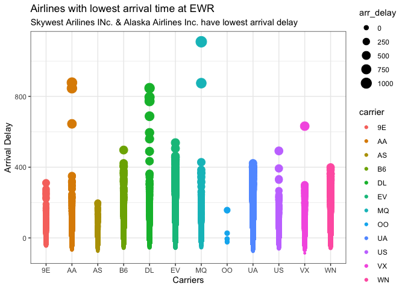
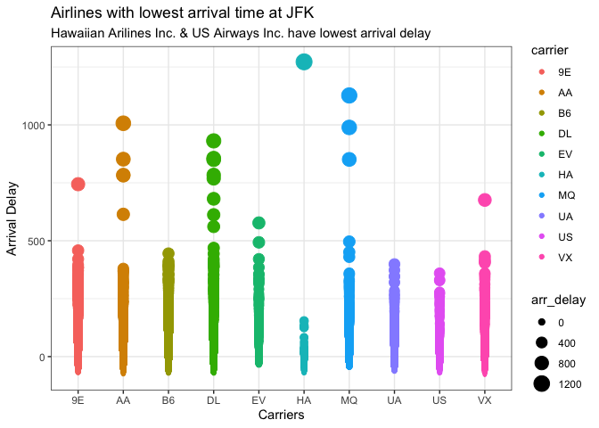
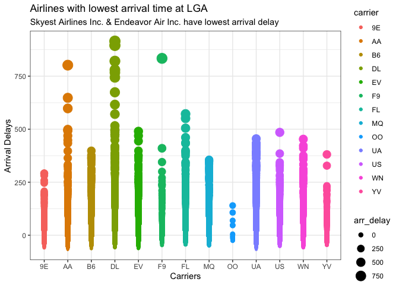
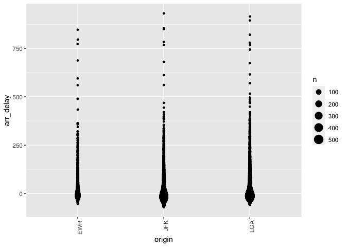
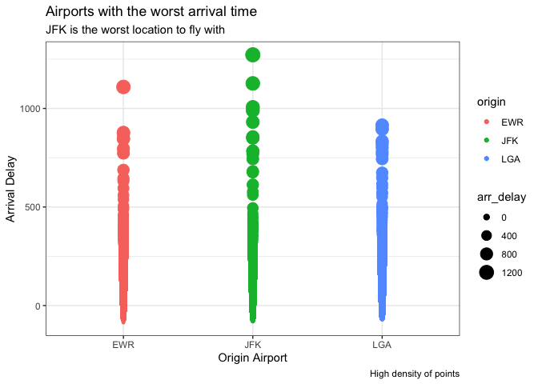

```r
library(nycflights13)
library(tidyverse)
```

```
## ── Attaching packages ─────────────────────────────────────── tidyverse 1.3.1 ──
```

```
## ✓ ggplot2 3.3.5     ✓ purrr   0.3.4
## ✓ tibble  3.1.6     ✓ dplyr   1.0.8
## ✓ tidyr   1.2.0     ✓ stringr 1.4.0
## ✓ readr   2.1.2     ✓ forcats 0.5.1
```

```
## ── Conflicts ────────────────────────────────────────── tidyverse_conflicts() ──
## x dplyr::filter() masks stats::filter()
## x dplyr::lag()    masks stats::lag()
```

```r
library(lubridate)
```

```
## 
## Attaching package: 'lubridate'
```

```
## The following objects are masked from 'package:base':
## 
##     date, intersect, setdiff, union
```

```r
library(ggrepel)
library(ggplot2)
library(readr)
library(knitr)
library(dplyr)
library(forcats)
library(downloader)
```


```r
?flights
str(flights)
```

```
## tibble [336,776 × 19] (S3: tbl_df/tbl/data.frame)
##  $ year          : int [1:336776] 2013 2013 2013 2013 2013 2013 2013 2013 2013 2013 ...
##  $ month         : int [1:336776] 1 1 1 1 1 1 1 1 1 1 ...
##  $ day           : int [1:336776] 1 1 1 1 1 1 1 1 1 1 ...
##  $ dep_time      : int [1:336776] 517 533 542 544 554 554 555 557 557 558 ...
##  $ sched_dep_time: int [1:336776] 515 529 540 545 600 558 600 600 600 600 ...
##  $ dep_delay     : num [1:336776] 2 4 2 -1 -6 -4 -5 -3 -3 -2 ...
##  $ arr_time      : int [1:336776] 830 850 923 1004 812 740 913 709 838 753 ...
##  $ sched_arr_time: int [1:336776] 819 830 850 1022 837 728 854 723 846 745 ...
##  $ arr_delay     : num [1:336776] 11 20 33 -18 -25 12 19 -14 -8 8 ...
##  $ carrier       : chr [1:336776] "UA" "UA" "AA" "B6" ...
##  $ flight        : int [1:336776] 1545 1714 1141 725 461 1696 507 5708 79 301 ...
##  $ tailnum       : chr [1:336776] "N14228" "N24211" "N619AA" "N804JB" ...
##  $ origin        : chr [1:336776] "EWR" "LGA" "JFK" "JFK" ...
##  $ dest          : chr [1:336776] "IAH" "IAH" "MIA" "BQN" ...
##  $ air_time      : num [1:336776] 227 227 160 183 116 150 158 53 140 138 ...
##  $ distance      : num [1:336776] 1400 1416 1089 1576 762 ...
##  $ hour          : num [1:336776] 5 5 5 5 6 5 6 6 6 6 ...
##  $ minute        : num [1:336776] 15 29 40 45 0 58 0 0 0 0 ...
##  $ time_hour     : POSIXct[1:336776], format: "2013-01-01 05:00:00" "2013-01-01 05:00:00" ...
```

```r
head(flights)
```

```
## # A tibble: 6 × 19
##    year month   day dep_time sched_dep_time dep_delay arr_time sched_arr_time
##   <int> <int> <int>    <int>          <int>     <dbl>    <int>          <int>
## 1  2013     1     1      517            515         2      830            819
## 2  2013     1     1      533            529         4      850            830
## 3  2013     1     1      542            540         2      923            850
## 4  2013     1     1      544            545        -1     1004           1022
## 5  2013     1     1      554            600        -6      812            837
## 6  2013     1     1      554            558        -4      740            728
## # … with 11 more variables: arr_delay <dbl>, carrier <chr>, flight <int>,
## #   tailnum <chr>, origin <chr>, dest <chr>, air_time <dbl>, distance <dbl>,
## #   hour <dbl>, minute <dbl>, time_hour <dttm>
```
Question 1. If I am leaving before noon, which two airlines do you recommend at each airport (JFK, LGA, EWR) that will havethe lowest delay time at the 75th percentile?

When approaching this question, I knew that I had to make a ggplot for all of EWR, JFK, and LGA. The code between these are similar, with simply keeping the x as carrier and y as arrival delay, it was clear to see that OO and HA were the most efficent airlines.


```r
EWRdata <- filter(flights, origin == "EWR")
head(EWRdata)
```

```
## # A tibble: 6 × 19
##    year month   day dep_time sched_dep_time dep_delay arr_time sched_arr_time
##   <int> <int> <int>    <int>          <int>     <dbl>    <int>          <int>
## 1  2013     1     1      517            515         2      830            819
## 2  2013     1     1      554            558        -4      740            728
## 3  2013     1     1      555            600        -5      913            854
## 4  2013     1     1      558            600        -2      923            937
## 5  2013     1     1      559            600        -1      854            902
## 6  2013     1     1      601            600         1      844            850
## # … with 11 more variables: arr_delay <dbl>, carrier <chr>, flight <int>,
## #   tailnum <chr>, origin <chr>, dest <chr>, air_time <dbl>, distance <dbl>,
## #   hour <dbl>, minute <dbl>, time_hour <dttm>
```


```r
EWRplot <- ggplot(data = EWRdata, mapping = aes(x = carrier, y = arr_delay, size = arr_delay, color = carrier)) +
  geom_point()+
  labs(x = "Carriers",
       y = "Arrival Delay",
       title = "Airlines with lowest arrival time at EWR",
       subtitle = "Skywest Arilines INc. & Alaska Airlines Inc. have lowest arrival delay") +
  theme_bw()
EWRplot
```

```
## Warning: Removed 3708 rows containing missing values (geom_point).
```

<!-- -->


```r
JFKdata <- filter(flights, origin == "JFK")
head(JFKdata)
```

```
## # A tibble: 6 × 19
##    year month   day dep_time sched_dep_time dep_delay arr_time sched_arr_time
##   <int> <int> <int>    <int>          <int>     <dbl>    <int>          <int>
## 1  2013     1     1      542            540         2      923            850
## 2  2013     1     1      544            545        -1     1004           1022
## 3  2013     1     1      557            600        -3      838            846
## 4  2013     1     1      558            600        -2      849            851
## 5  2013     1     1      558            600        -2      853            856
## 6  2013     1     1      558            600        -2      924            917
## # … with 11 more variables: arr_delay <dbl>, carrier <chr>, flight <int>,
## #   tailnum <chr>, origin <chr>, dest <chr>, air_time <dbl>, distance <dbl>,
## #   hour <dbl>, minute <dbl>, time_hour <dttm>
```


```r
JFKplot <- ggplot(data = JFKdata, mapping = aes(x = carrier, y = arr_delay, size = arr_delay, color = carrier)) +
  geom_point() +
  labs(x = "Carriers",
       y = "Arrival Delay",
       title = "Airlines with lowest arrival time at JFK",
       subtitle = "Hawaiian Arilines Inc. & US Airways Inc. have lowest arrival delay") +
  theme_bw()
JFKplot
```

```
## Warning: Removed 2200 rows containing missing values (geom_point).
```

<!-- -->


```r
LGAdata <- filter(flights, origin == "LGA")
head(LGAdata)
```

```
## # A tibble: 6 × 19
##    year month   day dep_time sched_dep_time dep_delay arr_time sched_arr_time
##   <int> <int> <int>    <int>          <int>     <dbl>    <int>          <int>
## 1  2013     1     1      533            529         4      850            830
## 2  2013     1     1      554            600        -6      812            837
## 3  2013     1     1      557            600        -3      709            723
## 4  2013     1     1      558            600        -2      753            745
## 5  2013     1     1      559            600        -1      941            910
## 6  2013     1     1      600            600         0      851            858
## # … with 11 more variables: arr_delay <dbl>, carrier <chr>, flight <int>,
## #   tailnum <chr>, origin <chr>, dest <chr>, air_time <dbl>, distance <dbl>,
## #   hour <dbl>, minute <dbl>, time_hour <dttm>
```


```r
LGAplot <- ggplot(data = LGAdata, mapping = aes(x = carrier, y = arr_delay, size = arr_delay, color = carrier)) +
  geom_point() +
  labs(x = "Carriers",
       y = "Arrival Delays",
       title = "Airlines with lowest arrival time at LGA",
       subtitle = "Skyest Airlines Inc. & Endeavor Air Inc. have lowest arrival delay") +
  theme_bw()
LGAplot
```

```
## Warning: Removed 3522 rows containing missing values (geom_point).
```

<!-- -->
Which origin airport is best to minimize my chances of a late arrival when I am using Delta Airlines?

EWR is the the best airport to fly with Delta as it has the lowest amount of arrival delays.

```r
Delta <- filter(flights, carrier == "DL", )
ggplot(Delta, aes(x = origin, y = arr_delay))+
  geom_count()+
    theme(axis.text.x=element_text(angle=90, hjust=1))
```

```
## Warning: Removed 452 rows containing non-finite values (stat_sum).
```

<!-- -->

Question 3: Which destination airport is the worst airport for arrival time?

Keep same ggplot code, except swap X for origin.

```r
WorstAirline <- ggplot(data = flights, mapping = aes(x = origin, y = arr_delay, color = origin, size = arr_delay)) +
  geom_point() +
  labs(x = "Origin Airport", 
       y = "Arrival Delay",
       title = "Airports with the worst arrival time",
       subtitle = "JFK is the worst location to fly with",
       caption = "High density of points") +
  theme_bw()
WorstAirline
```

```
## Warning: Removed 9430 rows containing missing values (geom_point).
```

<!-- -->

