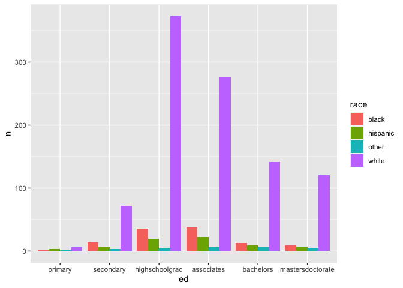
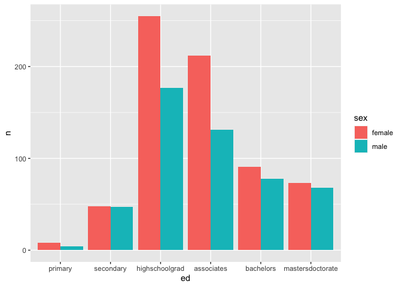
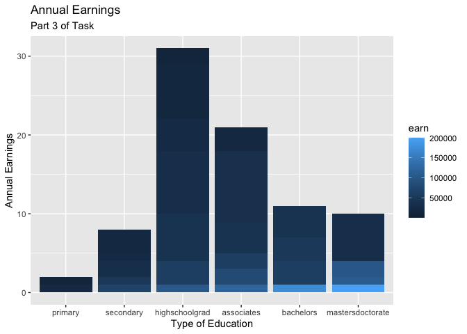

install.packages("lubridate")
install.packages("ggrepel")


```r
library(tidyverse)
```

```
## ── Attaching packages ─────────────────────────────────────── tidyverse 1.3.1 ──
```

```
## ✓ ggplot2 3.3.5     ✓ purrr   0.3.4
## ✓ tibble  3.1.6     ✓ dplyr   1.0.8
## ✓ tidyr   1.2.0     ✓ stringr 1.4.0
## ✓ readr   2.1.2     ✓ forcats 0.5.1
```

```
## ── Conflicts ────────────────────────────────────────── tidyverse_conflicts() ──
## x dplyr::filter() masks stats::filter()
## x dplyr::lag()    masks stats::lag()
```

```r
library(lubridate)
```

```
## 
## Attaching package: 'lubridate'
```

```
## The following objects are masked from 'package:base':
## 
##     date, intersect, setdiff, union
```

```r
library(ggrepel)
library(ggplot2)
library(readr)
library(knitr)
library(dplyr)
library(forcats)
library(downloader)
```

```r
download.file("https://raw.githubusercontent.com/hadley/r4ds/master/data/heights.csv", "heights")
```

```r
Height <- read_csv("heights")
```

```
## Rows: 1192 Columns: 6
## ── Column specification ────────────────────────────────────────────────────────
## Delimiter: ","
## chr (2): sex, race
## dbl (4): earn, height, ed, age
## 
## ℹ Use `spec()` to retrieve the full column specification for this data.
## ℹ Specify the column types or set `show_col_types = FALSE` to quiet this message.
```

```r
Height
```

```
## # A tibble: 1,192 × 6
##     earn height sex       ed   age race    
##    <dbl>  <dbl> <chr>  <dbl> <dbl> <chr>   
##  1 50000   74.4 male      16    45 white   
##  2 60000   65.5 female    16    58 white   
##  3 30000   63.6 female    16    29 white   
##  4 50000   63.1 female    16    91 other   
##  5 51000   63.4 female    17    39 white   
##  6  9000   64.4 female    15    26 white   
##  7 29000   61.7 female    12    49 white   
##  8 32000   72.7 male      17    46 white   
##  9  2000   72.0 male      15    21 hispanic
## 10 27000   72.2 male      12    26 white   
## # … with 1,182 more rows
```


```r
HeightEd <- Height %>%
  mutate(ed = as.factor(ed)) %>%
  mutate(ed = fct_recode(ed,
                         "primary" = "3",
                         "primary" = "4",
                         "primary" = "5",
                         "primary" = "6",
                         "secondary" = "7",
                         "secondary" = "8",
                         "secondary" = "9",
                         "secondary" = "10",
                         "secondary" = "11",
                         "highschoolgrad" = "12",
                         "associates" = "13",
                         "associates" = "14",
                         "associates" = "15",
                         "bachelors" =  "16",
                         "mastersdoctorate" = "17",
                         "mastersdoctorate" = "18"))
```


```r
HeightEd1 <- HeightEd %>%
  group_by(race) %>%
  count(ed)
HeightEd1
```

```
## # A tibble: 24 × 3
## # Groups:   race [4]
##    race     ed                   n
##    <chr>    <fct>            <int>
##  1 black    primary              2
##  2 black    secondary           14
##  3 black    highschoolgrad      36
##  4 black    associates          38
##  5 black    bachelors           13
##  6 black    mastersdoctorate     9
##  7 hispanic primary              3
##  8 hispanic secondary            6
##  9 hispanic highschoolgrad      19
## 10 hispanic associates          22
## # … with 14 more rows
```

```r
ggplot(HeightEd1, mapping = aes(ed,n, fill=race))+
  geom_bar(stat="identity", position="dodge")
```

<!-- -->

```r
HeightEd2 <- HeightEd %>%
  group_by(sex) %>%
  count(ed)
HeightEd2
```

```
## # A tibble: 12 × 3
## # Groups:   sex [2]
##    sex    ed                   n
##    <chr>  <fct>            <int>
##  1 female primary              8
##  2 female secondary           48
##  3 female highschoolgrad     255
##  4 female associates         212
##  5 female bachelors           91
##  6 female mastersdoctorate    73
##  7 male   primary              4
##  8 male   secondary           47
##  9 male   highschoolgrad     177
## 10 male   associates         131
## 11 male   bachelors           78
## 12 male   mastersdoctorate    68
```

```r
ggplot(HeightEd2, mapping = aes(ed,n, fill=sex))+
  geom_bar(stat="identity", position="dodge")
```

<!-- -->

```r
HeightEd3 <- HeightEd %>%
  group_by(earn) %>%
  count(ed)
HeightEd3
```

```
## # A tibble: 312 × 3
## # Groups:   earn [133]
##     earn ed                 n
##    <dbl> <fct>          <int>
##  1   200 highschoolgrad     1
##  2   200 bachelors          1
##  3   265 associates         1
##  4   400 highschoolgrad     1
##  5   600 secondary          1
##  6   600 highschoolgrad     2
##  7   700 highschoolgrad     1
##  8   700 bachelors          1
##  9  1000 highschoolgrad     5
## 10  1000 associates         3
## # … with 302 more rows
```

```r
ggplot(HeightEd3, mapping = aes(ed,n, fill=earn))+
  geom_bar(stat="identity", position="dodge")+
  labs(y = "Annual Earnings", x = "Type of Education", title = "Annual Earnings", subtitle = 'Part 3 of Task') 
```

<!-- -->

```r
#To construct this graph, I took the same formula that we had used for the previous comparisons between education and sex/race in that I made a tibble grouping the data together, except wanted to compare education and annual earnings. I could've added elements to increase the detail of the graph, but I believe the message of it is still clear, those with a masters degree or a bachelor's degree than those with less than, being either a high school diploma or an associates. 
```

