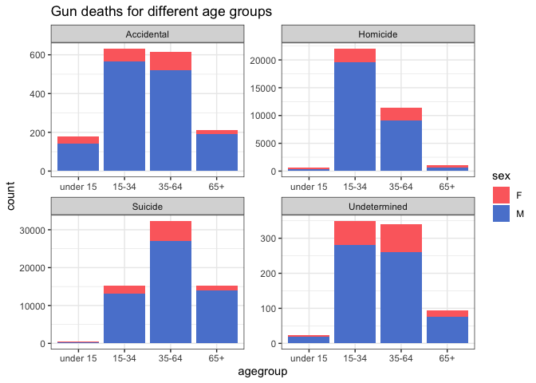
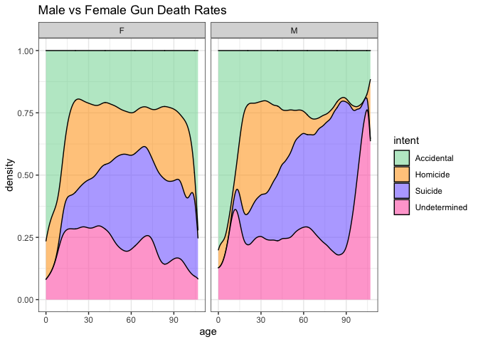
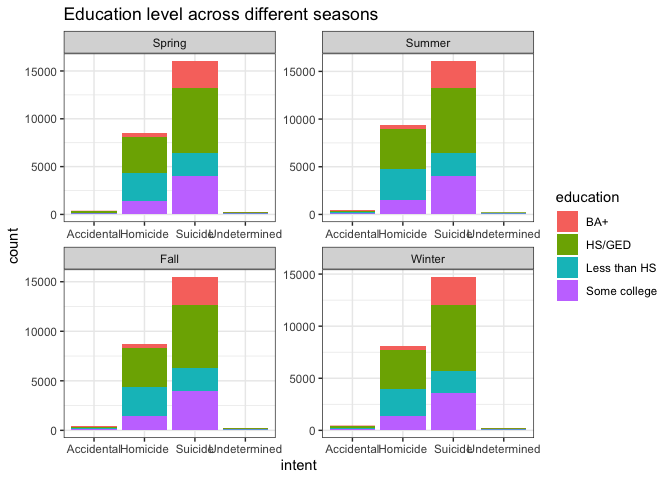
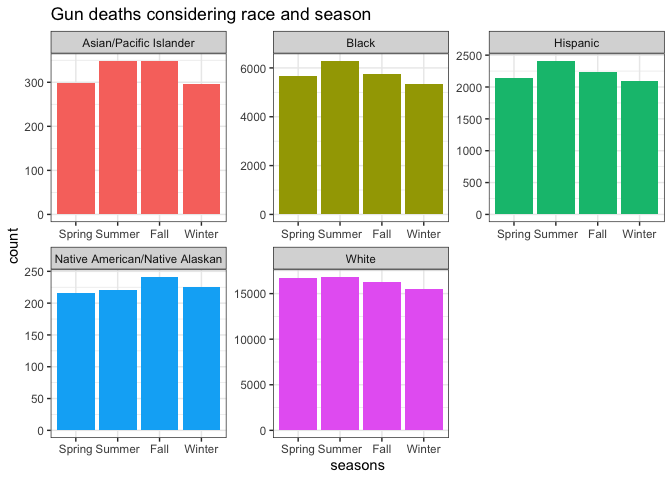

```r
library(tidyverse)
```

```
## ── Attaching packages ─────────────────────────────────────── tidyverse 1.3.1 ──
```

```
## ✓ ggplot2 3.3.5     ✓ purrr   0.3.4
## ✓ tibble  3.1.6     ✓ dplyr   1.0.8
## ✓ tidyr   1.2.0     ✓ stringr 1.4.0
## ✓ readr   2.1.2     ✓ forcats 0.5.1
```

```
## ── Conflicts ────────────────────────────────────────── tidyverse_conflicts() ──
## x dplyr::filter() masks stats::filter()
## x dplyr::lag()    masks stats::lag()
```

```r
library(downloader)
library(readxl)
```
Explaining the article: The interactive, malleable set of data allowed the user to break down different data groups and compare them to the total of all gun deaths. It was extremely effective in showing the scale of gun deaths in our country and how desparately we need solutions to these problems. One thing that was particularly shocking was the notion that 2/3 of all deaths were suicides. 


```r
GunData <- tempfile()
download("https://raw.githubusercontent.com/fivethirtyeight/guns-data/master/full_data.csv", GunData, mode = "wb")
gunData <- read_csv(GunData)
```

```
## New names:
## * `` -> ...1
```

```
## Rows: 100798 Columns: 11
## ── Column specification ────────────────────────────────────────────────────────
## Delimiter: ","
## chr (6): month, intent, sex, race, place, education
## dbl (5): ...1, year, police, age, hispanic
## 
## ℹ Use `spec()` to retrieve the full column specification for this data.
## ℹ Specify the column types or set `show_col_types = FALSE` to quiet this message.
```

```r
gunData_new <- gunData %>%
  filter(age != "", intent != "")
str(gunData)
```

```
## spec_tbl_df [100,798 × 11] (S3: spec_tbl_df/tbl_df/tbl/data.frame)
##  $ ...1     : num [1:100798] 1 2 3 4 5 6 7 8 9 10 ...
##  $ year     : num [1:100798] 2012 2012 2012 2012 2012 ...
##  $ month    : chr [1:100798] "01" "01" "01" "02" ...
##  $ intent   : chr [1:100798] "Suicide" "Suicide" "Suicide" "Suicide" ...
##  $ police   : num [1:100798] 0 0 0 0 0 0 0 0 0 0 ...
##  $ sex      : chr [1:100798] "M" "F" "M" "M" ...
##  $ age      : num [1:100798] 34 21 60 64 31 17 48 41 50 NA ...
##  $ race     : chr [1:100798] "Asian/Pacific Islander" "White" "White" "White" ...
##  $ hispanic : num [1:100798] 100 100 100 100 100 100 100 100 100 998 ...
##  $ place    : chr [1:100798] "Home" "Street" "Other specified" "Home" ...
##  $ education: chr [1:100798] "BA+" "Some college" "BA+" "BA+" ...
##  - attr(*, "spec")=
##   .. cols(
##   ..   ...1 = col_double(),
##   ..   year = col_double(),
##   ..   month = col_character(),
##   ..   intent = col_character(),
##   ..   police = col_double(),
##   ..   sex = col_character(),
##   ..   age = col_double(),
##   ..   race = col_character(),
##   ..   hispanic = col_double(),
##   ..   place = col_character(),
##   ..   education = col_character()
##   .. )
##  - attr(*, "problems")=<externalptr>
```


```r
gunsData <- gunData_new %>%
  mutate(agegroup =
          case_when(
            age >= 0 & age <= 14 ~ "under 15",
            age >= 15 & age <= 34 ~ "15-34",
            age >= 35 & age <= 64 ~ "35-64",
            age >= 65 ~ "65+"),
         agegroup = fct_relevel(agegroup, 
            "under 15", "15-34", "35-64", 
            "65+"))
```


```r
ggplot(data = gunsData, aes(x = agegroup, fill = sex)) +
  geom_bar() +
  facet_wrap(~intent, nrow = 2, scales = 'free') +
  scale_fill_manual(values = c('#FD6D6D', '#5A84D3')) +
  ggtitle("Gun deaths for different age groups") +
  theme_bw()
```

<!-- -->


```r
ggplot(data = gunData_new, aes(x = age, fill = intent)) +
  geom_density(position = 'fill', alpha = .6) +
  facet_wrap(~sex) +
  scale_fill_manual(values = c("#8CDBAA","#FFA727","lightslateblue","hotpink")) +
  ggtitle("Male vs Female Gun Death Rates") +
  theme_bw()
```

<!-- -->


```r
season <- gunData_new %>%
  filter(education != "") %>%
  mutate(seasons = as.factor(fct_collapse(month,
          "Spring" = c("03", "04", "05"),
          "Summer" = c("06", "07", "08"),
          "Fall" = c("09", "10", "11"),
          "Winter" = c("12", "01", "02"))),
         seasons = fct_relevel(seasons, 
            "Spring", "Summer", "Fall", 
            "Winter")
  )
```


```r
ggplot(season, aes(intent, fill = education)) +
  geom_bar() +
  facet_wrap(~seasons, scales = "free") +
  ggtitle("Education level across different seasons") +
  theme_bw()
```

<!-- -->


```r
ggplot(season, aes(seasons, fill = race)) +
  geom_bar() +
  facet_wrap(~race, scales = 'free') +
  ggtitle("Gun deaths considering race and season") +
  theme_bw() +
  theme(legend.position = 'none')
```

<!-- -->

