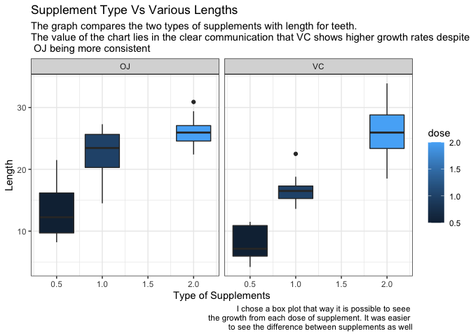
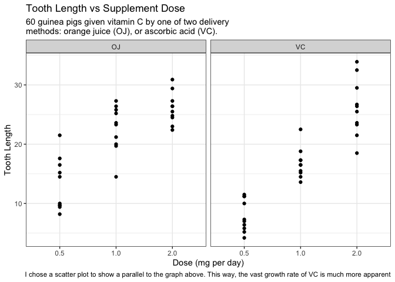

```r
library(tidyverse)
```

```
## ── Attaching packages ─────────────────────────────────────── tidyverse 1.3.1 ──
```

```
## ✓ ggplot2 3.3.5     ✓ purrr   0.3.4
## ✓ tibble  3.1.6     ✓ dplyr   1.0.8
## ✓ tidyr   1.2.0     ✓ stringr 1.4.0
## ✓ readr   2.1.2     ✓ forcats 0.5.1
```

```
## ── Conflicts ────────────────────────────────────────── tidyverse_conflicts() ──
## x dplyr::filter() masks stats::filter()
## x dplyr::lag()    masks stats::lag()
```

```r
library(RColorBrewer)
library(viridis)
```

```
## Loading required package: viridisLite
```

```r
ggplot(data = ToothGrowth, mapping = aes(x = len, y = dose, fill = dose, group = dose)) +
  geom_boxplot() +
  facet_wrap(~ supp, nrow = 1) +
  coord_flip() +
  labs(x = "Length",
       y = "Type of Supplements",
       title = "Supplement Type Vs Various Lengths",
       subtitle = "The graph compares the two types of supplements with length for teeth. \nThe value of the chart lies in the clear communication that VC shows higher growth rates despite\n OJ being more consistent",
       caption = "I chose a box plot that way it is possible to seee \nthe growth from each dose of supplement. It was easier \nto see the difference between supplements as well") +
  theme_bw()
```

<!-- -->


```r
ggplot(data = ToothGrowth, aes(factor(dose), len)) +
  geom_point() +
  scale_x_discrete(labels = c('0.5','1.0','2.0')) +
  facet_wrap(~supp, nrow = 1) +
  labs(x = "Dose (mg per day)",
       y = "Tooth Length",
       title = "Tooth Length vs Supplement Dose",
       subtitle = "60 guinea pigs given vitamin C by one of two delivery\nmethods: orange juice (OJ), or ascorbic acid (VC).",
      caption = "I chose a scatter plot to show a parallel to the graph above. This way, the vast growth rate of VC is much more apparent") +
  theme_bw()
```

<!-- -->
