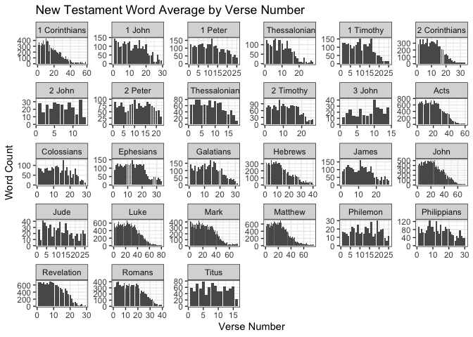

#Packages

```r
library(tidyverse)
```

```
## ── Attaching packages ─────────────────────────────────────── tidyverse 1.3.1 ──
```

```
## ✔ ggplot2 3.3.5     ✔ purrr   0.3.4
## ✔ tibble  3.1.6     ✔ dplyr   1.0.8
## ✔ tidyr   1.2.0     ✔ stringr 1.4.0
## ✔ readr   2.1.2     ✔ forcats 0.5.1
```

```
## ── Conflicts ────────────────────────────────────────── tidyverse_conflicts() ──
## ✖ dplyr::filter() masks stats::filter()
## ✖ dplyr::lag()    masks stats::lag()
```

```r
library(stringi)
library(stringr)
library(downloader)
library(readr)
```

#Temp file for bible data

```r
bibledata <- tempfile()
download.file("https://github.com/WJC-Data-Science/DTS350/raw/master/bible.csv",bibledata, mode="wb")
bibledata
```

```
## [1] "/var/folders/gs/36w5zsj56dn9y2r788gh65r80000gn/T//RtmpqsywGi/file1d1e7a346166"
```

```r
bible <- read_csv(bibledata)
```

```
## Rows: 31102 Columns: 17
## ── Column specification ────────────────────────────────────────────────────────
## Delimiter: ","
## chr (9): volume_title, book_title, volume_long_title, book_long_title, volum...
## dbl (6): volume_id, book_id, chapter_id, verse_id, chapter_number, verse_number
## lgl (2): volume_subtitle, book_subtitle
## 
## ℹ Use `spec()` to retrieve the full column specification for this data.
## ℹ Specify the column types or set `show_col_types = FALSE` to quiet this message.
```

```r
head(bible)
```

```
## # A tibble: 6 × 17
##   volume_id book_id chapter_id verse_id volume_title book_title volume_long_tit…
##       <dbl>   <dbl>      <dbl>    <dbl> <chr>        <chr>      <chr>           
## 1         1       1          1        1 Old Testame… Genesis    The Old Testame…
## 2         1       1          1        2 Old Testame… Genesis    The Old Testame…
## 3         1       1          1        3 Old Testame… Genesis    The Old Testame…
## 4         1       1          1        4 Old Testame… Genesis    The Old Testame…
## 5         1       1          1        5 Old Testame… Genesis    The Old Testame…
## 6         1       1          1        6 Old Testame… Genesis    The Old Testame…
## # … with 10 more variables: book_long_title <chr>, volume_subtitle <lgl>,
## #   book_subtitle <lgl>, volume_short_title <chr>, book_short_title <chr>,
## #   chapter_number <dbl>, verse_number <dbl>, scripture_text <chr>,
## #   verse_title <chr>, verse_short_title <chr>
```

# Create Word Counter

```r
wordcount <- bible %>%
  mutate(word_count =
           sapply(bible$scripture_text, function(x) length(unlist(strsplit(as.character(x), "\\W+"))))
  )
```

# Old Testament average

```r
OldTest <- wordcount %>%
  subset(volume_id == 1)
mean(OldTest$word_count)
```

```
## [1] 26.42208
```

# New Testament average

```r
NewTest <- wordcount %>%
  subset(volume_id == 2)
mean(NewTest$word_count)
```

```
## [1] 22.71019
```
# Finding lord frequency 

```r
str_count(OldTest, "(?i)lord")
```

```
## Warning in stri_count_regex(string, pattern, opts_regex = opts(pattern)):
## argument is not an atomic vector; coercing
```

```
##  [1]    0    0    0    0    0    0    0    0    0    0    0    0    0    0 7273
## [16]    0    0 7273
```

```r
str_count(NewTest, "(?i)lord")
```

```
## Warning in stri_count_regex(string, pattern, opts_regex = opts(pattern)):
## argument is not an atomic vector; coercing
```

```
##  [1]   0   0   0   0   0   0   0   0   0   0   0   0   0   0 736   0   0 736
```
# Question 3 Visualization

```r
ggplot(data = NewTest, aes(x = verse_number, y = word_count)) +
  geom_col() +
  facet_wrap(~book_title, scales = 'free') +
  theme_bw() +
  labs(x = "Verse Number",
       y = "Word Count",
       title = "New Testament Word Average by Verse Number")
```

<!-- -->

# As shown in the code above, the calculated word average for the Old Testament was 26.4 whereas the New Testament average was found to be 22.7. For the answer to question 2, Lord was found to have been used 7273 times in the Old Testament, but only was used 736 times. This makes sense as the Old Testament focuses more on the origins of Christ and his relationship with the lord, whereas the New Testament is focused on everything after that, however I am not in tune too much with my spirtual side so I could be wrong on that. For question 3, one observation that I made was that the large majority of books begin with a lot of words in the beginning verse numbers but suffers a drop off towards the end. 
